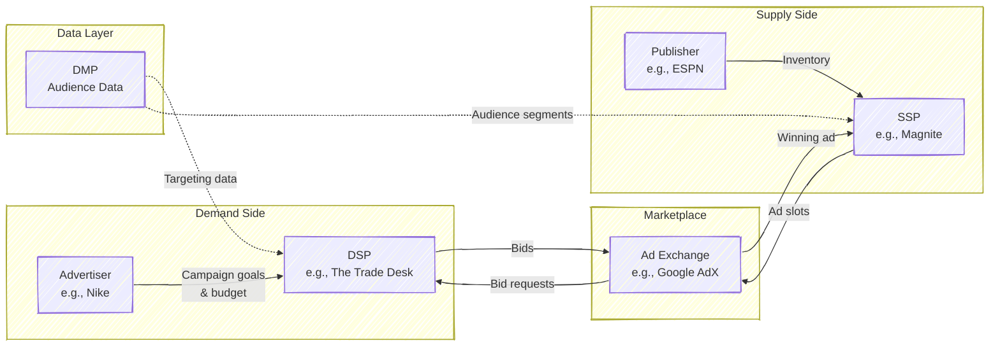
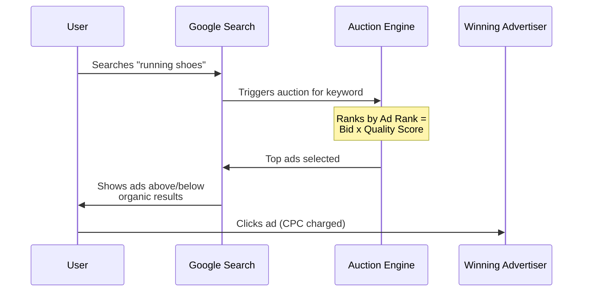
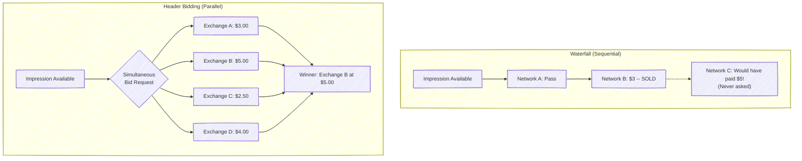
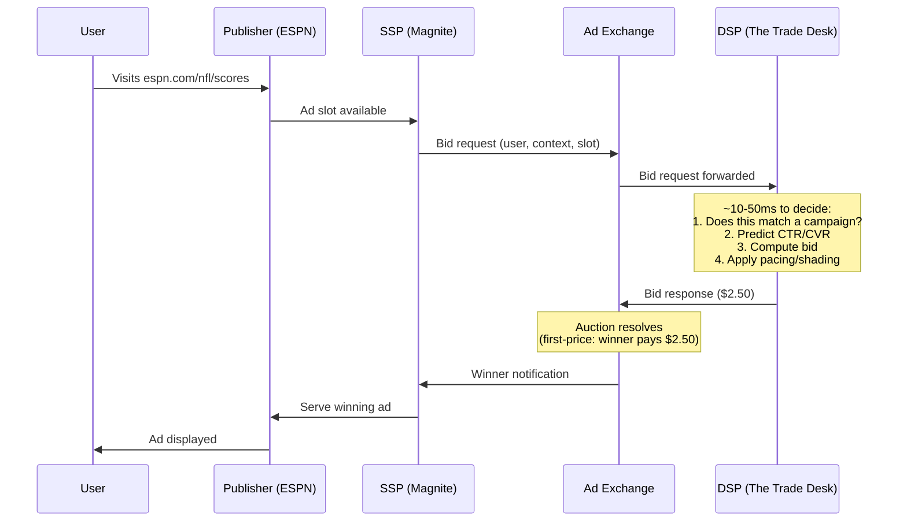
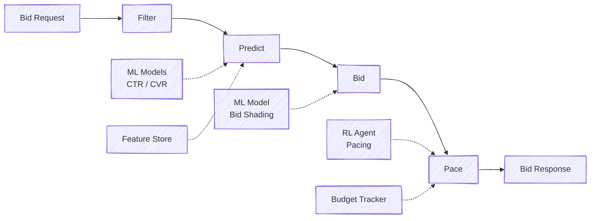

# Chapter 1: The Online Advertising Ecosystem

---

## 1.1 Why Online Advertising Matters

Online advertising is the economic engine of the free internet. Every time you use a search engine, read a news article, scroll a social media feed, or stream a video, advertising is subsidizing your access. In the United States alone, digital advertising revenue exceeded $200 billion in 2024, surpassing the combined revenue of cable and broadcast television. Globally, the market approaches $700 billion.

For an ML/RL engineer, this industry is not merely large -- it is uniquely rich in the kinds of problems that demand your expertise. Consider what makes it special:

- **Scale**: Major platforms conduct billions of ad auctions per day, each resolved in under 100 milliseconds. Google alone processes an estimated 8.5 billion searches per day, each triggering ad auctions.
- **Sequential decision-making**: An advertiser's budget must be allocated across a day's (or week's, or month's) auctions. Spending decisions now constrain future opportunities -- a classic RL setting.
- **Prediction under uncertainty**: Click-through rates typically range from 0.1% to 2%, meaning your models predict rare events at massive scale, with billions of dollars riding on accuracy.
- **Strategic interaction**: Multiple bidding algorithms compete simultaneously in auctions, creating game-theoretic dynamics where your optimal strategy depends on your competitors' behavior.
- **Hard constraints**: Real money, finite budgets, ROI targets, brand safety requirements, and privacy regulations all create constraints that pure ML approaches must respect.

The concentration of this market is striking. Google and Meta together capture roughly 50--60% of all digital ad revenue, with Amazon rapidly growing as a third major force. Understanding how these companies' systems work gives you insight into how the majority of the industry operates.

> **For the RL Engineer**: If you are coming from robotics or game-playing AI, think of the ad auction as an environment with a massive action space (continuous bid values), extremely fast episodes (each auction is one step), delayed and sparse rewards (conversions may happen hours after a click), and thousands of concurrent competing agents. The budget constraint turns what might otherwise be a contextual bandit problem into a full sequential decision problem.

## 1.2 The Key Players

The online advertising ecosystem has evolved into a complex marketplace with specialized intermediaries connecting advertisers (who want to show ads) with publishers (who have screen real estate to sell). The ecosystem can feel overwhelming at first, but there is a clean logic to its structure: it mirrors any two-sided marketplace, with technology platforms facilitating transactions between buyers and sellers.

### Advertisers

Advertisers are the ultimate source of money in the system. They range from global brands like Nike and Coca-Cola running awareness campaigns to small e-commerce shops bidding on performance. An advertiser typically specifies a campaign with targeting criteria (who should see the ad), creative assets (the actual ad content), a budget (how much to spend), and a goal (impressions, clicks, conversions, or return on ad spend).

### Publishers

Publishers are the supply side -- they own the digital real estate where ads appear. This ranges from premium publishers like The New York Times and ESPN to the vast "long tail" of smaller websites and apps. Publishers want to maximize the revenue they earn from their ad inventory while maintaining a good user experience.

### Demand-Side Platforms (DSPs)

DSPs are the automated buying systems that act on behalf of advertisers. When a publisher has an ad slot to fill, the DSP receives a bid request describing the user and context, decides whether and how much to bid, and submits the bid -- all within milliseconds. **This is where you, the ML/RL engineer, will likely work.** The bidding logic inside a DSP is the primary application of ML and RL in this ecosystem.

Major DSPs include The Trade Desk (the largest independent DSP), Google's Display & Video 360 (DV360), Amazon DSP, and MediaMath.

### Supply-Side Platforms (SSPs)

SSPs serve the complementary role for publishers. They manage a publisher's inventory, connect to multiple ad exchanges and DSPs, and run auctions to maximize yield. Think of the SSP as the publisher's automated sales agent, ensuring every impression goes to the highest bidder. Major SSPs include Google Ad Manager, Magnite (formerly Rubicon Project), PubMatic, OpenX, and Index Exchange.

### Ad Exchanges

Ad exchanges are the marketplaces where DSPs and SSPs meet. They receive available impressions from SSPs, solicit bids from DSPs, run the auction, and facilitate the transaction. Google's AdX is the dominant exchange, but others include those operated by Amazon, Xandr (Microsoft), and Magnite.

### Data Management Platforms (DMPs)

DMPs collect, organize, and activate audience data that enables targeting. They aggregate data from multiple sources -- browsing behavior, purchase history, demographics -- into audience segments that advertisers can target. This role is evolving rapidly due to privacy regulations and the deprecation of third-party cookies.

> **Key Insight**: Many companies play multiple roles simultaneously. Google operates as a DSP (DV360), an SSP and exchange (Google Ad Manager / AdX), an ad server, and a publisher (YouTube, Search). This vertical integration is a major source of market power and a recurring subject of regulatory scrutiny -- including the 2024 U.S. Department of Justice antitrust case specifically targeting Google's ad-tech dominance.

### A Real-Estate Analogy

If the terminology feels abstract, consider this mapping:

| Ad Tech Role | Real Estate Analogy |
|---|---|
| **Advertiser** | Home buyer with specific needs and a budget |
| **Publisher** | Home seller with a property to offer |
| **DSP** | Buyer's agent -- evaluates properties, places bids algorithmically |
| **SSP** | Seller's agent -- lists property, manages showings |
| **Ad Exchange** | The auction house where the sale happens |
| **DMP** | The market researcher and appraiser |

The key difference is speed. In real estate, a transaction takes weeks. In ad tech, the equivalent process -- from listing to bid to sale -- happens in under 100 milliseconds, billions of times per day.

## 1.3 Types of Online Advertising

Not all digital advertising works the same way. The type of advertising determines the auction mechanism, the pricing model, the targeting approach, and consequently the ML problems you will work on.

### Search Advertising

Search advertising is the original and still the most lucrative form of automated ad bidding. When a user searches "running shoes" on Google, advertisers who have targeted that keyword compete in an auction to have their ads shown alongside the organic results. Google's search advertising revenue alone was approximately $175 billion in 2023.

The key characteristics of search advertising are high user intent (the user is actively looking for something), keyword-based targeting, cost-per-click pricing, and the Generalized Second-Price (GSP) auction mechanism -- though Google has been incorporating elements of first-price pricing in recent years. Because the user's intent is explicitly expressed through their query, click-through rates in search advertising are substantially higher than in display -- typically 2--5% for well-targeted ads.

> **Historical Note**: Google's AdWords (now Google Ads) launched in 2000 with a simple CPM model. In 2002, they switched to a CPC auction modeled after Overture's (later Yahoo's) system but added the critical innovation of Quality Score -- multiplying bids by an ad quality factor. This seemingly small change had profound game-theoretic implications, which we explore in Chapter 2.

### Display Advertising

Display advertising encompasses banner ads, video ads, and rich media that appear on websites and apps. When you visit ESPN.com and see a banner ad for a car brand, that impression was likely sold through a real-time bidding (RTB) auction that completed in under 100 milliseconds while the page was loading.

Display advertising is where RTB dominates and where the ML problems are most acute. User intent is lower than in search (the user is browsing, not searching for a product), so targeting must be more sophisticated -- relying on who the user is (audience targeting) and what content they are viewing (contextual targeting). Click-through rates are much lower, typically 0.1--2%, making accurate CTR prediction both more difficult and more valuable.

The auction mechanism for display has converged on first-price auctions, a relatively recent shift from the second-price auctions that dominated the RTB era. This transition, which we discuss in detail later in this chapter, created an entirely new class of ML problems.

### Social Media Advertising

Platforms like Meta (Facebook, Instagram), TikTok, Snapchat, and LinkedIn run their own closed advertising ecosystems. These platforms have extraordinarily rich user data -- social connections, interests, behaviors, engagement patterns -- which enables precise targeting. Meta's advertising system, which serves over 10 million active advertisers, runs its own auction mechanism that incorporates predicted engagement, ad quality, and estimated action rates.

What makes social media advertising distinct from the open RTB ecosystem is that these platforms are vertically integrated: they are simultaneously the publisher, the exchange, and (increasingly) the bidding optimizer. When you use Meta's Advantage+ campaign type, Meta's own ML models are deciding what bid to place in Meta's own auction to show an ad on Meta's own inventory. This "walled garden" model gives the platform extraordinary power to optimize across the full stack, but it means third-party DSPs have limited access.

> **Industry Example**: Meta's advertising auction does not simply rank by bid. Their total value score combines the advertiser's bid, the estimated action rate (their equivalent of pCTR x pCVR), and an ad quality score that penalizes low-quality or policy-violating ads. This three-factor ranking means that a lower bid with higher predicted engagement can beat a higher bid -- a design that aligns platform revenue with user experience.

### Video and Connected TV Advertising

Video advertising -- pre-roll ads on YouTube, mid-roll ads in streaming content, and ads on connected TV (CTV) platforms -- is the fastest-growing segment. YouTube alone generated over $30 billion in ad revenue in 2023. CTV is particularly interesting because it combines the targeting capabilities of digital with the large-screen, high-attention format of traditional television.

The move from linear television (where ads are bought in bulk, targeting demographics rather than individuals) to CTV (where each ad can be targeted to a specific household) represents the same shift from direct sales to programmatic that display advertising underwent a decade earlier. This means new RTB-style auction markets are emerging, and the bidding and allocation problems are being recreated in a new medium.

### Native Advertising

Native ads match the form and function of their surrounding content -- sponsored articles, promoted listings on e-commerce sites, recommended content widgets. They blur the line between advertising and editorial content, which raises both effectiveness and ethical considerations.

### A Summary of Ad Types

| Format | Intent Level | Targeting | Typical Pricing | Auction Type |
|---|---|---|---|---|
| Search | High (active query) | Keyword | CPC | GSP / first-price hybrid |
| Display | Low (passive browsing) | Audience + contextual | CPM | First-price RTB |
| Social | Medium (passive, rich data) | Behavioral + social | CPC/CPA | Platform-specific |
| Video/CTV | Variable | Audience + contextual | CPM/CPCV | Emerging RTB |
| Native | Medium | Contextual + behavioral | CPC | Platform-specific |

## 1.4 Pricing Models

Pricing models determine what advertisers pay for and, consequently, what your ML systems must optimize. Understanding the relationships between pricing models is essential because the auction mechanism almost always operates in one currency (typically CPM), while advertisers think in another (typically CPA or ROAS).

### CPM: Cost Per Mille

Under CPM pricing, the advertiser pays a fixed rate for every 1,000 impressions served, regardless of whether users interact with the ad. If an advertiser pays a $5 CPM, they spend $5 for every 1,000 times their ad is displayed. CPM is the native currency of display advertising and the auction mechanism itself. It is used primarily for brand awareness campaigns where the goal is visibility and reach rather than direct response.

### CPC: Cost Per Click

Under CPC pricing, the advertiser pays only when a user clicks on the ad. This shifts risk from the advertiser to the publisher (or platform): if the ad is shown 10,000 times but no one clicks, the advertiser pays nothing. CPC is the dominant model in search advertising and is common in display when advertisers want to drive traffic. Typical CPC rates range from $0.10 for broad display to $5+ for competitive search keywords, with some financial and legal keywords exceeding $50 per click.

### CPA: Cost Per Action

CPA pricing charges the advertiser only when a desired action occurs -- a purchase, a signup, an app install, a lead form submission. This pushes even more risk to the publisher or platform. CPA is the model most aligned with advertiser goals but requires robust conversion tracking and attribution.

### The Conversion Funnel and Pricing Relationships

These pricing models correspond to successive stages of the user's journey from impression to action. The mathematical relationships between them are mediated by two critical rates:

$$\text{CTR} = \frac{\text{clicks}}{\text{impressions}} \qquad \text{CVR} = \frac{\text{conversions}}{\text{clicks}}$$

From these, the conversions between pricing models follow directly:

$$\text{eCPC} = \frac{\text{CPM}}{\text{CTR} \times 1000}$$

$$\text{eCPA} = \frac{\text{eCPC}}{\text{CVR}} = \frac{\text{CPM}}{\text{CTR} \times \text{CVR} \times 1000}$$

| Pricing Model | Advertiser Pays For | Risk Bearer | Typical Use |
|---|---|---|---|
| CPM | Impressions | Advertiser | Brand awareness |
| CPC | Clicks | Publisher/Platform | Traffic, consideration |
| CPA | Conversions | Publisher/Platform | Direct response, e-commerce |

> **Key Insight**: Regardless of the advertiser's pricing model, the auction almost always operates on eCPM (effective CPM). The DSP internally converts any CPC or CPA goal into a CPM bid using the formula $\text{bid}_{\text{CPM}} = \text{CPA}_{\text{target}} \times p(\text{CTR}) \times p(\text{CVR}) \times 1000$. This conversion is precisely where ML prediction meets bidding. Errors in $p(\text{CTR})$ and $p(\text{CVR})$ translate directly into over- or under-bidding -- and therefore into wasted budget or missed opportunities.

### A Worked Example

Consider an e-commerce advertiser selling running shoes with a target CPA of $50 (they are willing to pay up to $50 per purchase). The DSP's ML models estimate, for a particular impression, that $p(\text{CTR}) = 0.2\%$ and $p(\text{CVR}) = 5\%$. The eCPM bid should be:

$$\text{bid}_{\text{CPM}} = \$50 \times 0.002 \times 0.05 \times 1000 = \$5.00$$

If the DSP overestimates the CTR at 0.4% instead of the true 0.2%, the bid doubles to $10 CPM, and the advertiser ends up paying roughly twice their target CPA for each conversion. This illustrates why CTR prediction accuracy is so economically consequential.

## 1.5 The Evolution of Online Advertising

The advertising ecosystem did not spring into existence fully formed. Understanding its evolution explains why the current system has the structure it does -- and where the remaining opportunities for ML/RL engineers lie.

### Era 1: Direct Sales (1994--2005)

The first banner ad appeared on HotWired.com on October 27, 1994 -- an AT&T ad that famously asked "Have you ever clicked your mouse right HERE?" with a 44% click-through rate (a number that will never be seen again). In this era, publisher sales teams negotiated directly with advertisers, agreeing on fixed prices for specific ad placements over defined time periods. There was no targeting, no optimization, and no automation. Premium publishers could charge high rates, but the process was manual and inefficient.

### Era 2: Ad Networks (2000--2010)

Ad networks emerged as intermediaries, aggregating inventory from many publishers and selling it to advertisers with basic targeting (contextual, demographic). The dominant allocation model was the "waterfall": when an impression became available, it was offered first to the highest-priority ad network. If that network declined, it went to the next, and so on.

The waterfall model was fundamentally suboptimal. Because networks were offered inventory sequentially rather than competitively, a willing buyer in a lower-priority network might never see an impression that a higher-priority network passed on, even though the lower-priority buyer would have paid more.

### Era 3: Ad Exchanges and RTB (2007--2017)

The pivotal moment was Google's acquisition of DoubleClick in 2007 for $3.1 billion, which gave Google the infrastructure to create a real-time auction marketplace. Rather than sequential offering, every impression was now sold individually in a real-time auction, with multiple buyers bidding simultaneously.

This era saw the standardization of the OpenRTB protocol, the rise of demand-side platforms, and the establishment of second-price auctions (Vickrey-style) as the dominant mechanism. The RTB ecosystem grew explosively -- RTB spending in the US grew from negligible in 2010 to over $25 billion by 2017.

> **Industry Example**: The iPinYou dataset, one of the few publicly available RTB datasets, comes from this era. It contains bid logs from a Chinese DSP operating in RTB exchanges during 2013, including bid requests, bid responses, impressions, clicks, and conversions. Despite its age, it remains a standard benchmark for RTB research because real-world bidding data is extremely proprietary.

### Era 4: Header Bidding and First-Price Auctions (2015--Present)

Two interconnected changes transformed the ecosystem in the mid-2010s.

**Header bidding** was a publisher-side innovation that replaced the sequential waterfall with parallel competition. Instead of offering an impression to one exchange at a time, publishers embedded JavaScript in their page headers that simultaneously solicited bids from multiple exchanges and SSPs. The highest bid across all sources won.

Header bidding increased publisher revenue by 20--50% by ensuring true competition for every impression. But it also precipitated a second, more consequential change: the **shift from second-price to first-price auctions**.

In a second-price auction, the winner pays the second-highest bid. In a first-price auction, the winner pays their own bid. When multiple second-price auctions competed via header bidding, the resulting dynamics were confusing and inefficient -- bids that were "second prices" from one auction competed against "second prices" from another, creating unpredictable outcomes. The industry converged on first-price auctions for their simplicity and transparency: you bid what you bid, and if you win, you pay it.

This transition had enormous implications for ML engineers:

| Aspect | Second-Price Era | First-Price Era |
|---|---|---|
| Optimal strategy | Bid your true value | Shade your bid below true value |
| ML focus | Predict value accurately (CTR/CVR) | Predict value AND optimal bid shading |
| New ML problem | -- | Bid landscape forecasting, market price prediction |
| Bidder surplus | Automatic (pay less than you bid) | Must be engineered through shading |

> **Key Insight**: The shift to first-price auctions created the **bid shading** problem -- an entirely new ML application. DSPs now need models that predict the minimum winning bid for each auction so they can shade their bids just above it. Getting this right saves advertisers millions of dollars. Getting it wrong means either overpaying (bidding too high) or losing auctions you should have won (bidding too low). This is a regression problem with censored observations: you only see the clearing price for auctions you win.

### Era 5: Auto-Bidding and AI (2019--Present)

The current era is defined by platforms increasingly automating bidding decisions. Google's Smart Bidding, Meta's Advantage+, and similar systems use ML and RL to set bids on behalf of advertisers, who specify only high-level goals (target CPA, target ROAS) and budgets. This is a fundamental shift: the advertiser moves from specifying *how* to bid to specifying *what* they want to achieve.

This creates a two-level optimization structure that is the subject of active research. At the inner level, the platform's auto-bidder optimizes bids to achieve the advertiser's stated goal. At the outer level, the platform designs the auction mechanism knowing that bidders are algorithms, not humans. Aggarwal et al. (2024) provide a comprehensive survey of this rapidly evolving landscape.

Simultaneously, privacy regulations (GDPR in Europe, Apple's App Tracking Transparency, the eventual deprecation of third-party cookies) are disrupting the targeting signals that bidding algorithms rely on. This is pushing the industry toward first-party data strategies, contextual targeting, and privacy-preserving ML techniques.

**This is where you come in.** The intersection of auto-bidding, RL-based optimization, and privacy-constrained learning defines the frontier of the field.

## 1.6 The OpenRTB Protocol

When a user visits a webpage with ad slots, a structured conversation unfolds between the publisher's SSP and the various DSPs in the ecosystem. This conversation follows the OpenRTB (Real-Time Bidding) protocol, an IAB Tech Lab standard that defines the format of bid requests and bid responses.

A bid request contains structured information about the available impression, the user (to the extent known and permitted by privacy regulations), the publisher context, and the device. Key fields include the ad slot dimensions and format, a bid floor (minimum acceptable bid), the publisher's domain and content category, user identifiers and demographic/behavioral signals, and device information.

The DSP must evaluate this information, match it against active campaigns, run its prediction models, compute a bid, and return a bid response -- all within the exchange's timeout, typically 100 milliseconds end-to-end, of which the DSP may have only 10--50 milliseconds for its own processing.

The entire global RTB ecosystem processes on the order of 10 million bid requests per second. A large DSP might see millions of these per second and choose to bid on only a fraction -- perhaps 5--30%, depending on campaign targeting and bid floor filtering.

> **Key Insight**: The latency constraint is not just an engineering challenge -- it shapes what ML models are feasible. A CTR prediction model that takes 20 milliseconds to run may be too slow if the entire bid decision pipeline must complete in 10 milliseconds. This is why ad-tech ML engineering places enormous emphasis on model serving infrastructure: quantization, model distillation, feature caching, and efficient inference. The "best" model in terms of offline AUC may be unusable in production if it cannot meet the latency budget.

## 1.7 Key Metrics

Working in ad tech requires fluency with a specific vocabulary of metrics. These metrics are not just performance measures -- they are the inputs, outputs, and objectives of your ML models.

| Metric | Definition | Typical Range |
|---|---|---|
| **CTR** (Click-Through Rate) | $\frac{\text{clicks}}{\text{impressions}}$ | 0.1% -- 2% (display); 2% -- 5% (search) |
| **CVR** (Conversion Rate) | $\frac{\text{conversions}}{\text{clicks}}$ | 1% -- 10% |
| **eCPM** (Effective CPM) | $\frac{\text{revenue}}{\text{impressions}} \times 1000$ | $0.50 -- $20+ |
| **eCPC** (Effective CPC) | $\frac{\text{spend}}{\text{clicks}}$ | $0.10 -- $5+ |
| **eCPA** (Effective CPA) | $\frac{\text{spend}}{\text{conversions}}$ | $5 -- $200+ |
| **ROAS** (Return on Ad Spend) | $\frac{\text{conversion revenue}}{\text{ad spend}}$ | 2x -- 10x |
| **Win Rate** | $\frac{\text{auctions won}}{\text{auctions entered}}$ | 5% -- 30% |
| **Fill Rate** | $\frac{\text{impressions served}}{\text{available slots}}$ | 40% -- 90% |
| **Viewability** | $\frac{\text{viewable impressions}}{\text{total impressions}}$ | 50% -- 80% |

> **For the RL Engineer**: In the RL formulation of bidding, the **reward signal** is typically tied to these metrics. For a CPA-optimized campaign, the reward for winning an auction might be defined as the conversion value minus the price paid. The challenge is that this reward is sparse (conversions are rare) and delayed (a conversion may occur hours after the impression). Win rate acts as a proxy for exploration -- too low and you are not learning enough about the market; too high and you are likely overpaying.

## 1.8 The DSP Bidding Engine: Your Future System

As an ML/RL engineer on a DSP's bidding team, you will work on the system that makes the core economic decision: for each incoming bid request, should we bid, and if so, how much?

This system is a pipeline with distinct stages, each presenting its own ML/RL challenge:

**Filtering** is the first stage. The system checks whether the impression matches any active campaign's targeting criteria -- user demographics, interests, geography, publisher allowlists and blocklists, frequency caps (preventing the same user from seeing the same ad too many times). This stage is primarily an engineering problem of efficient matching at scale, though ML can help with soft targeting and lookalike audience expansion.

**Prediction** is the core ML stage. The system estimates the probability that the user will click ($p(\text{CTR})$) and, conditional on a click, the probability of a conversion ($p(\text{CVR})$). These predictions, combined with the advertiser's stated value per conversion, yield an estimated value for the impression:

$$\text{value} = \text{advertiser\_goal\_value} \times p(\text{CTR}) \times p(\text{CVR})$$

This is a classic supervised learning problem, and it is covered in depth in Chapters 4 and 6.

**Bidding** translates the estimated value into an actual bid amount. In a second-price auction world, the bid would simply equal the value. In the first-price world, the system must shade the bid below the value. Bid shading models predict the market clearing price and set the bid to maximize expected surplus. This is where auction theory (Chapter 2) meets ML.

**Pacing** controls the rate of spending over time. If a campaign has a $10,000 daily budget and the bidding engine bids aggressively in the morning, the budget will be exhausted before the potentially more valuable evening inventory becomes available. Pacing algorithms adjust a multiplier on bids -- throttling when spending is ahead of schedule and accelerating when behind. This is inherently a sequential decision problem and one of the primary applications of RL in ad tech (Chapter 9).

The interplay between these stages is subtle. Prediction errors propagate through the pipeline: an overestimated CTR leads to an inflated value estimate, which leads to overbidding, which leads to winning impressions that are not worth their cost, which exhausts the budget too quickly, which causes the pacing system to throttle bids, which reduces win rate on all impressions -- including the genuinely valuable ones. This cascading effect is why prediction accuracy is so consequential and why the pipeline must be tuned holistically, not in isolation.

> **Industry Example**: Alibaba's real-time bidding system processes over 1 million QPS (queries per second) with a latency budget of roughly 10 milliseconds for the ML inference step. Their system, described in a series of KDD papers, uses a cascaded architecture: a lightweight model first filters candidate ads, followed by a heavier model for precise CTR prediction on only the surviving candidates. This cascade design balances prediction accuracy against latency constraints.

> **Key Insight**: Every stage of this pipeline is an ML/RL opportunity. CTR/CVR prediction is a ranking and classification problem. Bid computation is an optimization problem informed by auction theory. Budget pacing is a control and RL problem. Bid shading is a regression and forecasting problem. Your ML/RL skills will be applied across the entire stack -- the question is not whether your background is relevant, but which piece of the system you will work on first.

## 1.9 The Privacy Revolution

No discussion of the current ad-tech landscape is complete without addressing the privacy transformation reshaping the industry. For an ML/RL engineer joining the field now, this is not a side topic -- it is a central constraint on what signals your models can use.

The traditional targeting pipeline relied heavily on **third-party cookies** -- tracking identifiers set by ad-tech companies across websites, enabling cross-site user tracking. If a user browsed running shoes on Nike.com and then visited ESPN.com, a DSP could recognize the same user and show them a Nike retargeting ad. This cross-site tracking was the foundation of audience targeting in display advertising.

Three forces are dismantling this foundation:

**Regulation.** The EU's General Data Protection Regulation (GDPR, 2018) and the California Consumer Privacy Act (CCPA, 2020) imposed consent requirements and user rights that made unrestricted tracking legally risky. Under GDPR, a user who has not consented to tracking cannot be targeted with behavioral data -- and consent rates are often below 50%.

**Platform policy.** Apple's App Tracking Transparency (ATT, 2021) required iOS apps to obtain explicit user permission before tracking across apps. Opt-in rates were roughly 25%, devastating mobile app advertising measurement and targeting. Google has announced plans (repeatedly delayed) to deprecate third-party cookies in Chrome, the world's most used browser.

**Technology.** Browser-level tracking protections (Safari's Intelligent Tracking Prevention, Firefox's Enhanced Tracking Protection) have already blocked third-party cookies for a significant fraction of users.

The implications for ML/RL in bidding are profound. Models that relied on user-level behavioral features lose much of their signal. The industry is shifting toward **first-party data** (data the advertiser collects directly from their own customers), **contextual targeting** (targeting based on the content of the page rather than the identity of the user), and **privacy-preserving techniques** (differential privacy, federated learning, on-device inference). This is an active research area with significant open problems, and it is reshaping what features your models will have access to.

> **Key Insight**: The privacy revolution is not merely a constraint -- it is also creating new ML problems. Contextual targeting requires NLP models that understand page content. Privacy-preserving measurement requires new approaches to attribution and causal inference. Federated or on-device bidding models must work with limited compute and no centralized data. For an ML/RL engineer, the privacy era is as much an opportunity as a restriction.

---

## Exercises

1. **Pricing conversion.** A CPM campaign runs at a $5 CPM rate. If the observed CTR is 0.2% and the conversion rate among clickers is 5%, what is the effective CPA? What happens to the effective CPA if the CTR drops to 0.1%?

2. **The first-price shift.** Explain in your own words why the transition from second-price to first-price auctions created new ML problems. If a DSP continued to bid truthfully (bid = estimated value) in a first-price auction, what would happen to advertiser surplus?

3. **Header bidding and competition.** Using the intuition from the waterfall versus header bidding comparison, explain why increasing competition among buyers benefits sellers. Relate this to the Bulow-Klemperer theorem (which you will encounter in Chapter 2).

4. **Ecosystem mapping.** Choose a digital ad you saw recently (on a website, in a mobile app, or in a social media feed). Trace the likely path of that ad through the ecosystem -- which entities were likely involved? Was it likely sold through RTB, a direct deal, or the platform's own auction?

5. **Metric relationships.** An advertiser targets a $40 CPA with a $5,000 daily budget. Their DSP observes an average CTR of 0.3% and CVR of 4%. (a) What eCPM should the DSP bid? (b) Approximately how many impressions, clicks, and conversions should the advertiser expect per day? (c) If the actual CVR turns out to be 2% instead of 4%, what happens to the effective CPA?

---

## Further Reading

- Wang, Zhang, and Yuan (2017), *Display Advertising with Real-Time Bidding*, Chapters 1--2 (arXiv:1610.03013)
- Aggarwal et al. (2024), *Auto-bidding and Auctions in Online Advertising: A Survey* (arXiv:2408.07685), Section 2 for ecosystem overview
- Digiday's "WTF is Programmatic Advertising" series -- accessible industry primers
- IAB Tech Lab OpenRTB specification (iabtechlab.com/standards/openrtb/) -- the protocol definition
