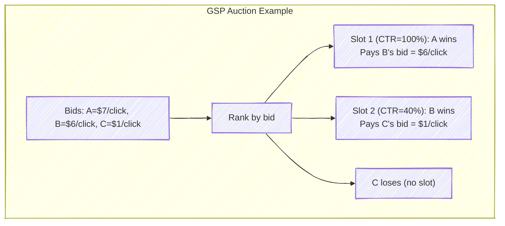
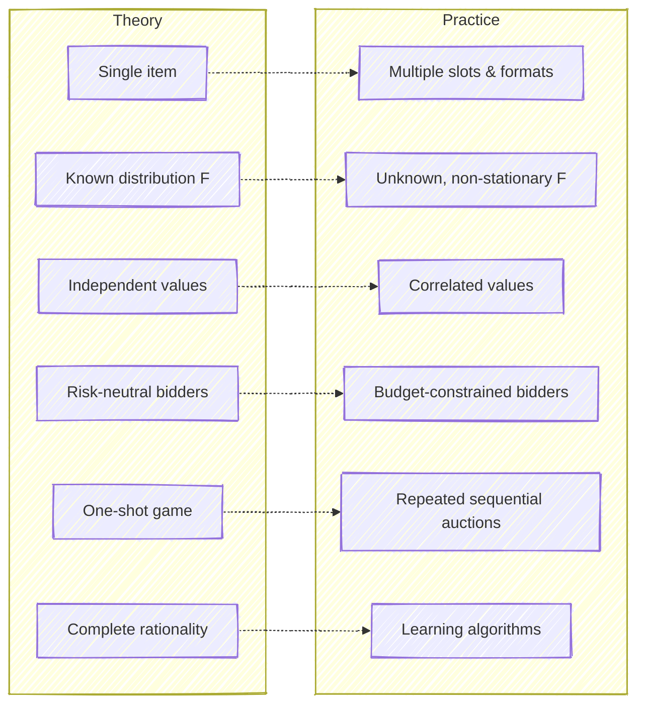
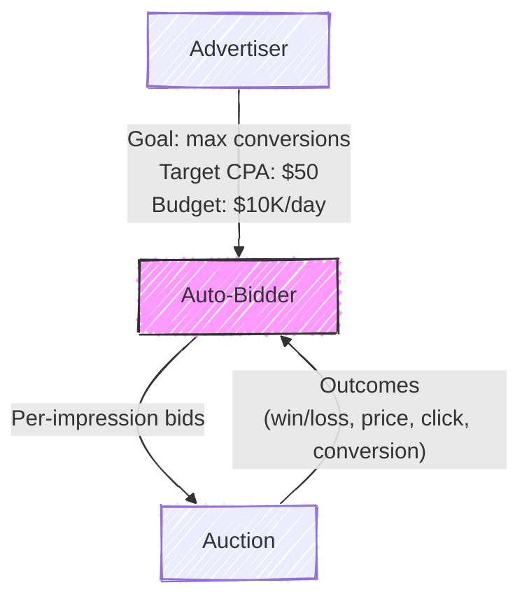

# Chapter 2: Auction Theory Foundations

---

## 2.1 Why Auction Theory Matters for Bidding Engineers

Every time your system submits a bid, it participates in an auction. This is not a metaphor -- it is literally an auction, governed by rules that determine who wins and what they pay. Understanding auction theory is not optional background; it is the mathematical foundation that tells you what the optimal bidding strategy is under given rules, why certain auction formats exist and what incentives they create, what happens when rational agents compete, and what the theoretical limits of any bidding algorithm are.

If you have encountered game theory before, parts of this chapter will feel familiar. If not, work through the derivations carefully. The theorems here are not academic curiosities -- they directly inform the design of bidding algorithms. The Revenue Equivalence Theorem explains why the industry's shift from second-price to first-price auctions was less dramatic than it might seem. The Bayesian Nash Equilibrium of first-price auctions gives you the closed-form bid shading formula. Myerson's optimal auction theory explains why reserve prices exist. Each result has a direct engineering implication.

> **For the RL Engineer**: Auction theory provides the *environment model* for your RL agent. Just as a robotics engineer needs to understand Newtonian mechanics to design controllers, a bidding engineer needs to understand auction mechanics to design bidding algorithms. The auction rules define the transition dynamics and reward structure of the MDP your agent operates in. When the auction format changes (as it did in the second-to-first-price transition), the MDP changes, and optimal policies change with it.

## 2.2 Setup and Notation

We consider $n$ bidders competing for a single item -- in our setting, a single ad impression. Each bidder $i$ has a private valuation $v_i$ representing the true worth of the item to them. In ad tech, this valuation is the expected revenue from showing the ad: typically $v_i = \text{pCTR}_i \times \text{pCVR}_i \times \text{value}_i$, where $\text{value}_i$ is the advertiser's stated value per conversion.

Each bidder submits a bid $b_i$, which may or may not equal their true valuation. The auction mechanism determines the winner and the price. Bidder $i$'s utility (payoff) is:

$$u_i = \begin{cases} v_i - p_i & \text{if } i \text{ wins (where } p_i \text{ is the price paid)} \\ 0 & \text{if } i \text{ loses} \end{cases}$$

We adopt the **Independent Private Values (IPV)** model as our baseline: each bidder's valuation $v_i$ is drawn independently from a common cumulative distribution function $F$ with density $f$. Bidder $i$ knows their own $v_i$ but not the valuations of others -- they only know the distribution $F$ from which those valuations are drawn.

| Symbol | Meaning |
|--------|---------|
| $n$ | Number of bidders |
| $v_i$ | Bidder $i$'s true valuation (private) |
| $b_i$ | Bidder $i$'s bid |
| $F(v)$, $f(v)$ | CDF and PDF of the valuation distribution |
| $u_i$ | Bidder $i$'s utility |
| $b^*(v)$ | Equilibrium bidding strategy (bid as a function of value) |

This setup is, of course, a simplification. Real ad auctions involve correlated valuations, asymmetric bidders, budget constraints, and repeated interaction. But the IPV model provides the essential intuitions, and we will discuss the gaps between theory and practice at the end of the chapter.

## 2.3 Second-Price Auctions (Vickrey Auctions)

The second-price auction, introduced by William Vickrey in 1961, has a simple rule: the highest bidder wins, but pays the *second-highest* bid. If three bidders submit bids of $10, $7, and $4, bidder A wins and pays $7 -- bidder B's bid, not their own.

This auction format has a remarkable property that makes it a natural starting point for both theory and practice.

### Theorem: Truthful Bidding is a Dominant Strategy

**Claim.** In a second-price auction, every bidder maximizes their utility by bidding their true valuation: $b_i^* = v_i$.

**Proof.** Consider bidder $i$ with true value $v_i$. Let $p = \max_{j \neq i} b_j$ denote the highest competing bid, which is unknown to bidder $i$. We show that no deviation from $b_i = v_i$ can improve $i$'s utility, regardless of $p$.

*Case 1: Overbidding ($b_i > v_i$).* There are three sub-cases based on where $p$ falls:

- If $p > b_i > v_i$: bidder $i$ loses, getting utility 0. Same outcome as bidding truthfully.
- If $b_i > p$ and $p < v_i$: bidder $i$ wins, paying $p$, with utility $v_i - p > 0$. Same outcome as bidding truthfully (would still have won).
- If $b_i > p > v_i$: bidder $i$ wins, paying $p > v_i$, with utility $v_i - p < 0$. **Strictly worse** than bidding truthfully, which would have lost (utility 0).

*Case 2: Underbidding ($b_i < v_i$).* Again three sub-cases:

- If $p > v_i > b_i$: bidder $i$ loses, utility 0. Same as truthful.
- If $v_i > p$ and $p < b_i$: bidder $i$ wins, pays $p$, utility $v_i - p > 0$. Same as truthful.
- If $v_i > p > b_i$: bidder $i$ loses, utility 0. **Strictly worse** than bidding truthfully, which would have won with utility $v_i - p > 0$.

In both cases, deviating from truthful bidding can only hurt, never help. Therefore $b_i = v_i$ weakly dominates all other strategies. $\square$

This property -- called **incentive compatibility** or **strategyproofness** -- is profound in its implications. It means that in a second-price auction, the entire bidding problem reduces to a *prediction* problem: estimate $v_i$ as accurately as possible, then bid it. No game-theoretic reasoning about competitors' behavior is needed. This is why CTR prediction was the dominant ML application in ad tech during the second-price era.

The elegance of this result cannot be overstated. In most economic settings, optimal behavior requires reasoning about what other agents will do -- a notoriously difficult problem. The second-price auction eliminates this entirely. Each bidder's optimal strategy is independent of the number of competitors, the distribution of their values, and their strategies. It is one of the rare settings where individual rationality leads to a socially efficient outcome without any coordination.

> **Key Insight**: In a second-price auction, the DSP's entire job is to predict the impression's value accurately: $v = p(\text{CTR}) \times p(\text{CVR}) \times \text{advertiser\_value}$. No strategic bid adjustment is needed. This is why CTR prediction became the "killer app" of ML in ad tech. The auction format made prediction sufficient for optimal bidding.

### Expected Revenue

For $n$ bidders with valuations drawn i.i.d. from $\text{Uniform}[0,1]$, the expected revenue of a second-price auction equals the expected value of the second-highest order statistic:

$$E[\text{Revenue}] = E[V_{(n-1:n)}] = \frac{n-1}{n+1}$$

This formula reveals the fundamental role of competition. With 2 bidders, expected revenue is $1/3 \approx 0.33$. With 5 bidders, it rises to $2/3 \approx 0.67$. With 10 bidders, it reaches $9/11 \approx 0.82$. Each additional bidder increases revenue, but with diminishing returns -- a result with direct implications for exchange design.

## 2.4 First-Price Auctions

In a first-price auction, the highest bidder wins and pays *their own bid*. If bidder A submits $10 and wins, they pay $10, not the second-highest bid.

The immediate consequence is that truthful bidding is no longer rational. If you bid your true value and win, your utility is $v_i - v_i = 0$ -- you gain nothing. Rational bidders must **shade** their bids below their true values, trading a lower probability of winning for positive surplus when they do win. This is the fundamental optimization problem of first-price auctions: how much to shade.

### Bayesian Nash Equilibrium for Uniform Valuations

We derive the equilibrium bidding strategy for the canonical case of $n$ bidders with valuations drawn i.i.d. from $\text{Uniform}[0,1]$.

Consider bidder $i$ with value $v$. Suppose all other bidders follow a symmetric, strictly increasing strategy $b^*(\cdot)$. Bidder $i$ chooses bid $b$ to maximize expected utility:

$$E[u_i] = \Pr(\text{win}) \cdot (v - b)$$

Bidder $i$ wins if their bid exceeds all $n-1$ other bids. Since each competitor $j$ bids $b^*(v_j)$ and $b^*$ is increasing, bidder $i$ wins if $b > b^*(v_j)$ for all $j \neq i$, which occurs when $v_j < (b^*)^{-1}(b)$ for all competitors. Under the uniform distribution:

$$\Pr(\text{win}) = \left[(b^*)^{-1}(b)\right]^{n-1}$$

Guessing a linear equilibrium $b^*(v) = \alpha v$, we have $(b^*)^{-1}(b) = b/\alpha$, so:

$$E[u_i] = \left(\frac{b}{\alpha}\right)^{n-1} (v - b)$$

Taking the derivative with respect to $b$ and setting it to zero:

$$\frac{(n-1) b^{n-2}}{\alpha^{n-1}} (v - b) - \frac{b^{n-1}}{\alpha^{n-1}} = 0$$

$$(n-1)(v - b) = b$$

$$b^* = \frac{n-1}{n} \cdot v$$

This is the **symmetric Bayesian Nash Equilibrium (BNE)** for first-price auctions with uniform valuations. Each bidder shades their bid by a factor of $(n-1)/n$, bidding a fraction of their true value that increases with competition:

| Bidders ($n$) | Equilibrium bid $b^*(v)$ | Shade fraction | Example: $v = \$10$ |
|---|---|---|---|
| 2 | $v/2$ | 50% | Bid $5.00 |
| 5 | $4v/5$ | 20% | Bid $8.00 |
| 10 | $9v/10$ | 10% | Bid $9.00 |
| 100 | $99v/100$ | 1% | Bid $9.90 |

> **Key Insight**: More competition means less shading. In highly competitive ad markets with many bidders, the optimal bid approaches the true value even in first-price auctions. But for niche inventory with few competing bidders, aggressive shading is optimal and can save advertisers substantial money. This is why bid shading models in practice need to estimate the *competitive landscape* -- not just the impression's value, but how many and how aggressive the other bidders are.

### Practical Implications of the Equilibrium

The equilibrium formula $b^*(v) = \frac{n-1}{n} v$ has direct engineering implications for bid shading models. In the real world, of course, a DSP does not know $n$ exactly -- the number of competing bidders varies by impression, time of day, and publisher. Nor are valuations uniformly distributed. But the qualitative insight holds robustly: the optimal shade amount decreases with competition.

This is why production bid shading models typically estimate features of the competitive landscape -- the number of bidders, the distribution of competing bids, the historical win rate at various bid levels -- and use these to calibrate the shade. The theoretical equilibrium provides the functional form; ML fills in the parameters.

> **Industry Example**: When Google's Ad Exchange transitioned from second-price to first-price auctions in 2019, DSPs had to rapidly build bid shading capabilities. The Trade Desk, one of the largest independent DSPs, developed ML models that estimate the "clearing price" of each auction -- essentially predicting what the second-highest bid would have been -- and shades bids toward that estimate. They reported that effective bid shading saved their advertisers significant spend without materially reducing win rates.

### General Formula for Arbitrary Distributions

For valuations drawn from a general distribution $F$ with density $f$, the symmetric BNE bid function satisfies:

$$b^*(v) = v - \frac{\int_0^v [F(t)]^{n-1} \, dt}{[F(v)]^{n-1}}$$

An equivalent and more intuitive expression is:

$$b^*(v) = E\left[Y_{(n-1:n-1)} \mid Y_{(n-1:n-1)} < v\right]$$

where $Y_{(n-1:n-1)}$ is the maximum of $n-1$ i.i.d. draws from $F$. In words: **bid the expected value of the second-highest valuation, conditional on yours being the highest.** This mirrors the payment in a second-price auction in expectation -- a connection that leads us to one of the most elegant results in auction theory.

## 2.5 The Revenue Equivalence Theorem

The Revenue Equivalence Theorem (RET), established by Vickrey (1961) and generalized by Myerson (1981), is arguably the most important result in auction theory.

**Theorem (Revenue Equivalence).** Consider $n$ risk-neutral bidders with valuations drawn i.i.d. from a continuous distribution $F$. Any two auction mechanisms that (1) always allocate the item to the bidder with the highest valuation and (2) give zero expected payoff to a bidder with value zero yield the **same expected revenue** to the seller.

This means that first-price auctions, second-price auctions, English auctions (ascending), and Dutch auctions (descending) all generate identical expected revenue under the IPV model:

$$E[\text{Revenue}] = E[V_{(n-1:n)}] = \frac{n-1}{n+1} \quad \text{for Uniform}[0,1]$$

The intuition is subtle but powerful. In a second-price auction, bidders bid truthfully and the payment is the second-highest value. In a first-price auction, bidders shade, but the equilibrium shading is calibrated so that the expected payment of the winner equals exactly the expected second-highest value. Different mechanisms extract the same revenue through different paths.

### When Revenue Equivalence Breaks Down

Revenue equivalence holds under specific assumptions. When those assumptions are violated -- as they invariably are in real ad auctions -- the theorem breaks, and the choice of auction format matters:

| Violation | Effect on Revenue Comparison |
|---|---|
| **Risk-averse bidders** | First-price generates *more* revenue (bidders shade less to avoid losing) |
| **Correlated values** | English (ascending) auction generates *more* (information revelation during bidding) |
| **Asymmetric bidders** | Ranking depends on the specific form of asymmetry |
| **Budget constraints** | Significant differences; budget-constrained bidders distort equilibrium |
| **Reserve prices** | Break equivalence in complex, mechanism-dependent ways |
| **Repeated auctions** | Collusion and learning dynamics favor different formats |

> **Industry Example**: Revenue equivalence is the theoretical reason why the industry's transition from second-price to first-price auctions was expected to be revenue-neutral for publishers. In practice, the transition was messy: DSPs needed months to build and calibrate bid-shading models. During this transition period, many DSPs were still bidding as if in a second-price auction (i.e., near truthfully), which temporarily *increased* publisher revenue. As DSPs adapted and deployed shading, publisher revenue normalized. This transition -- a natural experiment in auction theory -- was one of the most significant events in ad-tech history.

## 2.6 The Generalized Second-Price (GSP) Auction

The single-item auctions above are the building blocks, but search advertising involves a more complex setting: multiple ad positions on a results page, each with a different click-through rate. The Generalized Second-Price (GSP) auction was the mechanism developed for this setting, and it is the foundation of Google Ads and Bing Ads.

### Setup

Consider $k$ ad slots on a search results page, with click-through rates $\alpha_1 \geq \alpha_2 \geq \cdots \geq \alpha_k$. The top slot gets the most clicks, the second slot fewer, and so on. There are $n > k$ advertisers, each with a value-per-click $v_i$ and a bid $b_i$.

### Mechanism

The GSP auction works as follows:

1. **Allocation**: Sort bidders by bid in descending order. The bidder with the $i$-th highest bid receives slot $i$.
2. **Pricing**: Each winner pays the *next-lower bid* per click. That is, the advertiser in slot $i$ pays $b_{(i+1)}$ per click (the bid of the advertiser in slot $i+1$).

### GSP Is Not Truthful

Unlike the second-price auction for a single item, the GSP auction is **not** incentive-compatible. Bidders can sometimes improve their utility by bidding less than their true value. This is a critical distinction.

Consider a concrete example with values $v_A = 7$, $v_B = 6$, $v_C = 1$ and two slots with CTRs $\alpha_1 = 1.0$ and $\alpha_2 = 0.4$.

**Under truthful bidding** ($b_i = v_i$): Bidder A gets slot 1 and pays $6/click, yielding utility $\alpha_1 (v_A - 6) = 1.0 \times 1 = 1.0$. Bidder B gets slot 2 and pays $1/click, yielding utility $\alpha_2 (v_B - 1) = 0.4 \times 5 = 2.0$.

**If A deviates to $b_A = 5$**: Now B (with bid $6) gets slot 1, and A gets slot 2. A pays C's bid of $1/click, yielding utility $\alpha_2(v_A - 1) = 0.4 \times 6 = 2.4 > 1.0$. Bidder A profits by *underbidding* -- dropping to a cheaper slot with enough traffic to more than compensate for the lower position.

This shows that truthful bidding is not a Nash equilibrium of the GSP auction. Bidders have incentives to strategically lower their bids to "drop down" to cheaper positions.

> **Historical Note**: Edelman, Ostrovsky, and Schwarz (2007) and Varian (2007) independently analyzed the GSP auction in landmark papers published simultaneously. They showed that while GSP is not truthful, it has a set of Nash equilibria with appealing properties. Edelman et al. identified the "locally envy-free" equilibrium in which no advertiser prefers to swap positions with their immediate neighbor -- and showed that in this equilibrium, payments coincide with those of the VCG mechanism. This result gave Google's mechanism a retrospective theoretical justification, even though it was originally designed by engineers rather than economists.

> **Key Insight**: Google's introduction of *Quality Score* -- multiplying bids by an estimated ad quality factor -- was partly a response to the strategic vulnerability of GSP. By ranking ads by $\text{bid} \times \text{quality}$ rather than bid alone, the effective mechanism becomes harder to game. It also aligns the platform's incentives (showing relevant ads to maintain user engagement) with mechanism design (moving closer to VCG-like outcomes). Quality Score is itself an ML prediction -- yet another place where ML and auction theory intersect.

## 2.7 The VCG Mechanism (Vickrey-Clarke-Groves)

The VCG mechanism is the truthful generalization of the second-price auction to settings with multiple items or positions. Where GSP charges each winner the next-lower bid, VCG charges each winner their **externality** -- the total harm their participation imposes on all other bidders.

### VCG Payment Formula

The VCG payment for bidder $i$ is:

$$p_i^{\text{VCG}} = \underbrace{W_{-i}(\text{without } i)}_{\text{Social welfare of others if } i \text{ absent}} \;-\; \underbrace{W_{-i}(\text{with } i)}_{\text{Social welfare of others when } i \text{ present}}$$

In words: bidder $i$ pays the difference between what the other bidders *would* collectively receive if $i$ were not in the auction, and what they actually receive with $i$ present. This is the "damage" that $i$'s participation inflicts on the rest.

### Worked Example

Consider 3 bidders with values $v_A = 10$, $v_B = 6$, $v_C = 2$ competing for 2 slots with CTRs $\alpha_1 = 1.0$ and $\alpha_2 = 0.5$.

**Efficient allocation**: A gets slot 1, B gets slot 2 (highest total welfare).

**A's VCG payment**:
- *Without A*: B gets slot 1 (welfare $6 \times 1.0 = 6$), C gets slot 2 (welfare $2 \times 0.5 = 1$). Others' total welfare = $7$.
- *With A*: B gets slot 2 (welfare $6 \times 0.5 = 3$), C gets nothing (welfare $0$). Others' total welfare = $3$.
- A pays $7 - 3 = \$4.00$ (total expected payment), equivalent to a per-click price of $\$4 / \alpha_1 = \$4$/click.

**B's VCG payment**:
- *Without B*: A gets slot 1 (welfare $10 \times 1.0 = 10$), C gets slot 2 (welfare $2 \times 0.5 = 1$). Others' total welfare = $11$.
- *With B*: A gets slot 1 (welfare $10 \times 1.0 = 10$), C gets nothing (welfare $0$). Others' total welfare = $10$.
- B pays $11 - 10 = \$1.00$ (total expected payment). Note the welfare difference already accounts for the CTRs, so this is B's total expected payment, not a per-click price; equivalently, B pays $\$1 / \alpha_2 = \$2$/click.

Compare with GSP: under truthful bidding, A would pay B's bid of $6/click ($\$6$ expected) and B would pay C's bid of $2/click ($\$1$ expected). VCG charges *less* in aggregate than the GSP truthful-bidding outcome ($\$5$ vs. $\$7$ total).

### Properties Comparison

| Property | VCG | GSP (in equilibrium) |
|---|---|---|
| Truthful (dominant strategy) | Yes | No |
| Efficient (maximizes social welfare) | Yes | Yes |
| Revenue | Lower | Higher |
| Implementation complexity | Higher | Simpler |

The fact that VCG is truthful but generates less revenue than GSP is precisely why Google chose GSP for its search auction. From the platform's perspective, the extra revenue from GSP's strategic bidding was worth the loss of truthfulness. From the advertiser's perspective, the need to bid strategically in GSP creates demand for sophisticated bidding algorithms -- which is, again, where you come in.

There is a historical irony here. Google's engineers originally chose GSP not because of any theoretical analysis but because it was simple to implement and seemed fair ("you pay the next guy's bid"). The theoretical properties were discovered after the fact by Edelman et al. and Varian, who provided a retrospective rationalization for a design that had already been deployed at scale. This is a recurring pattern in ad tech: practice leads theory, and theorists scramble to explain why what works works.

> **For the RL Engineer**: The distinction between VCG (truthful, so prediction alone suffices) and GSP (strategic, so bidding policy matters) maps directly to the distinction between *supervised learning* and *reinforcement learning* approaches to bidding. In a VCG world, you would train a supervised model to predict value and bid it. In a GSP or first-price world, you need a policy that accounts for the strategic environment -- a natural RL formulation.

## 2.8 Myerson's Optimal Auction

The auctions above are designed to be efficient -- they allocate the item to whoever values it most. But what if the seller (the publisher or exchange) wants to maximize *revenue* rather than *efficiency*? Roger Myerson's Nobel Prize-winning work (1981) characterizes the revenue-maximizing auction.

### Virtual Valuations

The key concept is the **virtual valuation** function. For a bidder with value $v$ drawn from distribution $F$ with density $f$:

$$\varphi(v) = v - \frac{1 - F(v)}{f(v)}$$

The virtual valuation adjusts the bidder's reported value downward by a term that captures the *information rent* -- the surplus the seller must leave the bidder to incentivize truthful reporting. It can be interpreted as the "marginal revenue" from serving a bidder with this value.

For the uniform distribution $\text{Uniform}[0, V_{\max}]$:

$$\varphi(v) = v - \frac{V_{\max} - v}{1} = 2v - V_{\max}$$

### Myerson's Optimal Mechanism

Myerson showed that the revenue-maximizing auction has a simple structure (when virtual valuations are monotone increasing, which holds for many common distributions):

1. Compute $\varphi(v_i)$ for each bidder.
2. Allocate the item to the bidder with the highest $\varphi(v_i)$, provided $\varphi(v_i) \geq 0$.
3. If all virtual valuations are negative, do not sell the item.

The condition $\varphi(v_i) \geq 0$ defines a **reserve price** -- a minimum bid below which the item is not sold, even if there are willing buyers. Setting $\varphi(v^*) = 0$ for $\text{Uniform}[0, V_{\max}]$:

$$2v^* - V_{\max} = 0 \implies v^* = \frac{V_{\max}}{2}$$

The optimal reserve price is **half the maximum possible valuation**. This is a striking result: even when there is a willing buyer, it is sometimes in the seller's interest to refuse the sale to credibly extract higher payments from high-value buyers in the future.

> **Industry Example**: In practice, ad exchanges set floor prices (minimum bids) on impressions, which function as reserve prices. Setting these floors is a significant optimization problem for exchanges and SSPs. The theory says the optimal floor depends on the distribution of bidder valuations -- which must be estimated from data. This is another ML application: predicting the distribution of bids for a given impression to set an optimal floor price. Companies like Google and Magnite invest heavily in floor price optimization algorithms.

### The Bulow-Klemperer Theorem

One of the most elegant results in auction theory connects optimal mechanism design with simple competition:

**Theorem (Bulow and Klemperer, 1996).** An auction with $n+1$ bidders and *no* reserve price generates at least as much expected revenue as the optimal auction (with optimal reserve price) with only $n$ bidders.

The implication is powerful: **attracting one additional bidder is worth more than any amount of mechanism design sophistication**. No matter how cleverly you set reserve prices or design payment rules, simply adding one more competitor to the auction generates more revenue.

> **Key Insight**: The Bulow-Klemperer theorem explains why ad exchanges invest so heavily in liquidity -- connecting to more DSPs, reducing latency to attract more bidders, and lowering barriers to participation. The most sophisticated reserve price algorithm cannot compensate for a thin market. This also explains the success of header bidding from the publisher's perspective: by soliciting bids from multiple exchanges simultaneously, publishers effectively increase $n$, which Bulow-Klemperer tells us is the most effective revenue lever.

## 2.9 From Theory to Practice

The theoretical models in this chapter assume idealized conditions. Real ad auctions violate nearly every assumption, and understanding these gaps is essential for applying theory correctly.

**Single item vs. multiple slots.** Real display auctions may offer multiple ad slots on a page, and search auctions definitively do. The theory extends (GSP, VCG) but equilibrium analysis becomes harder.

**Known distributions vs. learning from data.** The equilibrium strategies above assume bidders know $F$, the distribution of competitor valuations. In practice, this distribution must be estimated from historical bid data -- and it shifts over time as competitors enter, exit, and update their strategies. This turns the bidding problem from a static game into a *learning* problem.

**Independent values vs. correlated values.** When the same user sees multiple ads, or when multiple bidders use similar prediction models (as when many DSPs use similar deep learning architectures for CTR prediction), valuations become correlated. This invalidates the independence assumption and changes equilibrium behavior.

**Risk-neutral vs. budget-constrained.** Budget constraints are perhaps the most practically important violation. A bidder with a $10,000 daily budget cannot simply bid their value on every impression -- they must allocate that budget across the day's auctions. Budget constraints effectively make bidders risk-averse (winning a low-value auction exhausts budget that could have been spent on a high-value auction later), and they break revenue equivalence between auction formats.

**One-shot vs. sequential.** A DSP participates in millions of auctions per day. Performance in any single auction is irrelevant; what matters is cumulative performance over the entire budget horizon. This sequential structure -- with budget depletion, learning about the market, and changing competitive conditions -- is precisely what makes bidding a reinforcement learning problem.

**Equilibrium play vs. learning.** Classical auction theory assumes bidders play equilibrium strategies. In practice, bidding algorithms are *learning* -- they explore to estimate market conditions, exploit to maximize performance, and adapt to changes in the environment. The relevant theory shifts from equilibrium analysis to regret minimization and online learning.

> **For the RL Engineer**: The gap between "one-shot equilibrium" and "sequential learning" is where your expertise becomes most valuable. Classical auction theory tells you what the steady-state optimal strategy is. But in practice, you face a non-stationary environment where competitor strategies change, new campaigns launch mid-day, and the value of impressions varies by time of day and day of week. The bidding problem is not "find the Nash equilibrium and play it" -- it is "learn a good policy online while the environment shifts around you." This is fundamentally an RL problem, and it requires balancing exploration (learning the market) with exploitation (spending the budget wisely), all under hard budget constraints. Chapters 7--9 develop this formulation in detail.

These gaps are not deficiencies of the theory -- they are **opportunities for ML and RL**. Machine learning addresses the estimation problem (learning $F$ from data). Reinforcement learning addresses the sequential, constrained optimization problem. Multi-agent RL addresses the strategic interaction between learning algorithms. The rest of this book is devoted to these approaches.

### A Bridge to the Auto-Bidding Era

There is one more gap between theory and practice that deserves special attention because it defines the current frontier of the field. Classical auction theory assumes that bidders are the advertisers themselves (or their direct agents), each with a single well-defined value. In the auto-bidding era, the situation is more complex.

An advertiser specifies a high-level goal -- for instance, "maximize conversions at a target CPA of $50 with a daily budget of $10,000." The platform's auto-bidding system then bids on their behalf. This creates a two-layer structure:

The auto-bidder is not a simple value-maximizer -- it is a constrained optimizer. It must simultaneously maximize an objective (total conversions), satisfy a value constraint (average CPA at or below target), and respect a budget constraint (total spend at or below budget). Aggarwal et al. (2024) formalize this as:

$$\max \sum_t x_t \cdot \text{value}_t \quad \text{s.t.} \quad \sum_t x_t \cdot p_t \leq B, \quad \frac{\sum_t x_t \cdot p_t}{\sum_t x_t \cdot \text{value}_t} \leq \text{target CPA}$$

where $x_t \in \{0,1\}$ indicates whether the auto-bidder wins auction $t$ and $p_t$ is the price paid.

This formulation changes the nature of the auction itself. When the auctioneer knows that bidders are auto-bidding algorithms rather than humans, the optimal auction design changes. This is the subject of a rapidly growing literature at the intersection of auction theory, optimization, and machine learning -- and it is the frontier you will be working on.

---

## Key Formulas Summary

| Result | Formula | Conditions |
|---|---|---|
| Optimal bid, second-price | $b^*(v) = v$ | Dominant strategy, any $F$ |
| Equilibrium bid, first-price | $b^*(v) = \frac{n-1}{n} v$ | BNE, $\text{Uniform}[0,1]$ |
| Equilibrium bid, first-price (general) | $b^*(v) = v - \frac{\int_0^v [F(t)]^{n-1} dt}{[F(v)]^{n-1}}$ | BNE, general $F$ |
| Expected revenue | $E[\text{Rev}] = \frac{n-1}{n+1}$ | $n$ bidders, $\text{Uniform}[0,1]$, any standard auction |
| Virtual valuation | $\varphi(v) = v - \frac{1-F(v)}{f(v)}$ | Myerson's mechanism |
| Optimal reserve (uniform) | $r^* = \frac{V_{\max}}{2}$ | $\text{Uniform}[0, V_{\max}]$ |
| GSP pricing | $p_i = b_{(i+1)}$ per click | Position auctions |
| VCG payment | $p_i = W_{-i}(\text{without } i) - W_{-i}(\text{with } i)$ | General mechanism |

---

## Exercises

1. **Second-price basics.** In a second-price auction with 5 bidders and valuations $[8, 6, 4, 3, 1]$, identify the winner and the payment. What is each bidder's utility?

2. **First-price equilibrium.** In a first-price auction with 2 bidders drawing from $\text{Uniform}[0, 100]$, what is the equilibrium bid for a bidder with value 60? How much surplus does this bidder expect to earn, conditional on winning?

3. **Revenue equivalence verification.** For $n = 3$ bidders with $\text{Uniform}[0,1]$ valuations, compute the expected revenue of both the second-price and first-price auctions analytically. Verify they are equal.

4. **GSP non-truthfulness.** Consider a GSP auction with 2 slots (CTRs: $\alpha_1 = 0.10$, $\alpha_2 = 0.04$) and 3 advertisers with values-per-click $[5, 3, 1]$. Compute each advertiser's utility under truthful bidding. Then find a profitable deviation for one of the bidders, demonstrating that truthful bidding is not an equilibrium.

5. **VCG vs. GSP.** For the GSP example in Exercise 4, compute the VCG payments. Compare the total revenue under VCG versus the GSP truthful-bidding outcome. Which generates more revenue?

6. **Optimal reserve price.** Suppose bidder valuations are drawn from $\text{Uniform}[0, 10]$. (a) What is the optimal reserve price according to Myerson's theory? (b) Consider a second-price auction with $n = 2$ bidders and this reserve. Write an expression for the expected revenue. (c) How does this compare to the expected revenue of a second-price auction with $n = 3$ bidders and *no* reserve? Relate your answer to the Bulow-Klemperer theorem.

7. **Bid shading in practice.** A DSP estimates that a particular impression is worth $\$5$ CPM to its advertiser. Historical data suggests that the highest competing bid in similar auctions is distributed approximately as $\text{Uniform}[1, 4]$. In a first-price auction, what bid maximizes the DSP's expected surplus? How sensitive is the optimal bid to errors in the estimated distribution of competing bids?

8. **Theory-practice gap.** For each assumption of the IPV model (independence, private values, known distribution, risk neutrality, one-shot game), give a specific real-world ad auction scenario where the assumption is violated, and describe the qualitative effect on bidding behavior.

---

## Further Reading

- Edelman, Ostrovsky, and Schwarz (2007), "Internet Advertising and the Generalized Second-Price Auction," *American Economic Review* -- The foundational analysis of GSP
- Varian (2007), "Position Auctions," *International Journal of Industrial Organization* -- Independent, complementary analysis of GSP
- Myerson (1981), "Optimal Auction Design," *Mathematics of Operations Research* -- The optimal mechanism design framework
- Bulow and Klemperer (1996), "Auctions Versus Negotiations," *American Economic Review* -- The theorem on competition vs. mechanism design
- Roughgarden, CS364A Lectures 2--7 (YouTube) -- Accessible video lectures covering all material in this chapter
- Krishna (2010), *Auction Theory*, 2nd edition (Academic Press) -- The comprehensive graduate textbook on auction theory
- Hartline (2012), *Mechanism Design and Approximation* (jasonhartline.com/MDnA/) -- Free advanced reference
