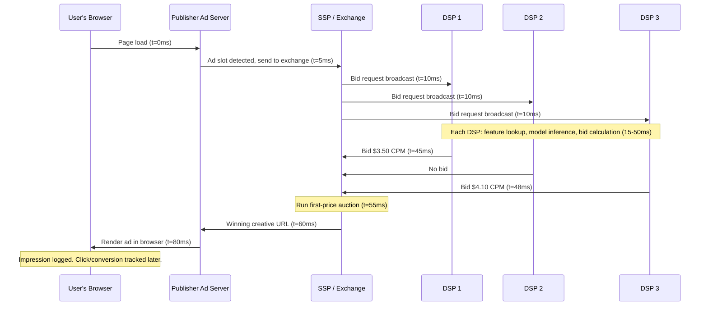
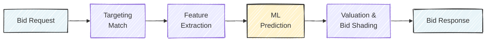
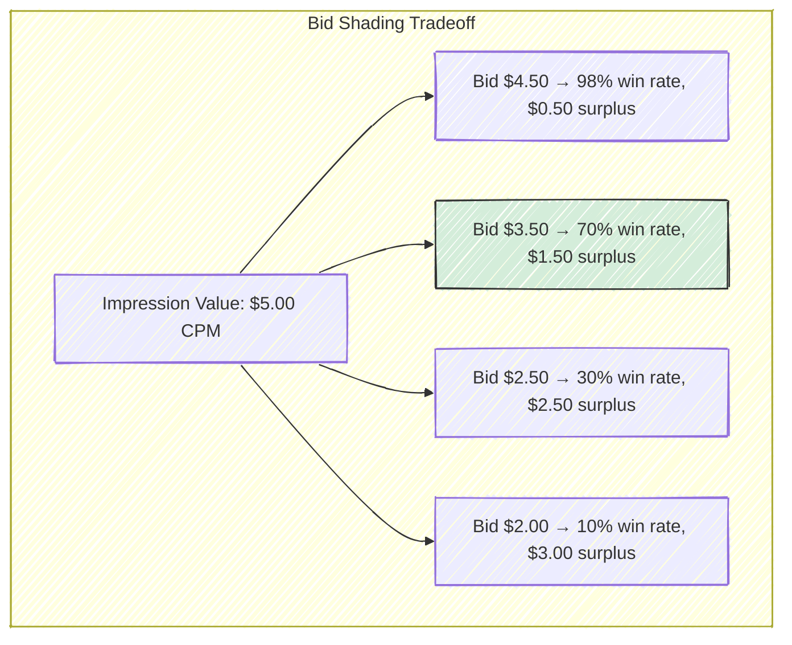
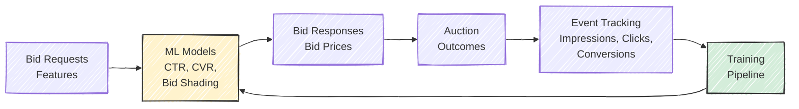
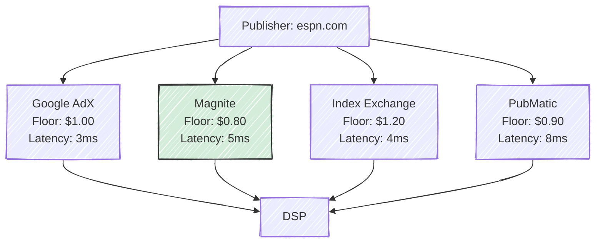

# Chapter 3: How Real-Time Bidding Works

*This chapter covers the end-to-end mechanics of real-time bidding (RTB), from the moment a user loads a webpage to the moment an ad is rendered. We examine the OpenRTB protocol, auction mechanics, bid shading, event tracking, supply path optimization, privacy constraints, and ad fraud. Understanding these mechanics is prerequisite to the ML chapters that follow, as every model design decision is constrained by the RTB pipeline it serves.*

---

## 3.1 The RTB Pipeline: From Page Load to Ad Display

Something remarkable happens every time you load a webpage with advertising. In the roughly 100 milliseconds between the moment your browser requests a page and the moment an ad appears on screen, an entire economy springs to life: an auction is announced, dozens of competing firms evaluate whether this particular moment of your attention is worth buying, machine learning models run inference, bids are submitted and evaluated, and a winner is declared. This process repeats billions of times per day across the internet, and it is the engine that funds most of the free web.

Real-time bidding (RTB) is the protocol and infrastructure that makes this possible. Understanding RTB deeply is essential before tackling the ML problems it creates, because every design decision in a bidding system --- from which model architecture to use, to how frequently to retrain, to how to handle missing data --- is constrained by the mechanics of the auction pipeline.

The sequence below traces the life of a single ad impression, from the moment a user's browser makes a request to the moment an ad is rendered.

The entire process completes well within the latency budget that a browser allocates for ad loading. A user visiting a news site will typically never notice the auction happening --- yet behind the scenes, sophisticated ML systems evaluated this opportunity in well under 50 milliseconds.

It is worth reflecting on what makes this system remarkable from an engineering perspective. The RTB pipeline is a distributed system that must achieve sub-100ms end-to-end latency, handle millions of concurrent transactions per second, tolerate partial failures gracefully (a non-responsive DSP simply forfeits its chance to bid), and produce economically rational outcomes --- all while the "inventory" being sold (human attention) is perishable and unique. No two impressions are identical, and each one exists only in the instant it is available. This combination of latency requirements, throughput demands, and economic constraints makes RTB one of the most technically challenging distributed systems in production today.

### Scale Numbers That Define the Engineering Problem

The scale of RTB shapes every technical decision. A large demand-side platform (DSP) like The Trade Desk or Google's DV360 processes on the order of **1--10 million bid requests per second**. Of those, the DSP might choose to bid on 10--30%, meaning its models must produce inference results for hundreds of thousands of requests per second. The total latency budget for the DSP's side of the transaction --- from receiving the bid request to returning a response --- is typically **10--50 milliseconds**, of which model inference must consume no more than 5--10 ms.

Win rates on submitted bids vary from 5% to 30% depending on the DSP's market position and bidding strategy. Of the impressions won, typical display click-through rates land between 0.1% and 2%, meaning that for every thousand ads served, only one to twenty generate a click. Conversion rates (purchases, signups) are smaller still. This extreme funnel --- billions of opportunities narrowing to thousands of conversions --- creates the class imbalance problems discussed in Chapter 4.

To put these numbers in financial context: the global programmatic advertising market exceeded $500 billion in 2024, with RTB-based display and video ads accounting for a substantial share. The market roughly doubled between 2020 and 2024, driven by the shift of television budgets to connected TV (CTV) and the growth of retail media networks. For a mid-size DSP processing 10 billion bid requests per day, the annual media spend flowing through the system might be $1--5 billion, making even small percentage improvements in bidding efficiency worth tens of millions of dollars.

## 3.2 The Bid Request: Anatomy of an Impression Opportunity

When an exchange sends a bid request to a DSP, it encodes everything the DSP needs to evaluate the opportunity. The industry-standard format is the **OpenRTB specification**, maintained by the IAB Tech Lab and now in its third major version (OpenRTB 2.6 for JSON-based exchanges, OpenRTB 3.0 for the newer layered architecture). An OpenRTB bid request is a structured object, but rather than reading raw protocol definitions, it is more instructive to understand the categories of information it carries.

| Category | Key Fields | Purpose |
|----------|-----------|---------|
| **Impression** | Ad format (banner, video, native), dimensions (728x90, 300x250), position (above/below fold), floor price, allowed creative types | Defines what the ad slot looks like and the minimum bid |
| **User** | Cookie or device ID, geographic location, device and browser info, audience segments | Identifies who will see the ad and what is known about them |
| **Site / App** | Publisher domain, page URL, content category (IAB taxonomy), referrer | Describes where the ad will appear |
| **Regulations** | GDPR consent string, COPPA flag, US Privacy string, Global Privacy Platform signals | Constrains what data the DSP may use and how |

The **impression object** is straightforward: it tells you the shape and position of the ad slot, the publisher's minimum acceptable bid (the floor price), and what types of creatives are allowed. A single bid request may contain multiple impression objects when the page has several ad slots available simultaneously, giving the DSP the option to bid on any or all of them. The floor price is particularly important for ML systems --- it sets a minimum threshold that the bid shading model must respect, and floor prices vary dramatically across publishers, ranging from $0.10 CPM on low-quality inventory to $20+ CPM on premium video placements.

The **user object** is where the richest targeting signals live. Audience segments like "sports enthusiast" or "in-market for SUVs" are typically derived from data management platforms (DMPs) or the exchange's own data. The user ID field (historically a cookie ID for web, a device advertising ID for mobile) is the key that allows the DSP to look up its own stored history for this user --- past impressions served, ads clicked, sites visited. When this ID is missing or suppressed (increasingly common due to privacy regulations), the DSP must fall back to contextual signals alone, which degrades prediction quality significantly.

The **site or app object** provides contextual signals, which are becoming increasingly important as user-level tracking diminishes (Section 3.9). The IAB content taxonomy classifies pages into hundreds of categories (e.g., IAB1 = Arts & Entertainment, IAB17 = Sports), and many DSPs maintain their own page-level quality scores based on historical ad performance.

The **regulations block**, barely present a decade ago, is now a first-class citizen that determines whether the DSP can even use the user signals in the request. A bid request arriving with GDPR consent = false means the DSP must discard all user-level data and bid based on context alone.

> **Industry Example**: Google's AdX exchange handles over 10 billion bid requests per day. Each request must be serialized, transmitted, parsed, evaluated, and responded to in under 100ms total round-trip. Google uses Protocol Buffers rather than JSON for its internal representation to minimize serialization overhead --- a detail that matters enormously at this scale. Most other major exchanges (Magnite, Index Exchange, PubMatic) use JSON-based OpenRTB, with typical request payloads ranging from 2--10 KB depending on the richness of user and content data included.

## 3.3 The DSP Decision Engine

When a bid request arrives at a DSP, the system must answer a deceptively simple question: *should we bid on this impression, and if so, how much?* The answer involves a pipeline of five stages, each with its own computational budget and failure modes.

**Stage 1: Targeting Match (1--2ms).** The DSP maintains hundreds or thousands of active advertising campaigns, each with targeting criteria --- geographic restrictions, audience segment requirements, device preferences, publisher allowlists/blocklists, frequency caps, and dayparting schedules. The bid request is matched against these criteria to produce a set of eligible campaigns. Most bid requests match zero or very few campaigns, allowing the DSP to return a "no bid" response quickly. This early filtering is crucial: evaluating ML models is expensive, and doing so for every inbound request at millions of QPS would be prohibitive.

Frequency capping deserves special mention because it is both a business constraint and a user experience decision. Advertisers typically set caps like "show this user no more than 3 impressions per day" to avoid ad fatigue --- the well-documented phenomenon where an ad's effectiveness declines after repeated exposure, and can even turn negative (annoying the user). Enforcing frequency caps in real-time requires maintaining per-user impression counters with low-latency lookups, which is a significant infrastructure challenge at scale.

**Stage 2: Feature Extraction (1--3ms).** For eligible campaigns, the system constructs a feature vector from the bid request data combined with stored user profiles, campaign metadata, and historical performance statistics. This often involves real-time lookups against distributed key-value stores (Redis, Aerospike, or custom in-memory stores) that hold user histories and precomputed aggregates. The latency of these lookups is one of the tightest constraints in the system.

Feature extraction is where the bid request's raw data is transformed into the numerical representation that ML models consume. A publisher domain like "espn.com" becomes a hashed feature index; a user's geographic coordinates become a region code; a timestamp becomes an hour-of-day and day-of-week encoding. The quality and completeness of this transformation --- which signals to include, how to encode them, and how to handle missing values --- often matters more for model accuracy than the choice of model architecture. Chapter 4 discusses feature engineering in detail.

**Stage 3: ML Prediction (3--5ms).** This is where the models live. The system predicts the probability of a click ($p_{\text{CTR}}$) and often the probability of a post-click conversion ($p_{\text{CVR}}$). These predictions are the subject of Chapter 4 and Chapter 5, respectively. At inference time, the models must be small enough and fast enough to run within a few milliseconds, which places strong constraints on model architecture.

**Stage 4: Valuation and Bid Calculation (1--2ms).** The predicted probabilities are combined with campaign economics to produce a bid. The fundamental equation depends on the campaign's pricing model:

$$
\text{bid}_{\text{CPM}} = \begin{cases}
\text{CPA}_{\text{target}} \times p_{\text{CTR}} \times p_{\text{CVR}} \times 1000 & \text{if CPA campaign} \\
\text{CPC}_{\text{target}} \times p_{\text{CTR}} \times 1000 & \text{if CPC campaign} \\
\text{CPM}_{\text{target}} & \text{if CPM campaign}
\end{cases}
$$

This raw value is then adjusted by a **pacing multiplier** (a control signal that regulates spend rate over time, discussed in Chapter 7) and passed through a **bid shading model** (Section 3.5) that reduces the bid to avoid overpaying in first-price auctions.

**Stage 5: Response.** The DSP returns the winning campaign's bid price and creative URL, along with metadata like the advertiser's domain (used by the exchange for brand safety checks) and optional deal ID (if the impression was purchased through a private marketplace deal). If no campaign produces a bid above the floor price, the DSP returns no bid. In practice, the majority of bid requests result in no bid --- a typical DSP bids on only 10--30% of incoming requests, with the rest filtered out at Stage 1.

> **For the RL Engineer**: The DSP's decision engine is structurally similar to a policy network in reinforcement learning. The state is the bid request features, the action space is continuous (the bid price), and the reward signal (click, conversion) arrives with significant delay and is extremely sparse. The pacing multiplier in Stage 4 acts like a Lagrange multiplier on a budget constraint, and is often optimized using online control or RL methods.

## 3.4 Auction Mechanics in Practice

### The Shift from Second-Price to First-Price

For most of RTB's history, ad exchanges ran **second-price auctions** (also known as Vickrey auctions): the highest bidder won but paid the price of the second-highest bid (plus one cent). This was elegant for bidders because the dominant strategy was truthful bidding --- you could bid your true value for the impression with no risk of overpaying, since you would only pay slightly above the next competitor's valuation. In mechanism design terms, second-price auctions are *incentive-compatible*: no bidder can improve their outcome by bidding anything other than their true value.

Around 2017--2019, the industry shifted almost entirely to **first-price auctions**, where the winner pays exactly what they bid. The reasons were complex and interrelated. Header bidding --- a publisher-side technology that allowed multiple exchanges to compete simultaneously for the same impression --- undermined the theoretical guarantees of second-price auctions by creating nested auction dynamics. Publishers also suspected that exchanges were exploiting their information advantage in second-price settings, manipulating floor prices to extract more revenue. First-price auctions, while less elegant in theory, are simpler to understand and harder for intermediaries to game. Google Ad Manager completed its transition to first-price in September 2019, effectively cementing the change industry-wide.

This transition had profound consequences for ML systems. In a second-price world, bid optimization was relatively straightforward: predict the value of the impression and bid that value. In a first-price world, bidding your true value guarantees you overpay on every win --- the difference between your valuation and the second-highest bid, which you would have saved in a second-price auction, is now pure deadweight loss. A new class of models --- bid shading models --- became necessary, and they are now among the most important ML systems at any DSP. The Trade Desk estimated that in the first year after the industry transition, DSPs without sophisticated bid shading were overpaying by 20--40% compared to those with well-tuned shading models.

### Win Notifications and Price Discovery

After winning an auction, the DSP receives a **win notification** (sometimes called a "win notice" or "nurl callback") containing the clearing price. In first-price auctions, this price equals the DSP's own bid, which might seem uninformative --- but the notification itself is critical. It confirms the win, triggers budget deduction, and initiates impression and event tracking. Some exchanges also include signals about the second-highest bid or the floor price that was applied, which provide richer training data for bid shading models.

### The Censored Feedback Problem

One of the most fundamental data challenges in RTB is that **you only learn the market price when you win**. When you lose an auction, you know that at least one competitor bid higher than you, but you do not know the actual winning price. This is formally known as *right-censored data*, a concept well-studied in survival analysis and medical statistics.

Consider two scenarios:

- **You bid $3.00 and win.** In first-price, you pay $3.00. You learn that the highest competing bid was below $3.00, but you do not learn its exact value.
- **You bid $3.00 and lose.** You know the winning bid exceeded $3.00, but you do not know if it was $3.01 or $30.00.

This censoring creates a systematic bias if you naively train a model on "bid $\to$ market price" using only won auctions. Your training data overrepresents cases where the market price was low (because those are the auctions you were more likely to win), creating a downward-biased estimate of market prices. Handling this requires techniques borrowed from survival analysis --- Kaplan-Meier estimators, Cox proportional hazards models, or specialized neural network loss functions that account for both observed and censored outcomes.

The analogy to medical survival analysis is direct. In clinical trials, you observe how long patients survive after treatment --- but some patients are still alive when the study ends, meaning you know they survived *at least* that long (right-censoring). In RTB, when you lose an auction, you know the market price was *at least* as high as your bid. The same statistical machinery --- hazard functions, survival curves, and censored likelihood functions --- applies in both domains.

> **Key Insight**: The censored feedback problem is more severe in first-price auctions than it was in second-price auctions. In a second-price auction, when you won, you observed the exact clearing price (the second-highest bid), which gave you a direct sample of the competitive landscape. In first-price auctions, even your wins tell you only that the market price was *somewhere* below your bid. You have strictly less information per auction.

## 3.5 Bid Shading: The Core ML Problem in First-Price Auctions

In a first-price auction, the bidder's dilemma is clear: bid too high and you win frequently but overpay; bid too low and you save money on wins but lose too many auctions. Bid shading is the practice of bidding below your true value for an impression, aiming to find the sweet spot that maximizes **expected surplus** --- the difference between what the impression is worth to you and what you pay, weighted by the probability of winning at each price level.

Formally, let $v$ be the value of the impression to the advertiser (computed from $p_{\text{CTR}}$, $p_{\text{CVR}}$, and campaign goals), and let $W(b)$ be the probability of winning the auction with bid $b$. The optimal bid $b^*$ maximizes:

$$
b^* = \arg\max_b \; W(b) \cdot (v - b)
$$

The function $W(b)$ is unknown and must be estimated from historical auction data --- this is the core ML problem. Differentiating and setting to zero gives the first-order condition:

$$
W'(b^*) \cdot (v - b^*) = W(b^*)
$$

which says that at the optimal bid, the marginal increase in win probability from bidding one unit higher equals the ratio of current win probability to current surplus. Intuitively, you should stop increasing your bid when the additional wins you gain are no longer worth the additional cost per win.

In this example, the bid of $3.50 maximizes expected surplus ($0.70 \times \$1.50 = \$1.05$), even though higher bids win more often and lower bids produce more surplus per win.

The function $W(b)$ is not static --- it varies by publisher, time of day, ad format, and competitive intensity. A premium video placement on a major news site at 8pm has a much steeper win-rate curve (high competition) than a below-the-fold banner on a niche blog at 3am (low competition). Effective bid shading models condition on these features, producing different shading levels for different auction environments. A model that uses a single, universal shade ratio (e.g., always bid 70% of value) will systematically overpay in low-competition settings and lose too many auctions in high-competition settings.

### Approaches to Win Rate Modeling

There are several families of approaches for estimating $W(b)$:

**Logistic regression on win/loss outcomes.** The simplest approach trains a logistic regression model where the features include the bid amount and contextual features (publisher, time of day, ad format), and the label is whether the auction was won. This produces a smooth $W(b)$ curve but does not directly model the market price distribution.

**Survival analysis for censored data.** Since lost auctions provide right-censored observations (the market price exceeded your bid but is unknown), survival analysis models like Kaplan-Meier estimators or Cox proportional hazards regression are natural fits. These explicitly handle censoring in a principled way.

**Neural networks with specialized loss functions.** Deep models can capture complex interactions between features that affect competitive intensity, but they need loss functions that handle both observed (won) and censored (lost) data points. The censored negative log-likelihood loss adapts standard regression losses to account for the asymmetric information.

**Exploration-based approaches.** Some DSPs deliberately submit a small fraction of bids at varying price levels --- sometimes higher than optimal, sometimes lower --- to gather data about the market price distribution in regions of bid space they would not normally explore. This is a classic explore/exploit tradeoff: exploration bids are suboptimal in the short term (you overpay or lose auctions you could have won) but generate valuable training data that improves long-term bid shading accuracy. The fraction of traffic allocated to exploration is typically 1--5%, and the design of the exploration strategy is itself an ML problem (contextual bandits, Thompson sampling).

> **Industry Example**: The Trade Desk was one of the first major DSPs to publish research on bid shading at scale, describing it as the single most impactful ML system in their stack after the transition to first-price auctions. They reported that effective bid shading reduced average clearing prices by 20--30% compared to naive bidding, directly improving advertiser ROI.

## 3.6 Event Tracking: Impressions, Clicks, and Conversions

Once an ad is served, the DSP's job shifts from *buying* to *measuring*. The signals collected after an impression form the training data for every ML model in the system, so the quality and completeness of event tracking directly determine model quality.

The timeline of events following an ad impression spans a wide range:

| Event | Typical Timing | Tracking Mechanism | Data Quality |
|-------|---------------|-------------------|--------------|
| **Impression** | t = 0 | 1x1 tracking pixel loaded in browser | High (nearly deterministic) |
| **Viewability** | t = 0--30s | JavaScript measuring viewport intersection | Moderate (requires JS execution) |
| **Click** | t = 0--300s | Redirect through tracking URL | High (direct user action) |
| **Post-click engagement** | t = 0--600s | Time on landing page, page depth, form interactions | Moderate (requires advertiser-side tracking) |
| **Conversion** | t = 0--30 days | Pixel on advertiser site, server-side API, or mobile postback | Low to moderate (attribution challenges) |

**Viewability** deserves special attention because it bridges the gap between impression delivery and actual human attention. An impression is "viewable" by the IAB/MRC standard if at least 50% of the ad's pixels are visible in the user's viewport for at least one continuous second (two seconds for video). Industry measurements consistently show that 30--40% of served impressions fail to meet this threshold --- the ad loads below the fold and the user never scrolls down, or the user navigates away before the ad finishes rendering. Advertisers increasingly insist on paying only for viewable impressions, which means viewability prediction is itself becoming an ML problem for DSPs.

The long delay between impression and conversion is one of the most important practical challenges in ad ML. A model being trained on today's data cannot yet know which of today's impressions will produce conversions next week. This creates a tension between data freshness (training on recent impressions) and label completeness (waiting long enough for conversions to materialize). Most systems handle this with a **conversion attribution window** --- typically 7 to 30 days --- after which any unobserved conversion is treated as a negative example.

### The Attribution Problem

A user's path to conversion rarely involves a single ad exposure. A typical journey might look like this: a display ad impression on a news site (no click), a search ad on Google (click), a retargeting ad on social media (no click), and finally a direct visit to the advertiser's site resulting in a purchase. Which ad or ads deserve credit for the conversion?

This is the **attribution problem**, and it has no objectively correct answer --- it is fundamentally a question about counterfactuals (what would have happened without each touchpoint?). The industry uses several models:

- **Last-click attribution** gives 100% credit to the last clicked ad. This is simple and was the default for years, but it systematically undervalues awareness-driving channels like display advertising.
- **Linear attribution** divides credit equally among all touchpoints, which is fair but naive about the different roles each touchpoint plays.
- **Time-decay attribution** gives more credit to touchpoints closer in time to the conversion, reflecting the intuition that recent interactions matter more.
- **Data-driven attribution** uses ML --- often Shapley values from cooperative game theory --- to assign credit based on observed data about which combinations of touchpoints are most predictive of conversion. Google and Meta both offer data-driven attribution as a product. The Shapley approach treats each advertising channel as a "player" in a cooperative game, and assigns credit proportional to each channel's marginal contribution across all possible orderings of touchpoints.

In practice, most of the industry still relies on last-click or simple heuristic models, despite the theoretical superiority of data-driven approaches. The reason is partly institutional (last-click is simple to implement and audit) and partly technical (data-driven attribution requires observing the full cross-channel path, which is increasingly difficult in a privacy-constrained environment where cross-site tracking is limited).

> **Key Insight**: Attribution directly affects bidding. If your attribution model gives too much credit to display impressions, your CTR and CVR models will overestimate the value of display opportunities, and the DSP will overbid. If it gives too little credit, you will underbid and lose impressions that are actually driving conversions. Getting attribution right is not just a measurement question --- it feeds back into the entire bidding optimization loop.

## 3.7 The Feedback Loop: From Impression to Model Update

The RTB system is not a linear pipeline but a closed loop. Models make predictions that determine which impressions are bought, and the outcomes of those impressions become the training data for future model updates. This feedback loop has both beneficial and dangerous properties.

The beneficial property is **continuous improvement**: as the models observe more outcomes, they produce better predictions, which lead to better bidding decisions, which generate more informative training data. The dangerous property is **selection bias**: the models only observe outcomes for impressions they chose to bid on and won. If the model believes a certain publisher is low-value and stops bidding on it, the model never collects data that might reveal the publisher's true value. This is a form of the explore/exploit dilemma familiar from reinforcement learning.

A related concern is **feedback amplification**. If the CTR model slightly overestimates click probability for a particular audience segment, the DSP will bid more aggressively for that segment, win more impressions, and collect more data --- most of which will be negative (non-clicks), confirming that the segment has a low CTR. But because the DSP is now winning a *different* slice of that segment's inventory (more expensive, more competitive auctions), the data is not directly comparable to what it would observe at lower bid levels. These subtle feedback effects can cause model performance to drift in ways that are hard to diagnose.

### Data Volumes and Class Imbalance

The numbers at each stage of the funnel illustrate the extreme sparsity of positive signals. For a mid-size DSP:

| Stage | Daily Volume | Ratio to Prior Stage |
|-------|-------------|---------------------|
| Bid requests received | ~10 billion | --- |
| Bids submitted | ~1 billion | 10% bid rate |
| Impressions won | ~100 million | 10% win rate |
| Clicks observed | ~200,000 | 0.2% CTR |
| Conversions observed | ~10,000 | 5% post-click CVR |

The journey from 10 billion bid requests to 10,000 conversions represents a filtering ratio of one million to one. Training ML models on data this imbalanced requires specialized techniques: negative downsampling (keeping all positive examples but subsampling negatives), focal loss functions, stratified evaluation, and calibration correction (discussed in Chapter 4).

### Update Cadence

Different components of the system update at different frequencies:

- **Online learning models** (e.g., FTRL-Proximal for CTR prediction) can incorporate new data within minutes of an event occurring. This is critical for adapting to intraday shifts in user behavior and competitive dynamics.
- **Batch-retrained models** (e.g., deep CTR models, bid shading models) are typically retrained every few hours to daily, depending on the computational cost of training.
- **Feature engineering and model architecture changes** happen on a timescale of days to weeks, gated by experimentation and A/B testing.

The tension between these timescales is a recurring theme in production systems. An online CTR model that updates every few minutes can adapt to a sudden spike in sports-related ad inventory during the Super Bowl, but it is also vulnerable to short-term noise and feedback loops. A batch-retrained model is more stable but will take hours to adjust to sudden changes. Most production systems use a combination: an online model for rapid adaptation layered with a periodically-retrained batch model that provides more stable long-term estimates.

> **For the RL Engineer**: The feedback loop in RTB has the same structure as the interaction loop in RL: state (bid request) $\to$ action (bid) $\to$ reward (click/conversion). But there are critical differences. The reward is heavily delayed (conversions arrive days later), the action space is continuous, the environment is non-stationary (competitors change strategies), and the agent only observes outcomes for its own actions (no counterfactual data). These challenges make RTB a compelling application domain for offline RL and contextual bandits.

## 3.8 Supply Path Optimization

Not all routes from a publisher's ad slot to a DSP's bidding engine are created equal. The same impression on ESPN's homepage might be available through Google AdX, Magnite, Index Exchange, PubMatic, and several other exchanges simultaneously. Each path carries different floor prices, fee structures, latencies, and data richness. **Supply Path Optimization** (SPO) is the practice of choosing the best path for each impression.

The existence of multiple paths creates both opportunity and waste. A DSP that bids on the same impression through three different exchanges is tripling its infrastructure cost for no additional benefit, and may even end up bidding against itself. Conversely, choosing the cheapest path can save significant money at scale --- the difference between a $0.80 and $1.20 floor price, multiplied by billions of impressions, translates to real dollars.

SPO is increasingly an ML problem. Given the features of an impression (publisher, ad format, time of day), the system predicts which exchange path will yield the best combination of:

- **Lower total cost** (floor price + exchange fees + markup)
- **Lower latency** (critical when every millisecond counts)
- **Higher match rates** (some exchanges provide better cookie sync, yielding richer user data)
- **Better data quality** (more accurate viewability measurement, fewer fraudulent impressions)
- **Deduplicated impressions** (avoiding bidding on the same impression through multiple paths, which wastes compute and risks bidding against yourself)

The deduplication problem is particularly tricky. When the same user on the same page triggers bid requests through three different exchanges within milliseconds, the DSP must recognize these as the same opportunity and bid through only one path. This requires real-time deduplication logic that matches bid requests by publisher, ad slot, timestamp, and user identity --- all within the 10ms decision window.

Alibaba's Mama platform published research on SPO using multi-armed bandits to route traffic across supply sources, demonstrating that intelligent routing reduced effective CPMs by 10--15% compared to uniform allocation across exchanges.

> **Historical Note**: Supply path optimization became a major industry focus around 2019--2020, when studies revealed that the average programmatic dollar passed through 2.5 intermediaries before reaching the publisher, with each intermediary taking a cut. The industry term "tech tax" describes the cumulative fees extracted by ad tech intermediaries, which the ANA (Association of National Advertisers) estimated at roughly 50 cents of every programmatic dollar. SPO is the DSP-side response to this inefficiency.

## 3.9 Privacy and Its Impact on Bidding

The RTB ecosystem was built on a foundation of pervasive user tracking: third-party cookies enabled cross-site behavioral profiling, device IDs allowed mobile user identification, and data brokers stitched together comprehensive user profiles spanning multiple devices and channels. Beginning around 2018, this foundation began to erode, and the industry is still adapting.

### The Privacy Timeline

| Year | Event | Impact |
|------|-------|--------|
| 2018 | GDPR (EU) | Consent required for personal data processing; fines up to 4% of global revenue |
| 2020 | CCPA (California) | Consumer right to know, delete, and opt out of data sales |
| 2021 | Apple ATT (App Tracking Transparency) | Opt-in tracking on iOS; ~75% of users opted out |
| 2023 | Google Topics API | Chrome proposes coarse-grained interest cohorts instead of individual tracking |
| 2024+ | Google Privacy Sandbox (Protected Audiences) | On-device auction for retargeting without server-side user data |

The impact on bidding systems is profound. Before these changes, a DSP could construct rich user profiles by joining cookie data across millions of websites, enabling precise behavioral targeting. A retargeting model could identify that a specific user had visited a particular product page, abandoned a shopping cart, and predict a high conversion probability. After the changes, much of this user-level signal is simply unavailable.

### What Replaces User-Level Signals?

The industry is converging on several approaches to maintain prediction quality without user-level tracking:

**Contextual targeting** predicts user interest from the content of the page rather than the history of the user. A user reading a review of running shoes on a fitness blog is likely interested in athletic footwear, regardless of whether the DSP knows anything about that specific user. This approach has the oldest lineage in advertising (it is how magazine and newspaper ads have always worked) and requires strong NLP models for page content understanding. Companies like GumGum and Oracle Contextual Intelligence have built entire businesses around contextual targeting technology, using computer vision and NLP to analyze page content in real-time.

**First-party data** becomes a major competitive advantage. Advertisers who have their own customer data (purchase history, email lists, loyalty programs) can upload anonymized segments to DSPs for targeting, without relying on third-party cookies. Retailers like Amazon and Walmart have leveraged their first-party data into advertising businesses generating tens of billions in annual revenue. Amazon's advertising business alone surpassed $46 billion in 2023, making it the third-largest digital advertising platform after Google and Meta. This growth is almost entirely driven by the value of Amazon's first-party purchase intent data.

**Clean rooms** have emerged as a privacy-safe mechanism for combining first-party data from different parties. A "data clean room" allows an advertiser (say, an auto manufacturer) and a publisher (say, a streaming service) to match their respective customer lists and find overlapping audiences, without either party revealing their raw data to the other. Platforms like LiveRamp, InfoSum, and the walled gardens' own clean room products (Google Ads Data Hub, Amazon Marketing Cloud) provide this functionality.

**Privacy-preserving ML techniques** including federated learning (training models across distributed devices without centralizing data), differential privacy (adding calibrated noise to prevent individual identification), and on-device inference (running prediction models in the browser or on the phone, so user data never leaves the device) are all areas of active research and deployment.

**Cohort-based prediction** replaces individual user modeling with predictions for groups of users who share similar characteristics. Google's Topics API assigns each user to a small number of broad interest categories (e.g., "Fitness," "Travel") based on recent browsing, and shares only these coarse labels with advertisers. ML models must learn to make useful predictions from these much weaker signals.

The magnitude of the privacy impact is substantial. Meta reported that Apple's App Tracking Transparency (ATT) framework reduced the effectiveness of its ad targeting by an estimated $10 billion in annual revenue in 2022. Smaller DSPs, which relied more heavily on third-party data and had less first-party data to fall back on, were disproportionately affected. The privacy transition is not a future concern --- it is the current operating reality, and it has already reshaped the competitive landscape of ad tech.

> **For the RL Engineer**: The privacy transition is analogous to moving from a fully-observed MDP to a partially-observed one (POMDP). The state space (user features) is becoming noisier and lower-dimensional, the reward signal (conversion tracking) is becoming less reliable, and the action space remains the same. Models that were tuned for information-rich environments must be re-designed for information-poor ones. This is an active research frontier where ideas from robust RL and Bayesian methods have direct application.

## 3.10 Ad Fraud and Invalid Traffic

No discussion of RTB mechanics is complete without addressing ad fraud, which the ANA estimated costs the industry $22 billion annually as of 2023. Ad fraud takes many forms, but the most prevalent in RTB are:

**Bot traffic**: Automated scripts or malware-infected devices that generate fake impressions and clicks. Sophisticated bots mimic human browsing patterns, making detection difficult. A DSP bidding on bot traffic wastes advertiser budget on impressions that no human will ever see.

**Domain spoofing**: A fraudulent publisher misrepresents its domain in the bid request, claiming to be a premium site (e.g., claiming to be nytimes.com while actually being a low-quality clickbait site). The **ads.txt** standard (Authorized Digital Sellers), introduced by the IAB in 2017, mitigates this by allowing publishers to declare which exchanges and sellers are authorized to sell their inventory. DSPs can cross-reference the seller information in the bid request against the publisher's ads.txt file. Its successor, **sellers.json**, provides an even more complete chain of custody from the publisher to the DSP.

**Click injection and click flooding**: In mobile environments, fraudulent apps generate fake click events just before an organic app install, claiming attribution credit for conversions they did not drive. This is particularly insidious because the conversion is real --- an actual user installed the app --- but the click that claims credit is fabricated.

**Ad stacking and pixel stuffing**: Multiple ads are layered on top of each other in a single ad slot, or ads are rendered in 1x1 pixel frames that are technically "served" but invisible to the user. Each generates an impression event, but none receives actual human attention.

For ML engineers, fraud detection is both a classification problem (is this impression/click legitimate?) and a data quality problem (fraudulent events in training data corrupt model learning). If a bot generates fake clicks, the CTR model learns to predict higher click rates for the traffic patterns associated with that bot --- which causes the DSP to bid more for bot traffic, creating a vicious cycle. Many DSPs run pre-bid fraud detection models that filter out suspicious bid requests before they reach the bidding engine, and post-bid verification through third-party vendors like DoubleVerify, IAS (Integral Ad Science), and MOAT.

The arms race between fraud detection and fraud generation is ongoing. Sophisticated fraud operations use residential proxies to mimic real user IP addresses, rotate user agents to appear as different devices, and simulate realistic browsing patterns with JavaScript execution. Detecting these operations requires anomaly detection models that look for statistical irregularities --- unusual click-to-conversion ratios, impossibly fast click times, geographic inconsistencies, or traffic patterns that deviate from known human browsing distributions.

> **For the RL Engineer**: Fraud introduces adversarial dynamics into the RTB environment. Unlike the standard non-stationarity of user behavior, fraud is *intentionally* designed to exploit the patterns that ML models learn. This is structurally similar to adversarial attacks in RL, where an adversary manipulates the environment to degrade the agent's performance. Robust bidding systems must be designed with adversarial robustness in mind.

---

## Exercises

### Conceptual

1. **Censored feedback in first-price vs. second-price.** Explain why the censored feedback problem is strictly harder in first-price auctions than in second-price auctions. What information does the clearing price reveal in each auction format, and how does this affect the training data available for a bid shading model?

2. **Bid request filtering.** A DSP receives 5 billion bid requests per day but only bids on 500 million. Enumerate and prioritize the factors that determine which requests the DSP should skip. Consider both economic factors (expected value vs. cost of evaluation) and technical factors (latency, infrastructure cost).

3. **Delayed conversions.** Explain why a conversion that happens 7 days after an ad impression creates challenges for ML model training. Address at least three specific issues: label delay, attribution ambiguity, and training data pipeline design.

4. **Supply path analysis.** A DSP observes that the same publisher's inventory is available through three exchanges at floor prices of $0.80, $1.00, and $1.20. Is it always optimal to route bids through the exchange with the lowest floor price? Describe scenarios where a higher-floor-price exchange might actually deliver better outcomes.

5. **Privacy regime thought experiment.** Imagine you are building a CTR prediction model for a DSP that operates exclusively in the EU under GDPR, and a significant fraction of bid requests arrive without user consent for personal data processing. How would you redesign the feature engineering pipeline compared to a model that has full access to user data? Which features become more important, and which become unavailable?

6. **Fraud's impact on ML.** A DSP discovers that 15% of its won impressions on a particular exchange are from bot traffic. The fraud was undetected for two weeks, during which the CTR and bid shading models were trained on this corrupted data. Describe the specific ways each model's performance would be affected, and outline a recovery plan.

---

## Further Reading

- Wang, Zhang, and Yuan (2017) --- Chapters 2--4 of *Display Advertising with Real-Time Bidding* provide an excellent technical survey of RTB mechanics (arXiv:1610.03013).
- Yuan, Wang, and Zhao (2013) --- "Real-Time Bidding for Online Advertising: Measurement and Analysis" offers early empirical characterization of RTB auctions.
- Wu et al. (2018) --- "Budget Constrained Bidding by Model-Free Reinforcement Learning in Display Advertising" (CIKM) demonstrates RL-based bid optimization.
- OpenRTB 2.6 Specification --- The IAB Tech Lab standard that defines the bid request/response protocol (iabtechlab.com/standards/openrtb/).
- Google (2019) --- "First Price Auctions in Google Ad Manager" blog post documenting the industry transition.
- ANA (2023) --- "Programmatic Media Supply Chain Transparency Study" documents the flow of programmatic dollars and the "tech tax" extracted by intermediaries.
- Zhu et al. (2017) --- "Optimized Cost per Click in Taobao Display Advertising" (KDD) describes Alibaba's bidding system at scale.
- Muthukrishnan (2009) --- "Ad Exchanges: Research Issues" provides an early academic treatment of the economic and algorithmic questions raised by RTB.
- Balseiro et al. (2015) --- "Repeated Auctions with Budgets in Ad Exchanges: Approximations and Design" (Management Science) formalizes the budget-constrained bidding problem.
- Cai et al. (2017) --- "Real-Time Bidding by Reinforcement Learning in Display Advertising" (WSDM) applies RL to the bid optimization problem with budget constraints.
