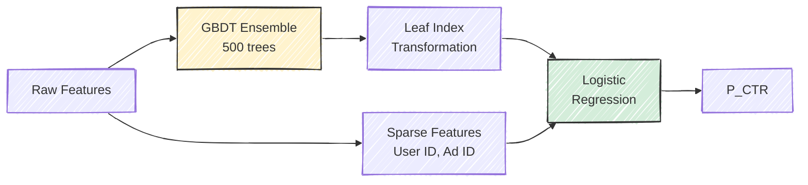
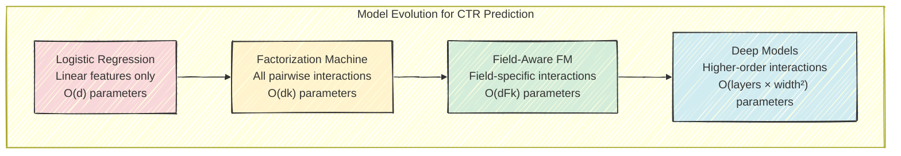
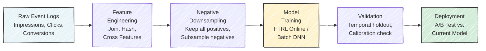

# Chapter 4: CTR Prediction --- The Core ML Problem

*This chapter covers the ML models and techniques used for click-through rate prediction, the most important ML problem in ad tech. We progress from logistic regression and FTRL-Proximal through feature engineering, the GBDT+LR hybrid, Factorization Machines, and Field-Aware FMs. We also cover evaluation metrics with an emphasis on calibration, and the practical realities of training pipelines at scale.*

---

## 4.1 Why CTR Prediction is Central to Everything

Every dollar spent in programmatic advertising flows through a single equation. Whether an advertiser is paying per click, per conversion, or per thousand impressions, the bid that a DSP submits for any given impression depends on its estimate of the probability that a user will click on the ad:

$$
\text{bid} = \text{advertiser\_value} \times p_{\text{CTR}} \times p_{\text{CVR}} \times 1000 \div \text{pacing\_multiplier}
$$

The CTR prediction $p_{\text{CTR}}$ is the most leveraged number in this equation. If a model overestimates CTR by 10%, the DSP systematically overbids by 10%, burning through the advertiser's budget faster than intended and winning auctions at prices above their true value. If it underestimates by 10%, the DSP loses auctions it should have won, delivering fewer impressions and leaving the advertiser's budget unspent. At the scale of a major DSP handling billions of impressions per day, a small improvement in prediction accuracy translates directly to millions of dollars in advertiser value. This is why ad tech companies invest more ML engineering resources in CTR prediction than in almost any other problem.

### The Prediction Task

The CTR prediction task is deceptively simple to state: given a tuple of (user, ad, context) features extracted from a bid request, output $P(\text{click} \mid \text{user, ad, context})$, a value in $[0, 1]$. In practice, this number is extremely small. Typical display ad CTRs range from 0.05% to 0.5%, with an industry average around 0.2%. Search ads, which benefit from strong user intent signals, see higher rates of 1--3%. Rich media and video ads fall somewhere in between.

### What Makes This Problem Hard

Six characteristics make CTR prediction one of the most challenging applied ML problems:

**Extreme class imbalance.** At a 0.2% CTR, 99.8% of training examples are negatives. Naive training on this distribution drowns the positive signal in a sea of non-clicks. Techniques like negative downsampling (discussed in Section 4.6) are essential.

**Massive and sparse feature space.** Features like user ID, ad ID, and publisher domain are categorical with millions of unique values. The cross-product space (user $\times$ ad $\times$ publisher $\times$ time) contains billions of possible combinations, the vast majority of which are never observed in training data.

**Strict latency constraints.** The model must produce a prediction in under 5 milliseconds, at a throughput of millions of queries per second. This rules out many powerful but slow model architectures and places a premium on efficient inference.

**Non-stationarity.** User behavior shifts by hour, day, and season. A model trained on last week's data may be stale by Wednesday. News events, holidays, and competitor actions all cause distributional shift. Models must either be retrained frequently or be designed to adapt online.

**Calibration requirements.** Unlike many ML tasks where ranking quality (AUC) is sufficient, CTR models used for bidding must be well-*calibrated*: when the model predicts 2% CTR, approximately 2% of those impressions should actually receive a click. Poor calibration directly causes overbidding or underbidding.

**Delayed and partial feedback.** Clicks may arrive seconds to minutes after impression, and conversions days later. The model must be trained on data where recent examples may not yet have complete labels.

Taken together, these six challenges mean that CTR prediction is not simply "another classification problem." Standard ML practices --- random train/test splits, fixed feature schemas, batch training, and threshold-based evaluation --- must all be adapted for this domain. The rest of this chapter explores how the industry has addressed each challenge.

> **For the RL Engineer**: If you are accustomed to working with RL environments where reward signals arrive immediately after an action, CTR prediction will feel familiar in structure (state $\to$ action $\to$ reward) but alien in its feedback dynamics. The "reward" (click) is binary, extremely sparse, arrives with variable delay, and the environment (user population, competitor bids) is non-stationary. The closest RL analogue is a contextual bandit with delayed, sparse rewards in a drifting environment.

## 4.2 Logistic Regression: The Enduring Workhorse

Despite two decades of progress in deep learning, logistic regression remains one of the most widely deployed models for CTR prediction in production systems. Google described their production CTR system in the landmark paper by McMahan et al. (KDD, 2013), and at its core was a logistic regression model --- albeit one trained with a sophisticated online learning algorithm on billions of features. The model's staying power is not due to ignorance of alternatives but to a set of properties that are remarkably well-suited to the constraints of ad serving: it is fast at inference, naturally produces calibrated probabilities, is straightforward to update online, and its behavior is interpretable when things go wrong.

### Why Logistic Regression Persists

It is worth pausing to understand *why* logistic regression remains competitive against far more expressive models. The answer lies in the structure of the CTR prediction problem. The feature space is extremely sparse and high-dimensional, with most of the predictive signal concentrated in a small number of highly informative features (historical CTR, retargeting flag, ad position). In this regime, the benefit of capturing complex feature interactions --- the strength of deep models --- is often outweighed by the practical advantages of a simple model: faster inference (critical at millions of QPS), easier debugging (you can inspect individual feature weights), more stable online updates, and better calibration out of the box.

That said, the industry has been gradually moving toward deep models, especially for high-value traffic where the latency budget is more generous (video ads, native ads). The current state of the art in production is often a hybrid: a fast linear or FM model handles the initial filtering and bulk traffic, while a deep model is invoked selectively for the most promising opportunities.

### The Model

Logistic regression models the click probability as:

$$
P(\text{click} = 1 \mid \mathbf{x}) = \sigma(\mathbf{w}^T \mathbf{x}) = \frac{1}{1 + e^{-\mathbf{w}^T \mathbf{x}}}
$$

where $\mathbf{x}$ is a very high-dimensional sparse feature vector and $\mathbf{w}$ is the learned weight vector. The key phrase is *high-dimensional sparse*: the feature vector might have millions of dimensions (one for every possible value of every categorical feature), but for any single impression, only a handful of those dimensions are non-zero. A typical impression activates 10--50 features out of millions.

### Feature Representation: The Hashing Trick

With millions of categorical feature values (user IDs, ad IDs, publisher domains, query terms), explicitly maintaining a vocabulary and one-hot encoding is impractical. The **hashing trick**, popularized by Weinberger et al. (2009) and used extensively in Vowpal Wabbit, maps arbitrary feature strings to a fixed-size index space using a hash function:

$$
\text{index}(\text{feature\_name}, \text{feature\_value}) = \text{hash}(\text{feature\_name} \mathbin{:} \text{feature\_value}) \mod M
$$

where $M$ is the hash table size, typically $2^{20}$ to $2^{30}$ (roughly 1 million to 1 billion buckets). Collisions are inevitable but acceptable: the hash table is large enough that collisions are rare, and when they do occur, they act as a form of implicit regularization by tying together the weights of unrelated features. For rare features (which are the majority in CTR data), this regularization through collision can actually *improve* generalization.

```python
import hashlib

def feature_hash(name: str, value: str, size: int = 2**24) -> int:
    """Map a feature name-value pair to a fixed-size index."""
    raw = f"{name}:{value}"
    h = int(hashlib.md5(raw.encode()).hexdigest(), 16)
    return h % size
```

> **Historical Note**: The hashing trick originated in the natural language processing and spam filtering communities. Its adoption in ad tech was driven by the same scale challenge: when your vocabulary grows unboundedly (new users, new ads, new publishers every day), you need a representation that does not require maintaining an explicit dictionary.

### Training with FTRL-Proximal

The standard batch training approach --- collect data, shuffle, run stochastic gradient descent for several epochs --- does not work well for CTR prediction at scale. The data arrives continuously, the distribution shifts over time, and the dataset is too large to store and reshuffle. Instead, the industry standard for logistic regression CTR models is **online learning**, where the model processes each training example once, in the order it arrives, and immediately updates its weights.

McMahan et al. (2013) at Google introduced **FTRL-Proximal** (Follow-The-Regularized-Leader with Proximal regularization), which became the de facto algorithm for large-scale online CTR prediction. FTRL-Proximal has two properties that make it especially well-suited to this setting:

**Per-coordinate learning rates.** Rather than using a single global learning rate, FTRL-Proximal maintains a separate effective learning rate for each feature. Features that appear in many impressions (e.g., "hour=14," which fires for every impression during the 2pm hour) receive small learning rates, so the model updates them conservatively. Features that appear rarely (e.g., a specific user-ad cross feature) receive large learning rates, allowing the model to learn quickly from limited data. This automatically handles the enormous variation in feature frequencies without manual tuning.

**L1-induced sparsity.** FTRL-Proximal's update rule naturally drives many weights to exactly zero, producing a sparse model. This is critical for both memory efficiency (you only need to store non-zero weights) and serving speed (inference only touches active features). In Google's production system, McMahan et al. reported that FTRL-Proximal models were significantly sparser than models trained with standard SGD, with no loss in accuracy. In their experiments, fewer than 10% of the features in a billion-feature model had non-zero weights, meaning the deployed model consumed a fraction of the memory that a dense representation would require.

The update rule maintains two per-feature accumulators, $z_i$ (gradient accumulator) and $n_i$ (squared gradient accumulator), and computes the weight for feature $i$ lazily at prediction time:

$$
w_i = \begin{cases}
0 & \text{if } |z_i| \leq \lambda_1 \\
-\frac{z_i - \text{sign}(z_i) \cdot \lambda_1}{\frac{1}{\eta_i} + \lambda_2} & \text{otherwise}
\end{cases}
$$

where $\eta_i = \alpha / (\beta + \sqrt{n_i})$ is the per-coordinate learning rate and $\lambda_1$, $\lambda_2$ are L1 and L2 regularization parameters. The threshold $\lambda_1$ in the first case is what produces exact zeros: features with weak accumulated gradient signals are zeroed out entirely.

> **Key Insight**: FTRL-Proximal's per-coordinate learning rates are the unsung hero of large-scale CTR prediction. Consider: the feature "device=iPhone" might appear in 30% of all impressions, while "user=abc123 AND ad=xyz789" might appear once in the entire training set. A single global learning rate cannot serve both features well. FTRL-Proximal solves this elegantly by treating each feature's learning rate as a separate adaptive quantity.

## 4.3 Feature Engineering for CTR

Good features are the single biggest driver of CTR model quality. The 2014 paper from Facebook's ads team (He et al., AdKDD 2014) reported that adding new features consistently produced larger accuracy gains than changing model architectures. While deep learning has narrowed this gap somewhat, feature engineering remains critical, especially for the logistic regression and factorization machine models that handle the bulk of serving traffic.

Features for CTR prediction fall into four broad categories, each with different characteristics and predictive power.

### User Features

User features describe the person who will see the ad. These range from demographic attributes (age bracket, gender, geographic location) to behavioral signals (browsing history, past click behavior, purchase history). The most predictive user feature by far is **historical CTR** --- the user's personal click rate over recent impressions. A user who clicks on 1% of ads they see is ten times more likely to click on the next ad than a user who clicks on 0.1%. Behavioral recency also matters: a user who clicked an ad five minutes ago is in a more engaged state than one whose last click was a week ago.

### Ad and Creative Features

Ad features describe the advertisement itself: the advertiser, the industry vertical, the creative format and dimensions, and the historical performance of this specific ad. An ad's global average CTR is a strong prior --- some ads are simply more compelling than others, and this effect is consistent across users and contexts. A well-designed creative with a compelling call-to-action and relevant imagery can achieve 3--5x the CTR of a generic banner from the same advertiser. Whether the ad is a retargeting creative (showing a product the user previously viewed) is also highly predictive, as discussed below.

### Context Features

Context features describe the environment: which publisher, which page, which ad position, what time of day, what day of the week. Ad position is particularly important --- an ad above the fold (visible without scrolling) receives dramatically more attention than one below the fold, with CTR differences of 2--3x being common. Time features capture diurnal and weekly patterns: CTR for food delivery ads peaks around meal times; CTR for entertainment ads peaks on weekend evenings. Publisher quality varies enormously: a premium news site with high editorial standards typically delivers higher engagement than a content farm, even controlling for audience demographics.

Increasingly, context features also include semantic signals derived from the page content itself. NLP models can analyze the text of an article to determine its topic, sentiment, and brand safety --- for example, an advertiser may not want their ad appearing next to a news story about a product recall or a political controversy. These semantic context features are becoming more important as user-level signals degrade.

### Cross Features: Where the Real Signal Lives

The most powerful features are not individual attributes but *interactions* between them. That a user is a sports enthusiast is mildly predictive. That an ad is for athletic shoes is mildly predictive. But the combination --- a sports enthusiast seeing an athletic shoe ad --- is highly predictive. These cross features capture the *relevance* between user and ad, which is the core signal that CTR models must learn.

The single most predictive cross feature in the industry is the **retargeting flag**: whether the user has previously visited the advertiser's website. A user who browsed Nike's running shoe page yesterday is 10--20x more likely to click a Nike running shoe ad today than a user with no prior Nike engagement. This is why retargeting campaigns command large budgets despite reaching narrow audiences.

Beyond binary retargeting flags, richer user-ad interaction features capture the depth of engagement. Did the user merely land on the homepage, or did they add a specific product to their cart? How recently did they visit? How many times? These gradations of engagement history form a spectrum of predictive power. A user who abandoned a shopping cart 2 hours ago is far more valuable than one who briefly visited the homepage 3 weeks ago, and the CTR model needs features that distinguish these cases.

| Rank | Feature Type | Relative Importance |
|------|-------------|-------------------|
| 1 | Historical user-ad CTR | Highest |
| 2 | Retargeting flag (user visited advertiser site) | Very high |
| 3 | Historical ad-level CTR | High |
| 4 | User recency and frequency | High |
| 5 | Ad position (above/below fold) | Moderate-high |
| 6 | Publisher quality score | Moderate |
| 7 | Time features (hour, day) | Moderate |
| 8 | Device type | Low-moderate |
| 9 | Geographic features | Low |
| 10 | Creative attributes (size, format) | Low |

*Ranking based on empirical findings from He et al. (2014) at Facebook and consistent with broader industry experience.*

> **Key Insight**: The table above reveals an important asymmetry. Behavioral features (rows 1--4), which describe what the user and ad have *done* in the past, are far more predictive than static features (rows 7--10), which describe what they *are*. This is why the privacy changes discussed in Chapter 3 are so disruptive: they primarily degrade behavioral features, which carry the most predictive power.

## 4.4 The GBDT + LR Hybrid: Facebook's Approach

Before diving into Factorization Machines, it is worth examining the approach that Facebook described in their influential 2014 paper (He et al., AdKDD 2014), because it represents a different philosophy for capturing feature interactions: rather than learning interactions end-to-end, use a tree ensemble to *discover* useful feature combinations, then feed those combinations into a linear model.

The idea is simple but effective. A **Gradient Boosted Decision Tree** (GBDT) ensemble is trained on the raw feature set to predict CTR. Each tree in the ensemble partitions the feature space along decision boundaries that correspond to useful feature combinations --- for example, one leaf might capture "mobile user AND evening AND sports publisher," a combination that a linear model would miss without explicit cross-feature engineering. Rather than using the GBDT's predictions directly, each training example is passed through the ensemble, and the *leaf indices* from each tree become binary features for a downstream logistic regression model.

If the GBDT ensemble has $T$ trees and tree $t$ has $L_t$ leaves, the transformation produces a binary feature vector of length $\sum_t L_t$, where exactly $T$ features are active (one leaf per tree). This feature vector captures the non-linear interactions that the trees discovered, while the logistic regression provides calibrated probability estimates and the ability to incorporate additional features (like real-valued or high-cardinality categorical features) that the GBDT handles poorly.



Facebook reported that this hybrid approach improved NE by over 3% relative to either GBDT or LR alone. The approach was particularly effective because it combined the GBDT's ability to discover feature interactions with logistic regression's calibration properties and ability to handle extremely high-cardinality sparse features (like user ID) that tree models struggle with.

The GBDT+LR approach also has a practical advantage: the tree ensemble can be retrained daily on a manageable subset of data (since GBDTs work well on dense features and moderate data sizes), while the downstream logistic regression can be updated more frequently with online learning, incorporating the tree-derived features alongside fresh behavioral signals.

> **Key Insight**: The GBDT+LR hybrid illustrates a broader principle in CTR prediction: the best production systems often combine models with complementary strengths rather than searching for a single perfect model. Trees are good at finding interactions in dense features; linear models are good at handling sparse, high-cardinality features and producing calibrated outputs. Combining them gives you both.

## 4.5 Factorization Machines: Learning Feature Interactions

The fundamental limitation of logistic regression is that it treats each feature independently. If the combination of "male user" and "sports ad" has a higher CTR than either feature alone would predict, you must manually engineer a cross feature to capture this interaction. With millions of feature values, the space of possible pairwise interactions is astronomical, and most specific combinations are never observed in training data.

**Factorization Machines** (FMs), introduced by Steffen Rendle (ICDM, 2010), solve this problem elegantly by learning a low-dimensional latent embedding for each feature value and modeling pairwise interactions as dot products between embeddings.

### The FM Model

The FM prediction equation adds an interaction term to the standard linear model:

$$
\hat{y}(\mathbf{x}) = w_0 + \sum_{i=1}^{d} w_i x_i + \sum_{i=1}^{d} \sum_{j=i+1}^{d} \langle \mathbf{v}_i, \mathbf{v}_j \rangle \, x_i \, x_j
$$

where $w_0$ is a global bias, $w_i$ are linear weights (as in logistic regression), and $\mathbf{v}_i \in \mathbb{R}^k$ is a $k$-dimensional embedding vector for feature $i$. The interaction weight between features $i$ and $j$ is parameterized as the dot product $\langle \mathbf{v}_i, \mathbf{v}_j \rangle$ rather than as an independent parameter $w_{ij}$.

This factored parameterization is the key insight. Instead of learning $O(d^2)$ interaction weights (impossible given the dimensionality), the model learns $O(d \cdot k)$ embedding parameters, where $k$ is typically 8--32. More importantly, the factored structure enables **generalization across interactions**: even if user Alice has never seen ad X, the model can predict their interaction quality because Alice's embedding was learned from her interactions with other ads, and ad X's embedding was learned from other users' interactions with it. The dot product $\langle \mathbf{v}_{\text{Alice}}, \mathbf{v}_X \rangle$ captures the predicted affinity.

> **For the RL Engineer**: If you have worked with matrix factorization in recommender systems, FMs will feel familiar. The key extension is that FMs operate on *arbitrary feature vectors*, not just user-item matrices. Any pair of active features interacts through their embeddings, making FMs applicable to the rich, heterogeneous feature sets in CTR prediction.

### Efficient Computation

The naive computation of all pairwise interactions has complexity $O(k \cdot d^2)$, where $d$ is the number of features. This would be prohibitively expensive. However, Rendle showed that the interaction term can be reformulated:

$$
\sum_{i=1}^{d} \sum_{j=i+1}^{d} \langle \mathbf{v}_i, \mathbf{v}_j \rangle \, x_i \, x_j = \frac{1}{2} \sum_{f=1}^{k} \left[ \left( \sum_{i=1}^{d} v_{i,f} \, x_i \right)^2 - \sum_{i=1}^{d} (v_{i,f} \, x_i)^2 \right]
$$

This reduces the complexity to $O(k \cdot \bar{d})$, where $\bar{d}$ is the number of *non-zero* features in $\mathbf{x}$. Since the feature vector is sparse (typically 10--50 active features per impression), this is extremely efficient --- comparable to linear model inference.

The intuition behind this reformulation is a standard algebraic identity: the sum of all pairwise products can be expressed as half the difference between the square of the sum and the sum of squares. Each of the $k$ latent dimensions contributes independently, so the computation decomposes into $k$ independent passes over the active features.

### Field-Aware Factorization Machines (FFM)

Juan et al. (2016) at Criteo extended FMs with the observation that a feature should interact differently with features from different *fields*. In a standard FM, the embedding for "user=Alice" is the same regardless of whether it is interacting with an ad feature, a publisher feature, or a time feature. In an FFM, Alice has a separate embedding for each field she interacts with:

$$
\hat{y}(\mathbf{x}) = w_0 + \sum_{i} w_i x_i + \sum_{i} \sum_{j>i} \langle \mathbf{v}_{i, f_j}, \mathbf{v}_{j, f_i} \rangle \, x_i \, x_j
$$

where $f_i$ denotes the field of feature $i$, and $\mathbf{v}_{i, f_j}$ is the embedding of feature $i$ when interacting with features from field $f_j$. FFMs won two consecutive Criteo CTR prediction competitions on Kaggle and became widely adopted in production systems, particularly at Criteo and other companies with large-scale display advertising.

The tradeoff is model size: FFMs require $O(d \cdot F \cdot k)$ parameters where $F$ is the number of fields, compared to $O(d \cdot k)$ for FMs. With dozens of fields and millions of features, this can be substantial, but the accuracy gains are consistent.

To make the distinction concrete, consider two features: "user=Alice" (from the user field) and "publisher=ESPN" (from the context field). In an FM, Alice has a single embedding vector $\mathbf{v}_{\text{Alice}}$ used for all interactions. In an FFM, Alice has separate embeddings $\mathbf{v}_{\text{Alice}, \text{ad\_field}}$, $\mathbf{v}_{\text{Alice}, \text{context\_field}}$, and so on. The embedding Alice uses when interacting with an ad feature captures something like "Alice's ad preferences," while the embedding she uses when interacting with a publisher feature captures "Alice's publisher preferences." These can be quite different vectors, capturing different aspects of Alice's behavior.

### From FMs to Deep Learning

The model evolution from logistic regression through FMs and FFMs to deep neural networks follows a clear trajectory: each step adds the ability to capture higher-order and more complex feature interactions. Deep models (Wide & Deep, DeepFM, DCN) can capture arbitrary-order interactions through their hidden layers, but they come with increased inference cost, training complexity, and reduced interpretability. In practice, many production systems maintain a hierarchy: a fast FM or LR model handles the bulk of traffic, while a slower deep model is used for high-value impressions where the additional accuracy justifies the latency cost.



## 4.6 Evaluation Metrics for CTR Models

Evaluating CTR models requires metrics that capture distinct aspects of prediction quality. A model can have excellent ranking ability but terrible probability estimates, or vice versa. In bidding systems, both dimensions matter.

### Log Loss (Binary Cross-Entropy)

The primary training objective and evaluation metric for CTR models is log loss:

$$
\text{LogLoss} = -\frac{1}{N} \sum_{i=1}^{N} \left[ y_i \log(p_i) + (1 - y_i) \log(1 - p_i) \right]
$$

where $y_i \in \{0, 1\}$ is the true label and $p_i$ is the predicted probability. Log loss penalizes confident wrong predictions severely: predicting 0.01 for a true positive incurs a loss of $-\log(0.01) = 4.6$, while predicting 0.5 incurs only $-\log(0.5) = 0.69$.

A natural baseline is the "naive" model that always predicts the base CTR $\bar{y}$. This model achieves a log loss equal to the binary entropy of the base rate: $H(\bar{y}) = -\bar{y} \log \bar{y} - (1 - \bar{y}) \log(1 - \bar{y})$. Any model that does worse than this baseline is actively harmful.

### AUC (Area Under the ROC Curve)

AUC measures ranking quality: the probability that a randomly chosen positive example (clicked impression) receives a higher predicted score than a randomly chosen negative example (non-clicked impression):

$$
\text{AUC} = P\big(f(x^+) > f(x^-)\big)
$$

AUC = 0.5 corresponds to random ranking; good CTR models achieve AUC in the range 0.70--0.85. AUC has the advantage of being threshold-independent and scale-invariant, making it easy to compare across datasets. Its limitation is that it is *insensitive to calibration*. A model that multiplies all predictions by 10 has the same AUC as the original, even though its probability estimates are wildly wrong.

A related metric, **GAUC** (Group AUC), computes AUC separately for each user (or each ad, or each session) and then averages, weighted by group size. GAUC is often a better proxy for online performance because it measures how well the model ranks within the context that matters (which ad is best for *this* user?) rather than globally across all users and contexts. Alibaba reported that GAUC correlated more strongly with online revenue than standard AUC in their CTR models.

### Normalized Entropy

Facebook introduced **Normalized Entropy** (NE) in their 2014 paper as a metric that captures both ranking quality and calibration relative to the base rate:

$$
\text{NE} = \frac{\text{LogLoss}}{H(\bar{y})}
$$

NE = 1.0 means the model is no better than predicting the base rate for every impression. Values below 1.0 indicate improvement. NE is particularly useful for comparing models across datasets with different base rates, since it normalizes out the inherent difficulty set by class imbalance. Facebook reported typical NE values of 0.89--0.93 for their production models, meaning the models captured 7--11% of the predictable information beyond the base rate. This may sound modest, but in a system processing billions of impressions per day, even a 1% relative improvement in NE translates to meaningful revenue gains.

### Calibration: Why It Matters More Than You Think

A model is well-calibrated if, among all impressions where it predicts a 2% CTR, approximately 2% are actually clicked. Formally, calibration requires:

$$
P(y = 1 \mid p(x) = q) = q \quad \text{for all } q \in [0, 1]
$$

In many ML applications, calibration is a nice-to-have. In bidding, it is essential. Recall that bid $= \text{value} \times p_{\text{CTR}} \times 1000$. If $p_{\text{CTR}}$ is systematically 2x too high, the DSP bids 2x too much, wins more auctions than intended, but at ruinous prices. If $p_{\text{CTR}}$ is 2x too low, the DSP loses auctions it should win, underdelivering for the advertiser. The financial impact of miscalibration is direct and immediate.

> **Key Insight**: AUC and calibration measure fundamentally different things. AUC asks "can the model distinguish clickers from non-clickers?" Calibration asks "does the model know *how likely* a click is?" A model with AUC = 0.80 but poor calibration is dangerous for bidding. A model with AUC = 0.75 but excellent calibration may be safer. In production, teams track both metrics and treat calibration drift as an alert-worthy event.

### Calibration Correction for Negative Downsampling

Because of the extreme class imbalance (0.2% positive rate), training on the raw data wastes compute on the overwhelming majority of trivially-classifiable negatives. The standard practice is **negative downsampling**: keep all positive examples (clicks) but randomly subsample negative examples at a rate $r$ (typically 0.01--0.10, i.e., keeping 1--10% of non-clicks).

Downsampling distorts the class balance, causing the model to overestimate probabilities. The correction is straightforward. If $p_{\text{raw}}$ is the model's prediction trained on downsampled data:

$$
p_{\text{corrected}} = \frac{p_{\text{raw}}}{p_{\text{raw}} + (1 - p_{\text{raw}}) / r}
$$

For example, with a downsampling rate $r = 0.1$ and a raw prediction of 0.05:

$$
p_{\text{corrected}} = \frac{0.05}{0.05 + 0.95 / 0.1} = \frac{0.05}{0.05 + 9.5} = 0.00524
$$

This correction restores calibration to the original data distribution and is applied at serving time as a simple post-processing step.

The derivation of this formula comes from Bayes' rule. If the true positive rate is $p$ and we downsample negatives at rate $r$, the apparent positive rate in the training data is $p / (p + r(1-p))$. The correction formula inverts this transformation. It is important to note that downsampling preserves the *ranking* of predictions (AUC is unchanged) but distorts the *calibration* (log loss changes). The correction restores only calibration; if the model was poorly calibrated for other reasons (e.g., underfitting), this formula will not fix those issues.

## 4.7 Training Pipeline at Scale

Building and maintaining a CTR prediction system at production scale involves a pipeline that stretches from raw event logs to deployed model, with numerous practical decisions at each stage.



### Feature Engineering at Scale

The feature engineering stage joins impression logs with user profile data, ad metadata, and precomputed aggregates (historical CTRs, publisher quality scores). This join operation is one of the most expensive steps in the pipeline --- it requires looking up data across multiple distributed stores (user profiles, ad metadata, contextual features) and assembling them into a training example. At billion-example scale, this is typically implemented as a distributed MapReduce or Spark job.

Feature frequency filtering is a critical but often overlooked step: features that appear fewer than $k$ times in the training window (common choices are $k = 5$ to $k = 20$) are dropped. Rare features carry little signal and are prone to overfitting --- a feature that appeared once and was associated with a click has a 100% empirical CTR, but this is pure noise. In combination with the hashing trick, frequency filtering keeps the effective feature space manageable.

The join step is also where data quality issues most commonly arise. User profile stores may have stale data (a user's interests from six months ago), ad metadata may not reflect recent creative changes, and timestamp misalignment between different data sources can introduce subtle feature leakage. Experienced teams invest heavily in data validation checks --- comparing feature distributions between training and serving, monitoring for sudden changes in feature coverage rates, and running consistency checks across data sources.

A particularly subtle issue is **train-serve skew**: the features available at training time may differ from those available at serving time. For example, a feature like "user's CTR over the last 7 days" is easy to compute in an offline training pipeline but requires a real-time streaming aggregation system at serving time. If the offline and online computations produce slightly different values (due to different data freshness, different aggregation windows, or different handling of edge cases), the model's offline evaluation will not reflect its online performance.

### Temporal Data Splits: The Most Important Evaluation Decision

One of the most common mistakes in CTR model evaluation is randomly splitting data into train and test sets. Because user behavior and ad campaigns evolve over time, random splits allow future information to leak into the training set. For example, if a new ad campaign launches on Wednesday and achieves unusually high CTR, a random split might include Wednesday examples in the training set, allowing the model to "learn" the campaign's performance before it launches. The correct approach is a **temporal split**: train on data from days 1--6, validate on day 7. This simulates the real deployment scenario where the model must predict tomorrow's clicks based on what it learned from historical data.

Beyond the basic temporal split, teams should also consider **temporal stability**: does the model's performance remain consistent across different validation days, or does it fluctuate wildly? A model that achieves excellent NE on Tuesday but poor NE on Sunday is likely overfitting to specific days' patterns. Evaluating on multiple temporal holdout windows (e.g., each day of a week) gives a more robust estimate of expected online performance.

> **Industry Example**: He et al. (2014) at Facebook reported that their CTR model's NE improved by 3.5% (relative) when they switched from a random holdout to a temporal holdout, because the random holdout was leaking temporal patterns and giving overly optimistic offline metrics.

### Practical Lessons from Production Systems

Several lessons have emerged repeatedly from the experience of teams running CTR models at scale:

**Data freshness often beats model complexity.** A logistic regression retrained hourly frequently outperforms a deep neural network retrained daily. The online world changes fast --- new ads launch, trending topics shift user attention, competitor bid strategies evolve --- and a fresh, simple model captures these shifts better than a stale, complex one. McMahan et al. (2013) at Google emphasized this finding, noting that the recency of training data was the single most important factor in their system's performance.

**Watch for distribution shift.** If the model's average prediction drifts away from the observed CTR, something is wrong. This can be caused by changes in the ad inventory mix, seasonality, browser updates that affect tracking, or data pipeline bugs. Monitoring the ratio of predicted-to-observed CTR (often called the "prediction/actual ratio" or P/A ratio) on a rolling basis is one of the simplest and most valuable production checks.

**Negative downsampling is nearly universal.** Keeping all positive examples and subsampling negatives at 1--10% dramatically reduces training time and data volume, with minimal impact on model quality after calibration correction. This technique is so standard that most production CTR systems are designed around it from the ground up.

**The training pipeline is the model.** In practice, most CTR model bugs are not in the model architecture or training code but in the feature engineering and data pipeline. A join that silently drops 5% of click events, a timestamp bug that shifts features by one hour, or a stale user profile cache can each degrade model quality more than any amount of architectural tuning can recover. Robust data validation and pipeline monitoring are as important as model selection.

### A/B Testing and Safe Deployment

No CTR model is deployed without online validation through A/B testing. The standard practice is to allocate a small fraction of traffic (typically 1--5%) to the new model while the current production model handles the rest, then compare key business metrics: revenue per thousand impressions (RPM), advertiser ROI, CTR, win rate, and budget pacing accuracy.

A common pitfall is evaluating A/B tests using the same metrics as offline evaluation (AUC, log loss). A model with better offline AUC can still perform worse online if its calibration is off, if it interacts poorly with the pacing system, or if it changes the mix of inventory the DSP wins in ways that downstream systems are not designed for. The gold standard is **revenue impact**: does the new model generate more revenue for the DSP while maintaining or improving advertiser satisfaction?

Safe deployment also requires rollback mechanisms. If a new model causes a spike in overbidding (detectable via the P/A ratio) or a drop in win rate within the first few hours, the system should automatically revert to the previous model. Teams at Google and Meta have described automated "model health" monitoring systems that track dozens of real-time metrics and can trigger rollback without human intervention.

> **Industry Example**: McMahan et al. (2013) at Google described a deployment pipeline where new CTR models went through four stages: offline evaluation on historical data, online evaluation on a small traffic slice, gradual ramp-up over several days, and full deployment --- with automated monitoring at each stage. A model that showed even a small regression on any key metric was automatically pulled back.

---

## Exercises

### Conceptual

1. **Calibration vs. ranking.** Explain why calibration is more important for CTR models used in bidding than for CTR models used only for ad ranking (e.g., choosing which ad to show in a fixed slot). In which scenario is AUC sufficient, and why?

2. **Diagnosis exercise.** A CTR model achieves AUC = 0.80, but its average predicted CTR is 0.5% while the actual observed CTR is 0.2%. Diagnose the problem. Is this model safe to use for bidding? What would be the financial consequence of deploying it, and what are two approaches to fix it?

3. **Feature hashing as regularization.** Explain why hash collisions in the hashing trick can actually *help* model generalization for rare features, even though they introduce noise for common features. Under what conditions would collisions be harmful?

4. **FM generalization.** A Factorization Machine has learned embeddings for users $\{A, B, C\}$ and ads $\{X, Y, Z\}$. Users $A$ and $B$ both clicked on ad $X$, and user $B$ clicked on ad $Y$, but user $A$ has never seen ad $Y$. Explain, using the geometry of embedding dot products, why the FM can predict a positive interaction between user $A$ and ad $Y$ --- even with no direct training data for this pair.

5. **Freshness vs. complexity.** Your team is debating two strategies: (a) deploy a logistic regression model retrained every 2 hours via FTRL-Proximal, or (b) deploy a deep neural network retrained daily via batch training. Argue for each side. Under what conditions does each strategy win, and how would you design an experiment to decide between them?

---

## Further Reading

- McMahan et al. (2013) --- "Ad Click Prediction: A View from the Trenches" (KDD). The definitive paper on FTRL-Proximal and production-scale CTR prediction at Google. Essential reading.
- He et al. (2014) --- "Practical Lessons from Predicting Clicks on Ads at Facebook" (AdKDD). Describes the GBDT + logistic regression hybrid that powered Facebook's ad system, with excellent discussion of feature importance and normalized entropy.
- Rendle (2010) --- "Factorization Machines" (ICDM). The original FM paper; a beautiful synthesis of matrix factorization and feature-based prediction.
- Juan et al. (2016) --- "Field-aware Factorization Machines for CTR Prediction" (RecSys). Introduces FFMs and demonstrates their superiority on the Criteo and Avazu datasets.
- Weinberger et al. (2009) --- "Feature Hashing for Large Scale Multitask Learning" (ICML). The theoretical foundation for the hashing trick.
- Cheng et al. (2016) --- "Wide & Deep Learning for Recommender Systems" (DLRS, Google). Combines a wide linear model with a deep neural network, bridging the LR and deep learning approaches.
- Guo et al. (2017) --- "DeepFM: A Factorization-Machine based Neural Network for CTR Prediction" (IJCAI). Unifies FM interaction modeling with deep neural networks.
- Kaggle: Criteo Display Advertising Challenge and Avazu CTR Prediction competitions provide excellent benchmark datasets for experimenting with CTR models.
