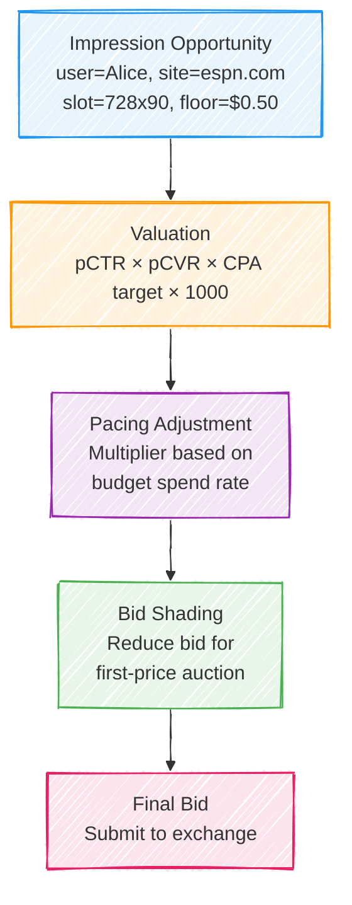
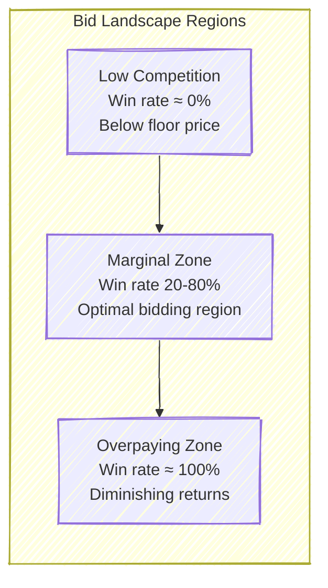
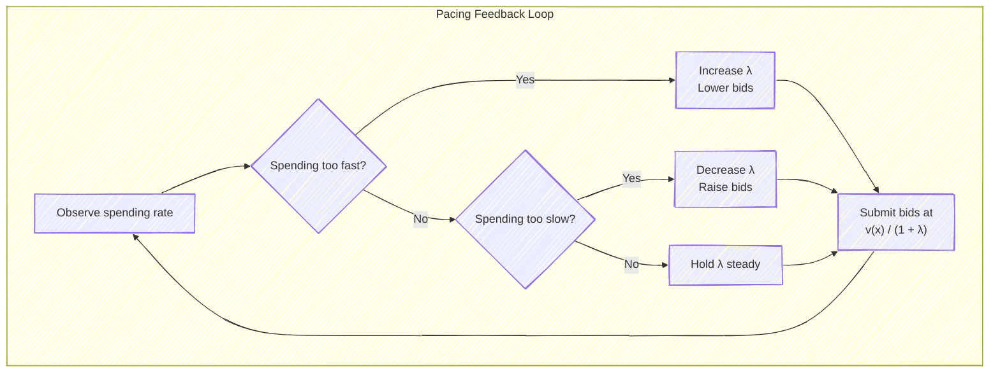
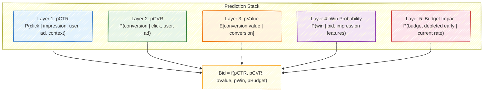
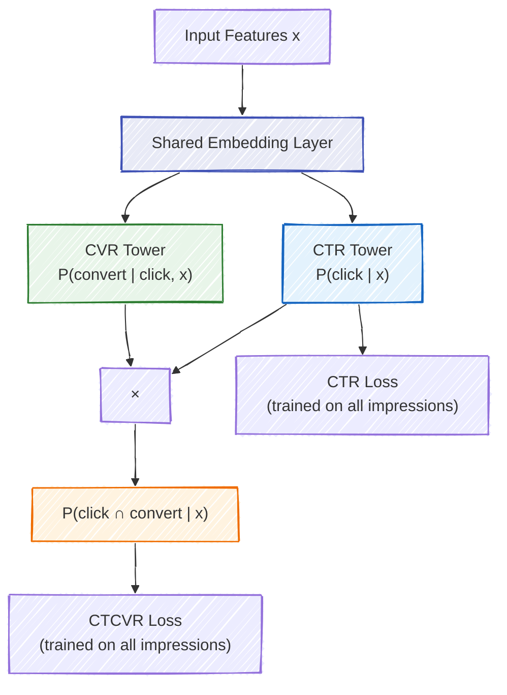
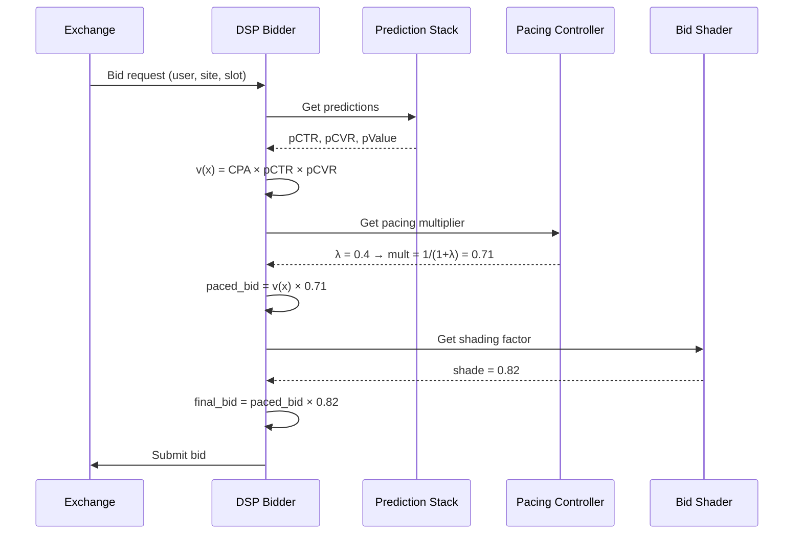

# Chapter 5: Bid Optimization and Pricing

Every time a bid request arrives, a demand-side platform faces a deceptively simple question: *how much is this impression worth, and what should we pay for it?* The answer depends on a cascade of predictions, constraints, and strategic considerations that together form the core of real-time bidding optimization.

This chapter develops the mathematics and systems behind that decision. We begin with the fundamental valuation equation, then layer on the complications that make this problem genuinely hard: first-price auction dynamics, budget constraints, and the shift from naive conversion-based bidding to incremental lift-based approaches. By the end, you will understand why a seemingly straightforward multiplication problem requires some of the most sophisticated optimization machinery in applied ML.

---

## 5.1 The Bidding Decision Pipeline

When an impression opportunity arrives — say, a 728x90 banner slot on espn.com for a user we will call Alice — the bidding system must execute a multi-stage pipeline in under 10 milliseconds. The pipeline transforms raw prediction signals into a final dollar amount.

Each stage has its own modeling challenge. Valuation requires accurate predictions of user behavior. Pacing requires solving a constrained optimization problem over time. Bid shading requires estimating the competitive landscape. In practice, all three interact: aggressive pacing increases bids, which changes the optimal shading strategy, which affects budget consumption, which feeds back into pacing.

> **For the RL Engineer**: If this pipeline reminds you of a policy network followed by action shaping and constraints, that is exactly the right intuition. In fact, several production systems now use reinforcement learning to jointly learn bidding policies that internalize all three stages. We will revisit this connection in later chapters.

---

## 5.2 The Fundamental Bidding Equation

The starting point for all bid computation is the *expected value* of an impression to the advertiser. This takes different forms depending on the campaign's pricing model.

For a **CPA (cost-per-acquisition) campaign**, which is the dominant model for performance advertisers:

$$\text{bid}_{\text{CPM}} = \text{CPA}_{\text{target}} \times p(\text{click} \mid x) \times p(\text{convert} \mid \text{click}, x) \times 1000$$

The factor of 1000 converts from a per-impression value to CPM (cost per mille), the standard unit for programmatic bids. For a **CPC (cost-per-click) campaign**:

$$\text{bid}_{\text{CPM}} = \text{CPC}_{\text{target}} \times p(\text{click} \mid x) \times 1000$$

And for a simple **CPM campaign** where the advertiser pays a flat rate per thousand impressions:

$$\text{bid}_{\text{CPM}} = \text{CPM}_{\text{target}}$$

These three cases unify into a single framework:

$$\text{bid} = v(x) \times \mu_{\text{pace}} \times \gamma_{\text{shade}}$$

where $v(x)$ is the impression value given features $x$, $\mu_{\text{pace}} \in [0, 1]$ is the pacing multiplier controlling budget spend rate, and $\gamma_{\text{shade}} \in [0, 1]$ is the bid shading factor for first-price auctions.

> **Key Insight**: The impression value $v(x)$ is a *point estimate* that combines multiple probabilistic predictions. Small calibration errors in any component multiply through the equation. A pCTR model that is systematically 20% too high inflates every bid by 20%, causing the campaign to overspend and win the wrong impressions. This is why calibration — not just ranking quality — is critical for bidding models.

---

## 5.3 The Bid Landscape

The **bid landscape** describes the competitive environment: how does the probability of winning change as you increase your bid? Understanding this landscape is essential for both bid shading and budget allocation.

Formally, the win probability function $w(b \mid x)$ gives the probability of winning an auction with bid $b$ for an impression with features $x$. In a first-price auction, this equals the CDF of the market clearing price distribution:

$$w(b \mid x) = P(\text{market price} \leq b \mid x) = F_{\text{market}}(b \mid x)$$

The typical bid landscape follows a sigmoid-like shape. At very low bids, the win rate is near zero — you are below the floor price or far below any competitor. At very high bids, the win rate approaches one, but you are overpaying. The interesting region is in between, where marginal increases in bid price yield meaningful increases in win probability.

In practice, the market price distribution is often well-approximated by a log-normal distribution, which makes intuitive sense: prices are positive, right-skewed, and multiplicative factors (competition intensity, time of day, user value) combine multiplicatively. If $Z$ is the market clearing price, then:

$$Z \mid x \sim \text{LogNormal}(\mu(x), \sigma(x))$$

where $\mu(x)$ and $\sigma(x)$ depend on impression features — a premium sports site during primetime will have very different parameters than a niche blog at 3 AM.

The **expected surplus** from bidding $b$ when the impression is worth $v$ to us is:

$$\mathbb{E}[\text{surplus}] = w(b) \cdot (v - b)$$

This is the product of two opposing forces: $w(b)$ increases with $b$, but $(v - b)$ decreases. The optimal bid $b^*$ balances these tensions.

> **Industry Example**: The Trade Desk reported that their bid shading algorithms saved advertisers an average of 20-30% on media costs when the industry transitioned from second-price to first-price auctions in 2019. Google's transition of AdX to first-price in September 2019 was a watershed moment that made bid shading table stakes for every DSP.

---

## 5.4 Bid Shading Strategies

In the second-price auction era, truthful bidding was optimal: you bid your true value, and if you win, you pay only the second-highest bid. The transition to first-price auctions changed everything. Now you pay what you bid, which means bidding your true value guarantees zero surplus. Every major DSP needs a bid shading strategy.

### Static Shade Factor

The simplest approach is to multiply every bid by a fixed fraction — say, 0.7. This requires no model and is trivial to implement. However, it ignores the competitive landscape entirely. In a highly competitive auction (many bidders, premium inventory), shading by 30% might cost you the impression. In a thin auction (few bidders, remnant inventory), you might still be overpaying even after shading.

### Competition-Adaptive Shading

Classical auction theory provides an elegant result for symmetric first-price auctions with $n$ bidders whose values are drawn from a common distribution. The Bayes-Nash equilibrium bidding strategy is:

$$b^*(v) = v - \frac{\int_0^v F(t)^{n-1} \, dt}{F(v)^{n-1}}$$

For the special case of uniformly distributed values on $[0, 1]$, this simplifies to:

$$b^*(v) = \frac{n - 1}{n} \cdot v$$

The intuition is beautiful: with more competitors, each bidder shades less because the risk of losing is higher. With 2 bidders, you shade by 50%. With 10 bidders, you shade by only 10%. This explains why competition-adaptive shading, where the system estimates $n$ from historical data, outperforms static shading.

> **Historical Note**: This equilibrium result was first derived by Vickrey (1961) in the same paper that introduced the second-price auction. The Revenue Equivalence Theorem shows that under certain conditions, the expected revenue to the seller is the same regardless of auction format — a result that surprised many practitioners when first-price auctions did not significantly increase publisher revenues.

### ML-Based Bid Shading (Production Approach)

Production systems go far beyond the symmetric model. They train neural networks to predict the minimum winning price for each impression, conditioning on features such as:

| Feature Category | Examples |
|---|---|
| Inventory features | Publisher, ad slot size, position, page category |
| Temporal features | Hour of day, day of week, seasonality |
| User features | Demographics, interests, device type |
| Competition signals | Historical win rates at various price points, number of exchanges |
| Market context | Overall demand level, time until campaign end |

The model is trained on historical auction data, but faces a fundamental challenge: **censored observations**. When you win an auction, you know the market price was *at most* your bid, but not exactly what it was. When you lose, you know the market price was *above* your bid, but again not the exact value. This is a classic survival analysis problem.

The shaded bid is then computed as:

$$b_{\text{shaded}} = \hat{z}(x) + \alpha \cdot \hat{\sigma}(x)$$

where $\hat{z}(x)$ is the predicted market clearing price, $\hat{\sigma}(x)$ is the predicted uncertainty, and $\alpha$ is a risk parameter that controls the tradeoff between winning more auctions and paying less. The final bid is clamped to $[\text{floor price}, v(x)]$.

> **For the RL Engineer**: The censored data problem in bid shading is analogous to partial observability in RL. You only observe the reward (clearing price) when you take a specific action (bid amount), and your observation is one-sided. Techniques from contextual bandits and inverse propensity scoring are directly applicable here.

---

## 5.5 Optimal Bidding Under Budget Constraints

Real campaigns have budgets. An advertiser might allocate \$50,000 per day to a campaign, and the bidding system must spread this budget across millions of impression opportunities to maximize total value. This transforms the bidding problem from a per-impression optimization into a sequential decision problem under resource constraints.

### The Constrained Optimization Problem

Let $t$ index impression opportunities over a campaign's lifetime, and let $v_t$ denote the value of impression $t$ if won. The advertiser wants to maximize net surplus — value captured minus cost paid — subject to the budget:

$$\max_{\{b_t\}} \sum_t (v_t - c_t) \cdot \mathbb{1}[\text{bid}_t \text{ wins}]$$

$$\text{subject to} \quad \sum_t c_t \cdot \mathbb{1}[\text{bid}_t \text{ wins}] \leq B$$

where $c_t$ is the cost of winning impression $t$ (equal to $b_t$ in a first-price auction) and $B$ is the total budget.

### The Lagrangian Approach

The standard approach is Lagrangian relaxation. We introduce a dual variable $\lambda \geq 0$ for the budget constraint:

$$\mathcal{L} = \sum_t \left[ (v_t - c_t) - \lambda \cdot c_t \right] \cdot \mathbb{1}[\text{bid}_t \text{ wins}] + \lambda \cdot B = \sum_t \left[ v_t - (1 + \lambda) c_t \right] \cdot \mathbb{1}[\text{bid}_t \text{ wins}] + \lambda \cdot B$$

The key insight emerges from the KKT conditions. At the optimum, impression $t$ should be won if and only if its value-to-cost ratio exceeds $1 + \lambda$:

$$\frac{v_t}{c_t} > 1 + \lambda$$

This gives the **budget-constrained optimal bid**:

$$b^*(x) = \frac{v(x)}{1 + \lambda}$$

The dual variable $\lambda$ acts as the **shadow price of budget** — it represents the marginal value of one additional dollar of budget. When $\lambda$ is high, budget is scarce and bids are reduced aggressively. When $\lambda$ is low, budget is plentiful and bids approach full value.

### Online Dual Variable Updates

In practice, $\lambda$ must be updated online as the campaign runs, because the future distribution of impression opportunities is unknown. The standard approach uses gradient ascent on the dual problem:

$$\lambda_{t+1} = \max\left(0, \; \lambda_t + \eta \cdot \left( \text{spend}_t - \text{target\_spend}_t \right) \right)$$

where $\eta$ is a learning rate and $\text{target\_spend}_t$ is the ideal spend for period $t$ (typically $B / T$ for uniform pacing, but can follow a more sophisticated schedule).

The choice of learning rate $\eta$ involves a familiar bias-variance tradeoff. A large $\eta$ tracks short-term fluctuations in supply but causes oscillation. A small $\eta$ is stable but slow to react to sudden changes in competition (e.g., a large competitor entering or leaving the market mid-day).

> **Key Insight**: The dual variable $\lambda$ has a clean economic interpretation. If $\lambda = 0.5$, then one additional dollar of budget would generate \$0.50 in campaign value. This makes $\lambda$ an actionable signal: if $\lambda$ is consistently high across campaigns, the advertiser should increase their budget. If $\lambda \approx 0$, the budget is not a binding constraint and money is being left on the table.

### Pacing Patterns in Practice

Uniform pacing (spend $B/T$ each period) is a reasonable default, but most production systems allow more sophisticated strategies:

| Pacing Strategy | Description | When to Use |
|---|---|---|
| Uniform | Equal spend per period | Default; works well when supply is stationary |
| Front-loaded | Spend more early, less later | When early impressions are higher value (e.g., event-driven campaigns) |
| Audience-based | Spend more when target audience is active | When the target demographic has predictable usage patterns |
| Competitive | Spend more when competition is low | Arbitrage opportunities; requires market intelligence |
| ASAP | Spend as fast as possible | When urgency outweighs efficiency (flash sales, breaking news) |

> **Industry Example**: Meta's delivery system uses a variant of this Lagrangian framework called "pacing control." Their system adjusts $\lambda$ every few minutes based on the discrepancy between actual and target spend. In their 2017 paper, they reported that this approach achieves within 1-2% of the optimal budget utilization for the vast majority of campaigns.

---

## 5.6 Value Estimation: Beyond pCTR × pCVR

The naive value formula $v = \text{CPA}_{\text{target}} \times \text{pCTR} \times \text{pCVR}$ treats every conversion as equally attributable to the ad. This is a significant oversimplification that modern systems are moving beyond.

### Multi-Touch Attribution

In the real world, a user may see ads from the same campaign across multiple channels and touchpoints before converting. A view on connected TV, a click on mobile, and a retargeting impression on desktop might all precede a single purchase. Which impression "caused" the conversion?

Different attribution models assign credit differently:

| Attribution Model | How Credit Is Assigned | Effect on Bidding |
|---|---|---|
| Last-touch | 100% to the last impression before conversion | Overvalues retargeting, undervalues prospecting |
| First-touch | 100% to the first impression | Overvalues awareness, undervalues conversion |
| Linear | Equal credit to all touchpoints | Dilutes signal across many impressions |
| Time-decay | Exponentially more credit to recent touches | Reasonable default; still ignores causality |
| Data-driven | ML model assigns credit based on counterfactuals | Best accuracy; hardest to implement |

The attribution weight modifies the bidding equation:

$$v(x) = \text{CPA}_{\text{target}} \times \text{pCTR}(x) \times \text{pCVR}(x) \times w_{\text{attribution}}(x)$$

where $w_{\text{attribution}}(x)$ depends on the touchpoint type, position in the user journey, and the attribution model in use.

### Incremental Value: Lift-Based Bidding

The most sophisticated approach asks a deeper question: not "will this user convert after seeing the ad?" but "will this user convert *because* of the ad?" This is the difference between **predictive** and **causal** value estimation.

The incremental value of an ad impression is:

$$v_{\text{incremental}}(x) = P(\text{convert} \mid \text{see ad}, x) - P(\text{convert} \mid \text{no ad}, x)$$

The first term is estimable from observational data. The second term — the counterfactual — requires either randomized experiments (public service announcement control groups, ghost bids) or causal inference techniques (instrumental variables, regression discontinuity).

> **Key Insight**: Lift-based bidding fundamentally changes which users are valuable. Consider two users. User A has an 80% conversion probability after seeing the ad, but would convert 79% of the time without it — incremental value is just 1%. User B has a 5% conversion probability with the ad and 0.5% without — incremental value is 4.5%, making them 4.5 times more valuable despite a much lower raw conversion rate. This insight explains why the most advanced DSPs invest heavily in causal inference.

> **Industry Example**: Google's Ghost Ads framework (2015) and Facebook's conversion lift studies both use randomized holdout groups to measure incremental value. Google reported that for some advertisers, over 50% of attributed conversions were organic — meaning naive bidding was dramatically overpaying for users who would have converted anyway.

---

## 5.7 The Multi-Task Prediction Stack

The bidding equation's simplicity belies the complexity of the prediction system that feeds it. A modern DSP's prediction stack produces multiple correlated estimates, each with its own modeling challenges.

Each layer introduces its own biases and failure modes:

- **pCTR** is trained on massive volumes of impression data, but must handle extreme class imbalance (click rates are typically 0.1-1%).
- **pCVR** suffers from *sample selection bias*: conversions are only observed for clicked impressions, not for the full impression space.
- **pValue** must predict continuous values (revenue amounts) from sparse signals, and is often dominated by heavy-tailed distributions.
- **Win probability** faces the censored data problem discussed in Section 5.4.
- **Budget impact** requires forecasting future supply and demand, which is inherently noisy.

### ESMM: Solving Sample Selection Bias

The sample selection bias in CVR prediction deserves special attention because it is both subtle and impactful. If you train a CVR model only on clicked impressions, the model learns $P(\text{convert} \mid \text{click}, x)$ but on a biased sample — the set of impressions that were clicked is not representative of the full impression space.

Alibaba's **Entire Space Multi-Task Model (ESMM)** addresses this elegantly by decomposing the joint probability:

$$P(\text{click} \cap \text{convert} \mid x) = P(\text{click} \mid x) \times P(\text{convert} \mid \text{click}, x)$$

The left-hand side, $P(\text{click} \cap \text{convert} \mid x)$, can be trained on *all* impressions (the label is 1 if the user both clicked and converted, 0 otherwise). The CTR tower is also trained on all impressions. The CVR tower's parameters are updated through the gradient flowing from the joint probability loss, even though the CVR tower's output represents the conditional $P(\text{convert} \mid \text{click})$. This eliminates the selection bias without requiring any special data collection.

> **For the RL Engineer**: The ESMM trick of training on the joint probability to avoid selection bias has parallels in off-policy evaluation in RL. Just as importance sampling corrects for the mismatch between the behavior policy and the target policy, ESMM corrects for the mismatch between the training distribution (all impressions) and the prediction target (CVR conditional on click). The mathematical machinery is different, but the conceptual challenge — learning about one distribution from samples drawn from another — is identical.

---

## 5.8 Putting It All Together

The complete bidding pipeline integrates all the components discussed in this chapter. For a single impression opportunity, the system:

1. Computes the impression value $v(x)$ using the multi-task prediction stack
2. Adjusts for attribution and incrementality if the advertiser supports it
3. Applies the pacing multiplier $v(x) / (1 + \lambda)$ based on the current dual variable
4. Applies bid shading using the predicted market clearing price
5. Enforces floor prices and other auction-specific constraints
6. Submits the final bid to the exchange

The entire sequence must complete within the exchange's timeout window, typically 50-100 milliseconds from request receipt to response. This latency constraint is what makes real-time bidding one of the most demanding ML serving environments in production.

---

## Exercises

### Conceptual

1. A campaign has a CPA target of \$40, pCTR = 0.5%, and pCVR = 3%. Calculate the bid in CPM terms. Now assume this is a first-price auction. Would you submit this exact amount? Explain why or why not, and describe qualitatively how much you would shade.

2. Explain the economic interpretation of the dual variable $\lambda$ as the "shadow price of budget." If a campaign manager observes $\lambda = 2.0$ on their campaign, what advice would you give them? What if $\lambda = 0.01$?

3. A retargeting campaign shows high conversion rates (pCVR = 15%) for users who previously visited the product page. Your team proposes bidding aggressively on these users. A colleague argues for lift-based bidding instead. Construct a concrete numerical example demonstrating when the colleague is correct.

4. Consider a DSP that uses a log-normal model for market clearing prices. During a major sporting event, the competitive landscape shifts dramatically. What failure modes might the bid shading model exhibit? How would you design the system to be robust to such distribution shifts?

5. In the ESMM framework, the CVR tower never directly receives a loss signal — it is trained entirely through the gradient of the joint CTCVR loss. Explain intuitively why this works. What would go wrong if you instead trained the CVR tower with its own binary cross-entropy loss on all impressions?

### Practical

6. Implement a simulation of the dual-variable pacing system. Use log-normal distributions for both impression values and market prices, with a sinusoidal multiplier to simulate time-of-day effects. Compare multiplicative update rules ($\lambda_{t+1} = \lambda_t \cdot e^{\eta \cdot g_t}$) versus additive updates ($\lambda_{t+1} = \lambda_t + \eta \cdot g_t$) in terms of budget utilization and total value captured.

7. Using historical auction data (you can simulate this with log-normal distributions), fit a bid landscape model and compute optimal bids for different impression values. Visualize the expected surplus as a function of bid price and shade factor.

---

## Further Reading

- **Vickrey (1961)** — "Counterspeculation, Auctions, and Competitive Sealed Tenders." The foundational paper on auction theory, introducing both the second-price auction and the equilibrium bidding strategy for first-price auctions.
- **Zhang, Yuan, Wang, Shen (2014)** — "Optimal Real-Time Bidding for Display Advertising" (KDD). Formalizes the budget-constrained bidding problem and derives the Lagrangian solution widely used in production.
- **Ren, Zhang, Chang, et al. (2018)** — "Bidding Machine: Learning to Bid for Directly Optimizing Profits in Display Advertising" (IEEE TKDE). Extends optimal bidding theory with practical ML models for bid shading.
- **Ma, Zhao, Huang, et al. (2018)** — "Entire Space Multi-Task Model: An Effective Approach for Estimating Post-Click Conversion Rate" (SIGIR). The ESMM paper from Alibaba solving sample selection bias.
- **Wang, Zhang, Yuan (2017)** — *Display Advertising with Real-Time Bidding*, Chapters 4-5. Comprehensive textbook treatment of bid optimization and budget allocation.
- **Balseiro, Gur (2019)** — "Learning in Repeated Auctions with Budgets" (Management Science). Theoretical foundations for online pacing algorithms with regret guarantees.
