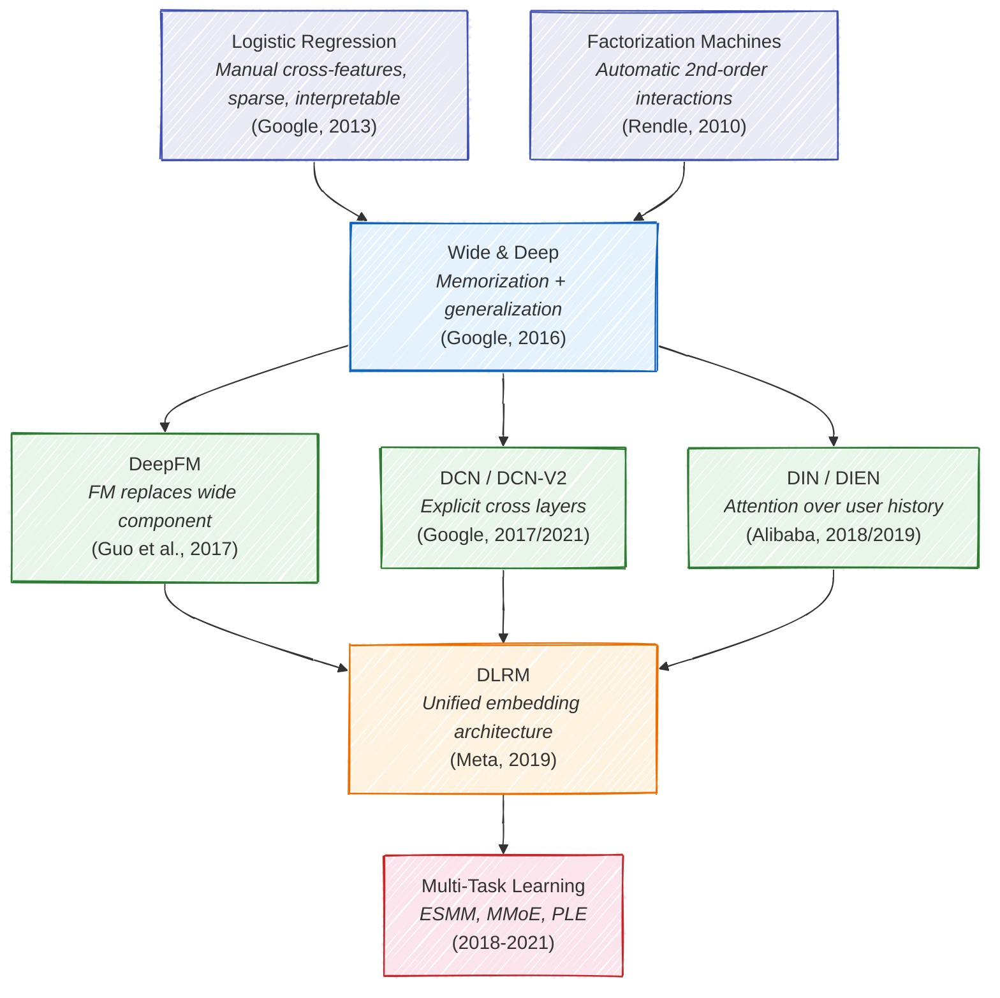
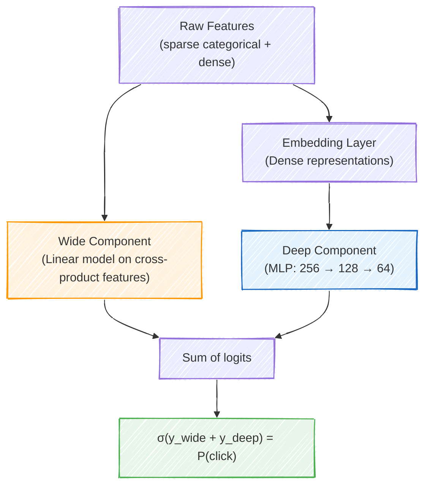
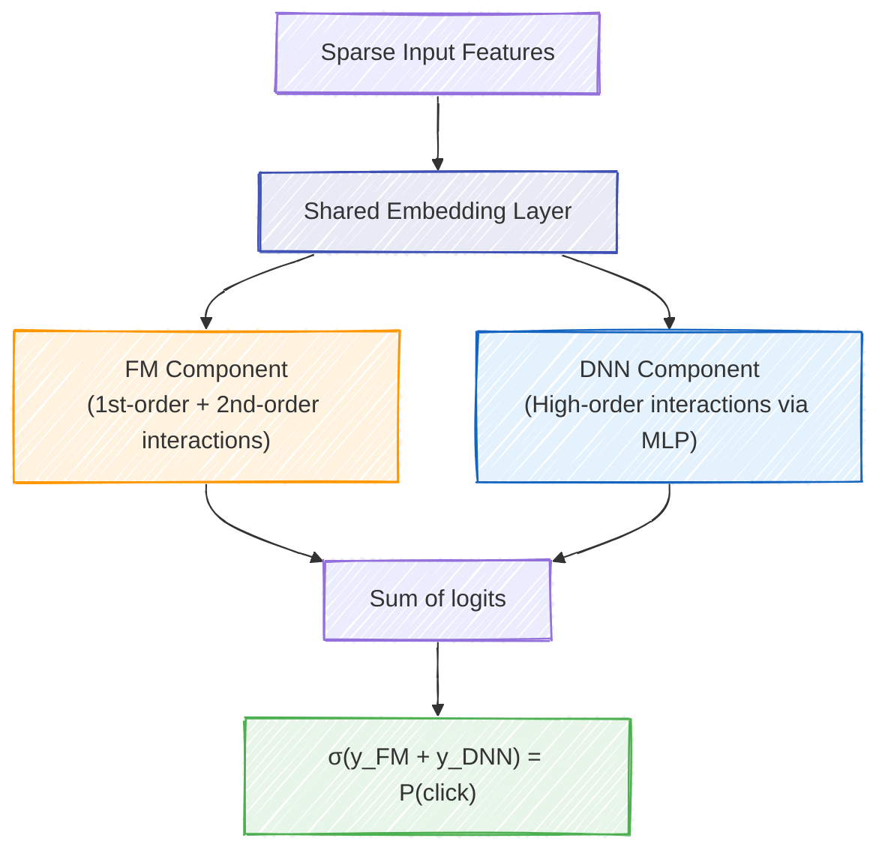
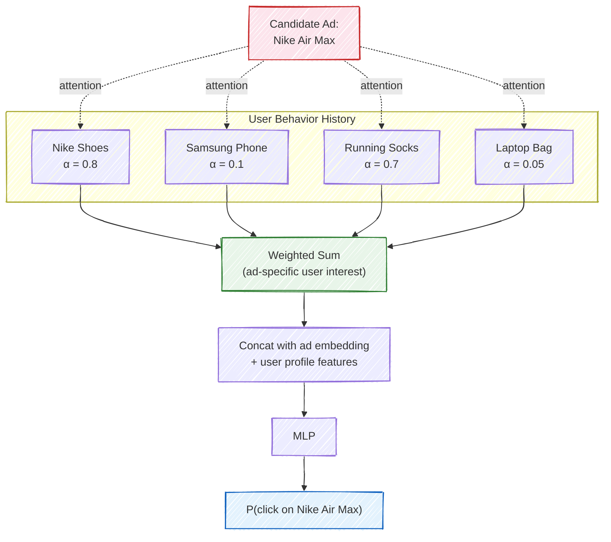
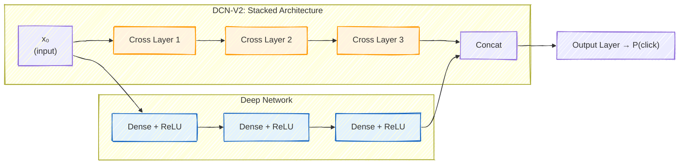
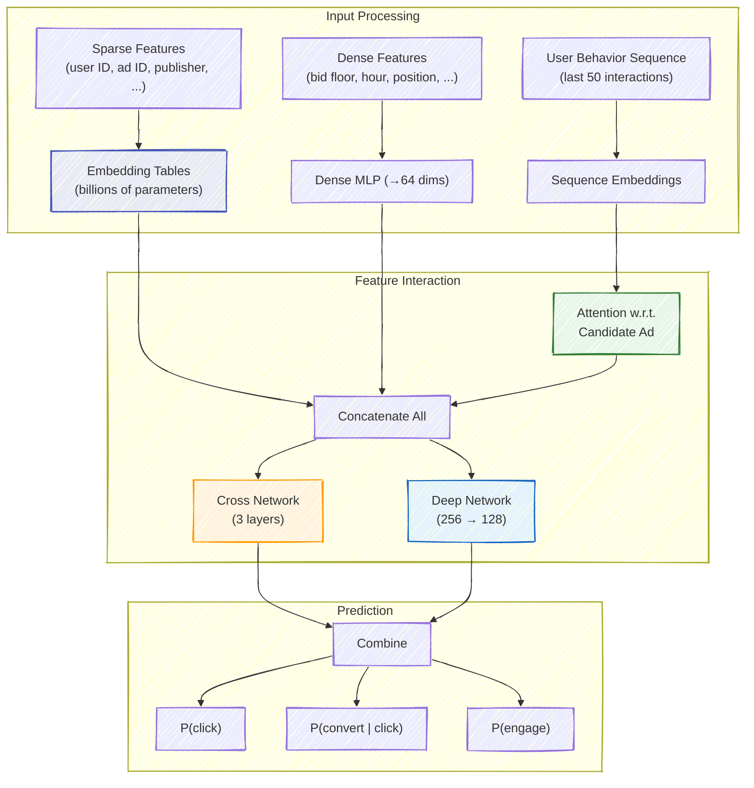
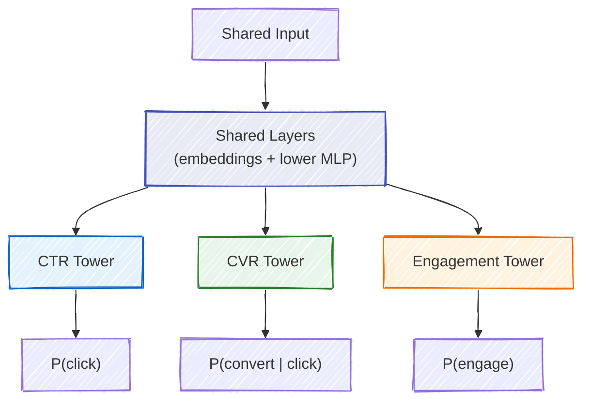

# Chapter 6: Deep Learning for User Response Prediction

Click-through rate prediction is the engine that drives programmatic advertising. Every bid computation starts with a probability estimate — *will this user click on this ad?* — and the quality of that estimate determines whether billions of dollars in ad spend are allocated efficiently or wasted. This chapter traces the evolution of CTR prediction from logistic regression to the deep learning architectures that power today's largest advertising systems.

The progression is not merely "deeper networks are better." Each architectural innovation addresses a specific, well-defined limitation of its predecessors. Wide & Deep separates memorization from generalization. DeepFM automates feature crossing. DIN introduces ad-aware user representations. Understanding *why* each innovation exists matters more than memorizing the architectures themselves — because the next generation of models will solve the next limitation, and you need to recognize what that limitation is.

---

## 6.1 The Evolution from Shallow to Deep

For most of the 2010s, logistic regression was the workhorse of CTR prediction at scale. It was fast, interpretable, and could handle billions of sparse features through hashing and online learning. Google's 2013 paper on ad click prediction reported using logistic regression with over a billion features, updated via online learning on streams of billions of examples per day.

The limitation was feature interactions. If "user likes basketball" and "ad is for Nike shoes" are both predictive features, their *combination* is far more predictive than either alone. Logistic regression cannot learn this interaction unless a human engineer explicitly creates a cross-feature like "user_likes_basketball AND ad_brand_nike." At Google's scale, engineers maintained thousands of hand-crafted cross-features — a process that was labor-intensive, incomplete, and fragile.

Factorization Machines (Rendle, 2010) offered the first automated solution by modeling all pairwise feature interactions through learned embedding vectors. But they were limited to second-order interactions. The question then became: can we learn arbitrary-order feature interactions automatically?

Each branch of this family tree addresses a different aspect of the problem. The left branch (DeepFM, DCN) focuses on better feature interaction modeling. The right branch (DIN, DIEN) focuses on better user representation. They converge in modern production systems that incorporate ideas from all branches.

---

## 6.2 Wide & Deep (Google, 2016)

Google's Wide & Deep model was introduced not as a research curiosity but as the production ranking system for the Google Play app store. Its design reflects a real tension that Google's engineers observed: **memorization** and **generalization** require fundamentally different model architectures, and a single model struggles to do both well.

**Memorization** means learning that specific feature combinations are predictive. "User installed Netflix AND ad is for Hulu" is a memorized pattern — it works because these two specific apps are competitors. A linear model with cross-product features excels at memorization because each cross-feature has its own independent weight.

**Generalization** means extrapolating to unseen feature combinations. If the model has never seen the combination "User installed Netflix AND ad is for Disney+," it should still predict a high click probability by recognizing the latent structure — both are streaming services. Embedding-based deep networks excel at generalization because similar items end up with similar embeddings.

The wide component computes:

$$y_{\text{wide}} = \mathbf{w}^T [\mathbf{x}, \phi(\mathbf{x})] + b$$

where $\phi(\mathbf{x})$ denotes hand-engineered cross-product features. The deep component passes concatenated embeddings through an MLP:

$$y_{\text{deep}} = \text{MLP}(\text{concat}(e_1, e_2, \ldots, e_k))$$

The final prediction combines both:

$$P(\text{click}) = \sigma(y_{\text{wide}} + y_{\text{deep}})$$

> **Key Insight**: The wide and deep components are trained jointly, which is critical. Joint training means the deep component only needs to complement what the wide component already captures (and vice versa), rather than each independently learning the full prediction function. In practice, this means the wide component can be much smaller than a standalone linear model, and the deep component can be shallower than a standalone DNN.

> **Industry Example**: In the original paper, Google reported a 3.9% improvement in app acquisition rate on Google Play compared to the previous wide-only model. While 3.9% may sound modest, at Google's scale this represented millions of additional app installs per day.

### The Limitation

Wide & Deep's main weakness is that the wide component still requires manual feature engineering — someone must decide which cross-product features to include. This is exactly the labor-intensive process that deep learning was supposed to eliminate.

---

## 6.3 DeepFM (2017)

DeepFM's contribution is conceptually clean: replace the wide component with a Factorization Machine, eliminating all manual feature engineering while preserving the dual memorization-generalization architecture.

A Factorization Machine models all pairwise feature interactions through embedding inner products. For features $x_1, \ldots, x_n$ with embeddings $\mathbf{v}_1, \ldots, \mathbf{v}_n$:

$$y_{\text{FM}} = \underbrace{\sum_i w_i x_i}_{\text{first-order}} + \underbrace{\sum_i \sum_{j>i} \langle \mathbf{v}_i, \mathbf{v}_j \rangle x_i x_j}_{\text{second-order interactions}}$$

The second-order term can be computed efficiently in $O(nk)$ time (where $k$ is the embedding dimension) using the identity:

$$\sum_i \sum_{j>i} \langle \mathbf{v}_i, \mathbf{v}_j \rangle x_i x_j = \frac{1}{2} \left[ \left\| \sum_i x_i \mathbf{v}_i \right\|^2 - \sum_i x_i^2 \left\| \mathbf{v}_i \right\|^2 \right]$$

This avoids the naive $O(n^2 k)$ computation of all pairwise inner products — a crucial optimization when $n$ can be in the thousands.

The critical design decision in DeepFM is **shared embeddings**: the FM component and the DNN component use the *same* embedding vectors. This means the FM's pairwise interaction learning and the DNN's higher-order pattern learning jointly shape the embedding space, leading to better representations than either would learn independently.

$$P(\text{click}) = \sigma(y_{\text{FM}} + y_{\text{DNN}})$$

> **For the RL Engineer**: If you have worked with value function decomposition in multi-agent RL (e.g., QMIX), the FM's pairwise interaction modeling will feel familiar. Both approximate a high-dimensional joint function by combining lower-order terms — QMIX uses a monotonic mixing network over per-agent utilities, while FM uses inner products over per-feature embeddings.

### Why Not Just Use a Deep Network?

A natural question: if a sufficiently deep MLP can approximate any function, why bother with the FM component at all? The answer is **sample efficiency**. The FM explicitly parameterizes all $O(n^2)$ pairwise interactions with only $O(nk)$ parameters. An MLP must learn these same interactions implicitly from data, requiring far more examples. For rare feature combinations (which dominate in sparse ad data), the FM provides crucial inductive bias.

---

## 6.4 Deep Interest Network (DIN, Alibaba, 2018)

The architectures discussed so far treat user features as a fixed vector. But users are not monolithic — they have diverse, sometimes contradictory interests. A user who recently browsed both running shoes and laptop accessories should be represented differently depending on whether the candidate ad is for Nike sneakers or a laptop bag.

DIN's key innovation is an **attention mechanism** that creates *ad-specific user representations*. Rather than compressing a user's entire behavior history into a single fixed vector, DIN dynamically weights each historical interaction based on its relevance to the current candidate ad.

### The Attention Mechanism

Given a user's behavior history $\{e_1, e_2, \ldots, e_T\}$ (embeddings of items the user has interacted with) and a candidate ad embedding $\mathbf{a}$, DIN computes attention weights:

$$\alpha_i = f(\mathbf{e}_i, \mathbf{a}) = \text{MLP}([\mathbf{e}_i; \mathbf{a}; \mathbf{e}_i - \mathbf{a}; \mathbf{e}_i \odot \mathbf{a}])$$

The user interest representation is then the weighted sum:

$$\mathbf{u}_{\text{interest}} = \sum_i \alpha_i \cdot \mathbf{e}_i$$

This means the same user gets different representations for different ads, which is exactly what we want.

Notice how the attention weights in the diagram reflect semantic similarity: Nike shoes and running socks are highly relevant to a Nike Air Max ad, while Samsung phone and laptop bag are nearly irrelevant. The same user would produce very different attention weights if the candidate ad were for a laptop case.

### Why Unnormalized Attention?

In a surprising departure from the standard attention mechanism (which applies softmax to normalize weights to sum to 1), DIN uses **unnormalized attention**. The weights $\alpha_i$ are not passed through softmax.

This is a deliberate design choice with important consequences. Normalized attention (softmax) forces the weights to sum to 1, meaning some behavior items must receive high weight even if *none* of them are relevant to the candidate ad. Unnormalized attention allows the total weight to be small when nothing in the user's history is relevant, effectively encoding a "relevance signal" — how much the user's history matters for this particular ad.

> **Key Insight**: The total attention weight $\sum_i \alpha_i$ acts as an implicit signal of how well-matched the user's interests are to the candidate ad. A high total weight means the user has a rich history of related interactions. A low total weight suggests a mismatch. This information would be lost with softmax normalization.

### From DIN to DIEN

Alibaba extended DIN with the **Deep Interest Evolution Network (DIEN, 2019)**, which models not just *what* the user has interacted with, but *how their interests evolve over time*. DIEN uses an auxiliary GRU to model temporal dynamics in the behavior sequence, with an attention-based GRU (AUGRU) that extracts the interest evolution path relevant to the candidate ad. This matters because a user who browsed running shoes three months ago and laptops yesterday has different intent than one who browsed laptops three months ago and running shoes yesterday.

---

## 6.5 Deep & Cross Network V2 (DCN-V2, Google, 2021)

While DeepFM handles pairwise interactions explicitly and relies on the DNN for higher-order ones, DCN-V2 introduces a more principled approach to learning explicit feature crosses of *arbitrary* order.

### The Cross Layer

The core building block is the cross layer, which applies a specific form of multiplicative interaction:

$$\mathbf{x}_{l+1} = \mathbf{x}_0 \odot (\mathbf{W}_l \mathbf{x}_l + \mathbf{b}_l) + \mathbf{x}_l$$

where $\mathbf{x}_0$ is the original input, $\mathbf{W}_l$ is a full weight matrix, and $\odot$ denotes element-wise multiplication. The element-wise product $\mathbf{x}_0 \odot (\cdot)$ creates new feature crosses by multiplying the original features with transformed versions of the current representation. The residual connection $+ \mathbf{x}_l$ preserves all lower-order terms.

After $L$ cross layers, the network explicitly models interactions up to order $L + 1$. This is more parameter-efficient than hoping an MLP will learn the same interactions implicitly.

### Mixture of Experts for Efficiency

The full weight matrix $\mathbf{W}_l \in \mathbb{R}^{d \times d}$ can be expensive when the input dimension $d$ is large (thousands of concatenated embedding dimensions). DCN-V2 uses a **mixture of low-rank experts** to reduce this cost:

$$\mathbf{W}_l = \sum_{e=1}^{E} g_e(\mathbf{x}_l) \cdot \mathbf{U}_l^{(e)} (\mathbf{V}_l^{(e)})^T$$

where $\mathbf{U}_l^{(e)} \in \mathbb{R}^{d \times r}$ and $\mathbf{V}_l^{(e)} \in \mathbb{R}^{d \times r}$ are low-rank factors with rank $r \ll d$, and $g_e(\mathbf{x}_l)$ are gating weights computed from the input. This reduces the parameter count from $O(d^2)$ to $O(Edr)$ per layer while maintaining expressiveness through the mixture.

> **Industry Example**: Google reported that DCN-V2 achieved a 0.6% improvement in offline logloss compared to production DNN models on a proprietary ads dataset. In the online setting, this translated to measurable revenue improvements. They also showed that the stacked variant (cross layers followed by deep layers in sequence, rather than in parallel) slightly outperformed the parallel variant shown above.

---

## 6.6 Production Architecture: Putting the Pieces Together

A production CTR model at a major ad platform is rarely a pure instantiation of any single paper. It is a composite system that draws ideas from multiple architectures, optimized for the specific tradeoffs of the deployment environment.

A typical production model combines:

| Component | Purpose | Derived From |
|---|---|---|
| Large embedding tables | Represent sparse categorical features (user IDs, ad IDs, publisher IDs) | Foundational; all modern architectures |
| Dense feature transformation | Normalize and project continuous features (bid floor, time features) | Standard practice |
| Cross network | Explicit low-order feature interactions | DCN-V2 |
| Deep network | Implicit high-order patterns | Wide & Deep, DeepFM |
| Attention over behavior sequence | Dynamic user interest representation | DIN / DIEN |
| Multi-task heads | Joint prediction of CTR, CVR, engagement | ESMM, MMoE |

The embedding tables are by far the largest component, often containing billions of parameters. Meta's DLRM paper (2019) revealed that embedding tables account for over 99% of the parameters in their production recommendation models, while the MLP layers account for the majority of the computation. This asymmetry has significant implications for system design: embedding lookups are memory-bound, while MLP computation is compute-bound.

> **Industry Example**: Meta's production recommendation system processes hundreds of billions of inference requests per day. Their custom hardware (the ZionEX platform) was designed specifically around the embedding-lookup-dominant access pattern, with high memory bandwidth and large memory capacity prioritized over raw floating-point throughput.

---

## 6.7 Multi-Task Learning for Bidding Predictions

Modern ad systems do not just predict clicks. They predict an entire hierarchy of user responses — click, conversion, purchase value, post-click engagement, video completion, and more — and combine these predictions to compute a bid. Multi-task learning (MTL) trains a single model to produce all of these predictions jointly, sharing representations where beneficial while maintaining task-specific capacity where needed.

### Why Multi-Task?

The pragmatic argument for MTL is resource efficiency: one model is cheaper to serve than five. But the deeper motivation is **transfer learning across tasks**. The CTR prediction task, trained on billions of examples, learns rich user and item representations that benefit the conversion prediction task, which has far fewer positive examples. Information flows from data-rich tasks to data-poor tasks through the shared layers.

### Shared-Bottom vs. Expert-Based Architectures

The simplest MTL architecture shares all lower layers and branches into task-specific "towers" at the top:

This works well when tasks are closely related, but suffers from **negative transfer** when tasks conflict — learning features that help CTR prediction might hurt engagement prediction. The **MMoE (Multi-gate Mixture of Experts)** architecture from Google (2018) addresses this by replacing the shared layers with multiple expert subnetworks, each task using a learned gating network to select which experts to attend to:

$$\mathbf{h}_{\text{task}_k} = \sum_{e=1}^{E} g_k^{(e)}(\mathbf{x}) \cdot f_e(\mathbf{x})$$

where $f_e$ is the $e$-th expert network, $g_k^{(e)}$ is the gating weight for task $k$ on expert $e$, and the gating weights are produced by a softmax over a learned linear projection of the input.

Tencent's **PLE (Progressive Layered Extraction, 2020)** goes further by introducing task-specific expert networks alongside shared experts, with multiple extraction layers that progressively separate shared and task-specific representations.

> **For the RL Engineer**: Multi-task learning in CTR prediction is analogous to multi-objective RL, where a single policy must optimize multiple reward signals simultaneously. The "negative transfer" problem in MTL corresponds to the Pareto frontier in multi-objective optimization — improving one objective may require degrading another. MMoE's gating mechanism plays a similar role to reward weighting schemes in multi-objective RL.

---

## 6.8 Model Serving at Scale

A production CTR model must deliver predictions within a strict latency budget. In a typical real-time bidding pipeline, the total response time is 50-100 milliseconds, and model inference gets only a fraction of that.

| Pipeline Stage | Typical Latency |
|---|---|
| Network round-trip | 30 ms |
| Feature extraction & lookup | 10-15 ms |
| **Model inference** | **3-5 ms** |
| Bid logic & response | 5-10 ms |
| Buffer | 10-40 ms |

Achieving sub-5ms inference for a model with billions of parameters requires a toolkit of serving optimizations:

**Model distillation** trains a smaller "student" model to mimic the predictions of a large "teacher" model. The student trains not on hard labels but on the teacher's soft probability outputs, which contain richer information (a prediction of 0.03 vs. 0.07 tells the student about relative difficulty even though both round to "no click"). Hinton et al. (2015) showed that distillation can compress models by 10-100x with minimal accuracy loss.

**Quantization** converts model weights from FP32 to INT8 or even INT4, reducing memory footprint and enabling faster integer arithmetic. For embedding tables (which dominate memory), quantization from FP32 to INT8 provides a 4x memory reduction with typically less than 0.1% degradation in AUC.

**Feature caching** pre-computes expensive features (e.g., user behavior aggregations) and stores them in low-latency stores like Redis or Memcached. User features that change slowly (demographics, long-term interests) can be cached for minutes or hours, while context features (current page, time) must be computed fresh.

**Cascading** uses a lightweight model (perhaps logistic regression) to quickly filter out impression-ad pairs that are clearly irrelevant, applying the expensive deep model only to competitive candidates. This can reduce the number of full model evaluations by 80-90%.

> **Industry Example**: Alibaba's production serving system processes over 100 million model inferences per second during peak traffic (Singles' Day). They use a combination of model distillation, INT8 quantization, and custom FPGA accelerators to maintain sub-5ms p99 latency. Their 2020 paper on COLD (Computing power cost-aware Online and Lightweight Deep model) describes how they dynamically adjust model complexity based on real-time latency measurements.

---

## 6.9 Calibration: Why Ranking Is Not Enough

A subtle but critical requirement for CTR models in bidding is **calibration** — the predicted probabilities must be accurate in an absolute sense, not just in ranking. If your model predicts a 2% click probability, approximately 2% of impressions with that score should actually be clicked.

Most ML practitioners focus on ranking metrics (AUC, NDCG), but in bidding, the predicted probability is multiplied by a dollar amount to produce a bid. A model with perfect AUC but systematically 2x overconfident will generate bids that are 2x too high, causing the campaign to overspend and win expensive, low-ROI impressions.

Calibration is typically measured using **expected calibration error (ECE)**: partition predictions into bins, and for each bin compare the average predicted probability to the actual positive rate. Common post-hoc calibration methods include:

- **Platt scaling**: fit a logistic regression on top of model scores using a held-out set
- **Isotonic regression**: fit a non-parametric monotonic function from scores to calibrated probabilities
- **Temperature scaling**: divide logits by a learned temperature parameter $T$ before the sigmoid

In practice, calibration is monitored continuously in production because it drifts as user behavior, ad inventory, and competition change. Many teams apply daily or hourly recalibration using the most recent data.

> **Key Insight**: A well-calibrated model is not necessarily well-ranked, and a well-ranked model is not necessarily well-calibrated. For bidding, you need both. AUC ensures you bid more on better impressions. Calibration ensures you bid the right *amount*. Most production systems optimize for AUC during training and apply calibration as a post-processing step.

---

## Exercises

### Conceptual

1. Why does DIN use unnormalized attention weights instead of applying softmax? Describe a concrete scenario where normalized attention would produce a worse user representation than unnormalized attention.

2. Compare DeepFM and Wide & Deep from the perspective of feature engineering effort. What manual work does DeepFM eliminate? Are there any scenarios where Wide & Deep's manual cross-features might outperform DeepFM's automatic interactions?

3. Explain the sample selection bias problem in CVR prediction. Why does training a CVR model only on clicked impressions produce biased estimates? How does ESMM's training procedure avoid this bias?

4. A colleague proposes replacing the entire CTR prediction stack with a single large transformer model. What advantages might this approach have? What practical challenges would you face in deploying it within a 5ms latency budget? Consider both the embedding table size and the attention mechanism's computational cost.

5. You observe that your production CTR model has an AUC of 0.78, which is competitive with published benchmarks, but your campaigns are consistently overspending their budgets by 15-20%. What is the most likely root cause, and how would you diagnose and fix it?

### Practical

6. Implement the FM interaction computation using the efficient $O(nk)$ formulation (sum-of-squares minus square-of-sums). Verify numerically that it produces the same result as the naive $O(n^2 k)$ pairwise computation.

7. Build a two-tower ESMM model and compare its CVR predictions against a single-tower model trained only on clicked impressions. Use synthetic data where you control the selection bias (e.g., the click model is correlated with but different from the conversion model). Measure calibration error, not just AUC.

---

## Further Reading

- **Cheng et al. (2016)** — "Wide & Deep Learning for Recommender Systems" (arXiv:1606.07792). The foundational architecture paper from Google, with production results from Google Play.
- **Guo et al. (2017)** — "DeepFM: A Factorization-Machine based Neural Network for CTR Prediction" (arXiv:1703.04247). Replaces wide component with FM; introduces shared embeddings.
- **Zhou et al. (2018)** — "Deep Interest Network for Click-Through Rate Prediction" (KDD, arXiv:1706.06978). Alibaba's attention-based architecture for user behavior modeling.
- **Wang et al. (2021)** — "DCN V2: Improved Deep & Cross Network" (arXiv:2008.13535). Google's mixture-of-experts approach to explicit feature crossing.
- **Naumov et al. (2019)** — "Deep Learning Recommendation Model for Personalization and Recommendation Systems" (arXiv:1906.00091). Meta's DLRM architecture and analysis of the embedding-compute asymmetry.
- **Ma et al. (2018)** — "Modeling Task Relationships in Multi-task Learning with Multi-gate Mixture-of-Experts" (KDD). The MMoE architecture for multi-task learning.
- **Ma, Zhao, Huang et al. (2018)** — "Entire Space Multi-Task Model" (SIGIR). Alibaba's solution to CVR sample selection bias.
- **Tang et al. (2020)** — "Progressive Layered Extraction: A Novel Multi-Task Learning Model for Personalized Recommendations" (RecSys). Tencent's PLE architecture extending MMoE.
