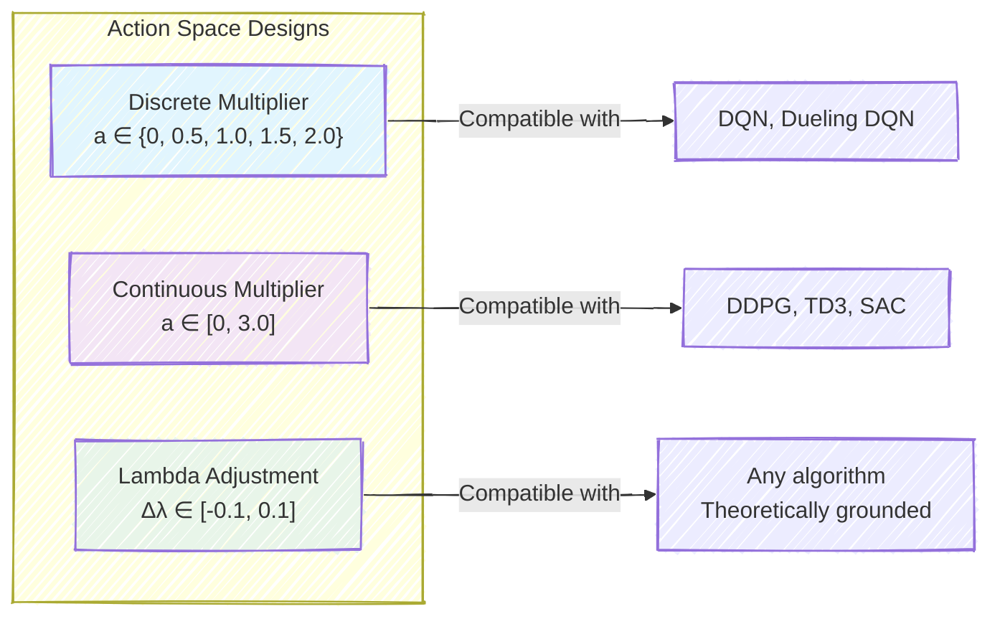
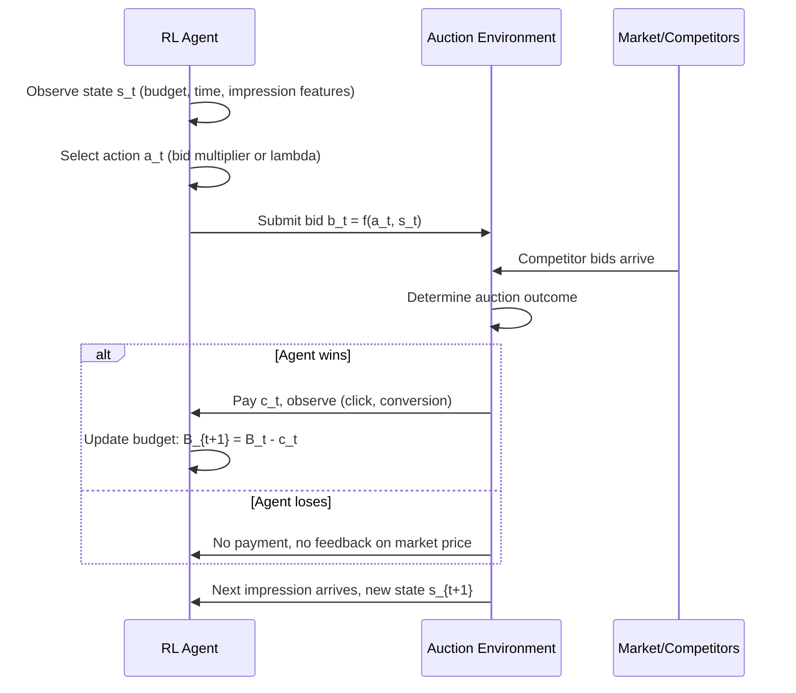
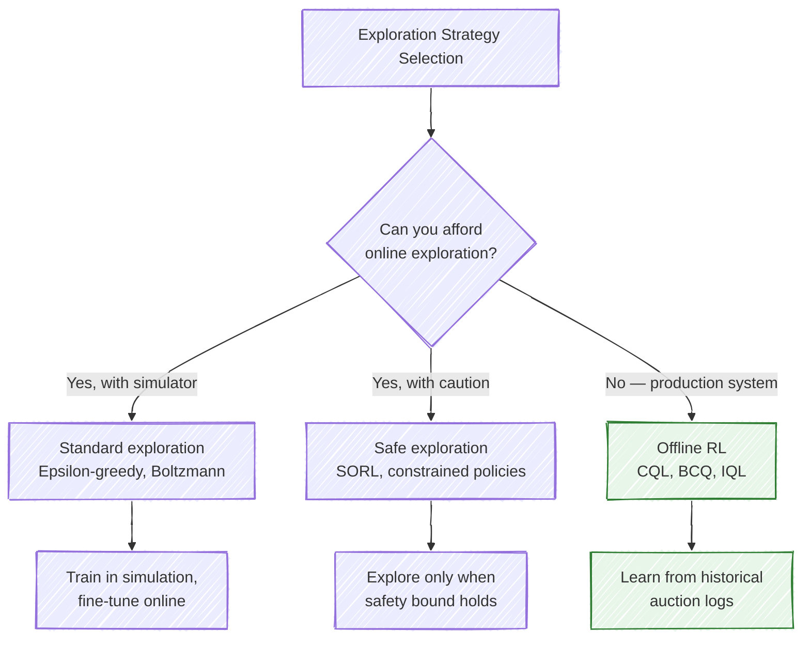
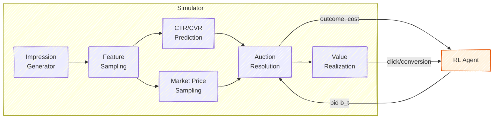
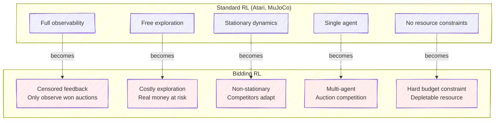

# Chapter 7: Formulating Bidding as a Reinforcement Learning Problem

---

## 7.1 Why Reinforcement Learning for Bidding?

The preceding chapters established how machine learning models predict click-through rates and conversion probabilities, and how those predictions feed into bid calculations. A natural question arises: if we can already compute an optimal bid for each impression as $b^* = v \cdot p(\text{click}) \cdot p(\text{conversion})$, why do we need reinforcement learning at all?

The answer lies in a single word: **budget**. A campaign with unlimited funds could bid optimally on each impression in isolation -- the myopic approach would be globally optimal. But real campaigns operate under hard budget constraints, and this changes everything. Each dollar spent on one impression is a dollar unavailable for future impressions. Today's bid decision constrains tomorrow's possibilities. This temporal coupling transforms bidding from a collection of independent optimization problems into a single sequential decision-making problem -- precisely the setting where RL excels.

Consider a concrete scenario. A campaign with a $10,000 daily budget starts at midnight. A greedy bidder, applying the value-based formula to each impression independently, discovers a cluster of high-value users browsing luxury goods at 7 AM and aggressively wins those impressions. By noon, 80% of the budget is spent. When an even more valuable cohort appears during the evening prime-time hours, the campaign can only participate in a fraction of the auctions. The greedy policy was locally rational at every decision point but globally suboptimal.

An RL agent, by contrast, learns to reason about the entire campaign trajectory. It might bid conservatively during the morning, preserving budget for the high-value evening hours it has learned to anticipate. This kind of temporal reasoning -- trading off immediate value against future opportunity -- is the hallmark of sequential decision-making and the core value proposition of RL for bidding.

> **For the RL Engineer**: You already know that RL shines when actions have long-term consequences. In bidding, the coupling mechanism is simple and concrete: the budget. Unlike robotics where dynamics are complex, or game-playing where the state space is enormous, bidding RL operates in a relatively low-dimensional state space with a very clear source of temporal dependence. The challenge is not in the MDP structure itself but in the practical constraints: you cannot explore freely (real money is at stake), the environment is non-stationary (competitors adapt), and feedback is censored (you only observe market prices for auctions you win).

### What Makes Bidding a Natural RL Problem

| RL Property | How It Manifests in Bidding |
|---|---|
| Sequential decisions | Thousands to millions of bid decisions per campaign per day |
| State dependence on history | Remaining budget is a function of all prior bids and outcomes |
| Delayed rewards | Conversions may occur hours or days after the initial impression |
| Need for exploration | The bid landscape (how win rate and cost vary with bid level) must be learned |
| Non-stationary environment | Competitor strategies, user behavior, and inventory composition shift over time |
| Hard constraints | Budget limits, CPA/ROAS targets, delivery pacing requirements |

> **Key Insight**: The critical distinction between ML-based bidding and RL-based bidding is not better prediction -- it is better *planning*. ML gives you better estimates of each impression's value; RL gives you a strategy for allocating a scarce resource (budget) across those impressions over time.

## 7.2 The Bidding MDP: Formal Formulation

We now formalize the bidding problem as a Markov Decision Process $(\mathcal{S}, \mathcal{A}, \mathcal{P}, \mathcal{R}, \gamma)$. While RL practitioners will find this formulation familiar in structure, the design choices within each component are what distinguish bidding from other RL domains.

### State Space

The state must capture enough information for the agent to make informed bid decisions. In practice, this means encoding three categories of information: the campaign's resource status, the current market context, and the impression opportunity at hand.

**Resource state** tracks where the campaign stands relative to its goals:

$$s_{\text{resource}} = \left(\frac{B_{\text{remaining}}}{B_{\text{total}}},\; \frac{T_{\text{remaining}}}{T_{\text{total}}},\; \frac{\text{impressions}_{\text{won}}}{\text{impressions}_{\text{target}}},\; \text{CPA}_{\text{running}},\; \text{CTR}_{\text{running}}\right)$$

**Market state** summarizes recent competitive dynamics:

$$s_{\text{market}} = \left(\bar{p}_{\text{win}}^{(\text{recent})},\; w_{\text{rate}}^{(\text{recent})},\; \sigma_p^{(\text{recent})}\right)$$

where $\bar{p}_{\text{win}}^{(\text{recent})}$ is the average winning price in a recent window, $w_{\text{rate}}$ is the recent win rate, and $\sigma_p$ captures price volatility.

**Impression features** describe the current opportunity:

$$s_{\text{impression}} = \left(\hat{p}(\text{click}),\; \hat{p}(\text{conversion}),\; p_{\text{floor}},\; x_{\text{user}},\; x_{\text{context}}\right)$$

The full state vector is the concatenation of these components: $s_t = [s_{\text{resource}}; s_{\text{market}}; s_{\text{impression}}]$.

> **Industry Example**: Alibaba's DRLB system (Zhao et al., 2018) operates at *hourly* granularity rather than per-impression. Their state vector includes the budget consumption ratio, time remaining ratio, average predicted CTR in the current hour, average market price, and a one-hot encoding of the hour of day. This dramatically reduces the effective episode length from millions of impressions to 24 time steps.

#### Per-Impression vs. Aggregate Formulations

This architectural choice -- at what temporal granularity the RL agent operates -- is one of the most consequential design decisions, and different research groups have reached different conclusions.

| Formulation | Granularity | State Dim | Episode Length | Credit Assignment |
|---|---|---|---|---|
| Per-impression (Cai et al., 2017) | Each auction | ~20 | ~100K+ | Direct but noisy |
| Hourly aggregate (Zhao et al., 2018) | Hourly periods | ~10 | 24 | Smoother but delayed |
| Hierarchical (industry practice) | Both | Varies | 24 (strategic) | Best of both worlds |

The per-impression formulation gives the agent fine-grained control but creates extremely long episodes (a campaign might participate in hundreds of thousands of auctions per day). Long episodes make credit assignment difficult: did a conversion at hour 18 result from a bidding decision at hour 3, or hour 17? The curse of horizon makes learning slow and unstable.

The aggregate formulation sidesteps this by having the RL agent make a *strategic* decision once per time period (e.g., set a pacing parameter for the next hour), while a simpler rule-based system executes individual bids within that period. This hierarchical approach has become the dominant paradigm in industry. The RL agent learns temporal allocation strategy, while per-impression logic handles tactical execution.

> **For the RL Engineer**: If you are coming from Atari or MuJoCo, you are accustomed to episodes of a few hundred to a few thousand steps. Per-impression bidding can produce episodes of $10^5$ to $10^6$ steps. The aggregate formulation brings this back to a manageable 24-48 steps, at the cost of coarser control. In practice, the coarser formulation often performs comparably because the strategic allocation decision (how to distribute budget across hours) dominates the tactical decision (exactly how much to bid on a specific impression).

### Action Space

The action space defines what the agent controls. Three principal designs appear in the literature, each with distinct tradeoffs.

**Discrete bid multipliers.** The agent selects from a predefined set of multipliers applied to a base bid:

$$a_t \in \{m_1, m_2, \ldots, m_K\}, \quad b_t = m_{a_t} \cdot b_{\text{base}}(s_t)$$

A typical set might be $\{0.0, 0.2, 0.5, 0.8, 1.0, 1.2, 1.5, 2.0, 3.0\}$, where $m = 0$ means skipping the impression and $m > 1$ means bidding aggressively above the base value. This formulation is compatible with DQN-family algorithms and was used in the original Cai et al. (2017) work. The drawback is that discretization introduces quantization error -- the optimal multiplier may lie between two discrete levels.

**Continuous bid multiplier.** The agent outputs a real-valued multiplier:

$$a_t \in [0, m_{\max}], \quad b_t = a_t \cdot b_{\text{base}}(s_t)$$

This eliminates quantization error and is natural for actor-critic methods like DDPG, TD3, or SAC. However, continuous action spaces introduce their own challenges: the policy must be carefully bounded (negative bids are meaningless), and exploration requires noise injection rather than simple epsilon-greedy strategies.

**Pacing parameter (dual variable) adjustment.** Rather than directly controlling bids, the agent adjusts a pacing parameter $\lambda$ that modulates all bids through a formula:

$$b_t = \frac{v_t}{1 + \lambda_t}$$

where $v_t$ is the estimated impression value. The RL agent's action is a delta adjustment: $\lambda_{t+1} = \lambda_t + \Delta\lambda_t$. This formulation has a strong connection to the Lagrangian dual of the constrained optimization problem and is theoretically well-motivated. It is particularly common in the aggregate (hourly) formulation, where the agent sets $\lambda$ for an entire time period.

> **Key Insight**: The pacing parameter formulation is particularly elegant because it directly connects to the economic structure of the problem. In the Lagrangian relaxation of the budget-constrained bidding problem, $\lambda$ is exactly the dual variable associated with the budget constraint. Its value represents the *shadow price* of budget -- how much one additional dollar of budget would be worth. The RL agent is learning the time-varying optimal shadow price.

### Reward Function

Reward design is arguably the most critical and subtle component of the bidding MDP. A poorly designed reward can lead an agent to learn policies that are locally rewarding but globally catastrophic -- spending the entire budget in the first hour on low-value impressions, for instance.

**The naive approach** rewards the agent for winning impressions:

$$r_t = \begin{cases} v_t & \text{if auction won} \\ 0 & \text{otherwise} \end{cases}$$

This is problematic under budget constraints because the agent has no incentive to conserve budget. It will learn to bid aggressively on every impression, exhausting the budget as quickly as possible.

**The surplus reward** accounts for cost:

$$r_t = \begin{cases} v_t - c_t & \text{if auction won} \\ 0 & \text{otherwise} \end{cases}$$

where $c_t$ is the payment. This is better -- the agent now prefers impressions where value exceeds cost -- but it still treats each impression independently without considering the opportunity cost of budget depletion.

**The Lagrangian reward** is the most principled approach and the most widely used in practice:

$$r_t = v_t \cdot \mathbb{1}[\text{win}] - \lambda_B \cdot c_t \cdot \mathbb{1}[\text{win}] - \lambda_{\text{CPA}} \cdot \max\left(0, \frac{c_t}{v_t} - \text{CPA}_{\text{target}}\right)$$

Here, $\lambda_B$ is the Lagrange multiplier for the budget constraint and $\lambda_{\text{CPA}}$ penalizes CPA constraint violations. These multipliers are themselves learned (via dual gradient ascent) or adapted during training.

> **Key Insight**: Wu et al. (2018) articulated a foundational principle: "The immediate reward from the environment is misleading under a critical resource constraint." The reward signal must encode the *opportunity cost* of spending budget now versus later. The Lagrangian multiplier $\lambda_B$ serves exactly this purpose -- it represents the price of consuming one unit of budget, making the agent internalize the scarcity of its resources.

**Reward shaping for faster learning.** Beyond the core reward, practitioners often add shaping terms to accelerate convergence. Common additions include a small penalty for budget under-utilization (the campaign should spend its full budget by day's end), a bonus for smooth pacing (avoiding feast-or-famine patterns), and intermediate rewards at each time period based on cumulative performance metrics. These must be designed carefully to avoid introducing unintended incentives.

The table below summarizes the progression of reward designs and their properties:

| Reward Design | Formula | Incentive | Failure Mode |
|---|---|---|---|
| Naive value | $r = v \cdot \mathbb{1}[\text{win}]$ | Win everything | Exhausts budget immediately |
| Surplus | $r = (v - c) \cdot \mathbb{1}[\text{win}]$ | Win profitable impressions | Ignores opportunity cost of budget |
| Budget-shaped | $r = v - c \cdot (1 + T_{\text{rem}} / B_{\text{rem}})$ | Penalize spending when budget is scarce | Heuristic, not principled |
| Lagrangian | $r = v - \lambda_B c - \lambda_{\text{CPA}} \cdot g(\text{CPA})$ | Internalize resource scarcity | Requires learning dual variables |

> **For the RL Engineer**: If you have designed reward functions for robotics or game-playing, note a key difference in bidding: the reward must encode *economic scarcity*, not just task completion. A robotics reward that penalizes energy use is analogous, but in bidding the scarce resource (budget) is a hard constraint, not a soft penalty. The Lagrangian approach bridges this gap by making the penalty weight itself a learned quantity that adapts to the degree of constraint tightness.

### Transition Dynamics

The transition function $\mathcal{P}(s_{t+1} | s_t, a_t)$ in the bidding MDP has several distinctive properties.

**Partially deterministic, partially stochastic.** Some state components update deterministically given the action and outcome: if the agent bids $b_t$ and wins at price $c_t$, the remaining budget updates as $B_{t+1} = B_t - c_t$. Other components are stochastic: whether the user clicks, whether they convert, and what market price the competitors set are all random.

**Censored observations.** In a first-price auction, the agent observes the outcome (win or lose) but when it loses, it typically does *not* observe the winning price. This is censored feedback -- the agent knows its bid was too low but not by how much. In second-price auctions, the winning bidder observes the second-highest bid (which it pays), but losing bidders observe nothing. This censoring complicates the learning of market price distributions.

**Exogenous dynamics.** The passage of time, changes in user behavior, and shifts in competitor strategy all influence state transitions but are outside the agent's control. The hour of day advances regardless of bidding decisions. User traffic patterns follow diurnal cycles. These exogenous dynamics are a significant source of non-stationarity.

## 7.3 Episode Structure and Time Horizons

A natural "episode" in bidding RL corresponds to one campaign flight -- typically a single day for daily-budgeted campaigns, though some campaigns run for weeks with a lifetime budget.

The episode begins when the campaign becomes eligible to serve (e.g., midnight for a daily campaign) with the full budget $B$ available. At each time step, an impression opportunity arrives, the agent makes a bid decision, the auction resolves, and the state updates. The episode terminates when either the budget is exhausted ($B_t \leq 0$) or the time horizon ends ($t \geq T$).

The discount factor $\gamma$ deserves careful consideration. In many RL applications, $\gamma < 1$ is used for mathematical convenience (ensuring convergence of infinite-horizon returns). In bidding, however, episodes have a natural finite horizon, and there is no fundamental reason to discount future rewards. A conversion at hour 23 is worth exactly as much as a conversion at hour 1. Some formulations therefore use $\gamma = 1$ with the finite horizon providing the needed boundedness. Others use mild discounting ($\gamma = 0.99$ to $0.999$) as a regularizer, which can improve training stability.

$$G_t = \sum_{k=0}^{T-t} \gamma^k \cdot r_{t+k}$$

For the aggregate formulation with 24 hourly steps, $\gamma = 0.99$ gives $\gamma^{23} \approx 0.79$, introducing meaningful discounting. For $\gamma = 0.999$, $\gamma^{23} \approx 0.977$, which is nearly undiscounted. The choice depends on whether you want the agent to exhibit time preference (slightly favoring earlier conversions) or to treat all time periods equally.

> **For the RL Engineer**: Unlike continuing tasks in robotics or game-playing, bidding episodes have a clear beginning and end. This means you can use Monte Carlo returns for training, which avoids the bias of bootstrapped targets. In practice, however, the per-impression formulation has episodes too long for pure Monte Carlo methods, and TD learning is necessary. The aggregate formulation, with its short episodes, can leverage Monte Carlo returns effectively.

## 7.4 The Exploration-Exploitation Challenge in Bidding

Exploration is perhaps the most practically constrained aspect of RL for bidding. In Atari, an exploratory action costs nothing beyond a lower score. In robotics simulation, exploration is free. In bidding, **every exploratory bid that wins an auction costs real advertiser money**.

This creates a fundamental tension. The agent needs to explore the bid landscape -- understanding how win rates, costs, and impression quality vary with bid level -- to find optimal strategies. But exploration that deviates too far from a reasonable policy wastes the advertiser's budget on suboptimal outcomes. Worse, the advertiser is watching performance metrics in real time; a campaign that suddenly starts behaving erratically will lose the advertiser's trust.

### Exploration Strategies

**Epsilon-greedy exploration** is the simplest approach: with probability $\epsilon$, choose a random action; otherwise, follow the current best policy. In bidding, this can be implemented by occasionally bidding at a random multiplier level. The exploration rate $\epsilon$ is typically decayed aggressively (faster than in standard RL settings) to minimize budget waste.

**Boltzmann (softmax) exploration** selects actions with probability proportional to their estimated Q-values:

$$P(a | s) = \frac{\exp(Q(s, a) / \tau)}{\sum_{a'} \exp(Q(s, a') / \tau)}$$

This is gentler than epsilon-greedy because it preferentially explores actions with high (but uncertain) value, rather than choosing uniformly at random.

**Thompson Sampling** maintains a posterior distribution over action values and samples from it to make decisions. Actions with high uncertainty are selected more frequently, driving efficient exploration. This Bayesian approach is particularly well-suited to bidding because it naturally concentrates exploration on uncertain regions of the action space.

**Safe exploration (SORL, Mou et al., NeurIPS 2022)** provides formal safety guarantees during online learning. The core idea is to use Lipschitz continuity assumptions on the Q-function to bound the worst-case performance of exploratory actions. The agent only explores when it can guarantee that performance will not drop below a safety threshold relative to the current policy. When this guarantee cannot be made, the agent falls back to the safe (current best) policy. This is a critical advance for production systems where uncontrolled exploration is unacceptable.

**Offline RL (the dominant production approach)** sidesteps the exploration problem entirely by learning exclusively from historical auction logs. No additional online exploration is needed -- the agent extracts a better policy from data that was already collected by the existing production system. The challenge shifts from exploration to distribution shift: the learned policy may recommend actions that were rarely taken by the logging policy, and Q-value estimates for those actions are unreliable. We discuss offline RL algorithms extensively in Chapter 8.

> **Industry Example**: Major ad platforms (Google, Meta, Alibaba) overwhelmingly use offline or hybrid approaches in production. Online exploration with real advertiser budgets is too risky for anything beyond small-scale A/B tests. The typical pipeline trains an RL policy offline on weeks of historical data, evaluates it with off-policy evaluation (OPE), runs a small live experiment, and gradually ramps traffic if results are positive.

## 7.5 Building a Training Environment

Before training an RL agent for bidding, you need an environment that faithfully simulates the auction dynamics. This is a non-trivial engineering challenge, and the quality of the simulator directly determines the quality of the learned policy.

### What the Simulator Must Capture

A bidding simulator must model several interacting components.

**Impression arrival process.** Real traffic varies dramatically by hour of day, day of week, and season. The simulator should reproduce these patterns, including the distribution of impression features (user demographics, context, predicted CTR/CVR).

**Market price distribution.** For each impression, the simulator must generate realistic competitor bids. This is often modeled as a log-normal distribution whose parameters vary with impression features and time of day: $\log(p_{\text{market}}) \sim \mathcal{N}(\mu(x_t, h_t), \sigma^2(x_t, h_t))$, where $x_t$ are impression features and $h_t$ is the hour. These parameters are typically estimated from historical winning price data.

**Auction mechanism.** First-price auctions (the dominant format today) require the winner to pay their bid, while second-price auctions charge the second-highest bid. The mechanism affects the optimal bidding strategy significantly -- first-price auctions reward bid shading (bidding below true value), while second-price auctions are truthful in theory.

**Value realization.** Whether a won impression leads to a click or conversion is stochastic, governed by the (simulated) CTR and CVR. The simulator should also model delayed conversions -- in practice, attribution windows can be 7 to 30 days.

**Temporal dynamics.** The simulator should reproduce the diurnal and weekly rhythms of real ad markets. Traffic volume, user engagement rates, and competition intensity all follow predictable patterns. Morning commute hours show high mobile traffic with moderate competition; midday sees a dip in consumer engagement but higher B2B activity; evening hours bring peak consumer traffic and the most intense competition. A simulator that treats all hours identically will train agents that are poorly calibrated for the temporal structure of real markets.

### Data-Driven vs. Parametric Simulators

Two broad approaches exist for building bidding simulators. **Parametric simulators** specify distributional families (log-normal for market prices, Bernoulli for clicks) with parameters estimated from historical data. They are lightweight, fast, and easy to understand, but may miss distributional subtleties. **Data-driven (replay-based) simulators** replay actual historical impression sequences and use the recorded market prices directly, only simulating the counterfactual outcome for the agent's bid. Replay-based simulators are more faithful to real market conditions but are limited to the states and market conditions that actually occurred -- they cannot simulate what would happen under novel conditions.

A common hybrid approach uses replay-based impression features (real users, real contexts) with parametric market prices (sampled from fitted distributions). This captures realistic impression diversity while allowing the simulator to generate counterfactual auction outcomes for any bid level.

### Calibration and Validation

The most dangerous failure mode of simulator-trained RL agents is the *sim-to-real gap*. If the simulator's market price distribution is too low, the agent will learn to bid too conservatively; if too high, it will overspend. Careful calibration against real auction data is essential. Common validation checks include:

- Does the simulated win rate at various bid levels match historical data?
- Does the simulated cost-per-click distribution match reality?
- Does the simulated budget depletion curve over a day match real campaigns?

When the sim-to-real gap is too large, practitioners often turn to offline RL (learning directly from logged data) rather than trying to build a more accurate simulator.

> **For the RL Engineer**: If you have built simulators for robotics or game-playing, bidding simulators are conceptually simpler (lower-dimensional state, discrete outcomes) but harder to calibrate. In robotics, physics engines are well-understood; in bidding, the "physics" is other agents' behavior, which is strategic and non-stationary. A simulator that was well-calibrated last month may be inaccurate today because competitors have changed their strategies.

## 7.6 Greedy vs. RL Bidding: A Conceptual Comparison

To make the value of RL concrete, consider three baseline strategies and how they compare to a learned policy.

**Greedy (myopic) bidding** bids the full estimated value on every impression: $b_t = v_t$. This maximizes immediate expected surplus but ignores budget constraints entirely. The typical failure mode is premature budget exhaustion -- the campaign spends 70-80% of budget in the first half of the day, missing valuable evening inventory.

**Conservative fixed bidding** uses a constant discount: $b_t = \alpha \cdot v_t$ with $\alpha < 1$ (e.g., 0.5). This preserves budget but uniformly suppresses bids regardless of opportunity quality. The campaign underspends during high-value periods and wastes budget during low-value periods.

**Heuristic pacing** adjusts bids based on the ratio of remaining budget to remaining time. When budget is ahead of schedule ($B_t / B_0 > t_{\text{remaining}} / T$), it bids more aggressively; when behind, it pulls back. This is a simple feedback controller and works surprisingly well in practice -- it is the baseline that RL must beat.

**RL-optimized bidding** learns a state-dependent policy that can capture complex patterns: bid conservatively during predictably expensive hours, aggressively during underpriced inventory windows, and adaptively in response to unexpected market shifts. The advantage over heuristic pacing is the ability to learn non-linear, high-dimensional bidding strategies from data.

| Strategy | Budget Utilization | Value Capture | Adaptiveness | Constraint Satisfaction |
|---|---|---|---|---|
| Greedy | Premature exhaustion | High early, zero late | None | Poor |
| Conservative | Consistent underspend | Uniform discount | None | Good (trivially) |
| Heuristic pacing | Approximately even | Moderate | Rule-based | Moderate |
| RL policy | Smooth, strategic | Concentrated on high-value | Learned from data | Learned |

> **Historical Note**: Zhao et al. (2018) reported that their DRLB system improved conversions by 16.5% over a linear bidding baseline on Alibaba's Taobao platform, while staying within budget constraints. Wu et al. (2018) showed 20-30% improvement over myopic bidding in their experiments. These gains come not from better value prediction but from better temporal allocation of budget -- the core contribution of the RL formulation.

## 7.7 Key Differences from Standard RL Settings

For readers with RL experience in other domains, it is worth highlighting the ways in which bidding RL departs from textbook RL settings.

**Budget creates a "health bar."** Unlike most RL environments where the agent can act indefinitely (or until a natural termination), a bidding agent has a depletable resource. This makes the problem closer to resource-constrained MDPs or constrained MDPs (CMDPs), which require different algorithmic approaches (Lagrangian methods, primal-dual algorithms) than unconstrained RL.

**Censored feedback.** In most RL environments, the agent observes the full reward signal and the full next state regardless of its action. In bidding, the agent only observes the market price (and subsequent user behavior) for auctions it *wins*. Losing bidders typically receive no information about what the winning bid was. This censoring biases the agent's model of the environment unless explicitly accounted for.

**Multi-agent dynamics.** The bidding agent operates in an auction where other agents are simultaneously optimizing their own policies. As one agent changes its bidding strategy, market prices shift, affecting all other agents. This creates a non-stationary environment from each agent's perspective, even if the underlying user behavior is stationary. Game-theoretic considerations (Nash equilibria, best-response dynamics) become relevant at scale.

**Real-money stakes.** Exploration has a direct financial cost. Unlike simulation-based RL where poor episodes are merely wasted compute, a poorly performing bidding policy wastes advertiser dollars and can damage business relationships. This is the primary driver of the industry's preference for offline RL.

**Non-stationarity at multiple scales.** User behavior exhibits diurnal patterns (within a day), weekly patterns, seasonal trends, and long-term shifts. Competitor behavior changes in response to market dynamics. New advertisers enter and exit the auction. The RL agent must be robust to all of these, or its policy must be frequently retrained.

**Sparse and delayed rewards.** In display advertising, click-through rates are typically 0.1-0.5%, and conversion rates are an order of magnitude lower. This means that the vast majority of impressions -- even won impressions -- produce zero value signal. The agent must learn from extremely sparse rewards, which slows learning and demands either reward shaping or long training horizons. Conversions, when they do occur, may be attributed hours or days after the impression, creating a delayed reward problem that is absent in most standard RL benchmarks.

**High-dimensional, mixed observation space.** The impression features (user demographics, page context, device type, geographic location) combined with campaign state create a heterogeneous observation space mixing continuous values (budget ratio, predicted CTR), categorical features (device type, geography), and temporal features (hour of day, day of week). Effective state representations often require careful feature engineering or learned embeddings, unlike the raw-pixel or joint-angle observations common in other RL domains.

---

## Exercises

### Conceptual

1. **Granularity tradeoffs.** Explain why per-impression RL is harder to train than hourly-aggregate RL. In your answer, discuss (a) episode length and credit assignment, (b) state-space dimensionality, and (c) the ratio of signal to noise in the reward. Under what circumstances might per-impression control still be worth the added complexity?

2. **Reward design.** A colleague proposes the reward function $r_t = \text{CPA}_{\text{target}} \cdot \mathbb{1}[\text{conversion}]$ -- a fixed reward for each conversion, with no cost penalty. Analyze this design: what behavior will the agent learn, and why is it suboptimal under budget constraints? Propose a modification that addresses the issue.

3. **Pacing scenario.** A campaign has a CPA target of \$30 and a daily budget of \$3,000. By hour 16 (of 24), the agent has spent \$2,400 and achieved 60 conversions (running CPA of \$40). Describe what a well-designed RL agent should do for the remaining 8 hours, and contrast this with the behavior of (a) a greedy bidder and (b) a simple pacing heuristic.

4. **Censored feedback.** Suppose your RL agent loses 85% of the auctions it participates in. Explain why this creates a biased view of the market and how it might affect the learned Q-function. How would you address this in the state representation or reward design?

5. **Discount factor.** For a bidding campaign that runs for exactly 24 hours with hourly decision-making, compute the effective weight placed on the last hour's reward under $\gamma = 0.95$, $\gamma = 0.99$, and $\gamma = 1.0$. Discuss the implications of each choice for the agent's willingness to preserve budget for late-day opportunities.

### Design

6. **MDP formulation.** A social media platform wants to use RL to optimize bids for video ad placements with a daily budget of \$50,000 and a target cost-per-completed-view of \$0.05. Design the state space, action space, and reward function for this setting. What is different about video ads compared to the display ad formulation discussed in this chapter?

7. **Simulator design.** You have 6 months of historical auction data (winning bids, impression features, outcomes). Outline the key components of a simulator you would build from this data. What are the most important distributional assumptions, and how would you validate that your simulator is sufficiently realistic?

---

## Further Reading

- Cai, H., Ren, K., Zhang, W., Malber, K., Wang, J., Yu, Y., and Wang, D. (2017). "Real-Time Bidding by Reinforcement Learning in Display Advertising." *WSDM*. arXiv:1701.02490.
- Wu, D., Chen, X., Yang, X., Wang, H., Tan, Q., Zhang, X., Xu, J., and Gai, K. (2018). "Budget Constrained Bidding by Model-free Reinforcement Learning in Display Advertising." *CIKM*. arXiv:1802.08365.
- Zhao, J., Qiu, G., Guan, Z., Zhao, W., and He, X. (2018). "Deep Reinforcement Learning for Sponsored Search Real-time Bidding." *KDD*. arXiv:1803.00259.
- Mou, Z., Liu, Y., Wang, C., Li, X., and Jia, A. (2022). "Sustainable Online Reinforcement Learning for Auto-bidding." *NeurIPS*. arXiv:2210.07006.
- Altman, E. (1999). *Constrained Markov Decision Processes.* Chapman & Hall/CRC. (Foundational text on CMDPs, relevant to budget-constrained bidding.)
- Sutton, R. S. and Barto, A. G. (2018). *Reinforcement Learning: An Introduction.* 2nd ed. MIT Press. (For readers who want to refresh the core RL concepts referenced in this chapter.)
- Wen, Z., et al. (2022). "Multi-Agent Reinforcement Learning for Competitive Bidding." arXiv:2206.09361. (Covers the multi-agent aspects discussed in Section 7.7.)
- Zhang, W., Yuan, S., and Wang, J. (2014). "Optimal Real-Time Bidding for Display Advertising." *KDD*. (The foundational work on optimal bidding as constrained optimization, the starting point for the RL formulation.)
