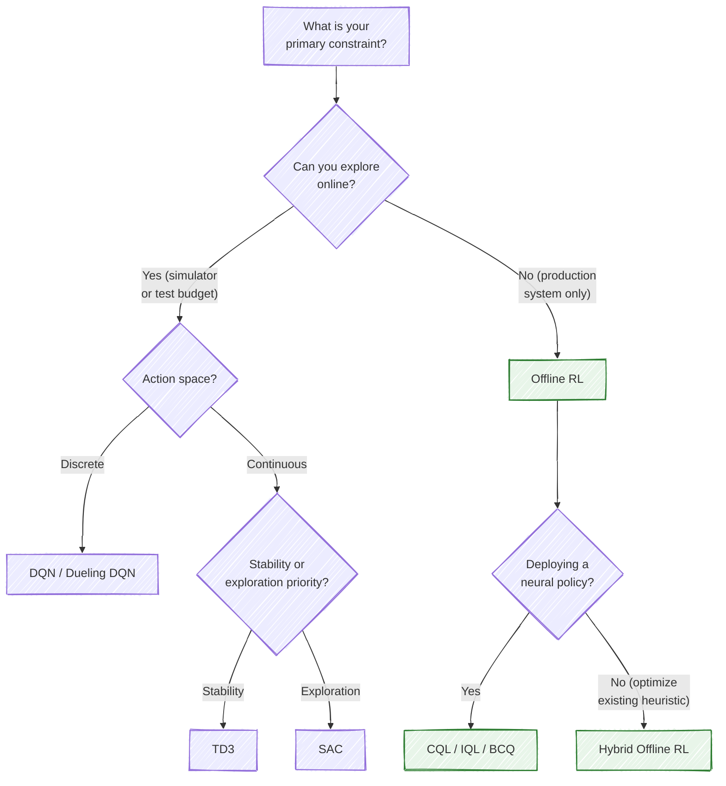
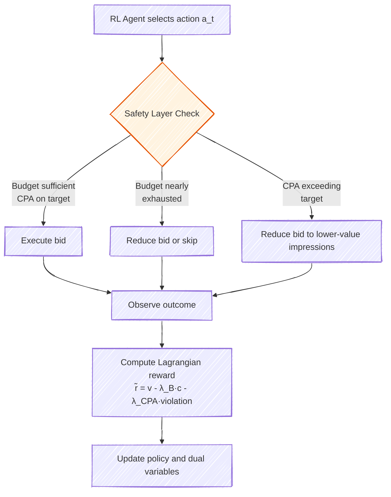
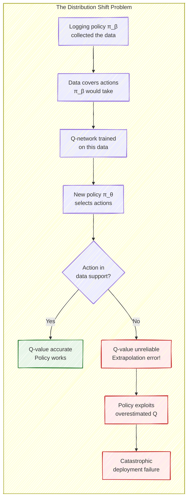
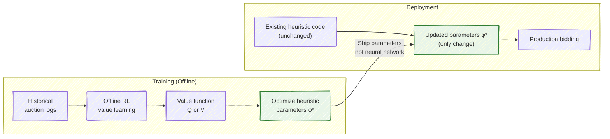

# Chapter 8: RL Algorithms for Bidding

---

## 8.1 Choosing the Right Algorithm

Selecting an RL algorithm for bidding is not merely a matter of picking the latest method from a conference paper. The choice is driven by practical constraints: Does your action space require discrete or continuous actions? Can you afford online exploration, or must you learn entirely from logged data? Are you deploying a neural network policy, or optimizing parameters of an existing heuristic? Do you have hard constraints (budget, CPA) that must be satisfied, not just optimized?

This chapter examines the major algorithmic families through the lens of these practical questions. We begin with value-based methods (DQN and its variants), move to actor-critic approaches (DDPG, TD3, SAC), cover constrained RL for budget management, and then spend significant time on offline RL -- the approach that dominates production systems. We close with multi-agent considerations and a comparative analysis.

## 8.2 Value-Based Methods: DQN for Discrete Bidding

Deep Q-Networks are the natural starting point for bidding with discrete action spaces. When the agent selects from a finite set of bid multipliers $\{m_1, m_2, \ldots, m_K\}$, the problem reduces to learning $Q(s, a)$ for each state-action pair and selecting the action with the highest Q-value.

### Architecture and Design Choices

The Q-network for bidding is typically a modest fully-connected network -- two to three hidden layers of 128-256 units. The input is the state vector described in Chapter 7 (budget ratio, time ratio, market statistics, impression features), and the output is a vector of $K$ Q-values, one per discrete action. This is standard DQN; the bidding-specific design choices are more interesting than the architecture.

**Double DQN is essential, not optional.** Standard DQN overestimates Q-values because it uses the same network to both select and evaluate actions. In bidding, overestimated Q-values are dangerous: they cause the agent to believe that aggressive bidding is more valuable than it truly is, leading to overspending. Double DQN decouples action selection (using the online network) from action evaluation (using the target network), substantially reducing this bias. Cai et al. (2017) found that Double DQN significantly outperformed vanilla DQN in their bidding experiments.

$$Q_{\text{target}} = r_t + \gamma \cdot Q_{\theta^-}\!\left(s_{t+1},\; \arg\max_{a'} Q_\theta(s_{t+1}, a')\right)$$

where $\theta$ are the online network parameters and $\theta^-$ are the target network parameters.

**Dueling architecture separates value from advantage.** In bidding, many states have similar overall value (a campaign with 60% budget at hour 12 is worth roughly the same regardless of the current impression), and the advantage function captures how much each bid level deviates from the average. The dueling architecture decomposes the Q-function as:

$$Q(s, a) = V(s) + A(s, a) - \frac{1}{|\mathcal{A}|}\sum_{a'} A(s, a')$$

This is particularly useful in bidding because many impression opportunities are similar in value, and the advantage function helps the agent focus on the marginal differences between bid levels.

**Prioritized experience replay** emphasizes transitions with high TD error during training. In bidding, this naturally focuses learning on surprising outcomes -- winning at unexpectedly low prices, losing despite high bids, or encountering unusual market conditions. These informative experiences are exactly the ones that should drive learning.

> **For the RL Engineer**: If you have trained DQN on Atari, you know the algorithm well. The bidding-specific considerations are: (1) much shorter effective episodes in the aggregate formulation (24 steps), which means less data per episode; (2) reward sparsity if you use conversion-based rewards (most impressions produce zero reward); and (3) the need for Double DQN not just for better performance but for *safety* -- overestimation leads to overspending real money.

### Limitations of DQN for Bidding

The fundamental limitation of DQN is the discrete action space. With 10 bid multiplier levels, the agent cannot bid at 1.17x -- it must choose between 1.0x and 1.2x. This quantization error compounds over thousands of auctions in a day. Increasing the number of levels helps but makes the Q-function harder to learn and slows convergence.

More subtly, the discrete formulation can create discontinuities in the learned policy. A small change in state might cause the agent to jump from multiplier 1.0 to 1.5, creating jerky, unstable bidding behavior. For these reasons, continuous-action methods are generally preferred when the infrastructure supports them.

## 8.3 Actor-Critic Methods: DDPG, TD3, and SAC

Continuous-action methods allow the agent to output a precise bid multiplier or bid price, eliminating quantization error. The actor-critic framework is the standard approach: an *actor* network $\mu_\phi(s)$ maps states to actions, and a *critic* network $Q_\theta(s, a)$ evaluates state-action pairs.

### DDPG: The Foundation

Deep Deterministic Policy Gradient (DDPG) is the continuous-action analog of DQN. The actor outputs a deterministic bid multiplier $a_t = \mu_\phi(s_t)$, and the critic evaluates it. The actor is trained to maximize the critic's evaluation:

$$\nabla_\phi J = \mathbb{E}\left[\nabla_a Q_\theta(s, a)\big|_{a=\mu_\phi(s)} \cdot \nabla_\phi \mu_\phi(s)\right]$$

Exploration in DDPG is achieved by adding noise to the actor's output: $a_t = \mu_\phi(s_t) + \epsilon$, where $\epsilon$ is typically drawn from an Ornstein-Uhlenbeck process or simply from a Gaussian. In bidding, the noise scale must be carefully controlled -- too much noise leads to wildly erratic bids; too little leads to insufficient exploration.

DDPG is conceptually simple but notoriously unstable. The single critic tends to overestimate Q-values, and the deterministic policy can exploit these overestimations, leading to a feedback loop of increasingly unrealistic Q-values and increasingly aggressive bids.

### TD3: Stability for High-Stakes Bidding

Twin Delayed DDPG (TD3) addresses DDPG's instability through three mechanisms, each of which has particular relevance to bidding.

**Twin critics** maintain two independent Q-networks and use the minimum of their estimates as the target:

$$Q_{\text{target}} = r_t + \gamma \cdot \min\left(Q_{\theta_1^-}(s_{t+1}, \tilde{a}),\; Q_{\theta_2^-}(s_{t+1}, \tilde{a})\right)$$

This is the most critical modification for bidding. By taking the minimum, TD3 consistently underestimates rather than overestimates Q-values. In bidding, underestimation leads to slightly conservative behavior (underspending), which is far safer than overestimation (overspending). An agent that underspends can be corrected by adjusting the pacing parameter; an agent that overspends has already wasted the budget.

**Delayed policy updates** update the actor less frequently than the critic (typically every 2 critic updates). This gives the critic time to converge before the actor exploits its estimates, reducing the feedback loop that plagues DDPG.

**Target policy smoothing** adds clipped noise to the target action: $\tilde{a} = \mu_{\phi^-}(s_{t+1}) + \text{clip}(\epsilon, -c, c)$. This acts as a regularizer, preventing the policy from exploiting narrow peaks in the Q-function that may be artifacts of function approximation error.

> **Key Insight**: TD3's conservative bias (underestimation via twin critics) aligns naturally with the risk profile of bidding. In most RL applications, overestimation and underestimation are symmetrically bad. In bidding, they are not: overestimation causes the agent to spend too aggressively, potentially exhausting the budget early and irreversibly hurting campaign performance. Underestimation merely causes the agent to bid too conservatively, which can be corrected by scaling up bids. This asymmetry makes TD3 a strong default choice for continuous-action bidding.

### SAC: Exploration Through Entropy

Soft Actor-Critic (SAC) learns a *stochastic* policy by maximizing a combination of expected return and policy entropy:

$$J(\pi) = \mathbb{E}\left[\sum_t \gamma^t \left(r_t + \alpha \mathcal{H}(\pi(\cdot | s_t))\right)\right]$$

where $\mathcal{H}(\pi(\cdot | s_t)) = -\mathbb{E}_{a \sim \pi}[\log \pi(a | s_t)]$ is the entropy of the policy and $\alpha$ is a temperature parameter controlling the exploration-exploitation tradeoff.

SAC's stochastic policy offers two advantages for bidding. First, it provides principled exploration without the need for external noise processes. The entropy term encourages the agent to maintain uncertainty in its bids, which naturally drives exploration of the bid landscape. Second, the stochastic policy is more robust to distributional shift -- when market conditions change, a stochastic policy that covers a range of bid levels degrades more gracefully than a deterministic policy optimized for a specific market condition.

The temperature parameter $\alpha$ can be automatically tuned to maintain a target entropy level, which is valuable in bidding where the appropriate level of exploration varies across campaign stages (more exploration early in a campaign's life, less as the policy converges).

### Comparison of Actor-Critic Methods for Bidding

| Property | DDPG | TD3 | SAC |
|---|---|---|---|
| Policy type | Deterministic | Deterministic | Stochastic |
| Q-value bias | Overestimation | Underestimation | Moderate |
| Exploration | External noise | External noise | Entropy-driven |
| Stability | Poor | Good | Good |
| Risk profile | Aggressive (dangerous) | Conservative (safe) | Balanced |
| Sample efficiency | Good | Good | Good |
| Hyperparameter sensitivity | High | Moderate | Low (auto-tuned alpha) |
| Recommended for bidding? | No (too unstable) | Yes (safe default) | Yes (if exploration needed) |

> **Industry Example**: Alibaba's production auto-bidding systems have explored both DQN-based and actor-critic approaches. Their published work (Zhao et al., 2018) used DQN with discrete multipliers, but subsequent systems moved toward continuous-action methods for finer-grained control. The trend in industry is clearly toward TD3/SAC for continuous bidding, with DQN reserved for settings where discrete action spaces are mandated by the platform's auction interface.

## 8.4 Constrained RL for Budget and CPA Management

Real campaigns do not merely optimize value -- they operate under hard constraints. A campaign with a $10,000 daily budget must not spend $10,001. A campaign with a CPA target of $30 must achieve an average CPA near that target. These constraints fundamentally change the optimization problem.

### The Constrained MDP Framework

The constrained MDP (CMDP) formulation makes constraints explicit:

$$\max_\pi \; \mathbb{E}_\pi\left[\sum_t \gamma^t r_t\right] \quad \text{subject to} \quad \mathbb{E}_\pi\left[\sum_t \gamma^t c_t^{(i)}\right] \leq d_i, \quad i = 1, \ldots, m$$

For bidding, the primary constraints are:

- **Budget constraint**: $\mathbb{E}\left[\sum_t \text{cost}_t\right] \leq B$
- **CPA constraint**: $\mathbb{E}\left[\sum_t \text{cost}_t\right] / \mathbb{E}\left[\sum_t \text{conv}_t\right] \leq \text{CPA}_{\text{target}}$
- **Pacing constraint**: $\text{spend}_h / B \approx 1/24$ for each hour $h$ (approximately uniform spending)

### The Lagrangian Approach

The most widely used method for constrained bidding RL transforms the constrained problem into an unconstrained one using Lagrange multipliers. For the budget-constrained case:

$$\mathcal{L}(\pi, \lambda) = \mathbb{E}_\pi\left[\sum_t r_t\right] - \lambda\left(\mathbb{E}_\pi\left[\sum_t c_t\right] - B\right)$$

The optimization proceeds by alternating between:

1. **Primal update**: Fix $\lambda$, optimize $\pi$ to maximize $\mathcal{L}$ (standard RL with modified reward $\tilde{r}_t = r_t - \lambda \cdot c_t$)
2. **Dual update**: Fix $\pi$, update $\lambda$ via gradient ascent on the constraint violation:

$$\lambda \leftarrow \max\left(0,\; \lambda + \eta \cdot \left(\mathbb{E}_\pi\left[\sum_t c_t\right] - B\right)\right)$$

The Lagrange multiplier $\lambda$ has an intuitive economic interpretation: it is the *shadow price of budget*. When budget is scarce (the constraint is tight), $\lambda$ increases, making spending more "expensive" in the modified reward and causing the agent to bid more conservatively. When budget is abundant, $\lambda$ decreases, allowing more aggressive bidding.

> **Key Insight**: The Lagrangian multiplier $\lambda$ acts as an automatic pacing mechanism. Unlike hand-tuned pacing rules, the dual update learns the optimal level of budget conservatism from data. It implicitly solves the budget allocation problem: how much to spend in each time period to maximize total value.

### Practical Considerations

**Multiple constraints.** When both budget and CPA constraints are active, each gets its own multiplier:

$$\tilde{r}_t = r_t - \lambda_B \cdot c_t - \lambda_{\text{CPA}} \cdot \max(0, c_t / v_t - \text{CPA}_{\text{target}})$$

The dual variables are updated independently based on their respective constraint violations. In practice, the budget constraint is "hard" (must never be exceeded) while the CPA constraint is "soft" (violations are acceptable as long as the average CPA converges to the target). This asymmetry can be encoded by using different learning rates for the two multipliers.

**Stability of dual updates.** The dual gradient ascent can oscillate if the learning rate $\eta$ is too large. A common technique is to use a slow exponential moving average for the multiplier updates and to clip the multipliers within a reasonable range to prevent extreme behavior.

**Constraint satisfaction during training vs. deployment.** During training (especially in simulation), some constraint violation is acceptable as the agent explores. At deployment, hard constraints must be enforced by a safety layer that overrides the agent's decisions when they would violate a constraint (e.g., refusing to bid when the budget is nearly exhausted).

## 8.5 Offline RL for Bidding: The Production Paradigm

Offline RL -- also called batch RL -- is the most important algorithmic category for production bidding systems. The premise is straightforward: learn an improved policy entirely from historical data, without any additional online interaction. No exploration, no simulator, no risk of wasting advertiser budgets during training.

This section deserves extended treatment because offline RL represents the critical bridge between RL research and real-world deployment. Nearly every major ad platform that has published on RL-based bidding uses some form of offline learning in their production pipeline.

### Why Offline RL Dominates Production

The arguments for offline RL in bidding are overwhelming.

**Financial risk.** Online RL exploration with real advertiser budgets is a non-starter for most companies. Even a 5% performance degradation during exploration on a campaign spending $100K/day means $5K wasted. Multiply this across thousands of campaigns, and the cost of online exploration becomes prohibitive.

**Data abundance.** Ad platforms generate enormous volumes of auction log data every day. A single platform might record billions of bid requests, auction outcomes, click events, and conversions per day. This data is a rich signal for learning better policies -- the challenge is extracting that signal without overfitting to the logging policy's behavior.

**Safety and compliance.** Advertisers expect consistent performance. An RL agent that suddenly changes its bidding behavior during online exploration can violate contractual performance guarantees. Offline learning, followed by careful evaluation and gradual deployment, is compatible with the risk-averse culture of advertising operations.

**Reproducibility.** Offline experiments are reproducible: given the same dataset, different algorithms can be compared fairly. Online experiments are confounded by temporal variation, competitor behavior changes, and the inherent stochasticity of ad auctions.

### The Distribution Shift Problem

The fundamental challenge of offline RL is that the agent must evaluate actions it has never taken. The historical data was collected by a *logging policy* $\pi_\beta$ (the production system that was running). The learned policy $\pi_\theta$ will generally differ from $\pi_\beta$, meaning it will prefer state-action pairs that are poorly represented in the data.

When the Q-network encounters an out-of-distribution (OOD) action -- one that $\pi_\beta$ rarely took -- it has no training signal to accurately evaluate it. Without correction, the Q-network will produce arbitrary values for OOD actions, and the policy will exploit these spurious values, choosing actions precisely because they have unreliable, overestimated Q-values. This is the *extrapolation error* problem, and it is catastrophic in practice: the learned policy looks excellent according to its own Q-function but performs terribly when deployed.

### Conservative Q-Learning (CQL)

CQL (Kumar et al., 2020) directly addresses extrapolation error by adding a regularization term that penalizes the Q-function for assigning high values to actions outside the data distribution.

The CQL objective augments the standard Bellman loss with a conservative penalty:

$$\mathcal{L}_{\text{CQL}}(\theta) = \alpha \left(\mathbb{E}_{s \sim \mathcal{D}}\left[\log \sum_a \exp Q_\theta(s, a)\right] - \mathbb{E}_{(s,a) \sim \mathcal{D}}\left[Q_\theta(s, a)\right]\right) + \frac{1}{2}\mathbb{E}_{(s,a,r,s') \sim \mathcal{D}}\left[\left(Q_\theta(s, a) - \hat{\mathcal{B}}^\pi Q_{\bar{\theta}}(s, a)\right)^2\right]$$

The first term pushes down Q-values for all actions (via the logsumexp, which is large when any action has high Q-value) while pushing up Q-values for actions that appear in the dataset (the second expectation). The net effect is that Q-values for in-distribution actions remain accurate while Q-values for OOD actions are suppressed.

For bidding, this means: if the logging policy never bid above 2x the base value, CQL will assign low Q-values to the 3x multiplier even if the Q-network might otherwise overestimate its value. This prevents the learned policy from discovering "strategies" that only appear beneficial due to extrapolation error.

The hyperparameter $\alpha$ controls the degree of conservatism. A higher $\alpha$ produces a more conservative policy that stays closer to the logging policy's behavior. A lower $\alpha$ allows more deviation but risks extrapolation error. In practice, $\alpha$ is tuned via offline policy evaluation on a held-out portion of the data.

> **For the RL Engineer**: CQL is conceptually elegant -- it learns a *lower bound* on the true Q-function for the learned policy. This means its policy evaluation is pessimistic: the agent will only choose actions that it is confident will perform well, based on evidence in the data. The cost is that CQL can be overly conservative, particularly when the logging policy had narrow coverage of the action space.

### Batch-Constrained Q-Learning (BCQ)

BCQ (Fujimoto et al., 2019) takes a different approach to the distribution shift problem. Rather than penalizing OOD Q-values, it constrains the policy to only select actions that are plausible under the logging policy.

BCQ trains a generative model $G_\omega(s)$ on the logged actions to learn which actions $\pi_\beta$ would have taken in each state. The policy is then constrained to select only from this set:

$$\pi(s) = \arg\max_{a \in \{G_\omega(s) + \epsilon_i\}_{i=1}^N} Q_\theta(s, a)$$

In words: generate $N$ candidate actions from the generative model (representing actions the logging policy might have taken), evaluate each with the Q-network, and select the best one. This ensures that the selected action always lies within the data support, eliminating extrapolation error by construction.

For bidding, BCQ is particularly natural. If the logging policy typically bid between 0.5x and 1.5x, BCQ will only consider actions in this range -- but it will find the *best* action within that range. This is conservative but pragmatic: the first iteration of an improved bidding policy should probably not deviate wildly from the current system.

### Implicit Q-Learning (IQL)

IQL (Kostrikov et al., 2022) avoids querying the Q-function for OOD actions entirely. It achieves this by learning the value function $V(s)$ using *expectile regression* rather than the max operator:

$$\mathcal{L}_V(\psi) = \mathbb{E}_{(s,a) \sim \mathcal{D}}\left[L_2^\tau\left(Q_{\hat{\theta}}(s, a) - V_\psi(s)\right)\right]$$

where $L_2^\tau(u) = |\tau - \mathbb{1}(u < 0)| \cdot u^2$ is the asymmetric squared loss. When $\tau > 0.5$ (typically $\tau = 0.7$ or $0.9$), the expectile regression approximates a soft maximum of Q-values over in-distribution actions, without ever evaluating Q for actions outside the dataset.

IQL then extracts a policy via advantage-weighted regression:

$$\pi(a | s) \propto \exp\left(\beta \cdot (Q_{\hat{\theta}}(s, a) - V_\psi(s))\right) \cdot \pi_\beta(a | s)$$

The advantage of IQL is simplicity and stability. It never evaluates Q-values for OOD actions, completely sidestepping extrapolation error. For bidding, where reliability matters more than squeezing the last percentage point of performance, IQL's simplicity is a significant advantage.

### Comparing Offline RL Algorithms for Bidding

| Property | CQL | BCQ | IQL |
|---|---|---|---|
| How it handles OOD actions | Penalizes Q-values | Constrains action selection | Avoids evaluating them |
| Conservatism mechanism | Q-value regularization | Generative model of $\pi_\beta$ | Expectile regression |
| Hyperparameter sensitivity | $\alpha$ (conservatism level) | Generative model quality | $\tau$ (expectile), $\beta$ (extraction) |
| Implementation complexity | Moderate (add CQL loss term) | High (requires generative model) | Low (simple regression losses) |
| Action space | Discrete or continuous | Continuous (needs generative model) | Either |
| Risk of over-conservatism | Moderate to high | Low (constrains, not penalizes) | Low |
| Performance ceiling | High (if $\alpha$ tuned well) | Limited by logging policy coverage | Moderate |
| Recommended when... | Large, diverse datasets | Logging policy has good coverage | Simplicity and stability are priorities |

> **Historical Note**: The progression from BCQ (2019) to CQL (2020) to IQL (2022) reflects the field's evolving understanding of how to handle distribution shift. Early approaches constrained the policy to stay near the data-generating distribution (BCQ); the next wave instead "fixed" the Q-function by penalizing out-of-distribution actions (CQL); later approaches restructured the learning problem to avoid querying unseen actions entirely (IQL). All three remain actively used, and the best choice depends on dataset properties and deployment constraints.

## 8.6 Hybrid Offline RL: Optimizing Existing Heuristics

Perhaps the most pragmatic approach to applying RL in production bidding systems comes from a surprising direction: using RL not to learn a new neural network policy, but to optimize the parameters of an *existing* heuristic bidding system.

Korenkevych et al. (2023) articulated this insight clearly. Most production bidding systems already have a heuristic policy with tunable parameters -- a base bid multiplier, a pacing aggressiveness factor, time-of-day adjustments, and so on. These heuristics were often hand-tuned by engineers. The hybrid approach uses offline RL to find optimal values for these parameters.

The process works as follows:

1. **Model the heuristic as a parameterized policy.** The existing production bidding logic is expressed as $\pi_\phi(s)$, where $\phi$ are the tunable parameters (e.g., pacing multiplier, base bid scale, urgency thresholds).

2. **Train a value network offline.** Using historical data, learn $Q(s, a)$ or $V(s)$ with any offline RL algorithm.

3. **Optimize heuristic parameters.** Use the learned value function to find $\phi^*$ that maximizes expected value. Since the parameter space is typically low-dimensional (5-20 parameters), this optimization is fast and robust.

4. **Deploy the optimized heuristic.** Only the updated parameter values are deployed to production -- not the neural network. The same code path runs, with better parameters.

This approach has compelling advantages for production systems:

**No new infrastructure.** The serving infrastructure does not need to support neural network inference. The same bidding code runs, just with different parameter values.

**Interpretability.** Engineers and advertisers can inspect and understand the optimized parameters. A base multiplier of 1.15 is interpretable; the weights of a 3-layer neural network are not.

**Safety.** Because the policy structure is unchanged, the range of possible behaviors is bounded by the heuristic's design. Even with bad parameters, the heuristic cannot bid negative amounts or violate basic sanity checks that are baked into the production code.

**Incremental improvement.** The optimized parameters represent a known improvement over the previous parameters, validated by offline evaluation. Deployment is a simple parameter update, not a system migration.

> **Industry Example**: Korenkevych et al. (2023) reported that this hybrid approach, applied to a major advertising platform's production bidding system, yielded significant improvements in campaign performance while requiring zero changes to the serving infrastructure. The neural network was used only as a training-time tool and was never deployed.

## 8.7 Multi-Agent Considerations

In all the preceding discussion, we treated the auction environment as a black box that produces market prices according to some distribution. In reality, market prices are determined by other bidding agents, each of which may also be optimizing its own strategy. When your agent changes its bids, it affects market prices, which affects other agents' experiences, which causes them to adapt, which changes market prices again. This creates a non-stationary environment that violates the standard MDP assumption of fixed transition dynamics.

### The Problem of Non-Stationarity

For a single campaign, the multi-agent aspect is usually ignorable -- one campaign's bids are a tiny fraction of the total market, and its impact on market prices is negligible. But for an ad platform managing millions of campaigns, the collective effect is significant. When the platform deploys a new RL-based bidding algorithm across all campaigns simultaneously, market dynamics can shift dramatically.

This creates a feedback loop: the RL algorithm was trained on historical data reflecting the old market equilibrium, but its deployment shifts the market to a new equilibrium where its Q-value estimates are no longer accurate. In the worst case, this leads to instability -- algorithms that were well-calibrated offline perform poorly in the new market environment.

### Mean-Field Approximation

For platforms managing many agents, the mean-field approach (Wen et al., 2022) provides a tractable framework. Instead of modeling each competitor individually, each agent models its interaction with the *average* behavior of all other agents.

The agent's state is augmented with a summary statistic of competitors' behavior:

$$s_t^{\text{aug}} = [s_t;\; \bar{a}_t^{-i}]$$

where $\bar{a}_t^{-i}$ is the mean action (e.g., mean bid level) of all other agents. This reduces the complexity from $O(N^2)$ (modeling every pair of agents) to $O(N)$ (each agent models the mean field), making it feasible for large-scale systems.

In practice, the mean field is estimated from recent market statistics (average winning price, average number of competitors, average bid level) and is included as part of the state representation. The agent learns a policy that conditions on current market conditions, enabling it to adapt to shifts in competitor behavior.

### Equilibrium and Convergence

When all agents on a platform simultaneously learn and adapt, the question of whether the system converges to a stable equilibrium becomes relevant. Under certain conditions (e.g., the auction is a potential game), mean-field learning converges to a Nash equilibrium where no individual agent can improve by unilateral deviation.

In practice, full convergence is not required. What matters is that the system is stable enough that deployed policies perform consistently. Staggered deployment (updating a fraction of campaigns at a time), slow learning rates, and frequent retraining help maintain stability.

> **For the RL Engineer**: If you have worked on multi-agent RL in games (StarCraft, Dota, etc.), bidding multi-agent dynamics are qualitatively different. In games, agents have symmetric or near-symmetric roles. In bidding, agents have heterogeneous objectives (different budgets, different target audiences, different campaign goals). The mean-field approximation works because the agent mostly cares about aggregate competitive pressure, not individual competitor strategies.

## 8.8 Emerging Approaches

The RL-for-bidding field continues to evolve. Several recent directions are worth noting.

**Diffusion models for offline RL.** Diffusion-based policy representations (Ajay et al., 2023) model the entire trajectory distribution rather than learning a pointwise policy. For bidding, this could enable planning over an entire campaign day, generating a full spending plan that is jointly optimized. The approach avoids the compounding errors of single-step decision-making but is computationally expensive and still early in its application to bidding.

**Model-based RL.** Rather than learning a policy directly from data, model-based approaches first learn a dynamics model of the auction environment and then plan within it. This can be more data-efficient than model-free methods and naturally supports what-if analysis (e.g., "what would happen if we increased the budget by 20%?"). The challenge is that auction dynamics are hard to model accurately, especially the strategic behavior of competitors.

**Foundation models for bidding.** Following the success of large pre-trained models in NLP and vision, researchers are exploring whether pre-training on diverse bidding data (across many campaigns, advertisers, and market conditions) can produce foundation models that generalize to new campaigns with minimal fine-tuning. This is speculative but could address the cold-start problem where a new campaign has no historical data for offline RL.

**Causal RL.** Standard offline RL assumes that the logged data is a faithful representation of the environment's dynamics. In reality, the logging policy introduces confounders (e.g., the logging policy might bid more aggressively on users it predicts are high-value, creating a spurious correlation between high bids and high conversion rates). Causal RL methods attempt to identify and correct for these confounders, learning policies that are robust to distributional changes.

## 8.9 Comprehensive Algorithm Comparison

The following table summarizes the key algorithmic choices for bidding, helping practitioners select the right approach for their specific setting.

| Algorithm | Action Space | Online/Offline | Key Strength | Key Weakness | Best For |
|---|---|---|---|---|---|
| DQN (Double/Dueling) | Discrete | Both | Simple, well-understood | Quantized actions | Prototyping, discrete platforms |
| TD3 | Continuous | Both | Stable, conservative bias | Deterministic (limited exploration) | Production with online fine-tuning |
| SAC | Continuous | Both | Robust exploration, auto-tuned | Higher computational cost | Non-stationary markets |
| CQL | Either | Offline | Strong theoretical guarantees | Can be overly conservative | Large, diverse datasets |
| BCQ | Continuous | Offline | No extrapolation by construction | Needs good generative model | Well-behaved logging policies |
| IQL | Either | Offline | Simple, stable | Lower performance ceiling | Reliability-first deployments |
| Hybrid (heuristic opt.) | Heuristic params | Offline | Production-safe, interpretable | Limited by heuristic structure | Incremental production upgrades |
| PPO | Either | Online | Stable policy updates | Needs simulator or test budget | Simulation-based training |

> **Key Insight**: There is no universally "best" algorithm for bidding. The choice depends on your constraints. If you are just starting, use DQN with discrete multipliers and an hourly aggregate formulation -- it is the simplest path to a working system. If you have a mature production system, hybrid offline RL (optimizing existing heuristic parameters) offers the best risk-reward tradeoff. If you are building a new system from scratch with good infrastructure, CQL or IQL with continuous actions gives the highest performance ceiling.

---

## Exercises

### Conceptual

1. **Overestimation risk.** Explain why Q-value overestimation is more dangerous in bidding than in game-playing RL. Specifically, describe the chain of consequences when a bidding agent overestimates the value of aggressive bidding. How does Double DQN partially address this, and how does TD3 go further?

2. **Offline RL motivation.** A colleague suggests training a bidding agent online using epsilon-greedy exploration with $\epsilon = 0.05$ on live traffic. The campaign budget is $50,000/day. Calculate the expected daily cost of exploration (assuming exploratory actions have zero value on average). Is this acceptable? Under what budget scale might online exploration become feasible?

3. **CQL vs. BCQ.** You have access to 30 days of historical bidding data from a logging policy that used conservative fixed bids ($b = 0.7 \times \text{value}$). Compare the expected behavior of CQL and BCQ when trained on this data. Which algorithm is more likely to discover that higher bids (e.g., $b = 1.1 \times \text{value}$) during evening hours would be beneficial? Why?

4. **Lagrangian intuition.** A campaign starts the day with $\lambda_B = 0.5$, meaning the modified reward is $r_t = v_t - 0.5 \cdot c_t$. At noon, the campaign has spent only 30% of its budget. Explain what happens to $\lambda_B$ in the dual update, and describe how this changes the agent's bidding behavior for the afternoon.

5. **Multi-agent dynamics.** An ad platform simultaneously deploys RL-based bidding for all 10,000 active campaigns. Describe a plausible failure scenario where the collective policy change leads to worse outcomes than the previous heuristic system. How could staggered deployment mitigate this risk?

### Design

6. **Algorithm selection.** For each of the following scenarios, recommend an RL algorithm and justify your choice: (a) a startup with a simple bidding system and limited engineering resources, (b) a large platform with billions of historical auctions and a mature heuristic bidding stack, (c) a research team with access to a high-fidelity auction simulator.

7. **Offline evaluation.** You have trained a CQL agent offline and need to estimate its performance before deploying it live. Describe three off-policy evaluation methods you could use, their assumptions, and their limitations in the bidding setting. How would you decide whether the agent is ready for a live A/B test?

---

## Further Reading

- Cai, H., et al. (2017). "Real-Time Bidding by Reinforcement Learning in Display Advertising." *WSDM*. arXiv:1701.02490.
- Wu, D., et al. (2018). "Budget Constrained Bidding by Model-free Reinforcement Learning in Display Advertising." *CIKM*. arXiv:1802.08365.
- Zhao, J., et al. (2018). "Deep Reinforcement Learning for Sponsored Search Real-time Bidding." *KDD*. arXiv:1803.00259.
- Kumar, A., Zhou, A., Tucker, G., and Levine, S. (2020). "Conservative Q-Learning for Offline Reinforcement Learning." *NeurIPS*.
- Fujimoto, S., Meger, D., and Precup, D. (2019). "Off-Policy Deep Reinforcement Learning without Exploration." *ICML*.
- Kostrikov, I., Nair, A., and Levine, S. (2022). "Offline Reinforcement Learning with Implicit Q-Learning." *ICLR*.
- Korenkevych, D., et al. (2023). "Offline RL for Online Ad Auction Bidding." arXiv:2310.09426.
- Mou, Z., et al. (2022). "Sustainable Online Reinforcement Learning for Auto-bidding." *NeurIPS*. arXiv:2210.07006.
- Wen, Z., et al. (2022). "Multi-Agent Auto-Bidding in Large-Scale Auctions." arXiv:2206.09361.
- Ajay, A., Du, Y., Gupta, A., Tenenbaum, J., Jaakkola, T., and Agrawal, P. (2023). "Is Conditional Generative Modeling All You Need for Decision-Making?" *ICLR*.
