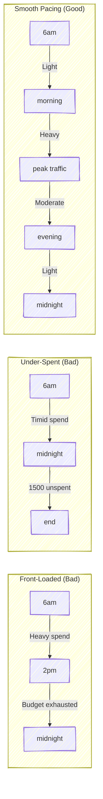
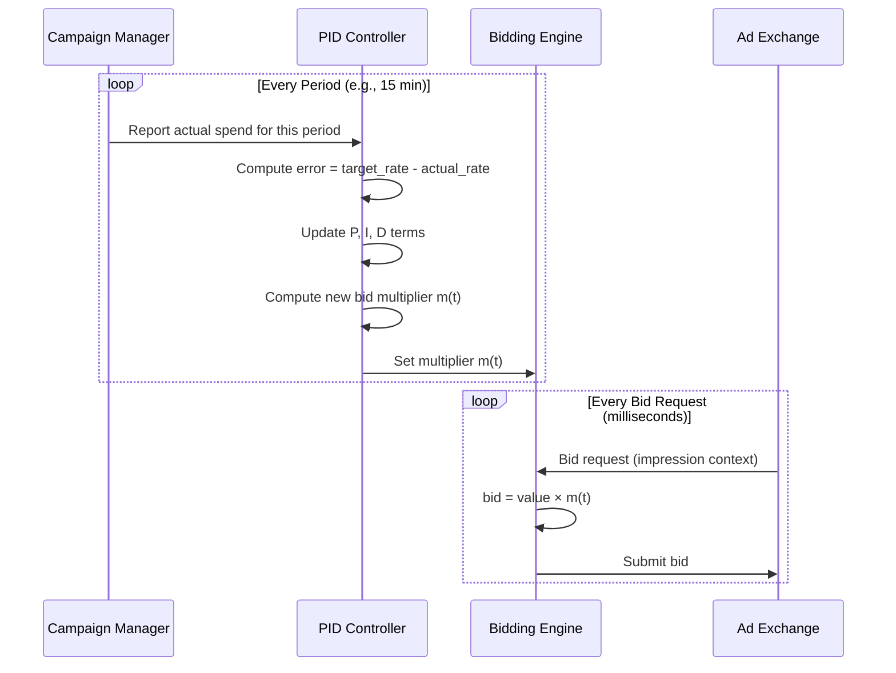
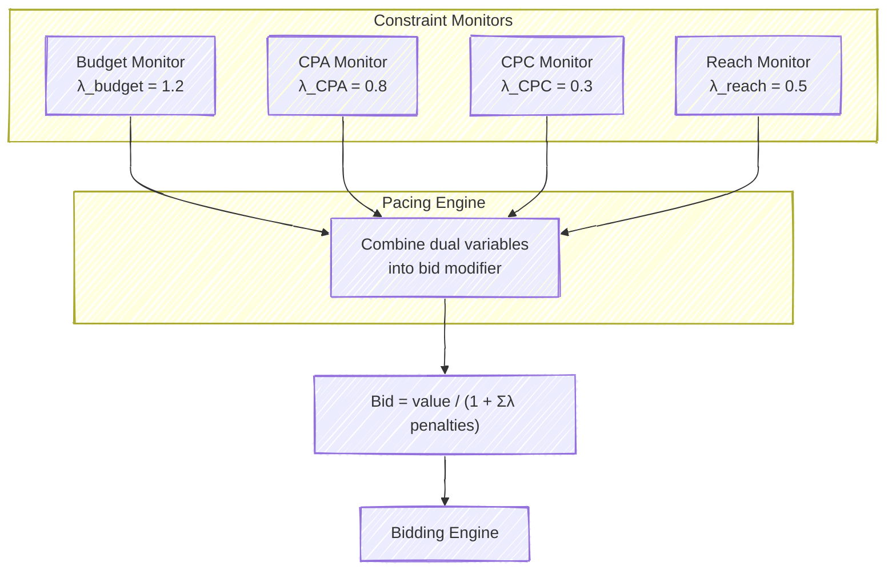
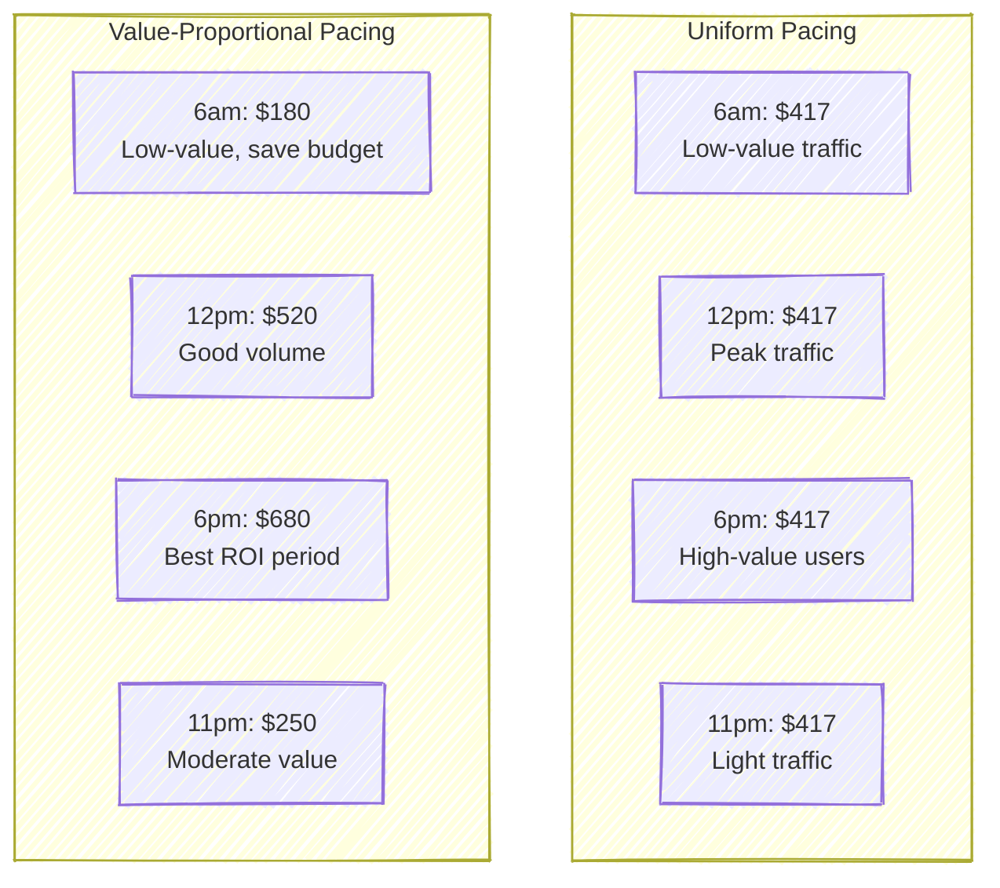
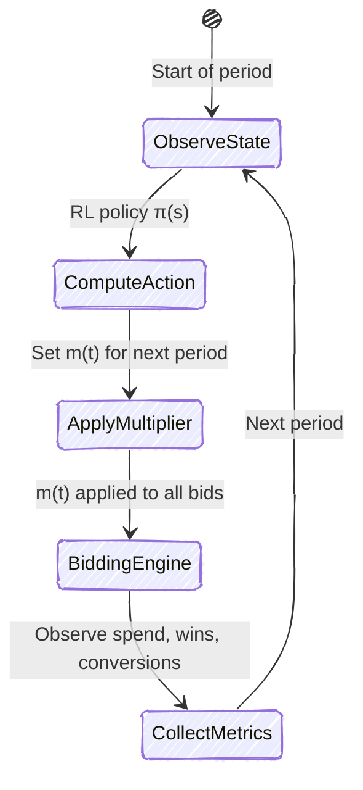
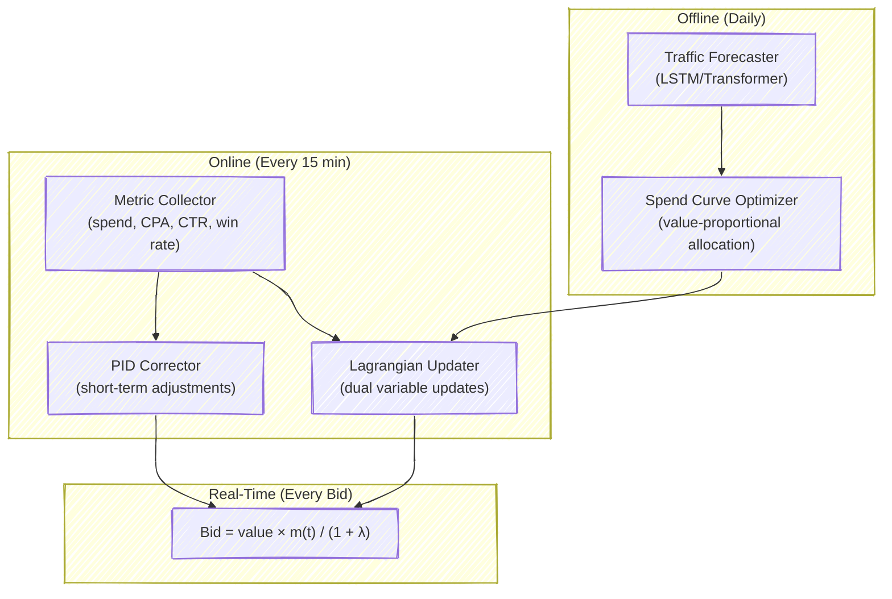

# Chapter 9: Budget Pacing and Constrained Optimization

---

## 9.1 The Pacing Problem

Consider a campaign with a \$10,000 daily budget. The naive approach — bid on everything at full value until the money runs out — will exhaust the budget by early afternoon, missing the evening hours entirely. Conversely, an overly cautious strategy leaves money on the table at midnight. The goal of **budget pacing** is to spread spend across the day in a way that maximizes total campaign value, subject to the constraint that the budget must last until the end of the flight.

This is one of the most consequential problems in programmatic advertising. LinkedIn reported that their pacing system directly influenced billions of dollars in annual ad spend, and that even a 1% improvement in budget utilization translated to millions in incremental revenue for advertisers (Agarwal et al., 2014). Every major DSP — The Trade Desk, DV360, Amazon DSP — runs a pacing system as a core component of its bidding stack.

The challenge is that traffic volume and quality are non-stationary. Morning commute hours bring mobile impressions, midday sees desktop traffic from office workers, and evenings produce high-value impressions on streaming platforms. A good pacing system must adapt its spend rate to these shifting conditions in real time.

> **For the RL Engineer**: If you've worked with resource-constrained MDPs, pacing is exactly that problem in production. The agent must allocate a finite resource (budget) over a finite horizon (the day), under uncertainty about future opportunities. The twist is that this runs at massive scale — millions of bid decisions per second, each modulated by a pacing signal.

---

## 9.2 PID Control for Pacing

The most widely deployed pacing mechanism in the ad tech industry is the PID controller — the same feedback control system that governs cruise control in your car, temperature in your thermostat, and altitude in a quadcopter. The analogy is apt: just as a thermostat compares the current temperature to the setpoint and adjusts heating or cooling accordingly, a PID pacer compares the current spend rate to the target rate and adjusts a **bid multiplier** accordingly.

### The Thermostat Analogy

Imagine you set your thermostat to 72°F. The PID controller inside it does three things:

1. **Proportional (P)**: Looks at the current error. If the room is 65°F, that's a 7-degree gap — blast the heat. If it's 71°F, the gap is small — gentle heating.
2. **Integral (I)**: Looks at accumulated error over time. If the room has been 1 degree too cold for the past hour, something systematic is off — increase the baseline heating level.
3. **Derivative (D)**: Looks at the rate of change. If the temperature is rising fast, ease off the heat *before* overshooting 72°F.

Budget pacing works identically. The "temperature" is the current spend rate, the "setpoint" is the target spend rate (budget divided by remaining time), and the "heating" is the bid multiplier applied to all bids.

### The Mathematics

Let $e(t)$ denote the error at time period $t$, defined as the difference between the target spend rate $r^*$ and the actual spend rate $r(t)$:

$$e(t) = r^* - r(t)$$

The PID controller computes a bid multiplier adjustment:

$$\Delta m(t) = K_p \cdot e(t) + K_i \cdot \sum_{\tau=0}^{t} e(\tau) \cdot \Delta\tau + K_d \cdot \frac{e(t) - e(t-1)}{\Delta\tau}$$

The bid multiplier $m(t)$ is then updated and clipped to a safe range (typically $[0.1, 3.0]$):

$$m(t+1) = \text{clip}\big(m(t) + \Delta m(t) / r^*, \; m_{\min}, \; m_{\max}\big)$$

Every bid in the system is then scaled: $\text{bid} = \text{value} \times m(t)$. When $m > 1$, the system bids more aggressively (spending faster). When $m < 1$, it bids more conservatively (slowing spend).

### Tuning in Practice

The three gains — $K_p$, $K_i$, $K_d$ — control the system's behavior and must be tuned carefully:

| Parameter | Too Low | Too High | Typical Range |
|-----------|---------|----------|---------------|
| $K_p$ (Proportional) | Slow response, chronic underspend | Oscillation around target | 0.2 – 0.8 |
| $K_i$ (Integral) | Persistent offset from target | Overshoot and windup | 0.01 – 0.15 |
| $K_d$ (Derivative) | Overshoot on traffic spikes | Noise sensitivity, jitter | 0.01 – 0.10 |

A common failure mode is **integral windup**: during a period of low traffic (e.g., 2am–5am), the integral term accumulates a large positive value because the system is underspending. When traffic returns in the morning, the inflated integral causes the system to dramatically overshoot. The standard fix is to clamp the integral term and reset it when the multiplier hits its bounds.

> **Industry Example**: LinkedIn's pacing system (Agarwal et al., 2014) used a PID controller operating on 15-minute intervals, with additional logic for "catch-up" when campaigns fell behind their spend curves. They found that the proportional term alone handled about 80% of cases, with the integral and derivative terms providing critical corrections during traffic pattern shifts.

Notice the **two timescales**: the PID controller operates at a low frequency (minutes), while bidding happens at a high frequency (milliseconds). This separation is deliberate — the pacing signal should be smooth, not reactive to individual impressions.

---

## 9.3 Lagrangian Dual Pacing

While PID controllers are effective and intuitive, they lack a formal optimality guarantee. The **Lagrangian dual** approach provides a principled framework grounded in constrained optimization theory, and it has become the dominant method in the academic literature and increasingly in industry.

### The Optimization Problem

A campaign's goal can be stated as:

$$\max \sum_{t=1}^{T} v_t \cdot x_t \quad \text{subject to} \quad \sum_{t=1}^{T} c_t \cdot x_t \leq B$$

where $v_t$ is the value of impression $t$, $c_t$ is its cost, $x_t \in \{0, 1\}$ indicates whether we win it, and $B$ is the total budget. This is a knapsack problem — NP-hard in general, but we can relax it using Lagrangian duality.

### The Dual Variable as "Price of Money"

Introducing a Lagrange multiplier $\lambda \geq 0$ for the budget constraint, the Lagrangian is:

$$\mathcal{L} = \sum_{t=1}^{T} v_t \cdot x_t - \lambda \left( \sum_{t=1}^{T} c_t \cdot x_t - B \right)$$

Rearranging, the optimal decision for each impression becomes:

$$x_t^* = \begin{cases} 1 & \text{if } v_t - \lambda \cdot c_t > 0 \\ 0 & \text{otherwise} \end{cases}$$

In a first-price auction, where the cost equals our bid, this translates to the **paced bid**:

$$\text{bid}_t = \frac{v_t}{1 + \lambda}$$

The dual variable $\lambda$ has a beautiful interpretation: it is the **shadow price of money**, or the "cost of spending a dollar." When $\lambda$ is large, money is expensive (budget is tight), and bids are shaded aggressively. When $\lambda$ is small, money is cheap (budget is ample), and bids approach full value.

> **Key Insight**: The Lagrangian approach reduces budget pacing to a single scalar problem: finding the right value of $\lambda$. All the complexity of "which impressions to bid on" and "how much to bid" collapses into adjusting one number.

### Online Dual Updates

In practice, we don't know all impressions in advance — they arrive one at a time. We update $\lambda$ online using a **multiplicative update rule**, which is more stable than additive updates for positive variables:

$$\lambda_{t+1} = \lambda_t \cdot \exp\left(\eta \cdot \frac{s_t - b_t}{b_t}\right)$$

where $s_t$ is the actual spend in period $t$, $b_t$ is the target spend for that period, and $\eta$ is the learning rate. When spending exceeds the target ($s_t > b_t$), $\lambda$ increases, making future bids more conservative. When spending falls short, $\lambda$ decreases, making bids more aggressive.

This multiplicative form ensures $\lambda$ stays positive and adapts proportionally — a crucial property when the scale of budgets varies by orders of magnitude across campaigns.

### PID vs. Lagrangian: Complements, Not Competitors

In production, these approaches are often **combined**. The Lagrangian method provides the theoretically grounded baseline, while PID-style corrections handle the short-term dynamics that the dual update's learning rate can't track quickly enough.

| Property | PID | Lagrangian |
|----------|-----|-----------|
| Theoretical guarantee | No convergence proof | Converges to dual optimal |
| Parameters to tune | 3 ($K_p$, $K_i$, $K_d$) | 1 (learning rate $\eta$) |
| Non-stationary traffic | Good — reactive by design | Moderate — may lag behind shifts |
| Multiple constraints | Difficult to extend | Natural — add one $\lambda$ per constraint |
| Interpretability | Control theory language | Economics language (shadow prices) |
| Industry adoption | Universal | Common, often paired with PID |

> **Historical Note**: The Lagrangian approach to ad pacing was formalized in the operations research literature by Balseiro et al. (2017) in "Budget Management Strategies in Repeated Auctions," which showed that dual-based pacing achieves near-optimal utility with vanishing regret as the number of auctions grows.

---

## 9.4 Multi-Constraint Pacing

Real advertising campaigns rarely have a single budget constraint. A typical campaign might face:

$$\begin{aligned}
\text{maximize} \quad & \sum_t \text{conversions}_t \\
\text{subject to} \quad & \text{Total spend} \leq \$10{,}000 & (\text{daily budget}) \\
& \text{CPA} \leq \$40 & (\text{cost per acquisition target}) \\
& \text{CPC} \leq \$2.00 & (\text{cost per click cap}) \\
& \text{Impressions} \geq 50{,}000 & (\text{reach requirement})
\end{aligned}$$

The Lagrangian framework handles this naturally. Each constraint gets its own dual variable:

$$\text{bid}_t = \frac{v_t}{1 + \lambda_{\text{budget}} + \lambda_{\text{CPA}} \cdot g_{\text{CPA}}(t) + \lambda_{\text{CPC}} \cdot g_{\text{CPC}}(t) - \lambda_{\text{reach}}}$$

where $g_{\text{CPA}}(t)$ and $g_{\text{CPC}}(t)$ are constraint-specific penalty terms for impression $t$, and the reach constraint enters with a negative sign because it is a lower-bound (greater-than-or-equal) constraint.

Each $\lambda$ is updated independently based on whether its corresponding constraint is being violated:

$$\lambda_k^{(t+1)} = \max\left(0, \; \lambda_k^{(t)} + \eta_k \cdot \text{violation}_k^{(t)}\right)$$

The elegance of this decomposition is that the system is **modular**: adding a new constraint (say, a frequency cap or a brand safety requirement) means adding one more dual variable and one more update rule, without changing the rest of the system.

> **Industry Example**: Meta's advertising system manages campaigns with up to a dozen simultaneous constraints — budget, CPA target, frequency cap, brand safety, audience reach minimums, dayparting rules, and more. Their pacing system uses a hierarchical Lagrangian approach where campaign-level constraints are decomposed into ad-set-level sub-problems, each with their own dual variables (reported at KDD 2021).

### Constraint Conflicts and Priority

In practice, constraints can conflict. A campaign might demand both a low CPA (\$20) and high reach (100,000 impressions per day). If the target audience is small and competitive, these two goals may be impossible to satisfy simultaneously. The system needs a **priority ordering** — typically budget is the hard constraint (never overspend), performance targets are soft constraints (approach but can miss), and reach is best-effort.

This priority is encoded through the learning rates $\eta_k$. The budget constraint uses a larger learning rate (faster reaction), while softer constraints use smaller rates, allowing them to be violated temporarily when in tension with higher-priority constraints.

---

## 9.5 ML-Enhanced Pacing: Traffic Forecasting and Optimal Spend Curves

Both PID and Lagrangian pacing are **reactive** — they observe what happened and adjust. A more sophisticated approach is **proactive pacing**, which uses forecasts of future traffic to plan spend allocation ahead of time.

### Why Uniform Spending is Suboptimal

Consider a day where morning impressions are cheap (low competition, low-value users) but evening impressions are expensive and high-value (engaged users on premium inventory). A uniform spend rate of \$417/hour (\$10,000 / 24 hours) would buy many low-value morning impressions and too few high-value evening ones. The optimal strategy allocates budget proportional to the **expected marginal value** of each period, not the traffic volume.

Formally, if $V_t$ is the expected total value available in period $t$, the optimal allocation is:

$$B_t^* = B \cdot \frac{V_t}{\sum_{\tau} V_\tau}$$

This result follows from the equal-marginal-value principle: at the optimum, the marginal value of a dollar should be the same in every time period. If evening dollars produce more value than morning dollars, shift budget to the evening until the margins equalize.

### Traffic Forecasting Models

Computing the optimal spend curve requires predicting the volume and value of future impressions. In production, these forecasts combine:

- **Historical patterns**: Hour-of-day and day-of-week effects are remarkably stable. Monday 10am looks similar across weeks.
- **Seasonal adjustments**: Holiday traffic, back-to-school, Black Friday. These are predictable but require separate modeling.
- **Real-time corrections**: If today's morning traffic is 20% above the historical average, the afternoon forecast should be adjusted upward.

Modern forecasting stacks use sequence models (LSTMs, Transformers) trained on historical traffic data, with real-time Bayesian updates as the day progresses. The key output is not just a point forecast but a **distribution** — the pacing system needs to know its uncertainty about future traffic to make robust allocation decisions.

> **Key Insight**: The interplay between forecasting and pacing creates a feedback loop. The pacing system's decisions affect which impressions are won, which changes the observed traffic patterns, which in turn affects future forecasts. Breaking this loop requires training the forecasting model on the *available* impressions (all bid requests received), not just the *won* impressions.

### Adaptive Replanning

The optimal spend curve should be **recomputed throughout the day** as new information arrives. At 2pm, the system has observed 8 hours of actual traffic and has a revised forecast for the remaining 10 hours. The remaining budget should be reallocated across the remaining periods based on the updated forecast. This "receding horizon" approach borrows from model predictive control (MPC) in the control theory literature.

---

## 9.6 RL for Pacing

When pacing becomes sufficiently complex — multiple campaigns sharing a budget, non-stationary competitive dynamics, delayed conversion signals — hand-tuned PID controllers and simple Lagrangian updates may not capture the full structure of the problem. This is where reinforcement learning enters.

### Pacing as an MDP

The pacing problem can be formulated as a Markov Decision Process:

- **State**: Remaining budget fraction, elapsed time fraction, recent spend rate, performance metrics (CPA, CTR), market condition features (average clearing price, win rate).
- **Action**: The bid multiplier $m$ for the next period (continuous, typically in $[0.1, 3.0]$).
- **Reward**: Value captured in the period, minus penalty terms for constraint violations.
- **Transition**: Determined by the (stochastic) traffic environment and competitive landscape.

An important design choice is the **decision frequency**. Per-impression RL pacing is impractical at the scale of millions of QPS. Instead, the RL agent operates at a lower frequency — typically hourly or every 15 minutes — setting a pacing multiplier that the high-frequency bidding engine applies to individual bids.

### Why RL Can Outperform PID

The RL agent can learn non-obvious strategies that a PID controller cannot represent:

1. **Anticipatory behavior**: An RL agent trained on historical data learns that Friday afternoon traffic drops sharply. It proactively increases the multiplier on Thursday evening to capture more value before the drop — something a reactive PID controller cannot do.

2. **Cross-campaign coordination**: When multiple campaigns share a portfolio budget, the RL agent can learn to shift spend toward whichever campaign has the best marginal return at any moment.

3. **Non-linear constraint handling**: PID controllers handle constraints through ad hoc clamping. The RL agent internalizes constraints through its reward function and learns smooth, globally optimal trade-offs.

> **Industry Example**: Alibaba's real-time bidding system (reported at KDD 2018) used an RL pacing agent that improved budget utilization by 3% and total conversions by 7% compared to their production PID controller. The key insight was that the RL agent learned to be more aggressive during "bargain" periods when competition was low, an opportunity the PID controller missed because it only tracked spend rate, not cost efficiency.

### Training Challenges

Training RL pacing agents introduces specific challenges:

- **Simulation fidelity**: The agent trains in a simulated market, but the real market has complex competitive dynamics. Sim-to-real transfer requires careful environment calibration.
- **Non-stationarity**: The competitive landscape changes as other DSPs update their bidding strategies. An RL agent trained on last month's data may perform poorly today.
- **Safety constraints**: A pacing agent that overspends by 50% on a \$1M campaign causes real financial harm. Production systems wrap the RL agent in safety guardrails — hard budget caps, multiplier bounds, and fallback to PID if anomalies are detected.

---

## 9.7 Pacing Equilibrium Theory

When all bidders in an auction market use pacing, what happens at the market level? This question was answered in a foundational paper by Conitzer, Kroer, Panigrahi, Schrijvers, Stier-Moses, Sodomka, and Wilkens (2022), building on earlier work by Borgs, Chayes, Immorlica, Jain, Etesami, and Mahdian (2007).

### The Key Results

In a first-price auction market where all bidders use multiplicative budget pacing:

1. **Existence and uniqueness**: There exists a **unique pacing equilibrium** — a set of bid multipliers, one per bidder, such that no bidder wants to change their multiplier given everyone else's.

2. **Efficient computation**: The equilibrium can be found by solving the **Eisenberg-Gale convex program**:

$$\max \sum_{i=1}^{n} B_i \cdot \log(u_i) \quad \text{subject to} \quad \sum_{i} x_{ij} \leq 1 \;\; \forall j, \quad u_i = \sum_{j} v_{ij} \cdot x_{ij} \;\; \forall i, \quad x_{ij} \geq 0$$

where $B_i$ is bidder $i$'s budget, $v_{ij}$ is bidder $i$'s value for item $j$, $x_{ij}$ is the fractional allocation, and $u_i$ is bidder $i$'s total utility. This is a convex program — efficiently solvable at scale.

3. **Near-optimality**: In equilibrium, bidders achieve near-optimal utility compared to the best-in-hindsight strategy, with regret vanishing as the number of auctions grows.

4. **Revenue implications**: First-price auctions with pacing can generate **more revenue** than second-price auctions with pacing. This result surprised many economists and provided theoretical justification for the industry's shift to first-price.

> **Key Insight**: The Eisenberg-Gale program that computes pacing equilibria is the same mathematical object that arises in the theory of fair division (proportional fairness). Budget-paced first-price auctions produce allocations that are proportionally fair with respect to bidders' budgets — a remarkable connection between market design and fairness theory.

### Implications for Practice

The pacing equilibrium theory provides several practical insights:

- **Convergence is guaranteed**: If all bidders use reasonable pacing algorithms (e.g., multiplicative updates), the market will converge to the unique equilibrium. There are no chaotic dynamics or multiple equilibria to worry about.
- **Budget is a strategic instrument**: A bidder's equilibrium utility is proportional to their budget share. Increasing your budget by 10% increases your utility by roughly 10% — there is no "outsmarting" the market through clever bidding.
- **First-price is robust**: The equilibrium properties hold even when bidders use different pacing algorithms, as long as they're all approximately best-responding. This robustness is a key advantage over second-price, where strategic manipulation is more profitable.

---

## 9.8 Putting It All Together: A Production Pacing Architecture

A complete pacing system in a production DSP typically looks like this:

The architecture has three layers operating at different timescales:

1. **Offline planning** (daily): The traffic forecaster predicts tomorrow's traffic patterns, and the spend curve optimizer computes the ideal budget allocation across the day.

2. **Online adjustment** (every 15 minutes): The Lagrangian updater adjusts dual variables based on observed constraint satisfaction. The PID corrector handles short-term deviations from the spend curve. Together, they produce the current bid multiplier.

3. **Real-time execution** (every bid): The bidding engine applies the multiplier to each impression's value estimate to produce the final bid. This layer must be extremely fast (sub-millisecond) and stateless with respect to pacing logic.

> **Industry Example**: Google's DV360 pacing system uses a variant of this architecture, with the addition of a "pacing reserve" — a small fraction of budget (typically 5-10%) held back as insurance against forecast errors. This reserve is released in the final hours of the day if spend is on track, or earlier if the system detects it's falling behind.

---

## Exercises

### Conceptual

1. A PID pacing controller is tuned for weekday traffic. On a holiday Monday, traffic is 60% lower than expected. Trace through what happens to the P, I, and D terms over the first few hours. What failure mode might occur, and how would you prevent it?

2. In the Lagrangian framework, what is the economic interpretation of $\lambda = 0$? What about $\lambda = 10$? Under what campaign conditions would you expect each?

3. Explain why the optimal spend curve should be proportional to expected *value*, not expected *volume*. Give a concrete example where the two differ significantly.

4. A campaign has both a CPA target of \$30 and a budget of \$5,000/day. The pacing system uses dual variables $\lambda_{\text{budget}}$ and $\lambda_{\text{CPA}}$. At 3pm, the campaign is on track for budget but CPA is \$45. What happens to each dual variable? How does this change the bids?

5. The pacing equilibrium theorem states that budget-paced first-price auctions have a unique equilibrium. Why is uniqueness important from a system design perspective? What could go wrong if there were multiple equilibria?

### Applied

6. Design (in prose, not code) a pacing system for a campaign that must spend exactly \$100,000 across 7 days, with no more than \$20,000 on any single day, and with a CPA target of \$25. What are the dual variables? What is the hierarchy of constraints?

7. Your RL pacing agent trains in simulation and achieves 15% better performance than PID. In production, it performs 5% *worse*. List three possible reasons for this sim-to-real gap and propose mitigations for each.

---

## Further Reading

- Conitzer, V., Kroer, C., Sodomka, E., & Stier-Moses, N. (2022). "Pacing Equilibrium in First-Price Auction Markets." *Operations Research*. Originally arXiv:1811.07166.
- Agarwal, D., Ghosh, S., Wei, K., & You, S. (2014). "Budget Pacing for Targeted Online Advertisements at LinkedIn." *KDD*.
- Balseiro, S. R., & Gur, Y. (2019). "Learning in Repeated Auctions with Budgets." *Management Science*.
- Xu, J., Lee, K., Li, W., Qi, H., & Lu, Q. (2015). "Smart Pacing for Effective Online Ad Campaign Optimization." *KDD*.
- Borgs, C., Chayes, J., Immorlica, N., Jain, K., Etesami, O., & Mahdian, M. (2007). "Dynamics of Bid Optimization in Online Advertisement Auctions." *WWW*.
