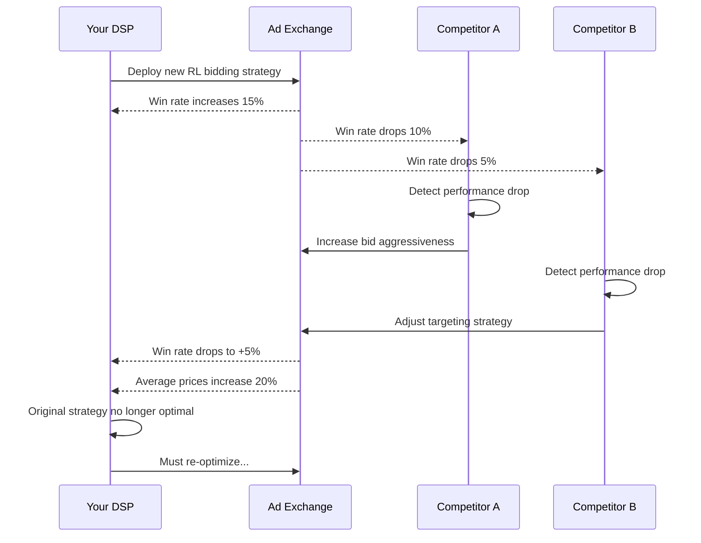
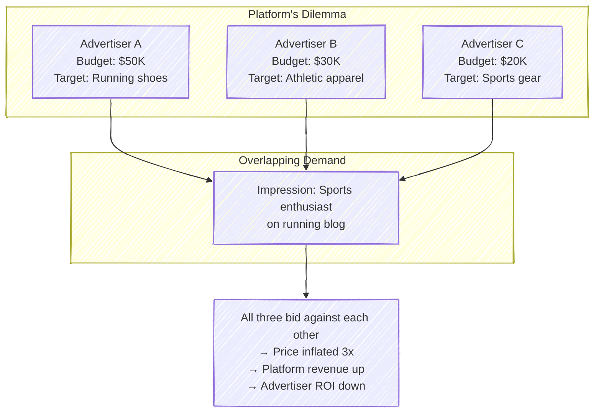
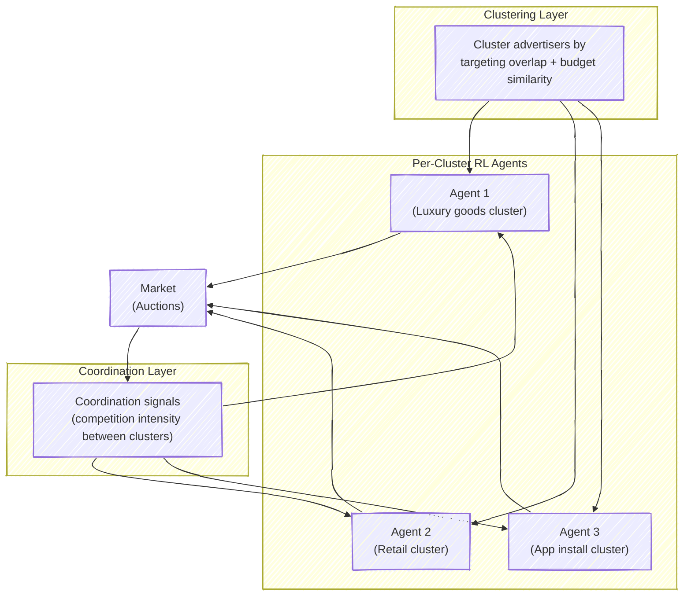
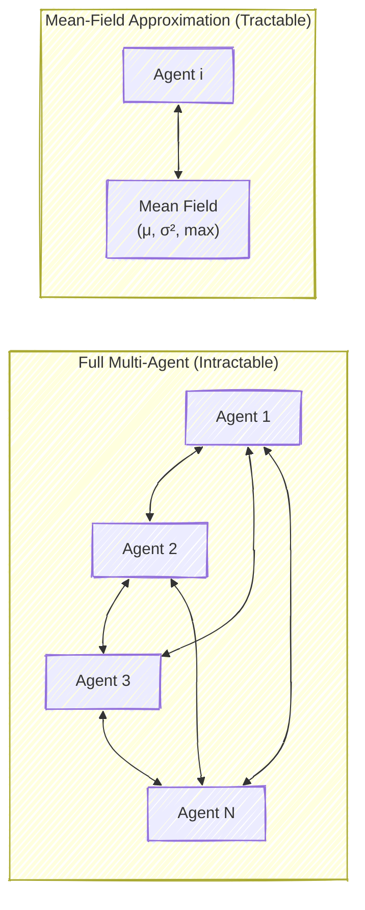
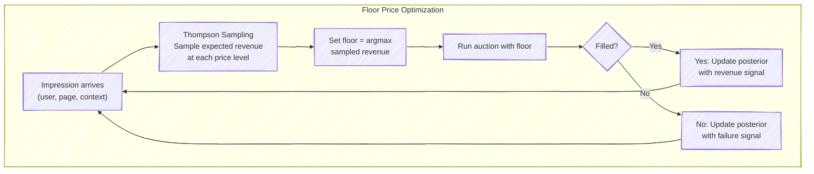

# Chapter 10: Multi-Agent Bidding and Auction Design

---

## 10.1 The Multi-Agent Reality

Everything in the preceding chapters treated bidding from the perspective of a single agent optimizing against a static or stochastic environment. But an ad auction is not a stochastic environment — it is a **game**. When your DSP deploys a new bidding strategy that wins more auctions, competitors notice their win rates dropping and adjust their strategies in response. Prices shift, and your once-optimal strategy is no longer optimal.

This chapter confronts the multi-agent nature of programmatic advertising head-on. We draw on **game theory** — the mathematical study of strategic interaction — and show how its concepts illuminate the design of both bidding agents and the auction mechanisms themselves. For ML engineers accustomed to optimizing a loss function against a fixed dataset, the key mental shift is this: in a game, the "dataset" (other agents' behavior) changes in response to your policy.

This cycle of adaptation is not a bug — it is the fundamental nature of competitive markets. The question is whether the system converges to a stable state, and what that state looks like.

> **For the RL Engineer**: If you've encountered non-stationarity in RL training, multi-agent auctions are the extreme case. The environment's transition dynamics literally change as a function of your policy, because other agents are co-adapting. Standard convergence guarantees for single-agent RL (e.g., DQN convergence) do not apply. You need tools from game theory.

---

## 10.2 Game Theory Essentials for Bidding Engineers

### Nash Equilibrium: Where Nobody Wants to Deviate

A **Nash equilibrium** is a set of strategies — one per player — where no player can improve their outcome by unilaterally changing their strategy. In the context of ad bidding, it means: given what all competitors are doing, your bidding strategy is the best response, and the same is true for every other bidder.

Consider two DSPs competing for the same impression in a first-price auction. Each must choose a bid without knowing the other's bid. If DSP A bids \$5 and DSP B bids \$3, DSP A wins and pays \$5. Could A have done better? If A had bid \$3.01, it would still have won but paid less. So this is not an equilibrium — A has an incentive to deviate.

The equilibrium in a first-price auction with values drawn from a known distribution has a clean mathematical form. For $n$ bidders with values drawn independently from a uniform distribution on $[0, 1]$, the symmetric Bayes-Nash equilibrium bidding strategy is:

$$b(v) = \frac{n-1}{n} \cdot v$$

Each bidder shades their bid by a factor of $\frac{1}{n}$. With 2 bidders, you bid half your value. With 10 bidders, you bid 90% of your value. More competition means less bid shading, which is intuitive — with many competitors, you can't afford to shade much or you'll lose.

> **Key Insight**: The bid shading formula $b(v) = \frac{n-1}{n} \cdot v$ explains why bid shading algorithms in production must estimate the competitive landscape. The optimal amount of shading depends on how many (and how aggressive) the other bidders are. This is why DSPs invest heavily in market density estimation.

### A Worked Example: The Prisoner's Dilemma of Bid Escalation

Consider two DSPs competing for a pool of impressions each worth \$5 to both of them. Each can choose to bid "conservatively" (\$3.00) or "aggressively" (\$3.50). When both pick the same strategy they split the pool 50/50; when one bids aggressively and the other conservatively, the aggressive bidder wins every contested impression. Each cell below shows *expected profit per impression* (win probability × margin), DSP A first, then DSP B:

| | DSP B: Conservative | DSP B: Aggressive |
|---|---|---|
| **DSP A: Conservative** | \$1.00, \$1.00 | \$0.00, \$1.50 |
| **DSP A: Aggressive** | \$1.50, \$0.00 | \$0.75, \$0.75 |

Reading the table: against a conservative opponent, bidding aggressively pays \$1.50 versus \$1.00 for matching; against an aggressive opponent, bidding aggressively pays \$0.75 versus \$0.00 for staying conservative. Aggressive **strictly dominates** for both players, so the Nash equilibrium is (Aggressive, Aggressive), where each earns \$0.75. Yet both would be better off at (Conservative, Conservative), earning \$1.00 each. This is a classic **prisoner's dilemma**: individually rational behavior leads to a collectively suboptimal outcome. In real ad markets, this dynamic drives prices up and margins down, which is why coordination mechanisms (Section 10.4) and thoughtful mechanism design (Section 10.5) matter so much.

### Mechanism Design: Engineering the Game

While bidders take the auction rules as given and optimize within them, the **platform** (Google Ad Manager, Microsoft Xandr, etc.) designs the rules. This is the domain of **mechanism design** — sometimes called "inverse game theory" — where the goal is to create rules such that the resulting game has desirable equilibrium properties.

The platform cares about several (often conflicting) objectives:

| Objective | Description | Favored By |
|-----------|-------------|------------|
| **Revenue** | Total payment to the platform | Higher reserve prices, more competition |
| **Efficiency** | Impressions go to the bidder who values them most | Truthful mechanisms (VCG) |
| **Fairness** | Budget-constrained bidders get reasonable allocation | Pacing equilibrium |
| **Simplicity** | Bidders can easily reason about the rules | First-price, posted prices |
| **Incentive compatibility** | Bidders benefit from reporting true values | Second-price, VCG |

No single auction format optimizes all objectives simultaneously. The history of ad tech auction design is a story of navigating these trade-offs.

### VCG: The Theoretically "Perfect" Mechanism

The **Vickrey-Clarke-Groves (VCG)** mechanism is the gold standard of mechanism design theory. In a single-item auction, it reduces to the second-price auction: the highest bidder wins and pays the second-highest bid. Its key property is **incentive compatibility** — each bidder's dominant strategy is to bid their true value, regardless of what others do.

For multiple items, VCG generalizes: each bidder reports their value for every possible bundle, the mechanism computes the welfare-maximizing allocation, and each winner pays the "externality" they impose on others — the amount by which their presence reduces other bidders' total welfare.

In theory, VCG is beautiful. In practice, it has significant problems in the auto-bidding world:

- **Computational complexity**: Computing VCG payments for combinatorial ad allocation is NP-hard. The Generalized Second-Price (GSP) auction used by search engines is a practical approximation, but it sacrifices incentive compatibility.
- **Revenue deficiency**: VCG can produce lower revenue than a simple first-price auction because winners pay the externality (what others lost), not their own bid. In thin markets with few bidders, this difference can be substantial.
- **Vulnerability to collusion**: If two bidders collude, they can dramatically reduce their VCG payments by coordinating their reported values. First-price auctions are more robust to collusion because each bidder's payment is their own bid.

Despite these limitations, VCG remains the conceptual benchmark against which all other mechanisms are evaluated. Understanding it deeply equips you to reason about why practical mechanisms deviate from the theoretical ideal.

> **Historical Note**: William Vickrey proposed the second-price auction in 1961 and received the Nobel Prize in Economics for it in 1996. The generalization to multiple items by Clarke (1971) and Groves (1973) remains one of the most celebrated results in economic theory. For decades, it was the default choice for online ad auctions — Google's AdWords and Facebook Ads both started with (generalized) second-price mechanisms.

---

## 10.3 The Auto-Bidding Revolution and Its Game-Theoretic Consequences

### A Surprising Reversal

One of the most striking recent results in auction theory comes from Kolumbus and Nisan (WWW 2022). They proved that when bidders delegate their bidding to **learning algorithms** (regret-minimizing agents, which includes most RL/ML bidding systems), the incentive properties of auctions **reverse**:

| Auction Format | Manual Bidding | Auto-Bidding (RL Agents) |
|---------------|---------------|--------------------------|
| Second-price | Truthful (dominant strategy) | Incentive to misreport values |
| First-price | Strategic (bid shading needed) | Truthful reporting becomes dominant |

In the classical setting, second-price auctions are incentive-compatible: you bid your true value because the payment is set by someone else's bid, so shading only hurts you. But when a learning agent bids on your behalf, it can learn to exploit the second-price mechanism by strategically losing some auctions to reduce the clearing price for auctions it wins. The agent doesn't need to be programmed to do this — regret minimization *discovers* this strategy automatically.

Conversely, in first-price auctions, the learning agent's optimal strategy is to report its true value to the auto-bidding system, because any misreport would only cause the agent to make suboptimal bid-shading decisions. The strategic complexity is absorbed by the agent's shading algorithm, and the advertiser's best move is to be honest about their valuations.

This result provides a theoretical explanation for the industry's shift from second-price to first-price auctions between 2017 and 2020. The transition was driven by practical concerns (header bidding made second-price semantics unclear), but the Kolumbus-Nisan result shows it was also game-theoretically sound for a world of auto-bidders.

> **Key Insight**: The shift to first-price was not just a practical convenience — it was a fundamental realignment of auction incentives for the auto-bidding era. In a world where the majority of bids are placed by algorithms, first-price is the more "truthful" mechanism, despite being the opposite in the classical (human bidders) setting.

### VCG's Price of Anarchy in Auto-Bidding

Mehta (2022) showed that even VCG — the theoretical gold standard — suffers in the auto-bidding world. When bidders use auto-bidding agents with budget and ROI constraints, the **Price of Anarchy** (the ratio of optimal welfare to worst-case equilibrium welfare) for VCG is **2**. This means the "truthful" mechanism can lose up to half the social welfare when bidders are value-maximizers with constraints, rather than utility-maximizers.

This is a sobering result. It says that no matter how elegant your mechanism is in theory, the interaction between constrained auto-bidders can destroy significant welfare. It has motivated research into mechanisms specifically designed for the auto-bidding world.

### Convergence and Stability

A critical practical question is whether learning agents in repeated auctions converge to equilibrium or cycle chaotically. The answer depends on the auction format and the learning algorithms used:

- **Fictitious play** (each agent best-responds to the historical frequency of opponents' actions) converges in many auction settings but can be slow — requiring thousands of rounds.
- **Gradient-based learning** (policy gradient methods) can converge in potential games but may cycle in general-sum games. Ad auctions are typically not potential games.
- **Regret-minimizing algorithms** (e.g., multiplicative weights, EXP3) guarantee low individual regret but do not guarantee convergence to Nash equilibrium in general. The time-averaged play does converge to a **coarse correlated equilibrium**, which is a weaker solution concept.

In practice, the market never truly reaches equilibrium — DSPs update their models weekly or daily, traffic patterns shift, and new advertisers enter and exit. The relevant question is not "does the market converge?" but "is the market's behavior stable enough that my pacing and bidding systems can track it?" The answer, empirically, is yes for most mature ad exchanges: clearing prices are fairly predictable hour-to-hour, even though the underlying agents are constantly adapting.

> **For the RL Engineer**: If you train a bidding agent using self-play (the standard MARL approach), be aware that the learned policy may be brittle to opponents that don't play the equilibrium strategy. Robust training requires diversity in the opponent pool — include heuristic bidders, random bidders, and adversarial bidders alongside self-play agents.

---

## 10.4 Multi-Agent RL Approaches

### The Coordination Problem

When a single platform (e.g., Meta, Amazon, Google) manages bidding for many advertisers simultaneously, it faces a **coordination problem**. Its advertisers compete with each other in the same auctions, driving up prices. The platform has an incentive to coordinate their bidding to avoid wasteful competition — but it must do so without violating advertiser trust or anti-competitive regulations.

### DCMAB: Distributed Coordinated Multi-Agent Bidding

Jin et al. (2018) proposed the DCMAB framework for coordinating bidding across advertisers. The approach has three stages:

1. **Clustering**: Group advertisers by behavioral similarity — targeting overlap, budget size, performance goals. Advertisers in the same cluster compete for similar inventory.

2. **Per-cluster agents**: Train one RL agent per cluster. Each agent learns a bidding policy for its cluster, taking as input both local state (budget, performance) and global state (market conditions, aggregate demand).

3. **Coordination mechanism**: A coordination layer provides signals to each cluster agent, encoding the level of competition with other clusters. When two clusters heavily overlap in their targeting, the coordination signal encourages one to shift to different inventory, reducing wasteful bidding wars.

The key insight is the **separation of scales**: individual advertiser optimization happens within clusters (relatively low competition), while between-cluster coordination happens at a coarser level (a small number of clusters, manageable for multi-agent RL).

### Mean-Field Approximation: Scaling to Millions

For platforms with millions of advertisers, even clustering-based approaches are expensive. Wen et al. (2022) proposed the **MAAB** (Multi-Agent Auto-Bidding) framework, which uses a mean-field approximation from statistical physics.

The core idea is elegant: instead of modeling the strategies of millions of individual agents, approximate the competitive environment as a single **mean field** — a statistical summary of all agents' aggregate behavior. Each agent then optimizes against this mean field rather than against individual opponents.

Concretely, each agent's policy takes as input:

- Its own state (budget remaining, performance metrics)
- The mean field statistics: average bid level $\bar{b}$, bid variance $\sigma_b^2$, and maximum bid $b_{\max}$ (a proxy for competition intensity)

The mean field is updated after each round based on all agents' actions, and each agent re-optimizes against the new mean field. Under mild conditions, this process converges to a **mean-field equilibrium** — an approximation of the Nash equilibrium that becomes exact as the number of agents grows.

### The Temperature Knob: Cooperation vs. Competition

MAAB introduces a temperature parameter $T \in [0, 1]$ that controls the balance between individual and collective optimization:

- At $T = 0$: Each agent maximizes its own utility (pure competition). Bids are aggressive, prices are high, the platform captures surplus.
- At $T = 1$: Agents maximize total social welfare (pure cooperation). Bids are conservative, prices drop, advertisers benefit.
- At $0 < T < 1$: A cooperative equilibrium emerges, balancing advertiser ROI and platform revenue.

The platform controls $T$ as a lever. Setting $T$ too high kills platform revenue. Setting $T$ too low drives advertisers to competing platforms. The optimal $T$ depends on the platform's market power and advertiser elasticity — a fascinating economics problem in its own right.

> **Industry Example**: Amazon's advertising platform manages bidding for merchants who also compete with each other on product listings. Amazon must balance three interests: merchant advertising ROI, platform ad revenue, and consumer experience (relevant ads). Reports suggest they use a coordinated bidding approach with implicit temperature control — merchants with strong organic rankings are bid down in advertising to avoid self-cannibalization.

---

## 10.5 Auction Design: The Platform Perspective

If you work at an ad exchange or SSP, you are not a player in the game — you are the **game designer**. The rules you set determine the equilibrium that emerges, and thus the revenue, efficiency, and long-term health of your marketplace.

### Reserve Prices

A **reserve price** (or floor price) is the minimum bid required to win an impression. It is the single most powerful lever the platform has. Setting it too low leaves money on the table; setting it too high causes impressions to go unsold.

The optimal reserve price in a classical second-price auction with $n$ bidders whose values are drawn from distribution $F$ was characterized by Myerson (1981) — another Nobel Prize-winning result. For uniformly distributed values on $[0, 1]$, the optimal reserve price is $\frac{1}{2}$, regardless of the number of bidders.

But the auto-bidding world changes the calculus. Balseiro, Golrezaei, Mahdian, Mirrokni, and Muthukrishnan (2021) showed that in settings where bidders use auto-bidding agents with budget constraints:

- Reserve prices can **simultaneously improve both revenue and welfare** — a "free lunch" that is impossible in classical theory.
- The mechanism is simple: reserves prevent budget-constrained bidders from winning too cheaply, redistributing impressions to bidders who value them more, while also increasing prices for the platform.

This "everyone wins" result depends on the presence of budget constraints. Without them, the classical trade-off between revenue and efficiency applies.

### The Eisenberg-Gale Program

When all bidders use budget pacing in a first-price auction, the market equilibrium can be computed by solving the Eisenberg-Gale convex program:

$$\max \sum_{i=1}^{n} B_i \cdot \log(u_i)$$

$$\text{subject to} \quad \sum_{i} x_{ij} \leq 1 \;\; \forall j, \quad u_i = \sum_{j} v_{ij} \cdot x_{ij} \;\; \forall i, \quad x_{ij} \geq 0$$

This program has a beautiful structure:

- The objective is a **weighted sum of log-utilities**, where weights are budgets. This is the Nash Social Welfare function, which produces proportionally fair allocations.
- The **dual variables** of the supply constraints ($\sum_i x_{ij} \leq 1$) give the market-clearing prices for each impression.
- The **dual variables** of the utility constraints give the pacing multipliers for each bidder.

The platform can solve this program to compute the equilibrium directly, or it can set up auction rules that cause decentralized bidders to converge to the same equilibrium through their individual pacing algorithms.

> **Key Insight**: The Eisenberg-Gale program connects three seemingly unrelated fields: (1) auction theory (market equilibrium), (2) fair division (proportional fairness), and (3) convex optimization (efficient computation). Budget-paced auctions achieve all three simultaneously.

### Budgets as a Welfare Guardrail

Feng, Lucier, and Slivkins (2023) proved a result with significant practical implications: **budget constraints improve welfare** in auto-bidding markets. Specifically:

- Without budget constraints, the welfare in auto-bidding equilibria can be arbitrarily bad — the Price of Anarchy is unbounded.
- With budget constraints, the worst-case welfare is at least $\frac{1}{2}$ of the optimal **liquid welfare** (welfare weighted by the ability to pay).

The intuition is that budgets prevent pathological equilibria where one bidder "starves out" all others by bidding astronomically high. The budget constraint forces every bidder to pace, which smooths competition and improves overall efficiency.

This provides a strong argument for platforms to require advertisers to set budgets, even if the advertiser would prefer to leave their budget uncapped.

---

## 10.6 Supply-Side Optimization

### Floor Price Optimization as a Bandit Problem

On the supply side (publishers and SSPs), the key decision is setting floor prices for each impression. This is naturally a **multi-armed bandit problem**: each floor price level is an "arm," and the reward is the revenue generated (floor price times fill probability).

The challenge is that floor price and fill rate are inversely related — raising the floor increases revenue per sold impression but decreases the probability of a sale. The optimal floor depends on the distribution of bids, which changes over time as DSPs adjust their strategies.

**Thompson Sampling** is a natural fit for this problem. The SSP maintains a posterior distribution over the expected revenue at each price level, samples from each posterior, and selects the price with the highest sampled revenue. As data accumulates, the posteriors concentrate around the true revenue curves, and the system converges to the optimal floor price.

The key advantage of Thompson Sampling over deterministic optimization (e.g., grid search) is that it naturally **explores** — occasionally testing higher and lower floors to detect shifts in the bid landscape.

> **Industry Example**: Index Exchange and PubMatic both publicly describe using bandit-based floor price optimization. PubMatic's system reportedly tests 20-30 floor price levels per ad unit, with separate bandits for different audience segments and times of day, updating in near-real-time as bid patterns shift.

### Contextual Floor Prices

A single floor price for all impressions is suboptimal. Premium inventory (above-the-fold, high-engagement users) commands higher bids and should have higher floors. Low-quality inventory should have lower floors to maximize fill rate.

This motivates **contextual bandits** for floor pricing, where the "context" includes page quality signals, user engagement metrics, device type, time of day, and historical bid density for similar impressions. The system learns a floor price function $f(\text{context}) \to \text{floor}$, rather than a single scalar.

### Header Bidding and the SSP's Strategic Position

The rise of **header bidding** (where publishers solicit bids from multiple SSPs simultaneously before calling their primary ad server) fundamentally changed the supply-side landscape. Before header bidding, Google's Ad Exchange had a privileged "last look" — it could see all other bids and decide whether to outbid them. Header bidding leveled the playing field by running all exchanges in parallel.

For SSPs, this created both opportunity and pressure. Each SSP now competes not just on the quality of demand (DSP relationships) but on the speed and intelligence of its auction mechanics. An SSP that sets floor prices too high will have low fill rates and lose publisher trust. One that sets them too low will capture less revenue and be less attractive to publishers seeking monetization.

The strategic interaction between SSPs adds another layer of multi-agent dynamics: SSPs are effectively in a game with each other, mediated by the publisher's header bidding wrapper. Modeling this game is an active area of research.

---

## 10.7 Bandits vs. Full RL: Choosing the Right Framework

A recurring question in ad tech system design is when to use contextual bandits versus full reinforcement learning. The distinction is both theoretical and practical.

| Criterion | Contextual Bandits | Full RL |
|-----------|-------------------|---------|
| Decision coupling | Independent decisions | Sequential, coupled by state |
| Budget constraint | No (or handled externally) | Yes, internalized in state |
| Reward timing | Immediate (click, view) | Delayed (conversion hours/days later) |
| State dependency | Only context matters | State (budget, time, history) matters |
| Training complexity | Moderate | High |
| Typical use case | Which ad to show in this slot | How to pace budget over the day |

The practical heuristic: if you can formulate the problem as "given this context, choose an action and observe an immediate reward," use bandits. If the problem involves "given the current state of the world, choose an action that affects future states and rewards," use RL.

In a complete ad system, both coexist: RL handles the budget pacing and bid shading (Chapter 9, Chapters 5-7), while bandits handle the creative selection, ad ranking, and floor pricing. The RL agent sets the pacing multiplier and bid level; the bandit selects which creative to show once the auction is won.

> **For the RL Engineer**: If you're coming from an RL background, resist the urge to model everything as an MDP. Many ad tech decisions are genuinely stateless — the best ad to show a user right now does not depend on which ad you showed the previous user. Using RL where bandits suffice adds training complexity, slows convergence, and introduces unnecessary variance through bootstrapped value estimates.

---

## 10.8 Emerging Frontiers

### Auto-Bidding Equilibrium Design

Aggarwal, Badanidiyuru, Balseiro, Bhawalkar, Deng, Feng, Goel, Liaw, Lu, and Mahdian (2024) published a comprehensive survey on auto-bidding and auction design. Their key observations:

1. **The ecosystem has shifted**: The majority of ad spend now flows through auto-bidding systems. Auction design must optimize for algorithmic bidders, not humans.

2. **Mechanism simplicity matters**: Auto-bidders can exploit complex mechanisms in ways human bidders cannot. Simpler mechanisms (first-price + reserve) are more robust to strategic manipulation by learning agents.

3. **Welfare guarantees require structure**: Without constraints (budgets, ROI targets), auto-bidding equilibria can be arbitrarily inefficient. The constraints that advertisers find burdensome are actually necessary for market health.

4. **Cross-auction effects are first-order**: An advertiser's strategy in one auction affects prices in all related auctions. Models that treat auctions as independent are fundamentally incomplete.

### Privacy-Preserving Multi-Agent Systems

As privacy regulations (GDPR, CCPA) and platform changes (Apple's ATT, Chrome's Privacy Sandbox) reduce the information available to bidders, the multi-agent dynamics shift in important ways. Bidders with less information bid less efficiently on the individual impression level, but paradoxically this can improve aggregate welfare: less targeted bidding means less extreme bid concentration on a few "golden" user profiles, distributing demand more evenly across the impression landscape.

The strategic implications are profound. In a world of abundant user data, DSPs competed primarily on model quality — who could predict conversion probability most accurately. In a privacy-constrained world, competition shifts toward **contextual intelligence** (understanding the page and moment), **first-party data partnerships** (direct advertiser-publisher relationships), and **mechanism design** (auction rules that elicit truthful signals without requiring user-level tracking).

Understanding these effects requires combining auction theory with **information design** — the study of how the structure and availability of information affects strategic outcomes. This is one of the most active research frontiers in computational economics.

### Large Language Models in Auction Design

Early research (e.g., Duetting et al., 2024) explores using LLMs to design auction mechanisms by describing the desired properties in natural language and having the model propose mechanism rules. While speculative, this represents a potential paradigm shift from hand-designed to AI-designed marketplaces.

More concretely, LLMs could assist in the **simulation and analysis** of auction mechanisms: given a description of bidder types, constraints, and platform objectives, generate and evaluate candidate auction rules in a simulation environment. The combinatorial space of possible auction mechanisms is vast, and automated search — guided by natural language descriptions of desirable properties — could discover mechanisms that human designers would not consider.

---

## Exercises

### Conceptual

1. Explain the Kolumbus-Nisan result to a colleague who understands ML but not game theory. Why does using a learning agent to bid in a second-price auction create an incentive to misreport values? Provide an intuitive example with two bidders.

2. A platform considers raising reserve prices by 20%. Total revenue increases 5%, but advertiser satisfaction (measured by renewal rates) drops 8%. Frame this as a multi-period game: what is the platform's optimal strategy if it considers long-term advertiser retention?

3. The mean-field approximation treats all other agents as an average. Under what market conditions does this approximation break down? Consider a market with one advertiser spending \$10M/day and 10,000 advertisers spending \$100/day each.

4. Why do budget constraints improve welfare in auto-bidding markets? Use the analogy of a commons (shared resource) to explain the intuition.

5. A DSP uses an RL bidding agent and observes that when it deploys a new policy, performance improves for two weeks and then degrades. What multi-agent dynamic could explain this pattern? What would you do about it?

### Applied

6. You manage an SSP and must choose between a fixed floor price of \$1.50 and a Thompson Sampling system with 20 price levels. Describe (in prose) how you would design an A/B test to compare them, including what metrics to track and how long to run it.

7. Design a coordination mechanism for a platform with 3 advertisers who all target the same audience segment. Advertiser A has a \$100K budget, B has \$50K, and C has \$10K. How should the platform's pacing system handle their overlapping demand? What is the expected equilibrium allocation?

---

## Further Reading

- Kolumbus, Y. & Nisan, N. (2022). "Auctions Between Regret-Minimizing Agents." *WWW*.
- Wen, Z., et al. (2022). "MAAB: Multi-Agent Cooperative Bidding Games." *WSDM*.
- Conitzer, V., et al. (2022). "Pacing Equilibrium in First-Price Auction Markets." *Operations Research*.
- Aggarwal, G., et al. (2024). "Auto-bidding and Auctions in Online Advertising: A Survey." arXiv:2408.07685.
- Balseiro, S. R., Golrezaei, N., Mahdian, M., Mirrokni, V., & Muthukrishnan, S. (2021). "Contextual Bandits for Reserve Price Optimization." *Management Science*.
- Feng, Z., Lucier, B., & Slivkins, A. (2023). "The Welfare of Auto-Bidding Mechanisms." *STOC*.
- Mehta, A. (2022). "Auction Design in an Auto-bidding Setting: Randomization Improves Efficiency Beyond VCG." *WWW*.
- Myerson, R. (1981). "Optimal Auction Design." *Mathematics of Operations Research*.
