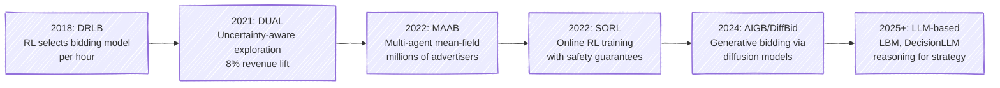
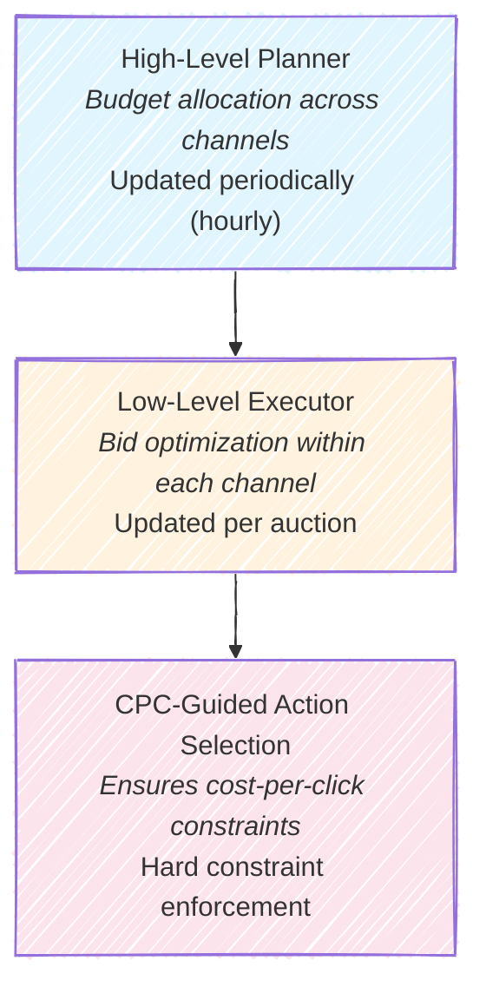
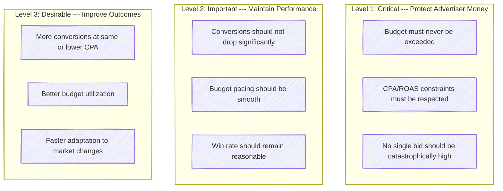
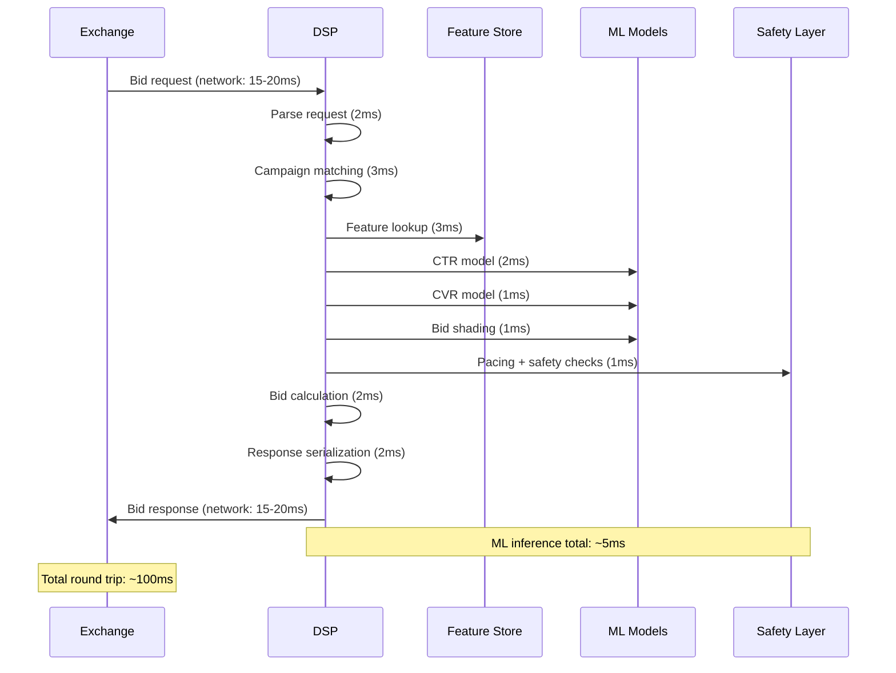
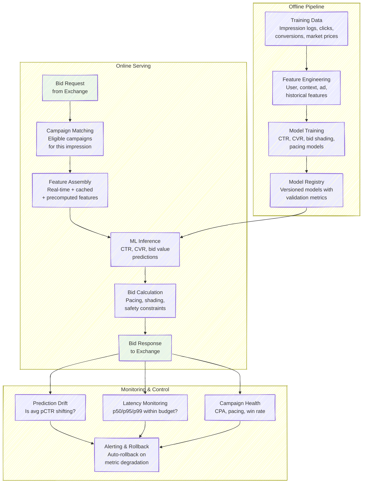
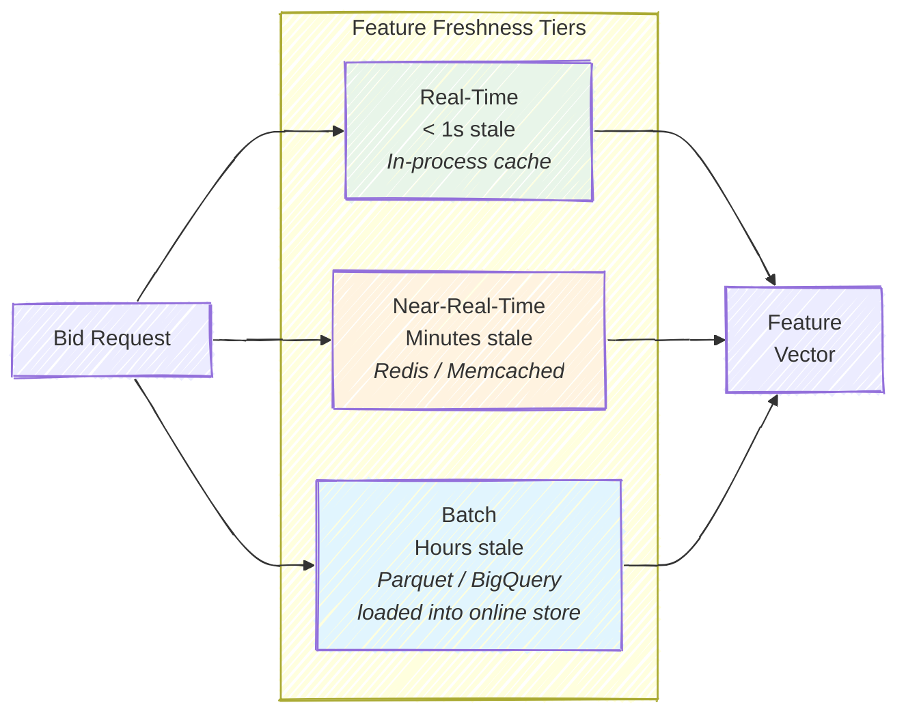
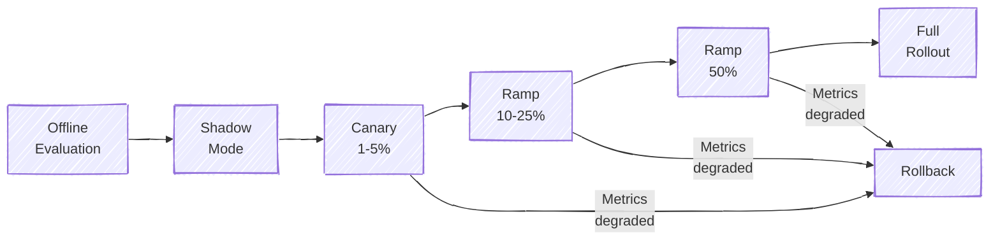

# Chapter 11: Production Systems -- From Research to Deployment

The leap from a promising research prototype to a production bidding system is one of the most humbling transitions in applied machine learning. A model that achieves a 3% AUC improvement on an offline test set may, once deployed, fail to outperform a hand-tuned heuristic that has been refined over years. This chapter examines why that gap exists, how the industry's leading companies have navigated it, and what architectural and operational patterns have proven essential for serving billions of bid decisions per day under strict latency, safety, and correctness constraints.

---

## 11.1 The Research-Production Gap

In academic papers, bidding algorithms are evaluated on clean datasets with well-defined reward signals, stationary auction dynamics, and unlimited compute budgets. Production is a different universe. Data arrives noisy, delayed, and censored: you only observe market prices for auctions you win, conversions may take days to attribute, and user behavior drifts seasonally, weekly, and hourly. The environment is non-stationary not just because of user behavior but because every competing bidder is simultaneously adapting. And all of this must be handled within an inference budget measured in single-digit milliseconds, because real money is at stake on every decision.

| Dimension | Research Setting | Production Reality |
|-----------|------------------|--------------------|
| Data quality | Clean, curated datasets | Noisy, delayed, censored feedback |
| Evaluation | Offline metrics (AUC, NDCG) | Revenue, CPA compliance, advertiser satisfaction |
| Scale | Single campaign, thousands of auctions | 10,000+ campaigns, billions of auctions/day |
| Environment | Stationary or slowly drifting | Competitors adapt, seasonality, trend shifts |
| Compute | Unlimited training and inference time | 5 ms inference budget at 100K+ QPS |
| Features | Complete, well-engineered | Missing data, stale caches, feature drift |
| Success criterion | "Achieves 3% improvement" | "Did not break anything while improving revenue" |

> **For the RL Engineer**: If you come from robotics or game-playing RL, the closest analogue to production bidding is not sim-to-real transfer for a single robot --- it is deploying a policy into a *multi-agent* environment where every other agent is also updating its policy in response to yours, the reward signal is delayed by hours or days, and a single bad episode costs real money.

---

## 11.2 How Major Companies Build Bidding Systems

### Google Smart Bidding

Google's Smart Bidding is arguably the most widely used automated bidding system in the world. Advertisers specify a high-level goal --- Target CPA, Target ROAS, Maximize Conversions, or Maximize Conversion Value --- along with a daily budget and targeting criteria. The system then optimizes every individual auction bid to achieve that goal.

Under the hood, Smart Bidding relies on massive CTR and CVR prediction models trained on hundreds of billions of historical impressions. At bid time, the system ingests dozens of real-time signals: device type and OS, geographic location, time of day, remarketing list membership, browser language, search query (for search campaigns), and ad creative characteristics. The bid is computed via a combination of predicted conversion probability and real-time Lagrangian-based pacing that ensures budget is spent smoothly across the day.

Google has published relatively little about Smart Bidding's internals, but their earlier work on FTRL (Follow The Regularized Leader) for ad prediction and their research on pacing equilibrium theory provide hints at the mathematical foundations. The key architectural insight is that *pacing and bidding are tightly coupled*: the system does not first predict a value and then separately decide whether to pace --- the pacing multiplier is embedded directly in the bid calculation.

> **Industry Example**: Google's Performance Max campaigns take automation even further. The system simultaneously optimizes bid amounts, budget allocation across channels (Search, Display, YouTube, Gmail, Maps), audience targeting, and even creative assembly. The advertiser provides assets and goals; the system handles everything else.

### Alibaba's Evolution

Alibaba's journey in automated bidding is one of the best-documented in the industry, spanning nearly a decade of published research. Their trajectory illustrates how production systems evolve:

Several themes emerge from this timeline. First, the progression from *control-by-model* (RL selects which heuristic to use) to *control-by-action* (RL directly outputs bids) to *generative* (diffusion models produce entire trajectories) reflects increasing trust in learned systems. Second, each generation explicitly addresses the failure modes of the previous one: SORL was developed because offline-trained RL policies suffered from distribution shift when deployed; AIGB was developed because sequential RL struggled with error compounding over long horizons.

> **Key Insight**: Alibaba did not jump straight to end-to-end RL. Their first deployed system (DRLB, 2018) used RL only to select *which existing heuristic* to run each hour. The RL policy's action space was a discrete set of known-good bidding strategies, not raw bid values. This pattern --- using RL to optimize the parameters of a trusted system rather than replacing it --- recurs throughout the industry.

### Meituan's HiBid

Meituan, China's largest local services platform, faces a distinct challenge: their advertising marketplace spans food delivery, hotel booking, movie tickets, and dozens of other verticals, each with different conversion funnels and latency requirements. Their HiBid system uses a hierarchical architecture that separates strategic planning from tactical execution:

The high-level planner solves a non-competitive resource allocation problem: given a total budget, how should it be distributed across channels and time periods? This is updated on a slow cadence (hourly or less frequently) and can afford heavier computation. The low-level executor operates per-auction, making fast bid decisions within the budget envelope allocated by the planner. The CPC-guided action selection layer acts as a hard constraint enforcer, ensuring that no matter what the RL policy proposes, the resulting cost-per-click remains within the advertiser's specified bounds.

This hierarchical decomposition is important because it separates concerns that operate on fundamentally different timescales. Budget allocation changes slowly and depends on aggregate statistics; individual bid decisions must be made in milliseconds and depend on impression-level features.

### Meta's DLRM Serving Architecture

Meta (formerly Facebook) has been more open than most about the infrastructure required to serve deep learning recommendation models at scale. Their Deep Learning Recommendation Model (DLRM) architecture, which underpins both ad ranking and bidding, presents a unique serving challenge: the model is dominated by *embedding tables* rather than dense computation. A typical DLRM has hundreds of embedding tables (one per categorical feature), collectively requiring terabytes of memory. The dense MLP layers account for less than 1% of the total model size.

This means the serving bottleneck is not GPU compute but *memory bandwidth*: fetching sparse embeddings from large tables for each inference request. Meta's solution involves distributing embedding tables across multiple machines (model parallelism), with the dense layers replicated on each machine. Custom hardware (their Zion platform, and later their MTIA accelerator) is designed specifically for this sparse-dense computation pattern.

The lesson for bidding systems is that model architecture must be co-designed with the serving infrastructure. A model that achieves the best offline AUC may be undeployable if its memory footprint or access pattern does not fit the serving hardware.

> **Industry Example**: Meta reported in 2022 that recommendation and ad models consume over 50% of their total data center compute capacity. The inference cost of CTR prediction at Meta's scale --- trillions of predictions per day --- rivals the training cost of the largest language models.

---

## 11.3 Key Production Challenges

### Challenge 1: The Sim-to-Real Gap

The sim-to-real gap in bidding has a specific technical name in the literature: the **IBOO problem** (Inaccurate Bidding in Online Optimization). Models trained on historical data --- whether via supervised learning, offline RL, or simulation --- encounter distribution shift upon deployment for three interconnected reasons:

1. **Policy-induced distribution shift.** Historical data was collected under the *previous* bidding policy. The new policy wins different auctions, encounters different users, and generates different feedback. This is the classic off-policy problem, but in bidding it is especially severe because the win/loss outcome is a hard threshold function of the bid.

2. **Competitive dynamics.** When you change your bidding strategy, competitors react. If you start bidding more aggressively on a particular inventory segment, competitors may raise their bids in response, or they may retreat to other segments. Your simulator cannot predict these second-order effects.

3. **Feature drift.** User behavior, publisher inventory, and market conditions change between the time you collected training data and the time you deploy. A model trained on Black Friday data will not generalize to a quiet Tuesday in February.

The industry has converged on two primary solutions:

**Hybrid deployment (train with RL, deploy heuristics).** This approach, championed by Korenkevych et al. (2023), uses offline RL to optimize the *parameters* of a production heuristic rather than deploying the neural network directly. The RL agent trains in simulation, finding optimal values for parameters like base bid multipliers, pacing sensitivity coefficients, and CPA penalty weights. After training, the neural network is discarded, and only the optimized parameters are deployed into the existing heuristic codepath. This is appealing because it requires no new serving infrastructure, the deployed behavior is interpretable (you can inspect the parameter values), and the heuristic's behavior is well-understood by the operations team.

**Direct online training with safety guarantees.** Alibaba's SORL framework (Mou et al., 2022) takes the opposite approach: train the RL policy directly in the live system. The key innovation is a Lipschitz-smooth Q-function that provides *theoretical bounds* on how much performance can degrade from small action perturbations. Formally, if the Q-function satisfies $|Q(s, a_1) - Q(s, a_2)| \leq L \cdot \|a_1 - a_2\|$, then the maximum performance loss from exploring action $a'$ instead of the current best action $a^*$ is bounded by $L \cdot \|a' - a^*\|$. The system only explores when this bound is within an acceptable safety margin.

> **For the RL Engineer**: The hybrid approach is philosophically similar to how AlphaGo's Monte Carlo Tree Search used the neural network to *guide* the search rather than directly outputting moves. The neural network improves the system, but the final decision goes through a well-understood, controllable algorithm.

### Challenge 2: Safety and Risk Management

Production bidding systems handle real advertiser money, and the risk hierarchy is strict:

The standard architecture for enforcing safety is a **post-decision safety layer** that sits between the RL agent's proposed bid and the actual submitted bid. This layer applies a cascade of constraints:

1. **Maximum bid multiplier**: No bid exceeds $k$ times the estimated impression value (typically $k = 5$).
2. **Minimum bid floor**: Every bid is at least some small amount (e.g., \$0.01) to avoid division-by-zero issues downstream.
3. **Single-bid budget cap**: No individual bid exceeds some fraction of remaining budget (typically 0.1--1%).
4. **Remaining budget hard cap**: No bid exceeds the remaining campaign budget.
5. **CPA emergency brake**: If running CPA exceeds the target by more than 20%, bids are halved until the ratio recovers.

The safety layer is *not* part of the RL policy --- it is a separate, deterministic module that the RL agent cannot override. This separation of concerns is critical: the RL team can iterate on the policy without risking advertiser funds, and the safety team can tighten constraints without retraining the model.

> **Key Insight**: The safety layer introduces a form of action clipping that can interact poorly with RL training. If the safety layer frequently overrides the agent's actions during data collection, the agent receives reward signals that do not correspond to its *intended* actions. Best practice is to incorporate the safety constraints into the RL training environment so the agent learns to propose actions that rarely trigger the safety layer.

### Challenge 3: Latency

A production DSP (Demand-Side Platform) typically operates under a 100 ms round-trip budget from the moment a bid request arrives from the exchange to the moment the bid response is sent back. After subtracting network transit, parsing, serialization, and buffer time, the ML inference budget is often just **5 ms**. This 5 ms must cover CTR prediction, CVR prediction, bid shading, pacing lookup, and safety checks.

Meeting this latency budget requires aggressive optimization at every layer of the stack:

**Model distillation.** Large teacher models (10+ layers, millions of parameters) are trained offline with unlimited compute. A small student model (2 layers, tens of thousands of parameters) is then trained to mimic the teacher's predictions. The student serves in production. Typical accuracy loss from distillation is less than 0.5% relative AUC, while inference time drops by 5--10x.

**Feature caching.** User features that change slowly (demographics, long-term interests) are cached in local memory rather than fetched from Redis on every request. A well-tuned cache with 100K entries can reduce p99 feature lookup latency from 3 ms to 0.01 ms for cache hits.

**Batch inference.** Rather than processing bid requests one at a time, the serving system collects 8--16 requests and processes them as a single batch on the GPU. This amortizes GPU kernel launch overhead and increases throughput, though it adds a small amount of latency from the batching delay.

**Quantization.** Converting model weights from FP32 to INT8 provides 2--4x speedup on modern hardware with less than 0.5% accuracy degradation. Most major serving frameworks (TensorRT, ONNX Runtime, OpenVINO) support post-training quantization with minimal effort.

| Technique | Latency Reduction | Accuracy Impact | Implementation Effort |
|-----------|-------------------|-----------------|-----------------------|
| Model distillation | 5--10x | < 0.5% AUC loss | Medium (requires teacher-student training) |
| Feature caching | 10--100x for cache hits | None | Low |
| Batch inference | 2--4x throughput | None | Medium (requires request batching logic) |
| INT8 quantization | 2--4x | < 0.5% AUC loss | Low (often one line of code) |

### Challenge 4: A/B Testing Bidding Algorithms

A/B testing bidding algorithms is harder than testing most product features because of **interference effects**. When treatment and control groups bid in the same auctions, treatment bids directly affect the prices that control group campaigns pay, and vice versa. This violates the Stable Unit Treatment Value Assumption (SUTVA) that underpins standard A/B test analysis.

The standard mitigation is to split at the **campaign level**: randomly assign entire campaigns to treatment or control. This eliminates within-auction interference (a campaign only uses one algorithm), though cross-campaign interference remains if treatment and control campaigns compete in the same auctions.

Additional considerations for bidding A/B tests:

- **Minimum duration**: At least 7--14 days to capture weekly cyclicality and account for delayed conversions. Many conversions take 1--7 days to attribute.
- **Metric selection**: Use ratio metrics (CPA, ROAS) analyzed via the delta method, not simple averages. Count metrics (total conversions) can use standard t-tests.
- **Budget interference**: If treatment and control campaigns share an advertiser-level budget, treatment's spending directly constrains control's budget, creating a mechanical negative correlation between their performance.
- **Ramp-up**: Start with 5--10% of traffic in treatment, increase gradually. Monitor safety metrics (CPA compliance, budget pacing) before expanding.

> **Industry Example**: At Meta, bidding algorithm changes go through a rigorous multi-stage process: offline evaluation on historical logs, small-scale "shadow mode" where the new algorithm runs but its bids are not submitted, a limited A/B test on 1--5% of campaigns, and finally a broader rollout. The entire process typically takes 4--8 weeks.

---

## 11.4 The Full Production Stack

A complete production bidding system consists of several interconnected subsystems. The diagram below shows the major components and their relationships:

### The Feature Store

The feature store is often the most operationally complex component. It must serve features at different freshness levels:

- **Real-time features** (< 1 second stale): current bid request attributes, real-time auction signals.
- **Near-real-time features** (minutes stale): user's recent browsing session, campaign spend in the last 5 minutes.
- **Batch features** (hours stale): user segment assignments, historical CTR by publisher, campaign-level aggregates.

The standard architecture uses a tiered storage system: an in-process cache for the hottest features, Redis or Memcached for near-real-time features, and a batch-computed feature table (often in a columnar store like Apache Parquet or BigQuery) that is loaded into the online store periodically.

A common failure mode is **feature skew**: the features computed during training differ subtly from the features computed during serving, because the training pipeline and serving pipeline use different code paths, different data sources, or different temporal windows. Feature stores like Feast, Tecton, and Feathr address this by providing a single feature definition that generates consistent values for both training and serving. Even with these tools, validating feature consistency requires ongoing monitoring --- comparing feature distributions between training data and live serving logs.

### Model Training Pipeline

Model retraining cadence varies by model type. CTR models at major companies are retrained *daily* (Google, Meta) or even continuously (streaming updates via FTRL). Bid shading models that estimate market price distributions are typically retrained every few hours because market dynamics shift faster. RL-based pacing models may be retrained weekly, since pacing policies need to be stable and frequent retraining can introduce oscillation.

> **Key Insight**: The biggest operational risk in the model training pipeline is not a bad model --- it is a *silently degraded* model. A model that has stopped receiving fresh training data, or that is receiving corrupted features, will gradually drift without triggering obvious errors. This is why calibration monitoring (predicted CTR vs. observed CTR) is the single most important metric to track.

---

## 11.5 Monitoring and Observability

A production bidding system requires monitoring across three layers: system health, model performance, and business outcomes.

**System health** metrics include inference latency (p50, p95, p99), bid request volume, error rates, and feature store availability. These are standard SRE metrics and should trigger pages when they breach thresholds.

**Model performance** metrics track whether the models are still accurate. The most important is **calibration**: the ratio of predicted CTR to observed CTR, computed over rolling windows (hourly, daily). A well-calibrated model should have a ratio close to 1.0. If this ratio drifts above 1.2 or below 0.8, the model is no longer trustworthy. AUC degradation is also tracked, though calibration is more actionable because a miscalibrated model directly produces incorrect bids.

**Business outcome** metrics are what advertisers care about: CPA vs. target, ROAS vs. target, budget utilization (fraction of daily budget spent), pacing smoothness (variance of hourly spend), and win rate. These metrics have longer feedback loops (hours to days) but are the ultimate arbiter of system quality.

| Metric | Frequency | Alert Threshold | Response |
|--------|-----------|-----------------|----------|
| p99 inference latency | Real-time | > 10 ms | Page on-call; investigate feature store or model serving |
| CTR calibration ratio | Hourly | Outside [0.8, 1.2] | Retrain model; check feature pipeline |
| Campaign CPA vs. target | Hourly | > 130% of target | Tighten pacing; reduce bids |
| Budget utilization (daily) | Daily | < 80% or > 100% | Adjust pacing parameters |
| Win rate | Hourly | Drops > 50% from baseline | Investigate competitive landscape |
| Revenue per 1000 requests | Hourly | Drops > 20% from baseline | Check model predictions and bid logic |

**Automatic rollback** is the last line of defense. If CPA spikes more than 30% above target across a significant number of campaigns, the system automatically reverts to the previous model version. If budget is being exhausted before the end of the day, pacing constraints are tightened automatically. These automatic responses must be conservative --- they should prevent catastrophe, not optimize performance.

### The Calibration Problem in Detail

Calibration deserves special attention because it is the single metric most directly tied to bid correctness. A CTR model is well-calibrated if, among all impressions where the model predicts a 2% CTR, approximately 2% actually receive clicks. More formally, a model $f$ is perfectly calibrated if:

$$\mathbb{E}[Y | f(X) = p] = p \quad \forall p \in [0, 1]$$

In practice, calibration is measured by binning predictions into buckets and comparing the average prediction to the average outcome in each bucket. The **Expected Calibration Error (ECE)** summarizes this across all buckets:

$$\text{ECE} = \sum_{b=1}^{B} \frac{n_b}{N} \left| \bar{y}_b - \bar{p}_b \right|$$

where $n_b$ is the number of samples in bucket $b$, $\bar{y}_b$ is the average outcome, and $\bar{p}_b$ is the average prediction.

Why does calibration matter so much for bidding? Because the bid is a direct function of the predicted probability:

$$\text{bid} = \text{CPA}_{\text{target}} \times \hat{p}(\text{click}) \times \hat{p}(\text{conversion} | \text{click})$$

If the CTR model is systematically over-predicting by 20%, every bid will be 20% too high. This causes the campaign to win more auctions than it should at prices that are too high, resulting in CPA above target and premature budget exhaustion. Conversely, under-prediction leads to underspending and missed conversion opportunities.

Maintaining calibration over time is challenging because the data distribution shifts continuously. Platt scaling (fitting a logistic regression on top of the model's logits using recent data) is a lightweight recalibration technique that can be updated hourly without retraining the full model.

---

## 11.6 Deployment Patterns

### Canary Deployment

New models are first deployed to a small fraction of traffic (1--5%) while the previous model handles the rest. Metrics are compared between canary and baseline for 24--48 hours. Only if the canary shows no degradation on safety metrics (CPA compliance, budget pacing) is the rollout expanded.

### Shadow Mode

Before even canary deployment, a new model can run in **shadow mode**: it receives real bid requests and computes bids, but those bids are never submitted to the exchange. This allows engineers to compare the new model's *proposed* bids against the production model's *actual* bids and outcomes, without any risk. Shadow mode cannot fully evaluate a new model (because you never observe the counterfactual --- what would have happened if you had submitted the shadow bid), but it can catch obvious problems like bids that are orders of magnitude too high or too low.

### Gradual Ramp-Up

After a successful canary, traffic allocation to the new model increases gradually: 5% to 10% to 25% to 50% to 100%, with monitoring at each stage. The entire ramp-up typically takes 1--2 weeks. This is slower than most product feature rollouts, reflecting the financial stakes involved.

> **Historical Note**: The advertising industry's cautious deployment practices were shaped by several high-profile incidents where automated bidding bugs caused millions of dollars in wasted ad spend within hours. The 2019 Google Ads bug that caused some advertisers to overspend by 2--10x their daily budgets reinforced the industry's commitment to safety layers and gradual rollouts.

---

## 11.7 Operational Lessons from the Industry

Having covered the architecture and challenges, it is worth distilling the operational lessons that recur across every major production bidding system. These are not theoretical observations --- they are patterns that have been learned, often painfully, through years of operating systems at scale.

**Lesson 1: The simplest system that meets the constraints wins.** Production teams consistently report that the majority of bidding value comes from a well-calibrated CTR model and a solid pacing algorithm, not from sophisticated RL policies. The marginal improvement from moving from PID pacing to RL-based pacing is typically 1--3%, while the operational complexity increases dramatically. Only deploy RL when the simpler system has been fully optimized and its limitations are clearly understood.

**Lesson 2: Monitor inputs, not just outputs.** Most production incidents in bidding systems are caused by upstream data issues (a feature pipeline breaking, a training data source going stale, a label pipeline introducing incorrect conversion attributions), not by bugs in the bidding algorithm itself. By the time a metric like CPA degrades enough to trigger an alert, the root cause may have been present for hours. Monitoring feature distributions, label rates, and data freshness catches problems earlier.

**Lesson 3: Separate the knobs you turn daily from the knobs you set once.** Some parameters (pacing multiplier, bid shading factor) change continuously and should be controlled by algorithms. Other parameters (maximum bid cap, safety thresholds, model retraining cadence) are set by engineers and should change infrequently. Mixing these two classes of parameters --- or worse, letting an RL agent control parameters that should be set by humans --- leads to systems that are difficult to debug and operate.

**Lesson 4: Degrade gracefully.** When components fail (the feature store times out, a model serving endpoint goes down, the pacing signal is stale), the system should fall back to a reasonable default rather than crashing or producing arbitrary bids. A common pattern is a "fallback cascade": if the ML model is unavailable, use a cached prediction; if the cache is empty, use a segment-level average; if segment data is unavailable, use a global default. Each fallback is less accurate but more reliable.

**Lesson 5: Version everything.** Models, features, configurations, and safety parameters should all be versioned and auditable. When a metric degrades, the first question is always "what changed?" Being able to diff the current configuration against the previous week's configuration, and to identify exactly which model version is serving, is essential for rapid diagnosis.

---

## Exercises

### Conceptual

1. Why is the hybrid approach (RL optimizes heuristic parameters, then only the heuristic is deployed) preferred over deploying the neural network policy directly? What are the tradeoffs?

2. A new RL bidding model shows 5% improvement in offline evaluation. Describe the complete sequence of steps you would take before deploying it to production, including the specific metrics you would monitor at each stage.

3. You notice that your bidding system's win rate has dropped by 30% over the past week, but your CTR model's AUC has remained stable. What are three possible explanations, and how would you distinguish between them?

4. Explain why A/B testing bidding algorithms violates SUTVA. Design an experimental protocol that minimizes interference effects while still providing sufficient statistical power.

5. Your safety layer is overriding the RL agent's proposed bids on 40% of impressions. Is this a problem? What would you do about it?

### Applied

6. Design a monitoring dashboard for a production bidding system. For each metric, specify the data source, update frequency, alert threshold, and recommended response when the alert fires.

7. Sketch the architecture of a feature store that supports real-time, near-real-time, and batch features. What are the consistency guarantees needed at each tier?

---

## Further Reading

- Korenkevych, D. et al. (2023). "Offline Reinforcement Learning for Optimizing Production Bidding Policies." *arXiv:2310.09426*. The hybrid approach: RL training, heuristic deployment.
- Mou, Z. et al. (2022). "Safe Online Reinforcement Learning for Auto-Bidding." *NeurIPS*. *arXiv:2210.07006*. Lipschitz-bounded safety guarantees for online RL.
- Su, Y. et al. (2024). "AuctionNet: A Novel Benchmark for Decision-Making in Large-Scale Games." *arXiv:2412.10798*. 10M opportunities, 500M auction records.
- He, X. et al. (2014). "Practical Lessons from Predicting Clicks on Ads at Facebook." *ADKDD*. Production CTR prediction at scale.
- McMahan, B. et al. (2013). "Ad Click Prediction: A View from the Trenches." *KDD*. Google's FTRL and production ML lessons.
- Wen, Z. et al. (2022). "HiBid: Hierarchical Bidding for Multi-Channel Advertising." *KDD*. Meituan's hierarchical architecture.
