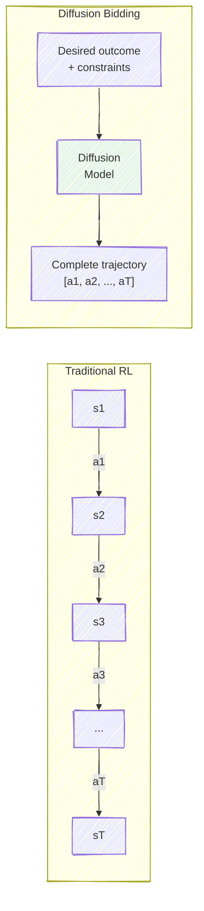
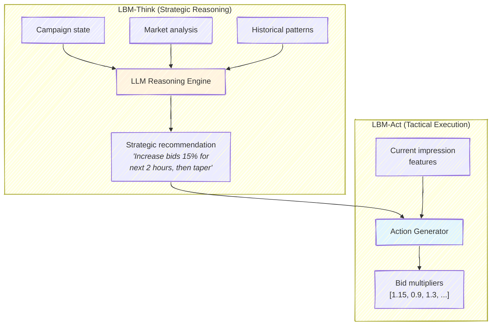
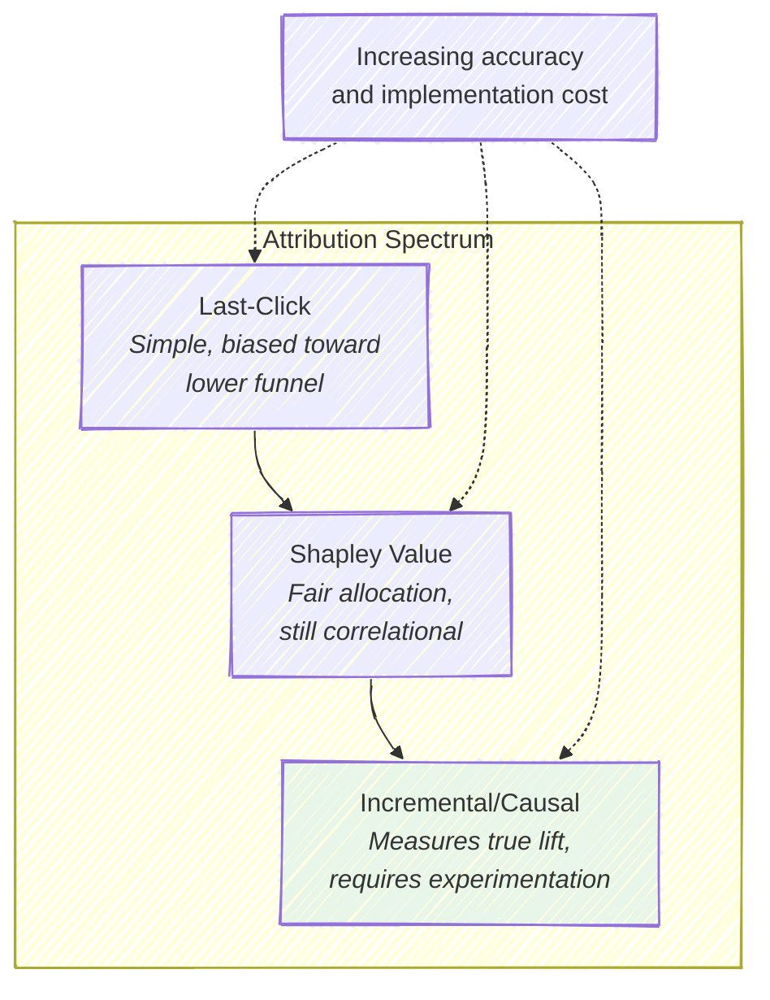
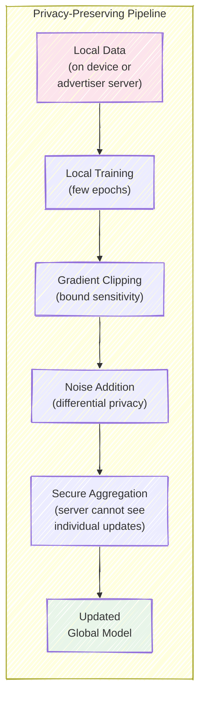
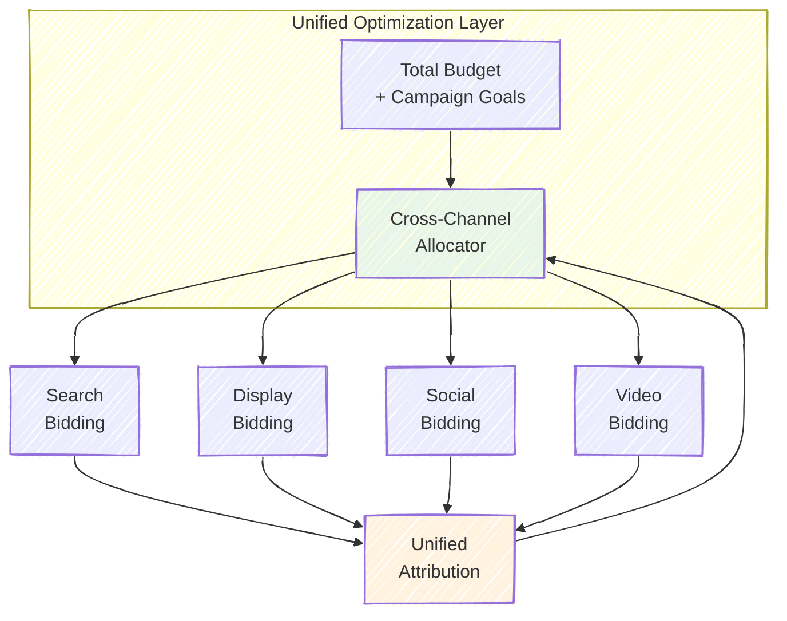

# Chapter 12: Advanced Topics and Research Frontiers

The field of automated bidding is evolving rapidly. Techniques that were considered speculative two years ago --- generative models for trajectory planning, large language models for strategic reasoning, federated learning for privacy preservation --- are now in production at major platforms or in advanced stages of deployment. This chapter surveys the most important research frontiers, providing enough depth on each topic to understand the core ideas and evaluate their relevance to production systems.

---

## 12.1 Generative Bidding: Diffusion Models for Trajectory Planning

### The Compounding Error Problem

Traditional RL for bidding treats the problem as a sequential Markov Decision Process: observe the state $s_t$, take action $a_t$, receive reward $r_t$, transition to $s_{t+1}$, and repeat. This formulation is elegant but suffers from a fundamental weakness over long horizons. Any error in the policy at step $t$ shifts the distribution of future states, causing the policy to encounter states it was not trained on. For a 24-hour campaign with thousands of bidding decisions, this compounding effect can be severe.

Formally, if the policy makes an error of magnitude $\epsilon$ at each step, the total accumulated error over a horizon of $T$ steps scales as $O(\epsilon T^2)$ under standard assumptions. For $T = 1000$ (a modest number of bidding decisions in a day), even small per-step errors compound dramatically.

### The Generative Alternative

Diffusion models offer a fundamentally different approach: instead of making decisions one at a time, generate the *entire bidding trajectory* at once. Given a conditioning signal --- the desired total conversions, budget, CPA target, and initial market conditions --- the model generates a complete sequence of bid multipliers $[a_1, a_2, \ldots, a_T]$ through iterative denoising.

The forward diffusion process gradually corrupts a clean trajectory $\mathbf{x}_0$ by adding Gaussian noise over $N$ steps:

$$q(\mathbf{x}_t | \mathbf{x}_{t-1}) = \mathcal{N}(\mathbf{x}_t; \sqrt{1 - \beta_t} \cdot \mathbf{x}_{t-1}, \beta_t \mathbf{I})$$

The reverse process learns to denoise, recovering the clean trajectory from noise:

$$p_\theta(\mathbf{x}_{t-1} | \mathbf{x}_t, \mathbf{c}) = \mathcal{N}(\mathbf{x}_{t-1}; \mu_\theta(\mathbf{x}_t, t, \mathbf{c}), \sigma_t^2 \mathbf{I})$$

where $\mathbf{c}$ is the conditioning vector containing the desired outcome and constraints. The model is trained to predict the noise $\epsilon_\theta(\mathbf{x}_t, t, \mathbf{c})$ that was added at each diffusion step, using a simple MSE loss:

$$\mathcal{L} = \mathbb{E}_{t, \mathbf{x}_0, \epsilon}\left[\|\epsilon - \epsilon_\theta(\mathbf{x}_t, t, \mathbf{c})\|^2\right]$$

### AIGB/DiffBid (Guo et al., KDD 2024)

The AI-Generated Bidding (AIGB) framework, developed at Alibaba, is the first production deployment of diffusion models for bidding. The system generates bid multiplier trajectories conditioned on the advertiser's desired GMV (gross merchandise value) and constraint parameters. Training data consists of historical campaign trajectories paired with their outcomes, allowing the model to learn the mapping from desired outcomes to the bidding strategies that achieve them.

The key innovation in AIGB is **return-conditioned generation**: by varying the conditioning signal at inference time, the system can generate trajectories optimized for different tradeoff points. Want more conversions at higher CPA? Condition on a higher return-to-go. Want strict CPA compliance? Condition on a conservative target. This provides a natural interface for advertisers to express preferences without modifying the model.

In production A/B tests at Alibaba, AIGB achieved a 2.81% increase in GMV and a 3.36% increase in ROI --- significant improvements at the scale of Alibaba's advertising marketplace, where even a 0.1% lift represents substantial revenue.

> **For the RL Engineer**: Diffusion models for decision-making are part of a broader trend in the RL community toward treating sequential decision-making as a *conditional generation* problem rather than a *dynamic programming* problem. Diffuser (Janner et al., 2022) and Decision Diffuser (Ajay et al., 2023) pioneered this approach in robotics and game domains. AIGB adapts these ideas to the specific structure of bidding problems.

### Limitations and Open Questions

Diffusion models for bidding are not without challenges. Inference is slower than a simple feedforward policy because it requires multiple denoising steps (typically 20--100). This is acceptable when generating a full-day trajectory (computed once, executed over hours) but prohibitive for per-impression decisions. The conditioning mechanism must be carefully designed to handle hard constraints (budget limits) rather than soft preferences. And the quality of the generated trajectories is bounded by the quality of the training data --- the model cannot discover strategies better than the best ones in the historical data unless combined with explicit optimization.

A practical concern is **trajectory replanning**. A trajectory generated at the start of the day assumes certain market conditions. If conditions change significantly (e.g., a competitor enters or exits), the system must decide whether to continue executing the current trajectory or regenerate a new one. AIGB addresses this by replanning at regular intervals (e.g., every hour) with updated conditioning signals, effectively using a receding-horizon approach. The cost of replanning --- both in compute and in the discontinuity introduced by switching trajectories --- is a design parameter that must be tuned.

> **Historical Note**: The application of diffusion models to sequential decision-making originated in the robotics community with Diffuser (Janner et al., ICML 2022). The key insight --- that trajectory optimization can be cast as conditional denoising --- transferred remarkably well to bidding because both domains share the structure of generating temporally extended plans under constraints. The AIGB authors explicitly cite Diffuser as their methodological inspiration.

---

## 12.2 LLM-Based Auto-Bidding

### The Case for Language Models in Bidding

At first glance, applying large language models to bidding seems absurd. Bidding requires fast numerical computation, not natural language understanding. But the motivation becomes clearer when you consider the *strategic* layer of bidding: interpreting advertiser goals, reasoning about market dynamics, adapting to novel campaign types, and explaining bidding decisions.

Consider a new advertiser launching a campaign for a product category the system has never seen. A traditional RL system would require weeks of data collection before it could learn effective bidding behavior. An LLM, having been trained on vast corpora that include advertising industry knowledge, marketing strategy, and economic reasoning, can potentially reason about the new situation from first principles.

### LBM: The Large Auto-Bidding Model (Li et al., 2026)

The most developed LLM-based bidding system is Alibaba's LBM (Large Bidding Model), which decomposes bidding into two modules:

**LBM-Think** is the strategic reasoning module. It processes campaign-level information --- budget utilization rate, current CPA vs. target, competitive intensity, time remaining --- and produces a natural language strategic recommendation. This module runs on a slow cadence (every 15--60 minutes) and can afford the latency of LLM inference.

**LBM-Act** translates the strategic recommendation into specific bid multipliers for each impression. This module must be fast, so it uses a lightweight model (not the full LLM) that is conditioned on the strategic recommendation. The key insight is that the LLM provides *guidance* to a fast tactical system rather than making individual bid decisions.

### Advantages and Challenges

The LLM-based approach offers several compelling advantages:

- **Few-shot adaptation**: New campaign types, novel advertiser goals, and unusual market conditions can be handled through the LLM's general reasoning capabilities, without waiting for task-specific training data.
- **Explainability**: The LLM's strategic recommendations are in natural language, making it possible to explain *why* the system chose a particular strategy. This is valuable for building advertiser trust.
- **Cross-domain transfer**: Knowledge about bidding strategies transfers across different advertising platforms, campaign types, and market conditions, because the LLM encodes this knowledge in its parameters.
- **Natural language interface**: Advertisers can express complex preferences ("I care more about brand awareness than immediate conversions" or "Be aggressive during the morning commute") that are difficult to encode as numerical constraints.

The challenges are equally significant:

- **Latency**: Even the fastest LLM inference (50--200 ms) is too slow for per-impression bidding decisions. The strategic/tactical decomposition is necessary, not optional.
- **Hallucination**: LLMs can produce confident but incorrect reasoning about market dynamics. For financial decisions, this is dangerous.
- **Cost**: Running LLM inference for billions of decisions is prohibitively expensive. Even at the strategic level, the cost per campaign per hour must be justified by the performance improvement.
- **Lack of formal guarantees**: Traditional optimization and RL methods can provide bounds on constraint satisfaction. LLMs offer no such guarantees.

> **Key Insight**: The most promising architecture for LLM-based bidding is *not* replacing the entire bidding stack with an LLM. It is using the LLM as a **meta-controller** that sets high-level strategy and parameters, while fast, well-understood systems handle real-time execution. This mirrors the human organization of most advertising teams: strategists set goals and budgets, while automated systems execute.

---

## 12.3 Offline RL and Sequence Modeling

### Decision Transformers for Bidding

The Decision Transformer (Chen et al., 2021) reframes RL as a sequence modeling problem. Instead of learning a value function or policy gradient, it trains an autoregressive transformer on sequences of (return-to-go, state, action) tuples:

$$\tau = (R_1, s_1, a_1, R_2, s_2, a_2, \ldots, R_T, s_T, a_T)$$

where $R_t = \sum_{k=t}^{T} r_k$ is the return-to-go (total future reward from step $t$). At test time, conditioning on a *high* return-to-go causes the model to generate the actions that historically led to high returns.

This approach is appealing for bidding because it naturally handles the **offline RL** setting: we have historical logs of bidding decisions and their outcomes, and we want to learn a better policy without further exploration. The Decision Transformer avoids the need for importance sampling corrections or conservative value estimation that plague standard offline RL methods.

For bidding specifically, the state includes budget remaining, time remaining, current CPA, win rate, and market conditions. The action is the bid multiplier. The return-to-go is the total future conversions (or value) from the current time step to the end of the campaign.

> **For the RL Engineer**: The Decision Transformer can be seen as a form of *upside-down RL* (Schmidhuber, 2019) applied to the transformer architecture. Instead of "what action maximizes future reward?", it answers "what action did agents take when they achieved this level of future reward?" This subtle reframing turns RL into supervised learning on filtered demonstrations.

### Conservative Methods: CQL and IQL

While Decision Transformers are elegant, more traditional offline RL methods remain important for bidding. Conservative Q-Learning (CQL) penalizes Q-values for out-of-distribution actions, preventing the policy from exploiting overestimated values in regions of the action space not well-covered by the data:

$$\mathcal{L}_\text{CQL} = \alpha \cdot \mathbb{E}_{s \sim \mathcal{D}}\left[\log \sum_a \exp(Q(s, a)) - \mathbb{E}_{a \sim \mathcal{D}}[Q(s, a)]\right] + \mathcal{L}_\text{TD}$$

The first term pushes down Q-values for all actions (via the logsumexp), while the second term pushes up Q-values for actions actually taken in the data. The net effect is that Q-values are conservative for unseen actions and accurate for observed ones.

Implicit Q-Learning (IQL) takes a different approach: it avoids querying the Q-function for out-of-distribution actions entirely by learning the value function using expectile regression. This is particularly well-suited to bidding because the action space (bid multipliers) is continuous, and standard CQL's logsumexp over actions requires sampling or discretization.

### TEE: Trajectory-wise Iterative RL

The TEE framework (Li et al., WWW 2024) combines ideas from both trajectory-based and value-based methods. Rather than generating a full trajectory at once (like diffusion models) or optimizing one step at a time (like standard RL), TEE performs *iterative refinement* of trajectories. Starting from an initial trajectory (which may come from a heuristic or a previous policy), the system makes small adjustments to each action in the trajectory, guided by a learned value function that evaluates trajectory quality.

The iteration proceeds as follows: (1) execute the current trajectory in a simulator, (2) compute the return and constraint violations, (3) use the gradient of the value function with respect to the actions to adjust the trajectory, (4) repeat. This is reminiscent of model predictive control (MPC) in robotics, where a trajectory is optimized, partially executed, then re-optimized from the new state.

TEE is particularly effective when the initial trajectory is already reasonable (e.g., from a production heuristic), because the iterative refinement needs only to make small adjustments rather than discover a good trajectory from scratch. This makes it a natural fit for production systems that already have working heuristics and want to improve incrementally.

---

## 12.4 Credit Assignment and Multi-Touch Attribution

### The Attribution Problem

A user's path to conversion typically involves multiple advertising touchpoints across days or weeks. They might see a display ad on a news site, watch a video ad on YouTube, click a search ad, see a retargeting ad on social media, and finally convert by visiting the advertiser's site directly. Which of these touchpoints *caused* the conversion? The answer to this question directly determines how much each impression is worth, which directly determines how much to bid.

| Attribution Model | Display Ad | Video Ad | Search Click | Retargeting Ad | Properties |
|-------------------|-----------|----------|-------------|---------------|------------|
| Last-click | 0% | 0% | 100% | 0% | Simple but ignores upper funnel |
| First-click | 100% | 0% | 0% | 0% | Credits awareness, ignores intent |
| Linear | 25% | 25% | 25% | 25% | Fair but ignores position effects |
| Time-decay | 10% | 15% | 35% | 40% | Favors recent touchpoints |
| Shapley value | 18% | 22% | 38% | 22% | Game-theoretically fair |

### Shapley Value Attribution

The Shapley value, from cooperative game theory, provides the unique attribution method that satisfies four desirable axioms: efficiency (credits sum to total value), symmetry (equal contributors receive equal credit), null player (non-contributors receive zero credit), and additivity. For a set of $n$ touchpoints, the Shapley value for touchpoint $i$ is:

$$\phi_i = \sum_{S \subseteq N \setminus \{i\}} \frac{|S|! \cdot (n - |S| - 1)!}{n!} \left[v(S \cup \{i\}) - v(S)\right]$$

where $v(S)$ is the conversion probability given only the touchpoints in set $S$. Computing this exactly requires evaluating $v$ on all $2^n$ subsets, which is tractable for the typical 3--8 touchpoints in a user journey but requires a well-calibrated conversion model.

The connection to bidding is direct. If last-click attribution says a display ad is worth \$0, the bidding system will never bid on display inventory. If Shapley attribution says the same display ad is worth \$30 (because it contributes to downstream search clicks that lead to conversions), the system will bid $\$30 \times p(\text{click}) \times p(\text{conversion}|\text{click})$. Getting attribution wrong means getting bids systematically wrong.

> **Key Insight**: Attribution is not just an analytics problem --- it is a *bidding input*. Companies that use simplistic attribution models (like last-click) systematically under-invest in upper-funnel channels (display, video) and over-invest in lower-funnel channels (search, retargeting). This creates arbitrage opportunities for advertisers with better attribution models.

### Causal Attribution

Shapley values tell you how to *allocate credit* among touchpoints, but they do not tell you whether the touchpoints actually *caused* the conversion. A user who saw a retargeting ad and then converted might have converted anyway. The *incremental* value of the ad --- the lift in conversion probability caused by the ad --- is what matters for bidding.

Measuring incrementality requires causal inference techniques:

- **Randomized holdout experiments**: Randomly withhold ads from a fraction of eligible users and compare conversion rates. The difference is the causal lift. This is the gold standard but is expensive (you forgo revenue from the holdout group).
- **Ghost bids**: Submit bids but do not show the ad if you win. Track conversions among users who *would have* seen the ad but did not. This avoids the cost of withholding ads but requires careful implementation.
- **Instrumental variable approaches**: Use exogenous variation in ad serving (e.g., auction-level randomness, budget depletion events) as instruments to estimate causal effects without deliberate experimentation.

The bid should be based on the *incremental* value of the impression, not the *total* value:

$$\text{bid} = \text{CPA}_{\text{target}} \times \left[ p(\text{conversion} \mid \text{ad shown}) - p(\text{conversion} \mid \text{no ad}) \right]$$

This is typically much lower than the naive bid based on $p(\text{conversion} | \text{ad shown})$ alone, because many users who see ads would have converted organically.

> **Industry Example**: Facebook (now Meta) published a landmark study in 2019 showing that for many large advertisers, 50--80% of conversions attributed to Facebook ads would have occurred even without the ad. This implies that naive conversion-based bidding dramatically over-values many impressions. Advertisers who shifted to incrementality-based bidding reduced their CPAs significantly while maintaining conversion volumes, because they stopped paying premium prices for users who would have converted anyway.

---

## 12.5 Privacy-Preserving Bidding

### The Privacy Landscape Shift

The advertising industry's ability to target and measure at the individual user level is undergoing a structural change. Apple's App Tracking Transparency (ATT) framework, introduced in iOS 14.5, requires explicit user consent for cross-app tracking. Google's Privacy Sandbox is replacing third-party cookies with privacy-preserving alternatives. Regulatory frameworks (GDPR, CCPA) impose strict limits on data collection and use.

The practical impact on bidding systems is dramatic. Before these changes, a bidding system could evaluate an impression using rich user-level features: browsing history, purchase history, app usage, demographic data, and cross-site behavior. After the changes, many of these signals are unavailable or aggregated:

| Signal Category | Pre-Privacy | Post-Privacy |
|----------------|-------------|-------------|
| Cross-site browsing | Full history available | Blocked or aggregated to cohorts |
| App usage | App list, usage time | Unavailable without consent |
| Demographics | Age, gender, income | Often unavailable |
| Purchase history | Cross-retailer data | First-party only |
| Device identifiers | IDFA, GAID, cookies | Requires consent; often denied |
| Available signals | User-level, rich | Contextual, aggregated |

### Contextual Targeting Renaissance

With user-level signals degraded, the industry has returned to contextual targeting --- predicting ad relevance from the *content* of the page rather than the *identity* of the user. Modern contextual targeting is far more sophisticated than keyword matching. NLP models analyze page content, sentiment, and topic to determine the advertising context. Computer vision models analyze images and video content on the page. The resulting contextual signals are privacy-safe because they describe the environment, not the user.

CTR models trained on contextual signals alone typically show 20--40% lower predictive accuracy compared to user-aware models. However, contextual signals are always available, require no consent, and face no regulatory risk. The bidding implication is that bids in a privacy-first world must be set with greater uncertainty, which argues for more conservative bidding and wider confidence intervals.

### Federated Learning for Bidding Models

Federated learning allows model training across distributed data sources without centralizing the raw data. In the advertising context, this means training CTR models across multiple advertisers (or across user devices) without any party sharing their raw data.

The canonical federated learning algorithm, FedAvg, works as follows:

1. A central server distributes the current model to participating clients.
2. Each client trains the model on its local data for several epochs.
3. Clients send model *updates* (gradients or weight deltas) back to the server.
4. The server aggregates the updates (typically by averaging) to produce an improved global model.
5. Repeat.

For bidding, the clients could be individual advertisers who train on their own conversion data, or they could be user devices that train on local browsing behavior. The server (the DSP or ad platform) receives aggregated model updates that improve prediction accuracy without ever seeing raw user data.

> **Industry Example**: Google's Protected Audiences API (formerly FLEDGE) moves the ad auction itself to the user's browser. Rather than sending user data to a DSP for bid computation, the browser runs a local auction using pre-registered bidding functions. This represents a fundamental architectural shift: the bidding logic must be small enough to run on-device, and the bidding system loses access to server-side features and real-time market signals.

### Differential Privacy

Even aggregated model updates can leak information about individual training examples. Differential privacy provides formal guarantees by adding calibrated noise to the model updates. A mechanism $\mathcal{M}$ is $(\epsilon, \delta)$-differentially private if for any two datasets $D$ and $D'$ differing in one example:

$$\Pr[\mathcal{M}(D) \in S] \leq e^\epsilon \cdot \Pr[\mathcal{M}(D') \in S] + \delta$$

In practice, this means clipping per-example gradients to bound their sensitivity and then adding Gaussian noise proportional to the sensitivity and inversely proportional to $\epsilon$. Lower $\epsilon$ provides stronger privacy but degrades model accuracy. The privacy-accuracy tradeoff is especially acute in advertising, where the marginal value of personalization is high and advertisers push for the lowest feasible $\epsilon$.

The interplay between privacy and bidding effectiveness creates a strategic landscape where companies with better first-party data (Amazon, Google, Meta) have a structural advantage. They can build accurate prediction models using consented first-party data, while smaller DSPs that relied on third-party cookies face significant model degradation. This concentration effect is one of the unintended consequences of privacy regulation in the advertising industry.

---

## 12.6 Fairness and Market Design

### Fairness in Automated Bidding

As automated bidding systems manage an increasing share of advertising spend, questions of fairness become unavoidable. Several dimensions of fairness are relevant:

**Advertiser fairness**: Do automated bidding systems favor large advertisers over small ones? Large advertisers have more historical data, which leads to better-trained models, which leads to better bidding performance, which generates more data. This positive feedback loop can create barriers to entry.

**Publisher fairness**: Do bidding algorithms allocate spend fairly across publishers? If bidding systems optimize purely for conversions, they may concentrate spend on a small number of high-performing publishers, starving long-tail publishers of revenue even when those publishers provide genuine advertising value (e.g., brand awareness).

**User fairness**: Do bidding algorithms expose different user demographics to different quantities or qualities of advertising? If CTR models predict higher engagement for certain demographic groups, those groups may be targeted more heavily, raising concerns about advertising saturation and information asymmetry.

### Auction Design Interactions

The design of the auction mechanism interacts with bidding algorithms in non-obvious ways. The industry's transition from second-price to first-price auctions (largely complete by 2020) changed the optimal bidding strategy and created the need for bid shading algorithms. Future mechanism design innovations could similarly reshape the bidding landscape:

- **Core-selecting auctions**: These mechanisms select prices in the core of the cooperative game defined by the auction, ensuring that no coalition of bidders and sellers can profitably deviate. They provide stronger stability guarantees than first-price auctions but are computationally more expensive.
- **Autobidding-aware mechanisms**: Conitzer et al. (2022) and others have studied mechanism design when the auctioneer knows that bidders use automated bidding systems. The optimal mechanism may differ from the classical Myerson auction because the auctioneer can design the mechanism to interact favorably with the bidding algorithms.
- **Information design**: How much information should the exchange reveal to bidders? Revealing more (e.g., competitor bid distributions) enables better bid shading but may reduce exchange revenue. This is an active area of research at the intersection of auction theory and information economics.

---

## 12.7 Cross-Channel and Full-Funnel Optimization

### The Multi-Channel Problem

Most large advertisers allocate budgets across multiple channels: search, display, social, video, connected TV, and retail media. Each channel has its own auction dynamics, targeting capabilities, and measurement systems. Traditional bidding optimizes each channel independently, but this ignores cross-channel interactions: a display ad that introduces a user to a brand increases the probability that the user will click a search ad for that brand later.

Full-funnel optimization requires:

1. **Unified measurement**: A single attribution model that spans all channels and assigns credit based on incremental impact, not channel-specific metrics.
2. **Cross-channel budget allocation**: An optimizer that distributes the total budget across channels to maximize overall conversions, accounting for diminishing returns within each channel and cross-channel synergies.
3. **Coordinated bidding**: Bidding strategies within each channel that are aware of the advertiser's presence in other channels. For example, if a user has already seen a video ad, the search bidding system should value that user's search impression more highly.

> **Industry Example**: Google's Performance Max and Meta's Advantage+ campaigns represent early attempts at cross-channel optimization. Both systems take a single advertiser goal and budget, then automatically allocate across available channels. However, neither system optimizes *across* platforms --- they only optimize across channels within their own ecosystem. True cross-platform optimization remains an open challenge.

---

## 12.8 Foundation Models for Advertising

### Pre-training on Advertising Data

The success of foundation models in NLP and vision has inspired researchers to ask whether a similar approach could work for advertising. The idea is to pre-train a large model on *all* available advertising data --- across campaigns, advertisers, verticals, and geographies --- and then fine-tune it for specific tasks (CTR prediction, bid optimization, budget allocation).

The potential advantages are significant. A foundation model could capture universal patterns in advertising (e.g., the relationship between ad frequency and fatigue, the effect of seasonality on different verticals, the dynamics of competitive bidding) that no single campaign's data could reveal. Fine-tuning on a specific campaign would then adapt these universal patterns to the local context, enabling faster cold-start and better sample efficiency.

The challenges are equally significant. Advertising data is heterogeneous (search is very different from display), highly proprietary (no company will share raw auction data), and evolving rapidly (today's patterns may not reflect tomorrow's market). Whether the foundation model paradigm transfers to this domain remains an open empirical question.

### AuctionNet Benchmark

Progress on foundation models for advertising requires standardized benchmarks. AuctionNet (Su et al., 2024) is the most ambitious attempt to date: it comprises 10 million ad opportunities and 500 million auction records from Alibaba's advertising platform. The benchmark defines standardized tasks for bid optimization, budget allocation, and market simulation, enabling fair comparison of different approaches.

> **Key Insight**: The advertising industry's data moat --- the fact that each platform's auction data is proprietary and incomparable --- is the primary bottleneck for foundation models. Unlike NLP, where massive public text corpora enabled GPT, there is no public dataset of comparable scale and diversity for advertising. AuctionNet is a step toward addressing this, but it represents a single platform's data.

---

## 12.9 Where the Field is Headed

Stepping back from individual techniques, several macro-trends are shaping the future of automated bidding:

**Convergence of bidding and creative.** Historically, creative (ad design, copywriting, targeting) and bidding (how much to pay) have been treated as separate problems with separate teams. Foundation models and generative AI are blurring this boundary. Systems like Google's Performance Max already jointly optimize creative selection and bid amount. As generative models improve, we may see systems that generate custom ad creative *for each impression* and set the bid based on the expected performance of that specific creative-audience combination.

**From per-impression to trajectory optimization.** The shift from "what should I bid on this impression?" to "what is the optimal bidding trajectory for this campaign?" is well underway. Diffusion models, Decision Transformers, and model predictive control all represent different approaches to trajectory-level optimization. The advantage is better long-horizon planning; the challenge is that trajectories must be replanned as conditions change, and the interaction between trajectory planning and real-time execution is complex.

**Increasing opacity and regulation.** As automated bidding systems become more sophisticated, they also become harder to audit and explain. Regulators are increasingly interested in how algorithmic bidding affects market competition, advertiser costs, and consumer welfare. The EU's Digital Markets Act and the US FTC's scrutiny of ad tech practices may eventually impose transparency requirements on bidding algorithms, which would favor interpretable approaches (heuristics, linear models) over black-box neural networks.

**Multi-agent equilibrium as a first-class concern.** Most bidding research treats competitors as part of the environment. But when all bidders use sophisticated algorithms, the system-level dynamics matter as much as individual agent performance. Research on autobidding equilibria (Balseiro et al., 2023), pacing games (Conitzer et al., 2022), and multi-agent RL for markets is increasingly important for understanding and designing stable advertising markets.

> **For the RL Engineer**: The multi-agent aspect of bidding is likely to become the dominant research challenge in the next few years. Current production systems largely ignore competitor modeling (treating competitors as a noisy, non-stationary environment). As competitors' algorithms become more sophisticated and reactive, this approximation will break down, and explicit multi-agent reasoning will become necessary.

---

## Exercises

### Conceptual

1. Why might diffusion models be better than traditional RL for long-horizon bidding (24-hour campaigns with thousands of decisions)? Under what circumstances would traditional RL still be preferred?

2. Explain the difference between Shapley value attribution and incremental (causal) attribution. Give an example where a touchpoint has a high Shapley value but low incremental value.

3. The transition from second-price to first-price auctions fundamentally changed optimal bidding strategy. What future auction mechanism changes could similarly disrupt current bidding approaches?

4. How does the loss of third-party cookies change the relative importance of contextual vs. behavioral features for CTR prediction? What new data sources might partially compensate?

5. An LLM-based bidding system produces the strategic recommendation: "Increase bids by 30% during evening hours because competitor X appears to be budget-constrained after 6 PM." How would you validate this recommendation before acting on it? What could go wrong?

6. Explain why Shapley value attribution satisfies the efficiency axiom (credits sum to total conversion value). Why is this property important for bidding?

### Research

7. Read the AIGB paper (Guo et al., KDD 2024). How does the model handle hard constraints (e.g., budget limits) during trajectory generation? What happens if the generated trajectory violates a constraint?

8. Design a federated learning system for training CTR models across multiple advertisers. What privacy guarantees would each advertiser require? How would you handle the heterogeneity of different advertisers' data distributions?

---

## Further Reading

- Guo, X. et al. (2024). "AIGB: Generative Auto-bidding via Conditional Diffusion Modeling." *KDD*. *arXiv:2405.16141*. Production diffusion models for bidding at Alibaba.
- Li, Y. et al. (2026). "LBM: A Large Auto-Bidding Model for Strategic and Tactical Bidding." *arXiv:2603.05134*. LLM-based bidding with think/act decomposition.
- Chen, L. et al. (2021). "Decision Transformer: Reinforcement Learning via Sequence Modeling." *NeurIPS*. The foundational work on treating RL as sequence modeling.
- Kumar, A. et al. (2020). "Conservative Q-Learning for Offline Reinforcement Learning." *NeurIPS*. CQL for safe offline RL.
- Li, Y. et al. (2024). "TEE: Trajectory-wise Iterative Reinforcement Learning Framework for Auto-Bidding." *WWW*. *arXiv:2402.15102*.
- Aggarwal, G. et al. (2024). "Auto-bidding and Auctions in Online Advertising: A Survey." *arXiv:2408.07685*. Comprehensive survey of the field.
- Su, Y. et al. (2024). "AuctionNet: A Novel Benchmark for Decision-Making in Large-Scale Games." *arXiv:2412.10798*.
- Conitzer, V. et al. (2022). "Pacing Equilibrium in First-Price Auction Markets." *Management Science*. Mechanism design for autobidding.
- Janner, M. et al. (2022). "Planning with Diffusion for Flexible Behavior Synthesis." *ICML*. The Diffuser paper that inspired AIGB.
