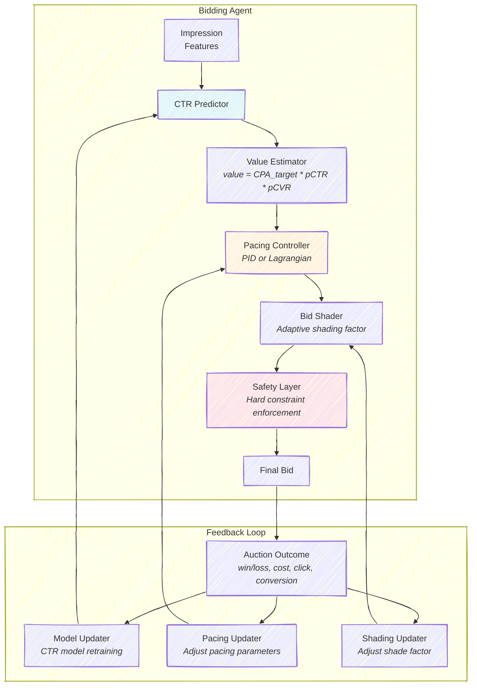

# Chapter 13: Capstone Project -- Build a Complete Bidding Agent

This chapter is not a tutorial to follow step by step. It is a project specification. Your task is to design, implement, and evaluate a complete automated bidding agent that integrates the core concepts from the preceding chapters: CTR prediction, bid valuation, budget pacing, bid shading, and safety constraints. You will make architectural decisions, encounter tradeoffs, debug subtle interactions between components, and evaluate your system against meaningful baselines --- much as you would when building a production bidding system.

The capstone is designed to take 20--40 hours of focused work. You may complete it over one to two weeks. The result should be a system you can demonstrate, a set of experimental results you can interpret, and a written analysis of what worked, what did not, and why.

---

## 13.1 Project Goals

Your bidding agent will compete in a simulated RTB environment, managing a single advertising campaign over a 24-hour period. The campaign has a fixed daily budget, a target CPA, and access to a stream of impression opportunities with varying user segments, ad categories, publishers, and time-of-day characteristics. Competing bidders follow a mix of strategies ranging from simple heuristics to moderately sophisticated adaptive algorithms.

Your agent must accomplish four objectives simultaneously:

1. **Spend the budget effectively.** Achieve at least 90% budget utilization without exhausting the budget before the campaign ends. Pacing should be smooth across the day, not concentrated in bursts.

2. **Respect the CPA constraint.** The realized CPA should be within 20% of the target. This is a hard constraint in the evaluation rubric --- a system that maximizes conversions but blows the CPA constraint by 50% is considered a failure.

3. **Maximize conversions.** Subject to the budget and CPA constraints, acquire as many conversions as possible. This is the primary optimization objective.

4. **Demonstrate adaptability.** The evaluation includes scenarios with non-stationary market conditions (e.g., a competitor entering or exiting mid-day, a traffic spike, a sudden shift in conversion rates). Your agent should handle these gracefully without manual intervention.

> **For the RL Engineer**: This project is deliberately scoped to be achievable without deep RL. A well-tuned PID controller with a good CTR model can score in the top tier. RL-based approaches (DQN, TD3, Decision Transformer) are optional extensions that should improve performance but are not required for a passing grade. The emphasis is on system design and integration, not algorithmic novelty.

---

## 13.2 System Architecture

Your system should be organized into distinct, modular components that communicate through well-defined interfaces. The following architecture is recommended but not mandatory --- you may deviate from it if you have a clear rationale.



### Component Interfaces

Each component should expose a clean interface. The following signatures are suggestions --- adapt them to your implementation language and style, but preserve the separation of concerns.

**CTR Predictor**: Takes impression features (user segment, ad category, publisher, hour) and returns a predicted click-through rate.

```python
def predict_ctr(self, features: dict) -> float:
    """Return predicted CTR in [0, 1]."""
```

**Value Estimator**: Combines CTR prediction with conversion rate estimates and the CPA target to produce an impression value.

```python
def estimate_value(self, pctr: float, pcvr: float) -> float:
    """Return estimated impression value in bid currency."""
```

**Pacing Controller**: Takes the current campaign state (remaining budget, remaining time, spending rate) and returns a pacing multiplier that scales the bid up or down.

```python
def get_pacing_multiplier(self, state: dict) -> float:
    """Return multiplier in [0.1, 3.0] based on budget pacing."""
```

**Bid Shader**: Adjusts the bid downward from the estimated value to create surplus (the difference between what you pay and what the impression is worth to you). The shading factor should adapt based on observed win rates.

```python
def shade_bid(self, value: float, win_rate: float) -> float:
    """Return shaded bid <= value."""
```

**Safety Layer**: Applies hard constraints to the final bid. This should never be bypassed.

```python
def enforce_safety(self, bid: float, state: dict) -> float:
    """Return constrained bid satisfying all safety rules."""
```

> **Key Insight**: The order of operations matters. Pacing is applied *before* shading, because pacing adjusts the target spending rate (a strategic decision) while shading adjusts the bid-to-value ratio (a tactical decision). The safety layer is always last, because it enforces hard constraints that override everything else.

---

## 13.3 Evaluation Environment

Your agent will be evaluated in a simulated auction environment with the following characteristics:

| Parameter | Value |
|-----------|-------|
| Campaign duration | 24 hours |
| Daily budget | \$5,000 |
| Target CPA | \$40 |
| Impressions per day | ~300,000--500,000 (varies by traffic pattern) |
| User segments | 5 |
| Ad categories | 3 |
| Publishers | 10 |
| Competitors | 4 (with varied strategies) |
| Auction type | First-price |
| True CTR range | 0.1%--1.0% (varies by segment and publisher) |
| True CVR | 3%--5% (post-click) |

The environment provides realistic features including hourly traffic variation (peaks at 10 AM and 8 PM), competitor bids drawn from log-normal distributions scaled by impression quality, and stochastic click and conversion outcomes.

You should implement or obtain an auction simulator that captures these dynamics. Options include building one from the specifications above, adapting AuctionGym (Amazon), or using the AuctionNet benchmark (Alibaba). If you build your own, ensure it includes at least: traffic variation by hour, heterogeneous competitors, censored feedback (you only observe market prices when you win), and stochastic conversion outcomes.

### Traffic Patterns

The simulated traffic follows a realistic diurnal pattern with two peaks: a morning peak around 10 AM and an evening peak around 8 PM. The traffic multiplier at hour $h$ can be modeled as:

$$m(h) = 0.3 + 0.7 \cdot \max\left(\exp\left(-\frac{(h-10)^2}{18}\right), \exp\left(-\frac{(h-20)^2}{8}\right)\right)$$

This means that impressions are roughly 3x more plentiful during peak hours than during off-hours (e.g., 3--6 AM). Your pacing controller must account for this: if it paces uniformly by the clock, it will underspend during peak hours (when inventory is abundant and potentially cheaper per conversion) and overspend during off-hours.

### Competitor Behavior

The four competitors use distinct strategies:

| Competitor | Strategy | Behavior |
|-----------|----------|----------|
| Conservative | Fixed low multiplier (0.5x) | Bids cautiously, wins only cheap impressions |
| Aggressive | Fixed high multiplier (1.5x) | Bids high, often wins but overpays |
| Adaptive | Win-rate targeting | Adjusts bids to maintain a 20% win rate |
| Random | Noisy value-based | Bids near estimated value with high variance |

Understanding competitor behavior is not required for a passing grade, but modeling it (even crudely) can improve your agent's bid shading. If you observe that you are frequently winning against certain competitors and losing to others, you can adjust your shading factor for different impression segments.

### Evaluation Scenarios

Your agent will be tested under four scenarios:

1. **Baseline**: Stationary market conditions for the full 24 hours. This tests basic functionality.
2. **Budget pressure**: The budget is reduced to \$3,000, forcing tighter pacing and more selective bidding.
3. **Competitor shock**: A new aggressive competitor enters at hour 12, roughly doubling average market prices for the remainder of the day.
4. **Conversion rate shift**: The true conversion rate drops by 50% at hour 8 (simulating a landing page issue or audience drift).

Your analysis should discuss your agent's behavior in each scenario, including any failures and their causes.

Note that scenarios 3 and 4 are the most informative about your system's quality. Many bidding agents can perform adequately in stationary conditions, but the shock scenarios reveal whether your pacing and safety mechanisms are robust. A well-designed agent should detect the shock within 1--2 hours (through degraded win rates, rising CPA, or accelerated spending) and adapt its behavior accordingly. An agent that continues bidding as if nothing changed will either exhaust its budget prematurely (in the competitor shock scenario) or accumulate excessive CPA (in the conversion rate shift scenario).

---

## 13.4 Implementation Milestones

The project is structured into five milestones. Each builds on the previous one, and each is independently valuable. The Gantt chart below shows a suggested timeline for a two-week implementation period.

```mermaid
%%{init: {"look": "handDrawn"}}%%
gantt
    title Capstone Project Timeline
    dateFormat  X
    axisFormat Day %s
    
    section Milestone 1
    Environment setup & baselines     :m1, 1, 2d
    
    section Milestone 2
    CTR model training                :m2, after m1, 2d
    
    section Milestone 3
    Pacing & bid shading              :m3, after m2, 3d
    
    section Milestone 4
    Integration & safety              :m4, after m3, 2d
    
    section Milestone 5
    Evaluation & writeup              :m5, after m4, 3d
```



### Milestone 1: Environment and Baselines (Days 1--2)

Set up the auction simulation environment and implement two baseline agents:

- **Random bidder**: Bids a random amount uniformly distributed between \$0.01 and the estimated impression value. This is the lower bound.
- **Fixed-multiplier bidder**: Bids a fixed fraction (e.g., 0.7x) of the estimated impression value with uniform pacing (spend $B/T$ per hour). This is the "reasonable heuristic" baseline.

Run both baselines for 20 episodes and record key metrics: total conversions, CPA, budget utilization, and win rate. These numbers are your benchmarks.

**Deliverable**: Working simulation environment and baseline results.

### Milestone 2: CTR Prediction (Days 3--4)

Implement a CTR model that learns from observed auction outcomes. Your model should:

- Use embedding layers for categorical features (user segment, ad category, publisher, hour).
- Train online from observed click/no-click labels (only available for won impressions).
- Maintain reasonable calibration: predicted CTR should be within 20% of observed CTR on average.

Evaluate your CTR model by comparing a bidder that uses your model's predictions against one that uses a fixed CTR estimate. The model-based bidder should achieve better CPA control because it can bid high on valuable impressions and low on poor ones.

**Deliverable**: Trained CTR model with calibration analysis.

### Milestone 3: Budget Pacing and Bid Shading (Days 5--7)

Implement at least one pacing mechanism and an adaptive bid shading strategy:

**Pacing options** (implement at least one):
- **PID controller**: Track the error between target hourly spend and actual hourly spend. Use proportional, integral, and derivative terms to adjust a pacing multiplier. Tune the gains $K_p$, $K_i$, $K_d$ experimentally.
- **Lagrangian pacing**: Maintain a dual variable $\lambda$ for the budget constraint. Update $\lambda$ based on the constraint violation: $\lambda_{t+1} = \max(0, \lambda_t + \eta \cdot (\text{spend}_t - \text{target}_t))$. The paced bid is $\text{value} / (1 + \lambda)$.

**Bid shading**: Track your recent win rate over a sliding window. If the win rate exceeds your target (e.g., 15%), reduce the shading factor (bid lower). If the win rate is below target, increase the shading factor (bid closer to value). The shading factor should be bounded, e.g., in $[0.3, 0.95]$.

**Deliverable**: Agent with pacing and shading. Demonstrate smooth budget utilization curves across the day.

### Milestone 4: Integration and Safety (Days 8--9)

Integrate all components into a single bidding agent and add the safety layer:

- Maximum bid multiplier: no bid exceeds 5x the estimated value.
- Budget cap: no single bid exceeds 0.5% of remaining budget.
- CPA brake: if running CPA exceeds 120% of target, reduce all bids by 50%.
- Remaining budget hard cap: no bid exceeds remaining budget.

Test the integrated agent on all four evaluation scenarios. Debug interactions between components --- for example, the pacing controller may fight with the CPA brake if both are active simultaneously. Resolve these conflicts by defining a clear priority hierarchy.

**Deliverable**: Integrated agent that passes all safety constraints. Results on all four scenarios.

### Milestone 5: Evaluation and Analysis (Days 10--12)

Run your final agent for 20 episodes on each of the four scenarios (80 total episodes). Compute the following metrics for each scenario:

| Metric | How to Compute | Target |
|--------|----------------|--------|
| Conversions | Total conversions per episode | Maximize |
| CPA | Total cost / total conversions | Within 20% of target |
| Budget utilization | Total cost / budget | > 90% |
| Pacing smoothness | Std dev of hourly spend / mean hourly spend | < 0.5 |
| Win rate | Wins / total impressions | 10--25% (reasonable range) |

Write an analysis (2--4 pages) covering:

1. **Results summary**: Table of metrics across scenarios, with mean and standard deviation.
2. **Component contributions**: Ablation study showing the effect of each component. What happens if you remove the CTR model and use a fixed estimate? What if you remove pacing? What if you remove shading?
3. **Failure analysis**: For each scenario, identify where your agent struggled and why. What would you change if you had more time?
4. **Comparison to baselines**: Quantify the improvement over the random and fixed-multiplier baselines.

**Deliverable**: Experimental results, ablation study, and written analysis.

### Guidance on the Ablation Study

The ablation study is one of the most valuable parts of the project because it reveals how much each component contributes to overall performance. The recommended ablation structure is:

| Variant | CTR Model | Pacing | Shading | Safety | Purpose |
|---------|-----------|--------|---------|--------|---------|
| Full agent | Yes | Yes | Yes | Yes | Your best system |
| No CTR model | Fixed estimate | Yes | Yes | Yes | Isolate CTR model value |
| No pacing | Yes | Uniform spend | Yes | Yes | Isolate pacing value |
| No shading | Yes | Yes | Bid = value | Yes | Isolate shading value |
| No safety | Yes | Yes | Yes | No | Measure safety layer impact |
| Baseline | Fixed estimate | Uniform | Fixed | No | Lower bound |

For each variant, run 20 episodes on the baseline scenario and report mean and standard deviation of all five metrics. Present the results in a table and discuss which components had the largest impact. Common findings include:

- The CTR model matters most for CPA control (bidding different amounts for different impression qualities).
- Pacing matters most for budget utilization (spending the budget smoothly over 24 hours).
- Shading matters most for surplus (paying less than the estimated value for won impressions).
- The safety layer rarely fires in the baseline scenario but is critical in shock scenarios.

> **Key Insight**: If your ablation shows that removing a component has little effect, there are two possible explanations: the component is not contributing, or the other components are compensating. Distinguish between these by examining the component's internal behavior (e.g., is the pacing multiplier always near 1.0? Is the safety layer never triggered?).

---

## 13.5 Evaluation Rubric

| Component | Weight | Criteria |
|-----------|--------|----------|
| **CTR Model** | 20% | Predictions are calibrated (within 20% of observed CTR). Model improves over fixed estimates. Online learning from auction feedback. |
| **Bid Valuation** | 15% | Correct formula: value = CPA target x pCTR x pCVR. Proper handling of edge cases (very low CTR, missing features). |
| **Budget Pacing** | 25% | Budget utilization > 90%. No early depletion. Smooth spending curve. Adapts to changing conditions. |
| **Bid Shading** | 15% | Adaptive shading based on win rate. Positive surplus (average cost < average value for won impressions). |
| **Safety Layer** | 10% | All hard constraints always satisfied. CPA within 20% of target. No catastrophic bids. |
| **Analysis** | 15% | Clear experimental methodology. Ablation study. Honest failure analysis. Comparison to baselines. |

**Grading thresholds:**

- **Excellent (90--100%)**: Agent achieves top-quartile conversions while meeting CPA and budget constraints across all scenarios. Analysis includes insightful ablation and failure discussion.
- **Good (75--89%)**: Agent meets constraints in most scenarios, with clear explanations for failures. All components are functional.
- **Satisfactory (60--74%)**: Agent works in the baseline scenario but struggles with shocks. Most components are implemented but may have integration issues.
- **Needs improvement (< 60%)**: Agent does not reliably meet CPA or budget constraints. Missing components or no analysis.

---

## 13.6 Optional Extensions

If you complete the core project ahead of schedule, consider these extensions. Each adds genuine complexity and learning value.

### Extension A: RL-Based Bid Optimization

Replace the PID/Lagrangian pacing with a trained RL agent (DQN, TD3, or PPO) that outputs the bid multiplier. The state space includes remaining budget fraction, remaining time fraction, current CPA ratio, recent win rate, and traffic pattern features. The reward should balance conversions with constraint satisfaction:

$$r_t = \mathbb{1}[\text{conversion}] \cdot \text{CPA}_{\text{target}} - \alpha \cdot \text{cost}_t - \beta \cdot \max(0, \text{CPA}_t - \text{CPA}_{\text{target}})$$

Compare the RL agent's performance against your PID/Lagrangian baseline. Document the training process: how many episodes were needed, what hyperparameters were sensitive, and whether the RL agent's behavior is interpretable.

### Extension B: Multi-Campaign Portfolio

Extend your agent to manage 5 campaigns simultaneously with a shared advertiser-level budget. Each campaign has its own CPA target and impression stream. The agent must allocate the shared budget across campaigns and set bids for each. This requires a hierarchical architecture: a portfolio-level allocator and campaign-level bidders.

### Extension C: Real Data Evaluation

Evaluate your agent on real auction data using one of:

- **iPinYou dataset**: Real RTB bid request logs with features, bid prices, and click/conversion labels. Train your CTR model on real features and replay historical auctions.
- **AuctionGym** (Amazon): A more realistic simulation environment with pre-calibrated market dynamics.
- **AuctionNet** (Alibaba): Large-scale benchmark with 10M opportunities and 500M auction records.

### Extension D: Decision Transformer

Implement a Decision Transformer that generates bidding trajectories conditioned on desired returns. Train it on trajectories collected by your other agents (PID, RL, etc.) and evaluate whether it can match or exceed the best source policy.

### Extension E: Interpretability Analysis

For any of the above extensions, add an interpretability layer. For RL agents, visualize the learned Q-values as a function of state variables (e.g., how does the Q-value change as remaining budget decreases?). For PID controllers, plot the proportional, integral, and derivative components over time to show which term dominates at different stages of the campaign. For the Decision Transformer, analyze which conditioning values (return-to-go) produce which bidding behaviors. The goal is to build intuition about *why* the agent makes the decisions it makes, not just what those decisions are.

> **For the RL Engineer**: If you implement the RL extension, you will likely find that the hardest part is not training the agent but *understanding* what it learned. Plotting the agent's bid as a function of two state variables (e.g., remaining budget and remaining time) at fixed values of the other variables produces a "policy surface" that reveals the agent's strategy. Compare this surface to the theoretical optimal under simplified assumptions (e.g., the Lagrangian solution from Chapter 9) to identify where the RL agent has learned something non-trivial and where it may be making errors.

---

## 13.7 Common Pitfalls

Based on past iterations of this project, these are the most frequent mistakes and how to avoid them:

**Pitfall 1: The CTR model never converges.** If your CTR model trains only on won impressions and you are winning a very skewed subset of the impression population, the model may learn a biased view of CTR. Mitigation: ensure your exploration is broad enough (especially in early hours) to train on diverse impressions. A warm-start period where you bid randomly for the first 1--2 hours can help.

**Pitfall 2: PID oscillation.** A PID controller with poorly tuned gains will oscillate between overspending and underspending, sometimes violently. The integral term is the usual culprit: if it accumulates too much error during a period of underspending, it will cause a spending spike when inventory becomes available. Mitigation: use integral windup prevention (clamp the integral term) and start with conservative gains ($K_p = 0.3$, $K_i = 0.05$, $K_d = 0.02$).

**Pitfall 3: The shading factor and pacing multiplier fight each other.** If the pacing controller increases the bid to spend faster, and the shading module simultaneously decreases the bid because the win rate is too high, the two modules can enter a feedback loop. Mitigation: update pacing and shading on different timescales (pacing hourly, shading every 100 impressions), or combine them into a single multiplier.

**Pitfall 4: Safety layer triggers too often.** If the CPA brake fires on 30%+ of impressions, it is dominating the bidding behavior and the upstream components are not doing their job. This usually means the CTR model is miscalibrated (predicting too-high CTRs, leading to overbidding). Mitigation: fix the root cause (recalibrate the CTR model) rather than tuning the safety threshold.

**Pitfall 5: Budget exhaustion in shock scenarios.** When a competitor enters at hour 12 and doubles market prices, your agent may continue bidding at the pre-shock level and quickly exhaust its budget. The pacing controller should detect that spend per hour has increased and reduce the pacing multiplier. If it does not respond fast enough, this is a tuning problem. Mitigation: make the PID proportional gain large enough to respond within 1--2 hours.

---

## 13.8 Getting Started Checklist

Before writing any bidding logic, ensure you have:

- [ ] A working auction simulation that generates realistic impressions and competitor bids
- [ ] A data logging system that records every auction's features, bid, outcome, and cost
- [ ] A metric computation module that calculates conversions, CPA, budget utilization, and win rate
- [ ] Baseline agents (random and fixed-multiplier) with benchmark numbers
- [ ] A visualization for budget spend curves over the 24-hour period

With this infrastructure in place, you can iterate on your bidding agent quickly and evaluate changes rigorously.

One additional recommendation: build a **replay capability** from the start. Log every auction's complete information (features, your bid, competitor bids, outcome, cost) to a file. This allows you to replay a specific episode to debug unexpected behavior, and it provides the training data needed if you later implement the RL or Decision Transformer extensions.

> **Key Insight**: The most common failure mode in this project is not a bad algorithm --- it is a bug in the evaluation pipeline. If your metric computation is wrong, you will optimize for the wrong objective. Validate your metrics by hand on a few episodes before trusting them at scale. In particular, verify that your CPA computation correctly handles episodes with zero conversions (avoid division by zero) and that your budget utilization accounts for the full budget, not just the amount allocated to won auctions.

---

## 13.9 Suggested Visualizations

Effective analysis relies on good visualizations. At minimum, your writeup should include:

**Budget spend curve.** A line plot showing cumulative spend over the 24-hour period, with the ideal uniform pacing line for reference. For each scenario, overlay your agent's actual spend curve against the ideal. This immediately reveals pacing problems: early budget exhaustion appears as a curve that shoots up and plateaus, while underspending appears as a curve that stays below the ideal.

**Hourly metrics dashboard.** A multi-panel figure showing, for each hour: (1) number of impressions seen, (2) number of auctions won, (3) spend, (4) conversions, and (5) running CPA. This reveals temporal patterns in your agent's behavior and shows how it responds to traffic variation and shock events.

**CTR calibration plot.** A reliability diagram (calibration curve) showing predicted CTR vs. observed CTR, binned into 10 buckets. A perfectly calibrated model follows the diagonal. This should improve over the course of the campaign as the model trains on more data; consider showing separate calibration curves for hours 1--6, 7--12, and 13--24.

**Ablation comparison.** A grouped bar chart showing each metric (conversions, CPA, budget utilization) for each ablation variant. This makes component contributions immediately visible.

---

## 13.10 Closing Remarks

This capstone integrates every major topic from the preceding chapters: auction mechanics, CTR prediction, value estimation, budget pacing, bid shading, constrained optimization, and system safety. The challenges you will encounter --- calibration drift, pacing oscillation, the tension between exploration and constraint satisfaction, the difficulty of evaluating under non-stationarity --- are the same challenges that engineers at Google, Meta, Alibaba, and Amazon face daily.

The difference between a textbook exercise and a real bidding system is scale, not concept. The PID controller you implement here uses the same mathematical formulation as the one pacing billions of dollars in Google Smart Bidding. The safety layer you build follows the same principles as the one protecting advertiser budgets at Meta. If you can build a system that reliably meets its constraints in a simulated environment, you have the foundational understanding needed to contribute to production systems at any scale.

Build something you can explain and defend. The best bidding systems are not the most complex --- they are the ones whose operators understand every decision the system makes and can predict how it will behave when conditions change.

When you finish this project, you will have built --- from scratch --- a system that embodies the core principles of every production bidding system in the industry. The scale is different, but the thinking is the same.

---

## Resources

- **AuctionGym**: https://github.com/amazon-science/auction-gym --- Amazon's open-source auction simulation environment with pre-calibrated market dynamics and example bidding agents.
- **AuctionNet**: Su et al. (2024), *arXiv:2412.10798* --- Alibaba's large-scale benchmark with 10M ad opportunities and 500M auction records.
- **iPinYou Dataset**: Zhang et al. (2014) --- Real RTB bid request logs with features, bid prices, and click/conversion labels. Available via https://github.com/wnzhang/make-ipinyou-data.
- **NeurIPS Auto-Bidding Competition** (2024) --- Competition framework with standardized evaluation and comparison against other participants' agents.
- **Aggarwal et al. (2024)** --- "Auto-bidding and Auctions in Online Advertising: A Survey." *arXiv:2408.07685*. Comprehensive survey covering the algorithmic foundations referenced throughout this textbook.
- **Balseiro & Gur (2019)** --- "Learning in Repeated Auctions with Budgets." *Management Science*. Theoretical foundations for budget-constrained bidding that underpin the pacing algorithms in Milestone 3.
