# ML and RL for Bidding and Allocation in Online Advertising

### By Nima Rafiee

---

# Preface

Every second, across billions of screens worldwide, a quiet but consequential competition unfolds. A user loads a webpage, an ad slot becomes available, and within the span of a single heartbeat -- roughly 100 milliseconds -- dozens of algorithms evaluate the opportunity, compute a bid, and one emerges as the winner. The winning ad appears on the screen. The user may click; they may not. Either way, money changes hands, data is logged, and the system learns.

This is real-time bidding, and it represents one of the largest-scale applications of machine learning and decision-making under uncertainty in the world today. The global digital advertising market exceeds $600 billion annually. The infrastructure that allocates this spending processes millions of auctions per second, each one a small optimization problem demanding predictions, strategic reasoning, and real-time control. It is, in short, a playground for the technically ambitious.

This book is written for you -- the ML or RL engineer who has been asked to bring your skills to the bidding and allocation side of advertising technology. You understand stochastic gradient descent, Markov decision processes, and policy gradient methods, but terms like "DSP," "RTB," and "GSP auction" are new to you. You have deep technical foundations and zero ad-tech context. This book bridges that gap.

## What Makes Ad Tech Unique for ML/RL Engineers

The advertising ecosystem is unusual among ML application domains for several reasons that make it particularly rewarding:

**Scale and speed.** A major demand-side platform (DSP) like The Trade Desk or Google's DV360 may evaluate hundreds of thousands of bid requests per second. Each decision must be made in under 50 milliseconds. This is not batch inference -- it is real-time prediction and decision-making at a scale that few other domains demand.

**Sequential decision-making under constraints.** An advertiser has a daily budget of, say, $10,000 and a goal to maximize conversions. How should that budget be spread across the day's auctions? Spend too fast and you exhaust the budget by noon, missing valuable evening impressions. Spend too slowly and you leave money on the table. This is a textbook reinforcement learning problem -- literally.

**Strategic interaction.** Your bidding algorithm does not operate in isolation. It competes against other algorithms in auctions, creating a multi-agent game-theoretic environment. Your optimal strategy depends on what others do, and what others do depends on you.

**Rich prediction problems.** Predicting whether a user will click an ad (CTR prediction) is one of the most studied problems in industrial ML. It combines sparse categorical features, sequential user behavior, contextual signals, and extreme class imbalance -- all at massive scale.

**Direct economic feedback.** Unlike many ML applications where the loss function is a proxy, in ad tech the model's predictions directly determine how much real money is spent. A 1% improvement in bid efficiency can translate to millions of dollars saved or earned.

> **For the RL Engineer**: If you have worked on robotics, game-playing agents, or recommendation systems, you will find that bidding shares deep structural similarities. A bidding agent observes a state (the bid request, budget remaining, time of day), takes an action (the bid amount), receives a reward (a click or conversion, minus the cost), and transitions to a new state. The key complications are partial observability (you only see outcomes for auctions you win), non-stationarity (competitors change their strategies), and hard constraints (budgets, ROI targets).

## How This Book Is Organized

The book is structured as a two-week intensive curriculum, with each chapter designed for a single day of focused study. The first week builds foundational knowledge of the advertising ecosystem, auction theory, and the core ML problems. The second week applies RL and advanced ML to bidding and allocation, culminating in production system design and research frontiers.

### Week 1: Foundations

| Day | Chapter | Topic | Hours |
|-----|---------|-------|-------|
| 1 | Ch 1 | The Online Advertising Ecosystem | 3--4 |
| 2 | Ch 2 | Auction Theory Foundations | 4--5 |
| 3 | Ch 3 | How Real-Time Bidding Works | 3--4 |
| 4 | Ch 4 | CTR Prediction: The Core ML Problem | 4--5 |
| 5 | Ch 5 | Bid Optimization and Pricing Models | 3--4 |
| 6 | Ch 6 | Deep Learning for User Response Prediction | 4--5 |
| 7 | -- | Review, Exercises, and iPinYou Dataset Lab | 4--6 |

### Week 2: ML/RL for Bidding

| Day | Chapter | Topic | Hours |
|-----|---------|-------|-------|
| 8 | Ch 7 | Formulating Bidding as an RL Problem | 4--5 |
| 9 | Ch 8 | RL Algorithms for Bidding | 4--5 |
| 10 | Ch 9 | Budget Pacing and Constrained Optimization | 3--4 |
| 11 | Ch 10 | Multi-Agent Bidding and Auction Design | 4--5 |
| 12 | Ch 11 | Production Systems: From Research to Deployment | 3--4 |
| 13 | Ch 12 | Advanced Topics and Research Frontiers | 4--5 |
| 14 | -- | Capstone Project: Build a Bidding Agent | 6--8 |

The progression is deliberate. Chapters 1--3 teach you the language and mechanics of the industry so that you can have a conversation with ad-tech colleagues. Chapters 4--6 develop the core ML models that underpin every bidding system. Chapters 7--10 are where your RL expertise becomes central -- formulating bidding as sequential decision-making and solving it. Chapters 11--12 connect everything to production reality and the research frontier.

## Conventions Used in This Book

Throughout the text, you will encounter several recurring elements:

**Mathematical notation** uses standard conventions. We write $v_i$ for bidder $i$'s valuation, $b_i$ for their bid, $F(\cdot)$ for cumulative distribution functions, and use boldface for vectors. Display equations are numbered when referenced later.

**Exercises** appear at the end of each chapter and are primarily conceptual -- thought experiments, derivations, and analytical problems. A smaller number involve implementation, but these are always supplementary to the main ideas.

**Callout boxes** highlight material that deserves special attention:

> **Key Insight**: These highlight non-obvious takeaways -- the kind of thing a senior engineer would tell you over coffee.

> **Industry Example**: These ground the theory in real systems at Google, Meta, Alibaba, The Trade Desk, and others.

> **For the RL Engineer**: These explicitly bridge ad-tech concepts to your existing ML/RL knowledge.

> **Historical Note**: These provide context for why the industry works the way it does.

**Diagrams** use the Mermaid format for flowcharts, sequence diagrams, and architecture diagrams, which render natively in GitHub, VS Code, and Obsidian.

## Key References

This book synthesizes ideas from several foundational sources. You do not need to read all of them upfront, but you should know they exist and return to them as your understanding deepens.

**Wang, Zhang, and Yuan (2017)**, *Display Advertising with Real-Time Bidding and Behavioural Targeting* (arXiv:1610.03013), is the closest existing textbook to what we cover. It is freely available and provides excellent technical depth on RTB mechanics and early ML approaches. Our treatment builds on theirs with updated coverage of RL methods and modern auction formats.

**Nisan, Roughgarden, Tardos, and Vazirani (2007)**, *Algorithmic Game Theory* (Cambridge University Press), is the definitive reference for auction theory and mechanism design. Chapter 2 of this book draws heavily on their treatment.

**Aggarwal et al. (2024)**, *Auto-bidding and Auctions in Online Advertising: A Survey* (arXiv:2408.07685), is a comprehensive survey from Google Research covering the state of the art in automated bidding -- the very topic you will be working on.

**Roughgarden (2016)**, *Twenty Lectures on Algorithmic Game Theory*, provides an accessible entry point to auction theory. His Stanford CS364A video lectures are freely available on YouTube and are an excellent companion to Chapter 2.

**Hartline (2012)**, *Mechanism Design and Approximation*, is a freely available advanced reference (jasonhartline.com/MDnA/) for those who want to go deeper into optimal mechanism design.

## Recommended Software

Several open-source tools will be useful as you work through the exercises and capstone project:

- **Auction Gym** (amazon-science/auction-gym) -- A simulation environment for auction mechanisms, useful for experimenting with bidding strategies in controlled settings.
- **iPinYou Dataset Tools** (wnzhang/make-ipinyou-data) -- Scripts for preparing the iPinYou RTB benchmark dataset, one of the few publicly available real-world RTB datasets.
- **OpenSpiel** (google-deepmind/open_spiel) -- DeepMind's framework for research in games, including auction games and multi-agent learning.

A standard Python scientific computing environment (NumPy, pandas, matplotlib, scikit-learn, PyTorch, Gymnasium) is assumed throughout.

## A Note on Pace

This book is dense by design. It compresses what might otherwise take months of on-the-job osmosis into two weeks of structured study. Some chapters -- particularly Chapters 2 (auction theory) and 7 (RL formulation) -- may require multiple readings. That is expected. The goal is not to memorize every formula but to build a mental model robust enough that when you encounter a real bidding system, you can reason about it from first principles.

---

*Let's begin.*


---

# Chapter 1: The Online Advertising Ecosystem

---

## 1.1 Why Online Advertising Matters

Online advertising is the economic engine of the free internet. Every time you use a search engine, read a news article, scroll a social media feed, or stream a video, advertising is subsidizing your access. In the United States alone, digital advertising revenue exceeded $200 billion in 2024, surpassing the combined revenue of cable and broadcast television. Globally, the market approaches $700 billion.

For an ML/RL engineer, this industry is not merely large -- it is uniquely rich in the kinds of problems that demand your expertise. Consider what makes it special:

- **Scale**: Major platforms conduct billions of ad auctions per day, each resolved in under 100 milliseconds. Google alone processes an estimated 8.5 billion searches per day, each triggering ad auctions.
- **Sequential decision-making**: An advertiser's budget must be allocated across a day's (or week's, or month's) auctions. Spending decisions now constrain future opportunities -- a classic RL setting.
- **Prediction under uncertainty**: Click-through rates typically range from 0.1% to 2%, meaning your models predict rare events at massive scale, with billions of dollars riding on accuracy.
- **Strategic interaction**: Multiple bidding algorithms compete simultaneously in auctions, creating game-theoretic dynamics where your optimal strategy depends on your competitors' behavior.
- **Hard constraints**: Real money, finite budgets, ROI targets, brand safety requirements, and privacy regulations all create constraints that pure ML approaches must respect.

The concentration of this market is striking. Google and Meta together capture roughly 50--60% of all digital ad revenue, with Amazon rapidly growing as a third major force. Understanding how these companies' systems work gives you insight into how the majority of the industry operates.

> **For the RL Engineer**: If you are coming from robotics or game-playing AI, think of the ad auction as an environment with a massive action space (continuous bid values), extremely fast episodes (each auction is one step), delayed and sparse rewards (conversions may happen hours after a click), and thousands of concurrent competing agents. The budget constraint turns what might otherwise be a contextual bandit problem into a full sequential decision problem.

## 1.2 The Key Players

The online advertising ecosystem has evolved into a complex marketplace with specialized intermediaries connecting advertisers (who want to show ads) with publishers (who have screen real estate to sell). The ecosystem can feel overwhelming at first, but there is a clean logic to its structure: it mirrors any two-sided marketplace, with technology platforms facilitating transactions between buyers and sellers.

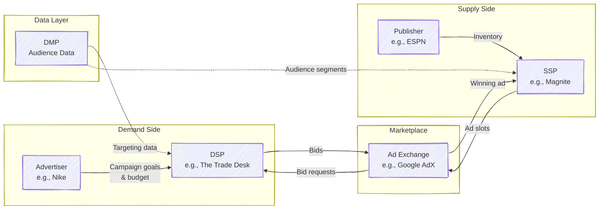

### Advertisers

Advertisers are the ultimate source of money in the system. They range from global brands like Nike and Coca-Cola running awareness campaigns to small e-commerce shops bidding on performance. An advertiser typically specifies a campaign with targeting criteria (who should see the ad), creative assets (the actual ad content), a budget (how much to spend), and a goal (impressions, clicks, conversions, or return on ad spend).

### Publishers

Publishers are the supply side -- they own the digital real estate where ads appear. This ranges from premium publishers like The New York Times and ESPN to the vast "long tail" of smaller websites and apps. Publishers want to maximize the revenue they earn from their ad inventory while maintaining a good user experience.

### Demand-Side Platforms (DSPs)

DSPs are the automated buying systems that act on behalf of advertisers. When a publisher has an ad slot to fill, the DSP receives a bid request describing the user and context, decides whether and how much to bid, and submits the bid -- all within milliseconds. **This is where you, the ML/RL engineer, will likely work.** The bidding logic inside a DSP is the primary application of ML and RL in this ecosystem.

Major DSPs include The Trade Desk (the largest independent DSP), Google's Display & Video 360 (DV360), Amazon DSP, and MediaMath.

### Supply-Side Platforms (SSPs)

SSPs serve the complementary role for publishers. They manage a publisher's inventory, connect to multiple ad exchanges and DSPs, and run auctions to maximize yield. Think of the SSP as the publisher's automated sales agent, ensuring every impression goes to the highest bidder. Major SSPs include Google Ad Manager, Magnite (formerly Rubicon Project), PubMatic, OpenX, and Index Exchange.

### Ad Exchanges

Ad exchanges are the marketplaces where DSPs and SSPs meet. They receive available impressions from SSPs, solicit bids from DSPs, run the auction, and facilitate the transaction. Google's AdX is the dominant exchange, but others include those operated by Amazon, Xandr (Microsoft), and Magnite.

### Data Management Platforms (DMPs)

DMPs collect, organize, and activate audience data that enables targeting. They aggregate data from multiple sources -- browsing behavior, purchase history, demographics -- into audience segments that advertisers can target. This role is evolving rapidly due to privacy regulations and the deprecation of third-party cookies.

> **Key Insight**: Many companies play multiple roles simultaneously. Google operates as a DSP (DV360), an SSP and exchange (Google Ad Manager / AdX), an ad server, and a publisher (YouTube, Search). This vertical integration is a major source of market power and a recurring subject of regulatory scrutiny -- including the 2024 U.S. Department of Justice antitrust case specifically targeting Google's ad-tech dominance.

### A Real-Estate Analogy

If the terminology feels abstract, consider this mapping:

| Ad Tech Role | Real Estate Analogy |
|---|---|
| **Advertiser** | Home buyer with specific needs and a budget |
| **Publisher** | Home seller with a property to offer |
| **DSP** | Buyer's agent -- evaluates properties, places bids algorithmically |
| **SSP** | Seller's agent -- lists property, manages showings |
| **Ad Exchange** | The auction house where the sale happens |
| **DMP** | The market researcher and appraiser |

The key difference is speed. In real estate, a transaction takes weeks. In ad tech, the equivalent process -- from listing to bid to sale -- happens in under 100 milliseconds, billions of times per day.

## 1.3 Types of Online Advertising

Not all digital advertising works the same way. The type of advertising determines the auction mechanism, the pricing model, the targeting approach, and consequently the ML problems you will work on.

### Search Advertising

Search advertising is the original and still the most lucrative form of automated ad bidding. When a user searches "running shoes" on Google, advertisers who have targeted that keyword compete in an auction to have their ads shown alongside the organic results. Google's search advertising revenue alone was approximately $175 billion in 2023.

The key characteristics of search advertising are high user intent (the user is actively looking for something), keyword-based targeting, cost-per-click pricing, and the Generalized Second-Price (GSP) auction mechanism -- though Google has been incorporating elements of first-price pricing in recent years. Because the user's intent is explicitly expressed through their query, click-through rates in search advertising are substantially higher than in display -- typically 2--5% for well-targeted ads.

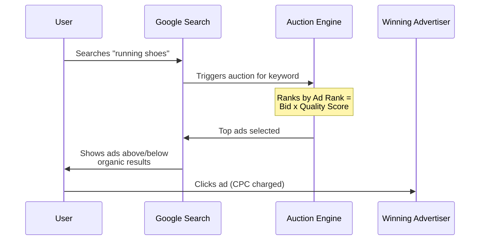

> **Historical Note**: Google's AdWords (now Google Ads) launched in 2000 with a simple CPM model. In 2002, they switched to a CPC auction modeled after Overture's (later Yahoo's) system but added the critical innovation of Quality Score -- multiplying bids by an ad quality factor. This seemingly small change had profound game-theoretic implications, which we explore in Chapter 2.

### Display Advertising

Display advertising encompasses banner ads, video ads, and rich media that appear on websites and apps. When you visit ESPN.com and see a banner ad for a car brand, that impression was likely sold through a real-time bidding (RTB) auction that completed in under 100 milliseconds while the page was loading.

Display advertising is where RTB dominates and where the ML problems are most acute. User intent is lower than in search (the user is browsing, not searching for a product), so targeting must be more sophisticated -- relying on who the user is (audience targeting) and what content they are viewing (contextual targeting). Click-through rates are much lower, typically 0.1--2%, making accurate CTR prediction both more difficult and more valuable.

The auction mechanism for display has converged on first-price auctions, a relatively recent shift from the second-price auctions that dominated the RTB era. This transition, which we discuss in detail later in this chapter, created an entirely new class of ML problems.

### Social Media Advertising

Platforms like Meta (Facebook, Instagram), TikTok, Snapchat, and LinkedIn run their own closed advertising ecosystems. These platforms have extraordinarily rich user data -- social connections, interests, behaviors, engagement patterns -- which enables precise targeting. Meta's advertising system, which serves over 10 million active advertisers, runs its own auction mechanism that incorporates predicted engagement, ad quality, and estimated action rates.

What makes social media advertising distinct from the open RTB ecosystem is that these platforms are vertically integrated: they are simultaneously the publisher, the exchange, and (increasingly) the bidding optimizer. When you use Meta's Advantage+ campaign type, Meta's own ML models are deciding what bid to place in Meta's own auction to show an ad on Meta's own inventory. This "walled garden" model gives the platform extraordinary power to optimize across the full stack, but it means third-party DSPs have limited access.

> **Industry Example**: Meta's advertising auction does not simply rank by bid. Their total value score combines the advertiser's bid, the estimated action rate (their equivalent of pCTR x pCVR), and an ad quality score that penalizes low-quality or policy-violating ads. This three-factor ranking means that a lower bid with higher predicted engagement can beat a higher bid -- a design that aligns platform revenue with user experience.

### Video and Connected TV Advertising

Video advertising -- pre-roll ads on YouTube, mid-roll ads in streaming content, and ads on connected TV (CTV) platforms -- is the fastest-growing segment. YouTube alone generated over $30 billion in ad revenue in 2023. CTV is particularly interesting because it combines the targeting capabilities of digital with the large-screen, high-attention format of traditional television.

The move from linear television (where ads are bought in bulk, targeting demographics rather than individuals) to CTV (where each ad can be targeted to a specific household) represents the same shift from direct sales to programmatic that display advertising underwent a decade earlier. This means new RTB-style auction markets are emerging, and the bidding and allocation problems are being recreated in a new medium.

### Native Advertising

Native ads match the form and function of their surrounding content -- sponsored articles, promoted listings on e-commerce sites, recommended content widgets. They blur the line between advertising and editorial content, which raises both effectiveness and ethical considerations.

### A Summary of Ad Types

| Format | Intent Level | Targeting | Typical Pricing | Auction Type |
|---|---|---|---|---|
| Search | High (active query) | Keyword | CPC | GSP / first-price hybrid |
| Display | Low (passive browsing) | Audience + contextual | CPM | First-price RTB |
| Social | Medium (passive, rich data) | Behavioral + social | CPC/CPA | Platform-specific |
| Video/CTV | Variable | Audience + contextual | CPM/CPCV | Emerging RTB |
| Native | Medium | Contextual + behavioral | CPC | Platform-specific |

## 1.4 Pricing Models

Pricing models determine what advertisers pay for and, consequently, what your ML systems must optimize. Understanding the relationships between pricing models is essential because the auction mechanism almost always operates in one currency (typically CPM), while advertisers think in another (typically CPA or ROAS).

### CPM: Cost Per Mille

Under CPM pricing, the advertiser pays a fixed rate for every 1,000 impressions served, regardless of whether users interact with the ad. If an advertiser pays a $5 CPM, they spend $5 for every 1,000 times their ad is displayed. CPM is the native currency of display advertising and the auction mechanism itself. It is used primarily for brand awareness campaigns where the goal is visibility and reach rather than direct response.

### CPC: Cost Per Click

Under CPC pricing, the advertiser pays only when a user clicks on the ad. This shifts risk from the advertiser to the publisher (or platform): if the ad is shown 10,000 times but no one clicks, the advertiser pays nothing. CPC is the dominant model in search advertising and is common in display when advertisers want to drive traffic. Typical CPC rates range from $0.10 for broad display to $5+ for competitive search keywords, with some financial and legal keywords exceeding $50 per click.

### CPA: Cost Per Action

CPA pricing charges the advertiser only when a desired action occurs -- a purchase, a signup, an app install, a lead form submission. This pushes even more risk to the publisher or platform. CPA is the model most aligned with advertiser goals but requires robust conversion tracking and attribution.

### The Conversion Funnel and Pricing Relationships

These pricing models correspond to successive stages of the user's journey from impression to action. The mathematical relationships between them are mediated by two critical rates:

$$\text{CTR} = \frac{\text{clicks}}{\text{impressions}} \qquad \text{CVR} = \frac{\text{conversions}}{\text{clicks}}$$

From these, the conversions between pricing models follow directly:

$$\text{eCPC} = \frac{\text{CPM}}{\text{CTR} \times 1000}$$

$$\text{eCPA} = \frac{\text{eCPC}}{\text{CVR}} = \frac{\text{CPM}}{\text{CTR} \times \text{CVR} \times 1000}$$

| Pricing Model | Advertiser Pays For | Risk Bearer | Typical Use |
|---|---|---|---|
| CPM | Impressions | Advertiser | Brand awareness |
| CPC | Clicks | Publisher/Platform | Traffic, consideration |
| CPA | Conversions | Publisher/Platform | Direct response, e-commerce |

> **Key Insight**: Regardless of the advertiser's pricing model, the auction almost always operates on eCPM (effective CPM). The DSP internally converts any CPC or CPA goal into a CPM bid using the formula $\text{bid}_{\text{CPM}} = \text{CPA}_{\text{target}} \times p(\text{CTR}) \times p(\text{CVR}) \times 1000$. This conversion is precisely where ML prediction meets bidding. Errors in $p(\text{CTR})$ and $p(\text{CVR})$ translate directly into over- or under-bidding -- and therefore into wasted budget or missed opportunities.

### A Worked Example

Consider an e-commerce advertiser selling running shoes with a target CPA of $50 (they are willing to pay up to $50 per purchase). The DSP's ML models estimate, for a particular impression, that $p(\text{CTR}) = 0.2\%$ and $p(\text{CVR}) = 5\%$. The eCPM bid should be:

$$\text{bid}_{\text{CPM}} = \$50 \times 0.002 \times 0.05 \times 1000 = \$5.00$$

If the DSP overestimates the CTR at 0.4% instead of the true 0.2%, the bid doubles to $10 CPM, and the advertiser ends up paying roughly twice their target CPA for each conversion. This illustrates why CTR prediction accuracy is so economically consequential.

## 1.5 The Evolution of Online Advertising

The advertising ecosystem did not spring into existence fully formed. Understanding its evolution explains why the current system has the structure it does -- and where the remaining opportunities for ML/RL engineers lie.

### Era 1: Direct Sales (1994--2005)

The first banner ad appeared on HotWired.com on October 27, 1994 -- an AT&T ad that famously asked "Have you ever clicked your mouse right HERE?" with a 44% click-through rate (a number that will never be seen again). In this era, publisher sales teams negotiated directly with advertisers, agreeing on fixed prices for specific ad placements over defined time periods. There was no targeting, no optimization, and no automation. Premium publishers could charge high rates, but the process was manual and inefficient.

### Era 2: Ad Networks (2000--2010)

Ad networks emerged as intermediaries, aggregating inventory from many publishers and selling it to advertisers with basic targeting (contextual, demographic). The dominant allocation model was the "waterfall": when an impression became available, it was offered first to the highest-priority ad network. If that network declined, it went to the next, and so on.

The waterfall model was fundamentally suboptimal. Because networks were offered inventory sequentially rather than competitively, a willing buyer in a lower-priority network might never see an impression that a higher-priority network passed on, even though the lower-priority buyer would have paid more.

### Era 3: Ad Exchanges and RTB (2007--2017)

The pivotal moment was Google's acquisition of DoubleClick in 2007 for $3.1 billion, which gave Google the infrastructure to create a real-time auction marketplace. Rather than sequential offering, every impression was now sold individually in a real-time auction, with multiple buyers bidding simultaneously.

This era saw the standardization of the OpenRTB protocol, the rise of demand-side platforms, and the establishment of second-price auctions (Vickrey-style) as the dominant mechanism. The RTB ecosystem grew explosively -- RTB spending in the US grew from negligible in 2010 to over $25 billion by 2017.

> **Industry Example**: The iPinYou dataset, one of the few publicly available RTB datasets, comes from this era. It contains bid logs from a Chinese DSP operating in RTB exchanges during 2013, including bid requests, bid responses, impressions, clicks, and conversions. Despite its age, it remains a standard benchmark for RTB research because real-world bidding data is extremely proprietary.

### Era 4: Header Bidding and First-Price Auctions (2015--Present)

Two interconnected changes transformed the ecosystem in the mid-2010s.

**Header bidding** was a publisher-side innovation that replaced the sequential waterfall with parallel competition. Instead of offering an impression to one exchange at a time, publishers embedded JavaScript in their page headers that simultaneously solicited bids from multiple exchanges and SSPs. The highest bid across all sources won.

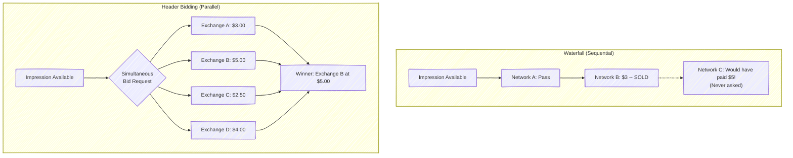

Header bidding increased publisher revenue by 20--50% by ensuring true competition for every impression. But it also precipitated a second, more consequential change: the **shift from second-price to first-price auctions**.

In a second-price auction, the winner pays the second-highest bid. In a first-price auction, the winner pays their own bid. When multiple second-price auctions competed via header bidding, the resulting dynamics were confusing and inefficient -- bids that were "second prices" from one auction competed against "second prices" from another, creating unpredictable outcomes. The industry converged on first-price auctions for their simplicity and transparency: you bid what you bid, and if you win, you pay it.

This transition had enormous implications for ML engineers:

| Aspect | Second-Price Era | First-Price Era |
|---|---|---|
| Optimal strategy | Bid your true value | Shade your bid below true value |
| ML focus | Predict value accurately (CTR/CVR) | Predict value AND optimal bid shading |
| New ML problem | -- | Bid landscape forecasting, market price prediction |
| Bidder surplus | Automatic (pay less than you bid) | Must be engineered through shading |

> **Key Insight**: The shift to first-price auctions created the **bid shading** problem -- an entirely new ML application. DSPs now need models that predict the minimum winning bid for each auction so they can shade their bids just above it. Getting this right saves advertisers millions of dollars. Getting it wrong means either overpaying (bidding too high) or losing auctions you should have won (bidding too low). This is a regression problem with censored observations: you only see the clearing price for auctions you win.

### Era 5: Auto-Bidding and AI (2019--Present)

The current era is defined by platforms increasingly automating bidding decisions. Google's Smart Bidding, Meta's Advantage+, and similar systems use ML and RL to set bids on behalf of advertisers, who specify only high-level goals (target CPA, target ROAS) and budgets. This is a fundamental shift: the advertiser moves from specifying *how* to bid to specifying *what* they want to achieve.

This creates a two-level optimization structure that is the subject of active research. At the inner level, the platform's auto-bidder optimizes bids to achieve the advertiser's stated goal. At the outer level, the platform designs the auction mechanism knowing that bidders are algorithms, not humans. Aggarwal et al. (2024) provide a comprehensive survey of this rapidly evolving landscape.

Simultaneously, privacy regulations (GDPR in Europe, Apple's App Tracking Transparency, the eventual deprecation of third-party cookies) are disrupting the targeting signals that bidding algorithms rely on. This is pushing the industry toward first-party data strategies, contextual targeting, and privacy-preserving ML techniques.

**This is where you come in.** The intersection of auto-bidding, RL-based optimization, and privacy-constrained learning defines the frontier of the field.

## 1.6 The OpenRTB Protocol

When a user visits a webpage with ad slots, a structured conversation unfolds between the publisher's SSP and the various DSPs in the ecosystem. This conversation follows the OpenRTB (Real-Time Bidding) protocol, an IAB Tech Lab standard that defines the format of bid requests and bid responses.

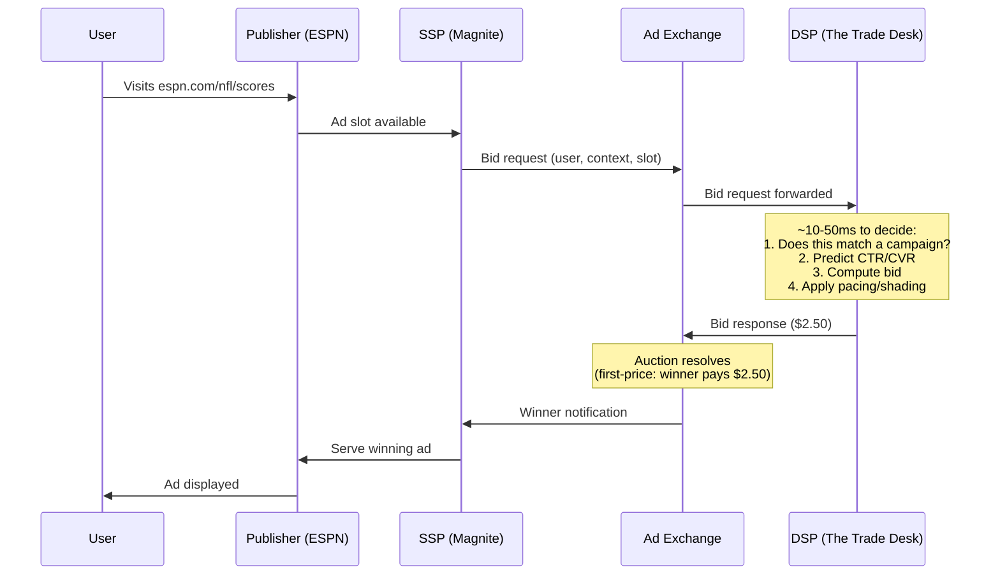

A bid request contains structured information about the available impression, the user (to the extent known and permitted by privacy regulations), the publisher context, and the device. Key fields include the ad slot dimensions and format, a bid floor (minimum acceptable bid), the publisher's domain and content category, user identifiers and demographic/behavioral signals, and device information.

The DSP must evaluate this information, match it against active campaigns, run its prediction models, compute a bid, and return a bid response -- all within the exchange's timeout, typically 100 milliseconds end-to-end, of which the DSP may have only 10--50 milliseconds for its own processing.

The entire global RTB ecosystem processes on the order of 10 million bid requests per second. A large DSP might see millions of these per second and choose to bid on only a fraction -- perhaps 5--30%, depending on campaign targeting and bid floor filtering.

> **Key Insight**: The latency constraint is not just an engineering challenge -- it shapes what ML models are feasible. A CTR prediction model that takes 20 milliseconds to run may be too slow if the entire bid decision pipeline must complete in 10 milliseconds. This is why ad-tech ML engineering places enormous emphasis on model serving infrastructure: quantization, model distillation, feature caching, and efficient inference. The "best" model in terms of offline AUC may be unusable in production if it cannot meet the latency budget.

## 1.7 Key Metrics

Working in ad tech requires fluency with a specific vocabulary of metrics. These metrics are not just performance measures -- they are the inputs, outputs, and objectives of your ML models.

| Metric | Definition | Typical Range |
|---|---|---|
| **CTR** (Click-Through Rate) | $\frac{\text{clicks}}{\text{impressions}}$ | 0.1% -- 2% (display); 2% -- 5% (search) |
| **CVR** (Conversion Rate) | $\frac{\text{conversions}}{\text{clicks}}$ | 1% -- 10% |
| **eCPM** (Effective CPM) | $\frac{\text{revenue}}{\text{impressions}} \times 1000$ | $0.50 -- $20+ |
| **eCPC** (Effective CPC) | $\frac{\text{spend}}{\text{clicks}}$ | $0.10 -- $5+ |
| **eCPA** (Effective CPA) | $\frac{\text{spend}}{\text{conversions}}$ | $5 -- $200+ |
| **ROAS** (Return on Ad Spend) | $\frac{\text{conversion revenue}}{\text{ad spend}}$ | 2x -- 10x |
| **Win Rate** | $\frac{\text{auctions won}}{\text{auctions entered}}$ | 5% -- 30% |
| **Fill Rate** | $\frac{\text{impressions served}}{\text{available slots}}$ | 40% -- 90% |
| **Viewability** | $\frac{\text{viewable impressions}}{\text{total impressions}}$ | 50% -- 80% |

> **For the RL Engineer**: In the RL formulation of bidding, the **reward signal** is typically tied to these metrics. For a CPA-optimized campaign, the reward for winning an auction might be defined as the conversion value minus the price paid. The challenge is that this reward is sparse (conversions are rare) and delayed (a conversion may occur hours after the impression). Win rate acts as a proxy for exploration -- too low and you are not learning enough about the market; too high and you are likely overpaying.

## 1.8 The DSP Bidding Engine: Your Future System

As an ML/RL engineer on a DSP's bidding team, you will work on the system that makes the core economic decision: for each incoming bid request, should we bid, and if so, how much?

This system is a pipeline with distinct stages, each presenting its own ML/RL challenge:

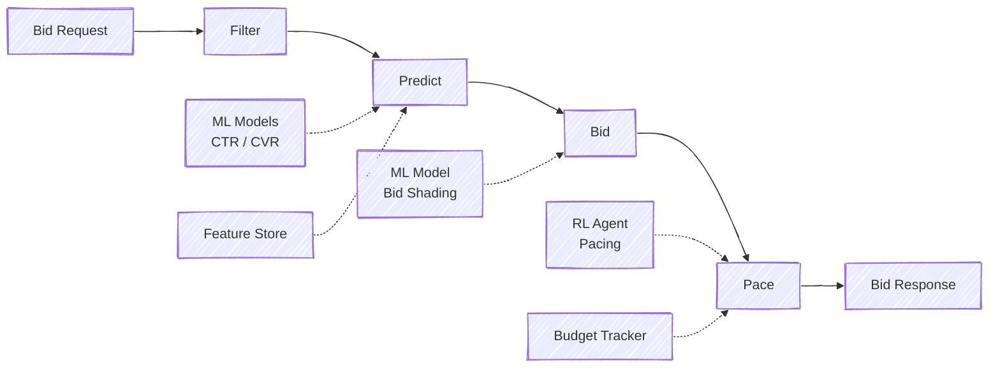

**Filtering** is the first stage. The system checks whether the impression matches any active campaign's targeting criteria -- user demographics, interests, geography, publisher allowlists and blocklists, frequency caps (preventing the same user from seeing the same ad too many times). This stage is primarily an engineering problem of efficient matching at scale, though ML can help with soft targeting and lookalike audience expansion.

**Prediction** is the core ML stage. The system estimates the probability that the user will click ($p(\text{CTR})$) and, conditional on a click, the probability of a conversion ($p(\text{CVR})$). These predictions, combined with the advertiser's stated value per conversion, yield an estimated value for the impression:

$$\text{value} = \text{advertiser\_goal\_value} \times p(\text{CTR}) \times p(\text{CVR})$$

This is a classic supervised learning problem, and it is covered in depth in Chapters 4 and 6.

**Bidding** translates the estimated value into an actual bid amount. In a second-price auction world, the bid would simply equal the value. In the first-price world, the system must shade the bid below the value. Bid shading models predict the market clearing price and set the bid to maximize expected surplus. This is where auction theory (Chapter 2) meets ML.

**Pacing** controls the rate of spending over time. If a campaign has a $10,000 daily budget and the bidding engine bids aggressively in the morning, the budget will be exhausted before the potentially more valuable evening inventory becomes available. Pacing algorithms adjust a multiplier on bids -- throttling when spending is ahead of schedule and accelerating when behind. This is inherently a sequential decision problem and one of the primary applications of RL in ad tech (Chapter 9).

The interplay between these stages is subtle. Prediction errors propagate through the pipeline: an overestimated CTR leads to an inflated value estimate, which leads to overbidding, which leads to winning impressions that are not worth their cost, which exhausts the budget too quickly, which causes the pacing system to throttle bids, which reduces win rate on all impressions -- including the genuinely valuable ones. This cascading effect is why prediction accuracy is so consequential and why the pipeline must be tuned holistically, not in isolation.

> **Industry Example**: Alibaba's real-time bidding system processes over 1 million QPS (queries per second) with a latency budget of roughly 10 milliseconds for the ML inference step. Their system, described in a series of KDD papers, uses a cascaded architecture: a lightweight model first filters candidate ads, followed by a heavier model for precise CTR prediction on only the surviving candidates. This cascade design balances prediction accuracy against latency constraints.

> **Key Insight**: Every stage of this pipeline is an ML/RL opportunity. CTR/CVR prediction is a ranking and classification problem. Bid computation is an optimization problem informed by auction theory. Budget pacing is a control and RL problem. Bid shading is a regression and forecasting problem. Your ML/RL skills will be applied across the entire stack -- the question is not whether your background is relevant, but which piece of the system you will work on first.

## 1.9 The Privacy Revolution

No discussion of the current ad-tech landscape is complete without addressing the privacy transformation reshaping the industry. For an ML/RL engineer joining the field now, this is not a side topic -- it is a central constraint on what signals your models can use.

The traditional targeting pipeline relied heavily on **third-party cookies** -- tracking identifiers set by ad-tech companies across websites, enabling cross-site user tracking. If a user browsed running shoes on Nike.com and then visited ESPN.com, a DSP could recognize the same user and show them a Nike retargeting ad. This cross-site tracking was the foundation of audience targeting in display advertising.

Three forces are dismantling this foundation:

**Regulation.** The EU's General Data Protection Regulation (GDPR, 2018) and the California Consumer Privacy Act (CCPA, 2020) imposed consent requirements and user rights that made unrestricted tracking legally risky. Under GDPR, a user who has not consented to tracking cannot be targeted with behavioral data -- and consent rates are often below 50%.

**Platform policy.** Apple's App Tracking Transparency (ATT, 2021) required iOS apps to obtain explicit user permission before tracking across apps. Opt-in rates were roughly 25%, devastating mobile app advertising measurement and targeting. Google has announced plans (repeatedly delayed) to deprecate third-party cookies in Chrome, the world's most used browser.

**Technology.** Browser-level tracking protections (Safari's Intelligent Tracking Prevention, Firefox's Enhanced Tracking Protection) have already blocked third-party cookies for a significant fraction of users.

The implications for ML/RL in bidding are profound. Models that relied on user-level behavioral features lose much of their signal. The industry is shifting toward **first-party data** (data the advertiser collects directly from their own customers), **contextual targeting** (targeting based on the content of the page rather than the identity of the user), and **privacy-preserving techniques** (differential privacy, federated learning, on-device inference). This is an active research area with significant open problems, and it is reshaping what features your models will have access to.

> **Key Insight**: The privacy revolution is not merely a constraint -- it is also creating new ML problems. Contextual targeting requires NLP models that understand page content. Privacy-preserving measurement requires new approaches to attribution and causal inference. Federated or on-device bidding models must work with limited compute and no centralized data. For an ML/RL engineer, the privacy era is as much an opportunity as a restriction.

---

## Exercises

1. **Pricing conversion.** A CPM campaign runs at a $5 CPM rate. If the observed CTR is 0.2% and the conversion rate among clickers is 5%, what is the effective CPA? What happens to the effective CPA if the CTR drops to 0.1%?

2. **The first-price shift.** Explain in your own words why the transition from second-price to first-price auctions created new ML problems. If a DSP continued to bid truthfully (bid = estimated value) in a first-price auction, what would happen to advertiser surplus?

3. **Header bidding and competition.** Using the intuition from the waterfall versus header bidding comparison, explain why increasing competition among buyers benefits sellers. Relate this to the Bulow-Klemperer theorem (which you will encounter in Chapter 2).

4. **Ecosystem mapping.** Choose a digital ad you saw recently (on a website, in a mobile app, or in a social media feed). Trace the likely path of that ad through the ecosystem -- which entities were likely involved? Was it likely sold through RTB, a direct deal, or the platform's own auction?

5. **Metric relationships.** An advertiser targets a $40 CPA with a $5,000 daily budget. Their DSP observes an average CTR of 0.3% and CVR of 4%. (a) What eCPM should the DSP bid? (b) Approximately how many impressions, clicks, and conversions should the advertiser expect per day? (c) If the actual CVR turns out to be 2% instead of 4%, what happens to the effective CPA?

---

## Further Reading

- Wang, Zhang, and Yuan (2017), *Display Advertising with Real-Time Bidding*, Chapters 1--2 (arXiv:1610.03013)
- Aggarwal et al. (2024), *Auto-bidding and Auctions in Online Advertising: A Survey* (arXiv:2408.07685), Section 2 for ecosystem overview
- Digiday's "WTF is Programmatic Advertising" series -- accessible industry primers
- IAB Tech Lab OpenRTB specification (iabtechlab.com/standards/openrtb/) -- the protocol definition


---

# Chapter 2: Auction Theory Foundations

---

## 2.1 Why Auction Theory Matters for Bidding Engineers

Every time your system submits a bid, it participates in an auction. This is not a metaphor -- it is literally an auction, governed by rules that determine who wins and what they pay. Understanding auction theory is not optional background; it is the mathematical foundation that tells you what the optimal bidding strategy is under given rules, why certain auction formats exist and what incentives they create, what happens when rational agents compete, and what the theoretical limits of any bidding algorithm are.

If you have encountered game theory before, parts of this chapter will feel familiar. If not, work through the derivations carefully. The theorems here are not academic curiosities -- they directly inform the design of bidding algorithms. The Revenue Equivalence Theorem explains why the industry's shift from second-price to first-price auctions was less dramatic than it might seem. The Bayesian Nash Equilibrium of first-price auctions gives you the closed-form bid shading formula. Myerson's optimal auction theory explains why reserve prices exist. Each result has a direct engineering implication.

> **For the RL Engineer**: Auction theory provides the *environment model* for your RL agent. Just as a robotics engineer needs to understand Newtonian mechanics to design controllers, a bidding engineer needs to understand auction mechanics to design bidding algorithms. The auction rules define the transition dynamics and reward structure of the MDP your agent operates in. When the auction format changes (as it did in the second-to-first-price transition), the MDP changes, and optimal policies change with it.

## 2.2 Setup and Notation

We consider $n$ bidders competing for a single item -- in our setting, a single ad impression. Each bidder $i$ has a private valuation $v_i$ representing the true worth of the item to them. In ad tech, this valuation is the expected revenue from showing the ad: typically $v_i = \text{pCTR}_i \times \text{pCVR}_i \times \text{value}_i$, where $\text{value}_i$ is the advertiser's stated value per conversion.

Each bidder submits a bid $b_i$, which may or may not equal their true valuation. The auction mechanism determines the winner and the price. Bidder $i$'s utility (payoff) is:

$$u_i = \begin{cases} v_i - p_i & \text{if } i \text{ wins (where } p_i \text{ is the price paid)} \\ 0 & \text{if } i \text{ loses} \end{cases}$$

We adopt the **Independent Private Values (IPV)** model as our baseline: each bidder's valuation $v_i$ is drawn independently from a common cumulative distribution function $F$ with density $f$. Bidder $i$ knows their own $v_i$ but not the valuations of others -- they only know the distribution $F$ from which those valuations are drawn.

| Symbol | Meaning |
|--------|---------|
| $n$ | Number of bidders |
| $v_i$ | Bidder $i$'s true valuation (private) |
| $b_i$ | Bidder $i$'s bid |
| $F(v)$, $f(v)$ | CDF and PDF of the valuation distribution |
| $u_i$ | Bidder $i$'s utility |
| $b^*(v)$ | Equilibrium bidding strategy (bid as a function of value) |

This setup is, of course, a simplification. Real ad auctions involve correlated valuations, asymmetric bidders, budget constraints, and repeated interaction. But the IPV model provides the essential intuitions, and we will discuss the gaps between theory and practice at the end of the chapter.

## 2.3 Second-Price Auctions (Vickrey Auctions)

The second-price auction, introduced by William Vickrey in 1961, has a simple rule: the highest bidder wins, but pays the *second-highest* bid. If three bidders submit bids of $10, $7, and $4, bidder A wins and pays $7 -- bidder B's bid, not their own.

This auction format has a remarkable property that makes it a natural starting point for both theory and practice.

### Theorem: Truthful Bidding is a Dominant Strategy

**Claim.** In a second-price auction, every bidder maximizes their utility by bidding their true valuation: $b_i^* = v_i$.

**Proof.** Consider bidder $i$ with true value $v_i$. Let $p = \max_{j \neq i} b_j$ denote the highest competing bid, which is unknown to bidder $i$. We show that no deviation from $b_i = v_i$ can improve $i$'s utility, regardless of $p$.

*Case 1: Overbidding ($b_i > v_i$).* There are three sub-cases based on where $p$ falls:

- If $p > b_i > v_i$: bidder $i$ loses, getting utility 0. Same outcome as bidding truthfully.
- If $b_i > p$ and $p < v_i$: bidder $i$ wins, paying $p$, with utility $v_i - p > 0$. Same outcome as bidding truthfully (would still have won).
- If $b_i > p > v_i$: bidder $i$ wins, paying $p > v_i$, with utility $v_i - p < 0$. **Strictly worse** than bidding truthfully, which would have lost (utility 0).

*Case 2: Underbidding ($b_i < v_i$).* Again three sub-cases:

- If $p > v_i > b_i$: bidder $i$ loses, utility 0. Same as truthful.
- If $v_i > p$ and $p < b_i$: bidder $i$ wins, pays $p$, utility $v_i - p > 0$. Same as truthful.
- If $v_i > p > b_i$: bidder $i$ loses, utility 0. **Strictly worse** than bidding truthfully, which would have won with utility $v_i - p > 0$.

In both cases, deviating from truthful bidding can only hurt, never help. Therefore $b_i = v_i$ weakly dominates all other strategies. $\square$

This property -- called **incentive compatibility** or **strategyproofness** -- is profound in its implications. It means that in a second-price auction, the entire bidding problem reduces to a *prediction* problem: estimate $v_i$ as accurately as possible, then bid it. No game-theoretic reasoning about competitors' behavior is needed. This is why CTR prediction was the dominant ML application in ad tech during the second-price era.

The elegance of this result cannot be overstated. In most economic settings, optimal behavior requires reasoning about what other agents will do -- a notoriously difficult problem. The second-price auction eliminates this entirely. Each bidder's optimal strategy is independent of the number of competitors, the distribution of their values, and their strategies. It is one of the rare settings where individual rationality leads to a socially efficient outcome without any coordination.

> **Key Insight**: In a second-price auction, the DSP's entire job is to predict the impression's value accurately: $v = p(\text{CTR}) \times p(\text{CVR}) \times \text{advertiser\_value}$. No strategic bid adjustment is needed. This is why CTR prediction became the "killer app" of ML in ad tech. The auction format made prediction sufficient for optimal bidding.

### Expected Revenue

For $n$ bidders with valuations drawn i.i.d. from $\text{Uniform}[0,1]$, the expected revenue of a second-price auction equals the expected value of the second-highest order statistic:

$$E[\text{Revenue}] = E[V_{(n-1:n)}] = \frac{n-1}{n+1}$$

This formula reveals the fundamental role of competition. With 2 bidders, expected revenue is $1/3 \approx 0.33$. With 5 bidders, it rises to $2/3 \approx 0.67$. With 10 bidders, it reaches $9/11 \approx 0.82$. Each additional bidder increases revenue, but with diminishing returns -- a result with direct implications for exchange design.

## 2.4 First-Price Auctions

In a first-price auction, the highest bidder wins and pays *their own bid*. If bidder A submits $10 and wins, they pay $10, not the second-highest bid.

The immediate consequence is that truthful bidding is no longer rational. If you bid your true value and win, your utility is $v_i - v_i = 0$ -- you gain nothing. Rational bidders must **shade** their bids below their true values, trading a lower probability of winning for positive surplus when they do win. This is the fundamental optimization problem of first-price auctions: how much to shade.

### Bayesian Nash Equilibrium for Uniform Valuations

We derive the equilibrium bidding strategy for the canonical case of $n$ bidders with valuations drawn i.i.d. from $\text{Uniform}[0,1]$.

Consider bidder $i$ with value $v$. Suppose all other bidders follow a symmetric, strictly increasing strategy $b^*(\cdot)$. Bidder $i$ chooses bid $b$ to maximize expected utility:

$$E[u_i] = \Pr(\text{win}) \cdot (v - b)$$

Bidder $i$ wins if their bid exceeds all $n-1$ other bids. Since each competitor $j$ bids $b^*(v_j)$ and $b^*$ is increasing, bidder $i$ wins if $b > b^*(v_j)$ for all $j \neq i$, which occurs when $v_j < (b^*)^{-1}(b)$ for all competitors. Under the uniform distribution:

$$\Pr(\text{win}) = \left[(b^*)^{-1}(b)\right]^{n-1}$$

Guessing a linear equilibrium $b^*(v) = \alpha v$, we have $(b^*)^{-1}(b) = b/\alpha$, so:

$$E[u_i] = \left(\frac{b}{\alpha}\right)^{n-1} (v - b)$$

Taking the derivative with respect to $b$ and setting it to zero:

$$\frac{(n-1) b^{n-2}}{\alpha^{n-1}} (v - b) - \frac{b^{n-1}}{\alpha^{n-1}} = 0$$

$$(n-1)(v - b) = b$$

$$b^* = \frac{n-1}{n} \cdot v$$

This is the **symmetric Bayesian Nash Equilibrium (BNE)** for first-price auctions with uniform valuations. Each bidder shades their bid by a factor of $(n-1)/n$, bidding a fraction of their true value that increases with competition:

| Bidders ($n$) | Equilibrium bid $b^*(v)$ | Shade fraction | Example: $v = \$10$ |
|---|---|---|---|
| 2 | $v/2$ | 50% | Bid $5.00 |
| 5 | $4v/5$ | 20% | Bid $8.00 |
| 10 | $9v/10$ | 10% | Bid $9.00 |
| 100 | $99v/100$ | 1% | Bid $9.90 |

> **Key Insight**: More competition means less shading. In highly competitive ad markets with many bidders, the optimal bid approaches the true value even in first-price auctions. But for niche inventory with few competing bidders, aggressive shading is optimal and can save advertisers substantial money. This is why bid shading models in practice need to estimate the *competitive landscape* -- not just the impression's value, but how many and how aggressive the other bidders are.

### Practical Implications of the Equilibrium

The equilibrium formula $b^*(v) = \frac{n-1}{n} v$ has direct engineering implications for bid shading models. In the real world, of course, a DSP does not know $n$ exactly -- the number of competing bidders varies by impression, time of day, and publisher. Nor are valuations uniformly distributed. But the qualitative insight holds robustly: the optimal shade amount decreases with competition.

This is why production bid shading models typically estimate features of the competitive landscape -- the number of bidders, the distribution of competing bids, the historical win rate at various bid levels -- and use these to calibrate the shade. The theoretical equilibrium provides the functional form; ML fills in the parameters.

> **Industry Example**: When Google's Ad Exchange transitioned from second-price to first-price auctions in 2019, DSPs had to rapidly build bid shading capabilities. The Trade Desk, one of the largest independent DSPs, developed ML models that estimate the "clearing price" of each auction -- essentially predicting what the second-highest bid would have been -- and shades bids toward that estimate. They reported that effective bid shading saved their advertisers significant spend without materially reducing win rates.

### General Formula for Arbitrary Distributions

For valuations drawn from a general distribution $F$ with density $f$, the symmetric BNE bid function satisfies:

$$b^*(v) = v - \frac{\int_0^v [F(t)]^{n-1} \, dt}{[F(v)]^{n-1}}$$

An equivalent and more intuitive expression is:

$$b^*(v) = E\left[Y_{(n-1:n-1)} \mid Y_{(n-1:n-1)} < v\right]$$

where $Y_{(n-1:n-1)}$ is the maximum of $n-1$ i.i.d. draws from $F$. In words: **bid the expected value of the second-highest valuation, conditional on yours being the highest.** This mirrors the payment in a second-price auction in expectation -- a connection that leads us to one of the most elegant results in auction theory.

## 2.5 The Revenue Equivalence Theorem

The Revenue Equivalence Theorem (RET), established by Vickrey (1961) and generalized by Myerson (1981), is arguably the most important result in auction theory.

**Theorem (Revenue Equivalence).** Consider $n$ risk-neutral bidders with valuations drawn i.i.d. from a continuous distribution $F$. Any two auction mechanisms that (1) always allocate the item to the bidder with the highest valuation and (2) give zero expected payoff to a bidder with value zero yield the **same expected revenue** to the seller.

This means that first-price auctions, second-price auctions, English auctions (ascending), and Dutch auctions (descending) all generate identical expected revenue under the IPV model:

$$E[\text{Revenue}] = E[V_{(n-1:n)}] = \frac{n-1}{n+1} \quad \text{for Uniform}[0,1]$$

The intuition is subtle but powerful. In a second-price auction, bidders bid truthfully and the payment is the second-highest value. In a first-price auction, bidders shade, but the equilibrium shading is calibrated so that the expected payment of the winner equals exactly the expected second-highest value. Different mechanisms extract the same revenue through different paths.

### When Revenue Equivalence Breaks Down

Revenue equivalence holds under specific assumptions. When those assumptions are violated -- as they invariably are in real ad auctions -- the theorem breaks, and the choice of auction format matters:

| Violation | Effect on Revenue Comparison |
|---|---|
| **Risk-averse bidders** | First-price generates *more* revenue (bidders shade less to avoid losing) |
| **Correlated values** | English (ascending) auction generates *more* (information revelation during bidding) |
| **Asymmetric bidders** | Ranking depends on the specific form of asymmetry |
| **Budget constraints** | Significant differences; budget-constrained bidders distort equilibrium |
| **Reserve prices** | Break equivalence in complex, mechanism-dependent ways |
| **Repeated auctions** | Collusion and learning dynamics favor different formats |

> **Industry Example**: Revenue equivalence is the theoretical reason why the industry's transition from second-price to first-price auctions was expected to be revenue-neutral for publishers. In practice, the transition was messy: DSPs needed months to build and calibrate bid-shading models. During this transition period, many DSPs were still bidding as if in a second-price auction (i.e., near truthfully), which temporarily *increased* publisher revenue. As DSPs adapted and deployed shading, publisher revenue normalized. This transition -- a natural experiment in auction theory -- was one of the most significant events in ad-tech history.

## 2.6 The Generalized Second-Price (GSP) Auction

The single-item auctions above are the building blocks, but search advertising involves a more complex setting: multiple ad positions on a results page, each with a different click-through rate. The Generalized Second-Price (GSP) auction was the mechanism developed for this setting, and it is the foundation of Google Ads and Bing Ads.

### Setup

Consider $k$ ad slots on a search results page, with click-through rates $\alpha_1 \geq \alpha_2 \geq \cdots \geq \alpha_k$. The top slot gets the most clicks, the second slot fewer, and so on. There are $n > k$ advertisers, each with a value-per-click $v_i$ and a bid $b_i$.

### Mechanism

The GSP auction works as follows:

1. **Allocation**: Sort bidders by bid in descending order. The bidder with the $i$-th highest bid receives slot $i$.
2. **Pricing**: Each winner pays the *next-lower bid* per click. That is, the advertiser in slot $i$ pays $b_{(i+1)}$ per click (the bid of the advertiser in slot $i+1$).

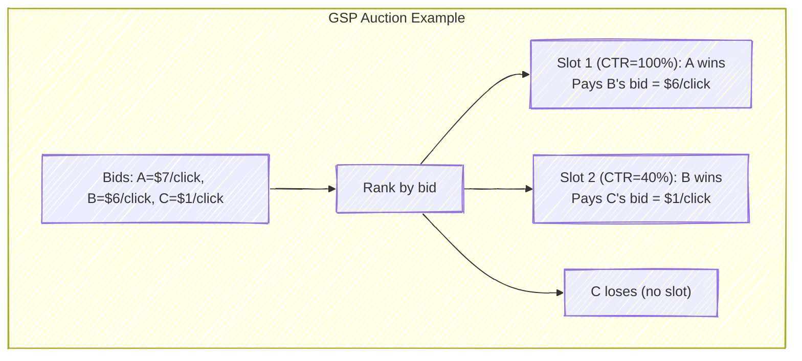

### GSP Is Not Truthful

Unlike the second-price auction for a single item, the GSP auction is **not** incentive-compatible. Bidders can sometimes improve their utility by bidding less than their true value. This is a critical distinction.

Consider a concrete example with values $v_A = 7$, $v_B = 6$, $v_C = 1$ and two slots with CTRs $\alpha_1 = 1.0$ and $\alpha_2 = 0.4$.

**Under truthful bidding** ($b_i = v_i$): Bidder A gets slot 1 and pays $6/click, yielding utility $\alpha_1 (v_A - 6) = 1.0 \times 1 = 1.0$. Bidder B gets slot 2 and pays $1/click, yielding utility $\alpha_2 (v_B - 1) = 0.4 \times 5 = 2.0$.

**If A deviates to $b_A = 5$**: Now B (with bid $6) gets slot 1, and A gets slot 2. A pays C's bid of $1/click, yielding utility $\alpha_2(v_A - 1) = 0.4 \times 6 = 2.4 > 1.0$. Bidder A profits by *underbidding* -- dropping to a cheaper slot with enough traffic to more than compensate for the lower position.

This shows that truthful bidding is not a Nash equilibrium of the GSP auction. Bidders have incentives to strategically lower their bids to "drop down" to cheaper positions.

> **Historical Note**: Edelman, Ostrovsky, and Schwarz (2007) and Varian (2007) independently analyzed the GSP auction in landmark papers published simultaneously. They showed that while GSP is not truthful, it has a set of Nash equilibria with appealing properties. Edelman et al. identified the "locally envy-free" equilibrium in which no advertiser prefers to swap positions with their immediate neighbor -- and showed that in this equilibrium, payments coincide with those of the VCG mechanism. This result gave Google's mechanism a retrospective theoretical justification, even though it was originally designed by engineers rather than economists.

> **Key Insight**: Google's introduction of *Quality Score* -- multiplying bids by an estimated ad quality factor -- was partly a response to the strategic vulnerability of GSP. By ranking ads by $\text{bid} \times \text{quality}$ rather than bid alone, the effective mechanism becomes harder to game. It also aligns the platform's incentives (showing relevant ads to maintain user engagement) with mechanism design (moving closer to VCG-like outcomes). Quality Score is itself an ML prediction -- yet another place where ML and auction theory intersect.

## 2.7 The VCG Mechanism (Vickrey-Clarke-Groves)

The VCG mechanism is the truthful generalization of the second-price auction to settings with multiple items or positions. Where GSP charges each winner the next-lower bid, VCG charges each winner their **externality** -- the total harm their participation imposes on all other bidders.

### VCG Payment Formula

The VCG payment for bidder $i$ is:

$$p_i^{\text{VCG}} = \underbrace{W_{-i}(\text{without } i)}_{\text{Social welfare of others if } i \text{ absent}} \;-\; \underbrace{W_{-i}(\text{with } i)}_{\text{Social welfare of others when } i \text{ present}}$$

In words: bidder $i$ pays the difference between what the other bidders *would* collectively receive if $i$ were not in the auction, and what they actually receive with $i$ present. This is the "damage" that $i$'s participation inflicts on the rest.

### Worked Example

Consider 3 bidders with values $v_A = 10$, $v_B = 6$, $v_C = 2$ competing for 2 slots with CTRs $\alpha_1 = 1.0$ and $\alpha_2 = 0.5$.

**Efficient allocation**: A gets slot 1, B gets slot 2 (highest total welfare).

**A's VCG payment**:
- *Without A*: B gets slot 1 (welfare $6 \times 1.0 = 6$), C gets slot 2 (welfare $2 \times 0.5 = 1$). Others' total welfare = $7$.
- *With A*: B gets slot 2 (welfare $6 \times 0.5 = 3$), C gets nothing (welfare $0$). Others' total welfare = $3$.
- A pays $7 - 3 = \$4.00$ (total expected payment), equivalent to a per-click price of $\$4 / \alpha_1 = \$4$/click.

**B's VCG payment**:
- *Without B*: A gets slot 1 (welfare $10 \times 1.0 = 10$), C gets slot 2 (welfare $2 \times 0.5 = 1$). Others' total welfare = $11$.
- *With B*: A gets slot 1 (welfare $10 \times 1.0 = 10$), C gets nothing (welfare $0$). Others' total welfare = $10$.
- B pays $11 - 10 = \$1.00$ (total expected payment). Note the welfare difference already accounts for the CTRs, so this is B's total expected payment, not a per-click price; equivalently, B pays $\$1 / \alpha_2 = \$2$/click.

Compare with GSP: under truthful bidding, A would pay B's bid of $6/click ($\$6$ expected) and B would pay C's bid of $2/click ($\$1$ expected). VCG charges *less* in aggregate than the GSP truthful-bidding outcome ($\$5$ vs. $\$7$ total).

### Properties Comparison

| Property | VCG | GSP (in equilibrium) |
|---|---|---|
| Truthful (dominant strategy) | Yes | No |
| Efficient (maximizes social welfare) | Yes | Yes |
| Revenue | Lower | Higher |
| Implementation complexity | Higher | Simpler |

The fact that VCG is truthful but generates less revenue than GSP is precisely why Google chose GSP for its search auction. From the platform's perspective, the extra revenue from GSP's strategic bidding was worth the loss of truthfulness. From the advertiser's perspective, the need to bid strategically in GSP creates demand for sophisticated bidding algorithms -- which is, again, where you come in.

There is a historical irony here. Google's engineers originally chose GSP not because of any theoretical analysis but because it was simple to implement and seemed fair ("you pay the next guy's bid"). The theoretical properties were discovered after the fact by Edelman et al. and Varian, who provided a retrospective rationalization for a design that had already been deployed at scale. This is a recurring pattern in ad tech: practice leads theory, and theorists scramble to explain why what works works.

> **For the RL Engineer**: The distinction between VCG (truthful, so prediction alone suffices) and GSP (strategic, so bidding policy matters) maps directly to the distinction between *supervised learning* and *reinforcement learning* approaches to bidding. In a VCG world, you would train a supervised model to predict value and bid it. In a GSP or first-price world, you need a policy that accounts for the strategic environment -- a natural RL formulation.

## 2.8 Myerson's Optimal Auction

The auctions above are designed to be efficient -- they allocate the item to whoever values it most. But what if the seller (the publisher or exchange) wants to maximize *revenue* rather than *efficiency*? Roger Myerson's Nobel Prize-winning work (1981) characterizes the revenue-maximizing auction.

### Virtual Valuations

The key concept is the **virtual valuation** function. For a bidder with value $v$ drawn from distribution $F$ with density $f$:

$$\varphi(v) = v - \frac{1 - F(v)}{f(v)}$$

The virtual valuation adjusts the bidder's reported value downward by a term that captures the *information rent* -- the surplus the seller must leave the bidder to incentivize truthful reporting. It can be interpreted as the "marginal revenue" from serving a bidder with this value.

For the uniform distribution $\text{Uniform}[0, V_{\max}]$:

$$\varphi(v) = v - \frac{V_{\max} - v}{1} = 2v - V_{\max}$$

### Myerson's Optimal Mechanism

Myerson showed that the revenue-maximizing auction has a simple structure (when virtual valuations are monotone increasing, which holds for many common distributions):

1. Compute $\varphi(v_i)$ for each bidder.
2. Allocate the item to the bidder with the highest $\varphi(v_i)$, provided $\varphi(v_i) \geq 0$.
3. If all virtual valuations are negative, do not sell the item.

The condition $\varphi(v_i) \geq 0$ defines a **reserve price** -- a minimum bid below which the item is not sold, even if there are willing buyers. Setting $\varphi(v^*) = 0$ for $\text{Uniform}[0, V_{\max}]$:

$$2v^* - V_{\max} = 0 \implies v^* = \frac{V_{\max}}{2}$$

The optimal reserve price is **half the maximum possible valuation**. This is a striking result: even when there is a willing buyer, it is sometimes in the seller's interest to refuse the sale to credibly extract higher payments from high-value buyers in the future.

> **Industry Example**: In practice, ad exchanges set floor prices (minimum bids) on impressions, which function as reserve prices. Setting these floors is a significant optimization problem for exchanges and SSPs. The theory says the optimal floor depends on the distribution of bidder valuations -- which must be estimated from data. This is another ML application: predicting the distribution of bids for a given impression to set an optimal floor price. Companies like Google and Magnite invest heavily in floor price optimization algorithms.

### The Bulow-Klemperer Theorem

One of the most elegant results in auction theory connects optimal mechanism design with simple competition:

**Theorem (Bulow and Klemperer, 1996).** An auction with $n+1$ bidders and *no* reserve price generates at least as much expected revenue as the optimal auction (with optimal reserve price) with only $n$ bidders.

The implication is powerful: **attracting one additional bidder is worth more than any amount of mechanism design sophistication**. No matter how cleverly you set reserve prices or design payment rules, simply adding one more competitor to the auction generates more revenue.

> **Key Insight**: The Bulow-Klemperer theorem explains why ad exchanges invest so heavily in liquidity -- connecting to more DSPs, reducing latency to attract more bidders, and lowering barriers to participation. The most sophisticated reserve price algorithm cannot compensate for a thin market. This also explains the success of header bidding from the publisher's perspective: by soliciting bids from multiple exchanges simultaneously, publishers effectively increase $n$, which Bulow-Klemperer tells us is the most effective revenue lever.

## 2.9 From Theory to Practice

The theoretical models in this chapter assume idealized conditions. Real ad auctions violate nearly every assumption, and understanding these gaps is essential for applying theory correctly.

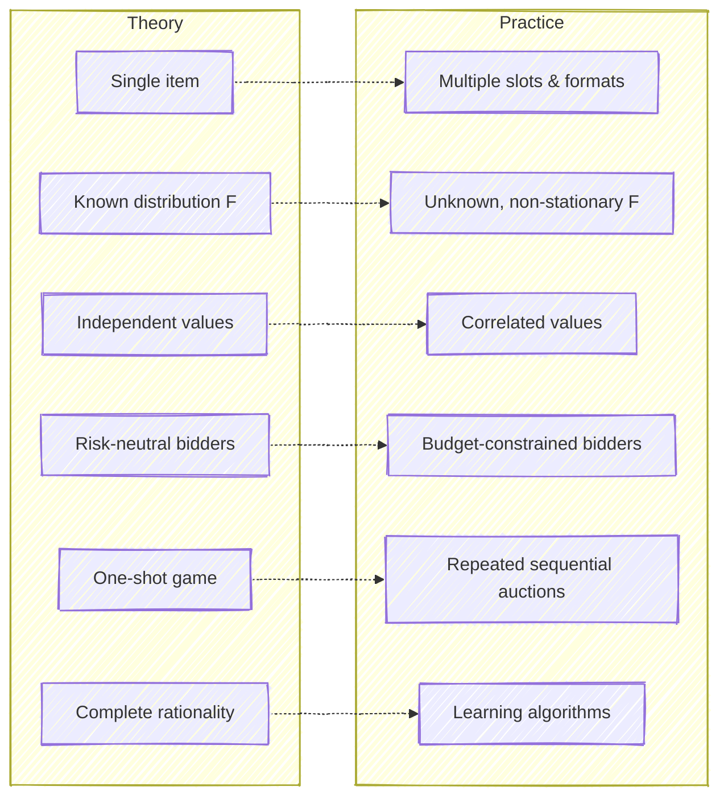

**Single item vs. multiple slots.** Real display auctions may offer multiple ad slots on a page, and search auctions definitively do. The theory extends (GSP, VCG) but equilibrium analysis becomes harder.

**Known distributions vs. learning from data.** The equilibrium strategies above assume bidders know $F$, the distribution of competitor valuations. In practice, this distribution must be estimated from historical bid data -- and it shifts over time as competitors enter, exit, and update their strategies. This turns the bidding problem from a static game into a *learning* problem.

**Independent values vs. correlated values.** When the same user sees multiple ads, or when multiple bidders use similar prediction models (as when many DSPs use similar deep learning architectures for CTR prediction), valuations become correlated. This invalidates the independence assumption and changes equilibrium behavior.

**Risk-neutral vs. budget-constrained.** Budget constraints are perhaps the most practically important violation. A bidder with a $10,000 daily budget cannot simply bid their value on every impression -- they must allocate that budget across the day's auctions. Budget constraints effectively make bidders risk-averse (winning a low-value auction exhausts budget that could have been spent on a high-value auction later), and they break revenue equivalence between auction formats.

**One-shot vs. sequential.** A DSP participates in millions of auctions per day. Performance in any single auction is irrelevant; what matters is cumulative performance over the entire budget horizon. This sequential structure -- with budget depletion, learning about the market, and changing competitive conditions -- is precisely what makes bidding a reinforcement learning problem.

**Equilibrium play vs. learning.** Classical auction theory assumes bidders play equilibrium strategies. In practice, bidding algorithms are *learning* -- they explore to estimate market conditions, exploit to maximize performance, and adapt to changes in the environment. The relevant theory shifts from equilibrium analysis to regret minimization and online learning.

> **For the RL Engineer**: The gap between "one-shot equilibrium" and "sequential learning" is where your expertise becomes most valuable. Classical auction theory tells you what the steady-state optimal strategy is. But in practice, you face a non-stationary environment where competitor strategies change, new campaigns launch mid-day, and the value of impressions varies by time of day and day of week. The bidding problem is not "find the Nash equilibrium and play it" -- it is "learn a good policy online while the environment shifts around you." This is fundamentally an RL problem, and it requires balancing exploration (learning the market) with exploitation (spending the budget wisely), all under hard budget constraints. Chapters 7--9 develop this formulation in detail.

These gaps are not deficiencies of the theory -- they are **opportunities for ML and RL**. Machine learning addresses the estimation problem (learning $F$ from data). Reinforcement learning addresses the sequential, constrained optimization problem. Multi-agent RL addresses the strategic interaction between learning algorithms. The rest of this book is devoted to these approaches.

### A Bridge to the Auto-Bidding Era

There is one more gap between theory and practice that deserves special attention because it defines the current frontier of the field. Classical auction theory assumes that bidders are the advertisers themselves (or their direct agents), each with a single well-defined value. In the auto-bidding era, the situation is more complex.

An advertiser specifies a high-level goal -- for instance, "maximize conversions at a target CPA of $50 with a daily budget of $10,000." The platform's auto-bidding system then bids on their behalf. This creates a two-layer structure:

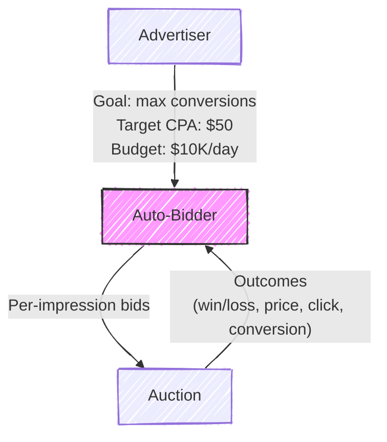

The auto-bidder is not a simple value-maximizer -- it is a constrained optimizer. It must simultaneously maximize an objective (total conversions), satisfy a value constraint (average CPA at or below target), and respect a budget constraint (total spend at or below budget). Aggarwal et al. (2024) formalize this as:

$$\max \sum_t x_t \cdot \text{value}_t \quad \text{s.t.} \quad \sum_t x_t \cdot p_t \leq B, \quad \frac{\sum_t x_t \cdot p_t}{\sum_t x_t \cdot \text{value}_t} \leq \text{target CPA}$$

where $x_t \in \{0,1\}$ indicates whether the auto-bidder wins auction $t$ and $p_t$ is the price paid.

This formulation changes the nature of the auction itself. When the auctioneer knows that bidders are auto-bidding algorithms rather than humans, the optimal auction design changes. This is the subject of a rapidly growing literature at the intersection of auction theory, optimization, and machine learning -- and it is the frontier you will be working on.

---

## Key Formulas Summary

| Result | Formula | Conditions |
|---|---|---|
| Optimal bid, second-price | $b^*(v) = v$ | Dominant strategy, any $F$ |
| Equilibrium bid, first-price | $b^*(v) = \frac{n-1}{n} v$ | BNE, $\text{Uniform}[0,1]$ |
| Equilibrium bid, first-price (general) | $b^*(v) = v - \frac{\int_0^v [F(t)]^{n-1} dt}{[F(v)]^{n-1}}$ | BNE, general $F$ |
| Expected revenue | $E[\text{Rev}] = \frac{n-1}{n+1}$ | $n$ bidders, $\text{Uniform}[0,1]$, any standard auction |
| Virtual valuation | $\varphi(v) = v - \frac{1-F(v)}{f(v)}$ | Myerson's mechanism |
| Optimal reserve (uniform) | $r^* = \frac{V_{\max}}{2}$ | $\text{Uniform}[0, V_{\max}]$ |
| GSP pricing | $p_i = b_{(i+1)}$ per click | Position auctions |
| VCG payment | $p_i = W_{-i}(\text{without } i) - W_{-i}(\text{with } i)$ | General mechanism |

---

## Exercises

1. **Second-price basics.** In a second-price auction with 5 bidders and valuations $[8, 6, 4, 3, 1]$, identify the winner and the payment. What is each bidder's utility?

2. **First-price equilibrium.** In a first-price auction with 2 bidders drawing from $\text{Uniform}[0, 100]$, what is the equilibrium bid for a bidder with value 60? How much surplus does this bidder expect to earn, conditional on winning?

3. **Revenue equivalence verification.** For $n = 3$ bidders with $\text{Uniform}[0,1]$ valuations, compute the expected revenue of both the second-price and first-price auctions analytically. Verify they are equal.

4. **GSP non-truthfulness.** Consider a GSP auction with 2 slots (CTRs: $\alpha_1 = 0.10$, $\alpha_2 = 0.04$) and 3 advertisers with values-per-click $[5, 3, 1]$. Compute each advertiser's utility under truthful bidding. Then find a profitable deviation for one of the bidders, demonstrating that truthful bidding is not an equilibrium.

5. **VCG vs. GSP.** For the GSP example in Exercise 4, compute the VCG payments. Compare the total revenue under VCG versus the GSP truthful-bidding outcome. Which generates more revenue?

6. **Optimal reserve price.** Suppose bidder valuations are drawn from $\text{Uniform}[0, 10]$. (a) What is the optimal reserve price according to Myerson's theory? (b) Consider a second-price auction with $n = 2$ bidders and this reserve. Write an expression for the expected revenue. (c) How does this compare to the expected revenue of a second-price auction with $n = 3$ bidders and *no* reserve? Relate your answer to the Bulow-Klemperer theorem.

7. **Bid shading in practice.** A DSP estimates that a particular impression is worth $\$5$ CPM to its advertiser. Historical data suggests that the highest competing bid in similar auctions is distributed approximately as $\text{Uniform}[1, 4]$. In a first-price auction, what bid maximizes the DSP's expected surplus? How sensitive is the optimal bid to errors in the estimated distribution of competing bids?

8. **Theory-practice gap.** For each assumption of the IPV model (independence, private values, known distribution, risk neutrality, one-shot game), give a specific real-world ad auction scenario where the assumption is violated, and describe the qualitative effect on bidding behavior.

---

## Further Reading

- Edelman, Ostrovsky, and Schwarz (2007), "Internet Advertising and the Generalized Second-Price Auction," *American Economic Review* -- The foundational analysis of GSP
- Varian (2007), "Position Auctions," *International Journal of Industrial Organization* -- Independent, complementary analysis of GSP
- Myerson (1981), "Optimal Auction Design," *Mathematics of Operations Research* -- The optimal mechanism design framework
- Bulow and Klemperer (1996), "Auctions Versus Negotiations," *American Economic Review* -- The theorem on competition vs. mechanism design
- Roughgarden, CS364A Lectures 2--7 (YouTube) -- Accessible video lectures covering all material in this chapter
- Krishna (2010), *Auction Theory*, 2nd edition (Academic Press) -- The comprehensive graduate textbook on auction theory
- Hartline (2012), *Mechanism Design and Approximation* (jasonhartline.com/MDnA/) -- Free advanced reference


---

# Chapter 3: How Real-Time Bidding Works

*This chapter covers the end-to-end mechanics of real-time bidding (RTB), from the moment a user loads a webpage to the moment an ad is rendered. We examine the OpenRTB protocol, auction mechanics, bid shading, event tracking, supply path optimization, privacy constraints, and ad fraud. Understanding these mechanics is prerequisite to the ML chapters that follow, as every model design decision is constrained by the RTB pipeline it serves.*

---

## 3.1 The RTB Pipeline: From Page Load to Ad Display

Something remarkable happens every time you load a webpage with advertising. In the roughly 100 milliseconds between the moment your browser requests a page and the moment an ad appears on screen, an entire economy springs to life: an auction is announced, dozens of competing firms evaluate whether this particular moment of your attention is worth buying, machine learning models run inference, bids are submitted and evaluated, and a winner is declared. This process repeats billions of times per day across the internet, and it is the engine that funds most of the free web.

Real-time bidding (RTB) is the protocol and infrastructure that makes this possible. Understanding RTB deeply is essential before tackling the ML problems it creates, because every design decision in a bidding system --- from which model architecture to use, to how frequently to retrain, to how to handle missing data --- is constrained by the mechanics of the auction pipeline.

The sequence below traces the life of a single ad impression, from the moment a user's browser makes a request to the moment an ad is rendered.

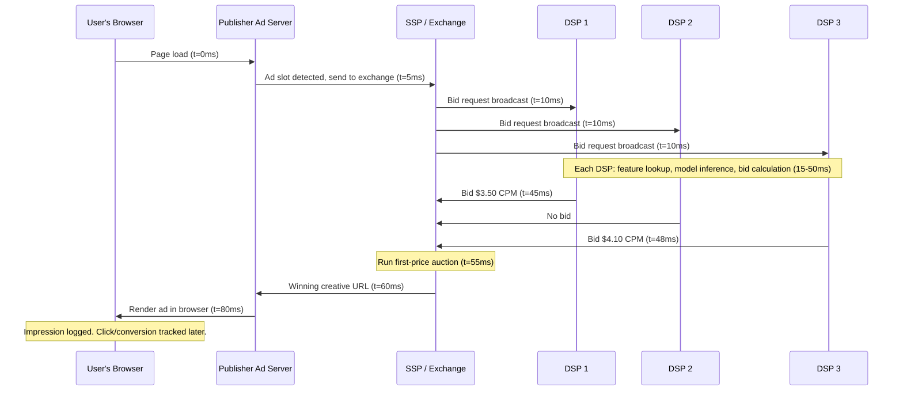

The entire process completes well within the latency budget that a browser allocates for ad loading. A user visiting a news site will typically never notice the auction happening --- yet behind the scenes, sophisticated ML systems evaluated this opportunity in well under 50 milliseconds.

It is worth reflecting on what makes this system remarkable from an engineering perspective. The RTB pipeline is a distributed system that must achieve sub-100ms end-to-end latency, handle millions of concurrent transactions per second, tolerate partial failures gracefully (a non-responsive DSP simply forfeits its chance to bid), and produce economically rational outcomes --- all while the "inventory" being sold (human attention) is perishable and unique. No two impressions are identical, and each one exists only in the instant it is available. This combination of latency requirements, throughput demands, and economic constraints makes RTB one of the most technically challenging distributed systems in production today.

### Scale Numbers That Define the Engineering Problem

The scale of RTB shapes every technical decision. A large demand-side platform (DSP) like The Trade Desk or Google's DV360 processes on the order of **1--10 million bid requests per second**. Of those, the DSP might choose to bid on 10--30%, meaning its models must produce inference results for hundreds of thousands of requests per second. The total latency budget for the DSP's side of the transaction --- from receiving the bid request to returning a response --- is typically **10--50 milliseconds**, of which model inference must consume no more than 5--10 ms.

Win rates on submitted bids vary from 5% to 30% depending on the DSP's market position and bidding strategy. Of the impressions won, typical display click-through rates land between 0.1% and 2%, meaning that for every thousand ads served, only one to twenty generate a click. Conversion rates (purchases, signups) are smaller still. This extreme funnel --- billions of opportunities narrowing to thousands of conversions --- creates the class imbalance problems discussed in Chapter 4.

To put these numbers in financial context: the global programmatic advertising market exceeded $500 billion in 2024, with RTB-based display and video ads accounting for a substantial share. The market roughly doubled between 2020 and 2024, driven by the shift of television budgets to connected TV (CTV) and the growth of retail media networks. For a mid-size DSP processing 10 billion bid requests per day, the annual media spend flowing through the system might be $1--5 billion, making even small percentage improvements in bidding efficiency worth tens of millions of dollars.

## 3.2 The Bid Request: Anatomy of an Impression Opportunity

When an exchange sends a bid request to a DSP, it encodes everything the DSP needs to evaluate the opportunity. The industry-standard format is the **OpenRTB specification**, maintained by the IAB Tech Lab and now in its third major version (OpenRTB 2.6 for JSON-based exchanges, OpenRTB 3.0 for the newer layered architecture). An OpenRTB bid request is a structured object, but rather than reading raw protocol definitions, it is more instructive to understand the categories of information it carries.

| Category | Key Fields | Purpose |
|----------|-----------|---------|
| **Impression** | Ad format (banner, video, native), dimensions (728x90, 300x250), position (above/below fold), floor price, allowed creative types | Defines what the ad slot looks like and the minimum bid |
| **User** | Cookie or device ID, geographic location, device and browser info, audience segments | Identifies who will see the ad and what is known about them |
| **Site / App** | Publisher domain, page URL, content category (IAB taxonomy), referrer | Describes where the ad will appear |
| **Regulations** | GDPR consent string, COPPA flag, US Privacy string, Global Privacy Platform signals | Constrains what data the DSP may use and how |

The **impression object** is straightforward: it tells you the shape and position of the ad slot, the publisher's minimum acceptable bid (the floor price), and what types of creatives are allowed. A single bid request may contain multiple impression objects when the page has several ad slots available simultaneously, giving the DSP the option to bid on any or all of them. The floor price is particularly important for ML systems --- it sets a minimum threshold that the bid shading model must respect, and floor prices vary dramatically across publishers, ranging from $0.10 CPM on low-quality inventory to $20+ CPM on premium video placements.

The **user object** is where the richest targeting signals live. Audience segments like "sports enthusiast" or "in-market for SUVs" are typically derived from data management platforms (DMPs) or the exchange's own data. The user ID field (historically a cookie ID for web, a device advertising ID for mobile) is the key that allows the DSP to look up its own stored history for this user --- past impressions served, ads clicked, sites visited. When this ID is missing or suppressed (increasingly common due to privacy regulations), the DSP must fall back to contextual signals alone, which degrades prediction quality significantly.

The **site or app object** provides contextual signals, which are becoming increasingly important as user-level tracking diminishes (Section 3.9). The IAB content taxonomy classifies pages into hundreds of categories (e.g., IAB1 = Arts & Entertainment, IAB17 = Sports), and many DSPs maintain their own page-level quality scores based on historical ad performance.

The **regulations block**, barely present a decade ago, is now a first-class citizen that determines whether the DSP can even use the user signals in the request. A bid request arriving with GDPR consent = false means the DSP must discard all user-level data and bid based on context alone.

> **Industry Example**: Google's AdX exchange handles over 10 billion bid requests per day. Each request must be serialized, transmitted, parsed, evaluated, and responded to in under 100ms total round-trip. Google uses Protocol Buffers rather than JSON for its internal representation to minimize serialization overhead --- a detail that matters enormously at this scale. Most other major exchanges (Magnite, Index Exchange, PubMatic) use JSON-based OpenRTB, with typical request payloads ranging from 2--10 KB depending on the richness of user and content data included.

## 3.3 The DSP Decision Engine

When a bid request arrives at a DSP, the system must answer a deceptively simple question: *should we bid on this impression, and if so, how much?* The answer involves a pipeline of five stages, each with its own computational budget and failure modes.


**Stage 1: Targeting Match (1--2ms).** The DSP maintains hundreds or thousands of active advertising campaigns, each with targeting criteria --- geographic restrictions, audience segment requirements, device preferences, publisher allowlists/blocklists, frequency caps, and dayparting schedules. The bid request is matched against these criteria to produce a set of eligible campaigns. Most bid requests match zero or very few campaigns, allowing the DSP to return a "no bid" response quickly. This early filtering is crucial: evaluating ML models is expensive, and doing so for every inbound request at millions of QPS would be prohibitive.

Frequency capping deserves special mention because it is both a business constraint and a user experience decision. Advertisers typically set caps like "show this user no more than 3 impressions per day" to avoid ad fatigue --- the well-documented phenomenon where an ad's effectiveness declines after repeated exposure, and can even turn negative (annoying the user). Enforcing frequency caps in real-time requires maintaining per-user impression counters with low-latency lookups, which is a significant infrastructure challenge at scale.

**Stage 2: Feature Extraction (1--3ms).** For eligible campaigns, the system constructs a feature vector from the bid request data combined with stored user profiles, campaign metadata, and historical performance statistics. This often involves real-time lookups against distributed key-value stores (Redis, Aerospike, or custom in-memory stores) that hold user histories and precomputed aggregates. The latency of these lookups is one of the tightest constraints in the system.

Feature extraction is where the bid request's raw data is transformed into the numerical representation that ML models consume. A publisher domain like "espn.com" becomes a hashed feature index; a user's geographic coordinates become a region code; a timestamp becomes an hour-of-day and day-of-week encoding. The quality and completeness of this transformation --- which signals to include, how to encode them, and how to handle missing values --- often matters more for model accuracy than the choice of model architecture. Chapter 4 discusses feature engineering in detail.

**Stage 3: ML Prediction (3--5ms).** This is where the models live. The system predicts the probability of a click ($p_{\text{CTR}}$) and often the probability of a post-click conversion ($p_{\text{CVR}}$). These predictions are the subject of Chapter 4 and Chapter 5, respectively. At inference time, the models must be small enough and fast enough to run within a few milliseconds, which places strong constraints on model architecture.

**Stage 4: Valuation and Bid Calculation (1--2ms).** The predicted probabilities are combined with campaign economics to produce a bid. The fundamental equation depends on the campaign's pricing model:

$$
\text{bid}_{\text{CPM}} = \begin{cases}
\text{CPA}_{\text{target}} \times p_{\text{CTR}} \times p_{\text{CVR}} \times 1000 & \text{if CPA campaign} \\
\text{CPC}_{\text{target}} \times p_{\text{CTR}} \times 1000 & \text{if CPC campaign} \\
\text{CPM}_{\text{target}} & \text{if CPM campaign}
\end{cases}
$$

This raw value is then adjusted by a **pacing multiplier** (a control signal that regulates spend rate over time, discussed in Chapter 7) and passed through a **bid shading model** (Section 3.5) that reduces the bid to avoid overpaying in first-price auctions.

**Stage 5: Response.** The DSP returns the winning campaign's bid price and creative URL, along with metadata like the advertiser's domain (used by the exchange for brand safety checks) and optional deal ID (if the impression was purchased through a private marketplace deal). If no campaign produces a bid above the floor price, the DSP returns no bid. In practice, the majority of bid requests result in no bid --- a typical DSP bids on only 10--30% of incoming requests, with the rest filtered out at Stage 1.

> **For the RL Engineer**: The DSP's decision engine is structurally similar to a policy network in reinforcement learning. The state is the bid request features, the action space is continuous (the bid price), and the reward signal (click, conversion) arrives with significant delay and is extremely sparse. The pacing multiplier in Stage 4 acts like a Lagrange multiplier on a budget constraint, and is often optimized using online control or RL methods.

## 3.4 Auction Mechanics in Practice

### The Shift from Second-Price to First-Price

For most of RTB's history, ad exchanges ran **second-price auctions** (also known as Vickrey auctions): the highest bidder won but paid the price of the second-highest bid (plus one cent). This was elegant for bidders because the dominant strategy was truthful bidding --- you could bid your true value for the impression with no risk of overpaying, since you would only pay slightly above the next competitor's valuation. In mechanism design terms, second-price auctions are *incentive-compatible*: no bidder can improve their outcome by bidding anything other than their true value.

Around 2017--2019, the industry shifted almost entirely to **first-price auctions**, where the winner pays exactly what they bid. The reasons were complex and interrelated. Header bidding --- a publisher-side technology that allowed multiple exchanges to compete simultaneously for the same impression --- undermined the theoretical guarantees of second-price auctions by creating nested auction dynamics. Publishers also suspected that exchanges were exploiting their information advantage in second-price settings, manipulating floor prices to extract more revenue. First-price auctions, while less elegant in theory, are simpler to understand and harder for intermediaries to game. Google Ad Manager completed its transition to first-price in September 2019, effectively cementing the change industry-wide.

This transition had profound consequences for ML systems. In a second-price world, bid optimization was relatively straightforward: predict the value of the impression and bid that value. In a first-price world, bidding your true value guarantees you overpay on every win --- the difference between your valuation and the second-highest bid, which you would have saved in a second-price auction, is now pure deadweight loss. A new class of models --- bid shading models --- became necessary, and they are now among the most important ML systems at any DSP. The Trade Desk estimated that in the first year after the industry transition, DSPs without sophisticated bid shading were overpaying by 20--40% compared to those with well-tuned shading models.

### Win Notifications and Price Discovery

After winning an auction, the DSP receives a **win notification** (sometimes called a "win notice" or "nurl callback") containing the clearing price. In first-price auctions, this price equals the DSP's own bid, which might seem uninformative --- but the notification itself is critical. It confirms the win, triggers budget deduction, and initiates impression and event tracking. Some exchanges also include signals about the second-highest bid or the floor price that was applied, which provide richer training data for bid shading models.

### The Censored Feedback Problem

One of the most fundamental data challenges in RTB is that **you only learn the market price when you win**. When you lose an auction, you know that at least one competitor bid higher than you, but you do not know the actual winning price. This is formally known as *right-censored data*, a concept well-studied in survival analysis and medical statistics.

Consider two scenarios:

- **You bid $3.00 and win.** In first-price, you pay $3.00. You learn that the highest competing bid was below $3.00, but you do not learn its exact value.
- **You bid $3.00 and lose.** You know the winning bid exceeded $3.00, but you do not know if it was $3.01 or $30.00.

This censoring creates a systematic bias if you naively train a model on "bid $\to$ market price" using only won auctions. Your training data overrepresents cases where the market price was low (because those are the auctions you were more likely to win), creating a downward-biased estimate of market prices. Handling this requires techniques borrowed from survival analysis --- Kaplan-Meier estimators, Cox proportional hazards models, or specialized neural network loss functions that account for both observed and censored outcomes.

The analogy to medical survival analysis is direct. In clinical trials, you observe how long patients survive after treatment --- but some patients are still alive when the study ends, meaning you know they survived *at least* that long (right-censoring). In RTB, when you lose an auction, you know the market price was *at least* as high as your bid. The same statistical machinery --- hazard functions, survival curves, and censored likelihood functions --- applies in both domains.

> **Key Insight**: The censored feedback problem is more severe in first-price auctions than it was in second-price auctions. In a second-price auction, when you won, you observed the exact clearing price (the second-highest bid), which gave you a direct sample of the competitive landscape. In first-price auctions, even your wins tell you only that the market price was *somewhere* below your bid. You have strictly less information per auction.

## 3.5 Bid Shading: The Core ML Problem in First-Price Auctions

In a first-price auction, the bidder's dilemma is clear: bid too high and you win frequently but overpay; bid too low and you save money on wins but lose too many auctions. Bid shading is the practice of bidding below your true value for an impression, aiming to find the sweet spot that maximizes **expected surplus** --- the difference between what the impression is worth to you and what you pay, weighted by the probability of winning at each price level.

Formally, let $v$ be the value of the impression to the advertiser (computed from $p_{\text{CTR}}$, $p_{\text{CVR}}$, and campaign goals), and let $W(b)$ be the probability of winning the auction with bid $b$. The optimal bid $b^*$ maximizes:

$$
b^* = \arg\max_b \; W(b) \cdot (v - b)
$$

The function $W(b)$ is unknown and must be estimated from historical auction data --- this is the core ML problem. Differentiating and setting to zero gives the first-order condition:

$$
W'(b^*) \cdot (v - b^*) = W(b^*)
$$

which says that at the optimal bid, the marginal increase in win probability from bidding one unit higher equals the ratio of current win probability to current surplus. Intuitively, you should stop increasing your bid when the additional wins you gain are no longer worth the additional cost per win.

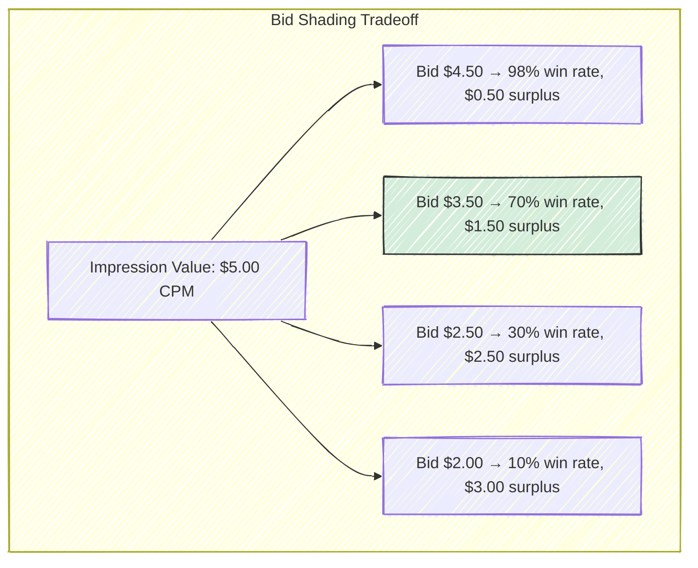

In this example, the bid of $3.50 maximizes expected surplus ($0.70 \times \$1.50 = \$1.05$), even though higher bids win more often and lower bids produce more surplus per win.

The function $W(b)$ is not static --- it varies by publisher, time of day, ad format, and competitive intensity. A premium video placement on a major news site at 8pm has a much steeper win-rate curve (high competition) than a below-the-fold banner on a niche blog at 3am (low competition). Effective bid shading models condition on these features, producing different shading levels for different auction environments. A model that uses a single, universal shade ratio (e.g., always bid 70% of value) will systematically overpay in low-competition settings and lose too many auctions in high-competition settings.

### Approaches to Win Rate Modeling

There are several families of approaches for estimating $W(b)$:

**Logistic regression on win/loss outcomes.** The simplest approach trains a logistic regression model where the features include the bid amount and contextual features (publisher, time of day, ad format), and the label is whether the auction was won. This produces a smooth $W(b)$ curve but does not directly model the market price distribution.

**Survival analysis for censored data.** Since lost auctions provide right-censored observations (the market price exceeded your bid but is unknown), survival analysis models like Kaplan-Meier estimators or Cox proportional hazards regression are natural fits. These explicitly handle censoring in a principled way.

**Neural networks with specialized loss functions.** Deep models can capture complex interactions between features that affect competitive intensity, but they need loss functions that handle both observed (won) and censored (lost) data points. The censored negative log-likelihood loss adapts standard regression losses to account for the asymmetric information.

**Exploration-based approaches.** Some DSPs deliberately submit a small fraction of bids at varying price levels --- sometimes higher than optimal, sometimes lower --- to gather data about the market price distribution in regions of bid space they would not normally explore. This is a classic explore/exploit tradeoff: exploration bids are suboptimal in the short term (you overpay or lose auctions you could have won) but generate valuable training data that improves long-term bid shading accuracy. The fraction of traffic allocated to exploration is typically 1--5%, and the design of the exploration strategy is itself an ML problem (contextual bandits, Thompson sampling).

> **Industry Example**: The Trade Desk was one of the first major DSPs to publish research on bid shading at scale, describing it as the single most impactful ML system in their stack after the transition to first-price auctions. They reported that effective bid shading reduced average clearing prices by 20--30% compared to naive bidding, directly improving advertiser ROI.

## 3.6 Event Tracking: Impressions, Clicks, and Conversions

Once an ad is served, the DSP's job shifts from *buying* to *measuring*. The signals collected after an impression form the training data for every ML model in the system, so the quality and completeness of event tracking directly determine model quality.

The timeline of events following an ad impression spans a wide range:

| Event | Typical Timing | Tracking Mechanism | Data Quality |
|-------|---------------|-------------------|--------------|
| **Impression** | t = 0 | 1x1 tracking pixel loaded in browser | High (nearly deterministic) |
| **Viewability** | t = 0--30s | JavaScript measuring viewport intersection | Moderate (requires JS execution) |
| **Click** | t = 0--300s | Redirect through tracking URL | High (direct user action) |
| **Post-click engagement** | t = 0--600s | Time on landing page, page depth, form interactions | Moderate (requires advertiser-side tracking) |
| **Conversion** | t = 0--30 days | Pixel on advertiser site, server-side API, or mobile postback | Low to moderate (attribution challenges) |

**Viewability** deserves special attention because it bridges the gap between impression delivery and actual human attention. An impression is "viewable" by the IAB/MRC standard if at least 50% of the ad's pixels are visible in the user's viewport for at least one continuous second (two seconds for video). Industry measurements consistently show that 30--40% of served impressions fail to meet this threshold --- the ad loads below the fold and the user never scrolls down, or the user navigates away before the ad finishes rendering. Advertisers increasingly insist on paying only for viewable impressions, which means viewability prediction is itself becoming an ML problem for DSPs.

The long delay between impression and conversion is one of the most important practical challenges in ad ML. A model being trained on today's data cannot yet know which of today's impressions will produce conversions next week. This creates a tension between data freshness (training on recent impressions) and label completeness (waiting long enough for conversions to materialize). Most systems handle this with a **conversion attribution window** --- typically 7 to 30 days --- after which any unobserved conversion is treated as a negative example.

### The Attribution Problem

A user's path to conversion rarely involves a single ad exposure. A typical journey might look like this: a display ad impression on a news site (no click), a search ad on Google (click), a retargeting ad on social media (no click), and finally a direct visit to the advertiser's site resulting in a purchase. Which ad or ads deserve credit for the conversion?

This is the **attribution problem**, and it has no objectively correct answer --- it is fundamentally a question about counterfactuals (what would have happened without each touchpoint?). The industry uses several models:

- **Last-click attribution** gives 100% credit to the last clicked ad. This is simple and was the default for years, but it systematically undervalues awareness-driving channels like display advertising.
- **Linear attribution** divides credit equally among all touchpoints, which is fair but naive about the different roles each touchpoint plays.
- **Time-decay attribution** gives more credit to touchpoints closer in time to the conversion, reflecting the intuition that recent interactions matter more.
- **Data-driven attribution** uses ML --- often Shapley values from cooperative game theory --- to assign credit based on observed data about which combinations of touchpoints are most predictive of conversion. Google and Meta both offer data-driven attribution as a product. The Shapley approach treats each advertising channel as a "player" in a cooperative game, and assigns credit proportional to each channel's marginal contribution across all possible orderings of touchpoints.

In practice, most of the industry still relies on last-click or simple heuristic models, despite the theoretical superiority of data-driven approaches. The reason is partly institutional (last-click is simple to implement and audit) and partly technical (data-driven attribution requires observing the full cross-channel path, which is increasingly difficult in a privacy-constrained environment where cross-site tracking is limited).

> **Key Insight**: Attribution directly affects bidding. If your attribution model gives too much credit to display impressions, your CTR and CVR models will overestimate the value of display opportunities, and the DSP will overbid. If it gives too little credit, you will underbid and lose impressions that are actually driving conversions. Getting attribution right is not just a measurement question --- it feeds back into the entire bidding optimization loop.

## 3.7 The Feedback Loop: From Impression to Model Update

The RTB system is not a linear pipeline but a closed loop. Models make predictions that determine which impressions are bought, and the outcomes of those impressions become the training data for future model updates. This feedback loop has both beneficial and dangerous properties.

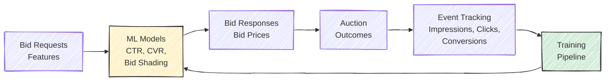

The beneficial property is **continuous improvement**: as the models observe more outcomes, they produce better predictions, which lead to better bidding decisions, which generate more informative training data. The dangerous property is **selection bias**: the models only observe outcomes for impressions they chose to bid on and won. If the model believes a certain publisher is low-value and stops bidding on it, the model never collects data that might reveal the publisher's true value. This is a form of the explore/exploit dilemma familiar from reinforcement learning.

A related concern is **feedback amplification**. If the CTR model slightly overestimates click probability for a particular audience segment, the DSP will bid more aggressively for that segment, win more impressions, and collect more data --- most of which will be negative (non-clicks), confirming that the segment has a low CTR. But because the DSP is now winning a *different* slice of that segment's inventory (more expensive, more competitive auctions), the data is not directly comparable to what it would observe at lower bid levels. These subtle feedback effects can cause model performance to drift in ways that are hard to diagnose.

### Data Volumes and Class Imbalance

The numbers at each stage of the funnel illustrate the extreme sparsity of positive signals. For a mid-size DSP:

| Stage | Daily Volume | Ratio to Prior Stage |
|-------|-------------|---------------------|
| Bid requests received | ~10 billion | --- |
| Bids submitted | ~1 billion | 10% bid rate |
| Impressions won | ~100 million | 10% win rate |
| Clicks observed | ~200,000 | 0.2% CTR |
| Conversions observed | ~10,000 | 5% post-click CVR |

The journey from 10 billion bid requests to 10,000 conversions represents a filtering ratio of one million to one. Training ML models on data this imbalanced requires specialized techniques: negative downsampling (keeping all positive examples but subsampling negatives), focal loss functions, stratified evaluation, and calibration correction (discussed in Chapter 4).

### Update Cadence

Different components of the system update at different frequencies:

- **Online learning models** (e.g., FTRL-Proximal for CTR prediction) can incorporate new data within minutes of an event occurring. This is critical for adapting to intraday shifts in user behavior and competitive dynamics.
- **Batch-retrained models** (e.g., deep CTR models, bid shading models) are typically retrained every few hours to daily, depending on the computational cost of training.
- **Feature engineering and model architecture changes** happen on a timescale of days to weeks, gated by experimentation and A/B testing.

The tension between these timescales is a recurring theme in production systems. An online CTR model that updates every few minutes can adapt to a sudden spike in sports-related ad inventory during the Super Bowl, but it is also vulnerable to short-term noise and feedback loops. A batch-retrained model is more stable but will take hours to adjust to sudden changes. Most production systems use a combination: an online model for rapid adaptation layered with a periodically-retrained batch model that provides more stable long-term estimates.

> **For the RL Engineer**: The feedback loop in RTB has the same structure as the interaction loop in RL: state (bid request) $\to$ action (bid) $\to$ reward (click/conversion). But there are critical differences. The reward is heavily delayed (conversions arrive days later), the action space is continuous, the environment is non-stationary (competitors change strategies), and the agent only observes outcomes for its own actions (no counterfactual data). These challenges make RTB a compelling application domain for offline RL and contextual bandits.

## 3.8 Supply Path Optimization

Not all routes from a publisher's ad slot to a DSP's bidding engine are created equal. The same impression on ESPN's homepage might be available through Google AdX, Magnite, Index Exchange, PubMatic, and several other exchanges simultaneously. Each path carries different floor prices, fee structures, latencies, and data richness. **Supply Path Optimization** (SPO) is the practice of choosing the best path for each impression.

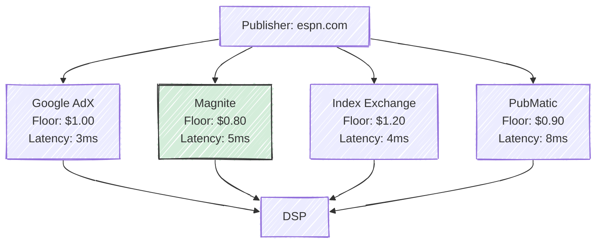

The existence of multiple paths creates both opportunity and waste. A DSP that bids on the same impression through three different exchanges is tripling its infrastructure cost for no additional benefit, and may even end up bidding against itself. Conversely, choosing the cheapest path can save significant money at scale --- the difference between a $0.80 and $1.20 floor price, multiplied by billions of impressions, translates to real dollars.

SPO is increasingly an ML problem. Given the features of an impression (publisher, ad format, time of day), the system predicts which exchange path will yield the best combination of:

- **Lower total cost** (floor price + exchange fees + markup)
- **Lower latency** (critical when every millisecond counts)
- **Higher match rates** (some exchanges provide better cookie sync, yielding richer user data)
- **Better data quality** (more accurate viewability measurement, fewer fraudulent impressions)
- **Deduplicated impressions** (avoiding bidding on the same impression through multiple paths, which wastes compute and risks bidding against yourself)

The deduplication problem is particularly tricky. When the same user on the same page triggers bid requests through three different exchanges within milliseconds, the DSP must recognize these as the same opportunity and bid through only one path. This requires real-time deduplication logic that matches bid requests by publisher, ad slot, timestamp, and user identity --- all within the 10ms decision window.

Alibaba's Mama platform published research on SPO using multi-armed bandits to route traffic across supply sources, demonstrating that intelligent routing reduced effective CPMs by 10--15% compared to uniform allocation across exchanges.

> **Historical Note**: Supply path optimization became a major industry focus around 2019--2020, when studies revealed that the average programmatic dollar passed through 2.5 intermediaries before reaching the publisher, with each intermediary taking a cut. The industry term "tech tax" describes the cumulative fees extracted by ad tech intermediaries, which the ANA (Association of National Advertisers) estimated at roughly 50 cents of every programmatic dollar. SPO is the DSP-side response to this inefficiency.

## 3.9 Privacy and Its Impact on Bidding

The RTB ecosystem was built on a foundation of pervasive user tracking: third-party cookies enabled cross-site behavioral profiling, device IDs allowed mobile user identification, and data brokers stitched together comprehensive user profiles spanning multiple devices and channels. Beginning around 2018, this foundation began to erode, and the industry is still adapting.

### The Privacy Timeline

| Year | Event | Impact |
|------|-------|--------|
| 2018 | GDPR (EU) | Consent required for personal data processing; fines up to 4% of global revenue |
| 2020 | CCPA (California) | Consumer right to know, delete, and opt out of data sales |
| 2021 | Apple ATT (App Tracking Transparency) | Opt-in tracking on iOS; ~75% of users opted out |
| 2023 | Google Topics API | Chrome proposes coarse-grained interest cohorts instead of individual tracking |
| 2024+ | Google Privacy Sandbox (Protected Audiences) | On-device auction for retargeting without server-side user data |

The impact on bidding systems is profound. Before these changes, a DSP could construct rich user profiles by joining cookie data across millions of websites, enabling precise behavioral targeting. A retargeting model could identify that a specific user had visited a particular product page, abandoned a shopping cart, and predict a high conversion probability. After the changes, much of this user-level signal is simply unavailable.

### What Replaces User-Level Signals?

The industry is converging on several approaches to maintain prediction quality without user-level tracking:

**Contextual targeting** predicts user interest from the content of the page rather than the history of the user. A user reading a review of running shoes on a fitness blog is likely interested in athletic footwear, regardless of whether the DSP knows anything about that specific user. This approach has the oldest lineage in advertising (it is how magazine and newspaper ads have always worked) and requires strong NLP models for page content understanding. Companies like GumGum and Oracle Contextual Intelligence have built entire businesses around contextual targeting technology, using computer vision and NLP to analyze page content in real-time.

**First-party data** becomes a major competitive advantage. Advertisers who have their own customer data (purchase history, email lists, loyalty programs) can upload anonymized segments to DSPs for targeting, without relying on third-party cookies. Retailers like Amazon and Walmart have leveraged their first-party data into advertising businesses generating tens of billions in annual revenue. Amazon's advertising business alone surpassed $46 billion in 2023, making it the third-largest digital advertising platform after Google and Meta. This growth is almost entirely driven by the value of Amazon's first-party purchase intent data.

**Clean rooms** have emerged as a privacy-safe mechanism for combining first-party data from different parties. A "data clean room" allows an advertiser (say, an auto manufacturer) and a publisher (say, a streaming service) to match their respective customer lists and find overlapping audiences, without either party revealing their raw data to the other. Platforms like LiveRamp, InfoSum, and the walled gardens' own clean room products (Google Ads Data Hub, Amazon Marketing Cloud) provide this functionality.

**Privacy-preserving ML techniques** including federated learning (training models across distributed devices without centralizing data), differential privacy (adding calibrated noise to prevent individual identification), and on-device inference (running prediction models in the browser or on the phone, so user data never leaves the device) are all areas of active research and deployment.

**Cohort-based prediction** replaces individual user modeling with predictions for groups of users who share similar characteristics. Google's Topics API assigns each user to a small number of broad interest categories (e.g., "Fitness," "Travel") based on recent browsing, and shares only these coarse labels with advertisers. ML models must learn to make useful predictions from these much weaker signals.

The magnitude of the privacy impact is substantial. Meta reported that Apple's App Tracking Transparency (ATT) framework reduced the effectiveness of its ad targeting by an estimated $10 billion in annual revenue in 2022. Smaller DSPs, which relied more heavily on third-party data and had less first-party data to fall back on, were disproportionately affected. The privacy transition is not a future concern --- it is the current operating reality, and it has already reshaped the competitive landscape of ad tech.

> **For the RL Engineer**: The privacy transition is analogous to moving from a fully-observed MDP to a partially-observed one (POMDP). The state space (user features) is becoming noisier and lower-dimensional, the reward signal (conversion tracking) is becoming less reliable, and the action space remains the same. Models that were tuned for information-rich environments must be re-designed for information-poor ones. This is an active research frontier where ideas from robust RL and Bayesian methods have direct application.

## 3.10 Ad Fraud and Invalid Traffic

No discussion of RTB mechanics is complete without addressing ad fraud, which the ANA estimated costs the industry $22 billion annually as of 2023. Ad fraud takes many forms, but the most prevalent in RTB are:

**Bot traffic**: Automated scripts or malware-infected devices that generate fake impressions and clicks. Sophisticated bots mimic human browsing patterns, making detection difficult. A DSP bidding on bot traffic wastes advertiser budget on impressions that no human will ever see.

**Domain spoofing**: A fraudulent publisher misrepresents its domain in the bid request, claiming to be a premium site (e.g., claiming to be nytimes.com while actually being a low-quality clickbait site). The **ads.txt** standard (Authorized Digital Sellers), introduced by the IAB in 2017, mitigates this by allowing publishers to declare which exchanges and sellers are authorized to sell their inventory. DSPs can cross-reference the seller information in the bid request against the publisher's ads.txt file. Its successor, **sellers.json**, provides an even more complete chain of custody from the publisher to the DSP.

**Click injection and click flooding**: In mobile environments, fraudulent apps generate fake click events just before an organic app install, claiming attribution credit for conversions they did not drive. This is particularly insidious because the conversion is real --- an actual user installed the app --- but the click that claims credit is fabricated.

**Ad stacking and pixel stuffing**: Multiple ads are layered on top of each other in a single ad slot, or ads are rendered in 1x1 pixel frames that are technically "served" but invisible to the user. Each generates an impression event, but none receives actual human attention.

For ML engineers, fraud detection is both a classification problem (is this impression/click legitimate?) and a data quality problem (fraudulent events in training data corrupt model learning). If a bot generates fake clicks, the CTR model learns to predict higher click rates for the traffic patterns associated with that bot --- which causes the DSP to bid more for bot traffic, creating a vicious cycle. Many DSPs run pre-bid fraud detection models that filter out suspicious bid requests before they reach the bidding engine, and post-bid verification through third-party vendors like DoubleVerify, IAS (Integral Ad Science), and MOAT.

The arms race between fraud detection and fraud generation is ongoing. Sophisticated fraud operations use residential proxies to mimic real user IP addresses, rotate user agents to appear as different devices, and simulate realistic browsing patterns with JavaScript execution. Detecting these operations requires anomaly detection models that look for statistical irregularities --- unusual click-to-conversion ratios, impossibly fast click times, geographic inconsistencies, or traffic patterns that deviate from known human browsing distributions.

> **For the RL Engineer**: Fraud introduces adversarial dynamics into the RTB environment. Unlike the standard non-stationarity of user behavior, fraud is *intentionally* designed to exploit the patterns that ML models learn. This is structurally similar to adversarial attacks in RL, where an adversary manipulates the environment to degrade the agent's performance. Robust bidding systems must be designed with adversarial robustness in mind.

---

## Exercises

### Conceptual

1. **Censored feedback in first-price vs. second-price.** Explain why the censored feedback problem is strictly harder in first-price auctions than in second-price auctions. What information does the clearing price reveal in each auction format, and how does this affect the training data available for a bid shading model?

2. **Bid request filtering.** A DSP receives 5 billion bid requests per day but only bids on 500 million. Enumerate and prioritize the factors that determine which requests the DSP should skip. Consider both economic factors (expected value vs. cost of evaluation) and technical factors (latency, infrastructure cost).

3. **Delayed conversions.** Explain why a conversion that happens 7 days after an ad impression creates challenges for ML model training. Address at least three specific issues: label delay, attribution ambiguity, and training data pipeline design.

4. **Supply path analysis.** A DSP observes that the same publisher's inventory is available through three exchanges at floor prices of $0.80, $1.00, and $1.20. Is it always optimal to route bids through the exchange with the lowest floor price? Describe scenarios where a higher-floor-price exchange might actually deliver better outcomes.

5. **Privacy regime thought experiment.** Imagine you are building a CTR prediction model for a DSP that operates exclusively in the EU under GDPR, and a significant fraction of bid requests arrive without user consent for personal data processing. How would you redesign the feature engineering pipeline compared to a model that has full access to user data? Which features become more important, and which become unavailable?

6. **Fraud's impact on ML.** A DSP discovers that 15% of its won impressions on a particular exchange are from bot traffic. The fraud was undetected for two weeks, during which the CTR and bid shading models were trained on this corrupted data. Describe the specific ways each model's performance would be affected, and outline a recovery plan.

---

## Further Reading

- Wang, Zhang, and Yuan (2017) --- Chapters 2--4 of *Display Advertising with Real-Time Bidding* provide an excellent technical survey of RTB mechanics (arXiv:1610.03013).
- Yuan, Wang, and Zhao (2013) --- "Real-Time Bidding for Online Advertising: Measurement and Analysis" offers early empirical characterization of RTB auctions.
- Wu et al. (2018) --- "Budget Constrained Bidding by Model-Free Reinforcement Learning in Display Advertising" (CIKM) demonstrates RL-based bid optimization.
- OpenRTB 2.6 Specification --- The IAB Tech Lab standard that defines the bid request/response protocol (iabtechlab.com/standards/openrtb/).
- Google (2019) --- "First Price Auctions in Google Ad Manager" blog post documenting the industry transition.
- ANA (2023) --- "Programmatic Media Supply Chain Transparency Study" documents the flow of programmatic dollars and the "tech tax" extracted by intermediaries.
- Zhu et al. (2017) --- "Optimized Cost per Click in Taobao Display Advertising" (KDD) describes Alibaba's bidding system at scale.
- Muthukrishnan (2009) --- "Ad Exchanges: Research Issues" provides an early academic treatment of the economic and algorithmic questions raised by RTB.
- Balseiro et al. (2015) --- "Repeated Auctions with Budgets in Ad Exchanges: Approximations and Design" (Management Science) formalizes the budget-constrained bidding problem.
- Cai et al. (2017) --- "Real-Time Bidding by Reinforcement Learning in Display Advertising" (WSDM) applies RL to the bid optimization problem with budget constraints.


---

# Chapter 4: CTR Prediction --- The Core ML Problem

*This chapter covers the ML models and techniques used for click-through rate prediction, the most important ML problem in ad tech. We progress from logistic regression and FTRL-Proximal through feature engineering, the GBDT+LR hybrid, Factorization Machines, and Field-Aware FMs. We also cover evaluation metrics with an emphasis on calibration, and the practical realities of training pipelines at scale.*

---

## 4.1 Why CTR Prediction is Central to Everything

Every dollar spent in programmatic advertising flows through a single equation. Whether an advertiser is paying per click, per conversion, or per thousand impressions, the bid that a DSP submits for any given impression depends on its estimate of the probability that a user will click on the ad:

$$
\text{bid} = \text{advertiser\_value} \times p_{\text{CTR}} \times p_{\text{CVR}} \times 1000 \div \text{pacing\_multiplier}
$$

The CTR prediction $p_{\text{CTR}}$ is the most leveraged number in this equation. If a model overestimates CTR by 10%, the DSP systematically overbids by 10%, burning through the advertiser's budget faster than intended and winning auctions at prices above their true value. If it underestimates by 10%, the DSP loses auctions it should have won, delivering fewer impressions and leaving the advertiser's budget unspent. At the scale of a major DSP handling billions of impressions per day, a small improvement in prediction accuracy translates directly to millions of dollars in advertiser value. This is why ad tech companies invest more ML engineering resources in CTR prediction than in almost any other problem.

### The Prediction Task

The CTR prediction task is deceptively simple to state: given a tuple of (user, ad, context) features extracted from a bid request, output $P(\text{click} \mid \text{user, ad, context})$, a value in $[0, 1]$. In practice, this number is extremely small. Typical display ad CTRs range from 0.05% to 0.5%, with an industry average around 0.2%. Search ads, which benefit from strong user intent signals, see higher rates of 1--3%. Rich media and video ads fall somewhere in between.

### What Makes This Problem Hard

Six characteristics make CTR prediction one of the most challenging applied ML problems:

**Extreme class imbalance.** At a 0.2% CTR, 99.8% of training examples are negatives. Naive training on this distribution drowns the positive signal in a sea of non-clicks. Techniques like negative downsampling (discussed in Section 4.6) are essential.

**Massive and sparse feature space.** Features like user ID, ad ID, and publisher domain are categorical with millions of unique values. The cross-product space (user $\times$ ad $\times$ publisher $\times$ time) contains billions of possible combinations, the vast majority of which are never observed in training data.

**Strict latency constraints.** The model must produce a prediction in under 5 milliseconds, at a throughput of millions of queries per second. This rules out many powerful but slow model architectures and places a premium on efficient inference.

**Non-stationarity.** User behavior shifts by hour, day, and season. A model trained on last week's data may be stale by Wednesday. News events, holidays, and competitor actions all cause distributional shift. Models must either be retrained frequently or be designed to adapt online.

**Calibration requirements.** Unlike many ML tasks where ranking quality (AUC) is sufficient, CTR models used for bidding must be well-*calibrated*: when the model predicts 2% CTR, approximately 2% of those impressions should actually receive a click. Poor calibration directly causes overbidding or underbidding.

**Delayed and partial feedback.** Clicks may arrive seconds to minutes after impression, and conversions days later. The model must be trained on data where recent examples may not yet have complete labels.

Taken together, these six challenges mean that CTR prediction is not simply "another classification problem." Standard ML practices --- random train/test splits, fixed feature schemas, batch training, and threshold-based evaluation --- must all be adapted for this domain. The rest of this chapter explores how the industry has addressed each challenge.

> **For the RL Engineer**: If you are accustomed to working with RL environments where reward signals arrive immediately after an action, CTR prediction will feel familiar in structure (state $\to$ action $\to$ reward) but alien in its feedback dynamics. The "reward" (click) is binary, extremely sparse, arrives with variable delay, and the environment (user population, competitor bids) is non-stationary. The closest RL analogue is a contextual bandit with delayed, sparse rewards in a drifting environment.

## 4.2 Logistic Regression: The Enduring Workhorse

Despite two decades of progress in deep learning, logistic regression remains one of the most widely deployed models for CTR prediction in production systems. Google described their production CTR system in the landmark paper by McMahan et al. (KDD, 2013), and at its core was a logistic regression model --- albeit one trained with a sophisticated online learning algorithm on billions of features. The model's staying power is not due to ignorance of alternatives but to a set of properties that are remarkably well-suited to the constraints of ad serving: it is fast at inference, naturally produces calibrated probabilities, is straightforward to update online, and its behavior is interpretable when things go wrong.

### Why Logistic Regression Persists

It is worth pausing to understand *why* logistic regression remains competitive against far more expressive models. The answer lies in the structure of the CTR prediction problem. The feature space is extremely sparse and high-dimensional, with most of the predictive signal concentrated in a small number of highly informative features (historical CTR, retargeting flag, ad position). In this regime, the benefit of capturing complex feature interactions --- the strength of deep models --- is often outweighed by the practical advantages of a simple model: faster inference (critical at millions of QPS), easier debugging (you can inspect individual feature weights), more stable online updates, and better calibration out of the box.

That said, the industry has been gradually moving toward deep models, especially for high-value traffic where the latency budget is more generous (video ads, native ads). The current state of the art in production is often a hybrid: a fast linear or FM model handles the initial filtering and bulk traffic, while a deep model is invoked selectively for the most promising opportunities.

### The Model

Logistic regression models the click probability as:

$$
P(\text{click} = 1 \mid \mathbf{x}) = \sigma(\mathbf{w}^T \mathbf{x}) = \frac{1}{1 + e^{-\mathbf{w}^T \mathbf{x}}}
$$

where $\mathbf{x}$ is a very high-dimensional sparse feature vector and $\mathbf{w}$ is the learned weight vector. The key phrase is *high-dimensional sparse*: the feature vector might have millions of dimensions (one for every possible value of every categorical feature), but for any single impression, only a handful of those dimensions are non-zero. A typical impression activates 10--50 features out of millions.

### Feature Representation: The Hashing Trick

With millions of categorical feature values (user IDs, ad IDs, publisher domains, query terms), explicitly maintaining a vocabulary and one-hot encoding is impractical. The **hashing trick**, popularized by Weinberger et al. (2009) and used extensively in Vowpal Wabbit, maps arbitrary feature strings to a fixed-size index space using a hash function:

$$
\text{index}(\text{feature\_name}, \text{feature\_value}) = \text{hash}(\text{feature\_name} \mathbin{:} \text{feature\_value}) \mod M
$$

where $M$ is the hash table size, typically $2^{20}$ to $2^{30}$ (roughly 1 million to 1 billion buckets). Collisions are inevitable but acceptable: the hash table is large enough that collisions are rare, and when they do occur, they act as a form of implicit regularization by tying together the weights of unrelated features. For rare features (which are the majority in CTR data), this regularization through collision can actually *improve* generalization.

```python
import hashlib

def feature_hash(name: str, value: str, size: int = 2**24) -> int:
    """Map a feature name-value pair to a fixed-size index."""
    raw = f"{name}:{value}"
    h = int(hashlib.md5(raw.encode()).hexdigest(), 16)
    return h % size
```

> **Historical Note**: The hashing trick originated in the natural language processing and spam filtering communities. Its adoption in ad tech was driven by the same scale challenge: when your vocabulary grows unboundedly (new users, new ads, new publishers every day), you need a representation that does not require maintaining an explicit dictionary.

### Training with FTRL-Proximal

The standard batch training approach --- collect data, shuffle, run stochastic gradient descent for several epochs --- does not work well for CTR prediction at scale. The data arrives continuously, the distribution shifts over time, and the dataset is too large to store and reshuffle. Instead, the industry standard for logistic regression CTR models is **online learning**, where the model processes each training example once, in the order it arrives, and immediately updates its weights.

McMahan et al. (2013) at Google introduced **FTRL-Proximal** (Follow-The-Regularized-Leader with Proximal regularization), which became the de facto algorithm for large-scale online CTR prediction. FTRL-Proximal has two properties that make it especially well-suited to this setting:

**Per-coordinate learning rates.** Rather than using a single global learning rate, FTRL-Proximal maintains a separate effective learning rate for each feature. Features that appear in many impressions (e.g., "hour=14," which fires for every impression during the 2pm hour) receive small learning rates, so the model updates them conservatively. Features that appear rarely (e.g., a specific user-ad cross feature) receive large learning rates, allowing the model to learn quickly from limited data. This automatically handles the enormous variation in feature frequencies without manual tuning.

**L1-induced sparsity.** FTRL-Proximal's update rule naturally drives many weights to exactly zero, producing a sparse model. This is critical for both memory efficiency (you only need to store non-zero weights) and serving speed (inference only touches active features). In Google's production system, McMahan et al. reported that FTRL-Proximal models were significantly sparser than models trained with standard SGD, with no loss in accuracy. In their experiments, fewer than 10% of the features in a billion-feature model had non-zero weights, meaning the deployed model consumed a fraction of the memory that a dense representation would require.

The update rule maintains two per-feature accumulators, $z_i$ (gradient accumulator) and $n_i$ (squared gradient accumulator), and computes the weight for feature $i$ lazily at prediction time:

$$
w_i = \begin{cases}
0 & \text{if } |z_i| \leq \lambda_1 \\
-\frac{z_i - \text{sign}(z_i) \cdot \lambda_1}{\frac{1}{\eta_i} + \lambda_2} & \text{otherwise}
\end{cases}
$$

where $\eta_i = \alpha / (\beta + \sqrt{n_i})$ is the per-coordinate learning rate and $\lambda_1$, $\lambda_2$ are L1 and L2 regularization parameters. The threshold $\lambda_1$ in the first case is what produces exact zeros: features with weak accumulated gradient signals are zeroed out entirely.

> **Key Insight**: FTRL-Proximal's per-coordinate learning rates are the unsung hero of large-scale CTR prediction. Consider: the feature "device=iPhone" might appear in 30% of all impressions, while "user=abc123 AND ad=xyz789" might appear once in the entire training set. A single global learning rate cannot serve both features well. FTRL-Proximal solves this elegantly by treating each feature's learning rate as a separate adaptive quantity.

## 4.3 Feature Engineering for CTR

Good features are the single biggest driver of CTR model quality. The 2014 paper from Facebook's ads team (He et al., AdKDD 2014) reported that adding new features consistently produced larger accuracy gains than changing model architectures. While deep learning has narrowed this gap somewhat, feature engineering remains critical, especially for the logistic regression and factorization machine models that handle the bulk of serving traffic.

Features for CTR prediction fall into four broad categories, each with different characteristics and predictive power.

### User Features

User features describe the person who will see the ad. These range from demographic attributes (age bracket, gender, geographic location) to behavioral signals (browsing history, past click behavior, purchase history). The most predictive user feature by far is **historical CTR** --- the user's personal click rate over recent impressions. A user who clicks on 1% of ads they see is ten times more likely to click on the next ad than a user who clicks on 0.1%. Behavioral recency also matters: a user who clicked an ad five minutes ago is in a more engaged state than one whose last click was a week ago.

### Ad and Creative Features

Ad features describe the advertisement itself: the advertiser, the industry vertical, the creative format and dimensions, and the historical performance of this specific ad. An ad's global average CTR is a strong prior --- some ads are simply more compelling than others, and this effect is consistent across users and contexts. A well-designed creative with a compelling call-to-action and relevant imagery can achieve 3--5x the CTR of a generic banner from the same advertiser. Whether the ad is a retargeting creative (showing a product the user previously viewed) is also highly predictive, as discussed below.

### Context Features

Context features describe the environment: which publisher, which page, which ad position, what time of day, what day of the week. Ad position is particularly important --- an ad above the fold (visible without scrolling) receives dramatically more attention than one below the fold, with CTR differences of 2--3x being common. Time features capture diurnal and weekly patterns: CTR for food delivery ads peaks around meal times; CTR for entertainment ads peaks on weekend evenings. Publisher quality varies enormously: a premium news site with high editorial standards typically delivers higher engagement than a content farm, even controlling for audience demographics.

Increasingly, context features also include semantic signals derived from the page content itself. NLP models can analyze the text of an article to determine its topic, sentiment, and brand safety --- for example, an advertiser may not want their ad appearing next to a news story about a product recall or a political controversy. These semantic context features are becoming more important as user-level signals degrade.

### Cross Features: Where the Real Signal Lives

The most powerful features are not individual attributes but *interactions* between them. That a user is a sports enthusiast is mildly predictive. That an ad is for athletic shoes is mildly predictive. But the combination --- a sports enthusiast seeing an athletic shoe ad --- is highly predictive. These cross features capture the *relevance* between user and ad, which is the core signal that CTR models must learn.

The single most predictive cross feature in the industry is the **retargeting flag**: whether the user has previously visited the advertiser's website. A user who browsed Nike's running shoe page yesterday is 10--20x more likely to click a Nike running shoe ad today than a user with no prior Nike engagement. This is why retargeting campaigns command large budgets despite reaching narrow audiences.

Beyond binary retargeting flags, richer user-ad interaction features capture the depth of engagement. Did the user merely land on the homepage, or did they add a specific product to their cart? How recently did they visit? How many times? These gradations of engagement history form a spectrum of predictive power. A user who abandoned a shopping cart 2 hours ago is far more valuable than one who briefly visited the homepage 3 weeks ago, and the CTR model needs features that distinguish these cases.

| Rank | Feature Type | Relative Importance |
|------|-------------|-------------------|
| 1 | Historical user-ad CTR | Highest |
| 2 | Retargeting flag (user visited advertiser site) | Very high |
| 3 | Historical ad-level CTR | High |
| 4 | User recency and frequency | High |
| 5 | Ad position (above/below fold) | Moderate-high |
| 6 | Publisher quality score | Moderate |
| 7 | Time features (hour, day) | Moderate |
| 8 | Device type | Low-moderate |
| 9 | Geographic features | Low |
| 10 | Creative attributes (size, format) | Low |

*Ranking based on empirical findings from He et al. (2014) at Facebook and consistent with broader industry experience.*

> **Key Insight**: The table above reveals an important asymmetry. Behavioral features (rows 1--4), which describe what the user and ad have *done* in the past, are far more predictive than static features (rows 7--10), which describe what they *are*. This is why the privacy changes discussed in Chapter 3 are so disruptive: they primarily degrade behavioral features, which carry the most predictive power.

## 4.4 The GBDT + LR Hybrid: Facebook's Approach

Before diving into Factorization Machines, it is worth examining the approach that Facebook described in their influential 2014 paper (He et al., AdKDD 2014), because it represents a different philosophy for capturing feature interactions: rather than learning interactions end-to-end, use a tree ensemble to *discover* useful feature combinations, then feed those combinations into a linear model.

The idea is simple but effective. A **Gradient Boosted Decision Tree** (GBDT) ensemble is trained on the raw feature set to predict CTR. Each tree in the ensemble partitions the feature space along decision boundaries that correspond to useful feature combinations --- for example, one leaf might capture "mobile user AND evening AND sports publisher," a combination that a linear model would miss without explicit cross-feature engineering. Rather than using the GBDT's predictions directly, each training example is passed through the ensemble, and the *leaf indices* from each tree become binary features for a downstream logistic regression model.

If the GBDT ensemble has $T$ trees and tree $t$ has $L_t$ leaves, the transformation produces a binary feature vector of length $\sum_t L_t$, where exactly $T$ features are active (one leaf per tree). This feature vector captures the non-linear interactions that the trees discovered, while the logistic regression provides calibrated probability estimates and the ability to incorporate additional features (like real-valued or high-cardinality categorical features) that the GBDT handles poorly.

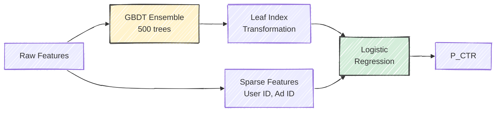

Facebook reported that this hybrid approach improved NE by over 3% relative to either GBDT or LR alone. The approach was particularly effective because it combined the GBDT's ability to discover feature interactions with logistic regression's calibration properties and ability to handle extremely high-cardinality sparse features (like user ID) that tree models struggle with.

The GBDT+LR approach also has a practical advantage: the tree ensemble can be retrained daily on a manageable subset of data (since GBDTs work well on dense features and moderate data sizes), while the downstream logistic regression can be updated more frequently with online learning, incorporating the tree-derived features alongside fresh behavioral signals.

> **Key Insight**: The GBDT+LR hybrid illustrates a broader principle in CTR prediction: the best production systems often combine models with complementary strengths rather than searching for a single perfect model. Trees are good at finding interactions in dense features; linear models are good at handling sparse, high-cardinality features and producing calibrated outputs. Combining them gives you both.

## 4.5 Factorization Machines: Learning Feature Interactions

The fundamental limitation of logistic regression is that it treats each feature independently. If the combination of "male user" and "sports ad" has a higher CTR than either feature alone would predict, you must manually engineer a cross feature to capture this interaction. With millions of feature values, the space of possible pairwise interactions is astronomical, and most specific combinations are never observed in training data.

**Factorization Machines** (FMs), introduced by Steffen Rendle (ICDM, 2010), solve this problem elegantly by learning a low-dimensional latent embedding for each feature value and modeling pairwise interactions as dot products between embeddings.

### The FM Model

The FM prediction equation adds an interaction term to the standard linear model:

$$
\hat{y}(\mathbf{x}) = w_0 + \sum_{i=1}^{d} w_i x_i + \sum_{i=1}^{d} \sum_{j=i+1}^{d} \langle \mathbf{v}_i, \mathbf{v}_j \rangle \, x_i \, x_j
$$

where $w_0$ is a global bias, $w_i$ are linear weights (as in logistic regression), and $\mathbf{v}_i \in \mathbb{R}^k$ is a $k$-dimensional embedding vector for feature $i$. The interaction weight between features $i$ and $j$ is parameterized as the dot product $\langle \mathbf{v}_i, \mathbf{v}_j \rangle$ rather than as an independent parameter $w_{ij}$.

This factored parameterization is the key insight. Instead of learning $O(d^2)$ interaction weights (impossible given the dimensionality), the model learns $O(d \cdot k)$ embedding parameters, where $k$ is typically 8--32. More importantly, the factored structure enables **generalization across interactions**: even if user Alice has never seen ad X, the model can predict their interaction quality because Alice's embedding was learned from her interactions with other ads, and ad X's embedding was learned from other users' interactions with it. The dot product $\langle \mathbf{v}_{\text{Alice}}, \mathbf{v}_X \rangle$ captures the predicted affinity.

> **For the RL Engineer**: If you have worked with matrix factorization in recommender systems, FMs will feel familiar. The key extension is that FMs operate on *arbitrary feature vectors*, not just user-item matrices. Any pair of active features interacts through their embeddings, making FMs applicable to the rich, heterogeneous feature sets in CTR prediction.

### Efficient Computation

The naive computation of all pairwise interactions has complexity $O(k \cdot d^2)$, where $d$ is the number of features. This would be prohibitively expensive. However, Rendle showed that the interaction term can be reformulated:

$$
\sum_{i=1}^{d} \sum_{j=i+1}^{d} \langle \mathbf{v}_i, \mathbf{v}_j \rangle \, x_i \, x_j = \frac{1}{2} \sum_{f=1}^{k} \left[ \left( \sum_{i=1}^{d} v_{i,f} \, x_i \right)^2 - \sum_{i=1}^{d} (v_{i,f} \, x_i)^2 \right]
$$

This reduces the complexity to $O(k \cdot \bar{d})$, where $\bar{d}$ is the number of *non-zero* features in $\mathbf{x}$. Since the feature vector is sparse (typically 10--50 active features per impression), this is extremely efficient --- comparable to linear model inference.

The intuition behind this reformulation is a standard algebraic identity: the sum of all pairwise products can be expressed as half the difference between the square of the sum and the sum of squares. Each of the $k$ latent dimensions contributes independently, so the computation decomposes into $k$ independent passes over the active features.

### Field-Aware Factorization Machines (FFM)

Juan et al. (2016) at Criteo extended FMs with the observation that a feature should interact differently with features from different *fields*. In a standard FM, the embedding for "user=Alice" is the same regardless of whether it is interacting with an ad feature, a publisher feature, or a time feature. In an FFM, Alice has a separate embedding for each field she interacts with:

$$
\hat{y}(\mathbf{x}) = w_0 + \sum_{i} w_i x_i + \sum_{i} \sum_{j>i} \langle \mathbf{v}_{i, f_j}, \mathbf{v}_{j, f_i} \rangle \, x_i \, x_j
$$

where $f_i$ denotes the field of feature $i$, and $\mathbf{v}_{i, f_j}$ is the embedding of feature $i$ when interacting with features from field $f_j$. FFMs won two consecutive Criteo CTR prediction competitions on Kaggle and became widely adopted in production systems, particularly at Criteo and other companies with large-scale display advertising.

The tradeoff is model size: FFMs require $O(d \cdot F \cdot k)$ parameters where $F$ is the number of fields, compared to $O(d \cdot k)$ for FMs. With dozens of fields and millions of features, this can be substantial, but the accuracy gains are consistent.

To make the distinction concrete, consider two features: "user=Alice" (from the user field) and "publisher=ESPN" (from the context field). In an FM, Alice has a single embedding vector $\mathbf{v}_{\text{Alice}}$ used for all interactions. In an FFM, Alice has separate embeddings $\mathbf{v}_{\text{Alice}, \text{ad\_field}}$, $\mathbf{v}_{\text{Alice}, \text{context\_field}}$, and so on. The embedding Alice uses when interacting with an ad feature captures something like "Alice's ad preferences," while the embedding she uses when interacting with a publisher feature captures "Alice's publisher preferences." These can be quite different vectors, capturing different aspects of Alice's behavior.

### From FMs to Deep Learning

The model evolution from logistic regression through FMs and FFMs to deep neural networks follows a clear trajectory: each step adds the ability to capture higher-order and more complex feature interactions. Deep models (Wide & Deep, DeepFM, DCN) can capture arbitrary-order interactions through their hidden layers, but they come with increased inference cost, training complexity, and reduced interpretability. In practice, many production systems maintain a hierarchy: a fast FM or LR model handles the bulk of traffic, while a slower deep model is used for high-value impressions where the additional accuracy justifies the latency cost.

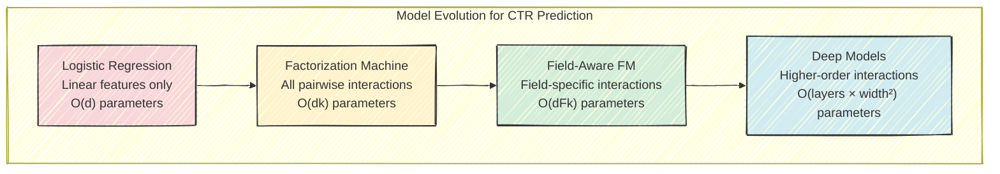

## 4.6 Evaluation Metrics for CTR Models

Evaluating CTR models requires metrics that capture distinct aspects of prediction quality. A model can have excellent ranking ability but terrible probability estimates, or vice versa. In bidding systems, both dimensions matter.

### Log Loss (Binary Cross-Entropy)

The primary training objective and evaluation metric for CTR models is log loss:

$$
\text{LogLoss} = -\frac{1}{N} \sum_{i=1}^{N} \left[ y_i \log(p_i) + (1 - y_i) \log(1 - p_i) \right]
$$

where $y_i \in \{0, 1\}$ is the true label and $p_i$ is the predicted probability. Log loss penalizes confident wrong predictions severely: predicting 0.01 for a true positive incurs a loss of $-\log(0.01) = 4.6$, while predicting 0.5 incurs only $-\log(0.5) = 0.69$.

A natural baseline is the "naive" model that always predicts the base CTR $\bar{y}$. This model achieves a log loss equal to the binary entropy of the base rate: $H(\bar{y}) = -\bar{y} \log \bar{y} - (1 - \bar{y}) \log(1 - \bar{y})$. Any model that does worse than this baseline is actively harmful.

### AUC (Area Under the ROC Curve)

AUC measures ranking quality: the probability that a randomly chosen positive example (clicked impression) receives a higher predicted score than a randomly chosen negative example (non-clicked impression):

$$
\text{AUC} = P\big(f(x^+) > f(x^-)\big)
$$

AUC = 0.5 corresponds to random ranking; good CTR models achieve AUC in the range 0.70--0.85. AUC has the advantage of being threshold-independent and scale-invariant, making it easy to compare across datasets. Its limitation is that it is *insensitive to calibration*. A model that multiplies all predictions by 10 has the same AUC as the original, even though its probability estimates are wildly wrong.

A related metric, **GAUC** (Group AUC), computes AUC separately for each user (or each ad, or each session) and then averages, weighted by group size. GAUC is often a better proxy for online performance because it measures how well the model ranks within the context that matters (which ad is best for *this* user?) rather than globally across all users and contexts. Alibaba reported that GAUC correlated more strongly with online revenue than standard AUC in their CTR models.

### Normalized Entropy

Facebook introduced **Normalized Entropy** (NE) in their 2014 paper as a metric that captures both ranking quality and calibration relative to the base rate:

$$
\text{NE} = \frac{\text{LogLoss}}{H(\bar{y})}
$$

NE = 1.0 means the model is no better than predicting the base rate for every impression. Values below 1.0 indicate improvement. NE is particularly useful for comparing models across datasets with different base rates, since it normalizes out the inherent difficulty set by class imbalance. Facebook reported typical NE values of 0.89--0.93 for their production models, meaning the models captured 7--11% of the predictable information beyond the base rate. This may sound modest, but in a system processing billions of impressions per day, even a 1% relative improvement in NE translates to meaningful revenue gains.

### Calibration: Why It Matters More Than You Think

A model is well-calibrated if, among all impressions where it predicts a 2% CTR, approximately 2% are actually clicked. Formally, calibration requires:

$$
P(y = 1 \mid p(x) = q) = q \quad \text{for all } q \in [0, 1]
$$

In many ML applications, calibration is a nice-to-have. In bidding, it is essential. Recall that bid $= \text{value} \times p_{\text{CTR}} \times 1000$. If $p_{\text{CTR}}$ is systematically 2x too high, the DSP bids 2x too much, wins more auctions than intended, but at ruinous prices. If $p_{\text{CTR}}$ is 2x too low, the DSP loses auctions it should win, underdelivering for the advertiser. The financial impact of miscalibration is direct and immediate.

> **Key Insight**: AUC and calibration measure fundamentally different things. AUC asks "can the model distinguish clickers from non-clickers?" Calibration asks "does the model know *how likely* a click is?" A model with AUC = 0.80 but poor calibration is dangerous for bidding. A model with AUC = 0.75 but excellent calibration may be safer. In production, teams track both metrics and treat calibration drift as an alert-worthy event.

### Calibration Correction for Negative Downsampling

Because of the extreme class imbalance (0.2% positive rate), training on the raw data wastes compute on the overwhelming majority of trivially-classifiable negatives. The standard practice is **negative downsampling**: keep all positive examples (clicks) but randomly subsample negative examples at a rate $r$ (typically 0.01--0.10, i.e., keeping 1--10% of non-clicks).

Downsampling distorts the class balance, causing the model to overestimate probabilities. The correction is straightforward. If $p_{\text{raw}}$ is the model's prediction trained on downsampled data:

$$
p_{\text{corrected}} = \frac{p_{\text{raw}}}{p_{\text{raw}} + (1 - p_{\text{raw}}) / r}
$$

For example, with a downsampling rate $r = 0.1$ and a raw prediction of 0.05:

$$
p_{\text{corrected}} = \frac{0.05}{0.05 + 0.95 / 0.1} = \frac{0.05}{0.05 + 9.5} = 0.00524
$$

This correction restores calibration to the original data distribution and is applied at serving time as a simple post-processing step.

The derivation of this formula comes from Bayes' rule. If the true positive rate is $p$ and we downsample negatives at rate $r$, the apparent positive rate in the training data is $p / (p + r(1-p))$. The correction formula inverts this transformation. It is important to note that downsampling preserves the *ranking* of predictions (AUC is unchanged) but distorts the *calibration* (log loss changes). The correction restores only calibration; if the model was poorly calibrated for other reasons (e.g., underfitting), this formula will not fix those issues.

## 4.7 Training Pipeline at Scale

Building and maintaining a CTR prediction system at production scale involves a pipeline that stretches from raw event logs to deployed model, with numerous practical decisions at each stage.

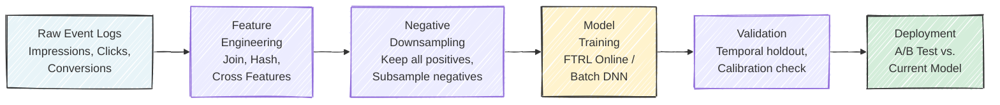

### Feature Engineering at Scale

The feature engineering stage joins impression logs with user profile data, ad metadata, and precomputed aggregates (historical CTRs, publisher quality scores). This join operation is one of the most expensive steps in the pipeline --- it requires looking up data across multiple distributed stores (user profiles, ad metadata, contextual features) and assembling them into a training example. At billion-example scale, this is typically implemented as a distributed MapReduce or Spark job.

Feature frequency filtering is a critical but often overlooked step: features that appear fewer than $k$ times in the training window (common choices are $k = 5$ to $k = 20$) are dropped. Rare features carry little signal and are prone to overfitting --- a feature that appeared once and was associated with a click has a 100% empirical CTR, but this is pure noise. In combination with the hashing trick, frequency filtering keeps the effective feature space manageable.

The join step is also where data quality issues most commonly arise. User profile stores may have stale data (a user's interests from six months ago), ad metadata may not reflect recent creative changes, and timestamp misalignment between different data sources can introduce subtle feature leakage. Experienced teams invest heavily in data validation checks --- comparing feature distributions between training and serving, monitoring for sudden changes in feature coverage rates, and running consistency checks across data sources.

A particularly subtle issue is **train-serve skew**: the features available at training time may differ from those available at serving time. For example, a feature like "user's CTR over the last 7 days" is easy to compute in an offline training pipeline but requires a real-time streaming aggregation system at serving time. If the offline and online computations produce slightly different values (due to different data freshness, different aggregation windows, or different handling of edge cases), the model's offline evaluation will not reflect its online performance.

### Temporal Data Splits: The Most Important Evaluation Decision

One of the most common mistakes in CTR model evaluation is randomly splitting data into train and test sets. Because user behavior and ad campaigns evolve over time, random splits allow future information to leak into the training set. For example, if a new ad campaign launches on Wednesday and achieves unusually high CTR, a random split might include Wednesday examples in the training set, allowing the model to "learn" the campaign's performance before it launches. The correct approach is a **temporal split**: train on data from days 1--6, validate on day 7. This simulates the real deployment scenario where the model must predict tomorrow's clicks based on what it learned from historical data.

Beyond the basic temporal split, teams should also consider **temporal stability**: does the model's performance remain consistent across different validation days, or does it fluctuate wildly? A model that achieves excellent NE on Tuesday but poor NE on Sunday is likely overfitting to specific days' patterns. Evaluating on multiple temporal holdout windows (e.g., each day of a week) gives a more robust estimate of expected online performance.

> **Industry Example**: He et al. (2014) at Facebook reported that their CTR model's NE improved by 3.5% (relative) when they switched from a random holdout to a temporal holdout, because the random holdout was leaking temporal patterns and giving overly optimistic offline metrics.

### Practical Lessons from Production Systems

Several lessons have emerged repeatedly from the experience of teams running CTR models at scale:

**Data freshness often beats model complexity.** A logistic regression retrained hourly frequently outperforms a deep neural network retrained daily. The online world changes fast --- new ads launch, trending topics shift user attention, competitor bid strategies evolve --- and a fresh, simple model captures these shifts better than a stale, complex one. McMahan et al. (2013) at Google emphasized this finding, noting that the recency of training data was the single most important factor in their system's performance.

**Watch for distribution shift.** If the model's average prediction drifts away from the observed CTR, something is wrong. This can be caused by changes in the ad inventory mix, seasonality, browser updates that affect tracking, or data pipeline bugs. Monitoring the ratio of predicted-to-observed CTR (often called the "prediction/actual ratio" or P/A ratio) on a rolling basis is one of the simplest and most valuable production checks.

**Negative downsampling is nearly universal.** Keeping all positive examples and subsampling negatives at 1--10% dramatically reduces training time and data volume, with minimal impact on model quality after calibration correction. This technique is so standard that most production CTR systems are designed around it from the ground up.

**The training pipeline is the model.** In practice, most CTR model bugs are not in the model architecture or training code but in the feature engineering and data pipeline. A join that silently drops 5% of click events, a timestamp bug that shifts features by one hour, or a stale user profile cache can each degrade model quality more than any amount of architectural tuning can recover. Robust data validation and pipeline monitoring are as important as model selection.

### A/B Testing and Safe Deployment

No CTR model is deployed without online validation through A/B testing. The standard practice is to allocate a small fraction of traffic (typically 1--5%) to the new model while the current production model handles the rest, then compare key business metrics: revenue per thousand impressions (RPM), advertiser ROI, CTR, win rate, and budget pacing accuracy.

A common pitfall is evaluating A/B tests using the same metrics as offline evaluation (AUC, log loss). A model with better offline AUC can still perform worse online if its calibration is off, if it interacts poorly with the pacing system, or if it changes the mix of inventory the DSP wins in ways that downstream systems are not designed for. The gold standard is **revenue impact**: does the new model generate more revenue for the DSP while maintaining or improving advertiser satisfaction?

Safe deployment also requires rollback mechanisms. If a new model causes a spike in overbidding (detectable via the P/A ratio) or a drop in win rate within the first few hours, the system should automatically revert to the previous model. Teams at Google and Meta have described automated "model health" monitoring systems that track dozens of real-time metrics and can trigger rollback without human intervention.

> **Industry Example**: McMahan et al. (2013) at Google described a deployment pipeline where new CTR models went through four stages: offline evaluation on historical data, online evaluation on a small traffic slice, gradual ramp-up over several days, and full deployment --- with automated monitoring at each stage. A model that showed even a small regression on any key metric was automatically pulled back.

---

## Exercises

### Conceptual

1. **Calibration vs. ranking.** Explain why calibration is more important for CTR models used in bidding than for CTR models used only for ad ranking (e.g., choosing which ad to show in a fixed slot). In which scenario is AUC sufficient, and why?

2. **Diagnosis exercise.** A CTR model achieves AUC = 0.80, but its average predicted CTR is 0.5% while the actual observed CTR is 0.2%. Diagnose the problem. Is this model safe to use for bidding? What would be the financial consequence of deploying it, and what are two approaches to fix it?

3. **Feature hashing as regularization.** Explain why hash collisions in the hashing trick can actually *help* model generalization for rare features, even though they introduce noise for common features. Under what conditions would collisions be harmful?

4. **FM generalization.** A Factorization Machine has learned embeddings for users $\{A, B, C\}$ and ads $\{X, Y, Z\}$. Users $A$ and $B$ both clicked on ad $X$, and user $B$ clicked on ad $Y$, but user $A$ has never seen ad $Y$. Explain, using the geometry of embedding dot products, why the FM can predict a positive interaction between user $A$ and ad $Y$ --- even with no direct training data for this pair.

5. **Freshness vs. complexity.** Your team is debating two strategies: (a) deploy a logistic regression model retrained every 2 hours via FTRL-Proximal, or (b) deploy a deep neural network retrained daily via batch training. Argue for each side. Under what conditions does each strategy win, and how would you design an experiment to decide between them?

---

## Further Reading

- McMahan et al. (2013) --- "Ad Click Prediction: A View from the Trenches" (KDD). The definitive paper on FTRL-Proximal and production-scale CTR prediction at Google. Essential reading.
- He et al. (2014) --- "Practical Lessons from Predicting Clicks on Ads at Facebook" (AdKDD). Describes the GBDT + logistic regression hybrid that powered Facebook's ad system, with excellent discussion of feature importance and normalized entropy.
- Rendle (2010) --- "Factorization Machines" (ICDM). The original FM paper; a beautiful synthesis of matrix factorization and feature-based prediction.
- Juan et al. (2016) --- "Field-aware Factorization Machines for CTR Prediction" (RecSys). Introduces FFMs and demonstrates their superiority on the Criteo and Avazu datasets.
- Weinberger et al. (2009) --- "Feature Hashing for Large Scale Multitask Learning" (ICML). The theoretical foundation for the hashing trick.
- Cheng et al. (2016) --- "Wide & Deep Learning for Recommender Systems" (DLRS, Google). Combines a wide linear model with a deep neural network, bridging the LR and deep learning approaches.
- Guo et al. (2017) --- "DeepFM: A Factorization-Machine based Neural Network for CTR Prediction" (IJCAI). Unifies FM interaction modeling with deep neural networks.
- Kaggle: Criteo Display Advertising Challenge and Avazu CTR Prediction competitions provide excellent benchmark datasets for experimenting with CTR models.


---

# Chapter 5: Bid Optimization and Pricing

Every time a bid request arrives, a demand-side platform faces a deceptively simple question: *how much is this impression worth, and what should we pay for it?* The answer depends on a cascade of predictions, constraints, and strategic considerations that together form the core of real-time bidding optimization.

This chapter develops the mathematics and systems behind that decision. We begin with the fundamental valuation equation, then layer on the complications that make this problem genuinely hard: first-price auction dynamics, budget constraints, and the shift from naive conversion-based bidding to incremental lift-based approaches. By the end, you will understand why a seemingly straightforward multiplication problem requires some of the most sophisticated optimization machinery in applied ML.

---

## 5.1 The Bidding Decision Pipeline

When an impression opportunity arrives — say, a 728x90 banner slot on espn.com for a user we will call Alice — the bidding system must execute a multi-stage pipeline in under 10 milliseconds. The pipeline transforms raw prediction signals into a final dollar amount.

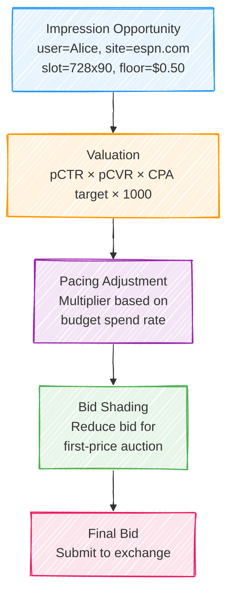

Each stage has its own modeling challenge. Valuation requires accurate predictions of user behavior. Pacing requires solving a constrained optimization problem over time. Bid shading requires estimating the competitive landscape. In practice, all three interact: aggressive pacing increases bids, which changes the optimal shading strategy, which affects budget consumption, which feeds back into pacing.

> **For the RL Engineer**: If this pipeline reminds you of a policy network followed by action shaping and constraints, that is exactly the right intuition. In fact, several production systems now use reinforcement learning to jointly learn bidding policies that internalize all three stages. We will revisit this connection in later chapters.

---

## 5.2 The Fundamental Bidding Equation

The starting point for all bid computation is the *expected value* of an impression to the advertiser. This takes different forms depending on the campaign's pricing model.

For a **CPA (cost-per-acquisition) campaign**, which is the dominant model for performance advertisers:

$$\text{bid}_{\text{CPM}} = \text{CPA}_{\text{target}} \times p(\text{click} \mid x) \times p(\text{convert} \mid \text{click}, x) \times 1000$$

The factor of 1000 converts from a per-impression value to CPM (cost per mille), the standard unit for programmatic bids. For a **CPC (cost-per-click) campaign**:

$$\text{bid}_{\text{CPM}} = \text{CPC}_{\text{target}} \times p(\text{click} \mid x) \times 1000$$

And for a simple **CPM campaign** where the advertiser pays a flat rate per thousand impressions:

$$\text{bid}_{\text{CPM}} = \text{CPM}_{\text{target}}$$

These three cases unify into a single framework:

$$\text{bid} = v(x) \times \mu_{\text{pace}} \times \gamma_{\text{shade}}$$

where $v(x)$ is the impression value given features $x$, $\mu_{\text{pace}} \in [0, 1]$ is the pacing multiplier controlling budget spend rate, and $\gamma_{\text{shade}} \in [0, 1]$ is the bid shading factor for first-price auctions.

> **Key Insight**: The impression value $v(x)$ is a *point estimate* that combines multiple probabilistic predictions. Small calibration errors in any component multiply through the equation. A pCTR model that is systematically 20% too high inflates every bid by 20%, causing the campaign to overspend and win the wrong impressions. This is why calibration — not just ranking quality — is critical for bidding models.

---

## 5.3 The Bid Landscape

The **bid landscape** describes the competitive environment: how does the probability of winning change as you increase your bid? Understanding this landscape is essential for both bid shading and budget allocation.

Formally, the win probability function $w(b \mid x)$ gives the probability of winning an auction with bid $b$ for an impression with features $x$. In a first-price auction, this equals the CDF of the market clearing price distribution:

$$w(b \mid x) = P(\text{market price} \leq b \mid x) = F_{\text{market}}(b \mid x)$$

The typical bid landscape follows a sigmoid-like shape. At very low bids, the win rate is near zero — you are below the floor price or far below any competitor. At very high bids, the win rate approaches one, but you are overpaying. The interesting region is in between, where marginal increases in bid price yield meaningful increases in win probability.

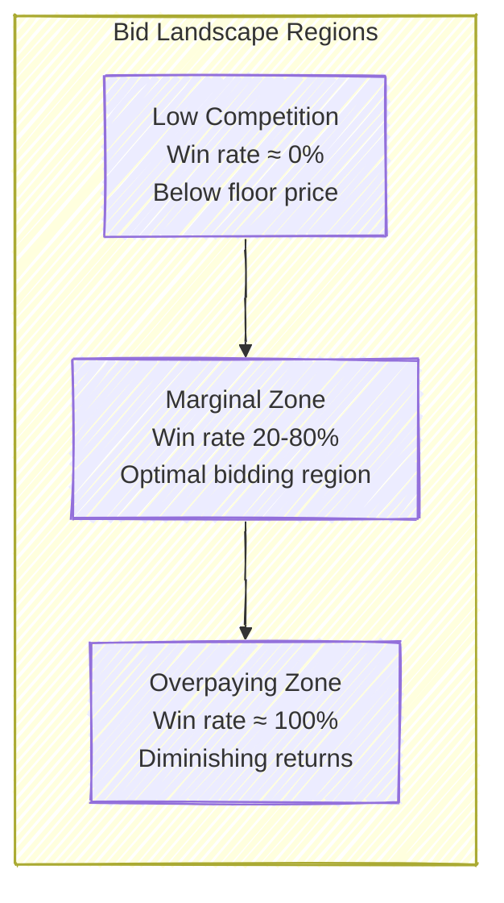

In practice, the market price distribution is often well-approximated by a log-normal distribution, which makes intuitive sense: prices are positive, right-skewed, and multiplicative factors (competition intensity, time of day, user value) combine multiplicatively. If $Z$ is the market clearing price, then:

$$Z \mid x \sim \text{LogNormal}(\mu(x), \sigma(x))$$

where $\mu(x)$ and $\sigma(x)$ depend on impression features — a premium sports site during primetime will have very different parameters than a niche blog at 3 AM.

The **expected surplus** from bidding $b$ when the impression is worth $v$ to us is:

$$\mathbb{E}[\text{surplus}] = w(b) \cdot (v - b)$$

This is the product of two opposing forces: $w(b)$ increases with $b$, but $(v - b)$ decreases. The optimal bid $b^*$ balances these tensions.

> **Industry Example**: The Trade Desk reported that their bid shading algorithms saved advertisers an average of 20-30% on media costs when the industry transitioned from second-price to first-price auctions in 2019. Google's transition of AdX to first-price in September 2019 was a watershed moment that made bid shading table stakes for every DSP.

---

## 5.4 Bid Shading Strategies

In the second-price auction era, truthful bidding was optimal: you bid your true value, and if you win, you pay only the second-highest bid. The transition to first-price auctions changed everything. Now you pay what you bid, which means bidding your true value guarantees zero surplus. Every major DSP needs a bid shading strategy.

### Static Shade Factor

The simplest approach is to multiply every bid by a fixed fraction — say, 0.7. This requires no model and is trivial to implement. However, it ignores the competitive landscape entirely. In a highly competitive auction (many bidders, premium inventory), shading by 30% might cost you the impression. In a thin auction (few bidders, remnant inventory), you might still be overpaying even after shading.

### Competition-Adaptive Shading

Classical auction theory provides an elegant result for symmetric first-price auctions with $n$ bidders whose values are drawn from a common distribution. The Bayes-Nash equilibrium bidding strategy is:

$$b^*(v) = v - \frac{\int_0^v F(t)^{n-1} \, dt}{F(v)^{n-1}}$$

For the special case of uniformly distributed values on $[0, 1]$, this simplifies to:

$$b^*(v) = \frac{n - 1}{n} \cdot v$$

The intuition is beautiful: with more competitors, each bidder shades less because the risk of losing is higher. With 2 bidders, you shade by 50%. With 10 bidders, you shade by only 10%. This explains why competition-adaptive shading, where the system estimates $n$ from historical data, outperforms static shading.

> **Historical Note**: This equilibrium result was first derived by Vickrey (1961) in the same paper that introduced the second-price auction. The Revenue Equivalence Theorem shows that under certain conditions, the expected revenue to the seller is the same regardless of auction format — a result that surprised many practitioners when first-price auctions did not significantly increase publisher revenues.

### ML-Based Bid Shading (Production Approach)

Production systems go far beyond the symmetric model. They train neural networks to predict the minimum winning price for each impression, conditioning on features such as:

| Feature Category | Examples |
|---|---|
| Inventory features | Publisher, ad slot size, position, page category |
| Temporal features | Hour of day, day of week, seasonality |
| User features | Demographics, interests, device type |
| Competition signals | Historical win rates at various price points, number of exchanges |
| Market context | Overall demand level, time until campaign end |

The model is trained on historical auction data, but faces a fundamental challenge: **censored observations**. When you win an auction, you know the market price was *at most* your bid, but not exactly what it was. When you lose, you know the market price was *above* your bid, but again not the exact value. This is a classic survival analysis problem.

The shaded bid is then computed as:

$$b_{\text{shaded}} = \hat{z}(x) + \alpha \cdot \hat{\sigma}(x)$$

where $\hat{z}(x)$ is the predicted market clearing price, $\hat{\sigma}(x)$ is the predicted uncertainty, and $\alpha$ is a risk parameter that controls the tradeoff between winning more auctions and paying less. The final bid is clamped to $[\text{floor price}, v(x)]$.

> **For the RL Engineer**: The censored data problem in bid shading is analogous to partial observability in RL. You only observe the reward (clearing price) when you take a specific action (bid amount), and your observation is one-sided. Techniques from contextual bandits and inverse propensity scoring are directly applicable here.

---

## 5.5 Optimal Bidding Under Budget Constraints

Real campaigns have budgets. An advertiser might allocate \$50,000 per day to a campaign, and the bidding system must spread this budget across millions of impression opportunities to maximize total value. This transforms the bidding problem from a per-impression optimization into a sequential decision problem under resource constraints.

### The Constrained Optimization Problem

Let $t$ index impression opportunities over a campaign's lifetime, and let $v_t$ denote the value of impression $t$ if won. The advertiser wants to maximize net surplus — value captured minus cost paid — subject to the budget:

$$\max_{\{b_t\}} \sum_t (v_t - c_t) \cdot \mathbb{1}[\text{bid}_t \text{ wins}]$$

$$\text{subject to} \quad \sum_t c_t \cdot \mathbb{1}[\text{bid}_t \text{ wins}] \leq B$$

where $c_t$ is the cost of winning impression $t$ (equal to $b_t$ in a first-price auction) and $B$ is the total budget.

### The Lagrangian Approach

The standard approach is Lagrangian relaxation. We introduce a dual variable $\lambda \geq 0$ for the budget constraint:

$$\mathcal{L} = \sum_t \left[ (v_t - c_t) - \lambda \cdot c_t \right] \cdot \mathbb{1}[\text{bid}_t \text{ wins}] + \lambda \cdot B = \sum_t \left[ v_t - (1 + \lambda) c_t \right] \cdot \mathbb{1}[\text{bid}_t \text{ wins}] + \lambda \cdot B$$

The key insight emerges from the KKT conditions. At the optimum, impression $t$ should be won if and only if its value-to-cost ratio exceeds $1 + \lambda$:

$$\frac{v_t}{c_t} > 1 + \lambda$$

This gives the **budget-constrained optimal bid**:

$$b^*(x) = \frac{v(x)}{1 + \lambda}$$

The dual variable $\lambda$ acts as the **shadow price of budget** — it represents the marginal value of one additional dollar of budget. When $\lambda$ is high, budget is scarce and bids are reduced aggressively. When $\lambda$ is low, budget is plentiful and bids approach full value.

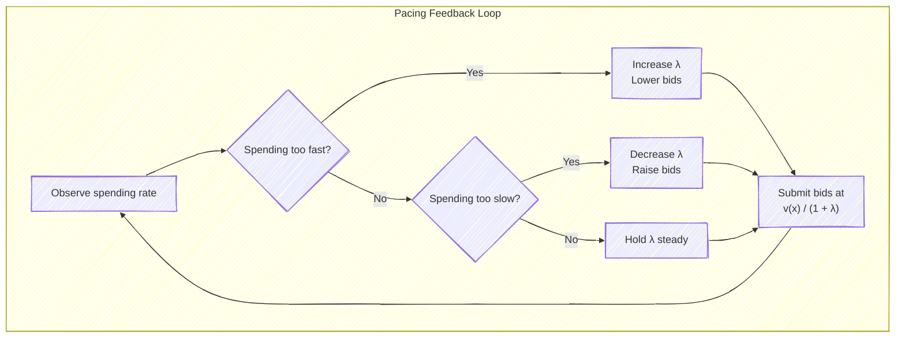

### Online Dual Variable Updates

In practice, $\lambda$ must be updated online as the campaign runs, because the future distribution of impression opportunities is unknown. The standard approach uses gradient ascent on the dual problem:

$$\lambda_{t+1} = \max\left(0, \; \lambda_t + \eta \cdot \left( \text{spend}_t - \text{target\_spend}_t \right) \right)$$

where $\eta$ is a learning rate and $\text{target\_spend}_t$ is the ideal spend for period $t$ (typically $B / T$ for uniform pacing, but can follow a more sophisticated schedule).

The choice of learning rate $\eta$ involves a familiar bias-variance tradeoff. A large $\eta$ tracks short-term fluctuations in supply but causes oscillation. A small $\eta$ is stable but slow to react to sudden changes in competition (e.g., a large competitor entering or leaving the market mid-day).

> **Key Insight**: The dual variable $\lambda$ has a clean economic interpretation. If $\lambda = 0.5$, then one additional dollar of budget would generate \$0.50 in campaign value. This makes $\lambda$ an actionable signal: if $\lambda$ is consistently high across campaigns, the advertiser should increase their budget. If $\lambda \approx 0$, the budget is not a binding constraint and money is being left on the table.

### Pacing Patterns in Practice

Uniform pacing (spend $B/T$ each period) is a reasonable default, but most production systems allow more sophisticated strategies:

| Pacing Strategy | Description | When to Use |
|---|---|---|
| Uniform | Equal spend per period | Default; works well when supply is stationary |
| Front-loaded | Spend more early, less later | When early impressions are higher value (e.g., event-driven campaigns) |
| Audience-based | Spend more when target audience is active | When the target demographic has predictable usage patterns |
| Competitive | Spend more when competition is low | Arbitrage opportunities; requires market intelligence |
| ASAP | Spend as fast as possible | When urgency outweighs efficiency (flash sales, breaking news) |

> **Industry Example**: Meta's delivery system uses a variant of this Lagrangian framework called "pacing control." Their system adjusts $\lambda$ every few minutes based on the discrepancy between actual and target spend. In their 2017 paper, they reported that this approach achieves within 1-2% of the optimal budget utilization for the vast majority of campaigns.

---

## 5.6 Value Estimation: Beyond pCTR × pCVR

The naive value formula $v = \text{CPA}_{\text{target}} \times \text{pCTR} \times \text{pCVR}$ treats every conversion as equally attributable to the ad. This is a significant oversimplification that modern systems are moving beyond.

### Multi-Touch Attribution

In the real world, a user may see ads from the same campaign across multiple channels and touchpoints before converting. A view on connected TV, a click on mobile, and a retargeting impression on desktop might all precede a single purchase. Which impression "caused" the conversion?

Different attribution models assign credit differently:

| Attribution Model | How Credit Is Assigned | Effect on Bidding |
|---|---|---|
| Last-touch | 100% to the last impression before conversion | Overvalues retargeting, undervalues prospecting |
| First-touch | 100% to the first impression | Overvalues awareness, undervalues conversion |
| Linear | Equal credit to all touchpoints | Dilutes signal across many impressions |
| Time-decay | Exponentially more credit to recent touches | Reasonable default; still ignores causality |
| Data-driven | ML model assigns credit based on counterfactuals | Best accuracy; hardest to implement |

The attribution weight modifies the bidding equation:

$$v(x) = \text{CPA}_{\text{target}} \times \text{pCTR}(x) \times \text{pCVR}(x) \times w_{\text{attribution}}(x)$$

where $w_{\text{attribution}}(x)$ depends on the touchpoint type, position in the user journey, and the attribution model in use.

### Incremental Value: Lift-Based Bidding

The most sophisticated approach asks a deeper question: not "will this user convert after seeing the ad?" but "will this user convert *because* of the ad?" This is the difference between **predictive** and **causal** value estimation.

The incremental value of an ad impression is:

$$v_{\text{incremental}}(x) = P(\text{convert} \mid \text{see ad}, x) - P(\text{convert} \mid \text{no ad}, x)$$

The first term is estimable from observational data. The second term — the counterfactual — requires either randomized experiments (public service announcement control groups, ghost bids) or causal inference techniques (instrumental variables, regression discontinuity).

> **Key Insight**: Lift-based bidding fundamentally changes which users are valuable. Consider two users. User A has an 80% conversion probability after seeing the ad, but would convert 79% of the time without it — incremental value is just 1%. User B has a 5% conversion probability with the ad and 0.5% without — incremental value is 4.5%, making them 4.5 times more valuable despite a much lower raw conversion rate. This insight explains why the most advanced DSPs invest heavily in causal inference.

> **Industry Example**: Google's Ghost Ads framework (2015) and Facebook's conversion lift studies both use randomized holdout groups to measure incremental value. Google reported that for some advertisers, over 50% of attributed conversions were organic — meaning naive bidding was dramatically overpaying for users who would have converted anyway.

---

## 5.7 The Multi-Task Prediction Stack

The bidding equation's simplicity belies the complexity of the prediction system that feeds it. A modern DSP's prediction stack produces multiple correlated estimates, each with its own modeling challenges.

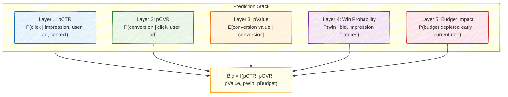

Each layer introduces its own biases and failure modes:

- **pCTR** is trained on massive volumes of impression data, but must handle extreme class imbalance (click rates are typically 0.1-1%).
- **pCVR** suffers from *sample selection bias*: conversions are only observed for clicked impressions, not for the full impression space.
- **pValue** must predict continuous values (revenue amounts) from sparse signals, and is often dominated by heavy-tailed distributions.
- **Win probability** faces the censored data problem discussed in Section 5.4.
- **Budget impact** requires forecasting future supply and demand, which is inherently noisy.

### ESMM: Solving Sample Selection Bias

The sample selection bias in CVR prediction deserves special attention because it is both subtle and impactful. If you train a CVR model only on clicked impressions, the model learns $P(\text{convert} \mid \text{click}, x)$ but on a biased sample — the set of impressions that were clicked is not representative of the full impression space.

Alibaba's **Entire Space Multi-Task Model (ESMM)** addresses this elegantly by decomposing the joint probability:

$$P(\text{click} \cap \text{convert} \mid x) = P(\text{click} \mid x) \times P(\text{convert} \mid \text{click}, x)$$

The left-hand side, $P(\text{click} \cap \text{convert} \mid x)$, can be trained on *all* impressions (the label is 1 if the user both clicked and converted, 0 otherwise). The CTR tower is also trained on all impressions. The CVR tower's parameters are updated through the gradient flowing from the joint probability loss, even though the CVR tower's output represents the conditional $P(\text{convert} \mid \text{click})$. This eliminates the selection bias without requiring any special data collection.

```mermaid
%%{init: {"look": "handDrawn"}}%%
graph TD
    INPUT["Input Features x"] --> SHARED["Shared Embedding Layer"]
    SHARED --> CTR["CTR Tower<br/>P(click | x)"]
    SHARED --> CVR["CVR Tower<br/>P(convert | click, x)"]
    CTR --> MULT["×"]
    CVR --> MULT
    MULT --> PCTCVR["P(click ∩ convert | x)"]

    CTR --> LOSS1["CTR Loss<br/>(trained on all impressions)"]
    PCTCVR --> LOSS2["CTCVR Loss<br/>(trained on all impressions)"]

    style SHARED fill:#e8eaf6,stroke:#3F51B5
    style CTR fill:#e3f2fd,stroke:#1565C0
    style CVR fill:#e8f5e9,stroke:#2E7D32
    style PCTCVR fill:#fff3e0,stroke:#EF6C00
```

> **For the RL Engineer**: The ESMM trick of training on the joint probability to avoid selection bias has parallels in off-policy evaluation in RL. Just as importance sampling corrects for the mismatch between the behavior policy and the target policy, ESMM corrects for the mismatch between the training distribution (all impressions) and the prediction target (CVR conditional on click). The mathematical machinery is different, but the conceptual challenge — learning about one distribution from samples drawn from another — is identical.

---

## 5.8 Putting It All Together

The complete bidding pipeline integrates all the components discussed in this chapter. For a single impression opportunity, the system:

1. Computes the impression value $v(x)$ using the multi-task prediction stack
2. Adjusts for attribution and incrementality if the advertiser supports it
3. Applies the pacing multiplier $v(x) / (1 + \lambda)$ based on the current dual variable
4. Applies bid shading using the predicted market clearing price
5. Enforces floor prices and other auction-specific constraints
6. Submits the final bid to the exchange

```mermaid
%%{init: {"look": "handDrawn"}}%%
sequenceDiagram
    participant Exchange
    participant DSP as DSP Bidder
    participant Pred as Prediction Stack
    participant Pacer as Pacing Controller
    participant Shader as Bid Shader

    Exchange->>DSP: Bid request (user, site, slot)
    DSP->>Pred: Get predictions
    Pred-->>DSP: pCTR, pCVR, pValue
    DSP->>DSP: v(x) = CPA × pCTR × pCVR
    DSP->>Pacer: Get pacing multiplier
    Pacer-->>DSP: λ = 0.4 → mult = 1/(1+λ) = 0.71
    DSP->>DSP: paced_bid = v(x) × 0.71
    DSP->>Shader: Get shading factor
    Shader-->>DSP: shade = 0.82
    DSP->>DSP: final_bid = paced_bid × 0.82
    DSP->>Exchange: Submit bid
```

The entire sequence must complete within the exchange's timeout window, typically 50-100 milliseconds from request receipt to response. This latency constraint is what makes real-time bidding one of the most demanding ML serving environments in production.

---

## Exercises

### Conceptual

1. A campaign has a CPA target of \$40, pCTR = 0.5%, and pCVR = 3%. Calculate the bid in CPM terms. Now assume this is a first-price auction. Would you submit this exact amount? Explain why or why not, and describe qualitatively how much you would shade.

2. Explain the economic interpretation of the dual variable $\lambda$ as the "shadow price of budget." If a campaign manager observes $\lambda = 2.0$ on their campaign, what advice would you give them? What if $\lambda = 0.01$?

3. A retargeting campaign shows high conversion rates (pCVR = 15%) for users who previously visited the product page. Your team proposes bidding aggressively on these users. A colleague argues for lift-based bidding instead. Construct a concrete numerical example demonstrating when the colleague is correct.

4. Consider a DSP that uses a log-normal model for market clearing prices. During a major sporting event, the competitive landscape shifts dramatically. What failure modes might the bid shading model exhibit? How would you design the system to be robust to such distribution shifts?

5. In the ESMM framework, the CVR tower never directly receives a loss signal — it is trained entirely through the gradient of the joint CTCVR loss. Explain intuitively why this works. What would go wrong if you instead trained the CVR tower with its own binary cross-entropy loss on all impressions?

### Practical

6. Implement a simulation of the dual-variable pacing system. Use log-normal distributions for both impression values and market prices, with a sinusoidal multiplier to simulate time-of-day effects. Compare multiplicative update rules ($\lambda_{t+1} = \lambda_t \cdot e^{\eta \cdot g_t}$) versus additive updates ($\lambda_{t+1} = \lambda_t + \eta \cdot g_t$) in terms of budget utilization and total value captured.

7. Using historical auction data (you can simulate this with log-normal distributions), fit a bid landscape model and compute optimal bids for different impression values. Visualize the expected surplus as a function of bid price and shade factor.

---

## Further Reading

- **Vickrey (1961)** — "Counterspeculation, Auctions, and Competitive Sealed Tenders." The foundational paper on auction theory, introducing both the second-price auction and the equilibrium bidding strategy for first-price auctions.
- **Zhang, Yuan, Wang, Shen (2014)** — "Optimal Real-Time Bidding for Display Advertising" (KDD). Formalizes the budget-constrained bidding problem and derives the Lagrangian solution widely used in production.
- **Ren, Zhang, Chang, et al. (2018)** — "Bidding Machine: Learning to Bid for Directly Optimizing Profits in Display Advertising" (IEEE TKDE). Extends optimal bidding theory with practical ML models for bid shading.
- **Ma, Zhao, Huang, et al. (2018)** — "Entire Space Multi-Task Model: An Effective Approach for Estimating Post-Click Conversion Rate" (SIGIR). The ESMM paper from Alibaba solving sample selection bias.
- **Wang, Zhang, Yuan (2017)** — *Display Advertising with Real-Time Bidding*, Chapters 4-5. Comprehensive textbook treatment of bid optimization and budget allocation.
- **Balseiro, Gur (2019)** — "Learning in Repeated Auctions with Budgets" (Management Science). Theoretical foundations for online pacing algorithms with regret guarantees.


---

# Chapter 6: Deep Learning for User Response Prediction

Click-through rate prediction is the engine that drives programmatic advertising. Every bid computation starts with a probability estimate — *will this user click on this ad?* — and the quality of that estimate determines whether billions of dollars in ad spend are allocated efficiently or wasted. This chapter traces the evolution of CTR prediction from logistic regression to the deep learning architectures that power today's largest advertising systems.

The progression is not merely "deeper networks are better." Each architectural innovation addresses a specific, well-defined limitation of its predecessors. Wide & Deep separates memorization from generalization. DeepFM automates feature crossing. DIN introduces ad-aware user representations. Understanding *why* each innovation exists matters more than memorizing the architectures themselves — because the next generation of models will solve the next limitation, and you need to recognize what that limitation is.

---

## 6.1 The Evolution from Shallow to Deep

For most of the 2010s, logistic regression was the workhorse of CTR prediction at scale. It was fast, interpretable, and could handle billions of sparse features through hashing and online learning. Google's 2013 paper on ad click prediction reported using logistic regression with over a billion features, updated via online learning on streams of billions of examples per day.

The limitation was feature interactions. If "user likes basketball" and "ad is for Nike shoes" are both predictive features, their *combination* is far more predictive than either alone. Logistic regression cannot learn this interaction unless a human engineer explicitly creates a cross-feature like "user_likes_basketball AND ad_brand_nike." At Google's scale, engineers maintained thousands of hand-crafted cross-features — a process that was labor-intensive, incomplete, and fragile.

Factorization Machines (Rendle, 2010) offered the first automated solution by modeling all pairwise feature interactions through learned embedding vectors. But they were limited to second-order interactions. The question then became: can we learn arbitrary-order feature interactions automatically?

```mermaid
%%{init: {"look": "handDrawn"}}%%
graph TD
    LR["Logistic Regression<br/><i>Manual cross-features, sparse, interpretable</i><br/>(Google, 2013)"] --> WD["Wide & Deep<br/><i>Memorization + generalization</i><br/>(Google, 2016)"]
    FM["Factorization Machines<br/><i>Automatic 2nd-order interactions</i><br/>(Rendle, 2010)"] --> WD
    WD --> DeepFM["DeepFM<br/><i>FM replaces wide component</i><br/>(Guo et al., 2017)"]
    WD --> DCN["DCN / DCN-V2<br/><i>Explicit cross layers</i><br/>(Google, 2017/2021)"]
    WD --> DIN["DIN / DIEN<br/><i>Attention over user history</i><br/>(Alibaba, 2018/2019)"]
    DeepFM --> DLRM["DLRM<br/><i>Unified embedding architecture</i><br/>(Meta, 2019)"]
    DCN --> DLRM
    DIN --> DLRM
    DLRM --> MTL["Multi-Task Learning<br/><i>ESMM, MMoE, PLE</i><br/>(2018-2021)"]

    style LR fill:#e8eaf6,stroke:#3F51B5
    style FM fill:#e8eaf6,stroke:#3F51B5
    style WD fill:#e3f2fd,stroke:#1565C0
    style DeepFM fill:#e8f5e9,stroke:#2E7D32
    style DCN fill:#e8f5e9,stroke:#2E7D32
    style DIN fill:#e8f5e9,stroke:#2E7D32
    style DLRM fill:#fff3e0,stroke:#EF6C00
    style MTL fill:#fce4ec,stroke:#C62828
```

Each branch of this family tree addresses a different aspect of the problem. The left branch (DeepFM, DCN) focuses on better feature interaction modeling. The right branch (DIN, DIEN) focuses on better user representation. They converge in modern production systems that incorporate ideas from all branches.

---

## 6.2 Wide & Deep (Google, 2016)

Google's Wide & Deep model was introduced not as a research curiosity but as the production ranking system for the Google Play app store. Its design reflects a real tension that Google's engineers observed: **memorization** and **generalization** require fundamentally different model architectures, and a single model struggles to do both well.

**Memorization** means learning that specific feature combinations are predictive. "User installed Netflix AND ad is for Hulu" is a memorized pattern — it works because these two specific apps are competitors. A linear model with cross-product features excels at memorization because each cross-feature has its own independent weight.

**Generalization** means extrapolating to unseen feature combinations. If the model has never seen the combination "User installed Netflix AND ad is for Disney+," it should still predict a high click probability by recognizing the latent structure — both are streaming services. Embedding-based deep networks excel at generalization because similar items end up with similar embeddings.

```mermaid
%%{init: {"look": "handDrawn"}}%%
graph TD
    INPUT["Raw Features<br/>(sparse categorical + dense)"] --> WIDE["Wide Component<br/>(Linear model on cross-product features)"]
    INPUT --> EMB["Embedding Layer<br/>(Dense representations)"]
    EMB --> DEEP["Deep Component<br/>(MLP: 256 → 128 → 64)"]
    WIDE --> SUM["Sum of logits"]
    DEEP --> SUM
    SUM --> OUT["σ(y_wide + y_deep) = P(click)"]

    style WIDE fill:#fff3e0,stroke:#FF9800
    style DEEP fill:#e3f2fd,stroke:#1565C0
    style OUT fill:#e8f5e9,stroke:#4CAF50
```

The wide component computes:

$$y_{\text{wide}} = \mathbf{w}^T [\mathbf{x}, \phi(\mathbf{x})] + b$$

where $\phi(\mathbf{x})$ denotes hand-engineered cross-product features. The deep component passes concatenated embeddings through an MLP:

$$y_{\text{deep}} = \text{MLP}(\text{concat}(e_1, e_2, \ldots, e_k))$$

The final prediction combines both:

$$P(\text{click}) = \sigma(y_{\text{wide}} + y_{\text{deep}})$$

> **Key Insight**: The wide and deep components are trained jointly, which is critical. Joint training means the deep component only needs to complement what the wide component already captures (and vice versa), rather than each independently learning the full prediction function. In practice, this means the wide component can be much smaller than a standalone linear model, and the deep component can be shallower than a standalone DNN.

> **Industry Example**: In the original paper, Google reported a 3.9% improvement in app acquisition rate on Google Play compared to the previous wide-only model. While 3.9% may sound modest, at Google's scale this represented millions of additional app installs per day.

### The Limitation

Wide & Deep's main weakness is that the wide component still requires manual feature engineering — someone must decide which cross-product features to include. This is exactly the labor-intensive process that deep learning was supposed to eliminate.

---

## 6.3 DeepFM (2017)

DeepFM's contribution is conceptually clean: replace the wide component with a Factorization Machine, eliminating all manual feature engineering while preserving the dual memorization-generalization architecture.

A Factorization Machine models all pairwise feature interactions through embedding inner products. For features $x_1, \ldots, x_n$ with embeddings $\mathbf{v}_1, \ldots, \mathbf{v}_n$:

$$y_{\text{FM}} = \underbrace{\sum_i w_i x_i}_{\text{first-order}} + \underbrace{\sum_i \sum_{j>i} \langle \mathbf{v}_i, \mathbf{v}_j \rangle x_i x_j}_{\text{second-order interactions}}$$

The second-order term can be computed efficiently in $O(nk)$ time (where $k$ is the embedding dimension) using the identity:

$$\sum_i \sum_{j>i} \langle \mathbf{v}_i, \mathbf{v}_j \rangle x_i x_j = \frac{1}{2} \left[ \left\| \sum_i x_i \mathbf{v}_i \right\|^2 - \sum_i x_i^2 \left\| \mathbf{v}_i \right\|^2 \right]$$

This avoids the naive $O(n^2 k)$ computation of all pairwise inner products — a crucial optimization when $n$ can be in the thousands.

```mermaid
%%{init: {"look": "handDrawn"}}%%
graph TD
    INPUT["Sparse Input Features"] --> SHARED["Shared Embedding Layer"]
    SHARED --> FM["FM Component<br/>(1st-order + 2nd-order interactions)"]
    SHARED --> DNN["DNN Component<br/>(High-order interactions via MLP)"]
    FM --> SUM["Sum of logits"]
    DNN --> SUM
    SUM --> OUT["σ(y_FM + y_DNN) = P(click)"]

    style SHARED fill:#e8eaf6,stroke:#3F51B5
    style FM fill:#fff3e0,stroke:#FF9800
    style DNN fill:#e3f2fd,stroke:#1565C0
    style OUT fill:#e8f5e9,stroke:#4CAF50
```

The critical design decision in DeepFM is **shared embeddings**: the FM component and the DNN component use the *same* embedding vectors. This means the FM's pairwise interaction learning and the DNN's higher-order pattern learning jointly shape the embedding space, leading to better representations than either would learn independently.

$$P(\text{click}) = \sigma(y_{\text{FM}} + y_{\text{DNN}})$$

> **For the RL Engineer**: If you have worked with value function decomposition in multi-agent RL (e.g., QMIX), the FM's pairwise interaction modeling will feel familiar. Both approximate a high-dimensional joint function by combining lower-order terms — QMIX uses a monotonic mixing network over per-agent utilities, while FM uses inner products over per-feature embeddings.

### Why Not Just Use a Deep Network?

A natural question: if a sufficiently deep MLP can approximate any function, why bother with the FM component at all? The answer is **sample efficiency**. The FM explicitly parameterizes all $O(n^2)$ pairwise interactions with only $O(nk)$ parameters. An MLP must learn these same interactions implicitly from data, requiring far more examples. For rare feature combinations (which dominate in sparse ad data), the FM provides crucial inductive bias.

---

## 6.4 Deep Interest Network (DIN, Alibaba, 2018)

The architectures discussed so far treat user features as a fixed vector. But users are not monolithic — they have diverse, sometimes contradictory interests. A user who recently browsed both running shoes and laptop accessories should be represented differently depending on whether the candidate ad is for Nike sneakers or a laptop bag.

DIN's key innovation is an **attention mechanism** that creates *ad-specific user representations*. Rather than compressing a user's entire behavior history into a single fixed vector, DIN dynamically weights each historical interaction based on its relevance to the current candidate ad.

### The Attention Mechanism

Given a user's behavior history $\{e_1, e_2, \ldots, e_T\}$ (embeddings of items the user has interacted with) and a candidate ad embedding $\mathbf{a}$, DIN computes attention weights:

$$\alpha_i = f(\mathbf{e}_i, \mathbf{a}) = \text{MLP}([\mathbf{e}_i; \mathbf{a}; \mathbf{e}_i - \mathbf{a}; \mathbf{e}_i \odot \mathbf{a}])$$

The user interest representation is then the weighted sum:

$$\mathbf{u}_{\text{interest}} = \sum_i \alpha_i \cdot \mathbf{e}_i$$

This means the same user gets different representations for different ads, which is exactly what we want.

```mermaid
%%{init: {"look": "handDrawn"}}%%
graph TD
    subgraph "User Behavior History"
        H1["Nike Shoes<br/>α = 0.8"]
        H2["Samsung Phone<br/>α = 0.1"]
        H3["Running Socks<br/>α = 0.7"]
        H4["Laptop Bag<br/>α = 0.05"]
    end

    AD["Candidate Ad:<br/>Nike Air Max"]

    AD -.->|attention| H1
    AD -.->|attention| H2
    AD -.->|attention| H3
    AD -.->|attention| H4

    H1 --> WS["Weighted Sum<br/>(ad-specific user interest)"]
    H2 --> WS
    H3 --> WS
    H4 --> WS

    WS --> CONCAT["Concat with ad embedding<br/>+ user profile features"]
    CONCAT --> MLP["MLP"]
    MLP --> OUT["P(click on Nike Air Max)"]

    style AD fill:#fce4ec,stroke:#C62828
    style WS fill:#e8f5e9,stroke:#2E7D32
    style OUT fill:#e3f2fd,stroke:#1565C0
```

Notice how the attention weights in the diagram reflect semantic similarity: Nike shoes and running socks are highly relevant to a Nike Air Max ad, while Samsung phone and laptop bag are nearly irrelevant. The same user would produce very different attention weights if the candidate ad were for a laptop case.

### Why Unnormalized Attention?

In a surprising departure from the standard attention mechanism (which applies softmax to normalize weights to sum to 1), DIN uses **unnormalized attention**. The weights $\alpha_i$ are not passed through softmax.

This is a deliberate design choice with important consequences. Normalized attention (softmax) forces the weights to sum to 1, meaning some behavior items must receive high weight even if *none* of them are relevant to the candidate ad. Unnormalized attention allows the total weight to be small when nothing in the user's history is relevant, effectively encoding a "relevance signal" — how much the user's history matters for this particular ad.

> **Key Insight**: The total attention weight $\sum_i \alpha_i$ acts as an implicit signal of how well-matched the user's interests are to the candidate ad. A high total weight means the user has a rich history of related interactions. A low total weight suggests a mismatch. This information would be lost with softmax normalization.

### From DIN to DIEN

Alibaba extended DIN with the **Deep Interest Evolution Network (DIEN, 2019)**, which models not just *what* the user has interacted with, but *how their interests evolve over time*. DIEN uses an auxiliary GRU to model temporal dynamics in the behavior sequence, with an attention-based GRU (AUGRU) that extracts the interest evolution path relevant to the candidate ad. This matters because a user who browsed running shoes three months ago and laptops yesterday has different intent than one who browsed laptops three months ago and running shoes yesterday.

---

## 6.5 Deep & Cross Network V2 (DCN-V2, Google, 2021)

While DeepFM handles pairwise interactions explicitly and relies on the DNN for higher-order ones, DCN-V2 introduces a more principled approach to learning explicit feature crosses of *arbitrary* order.

### The Cross Layer

The core building block is the cross layer, which applies a specific form of multiplicative interaction:

$$\mathbf{x}_{l+1} = \mathbf{x}_0 \odot (\mathbf{W}_l \mathbf{x}_l + \mathbf{b}_l) + \mathbf{x}_l$$

where $\mathbf{x}_0$ is the original input, $\mathbf{W}_l$ is a full weight matrix, and $\odot$ denotes element-wise multiplication. The element-wise product $\mathbf{x}_0 \odot (\cdot)$ creates new feature crosses by multiplying the original features with transformed versions of the current representation. The residual connection $+ \mathbf{x}_l$ preserves all lower-order terms.

After $L$ cross layers, the network explicitly models interactions up to order $L + 1$. This is more parameter-efficient than hoping an MLP will learn the same interactions implicitly.

### Mixture of Experts for Efficiency

The full weight matrix $\mathbf{W}_l \in \mathbb{R}^{d \times d}$ can be expensive when the input dimension $d$ is large (thousands of concatenated embedding dimensions). DCN-V2 uses a **mixture of low-rank experts** to reduce this cost:

$$\mathbf{W}_l = \sum_{e=1}^{E} g_e(\mathbf{x}_l) \cdot \mathbf{U}_l^{(e)} (\mathbf{V}_l^{(e)})^T$$

where $\mathbf{U}_l^{(e)} \in \mathbb{R}^{d \times r}$ and $\mathbf{V}_l^{(e)} \in \mathbb{R}^{d \times r}$ are low-rank factors with rank $r \ll d$, and $g_e(\mathbf{x}_l)$ are gating weights computed from the input. This reduces the parameter count from $O(d^2)$ to $O(Edr)$ per layer while maintaining expressiveness through the mixture.

```mermaid
%%{init: {"look": "handDrawn"}}%%
graph LR
    subgraph "DCN-V2: Stacked Architecture"
        X0["x₀<br/>(input)"] --> CL1["Cross Layer 1"]
        CL1 --> CL2["Cross Layer 2"]
        CL2 --> CL3["Cross Layer 3"]
        CL3 --> CONCAT["Concat"]
    end

    subgraph "Deep Network"
        X0 --> D1["Dense + ReLU"]
        D1 --> D2["Dense + ReLU"]
        D2 --> D3["Dense + ReLU"]
        D3 --> CONCAT
    end

    CONCAT --> OUT["Output Layer → P(click)"]

    style CL1 fill:#fff3e0,stroke:#FF9800
    style CL2 fill:#fff3e0,stroke:#FF9800
    style CL3 fill:#fff3e0,stroke:#FF9800
    style D1 fill:#e3f2fd,stroke:#1565C0
    style D2 fill:#e3f2fd,stroke:#1565C0
    style D3 fill:#e3f2fd,stroke:#1565C0
```

> **Industry Example**: Google reported that DCN-V2 achieved a 0.6% improvement in offline logloss compared to production DNN models on a proprietary ads dataset. In the online setting, this translated to measurable revenue improvements. They also showed that the stacked variant (cross layers followed by deep layers in sequence, rather than in parallel) slightly outperformed the parallel variant shown above.

---

## 6.6 Production Architecture: Putting the Pieces Together

A production CTR model at a major ad platform is rarely a pure instantiation of any single paper. It is a composite system that draws ideas from multiple architectures, optimized for the specific tradeoffs of the deployment environment.

A typical production model combines:

| Component | Purpose | Derived From |
|---|---|---|
| Large embedding tables | Represent sparse categorical features (user IDs, ad IDs, publisher IDs) | Foundational; all modern architectures |
| Dense feature transformation | Normalize and project continuous features (bid floor, time features) | Standard practice |
| Cross network | Explicit low-order feature interactions | DCN-V2 |
| Deep network | Implicit high-order patterns | Wide & Deep, DeepFM |
| Attention over behavior sequence | Dynamic user interest representation | DIN / DIEN |
| Multi-task heads | Joint prediction of CTR, CVR, engagement | ESMM, MMoE |

```mermaid
%%{init: {"look": "handDrawn"}}%%
graph TD
    subgraph "Input Processing"
        SPARSE["Sparse Features<br/>(user ID, ad ID, publisher, ...)"] --> EMB["Embedding Tables<br/>(billions of parameters)"]
        DENSE["Dense Features<br/>(bid floor, hour, position, ...)"] --> DMLP["Dense MLP (→64 dims)"]
        SEQ["User Behavior Sequence<br/>(last 50 interactions)"] --> SEMB["Sequence Embeddings"]
    end

    subgraph "Feature Interaction"
        EMB --> CONCAT["Concatenate All"]
        DMLP --> CONCAT
        SEMB --> ATT["Attention w.r.t.<br/>Candidate Ad"]
        ATT --> CONCAT
        CONCAT --> CROSS["Cross Network<br/>(3 layers)"]
        CONCAT --> DEEP["Deep Network<br/>(256 → 128)"]
    end

    subgraph "Prediction"
        CROSS --> FINAL["Combine"]
        DEEP --> FINAL
        FINAL --> CTR["P(click)"]
        FINAL --> CVR["P(convert | click)"]
        FINAL --> ENG["P(engage)"]
    end

    style EMB fill:#e8eaf6,stroke:#3F51B5
    style CROSS fill:#fff3e0,stroke:#FF9800
    style DEEP fill:#e3f2fd,stroke:#1565C0
    style ATT fill:#e8f5e9,stroke:#2E7D32
```

The embedding tables are by far the largest component, often containing billions of parameters. Meta's DLRM paper (2019) revealed that embedding tables account for over 99% of the parameters in their production recommendation models, while the MLP layers account for the majority of the computation. This asymmetry has significant implications for system design: embedding lookups are memory-bound, while MLP computation is compute-bound.

> **Industry Example**: Meta's production recommendation system processes hundreds of billions of inference requests per day. Their custom hardware (the ZionEX platform) was designed specifically around the embedding-lookup-dominant access pattern, with high memory bandwidth and large memory capacity prioritized over raw floating-point throughput.

---

## 6.7 Multi-Task Learning for Bidding Predictions

Modern ad systems do not just predict clicks. They predict an entire hierarchy of user responses — click, conversion, purchase value, post-click engagement, video completion, and more — and combine these predictions to compute a bid. Multi-task learning (MTL) trains a single model to produce all of these predictions jointly, sharing representations where beneficial while maintaining task-specific capacity where needed.

### Why Multi-Task?

The pragmatic argument for MTL is resource efficiency: one model is cheaper to serve than five. But the deeper motivation is **transfer learning across tasks**. The CTR prediction task, trained on billions of examples, learns rich user and item representations that benefit the conversion prediction task, which has far fewer positive examples. Information flows from data-rich tasks to data-poor tasks through the shared layers.

### Shared-Bottom vs. Expert-Based Architectures

The simplest MTL architecture shares all lower layers and branches into task-specific "towers" at the top:

```mermaid
%%{init: {"look": "handDrawn"}}%%
graph TD
    INPUT["Shared Input"] --> SHARED["Shared Layers<br/>(embeddings + lower MLP)"]
    SHARED --> T1["CTR Tower"]
    SHARED --> T2["CVR Tower"]
    SHARED --> T3["Engagement Tower"]
    T1 --> P1["P(click)"]
    T2 --> P2["P(convert | click)"]
    T3 --> P3["P(engage)"]

    style SHARED fill:#e8eaf6,stroke:#3F51B5
    style T1 fill:#e3f2fd,stroke:#1565C0
    style T2 fill:#e8f5e9,stroke:#2E7D32
    style T3 fill:#fff3e0,stroke:#EF6C00
```

This works well when tasks are closely related, but suffers from **negative transfer** when tasks conflict — learning features that help CTR prediction might hurt engagement prediction. The **MMoE (Multi-gate Mixture of Experts)** architecture from Google (2018) addresses this by replacing the shared layers with multiple expert subnetworks, each task using a learned gating network to select which experts to attend to:

$$\mathbf{h}_{\text{task}_k} = \sum_{e=1}^{E} g_k^{(e)}(\mathbf{x}) \cdot f_e(\mathbf{x})$$

where $f_e$ is the $e$-th expert network, $g_k^{(e)}$ is the gating weight for task $k$ on expert $e$, and the gating weights are produced by a softmax over a learned linear projection of the input.

Tencent's **PLE (Progressive Layered Extraction, 2020)** goes further by introducing task-specific expert networks alongside shared experts, with multiple extraction layers that progressively separate shared and task-specific representations.

> **For the RL Engineer**: Multi-task learning in CTR prediction is analogous to multi-objective RL, where a single policy must optimize multiple reward signals simultaneously. The "negative transfer" problem in MTL corresponds to the Pareto frontier in multi-objective optimization — improving one objective may require degrading another. MMoE's gating mechanism plays a similar role to reward weighting schemes in multi-objective RL.

---

## 6.8 Model Serving at Scale

A production CTR model must deliver predictions within a strict latency budget. In a typical real-time bidding pipeline, the total response time is 50-100 milliseconds, and model inference gets only a fraction of that.

| Pipeline Stage | Typical Latency |
|---|---|
| Network round-trip | 30 ms |
| Feature extraction & lookup | 10-15 ms |
| **Model inference** | **3-5 ms** |
| Bid logic & response | 5-10 ms |
| Buffer | 10-40 ms |

Achieving sub-5ms inference for a model with billions of parameters requires a toolkit of serving optimizations:

**Model distillation** trains a smaller "student" model to mimic the predictions of a large "teacher" model. The student trains not on hard labels but on the teacher's soft probability outputs, which contain richer information (a prediction of 0.03 vs. 0.07 tells the student about relative difficulty even though both round to "no click"). Hinton et al. (2015) showed that distillation can compress models by 10-100x with minimal accuracy loss.

**Quantization** converts model weights from FP32 to INT8 or even INT4, reducing memory footprint and enabling faster integer arithmetic. For embedding tables (which dominate memory), quantization from FP32 to INT8 provides a 4x memory reduction with typically less than 0.1% degradation in AUC.

**Feature caching** pre-computes expensive features (e.g., user behavior aggregations) and stores them in low-latency stores like Redis or Memcached. User features that change slowly (demographics, long-term interests) can be cached for minutes or hours, while context features (current page, time) must be computed fresh.

**Cascading** uses a lightweight model (perhaps logistic regression) to quickly filter out impression-ad pairs that are clearly irrelevant, applying the expensive deep model only to competitive candidates. This can reduce the number of full model evaluations by 80-90%.

> **Industry Example**: Alibaba's production serving system processes over 100 million model inferences per second during peak traffic (Singles' Day). They use a combination of model distillation, INT8 quantization, and custom FPGA accelerators to maintain sub-5ms p99 latency. Their 2020 paper on COLD (Computing power cost-aware Online and Lightweight Deep model) describes how they dynamically adjust model complexity based on real-time latency measurements.

---

## 6.9 Calibration: Why Ranking Is Not Enough

A subtle but critical requirement for CTR models in bidding is **calibration** — the predicted probabilities must be accurate in an absolute sense, not just in ranking. If your model predicts a 2% click probability, approximately 2% of impressions with that score should actually be clicked.

Most ML practitioners focus on ranking metrics (AUC, NDCG), but in bidding, the predicted probability is multiplied by a dollar amount to produce a bid. A model with perfect AUC but systematically 2x overconfident will generate bids that are 2x too high, causing the campaign to overspend and win expensive, low-ROI impressions.

Calibration is typically measured using **expected calibration error (ECE)**: partition predictions into bins, and for each bin compare the average predicted probability to the actual positive rate. Common post-hoc calibration methods include:

- **Platt scaling**: fit a logistic regression on top of model scores using a held-out set
- **Isotonic regression**: fit a non-parametric monotonic function from scores to calibrated probabilities
- **Temperature scaling**: divide logits by a learned temperature parameter $T$ before the sigmoid

In practice, calibration is monitored continuously in production because it drifts as user behavior, ad inventory, and competition change. Many teams apply daily or hourly recalibration using the most recent data.

> **Key Insight**: A well-calibrated model is not necessarily well-ranked, and a well-ranked model is not necessarily well-calibrated. For bidding, you need both. AUC ensures you bid more on better impressions. Calibration ensures you bid the right *amount*. Most production systems optimize for AUC during training and apply calibration as a post-processing step.

---

## Exercises

### Conceptual

1. Why does DIN use unnormalized attention weights instead of applying softmax? Describe a concrete scenario where normalized attention would produce a worse user representation than unnormalized attention.

2. Compare DeepFM and Wide & Deep from the perspective of feature engineering effort. What manual work does DeepFM eliminate? Are there any scenarios where Wide & Deep's manual cross-features might outperform DeepFM's automatic interactions?

3. Explain the sample selection bias problem in CVR prediction. Why does training a CVR model only on clicked impressions produce biased estimates? How does ESMM's training procedure avoid this bias?

4. A colleague proposes replacing the entire CTR prediction stack with a single large transformer model. What advantages might this approach have? What practical challenges would you face in deploying it within a 5ms latency budget? Consider both the embedding table size and the attention mechanism's computational cost.

5. You observe that your production CTR model has an AUC of 0.78, which is competitive with published benchmarks, but your campaigns are consistently overspending their budgets by 15-20%. What is the most likely root cause, and how would you diagnose and fix it?

### Practical

6. Implement the FM interaction computation using the efficient $O(nk)$ formulation (sum-of-squares minus square-of-sums). Verify numerically that it produces the same result as the naive $O(n^2 k)$ pairwise computation.

7. Build a two-tower ESMM model and compare its CVR predictions against a single-tower model trained only on clicked impressions. Use synthetic data where you control the selection bias (e.g., the click model is correlated with but different from the conversion model). Measure calibration error, not just AUC.

---

## Further Reading

- **Cheng et al. (2016)** — "Wide & Deep Learning for Recommender Systems" (arXiv:1606.07792). The foundational architecture paper from Google, with production results from Google Play.
- **Guo et al. (2017)** — "DeepFM: A Factorization-Machine based Neural Network for CTR Prediction" (arXiv:1703.04247). Replaces wide component with FM; introduces shared embeddings.
- **Zhou et al. (2018)** — "Deep Interest Network for Click-Through Rate Prediction" (KDD, arXiv:1706.06978). Alibaba's attention-based architecture for user behavior modeling.
- **Wang et al. (2021)** — "DCN V2: Improved Deep & Cross Network" (arXiv:2008.13535). Google's mixture-of-experts approach to explicit feature crossing.
- **Naumov et al. (2019)** — "Deep Learning Recommendation Model for Personalization and Recommendation Systems" (arXiv:1906.00091). Meta's DLRM architecture and analysis of the embedding-compute asymmetry.
- **Ma et al. (2018)** — "Modeling Task Relationships in Multi-task Learning with Multi-gate Mixture-of-Experts" (KDD). The MMoE architecture for multi-task learning.
- **Ma, Zhao, Huang et al. (2018)** — "Entire Space Multi-Task Model" (SIGIR). Alibaba's solution to CVR sample selection bias.
- **Tang et al. (2020)** — "Progressive Layered Extraction: A Novel Multi-Task Learning Model for Personalized Recommendations" (RecSys). Tencent's PLE architecture extending MMoE.


---

# Chapter 7: Formulating Bidding as a Reinforcement Learning Problem

---

## 7.1 Why Reinforcement Learning for Bidding?

The preceding chapters established how machine learning models predict click-through rates and conversion probabilities, and how those predictions feed into bid calculations. A natural question arises: if we can already compute an optimal bid for each impression as $b^* = v \cdot p(\text{click}) \cdot p(\text{conversion})$, why do we need reinforcement learning at all?

The answer lies in a single word: **budget**. A campaign with unlimited funds could bid optimally on each impression in isolation -- the myopic approach would be globally optimal. But real campaigns operate under hard budget constraints, and this changes everything. Each dollar spent on one impression is a dollar unavailable for future impressions. Today's bid decision constrains tomorrow's possibilities. This temporal coupling transforms bidding from a collection of independent optimization problems into a single sequential decision-making problem -- precisely the setting where RL excels.

Consider a concrete scenario. A campaign with a $10,000 daily budget starts at midnight. A greedy bidder, applying the value-based formula to each impression independently, discovers a cluster of high-value users browsing luxury goods at 7 AM and aggressively wins those impressions. By noon, 80% of the budget is spent. When an even more valuable cohort appears during the evening prime-time hours, the campaign can only participate in a fraction of the auctions. The greedy policy was locally rational at every decision point but globally suboptimal.

An RL agent, by contrast, learns to reason about the entire campaign trajectory. It might bid conservatively during the morning, preserving budget for the high-value evening hours it has learned to anticipate. This kind of temporal reasoning -- trading off immediate value against future opportunity -- is the hallmark of sequential decision-making and the core value proposition of RL for bidding.

> **For the RL Engineer**: You already know that RL shines when actions have long-term consequences. In bidding, the coupling mechanism is simple and concrete: the budget. Unlike robotics where dynamics are complex, or game-playing where the state space is enormous, bidding RL operates in a relatively low-dimensional state space with a very clear source of temporal dependence. The challenge is not in the MDP structure itself but in the practical constraints: you cannot explore freely (real money is at stake), the environment is non-stationary (competitors adapt), and feedback is censored (you only observe market prices for auctions you win).

### What Makes Bidding a Natural RL Problem

| RL Property | How It Manifests in Bidding |
|---|---|
| Sequential decisions | Thousands to millions of bid decisions per campaign per day |
| State dependence on history | Remaining budget is a function of all prior bids and outcomes |
| Delayed rewards | Conversions may occur hours or days after the initial impression |
| Need for exploration | The bid landscape (how win rate and cost vary with bid level) must be learned |
| Non-stationary environment | Competitor strategies, user behavior, and inventory composition shift over time |
| Hard constraints | Budget limits, CPA/ROAS targets, delivery pacing requirements |

> **Key Insight**: The critical distinction between ML-based bidding and RL-based bidding is not better prediction -- it is better *planning*. ML gives you better estimates of each impression's value; RL gives you a strategy for allocating a scarce resource (budget) across those impressions over time.


## 7.2 The Bidding MDP: Formal Formulation

We now formalize the bidding problem as a Markov Decision Process $(\mathcal{S}, \mathcal{A}, \mathcal{P}, \mathcal{R}, \gamma)$. While RL practitioners will find this formulation familiar in structure, the design choices within each component are what distinguish bidding from other RL domains.

### State Space

The state must capture enough information for the agent to make informed bid decisions. In practice, this means encoding three categories of information: the campaign's resource status, the current market context, and the impression opportunity at hand.

**Resource state** tracks where the campaign stands relative to its goals:

$$s_{\text{resource}} = \left(\frac{B_{\text{remaining}}}{B_{\text{total}}},\; \frac{T_{\text{remaining}}}{T_{\text{total}}},\; \frac{\text{impressions}_{\text{won}}}{\text{impressions}_{\text{target}}},\; \text{CPA}_{\text{running}},\; \text{CTR}_{\text{running}}\right)$$

**Market state** summarizes recent competitive dynamics:

$$s_{\text{market}} = \left(\bar{p}_{\text{win}}^{(\text{recent})},\; w_{\text{rate}}^{(\text{recent})},\; \sigma_p^{(\text{recent})}\right)$$

where $\bar{p}_{\text{win}}^{(\text{recent})}$ is the average winning price in a recent window, $w_{\text{rate}}$ is the recent win rate, and $\sigma_p$ captures price volatility.

**Impression features** describe the current opportunity:

$$s_{\text{impression}} = \left(\hat{p}(\text{click}),\; \hat{p}(\text{conversion}),\; p_{\text{floor}},\; x_{\text{user}},\; x_{\text{context}}\right)$$

The full state vector is the concatenation of these components: $s_t = [s_{\text{resource}}; s_{\text{market}}; s_{\text{impression}}]$.

> **Industry Example**: Alibaba's DRLB system (Zhao et al., 2018) operates at *hourly* granularity rather than per-impression. Their state vector includes the budget consumption ratio, time remaining ratio, average predicted CTR in the current hour, average market price, and a one-hot encoding of the hour of day. This dramatically reduces the effective episode length from millions of impressions to 24 time steps.

#### Per-Impression vs. Aggregate Formulations

This architectural choice -- at what temporal granularity the RL agent operates -- is one of the most consequential design decisions, and different research groups have reached different conclusions.

| Formulation | Granularity | State Dim | Episode Length | Credit Assignment |
|---|---|---|---|---|
| Per-impression (Cai et al., 2017) | Each auction | ~20 | ~100K+ | Direct but noisy |
| Hourly aggregate (Zhao et al., 2018) | Hourly periods | ~10 | 24 | Smoother but delayed |
| Hierarchical (industry practice) | Both | Varies | 24 (strategic) | Best of both worlds |

The per-impression formulation gives the agent fine-grained control but creates extremely long episodes (a campaign might participate in hundreds of thousands of auctions per day). Long episodes make credit assignment difficult: did a conversion at hour 18 result from a bidding decision at hour 3, or hour 17? The curse of horizon makes learning slow and unstable.

The aggregate formulation sidesteps this by having the RL agent make a *strategic* decision once per time period (e.g., set a pacing parameter for the next hour), while a simpler rule-based system executes individual bids within that period. This hierarchical approach has become the dominant paradigm in industry. The RL agent learns temporal allocation strategy, while per-impression logic handles tactical execution.

> **For the RL Engineer**: If you are coming from Atari or MuJoCo, you are accustomed to episodes of a few hundred to a few thousand steps. Per-impression bidding can produce episodes of $10^5$ to $10^6$ steps. The aggregate formulation brings this back to a manageable 24-48 steps, at the cost of coarser control. In practice, the coarser formulation often performs comparably because the strategic allocation decision (how to distribute budget across hours) dominates the tactical decision (exactly how much to bid on a specific impression).


### Action Space

The action space defines what the agent controls. Three principal designs appear in the literature, each with distinct tradeoffs.

**Discrete bid multipliers.** The agent selects from a predefined set of multipliers applied to a base bid:

$$a_t \in \{m_1, m_2, \ldots, m_K\}, \quad b_t = m_{a_t} \cdot b_{\text{base}}(s_t)$$

A typical set might be $\{0.0, 0.2, 0.5, 0.8, 1.0, 1.2, 1.5, 2.0, 3.0\}$, where $m = 0$ means skipping the impression and $m > 1$ means bidding aggressively above the base value. This formulation is compatible with DQN-family algorithms and was used in the original Cai et al. (2017) work. The drawback is that discretization introduces quantization error -- the optimal multiplier may lie between two discrete levels.

**Continuous bid multiplier.** The agent outputs a real-valued multiplier:

$$a_t \in [0, m_{\max}], \quad b_t = a_t \cdot b_{\text{base}}(s_t)$$

This eliminates quantization error and is natural for actor-critic methods like DDPG, TD3, or SAC. However, continuous action spaces introduce their own challenges: the policy must be carefully bounded (negative bids are meaningless), and exploration requires noise injection rather than simple epsilon-greedy strategies.

**Pacing parameter (dual variable) adjustment.** Rather than directly controlling bids, the agent adjusts a pacing parameter $\lambda$ that modulates all bids through a formula:

$$b_t = \frac{v_t}{1 + \lambda_t}$$

where $v_t$ is the estimated impression value. The RL agent's action is a delta adjustment: $\lambda_{t+1} = \lambda_t + \Delta\lambda_t$. This formulation has a strong connection to the Lagrangian dual of the constrained optimization problem and is theoretically well-motivated. It is particularly common in the aggregate (hourly) formulation, where the agent sets $\lambda$ for an entire time period.

```mermaid
%%{init: {"look": "handDrawn"}}%%
graph LR
    subgraph "Action Space Designs"
        A["Discrete Multiplier<br/>a ∈ {0, 0.5, 1.0, 1.5, 2.0}"]
        B["Continuous Multiplier<br/>a ∈ [0, 3.0]"]
        C["Lambda Adjustment<br/>Δλ ∈ [-0.1, 0.1]"]
    end
    
    A -->|"Compatible with"| D[DQN, Dueling DQN]
    B -->|"Compatible with"| E[DDPG, TD3, SAC]
    C -->|"Compatible with"| F[Any algorithm<br/>Theoretically grounded]
    
    style A fill:#e1f5fe
    style B fill:#f3e5f5
    style C fill:#e8f5e9
```

> **Key Insight**: The pacing parameter formulation is particularly elegant because it directly connects to the economic structure of the problem. In the Lagrangian relaxation of the budget-constrained bidding problem, $\lambda$ is exactly the dual variable associated with the budget constraint. Its value represents the *shadow price* of budget -- how much one additional dollar of budget would be worth. The RL agent is learning the time-varying optimal shadow price.


### Reward Function

Reward design is arguably the most critical and subtle component of the bidding MDP. A poorly designed reward can lead an agent to learn policies that are locally rewarding but globally catastrophic -- spending the entire budget in the first hour on low-value impressions, for instance.

**The naive approach** rewards the agent for winning impressions:

$$r_t = \begin{cases} v_t & \text{if auction won} \\ 0 & \text{otherwise} \end{cases}$$

This is problematic under budget constraints because the agent has no incentive to conserve budget. It will learn to bid aggressively on every impression, exhausting the budget as quickly as possible.

**The surplus reward** accounts for cost:

$$r_t = \begin{cases} v_t - c_t & \text{if auction won} \\ 0 & \text{otherwise} \end{cases}$$

where $c_t$ is the payment. This is better -- the agent now prefers impressions where value exceeds cost -- but it still treats each impression independently without considering the opportunity cost of budget depletion.

**The Lagrangian reward** is the most principled approach and the most widely used in practice:

$$r_t = v_t \cdot \mathbb{1}[\text{win}] - \lambda_B \cdot c_t \cdot \mathbb{1}[\text{win}] - \lambda_{\text{CPA}} \cdot \max\left(0, \frac{c_t}{v_t} - \text{CPA}_{\text{target}}\right)$$

Here, $\lambda_B$ is the Lagrange multiplier for the budget constraint and $\lambda_{\text{CPA}}$ penalizes CPA constraint violations. These multipliers are themselves learned (via dual gradient ascent) or adapted during training.

> **Key Insight**: Wu et al. (2018) articulated a foundational principle: "The immediate reward from the environment is misleading under a critical resource constraint." The reward signal must encode the *opportunity cost* of spending budget now versus later. The Lagrangian multiplier $\lambda_B$ serves exactly this purpose -- it represents the price of consuming one unit of budget, making the agent internalize the scarcity of its resources.

**Reward shaping for faster learning.** Beyond the core reward, practitioners often add shaping terms to accelerate convergence. Common additions include a small penalty for budget under-utilization (the campaign should spend its full budget by day's end), a bonus for smooth pacing (avoiding feast-or-famine patterns), and intermediate rewards at each time period based on cumulative performance metrics. These must be designed carefully to avoid introducing unintended incentives.

The table below summarizes the progression of reward designs and their properties:

| Reward Design | Formula | Incentive | Failure Mode |
|---|---|---|---|
| Naive value | $r = v \cdot \mathbb{1}[\text{win}]$ | Win everything | Exhausts budget immediately |
| Surplus | $r = (v - c) \cdot \mathbb{1}[\text{win}]$ | Win profitable impressions | Ignores opportunity cost of budget |
| Budget-shaped | $r = v - c \cdot (1 + T_{\text{rem}} / B_{\text{rem}})$ | Penalize spending when budget is scarce | Heuristic, not principled |
| Lagrangian | $r = v - \lambda_B c - \lambda_{\text{CPA}} \cdot g(\text{CPA})$ | Internalize resource scarcity | Requires learning dual variables |

> **For the RL Engineer**: If you have designed reward functions for robotics or game-playing, note a key difference in bidding: the reward must encode *economic scarcity*, not just task completion. A robotics reward that penalizes energy use is analogous, but in bidding the scarce resource (budget) is a hard constraint, not a soft penalty. The Lagrangian approach bridges this gap by making the penalty weight itself a learned quantity that adapts to the degree of constraint tightness.


### Transition Dynamics

The transition function $\mathcal{P}(s_{t+1} | s_t, a_t)$ in the bidding MDP has several distinctive properties.

**Partially deterministic, partially stochastic.** Some state components update deterministically given the action and outcome: if the agent bids $b_t$ and wins at price $c_t$, the remaining budget updates as $B_{t+1} = B_t - c_t$. Other components are stochastic: whether the user clicks, whether they convert, and what market price the competitors set are all random.

**Censored observations.** In a first-price auction, the agent observes the outcome (win or lose) but when it loses, it typically does *not* observe the winning price. This is censored feedback -- the agent knows its bid was too low but not by how much. In second-price auctions, the winning bidder observes the second-highest bid (which it pays), but losing bidders observe nothing. This censoring complicates the learning of market price distributions.

**Exogenous dynamics.** The passage of time, changes in user behavior, and shifts in competitor strategy all influence state transitions but are outside the agent's control. The hour of day advances regardless of bidding decisions. User traffic patterns follow diurnal cycles. These exogenous dynamics are a significant source of non-stationarity.

```mermaid
%%{init: {"look": "handDrawn"}}%%
sequenceDiagram
    participant Agent as RL Agent
    participant Env as Auction Environment
    participant Market as Market/Competitors
    
    Agent->>Agent: Observe state s_t (budget, time, impression features)
    Agent->>Agent: Select action a_t (bid multiplier or lambda)
    Agent->>Env: Submit bid b_t = f(a_t, s_t)
    Market->>Env: Competitor bids arrive
    Env->>Env: Determine auction outcome
    alt Agent wins
        Env->>Agent: Pay c_t, observe (click, conversion)
        Agent->>Agent: Update budget: B_{t+1} = B_t - c_t
    else Agent loses
        Env->>Agent: No payment, no feedback on market price
    end
    Env->>Agent: Next impression arrives, new state s_{t+1}
```


## 7.3 Episode Structure and Time Horizons

A natural "episode" in bidding RL corresponds to one campaign flight -- typically a single day for daily-budgeted campaigns, though some campaigns run for weeks with a lifetime budget.

The episode begins when the campaign becomes eligible to serve (e.g., midnight for a daily campaign) with the full budget $B$ available. At each time step, an impression opportunity arrives, the agent makes a bid decision, the auction resolves, and the state updates. The episode terminates when either the budget is exhausted ($B_t \leq 0$) or the time horizon ends ($t \geq T$).

The discount factor $\gamma$ deserves careful consideration. In many RL applications, $\gamma < 1$ is used for mathematical convenience (ensuring convergence of infinite-horizon returns). In bidding, however, episodes have a natural finite horizon, and there is no fundamental reason to discount future rewards. A conversion at hour 23 is worth exactly as much as a conversion at hour 1. Some formulations therefore use $\gamma = 1$ with the finite horizon providing the needed boundedness. Others use mild discounting ($\gamma = 0.99$ to $0.999$) as a regularizer, which can improve training stability.

$$G_t = \sum_{k=0}^{T-t} \gamma^k \cdot r_{t+k}$$

For the aggregate formulation with 24 hourly steps, $\gamma = 0.99$ gives $\gamma^{23} \approx 0.79$, introducing meaningful discounting. For $\gamma = 0.999$, $\gamma^{23} \approx 0.977$, which is nearly undiscounted. The choice depends on whether you want the agent to exhibit time preference (slightly favoring earlier conversions) or to treat all time periods equally.

> **For the RL Engineer**: Unlike continuing tasks in robotics or game-playing, bidding episodes have a clear beginning and end. This means you can use Monte Carlo returns for training, which avoids the bias of bootstrapped targets. In practice, however, the per-impression formulation has episodes too long for pure Monte Carlo methods, and TD learning is necessary. The aggregate formulation, with its short episodes, can leverage Monte Carlo returns effectively.


## 7.4 The Exploration-Exploitation Challenge in Bidding

Exploration is perhaps the most practically constrained aspect of RL for bidding. In Atari, an exploratory action costs nothing beyond a lower score. In robotics simulation, exploration is free. In bidding, **every exploratory bid that wins an auction costs real advertiser money**.

This creates a fundamental tension. The agent needs to explore the bid landscape -- understanding how win rates, costs, and impression quality vary with bid level -- to find optimal strategies. But exploration that deviates too far from a reasonable policy wastes the advertiser's budget on suboptimal outcomes. Worse, the advertiser is watching performance metrics in real time; a campaign that suddenly starts behaving erratically will lose the advertiser's trust.

### Exploration Strategies

**Epsilon-greedy exploration** is the simplest approach: with probability $\epsilon$, choose a random action; otherwise, follow the current best policy. In bidding, this can be implemented by occasionally bidding at a random multiplier level. The exploration rate $\epsilon$ is typically decayed aggressively (faster than in standard RL settings) to minimize budget waste.

**Boltzmann (softmax) exploration** selects actions with probability proportional to their estimated Q-values:

$$P(a | s) = \frac{\exp(Q(s, a) / \tau)}{\sum_{a'} \exp(Q(s, a') / \tau)}$$

This is gentler than epsilon-greedy because it preferentially explores actions with high (but uncertain) value, rather than choosing uniformly at random.

**Thompson Sampling** maintains a posterior distribution over action values and samples from it to make decisions. Actions with high uncertainty are selected more frequently, driving efficient exploration. This Bayesian approach is particularly well-suited to bidding because it naturally concentrates exploration on uncertain regions of the action space.

**Safe exploration (SORL, Mou et al., NeurIPS 2022)** provides formal safety guarantees during online learning. The core idea is to use Lipschitz continuity assumptions on the Q-function to bound the worst-case performance of exploratory actions. The agent only explores when it can guarantee that performance will not drop below a safety threshold relative to the current policy. When this guarantee cannot be made, the agent falls back to the safe (current best) policy. This is a critical advance for production systems where uncontrolled exploration is unacceptable.

**Offline RL (the dominant production approach)** sidesteps the exploration problem entirely by learning exclusively from historical auction logs. No additional online exploration is needed -- the agent extracts a better policy from data that was already collected by the existing production system. The challenge shifts from exploration to distribution shift: the learned policy may recommend actions that were rarely taken by the logging policy, and Q-value estimates for those actions are unreliable. We discuss offline RL algorithms extensively in Chapter 8.

```mermaid
%%{init: {"look": "handDrawn"}}%%
graph TD
    A[Exploration Strategy Selection] --> B{Can you afford<br/>online exploration?}
    B -->|"Yes, with simulator"| C[Standard exploration<br/>Epsilon-greedy, Boltzmann]
    B -->|"Yes, with caution"| D[Safe exploration<br/>SORL, constrained policies]
    B -->|"No — production system"| E[Offline RL<br/>CQL, BCQ, IQL]
    
    C --> F[Train in simulation,<br/>fine-tune online]
    D --> G[Explore only when<br/>safety bound holds]
    E --> H[Learn from historical<br/>auction logs]
    
    style E fill:#e8f5e9,stroke:#2e7d32
    style H fill:#e8f5e9,stroke:#2e7d32
```

> **Industry Example**: Major ad platforms (Google, Meta, Alibaba) overwhelmingly use offline or hybrid approaches in production. Online exploration with real advertiser budgets is too risky for anything beyond small-scale A/B tests. The typical pipeline trains an RL policy offline on weeks of historical data, evaluates it with off-policy evaluation (OPE), runs a small live experiment, and gradually ramps traffic if results are positive.


## 7.5 Building a Training Environment

Before training an RL agent for bidding, you need an environment that faithfully simulates the auction dynamics. This is a non-trivial engineering challenge, and the quality of the simulator directly determines the quality of the learned policy.

### What the Simulator Must Capture

A bidding simulator must model several interacting components.

**Impression arrival process.** Real traffic varies dramatically by hour of day, day of week, and season. The simulator should reproduce these patterns, including the distribution of impression features (user demographics, context, predicted CTR/CVR).

**Market price distribution.** For each impression, the simulator must generate realistic competitor bids. This is often modeled as a log-normal distribution whose parameters vary with impression features and time of day: $\log(p_{\text{market}}) \sim \mathcal{N}(\mu(x_t, h_t), \sigma^2(x_t, h_t))$, where $x_t$ are impression features and $h_t$ is the hour. These parameters are typically estimated from historical winning price data.

**Auction mechanism.** First-price auctions (the dominant format today) require the winner to pay their bid, while second-price auctions charge the second-highest bid. The mechanism affects the optimal bidding strategy significantly -- first-price auctions reward bid shading (bidding below true value), while second-price auctions are truthful in theory.

**Value realization.** Whether a won impression leads to a click or conversion is stochastic, governed by the (simulated) CTR and CVR. The simulator should also model delayed conversions -- in practice, attribution windows can be 7 to 30 days.

**Temporal dynamics.** The simulator should reproduce the diurnal and weekly rhythms of real ad markets. Traffic volume, user engagement rates, and competition intensity all follow predictable patterns. Morning commute hours show high mobile traffic with moderate competition; midday sees a dip in consumer engagement but higher B2B activity; evening hours bring peak consumer traffic and the most intense competition. A simulator that treats all hours identically will train agents that are poorly calibrated for the temporal structure of real markets.

```mermaid
%%{init: {"look": "handDrawn"}}%%
graph LR
    subgraph Simulator
        A[Impression<br/>Generator] --> B[Feature<br/>Sampling]
        B --> C[CTR/CVR<br/>Prediction]
        B --> D[Market Price<br/>Sampling]
        C --> E[Auction<br/>Resolution]
        D --> E
        E --> F[Value<br/>Realization]
    end
    
    G[RL Agent] -->|"bid b_t"| E
    E -->|"outcome, cost"| G
    F -->|"click/conversion"| G
    
    style G fill:#fff3e0,stroke:#e65100
```

### Data-Driven vs. Parametric Simulators

Two broad approaches exist for building bidding simulators. **Parametric simulators** specify distributional families (log-normal for market prices, Bernoulli for clicks) with parameters estimated from historical data. They are lightweight, fast, and easy to understand, but may miss distributional subtleties. **Data-driven (replay-based) simulators** replay actual historical impression sequences and use the recorded market prices directly, only simulating the counterfactual outcome for the agent's bid. Replay-based simulators are more faithful to real market conditions but are limited to the states and market conditions that actually occurred -- they cannot simulate what would happen under novel conditions.

A common hybrid approach uses replay-based impression features (real users, real contexts) with parametric market prices (sampled from fitted distributions). This captures realistic impression diversity while allowing the simulator to generate counterfactual auction outcomes for any bid level.

### Calibration and Validation

The most dangerous failure mode of simulator-trained RL agents is the *sim-to-real gap*. If the simulator's market price distribution is too low, the agent will learn to bid too conservatively; if too high, it will overspend. Careful calibration against real auction data is essential. Common validation checks include:

- Does the simulated win rate at various bid levels match historical data?
- Does the simulated cost-per-click distribution match reality?
- Does the simulated budget depletion curve over a day match real campaigns?

When the sim-to-real gap is too large, practitioners often turn to offline RL (learning directly from logged data) rather than trying to build a more accurate simulator.

> **For the RL Engineer**: If you have built simulators for robotics or game-playing, bidding simulators are conceptually simpler (lower-dimensional state, discrete outcomes) but harder to calibrate. In robotics, physics engines are well-understood; in bidding, the "physics" is other agents' behavior, which is strategic and non-stationary. A simulator that was well-calibrated last month may be inaccurate today because competitors have changed their strategies.


## 7.6 Greedy vs. RL Bidding: A Conceptual Comparison

To make the value of RL concrete, consider three baseline strategies and how they compare to a learned policy.

**Greedy (myopic) bidding** bids the full estimated value on every impression: $b_t = v_t$. This maximizes immediate expected surplus but ignores budget constraints entirely. The typical failure mode is premature budget exhaustion -- the campaign spends 70-80% of budget in the first half of the day, missing valuable evening inventory.

**Conservative fixed bidding** uses a constant discount: $b_t = \alpha \cdot v_t$ with $\alpha < 1$ (e.g., 0.5). This preserves budget but uniformly suppresses bids regardless of opportunity quality. The campaign underspends during high-value periods and wastes budget during low-value periods.

**Heuristic pacing** adjusts bids based on the ratio of remaining budget to remaining time. When budget is ahead of schedule ($B_t / B_0 > t_{\text{remaining}} / T$), it bids more aggressively; when behind, it pulls back. This is a simple feedback controller and works surprisingly well in practice -- it is the baseline that RL must beat.

**RL-optimized bidding** learns a state-dependent policy that can capture complex patterns: bid conservatively during predictably expensive hours, aggressively during underpriced inventory windows, and adaptively in response to unexpected market shifts. The advantage over heuristic pacing is the ability to learn non-linear, high-dimensional bidding strategies from data.

| Strategy | Budget Utilization | Value Capture | Adaptiveness | Constraint Satisfaction |
|---|---|---|---|---|
| Greedy | Premature exhaustion | High early, zero late | None | Poor |
| Conservative | Consistent underspend | Uniform discount | None | Good (trivially) |
| Heuristic pacing | Approximately even | Moderate | Rule-based | Moderate |
| RL policy | Smooth, strategic | Concentrated on high-value | Learned from data | Learned |

> **Historical Note**: Zhao et al. (2018) reported that their DRLB system improved conversions by 16.5% over a linear bidding baseline on Alibaba's Taobao platform, while staying within budget constraints. Wu et al. (2018) showed 20-30% improvement over myopic bidding in their experiments. These gains come not from better value prediction but from better temporal allocation of budget -- the core contribution of the RL formulation.


## 7.7 Key Differences from Standard RL Settings

For readers with RL experience in other domains, it is worth highlighting the ways in which bidding RL departs from textbook RL settings.

**Budget creates a "health bar."** Unlike most RL environments where the agent can act indefinitely (or until a natural termination), a bidding agent has a depletable resource. This makes the problem closer to resource-constrained MDPs or constrained MDPs (CMDPs), which require different algorithmic approaches (Lagrangian methods, primal-dual algorithms) than unconstrained RL.

**Censored feedback.** In most RL environments, the agent observes the full reward signal and the full next state regardless of its action. In bidding, the agent only observes the market price (and subsequent user behavior) for auctions it *wins*. Losing bidders typically receive no information about what the winning bid was. This censoring biases the agent's model of the environment unless explicitly accounted for.

**Multi-agent dynamics.** The bidding agent operates in an auction where other agents are simultaneously optimizing their own policies. As one agent changes its bidding strategy, market prices shift, affecting all other agents. This creates a non-stationary environment from each agent's perspective, even if the underlying user behavior is stationary. Game-theoretic considerations (Nash equilibria, best-response dynamics) become relevant at scale.

**Real-money stakes.** Exploration has a direct financial cost. Unlike simulation-based RL where poor episodes are merely wasted compute, a poorly performing bidding policy wastes advertiser dollars and can damage business relationships. This is the primary driver of the industry's preference for offline RL.

**Non-stationarity at multiple scales.** User behavior exhibits diurnal patterns (within a day), weekly patterns, seasonal trends, and long-term shifts. Competitor behavior changes in response to market dynamics. New advertisers enter and exit the auction. The RL agent must be robust to all of these, or its policy must be frequently retrained.

**Sparse and delayed rewards.** In display advertising, click-through rates are typically 0.1-0.5%, and conversion rates are an order of magnitude lower. This means that the vast majority of impressions -- even won impressions -- produce zero value signal. The agent must learn from extremely sparse rewards, which slows learning and demands either reward shaping or long training horizons. Conversions, when they do occur, may be attributed hours or days after the impression, creating a delayed reward problem that is absent in most standard RL benchmarks.

**High-dimensional, mixed observation space.** The impression features (user demographics, page context, device type, geographic location) combined with campaign state create a heterogeneous observation space mixing continuous values (budget ratio, predicted CTR), categorical features (device type, geography), and temporal features (hour of day, day of week). Effective state representations often require careful feature engineering or learned embeddings, unlike the raw-pixel or joint-angle observations common in other RL domains.

```mermaid
%%{init: {"look": "handDrawn"}}%%
graph TD
    subgraph "Standard RL (Atari, MuJoCo)"
        A1[Full observability]
        A2[Free exploration]
        A3[Stationary dynamics]
        A4[Single agent]
        A5[No resource constraints]
    end
    
    subgraph "Bidding RL"
        B1[Censored feedback<br/>Only observe won auctions]
        B2[Costly exploration<br/>Real money at risk]
        B3[Non-stationary<br/>Competitors adapt]
        B4[Multi-agent<br/>Auction competition]
        B5[Hard budget constraint<br/>Depletable resource]
    end
    
    A1 -.->|"becomes"| B1
    A2 -.->|"becomes"| B2
    A3 -.->|"becomes"| B3
    A4 -.->|"becomes"| B4
    A5 -.->|"becomes"| B5
    
    style B1 fill:#ffebee
    style B2 fill:#ffebee
    style B3 fill:#ffebee
    style B4 fill:#ffebee
    style B5 fill:#ffebee
```


---

## Exercises

### Conceptual

1. **Granularity tradeoffs.** Explain why per-impression RL is harder to train than hourly-aggregate RL. In your answer, discuss (a) episode length and credit assignment, (b) state-space dimensionality, and (c) the ratio of signal to noise in the reward. Under what circumstances might per-impression control still be worth the added complexity?

2. **Reward design.** A colleague proposes the reward function $r_t = \text{CPA}_{\text{target}} \cdot \mathbb{1}[\text{conversion}]$ -- a fixed reward for each conversion, with no cost penalty. Analyze this design: what behavior will the agent learn, and why is it suboptimal under budget constraints? Propose a modification that addresses the issue.

3. **Pacing scenario.** A campaign has a CPA target of \$30 and a daily budget of \$3,000. By hour 16 (of 24), the agent has spent \$2,400 and achieved 60 conversions (running CPA of \$40). Describe what a well-designed RL agent should do for the remaining 8 hours, and contrast this with the behavior of (a) a greedy bidder and (b) a simple pacing heuristic.

4. **Censored feedback.** Suppose your RL agent loses 85% of the auctions it participates in. Explain why this creates a biased view of the market and how it might affect the learned Q-function. How would you address this in the state representation or reward design?

5. **Discount factor.** For a bidding campaign that runs for exactly 24 hours with hourly decision-making, compute the effective weight placed on the last hour's reward under $\gamma = 0.95$, $\gamma = 0.99$, and $\gamma = 1.0$. Discuss the implications of each choice for the agent's willingness to preserve budget for late-day opportunities.

### Design

6. **MDP formulation.** A social media platform wants to use RL to optimize bids for video ad placements with a daily budget of \$50,000 and a target cost-per-completed-view of \$0.05. Design the state space, action space, and reward function for this setting. What is different about video ads compared to the display ad formulation discussed in this chapter?

7. **Simulator design.** You have 6 months of historical auction data (winning bids, impression features, outcomes). Outline the key components of a simulator you would build from this data. What are the most important distributional assumptions, and how would you validate that your simulator is sufficiently realistic?

---

## Further Reading

- Cai, H., Ren, K., Zhang, W., Malber, K., Wang, J., Yu, Y., and Wang, D. (2017). "Real-Time Bidding by Reinforcement Learning in Display Advertising." *WSDM*. arXiv:1701.02490.
- Wu, D., Chen, X., Yang, X., Wang, H., Tan, Q., Zhang, X., Xu, J., and Gai, K. (2018). "Budget Constrained Bidding by Model-free Reinforcement Learning in Display Advertising." *CIKM*. arXiv:1802.08365.
- Zhao, J., Qiu, G., Guan, Z., Zhao, W., and He, X. (2018). "Deep Reinforcement Learning for Sponsored Search Real-time Bidding." *KDD*. arXiv:1803.00259.
- Mou, Z., Liu, Y., Wang, C., Li, X., and Jia, A. (2022). "Sustainable Online Reinforcement Learning for Auto-bidding." *NeurIPS*. arXiv:2210.07006.
- Altman, E. (1999). *Constrained Markov Decision Processes.* Chapman & Hall/CRC. (Foundational text on CMDPs, relevant to budget-constrained bidding.)
- Sutton, R. S. and Barto, A. G. (2018). *Reinforcement Learning: An Introduction.* 2nd ed. MIT Press. (For readers who want to refresh the core RL concepts referenced in this chapter.)
- Wen, Z., et al. (2022). "Multi-Agent Reinforcement Learning for Competitive Bidding." arXiv:2206.09361. (Covers the multi-agent aspects discussed in Section 7.7.)
- Zhang, W., Yuan, S., and Wang, J. (2014). "Optimal Real-Time Bidding for Display Advertising." *KDD*. (The foundational work on optimal bidding as constrained optimization, the starting point for the RL formulation.)


---

# Chapter 8: RL Algorithms for Bidding

---

## 8.1 Choosing the Right Algorithm

Selecting an RL algorithm for bidding is not merely a matter of picking the latest method from a conference paper. The choice is driven by practical constraints: Does your action space require discrete or continuous actions? Can you afford online exploration, or must you learn entirely from logged data? Are you deploying a neural network policy, or optimizing parameters of an existing heuristic? Do you have hard constraints (budget, CPA) that must be satisfied, not just optimized?

This chapter examines the major algorithmic families through the lens of these practical questions. We begin with value-based methods (DQN and its variants), move to actor-critic approaches (DDPG, TD3, SAC), cover constrained RL for budget management, and then spend significant time on offline RL -- the approach that dominates production systems. We close with multi-agent considerations and a comparative analysis.

```mermaid
%%{init: {"look": "handDrawn"}}%%
graph TD
    A["What is your<br/>primary constraint?"] --> B{"Can you explore<br/>online?"}
    B -->|"Yes (simulator<br/>or test budget)"| C{"Action space?"}
    B -->|"No (production<br/>system only)"| D[Offline RL]
    
    C -->|Discrete| E[DQN / Dueling DQN]
    C -->|Continuous| F{"Stability or<br/>exploration priority?"}
    
    F -->|Stability| G[TD3]
    F -->|Exploration| H[SAC]
    
    D --> I{"Deploying a<br/>neural policy?"}
    I -->|Yes| J[CQL / IQL / BCQ]
    I -->|"No (optimize<br/>existing heuristic)"| K[Hybrid Offline RL]
    
    style D fill:#e8f5e9,stroke:#2e7d32
    style J fill:#e8f5e9,stroke:#2e7d32
    style K fill:#e8f5e9,stroke:#2e7d32
```


## 8.2 Value-Based Methods: DQN for Discrete Bidding

Deep Q-Networks are the natural starting point for bidding with discrete action spaces. When the agent selects from a finite set of bid multipliers $\{m_1, m_2, \ldots, m_K\}$, the problem reduces to learning $Q(s, a)$ for each state-action pair and selecting the action with the highest Q-value.

### Architecture and Design Choices

The Q-network for bidding is typically a modest fully-connected network -- two to three hidden layers of 128-256 units. The input is the state vector described in Chapter 7 (budget ratio, time ratio, market statistics, impression features), and the output is a vector of $K$ Q-values, one per discrete action. This is standard DQN; the bidding-specific design choices are more interesting than the architecture.

**Double DQN is essential, not optional.** Standard DQN overestimates Q-values because it uses the same network to both select and evaluate actions. In bidding, overestimated Q-values are dangerous: they cause the agent to believe that aggressive bidding is more valuable than it truly is, leading to overspending. Double DQN decouples action selection (using the online network) from action evaluation (using the target network), substantially reducing this bias. Cai et al. (2017) found that Double DQN significantly outperformed vanilla DQN in their bidding experiments.

$$Q_{\text{target}} = r_t + \gamma \cdot Q_{\theta^-}\!\left(s_{t+1},\; \arg\max_{a'} Q_\theta(s_{t+1}, a')\right)$$

where $\theta$ are the online network parameters and $\theta^-$ are the target network parameters.

**Dueling architecture separates value from advantage.** In bidding, many states have similar overall value (a campaign with 60% budget at hour 12 is worth roughly the same regardless of the current impression), and the advantage function captures how much each bid level deviates from the average. The dueling architecture decomposes the Q-function as:

$$Q(s, a) = V(s) + A(s, a) - \frac{1}{|\mathcal{A}|}\sum_{a'} A(s, a')$$

This is particularly useful in bidding because many impression opportunities are similar in value, and the advantage function helps the agent focus on the marginal differences between bid levels.

**Prioritized experience replay** emphasizes transitions with high TD error during training. In bidding, this naturally focuses learning on surprising outcomes -- winning at unexpectedly low prices, losing despite high bids, or encountering unusual market conditions. These informative experiences are exactly the ones that should drive learning.

> **For the RL Engineer**: If you have trained DQN on Atari, you know the algorithm well. The bidding-specific considerations are: (1) much shorter effective episodes in the aggregate formulation (24 steps), which means less data per episode; (2) reward sparsity if you use conversion-based rewards (most impressions produce zero reward); and (3) the need for Double DQN not just for better performance but for *safety* -- overestimation leads to overspending real money.

### Limitations of DQN for Bidding

The fundamental limitation of DQN is the discrete action space. With 10 bid multiplier levels, the agent cannot bid at 1.17x -- it must choose between 1.0x and 1.2x. This quantization error compounds over thousands of auctions in a day. Increasing the number of levels helps but makes the Q-function harder to learn and slows convergence.

More subtly, the discrete formulation can create discontinuities in the learned policy. A small change in state might cause the agent to jump from multiplier 1.0 to 1.5, creating jerky, unstable bidding behavior. For these reasons, continuous-action methods are generally preferred when the infrastructure supports them.


## 8.3 Actor-Critic Methods: DDPG, TD3, and SAC

Continuous-action methods allow the agent to output a precise bid multiplier or bid price, eliminating quantization error. The actor-critic framework is the standard approach: an *actor* network $\mu_\phi(s)$ maps states to actions, and a *critic* network $Q_\theta(s, a)$ evaluates state-action pairs.

### DDPG: The Foundation

Deep Deterministic Policy Gradient (DDPG) is the continuous-action analog of DQN. The actor outputs a deterministic bid multiplier $a_t = \mu_\phi(s_t)$, and the critic evaluates it. The actor is trained to maximize the critic's evaluation:

$$\nabla_\phi J = \mathbb{E}\left[\nabla_a Q_\theta(s, a)\big|_{a=\mu_\phi(s)} \cdot \nabla_\phi \mu_\phi(s)\right]$$

Exploration in DDPG is achieved by adding noise to the actor's output: $a_t = \mu_\phi(s_t) + \epsilon$, where $\epsilon$ is typically drawn from an Ornstein-Uhlenbeck process or simply from a Gaussian. In bidding, the noise scale must be carefully controlled -- too much noise leads to wildly erratic bids; too little leads to insufficient exploration.

DDPG is conceptually simple but notoriously unstable. The single critic tends to overestimate Q-values, and the deterministic policy can exploit these overestimations, leading to a feedback loop of increasingly unrealistic Q-values and increasingly aggressive bids.

### TD3: Stability for High-Stakes Bidding

Twin Delayed DDPG (TD3) addresses DDPG's instability through three mechanisms, each of which has particular relevance to bidding.

**Twin critics** maintain two independent Q-networks and use the minimum of their estimates as the target:

$$Q_{\text{target}} = r_t + \gamma \cdot \min\left(Q_{\theta_1^-}(s_{t+1}, \tilde{a}),\; Q_{\theta_2^-}(s_{t+1}, \tilde{a})\right)$$

This is the most critical modification for bidding. By taking the minimum, TD3 consistently underestimates rather than overestimates Q-values. In bidding, underestimation leads to slightly conservative behavior (underspending), which is far safer than overestimation (overspending). An agent that underspends can be corrected by adjusting the pacing parameter; an agent that overspends has already wasted the budget.

**Delayed policy updates** update the actor less frequently than the critic (typically every 2 critic updates). This gives the critic time to converge before the actor exploits its estimates, reducing the feedback loop that plagues DDPG.

**Target policy smoothing** adds clipped noise to the target action: $\tilde{a} = \mu_{\phi^-}(s_{t+1}) + \text{clip}(\epsilon, -c, c)$. This acts as a regularizer, preventing the policy from exploiting narrow peaks in the Q-function that may be artifacts of function approximation error.

> **Key Insight**: TD3's conservative bias (underestimation via twin critics) aligns naturally with the risk profile of bidding. In most RL applications, overestimation and underestimation are symmetrically bad. In bidding, they are not: overestimation causes the agent to spend too aggressively, potentially exhausting the budget early and irreversibly hurting campaign performance. Underestimation merely causes the agent to bid too conservatively, which can be corrected by scaling up bids. This asymmetry makes TD3 a strong default choice for continuous-action bidding.

### SAC: Exploration Through Entropy

Soft Actor-Critic (SAC) learns a *stochastic* policy by maximizing a combination of expected return and policy entropy:

$$J(\pi) = \mathbb{E}\left[\sum_t \gamma^t \left(r_t + \alpha \mathcal{H}(\pi(\cdot | s_t))\right)\right]$$

where $\mathcal{H}(\pi(\cdot | s_t)) = -\mathbb{E}_{a \sim \pi}[\log \pi(a | s_t)]$ is the entropy of the policy and $\alpha$ is a temperature parameter controlling the exploration-exploitation tradeoff.

SAC's stochastic policy offers two advantages for bidding. First, it provides principled exploration without the need for external noise processes. The entropy term encourages the agent to maintain uncertainty in its bids, which naturally drives exploration of the bid landscape. Second, the stochastic policy is more robust to distributional shift -- when market conditions change, a stochastic policy that covers a range of bid levels degrades more gracefully than a deterministic policy optimized for a specific market condition.

The temperature parameter $\alpha$ can be automatically tuned to maintain a target entropy level, which is valuable in bidding where the appropriate level of exploration varies across campaign stages (more exploration early in a campaign's life, less as the policy converges).

### Comparison of Actor-Critic Methods for Bidding

| Property | DDPG | TD3 | SAC |
|---|---|---|---|
| Policy type | Deterministic | Deterministic | Stochastic |
| Q-value bias | Overestimation | Underestimation | Moderate |
| Exploration | External noise | External noise | Entropy-driven |
| Stability | Poor | Good | Good |
| Risk profile | Aggressive (dangerous) | Conservative (safe) | Balanced |
| Sample efficiency | Good | Good | Good |
| Hyperparameter sensitivity | High | Moderate | Low (auto-tuned alpha) |
| Recommended for bidding? | No (too unstable) | Yes (safe default) | Yes (if exploration needed) |

> **Industry Example**: Alibaba's production auto-bidding systems have explored both DQN-based and actor-critic approaches. Their published work (Zhao et al., 2018) used DQN with discrete multipliers, but subsequent systems moved toward continuous-action methods for finer-grained control. The trend in industry is clearly toward TD3/SAC for continuous bidding, with DQN reserved for settings where discrete action spaces are mandated by the platform's auction interface.


## 8.4 Constrained RL for Budget and CPA Management

Real campaigns do not merely optimize value -- they operate under hard constraints. A campaign with a $10,000 daily budget must not spend $10,001. A campaign with a CPA target of $30 must achieve an average CPA near that target. These constraints fundamentally change the optimization problem.

### The Constrained MDP Framework

The constrained MDP (CMDP) formulation makes constraints explicit:

$$\max_\pi \; \mathbb{E}_\pi\left[\sum_t \gamma^t r_t\right] \quad \text{subject to} \quad \mathbb{E}_\pi\left[\sum_t \gamma^t c_t^{(i)}\right] \leq d_i, \quad i = 1, \ldots, m$$

For bidding, the primary constraints are:

- **Budget constraint**: $\mathbb{E}\left[\sum_t \text{cost}_t\right] \leq B$
- **CPA constraint**: $\mathbb{E}\left[\sum_t \text{cost}_t\right] / \mathbb{E}\left[\sum_t \text{conv}_t\right] \leq \text{CPA}_{\text{target}}$
- **Pacing constraint**: $\text{spend}_h / B \approx 1/24$ for each hour $h$ (approximately uniform spending)

### The Lagrangian Approach

The most widely used method for constrained bidding RL transforms the constrained problem into an unconstrained one using Lagrange multipliers. For the budget-constrained case:

$$\mathcal{L}(\pi, \lambda) = \mathbb{E}_\pi\left[\sum_t r_t\right] - \lambda\left(\mathbb{E}_\pi\left[\sum_t c_t\right] - B\right)$$

The optimization proceeds by alternating between:

1. **Primal update**: Fix $\lambda$, optimize $\pi$ to maximize $\mathcal{L}$ (standard RL with modified reward $\tilde{r}_t = r_t - \lambda \cdot c_t$)
2. **Dual update**: Fix $\pi$, update $\lambda$ via gradient ascent on the constraint violation:

$$\lambda \leftarrow \max\left(0,\; \lambda + \eta \cdot \left(\mathbb{E}_\pi\left[\sum_t c_t\right] - B\right)\right)$$

The Lagrange multiplier $\lambda$ has an intuitive economic interpretation: it is the *shadow price of budget*. When budget is scarce (the constraint is tight), $\lambda$ increases, making spending more "expensive" in the modified reward and causing the agent to bid more conservatively. When budget is abundant, $\lambda$ decreases, allowing more aggressive bidding.

> **Key Insight**: The Lagrangian multiplier $\lambda$ acts as an automatic pacing mechanism. Unlike hand-tuned pacing rules, the dual update learns the optimal level of budget conservatism from data. It implicitly solves the budget allocation problem: how much to spend in each time period to maximize total value.

### Practical Considerations

**Multiple constraints.** When both budget and CPA constraints are active, each gets its own multiplier:

$$\tilde{r}_t = r_t - \lambda_B \cdot c_t - \lambda_{\text{CPA}} \cdot \max(0, c_t / v_t - \text{CPA}_{\text{target}})$$

The dual variables are updated independently based on their respective constraint violations. In practice, the budget constraint is "hard" (must never be exceeded) while the CPA constraint is "soft" (violations are acceptable as long as the average CPA converges to the target). This asymmetry can be encoded by using different learning rates for the two multipliers.

**Stability of dual updates.** The dual gradient ascent can oscillate if the learning rate $\eta$ is too large. A common technique is to use a slow exponential moving average for the multiplier updates and to clip the multipliers within a reasonable range to prevent extreme behavior.

**Constraint satisfaction during training vs. deployment.** During training (especially in simulation), some constraint violation is acceptable as the agent explores. At deployment, hard constraints must be enforced by a safety layer that overrides the agent's decisions when they would violate a constraint (e.g., refusing to bid when the budget is nearly exhausted).

```mermaid
%%{init: {"look": "handDrawn"}}%%
graph TD
    A[RL Agent selects action a_t] --> B{Safety Layer Check}
    B -->|"Budget sufficient<br/>CPA on target"| C[Execute bid]
    B -->|"Budget nearly<br/>exhausted"| D[Reduce bid or skip]
    B -->|"CPA exceeding<br/>target"| E[Reduce bid to lower-value impressions]
    
    C --> F[Observe outcome]
    D --> F
    E --> F
    F --> G[Compute Lagrangian reward<br/>r̃ = v - λ_B·c - λ_CPA·violation]
    G --> H[Update policy and dual variables]
    
    style B fill:#fff3e0,stroke:#e65100
```


## 8.5 Offline RL for Bidding: The Production Paradigm

Offline RL -- also called batch RL -- is the most important algorithmic category for production bidding systems. The premise is straightforward: learn an improved policy entirely from historical data, without any additional online interaction. No exploration, no simulator, no risk of wasting advertiser budgets during training.

This section deserves extended treatment because offline RL represents the critical bridge between RL research and real-world deployment. Nearly every major ad platform that has published on RL-based bidding uses some form of offline learning in their production pipeline.

### Why Offline RL Dominates Production

The arguments for offline RL in bidding are overwhelming.

**Financial risk.** Online RL exploration with real advertiser budgets is a non-starter for most companies. Even a 5% performance degradation during exploration on a campaign spending $100K/day means $5K wasted. Multiply this across thousands of campaigns, and the cost of online exploration becomes prohibitive.

**Data abundance.** Ad platforms generate enormous volumes of auction log data every day. A single platform might record billions of bid requests, auction outcomes, click events, and conversions per day. This data is a rich signal for learning better policies -- the challenge is extracting that signal without overfitting to the logging policy's behavior.

**Safety and compliance.** Advertisers expect consistent performance. An RL agent that suddenly changes its bidding behavior during online exploration can violate contractual performance guarantees. Offline learning, followed by careful evaluation and gradual deployment, is compatible with the risk-averse culture of advertising operations.

**Reproducibility.** Offline experiments are reproducible: given the same dataset, different algorithms can be compared fairly. Online experiments are confounded by temporal variation, competitor behavior changes, and the inherent stochasticity of ad auctions.

### The Distribution Shift Problem

The fundamental challenge of offline RL is that the agent must evaluate actions it has never taken. The historical data was collected by a *logging policy* $\pi_\beta$ (the production system that was running). The learned policy $\pi_\theta$ will generally differ from $\pi_\beta$, meaning it will prefer state-action pairs that are poorly represented in the data.

When the Q-network encounters an out-of-distribution (OOD) action -- one that $\pi_\beta$ rarely took -- it has no training signal to accurately evaluate it. Without correction, the Q-network will produce arbitrary values for OOD actions, and the policy will exploit these spurious values, choosing actions precisely because they have unreliable, overestimated Q-values. This is the *extrapolation error* problem, and it is catastrophic in practice: the learned policy looks excellent according to its own Q-function but performs terribly when deployed.

```mermaid
%%{init: {"look": "handDrawn"}}%%
graph LR
    subgraph "The Distribution Shift Problem"
        A["Logging policy π_β<br/>collected the data"] --> B["Data covers actions<br/>π_β would take"]
        B --> C["Q-network trained<br/>on this data"]
        C --> D["New policy π_θ<br/>selects actions"]
        D --> E{"Action in<br/>data support?"}
        E -->|Yes| F["Q-value accurate<br/>Policy works"]
        E -->|No| G["Q-value unreliable<br/>Extrapolation error!"]
        G --> H["Policy exploits<br/>overestimated Q"]
        H --> I["Catastrophic<br/>deployment failure"]
    end
    
    style G fill:#ffebee,stroke:#c62828
    style H fill:#ffebee,stroke:#c62828
    style I fill:#ffebee,stroke:#c62828
    style F fill:#e8f5e9,stroke:#2e7d32
```

### Conservative Q-Learning (CQL)

CQL (Kumar et al., 2020) directly addresses extrapolation error by adding a regularization term that penalizes the Q-function for assigning high values to actions outside the data distribution.

The CQL objective augments the standard Bellman loss with a conservative penalty:

$$\mathcal{L}_{\text{CQL}}(\theta) = \alpha \left(\mathbb{E}_{s \sim \mathcal{D}}\left[\log \sum_a \exp Q_\theta(s, a)\right] - \mathbb{E}_{(s,a) \sim \mathcal{D}}\left[Q_\theta(s, a)\right]\right) + \frac{1}{2}\mathbb{E}_{(s,a,r,s') \sim \mathcal{D}}\left[\left(Q_\theta(s, a) - \hat{\mathcal{B}}^\pi Q_{\bar{\theta}}(s, a)\right)^2\right]$$

The first term pushes down Q-values for all actions (via the logsumexp, which is large when any action has high Q-value) while pushing up Q-values for actions that appear in the dataset (the second expectation). The net effect is that Q-values for in-distribution actions remain accurate while Q-values for OOD actions are suppressed.

For bidding, this means: if the logging policy never bid above 2x the base value, CQL will assign low Q-values to the 3x multiplier even if the Q-network might otherwise overestimate its value. This prevents the learned policy from discovering "strategies" that only appear beneficial due to extrapolation error.

The hyperparameter $\alpha$ controls the degree of conservatism. A higher $\alpha$ produces a more conservative policy that stays closer to the logging policy's behavior. A lower $\alpha$ allows more deviation but risks extrapolation error. In practice, $\alpha$ is tuned via offline policy evaluation on a held-out portion of the data.

> **For the RL Engineer**: CQL is conceptually elegant -- it learns a *lower bound* on the true Q-function for the learned policy. This means its policy evaluation is pessimistic: the agent will only choose actions that it is confident will perform well, based on evidence in the data. The cost is that CQL can be overly conservative, particularly when the logging policy had narrow coverage of the action space.

### Batch-Constrained Q-Learning (BCQ)

BCQ (Fujimoto et al., 2019) takes a different approach to the distribution shift problem. Rather than penalizing OOD Q-values, it constrains the policy to only select actions that are plausible under the logging policy.

BCQ trains a generative model $G_\omega(s)$ on the logged actions to learn which actions $\pi_\beta$ would have taken in each state. The policy is then constrained to select only from this set:

$$\pi(s) = \arg\max_{a \in \{G_\omega(s) + \epsilon_i\}_{i=1}^N} Q_\theta(s, a)$$

In words: generate $N$ candidate actions from the generative model (representing actions the logging policy might have taken), evaluate each with the Q-network, and select the best one. This ensures that the selected action always lies within the data support, eliminating extrapolation error by construction.

For bidding, BCQ is particularly natural. If the logging policy typically bid between 0.5x and 1.5x, BCQ will only consider actions in this range -- but it will find the *best* action within that range. This is conservative but pragmatic: the first iteration of an improved bidding policy should probably not deviate wildly from the current system.

### Implicit Q-Learning (IQL)

IQL (Kostrikov et al., 2022) avoids querying the Q-function for OOD actions entirely. It achieves this by learning the value function $V(s)$ using *expectile regression* rather than the max operator:

$$\mathcal{L}_V(\psi) = \mathbb{E}_{(s,a) \sim \mathcal{D}}\left[L_2^\tau\left(Q_{\hat{\theta}}(s, a) - V_\psi(s)\right)\right]$$

where $L_2^\tau(u) = |\tau - \mathbb{1}(u < 0)| \cdot u^2$ is the asymmetric squared loss. When $\tau > 0.5$ (typically $\tau = 0.7$ or $0.9$), the expectile regression approximates a soft maximum of Q-values over in-distribution actions, without ever evaluating Q for actions outside the dataset.

IQL then extracts a policy via advantage-weighted regression:

$$\pi(a | s) \propto \exp\left(\beta \cdot (Q_{\hat{\theta}}(s, a) - V_\psi(s))\right) \cdot \pi_\beta(a | s)$$

The advantage of IQL is simplicity and stability. It never evaluates Q-values for OOD actions, completely sidestepping extrapolation error. For bidding, where reliability matters more than squeezing the last percentage point of performance, IQL's simplicity is a significant advantage.

### Comparing Offline RL Algorithms for Bidding

| Property | CQL | BCQ | IQL |
|---|---|---|---|
| How it handles OOD actions | Penalizes Q-values | Constrains action selection | Avoids evaluating them |
| Conservatism mechanism | Q-value regularization | Generative model of $\pi_\beta$ | Expectile regression |
| Hyperparameter sensitivity | $\alpha$ (conservatism level) | Generative model quality | $\tau$ (expectile), $\beta$ (extraction) |
| Implementation complexity | Moderate (add CQL loss term) | High (requires generative model) | Low (simple regression losses) |
| Action space | Discrete or continuous | Continuous (needs generative model) | Either |
| Risk of over-conservatism | Moderate to high | Low (constrains, not penalizes) | Low |
| Performance ceiling | High (if $\alpha$ tuned well) | Limited by logging policy coverage | Moderate |
| Recommended when... | Large, diverse datasets | Logging policy has good coverage | Simplicity and stability are priorities |

> **Historical Note**: The progression from BCQ (2019) to CQL (2020) to IQL (2022) reflects the field's evolving understanding of how to handle distribution shift. Early approaches constrained the policy to stay near the data-generating distribution (BCQ); the next wave instead "fixed" the Q-function by penalizing out-of-distribution actions (CQL); later approaches restructured the learning problem to avoid querying unseen actions entirely (IQL). All three remain actively used, and the best choice depends on dataset properties and deployment constraints.


## 8.6 Hybrid Offline RL: Optimizing Existing Heuristics

Perhaps the most pragmatic approach to applying RL in production bidding systems comes from a surprising direction: using RL not to learn a new neural network policy, but to optimize the parameters of an *existing* heuristic bidding system.

Korenkevych et al. (2023) articulated this insight clearly. Most production bidding systems already have a heuristic policy with tunable parameters -- a base bid multiplier, a pacing aggressiveness factor, time-of-day adjustments, and so on. These heuristics were often hand-tuned by engineers. The hybrid approach uses offline RL to find optimal values for these parameters.

The process works as follows:

1. **Model the heuristic as a parameterized policy.** The existing production bidding logic is expressed as $\pi_\phi(s)$, where $\phi$ are the tunable parameters (e.g., pacing multiplier, base bid scale, urgency thresholds).

2. **Train a value network offline.** Using historical data, learn $Q(s, a)$ or $V(s)$ with any offline RL algorithm.

3. **Optimize heuristic parameters.** Use the learned value function to find $\phi^*$ that maximizes expected value. Since the parameter space is typically low-dimensional (5-20 parameters), this optimization is fast and robust.

4. **Deploy the optimized heuristic.** Only the updated parameter values are deployed to production -- not the neural network. The same code path runs, with better parameters.

This approach has compelling advantages for production systems:

**No new infrastructure.** The serving infrastructure does not need to support neural network inference. The same bidding code runs, just with different parameter values.

**Interpretability.** Engineers and advertisers can inspect and understand the optimized parameters. A base multiplier of 1.15 is interpretable; the weights of a 3-layer neural network are not.

**Safety.** Because the policy structure is unchanged, the range of possible behaviors is bounded by the heuristic's design. Even with bad parameters, the heuristic cannot bid negative amounts or violate basic sanity checks that are baked into the production code.

**Incremental improvement.** The optimized parameters represent a known improvement over the previous parameters, validated by offline evaluation. Deployment is a simple parameter update, not a system migration.

> **Industry Example**: Korenkevych et al. (2023) reported that this hybrid approach, applied to a major advertising platform's production bidding system, yielded significant improvements in campaign performance while requiring zero changes to the serving infrastructure. The neural network was used only as a training-time tool and was never deployed.

```mermaid
%%{init: {"look": "handDrawn"}}%%
graph LR
    subgraph "Training (Offline)"
        A[Historical<br/>auction logs] --> B[Offline RL<br/>value learning]
        B --> C[Value function<br/>Q or V]
        C --> D[Optimize heuristic<br/>parameters φ*]
    end
    
    subgraph "Deployment"
        E["Existing heuristic code<br/>(unchanged)"] --> F["Updated parameters φ*<br/>(only change)"]
        F --> G[Production bidding]
    end
    
    D -->|"Ship parameters<br/>not neural network"| F
    
    style D fill:#e8f5e9,stroke:#2e7d32
    style F fill:#e8f5e9,stroke:#2e7d32
```


## 8.7 Multi-Agent Considerations

In all the preceding discussion, we treated the auction environment as a black box that produces market prices according to some distribution. In reality, market prices are determined by other bidding agents, each of which may also be optimizing its own strategy. When your agent changes its bids, it affects market prices, which affects other agents' experiences, which causes them to adapt, which changes market prices again. This creates a non-stationary environment that violates the standard MDP assumption of fixed transition dynamics.

### The Problem of Non-Stationarity

For a single campaign, the multi-agent aspect is usually ignorable -- one campaign's bids are a tiny fraction of the total market, and its impact on market prices is negligible. But for an ad platform managing millions of campaigns, the collective effect is significant. When the platform deploys a new RL-based bidding algorithm across all campaigns simultaneously, market dynamics can shift dramatically.

This creates a feedback loop: the RL algorithm was trained on historical data reflecting the old market equilibrium, but its deployment shifts the market to a new equilibrium where its Q-value estimates are no longer accurate. In the worst case, this leads to instability -- algorithms that were well-calibrated offline perform poorly in the new market environment.

### Mean-Field Approximation

For platforms managing many agents, the mean-field approach (Wen et al., 2022) provides a tractable framework. Instead of modeling each competitor individually, each agent models its interaction with the *average* behavior of all other agents.

The agent's state is augmented with a summary statistic of competitors' behavior:

$$s_t^{\text{aug}} = [s_t;\; \bar{a}_t^{-i}]$$

where $\bar{a}_t^{-i}$ is the mean action (e.g., mean bid level) of all other agents. This reduces the complexity from $O(N^2)$ (modeling every pair of agents) to $O(N)$ (each agent models the mean field), making it feasible for large-scale systems.

In practice, the mean field is estimated from recent market statistics (average winning price, average number of competitors, average bid level) and is included as part of the state representation. The agent learns a policy that conditions on current market conditions, enabling it to adapt to shifts in competitor behavior.

### Equilibrium and Convergence

When all agents on a platform simultaneously learn and adapt, the question of whether the system converges to a stable equilibrium becomes relevant. Under certain conditions (e.g., the auction is a potential game), mean-field learning converges to a Nash equilibrium where no individual agent can improve by unilateral deviation.

In practice, full convergence is not required. What matters is that the system is stable enough that deployed policies perform consistently. Staggered deployment (updating a fraction of campaigns at a time), slow learning rates, and frequent retraining help maintain stability.

> **For the RL Engineer**: If you have worked on multi-agent RL in games (StarCraft, Dota, etc.), bidding multi-agent dynamics are qualitatively different. In games, agents have symmetric or near-symmetric roles. In bidding, agents have heterogeneous objectives (different budgets, different target audiences, different campaign goals). The mean-field approximation works because the agent mostly cares about aggregate competitive pressure, not individual competitor strategies.


## 8.8 Emerging Approaches

The RL-for-bidding field continues to evolve. Several recent directions are worth noting.

**Diffusion models for offline RL.** Diffusion-based policy representations (Ajay et al., 2023) model the entire trajectory distribution rather than learning a pointwise policy. For bidding, this could enable planning over an entire campaign day, generating a full spending plan that is jointly optimized. The approach avoids the compounding errors of single-step decision-making but is computationally expensive and still early in its application to bidding.

**Model-based RL.** Rather than learning a policy directly from data, model-based approaches first learn a dynamics model of the auction environment and then plan within it. This can be more data-efficient than model-free methods and naturally supports what-if analysis (e.g., "what would happen if we increased the budget by 20%?"). The challenge is that auction dynamics are hard to model accurately, especially the strategic behavior of competitors.

**Foundation models for bidding.** Following the success of large pre-trained models in NLP and vision, researchers are exploring whether pre-training on diverse bidding data (across many campaigns, advertisers, and market conditions) can produce foundation models that generalize to new campaigns with minimal fine-tuning. This is speculative but could address the cold-start problem where a new campaign has no historical data for offline RL.

**Causal RL.** Standard offline RL assumes that the logged data is a faithful representation of the environment's dynamics. In reality, the logging policy introduces confounders (e.g., the logging policy might bid more aggressively on users it predicts are high-value, creating a spurious correlation between high bids and high conversion rates). Causal RL methods attempt to identify and correct for these confounders, learning policies that are robust to distributional changes.


## 8.9 Comprehensive Algorithm Comparison

The following table summarizes the key algorithmic choices for bidding, helping practitioners select the right approach for their specific setting.

| Algorithm | Action Space | Online/Offline | Key Strength | Key Weakness | Best For |
|---|---|---|---|---|---|
| DQN (Double/Dueling) | Discrete | Both | Simple, well-understood | Quantized actions | Prototyping, discrete platforms |
| TD3 | Continuous | Both | Stable, conservative bias | Deterministic (limited exploration) | Production with online fine-tuning |
| SAC | Continuous | Both | Robust exploration, auto-tuned | Higher computational cost | Non-stationary markets |
| CQL | Either | Offline | Strong theoretical guarantees | Can be overly conservative | Large, diverse datasets |
| BCQ | Continuous | Offline | No extrapolation by construction | Needs good generative model | Well-behaved logging policies |
| IQL | Either | Offline | Simple, stable | Lower performance ceiling | Reliability-first deployments |
| Hybrid (heuristic opt.) | Heuristic params | Offline | Production-safe, interpretable | Limited by heuristic structure | Incremental production upgrades |
| PPO | Either | Online | Stable policy updates | Needs simulator or test budget | Simulation-based training |

> **Key Insight**: There is no universally "best" algorithm for bidding. The choice depends on your constraints. If you are just starting, use DQN with discrete multipliers and an hourly aggregate formulation -- it is the simplest path to a working system. If you have a mature production system, hybrid offline RL (optimizing existing heuristic parameters) offers the best risk-reward tradeoff. If you are building a new system from scratch with good infrastructure, CQL or IQL with continuous actions gives the highest performance ceiling.


---

## Exercises

### Conceptual

1. **Overestimation risk.** Explain why Q-value overestimation is more dangerous in bidding than in game-playing RL. Specifically, describe the chain of consequences when a bidding agent overestimates the value of aggressive bidding. How does Double DQN partially address this, and how does TD3 go further?

2. **Offline RL motivation.** A colleague suggests training a bidding agent online using epsilon-greedy exploration with $\epsilon = 0.05$ on live traffic. The campaign budget is $50,000/day. Calculate the expected daily cost of exploration (assuming exploratory actions have zero value on average). Is this acceptable? Under what budget scale might online exploration become feasible?

3. **CQL vs. BCQ.** You have access to 30 days of historical bidding data from a logging policy that used conservative fixed bids ($b = 0.7 \times \text{value}$). Compare the expected behavior of CQL and BCQ when trained on this data. Which algorithm is more likely to discover that higher bids (e.g., $b = 1.1 \times \text{value}$) during evening hours would be beneficial? Why?

4. **Lagrangian intuition.** A campaign starts the day with $\lambda_B = 0.5$, meaning the modified reward is $r_t = v_t - 0.5 \cdot c_t$. At noon, the campaign has spent only 30% of its budget. Explain what happens to $\lambda_B$ in the dual update, and describe how this changes the agent's bidding behavior for the afternoon.

5. **Multi-agent dynamics.** An ad platform simultaneously deploys RL-based bidding for all 10,000 active campaigns. Describe a plausible failure scenario where the collective policy change leads to worse outcomes than the previous heuristic system. How could staggered deployment mitigate this risk?

### Design

6. **Algorithm selection.** For each of the following scenarios, recommend an RL algorithm and justify your choice: (a) a startup with a simple bidding system and limited engineering resources, (b) a large platform with billions of historical auctions and a mature heuristic bidding stack, (c) a research team with access to a high-fidelity auction simulator.

7. **Offline evaluation.** You have trained a CQL agent offline and need to estimate its performance before deploying it live. Describe three off-policy evaluation methods you could use, their assumptions, and their limitations in the bidding setting. How would you decide whether the agent is ready for a live A/B test?

---

## Further Reading

- Cai, H., et al. (2017). "Real-Time Bidding by Reinforcement Learning in Display Advertising." *WSDM*. arXiv:1701.02490.
- Wu, D., et al. (2018). "Budget Constrained Bidding by Model-free Reinforcement Learning in Display Advertising." *CIKM*. arXiv:1802.08365.
- Zhao, J., et al. (2018). "Deep Reinforcement Learning for Sponsored Search Real-time Bidding." *KDD*. arXiv:1803.00259.
- Kumar, A., Zhou, A., Tucker, G., and Levine, S. (2020). "Conservative Q-Learning for Offline Reinforcement Learning." *NeurIPS*.
- Fujimoto, S., Meger, D., and Precup, D. (2019). "Off-Policy Deep Reinforcement Learning without Exploration." *ICML*.
- Kostrikov, I., Nair, A., and Levine, S. (2022). "Offline Reinforcement Learning with Implicit Q-Learning." *ICLR*.
- Korenkevych, D., et al. (2023). "Offline RL for Online Ad Auction Bidding." arXiv:2310.09426.
- Mou, Z., et al. (2022). "Sustainable Online Reinforcement Learning for Auto-bidding." *NeurIPS*. arXiv:2210.07006.
- Wen, Z., et al. (2022). "Multi-Agent Auto-Bidding in Large-Scale Auctions." arXiv:2206.09361.
- Ajay, A., Du, Y., Gupta, A., Tenenbaum, J., Jaakkola, T., and Agrawal, P. (2023). "Is Conditional Generative Modeling All You Need for Decision-Making?" *ICLR*.


---

# Chapter 9: Budget Pacing and Constrained Optimization

---

## 9.1 The Pacing Problem

Consider a campaign with a \$10,000 daily budget. The naive approach — bid on everything at full value until the money runs out — will exhaust the budget by early afternoon, missing the evening hours entirely. Conversely, an overly cautious strategy leaves money on the table at midnight. The goal of **budget pacing** is to spread spend across the day in a way that maximizes total campaign value, subject to the constraint that the budget must last until the end of the flight.

This is one of the most consequential problems in programmatic advertising. LinkedIn reported that their pacing system directly influenced billions of dollars in annual ad spend, and that even a 1% improvement in budget utilization translated to millions in incremental revenue for advertisers (Agarwal et al., 2014). Every major DSP — The Trade Desk, DV360, Amazon DSP — runs a pacing system as a core component of its bidding stack.

```mermaid
%%{init: {"look": "handDrawn"}}%%
graph LR
    subgraph "Front-Loaded (Bad)"
        A1["6am"] -->|"Heavy spend"| A2["2pm"]
        A2 -->|"Budget exhausted"| A3["midnight"]
    end

    subgraph "Under-Spent (Bad)"
        B1["6am"] -->|"Timid spend"| B3["midnight"]
        B3 -->|"1500 unspent"| B4["end"]
    end

    subgraph "Smooth Pacing (Good)"
        C1["6am"] -->|"Light"| C2["morning"]
        C2 -->|"Heavy"| C3["peak traffic"]
        C3 -->|"Moderate"| C4["evening"]
        C4 -->|"Light"| C5["midnight"]
    end
```

The challenge is that traffic volume and quality are non-stationary. Morning commute hours bring mobile impressions, midday sees desktop traffic from office workers, and evenings produce high-value impressions on streaming platforms. A good pacing system must adapt its spend rate to these shifting conditions in real time.

> **For the RL Engineer**: If you've worked with resource-constrained MDPs, pacing is exactly that problem in production. The agent must allocate a finite resource (budget) over a finite horizon (the day), under uncertainty about future opportunities. The twist is that this runs at massive scale — millions of bid decisions per second, each modulated by a pacing signal.

---

## 9.2 PID Control for Pacing

The most widely deployed pacing mechanism in the ad tech industry is the PID controller — the same feedback control system that governs cruise control in your car, temperature in your thermostat, and altitude in a quadcopter. The analogy is apt: just as a thermostat compares the current temperature to the setpoint and adjusts heating or cooling accordingly, a PID pacer compares the current spend rate to the target rate and adjusts a **bid multiplier** accordingly.

### The Thermostat Analogy

Imagine you set your thermostat to 72°F. The PID controller inside it does three things:

1. **Proportional (P)**: Looks at the current error. If the room is 65°F, that's a 7-degree gap — blast the heat. If it's 71°F, the gap is small — gentle heating.
2. **Integral (I)**: Looks at accumulated error over time. If the room has been 1 degree too cold for the past hour, something systematic is off — increase the baseline heating level.
3. **Derivative (D)**: Looks at the rate of change. If the temperature is rising fast, ease off the heat *before* overshooting 72°F.

Budget pacing works identically. The "temperature" is the current spend rate, the "setpoint" is the target spend rate (budget divided by remaining time), and the "heating" is the bid multiplier applied to all bids.

### The Mathematics

Let $e(t)$ denote the error at time period $t$, defined as the difference between the target spend rate $r^*$ and the actual spend rate $r(t)$:

$$e(t) = r^* - r(t)$$

The PID controller computes a bid multiplier adjustment:

$$\Delta m(t) = K_p \cdot e(t) + K_i \cdot \sum_{\tau=0}^{t} e(\tau) \cdot \Delta\tau + K_d \cdot \frac{e(t) - e(t-1)}{\Delta\tau}$$

The bid multiplier $m(t)$ is then updated and clipped to a safe range (typically $[0.1, 3.0]$):

$$m(t+1) = \text{clip}\big(m(t) + \Delta m(t) / r^*, \; m_{\min}, \; m_{\max}\big)$$

Every bid in the system is then scaled: $\text{bid} = \text{value} \times m(t)$. When $m > 1$, the system bids more aggressively (spending faster). When $m < 1$, it bids more conservatively (slowing spend).

### Tuning in Practice

The three gains — $K_p$, $K_i$, $K_d$ — control the system's behavior and must be tuned carefully:

| Parameter | Too Low | Too High | Typical Range |
|-----------|---------|----------|---------------|
| $K_p$ (Proportional) | Slow response, chronic underspend | Oscillation around target | 0.2 – 0.8 |
| $K_i$ (Integral) | Persistent offset from target | Overshoot and windup | 0.01 – 0.15 |
| $K_d$ (Derivative) | Overshoot on traffic spikes | Noise sensitivity, jitter | 0.01 – 0.10 |

A common failure mode is **integral windup**: during a period of low traffic (e.g., 2am–5am), the integral term accumulates a large positive value because the system is underspending. When traffic returns in the morning, the inflated integral causes the system to dramatically overshoot. The standard fix is to clamp the integral term and reset it when the multiplier hits its bounds.

> **Industry Example**: LinkedIn's pacing system (Agarwal et al., 2014) used a PID controller operating on 15-minute intervals, with additional logic for "catch-up" when campaigns fell behind their spend curves. They found that the proportional term alone handled about 80% of cases, with the integral and derivative terms providing critical corrections during traffic pattern shifts.

```mermaid
%%{init: {"look": "handDrawn"}}%%
sequenceDiagram
    participant Campaign as Campaign Manager
    participant PID as PID Controller
    participant Bidder as Bidding Engine
    participant Exchange as Ad Exchange

    loop Every Period (e.g., 15 min)
        Campaign->>PID: Report actual spend for this period
        PID->>PID: Compute error = target_rate - actual_rate
        PID->>PID: Update P, I, D terms
        PID->>PID: Compute new bid multiplier m(t)
        PID->>Bidder: Set multiplier m(t)
    end

    loop Every Bid Request (milliseconds)
        Exchange->>Bidder: Bid request (impression context)
        Bidder->>Bidder: bid = value × m(t)
        Bidder->>Exchange: Submit bid
    end
```

Notice the **two timescales**: the PID controller operates at a low frequency (minutes), while bidding happens at a high frequency (milliseconds). This separation is deliberate — the pacing signal should be smooth, not reactive to individual impressions.

---

## 9.3 Lagrangian Dual Pacing

While PID controllers are effective and intuitive, they lack a formal optimality guarantee. The **Lagrangian dual** approach provides a principled framework grounded in constrained optimization theory, and it has become the dominant method in the academic literature and increasingly in industry.

### The Optimization Problem

A campaign's goal can be stated as:

$$\max \sum_{t=1}^{T} v_t \cdot x_t \quad \text{subject to} \quad \sum_{t=1}^{T} c_t \cdot x_t \leq B$$

where $v_t$ is the value of impression $t$, $c_t$ is its cost, $x_t \in \{0, 1\}$ indicates whether we win it, and $B$ is the total budget. This is a knapsack problem — NP-hard in general, but we can relax it using Lagrangian duality.

### The Dual Variable as "Price of Money"

Introducing a Lagrange multiplier $\lambda \geq 0$ for the budget constraint, the Lagrangian is:

$$\mathcal{L} = \sum_{t=1}^{T} v_t \cdot x_t - \lambda \left( \sum_{t=1}^{T} c_t \cdot x_t - B \right)$$

Rearranging, the optimal decision for each impression becomes:

$$x_t^* = \begin{cases} 1 & \text{if } v_t - \lambda \cdot c_t > 0 \\ 0 & \text{otherwise} \end{cases}$$

In a first-price auction, where the cost equals our bid, this translates to the **paced bid**:

$$\text{bid}_t = \frac{v_t}{1 + \lambda}$$

The dual variable $\lambda$ has a beautiful interpretation: it is the **shadow price of money**, or the "cost of spending a dollar." When $\lambda$ is large, money is expensive (budget is tight), and bids are shaded aggressively. When $\lambda$ is small, money is cheap (budget is ample), and bids approach full value.

> **Key Insight**: The Lagrangian approach reduces budget pacing to a single scalar problem: finding the right value of $\lambda$. All the complexity of "which impressions to bid on" and "how much to bid" collapses into adjusting one number.

### Online Dual Updates

In practice, we don't know all impressions in advance — they arrive one at a time. We update $\lambda$ online using a **multiplicative update rule**, which is more stable than additive updates for positive variables:

$$\lambda_{t+1} = \lambda_t \cdot \exp\left(\eta \cdot \frac{s_t - b_t}{b_t}\right)$$

where $s_t$ is the actual spend in period $t$, $b_t$ is the target spend for that period, and $\eta$ is the learning rate. When spending exceeds the target ($s_t > b_t$), $\lambda$ increases, making future bids more conservative. When spending falls short, $\lambda$ decreases, making bids more aggressive.

This multiplicative form ensures $\lambda$ stays positive and adapts proportionally — a crucial property when the scale of budgets varies by orders of magnitude across campaigns.

### PID vs. Lagrangian: Complements, Not Competitors

In production, these approaches are often **combined**. The Lagrangian method provides the theoretically grounded baseline, while PID-style corrections handle the short-term dynamics that the dual update's learning rate can't track quickly enough.

| Property | PID | Lagrangian |
|----------|-----|-----------|
| Theoretical guarantee | No convergence proof | Converges to dual optimal |
| Parameters to tune | 3 ($K_p$, $K_i$, $K_d$) | 1 (learning rate $\eta$) |
| Non-stationary traffic | Good — reactive by design | Moderate — may lag behind shifts |
| Multiple constraints | Difficult to extend | Natural — add one $\lambda$ per constraint |
| Interpretability | Control theory language | Economics language (shadow prices) |
| Industry adoption | Universal | Common, often paired with PID |

> **Historical Note**: The Lagrangian approach to ad pacing was formalized in the operations research literature by Balseiro et al. (2017) in "Budget Management Strategies in Repeated Auctions," which showed that dual-based pacing achieves near-optimal utility with vanishing regret as the number of auctions grows.

---

## 9.4 Multi-Constraint Pacing

Real advertising campaigns rarely have a single budget constraint. A typical campaign might face:

$$\begin{aligned}
\text{maximize} \quad & \sum_t \text{conversions}_t \\
\text{subject to} \quad & \text{Total spend} \leq \$10{,}000 & (\text{daily budget}) \\
& \text{CPA} \leq \$40 & (\text{cost per acquisition target}) \\
& \text{CPC} \leq \$2.00 & (\text{cost per click cap}) \\
& \text{Impressions} \geq 50{,}000 & (\text{reach requirement})
\end{aligned}$$

The Lagrangian framework handles this naturally. Each constraint gets its own dual variable:

$$\text{bid}_t = \frac{v_t}{1 + \lambda_{\text{budget}} + \lambda_{\text{CPA}} \cdot g_{\text{CPA}}(t) + \lambda_{\text{CPC}} \cdot g_{\text{CPC}}(t) - \lambda_{\text{reach}}}$$

where $g_{\text{CPA}}(t)$ and $g_{\text{CPC}}(t)$ are constraint-specific penalty terms for impression $t$, and the reach constraint enters with a negative sign because it is a lower-bound (greater-than-or-equal) constraint.

Each $\lambda$ is updated independently based on whether its corresponding constraint is being violated:

$$\lambda_k^{(t+1)} = \max\left(0, \; \lambda_k^{(t)} + \eta_k \cdot \text{violation}_k^{(t)}\right)$$

The elegance of this decomposition is that the system is **modular**: adding a new constraint (say, a frequency cap or a brand safety requirement) means adding one more dual variable and one more update rule, without changing the rest of the system.

```mermaid
%%{init: {"look": "handDrawn"}}%%
graph TD
    subgraph "Constraint Monitors"
        B["Budget Monitor<br/>λ_budget = 1.2"]
        C["CPA Monitor<br/>λ_CPA = 0.8"]
        D["CPC Monitor<br/>λ_CPC = 0.3"]
        R["Reach Monitor<br/>λ_reach = 0.5"]
    end

    subgraph "Pacing Engine"
        E["Combine dual variables<br/>into bid modifier"]
    end

    B --> E
    C --> E
    D --> E
    R --> E

    E --> F["Bid = value / (1 + Σλ penalties)"]
    F --> G["Bidding Engine"]
```

> **Industry Example**: Meta's advertising system manages campaigns with up to a dozen simultaneous constraints — budget, CPA target, frequency cap, brand safety, audience reach minimums, dayparting rules, and more. Their pacing system uses a hierarchical Lagrangian approach where campaign-level constraints are decomposed into ad-set-level sub-problems, each with their own dual variables (reported at KDD 2021).

### Constraint Conflicts and Priority

In practice, constraints can conflict. A campaign might demand both a low CPA (\$20) and high reach (100,000 impressions per day). If the target audience is small and competitive, these two goals may be impossible to satisfy simultaneously. The system needs a **priority ordering** — typically budget is the hard constraint (never overspend), performance targets are soft constraints (approach but can miss), and reach is best-effort.

This priority is encoded through the learning rates $\eta_k$. The budget constraint uses a larger learning rate (faster reaction), while softer constraints use smaller rates, allowing them to be violated temporarily when in tension with higher-priority constraints.

---

## 9.5 ML-Enhanced Pacing: Traffic Forecasting and Optimal Spend Curves

Both PID and Lagrangian pacing are **reactive** — they observe what happened and adjust. A more sophisticated approach is **proactive pacing**, which uses forecasts of future traffic to plan spend allocation ahead of time.

### Why Uniform Spending is Suboptimal

Consider a day where morning impressions are cheap (low competition, low-value users) but evening impressions are expensive and high-value (engaged users on premium inventory). A uniform spend rate of \$417/hour (\$10,000 / 24 hours) would buy many low-value morning impressions and too few high-value evening ones. The optimal strategy allocates budget proportional to the **expected marginal value** of each period, not the traffic volume.

Formally, if $V_t$ is the expected total value available in period $t$, the optimal allocation is:

$$B_t^* = B \cdot \frac{V_t}{\sum_{\tau} V_\tau}$$

This result follows from the equal-marginal-value principle: at the optimum, the marginal value of a dollar should be the same in every time period. If evening dollars produce more value than morning dollars, shift budget to the evening until the margins equalize.

```mermaid
%%{init: {"look": "handDrawn"}}%%
graph TD
    subgraph "Uniform Pacing"
        U1["6am: $417<br/>Low-value traffic"] 
        U2["12pm: $417<br/>Peak traffic"]
        U3["6pm: $417<br/>High-value users"]
        U4["11pm: $417<br/>Light traffic"]
    end

    subgraph "Value-Proportional Pacing"
        V1["6am: $180<br/>Low-value, save budget"]
        V2["12pm: $520<br/>Good volume"]
        V3["6pm: $680<br/>Best ROI period"]
        V4["11pm: $250<br/>Moderate value"]
    end
```

### Traffic Forecasting Models

Computing the optimal spend curve requires predicting the volume and value of future impressions. In production, these forecasts combine:

- **Historical patterns**: Hour-of-day and day-of-week effects are remarkably stable. Monday 10am looks similar across weeks.
- **Seasonal adjustments**: Holiday traffic, back-to-school, Black Friday. These are predictable but require separate modeling.
- **Real-time corrections**: If today's morning traffic is 20% above the historical average, the afternoon forecast should be adjusted upward.

Modern forecasting stacks use sequence models (LSTMs, Transformers) trained on historical traffic data, with real-time Bayesian updates as the day progresses. The key output is not just a point forecast but a **distribution** — the pacing system needs to know its uncertainty about future traffic to make robust allocation decisions.

> **Key Insight**: The interplay between forecasting and pacing creates a feedback loop. The pacing system's decisions affect which impressions are won, which changes the observed traffic patterns, which in turn affects future forecasts. Breaking this loop requires training the forecasting model on the *available* impressions (all bid requests received), not just the *won* impressions.

### Adaptive Replanning

The optimal spend curve should be **recomputed throughout the day** as new information arrives. At 2pm, the system has observed 8 hours of actual traffic and has a revised forecast for the remaining 10 hours. The remaining budget should be reallocated across the remaining periods based on the updated forecast. This "receding horizon" approach borrows from model predictive control (MPC) in the control theory literature.

---

## 9.6 RL for Pacing

When pacing becomes sufficiently complex — multiple campaigns sharing a budget, non-stationary competitive dynamics, delayed conversion signals — hand-tuned PID controllers and simple Lagrangian updates may not capture the full structure of the problem. This is where reinforcement learning enters.

### Pacing as an MDP

The pacing problem can be formulated as a Markov Decision Process:

- **State**: Remaining budget fraction, elapsed time fraction, recent spend rate, performance metrics (CPA, CTR), market condition features (average clearing price, win rate).
- **Action**: The bid multiplier $m$ for the next period (continuous, typically in $[0.1, 3.0]$).
- **Reward**: Value captured in the period, minus penalty terms for constraint violations.
- **Transition**: Determined by the (stochastic) traffic environment and competitive landscape.

An important design choice is the **decision frequency**. Per-impression RL pacing is impractical at the scale of millions of QPS. Instead, the RL agent operates at a lower frequency — typically hourly or every 15 minutes — setting a pacing multiplier that the high-frequency bidding engine applies to individual bids.

```mermaid
%%{init: {"look": "handDrawn"}}%%
stateDiagram-v2
    [*] --> ObserveState: Start of period
    ObserveState --> ComputeAction: RL policy π(s)
    ComputeAction --> ApplyMultiplier: Set m(t) for next period
    ApplyMultiplier --> BiddingEngine: m(t) applied to all bids
    BiddingEngine --> CollectMetrics: Observe spend, wins, conversions
    CollectMetrics --> ObserveState: Next period
```

### Why RL Can Outperform PID

The RL agent can learn non-obvious strategies that a PID controller cannot represent:

1. **Anticipatory behavior**: An RL agent trained on historical data learns that Friday afternoon traffic drops sharply. It proactively increases the multiplier on Thursday evening to capture more value before the drop — something a reactive PID controller cannot do.

2. **Cross-campaign coordination**: When multiple campaigns share a portfolio budget, the RL agent can learn to shift spend toward whichever campaign has the best marginal return at any moment.

3. **Non-linear constraint handling**: PID controllers handle constraints through ad hoc clamping. The RL agent internalizes constraints through its reward function and learns smooth, globally optimal trade-offs.

> **Industry Example**: Alibaba's real-time bidding system (reported at KDD 2018) used an RL pacing agent that improved budget utilization by 3% and total conversions by 7% compared to their production PID controller. The key insight was that the RL agent learned to be more aggressive during "bargain" periods when competition was low, an opportunity the PID controller missed because it only tracked spend rate, not cost efficiency.

### Training Challenges

Training RL pacing agents introduces specific challenges:

- **Simulation fidelity**: The agent trains in a simulated market, but the real market has complex competitive dynamics. Sim-to-real transfer requires careful environment calibration.
- **Non-stationarity**: The competitive landscape changes as other DSPs update their bidding strategies. An RL agent trained on last month's data may perform poorly today.
- **Safety constraints**: A pacing agent that overspends by 50% on a \$1M campaign causes real financial harm. Production systems wrap the RL agent in safety guardrails — hard budget caps, multiplier bounds, and fallback to PID if anomalies are detected.

---

## 9.7 Pacing Equilibrium Theory

When all bidders in an auction market use pacing, what happens at the market level? This question was answered in a foundational paper by Conitzer, Kroer, Panigrahi, Schrijvers, Stier-Moses, Sodomka, and Wilkens (2022), building on earlier work by Borgs, Chayes, Immorlica, Jain, Etesami, and Mahdian (2007).

### The Key Results

In a first-price auction market where all bidders use multiplicative budget pacing:

1. **Existence and uniqueness**: There exists a **unique pacing equilibrium** — a set of bid multipliers, one per bidder, such that no bidder wants to change their multiplier given everyone else's.

2. **Efficient computation**: The equilibrium can be found by solving the **Eisenberg-Gale convex program**:

$$\max \sum_{i=1}^{n} B_i \cdot \log(u_i) \quad \text{subject to} \quad \sum_{i} x_{ij} \leq 1 \;\; \forall j, \quad u_i = \sum_{j} v_{ij} \cdot x_{ij} \;\; \forall i, \quad x_{ij} \geq 0$$

where $B_i$ is bidder $i$'s budget, $v_{ij}$ is bidder $i$'s value for item $j$, $x_{ij}$ is the fractional allocation, and $u_i$ is bidder $i$'s total utility. This is a convex program — efficiently solvable at scale.

3. **Near-optimality**: In equilibrium, bidders achieve near-optimal utility compared to the best-in-hindsight strategy, with regret vanishing as the number of auctions grows.

4. **Revenue implications**: First-price auctions with pacing can generate **more revenue** than second-price auctions with pacing. This result surprised many economists and provided theoretical justification for the industry's shift to first-price.

> **Key Insight**: The Eisenberg-Gale program that computes pacing equilibria is the same mathematical object that arises in the theory of fair division (proportional fairness). Budget-paced first-price auctions produce allocations that are proportionally fair with respect to bidders' budgets — a remarkable connection between market design and fairness theory.

### Implications for Practice

The pacing equilibrium theory provides several practical insights:

- **Convergence is guaranteed**: If all bidders use reasonable pacing algorithms (e.g., multiplicative updates), the market will converge to the unique equilibrium. There are no chaotic dynamics or multiple equilibria to worry about.
- **Budget is a strategic instrument**: A bidder's equilibrium utility is proportional to their budget share. Increasing your budget by 10% increases your utility by roughly 10% — there is no "outsmarting" the market through clever bidding.
- **First-price is robust**: The equilibrium properties hold even when bidders use different pacing algorithms, as long as they're all approximately best-responding. This robustness is a key advantage over second-price, where strategic manipulation is more profitable.

---

## 9.8 Putting It All Together: A Production Pacing Architecture

A complete pacing system in a production DSP typically looks like this:

```mermaid
%%{init: {"look": "handDrawn"}}%%
graph TD
    subgraph "Offline (Daily)"
        F["Traffic Forecaster<br/>(LSTM/Transformer)"]
        SC["Spend Curve Optimizer<br/>(value-proportional allocation)"]
        F --> SC
    end

    subgraph "Online (Every 15 min)"
        M["Metric Collector<br/>(spend, CPA, CTR, win rate)"]
        L["Lagrangian Updater<br/>(dual variable updates)"]
        PID["PID Corrector<br/>(short-term adjustments)"]
        M --> L
        M --> PID
        SC --> L
    end

    subgraph "Real-Time (Every Bid)"
        B["Bid = value × m(t) / (1 + λ)"]
    end

    L --> B
    PID --> B
```

The architecture has three layers operating at different timescales:

1. **Offline planning** (daily): The traffic forecaster predicts tomorrow's traffic patterns, and the spend curve optimizer computes the ideal budget allocation across the day.

2. **Online adjustment** (every 15 minutes): The Lagrangian updater adjusts dual variables based on observed constraint satisfaction. The PID corrector handles short-term deviations from the spend curve. Together, they produce the current bid multiplier.

3. **Real-time execution** (every bid): The bidding engine applies the multiplier to each impression's value estimate to produce the final bid. This layer must be extremely fast (sub-millisecond) and stateless with respect to pacing logic.

> **Industry Example**: Google's DV360 pacing system uses a variant of this architecture, with the addition of a "pacing reserve" — a small fraction of budget (typically 5-10%) held back as insurance against forecast errors. This reserve is released in the final hours of the day if spend is on track, or earlier if the system detects it's falling behind.

---

## Exercises

### Conceptual

1. A PID pacing controller is tuned for weekday traffic. On a holiday Monday, traffic is 60% lower than expected. Trace through what happens to the P, I, and D terms over the first few hours. What failure mode might occur, and how would you prevent it?

2. In the Lagrangian framework, what is the economic interpretation of $\lambda = 0$? What about $\lambda = 10$? Under what campaign conditions would you expect each?

3. Explain why the optimal spend curve should be proportional to expected *value*, not expected *volume*. Give a concrete example where the two differ significantly.

4. A campaign has both a CPA target of \$30 and a budget of \$5,000/day. The pacing system uses dual variables $\lambda_{\text{budget}}$ and $\lambda_{\text{CPA}}$. At 3pm, the campaign is on track for budget but CPA is \$45. What happens to each dual variable? How does this change the bids?

5. The pacing equilibrium theorem states that budget-paced first-price auctions have a unique equilibrium. Why is uniqueness important from a system design perspective? What could go wrong if there were multiple equilibria?

### Applied

6. Design (in prose, not code) a pacing system for a campaign that must spend exactly \$100,000 across 7 days, with no more than \$20,000 on any single day, and with a CPA target of \$25. What are the dual variables? What is the hierarchy of constraints?

7. Your RL pacing agent trains in simulation and achieves 15% better performance than PID. In production, it performs 5% *worse*. List three possible reasons for this sim-to-real gap and propose mitigations for each.

---

## Further Reading

- Conitzer, V., Kroer, C., Sodomka, E., & Stier-Moses, N. (2022). "Pacing Equilibrium in First-Price Auction Markets." *Operations Research*. Originally arXiv:1811.07166.
- Agarwal, D., Ghosh, S., Wei, K., & You, S. (2014). "Budget Pacing for Targeted Online Advertisements at LinkedIn." *KDD*.
- Balseiro, S. R., & Gur, Y. (2019). "Learning in Repeated Auctions with Budgets." *Management Science*.
- Xu, J., Lee, K., Li, W., Qi, H., & Lu, Q. (2015). "Smart Pacing for Effective Online Ad Campaign Optimization." *KDD*.
- Borgs, C., Chayes, J., Immorlica, N., Jain, K., Etesami, O., & Mahdian, M. (2007). "Dynamics of Bid Optimization in Online Advertisement Auctions." *WWW*.


---

# Chapter 10: Multi-Agent Bidding and Auction Design

---

## 10.1 The Multi-Agent Reality

Everything in the preceding chapters treated bidding from the perspective of a single agent optimizing against a static or stochastic environment. But an ad auction is not a stochastic environment — it is a **game**. When your DSP deploys a new bidding strategy that wins more auctions, competitors notice their win rates dropping and adjust their strategies in response. Prices shift, and your once-optimal strategy is no longer optimal.

This chapter confronts the multi-agent nature of programmatic advertising head-on. We draw on **game theory** — the mathematical study of strategic interaction — and show how its concepts illuminate the design of both bidding agents and the auction mechanisms themselves. For ML engineers accustomed to optimizing a loss function against a fixed dataset, the key mental shift is this: in a game, the "dataset" (other agents' behavior) changes in response to your policy.

```mermaid
%%{init: {"look": "handDrawn"}}%%
sequenceDiagram
    participant DSP1 as Your DSP
    participant Exchange as Ad Exchange
    participant DSP2 as Competitor A
    participant DSP3 as Competitor B

    DSP1->>Exchange: Deploy new RL bidding strategy
    Exchange-->>DSP1: Win rate increases 15%
    Exchange-->>DSP2: Win rate drops 10%
    Exchange-->>DSP3: Win rate drops 5%
    DSP2->>DSP2: Detect performance drop
    DSP2->>Exchange: Increase bid aggressiveness
    DSP3->>DSP3: Detect performance drop
    DSP3->>Exchange: Adjust targeting strategy
    Exchange-->>DSP1: Win rate drops to +5%
    Exchange-->>DSP1: Average prices increase 20%
    DSP1->>DSP1: Original strategy no longer optimal
    DSP1->>Exchange: Must re-optimize...
```

This cycle of adaptation is not a bug — it is the fundamental nature of competitive markets. The question is whether the system converges to a stable state, and what that state looks like.

> **For the RL Engineer**: If you've encountered non-stationarity in RL training, multi-agent auctions are the extreme case. The environment's transition dynamics literally change as a function of your policy, because other agents are co-adapting. Standard convergence guarantees for single-agent RL (e.g., DQN convergence) do not apply. You need tools from game theory.

---

## 10.2 Game Theory Essentials for Bidding Engineers

### Nash Equilibrium: Where Nobody Wants to Deviate

A **Nash equilibrium** is a set of strategies — one per player — where no player can improve their outcome by unilaterally changing their strategy. In the context of ad bidding, it means: given what all competitors are doing, your bidding strategy is the best response, and the same is true for every other bidder.

Consider two DSPs competing for the same impression in a first-price auction. Each must choose a bid without knowing the other's bid. If DSP A bids \$5 and DSP B bids \$3, DSP A wins and pays \$5. Could A have done better? If A had bid \$3.01, it would still have won but paid less. So this is not an equilibrium — A has an incentive to deviate.

The equilibrium in a first-price auction with values drawn from a known distribution has a clean mathematical form. For $n$ bidders with values drawn independently from a uniform distribution on $[0, 1]$, the symmetric Bayes-Nash equilibrium bidding strategy is:

$$b(v) = \frac{n-1}{n} \cdot v$$

Each bidder shades their bid by a factor of $\frac{1}{n}$. With 2 bidders, you bid half your value. With 10 bidders, you bid 90% of your value. More competition means less bid shading, which is intuitive — with many competitors, you can't afford to shade much or you'll lose.

> **Key Insight**: The bid shading formula $b(v) = \frac{n-1}{n} \cdot v$ explains why bid shading algorithms in production must estimate the competitive landscape. The optimal amount of shading depends on how many (and how aggressive) the other bidders are. This is why DSPs invest heavily in market density estimation.

### A Worked Example: The Prisoner's Dilemma of Bid Escalation

Consider two DSPs competing for a pool of impressions each worth \$5 to both of them. Each can choose to bid "conservatively" (\$3.00) or "aggressively" (\$3.50). When both pick the same strategy they split the pool 50/50; when one bids aggressively and the other conservatively, the aggressive bidder wins every contested impression. Each cell below shows *expected profit per impression* (win probability × margin), DSP A first, then DSP B:

| | DSP B: Conservative | DSP B: Aggressive |
|---|---|---|
| **DSP A: Conservative** | \$1.00, \$1.00 | \$0.00, \$1.50 |
| **DSP A: Aggressive** | \$1.50, \$0.00 | \$0.75, \$0.75 |

Reading the table: against a conservative opponent, bidding aggressively pays \$1.50 versus \$1.00 for matching; against an aggressive opponent, bidding aggressively pays \$0.75 versus \$0.00 for staying conservative. Aggressive **strictly dominates** for both players, so the Nash equilibrium is (Aggressive, Aggressive), where each earns \$0.75. Yet both would be better off at (Conservative, Conservative), earning \$1.00 each. This is a classic **prisoner's dilemma**: individually rational behavior leads to a collectively suboptimal outcome. In real ad markets, this dynamic drives prices up and margins down, which is why coordination mechanisms (Section 10.4) and thoughtful mechanism design (Section 10.5) matter so much.

### Mechanism Design: Engineering the Game

While bidders take the auction rules as given and optimize within them, the **platform** (Google Ad Manager, Microsoft Xandr, etc.) designs the rules. This is the domain of **mechanism design** — sometimes called "inverse game theory" — where the goal is to create rules such that the resulting game has desirable equilibrium properties.

The platform cares about several (often conflicting) objectives:

| Objective | Description | Favored By |
|-----------|-------------|------------|
| **Revenue** | Total payment to the platform | Higher reserve prices, more competition |
| **Efficiency** | Impressions go to the bidder who values them most | Truthful mechanisms (VCG) |
| **Fairness** | Budget-constrained bidders get reasonable allocation | Pacing equilibrium |
| **Simplicity** | Bidders can easily reason about the rules | First-price, posted prices |
| **Incentive compatibility** | Bidders benefit from reporting true values | Second-price, VCG |

No single auction format optimizes all objectives simultaneously. The history of ad tech auction design is a story of navigating these trade-offs.

### VCG: The Theoretically "Perfect" Mechanism

The **Vickrey-Clarke-Groves (VCG)** mechanism is the gold standard of mechanism design theory. In a single-item auction, it reduces to the second-price auction: the highest bidder wins and pays the second-highest bid. Its key property is **incentive compatibility** — each bidder's dominant strategy is to bid their true value, regardless of what others do.

For multiple items, VCG generalizes: each bidder reports their value for every possible bundle, the mechanism computes the welfare-maximizing allocation, and each winner pays the "externality" they impose on others — the amount by which their presence reduces other bidders' total welfare.

In theory, VCG is beautiful. In practice, it has significant problems in the auto-bidding world:

- **Computational complexity**: Computing VCG payments for combinatorial ad allocation is NP-hard. The Generalized Second-Price (GSP) auction used by search engines is a practical approximation, but it sacrifices incentive compatibility.
- **Revenue deficiency**: VCG can produce lower revenue than a simple first-price auction because winners pay the externality (what others lost), not their own bid. In thin markets with few bidders, this difference can be substantial.
- **Vulnerability to collusion**: If two bidders collude, they can dramatically reduce their VCG payments by coordinating their reported values. First-price auctions are more robust to collusion because each bidder's payment is their own bid.

Despite these limitations, VCG remains the conceptual benchmark against which all other mechanisms are evaluated. Understanding it deeply equips you to reason about why practical mechanisms deviate from the theoretical ideal.

> **Historical Note**: William Vickrey proposed the second-price auction in 1961 and received the Nobel Prize in Economics for it in 1996. The generalization to multiple items by Clarke (1971) and Groves (1973) remains one of the most celebrated results in economic theory. For decades, it was the default choice for online ad auctions — Google's AdWords and Facebook Ads both started with (generalized) second-price mechanisms.

---

## 10.3 The Auto-Bidding Revolution and Its Game-Theoretic Consequences

### A Surprising Reversal

One of the most striking recent results in auction theory comes from Kolumbus and Nisan (WWW 2022). They proved that when bidders delegate their bidding to **learning algorithms** (regret-minimizing agents, which includes most RL/ML bidding systems), the incentive properties of auctions **reverse**:

| Auction Format | Manual Bidding | Auto-Bidding (RL Agents) |
|---------------|---------------|--------------------------|
| Second-price | Truthful (dominant strategy) | Incentive to misreport values |
| First-price | Strategic (bid shading needed) | Truthful reporting becomes dominant |

In the classical setting, second-price auctions are incentive-compatible: you bid your true value because the payment is set by someone else's bid, so shading only hurts you. But when a learning agent bids on your behalf, it can learn to exploit the second-price mechanism by strategically losing some auctions to reduce the clearing price for auctions it wins. The agent doesn't need to be programmed to do this — regret minimization *discovers* this strategy automatically.

Conversely, in first-price auctions, the learning agent's optimal strategy is to report its true value to the auto-bidding system, because any misreport would only cause the agent to make suboptimal bid-shading decisions. The strategic complexity is absorbed by the agent's shading algorithm, and the advertiser's best move is to be honest about their valuations.

This result provides a theoretical explanation for the industry's shift from second-price to first-price auctions between 2017 and 2020. The transition was driven by practical concerns (header bidding made second-price semantics unclear), but the Kolumbus-Nisan result shows it was also game-theoretically sound for a world of auto-bidders.

> **Key Insight**: The shift to first-price was not just a practical convenience — it was a fundamental realignment of auction incentives for the auto-bidding era. In a world where the majority of bids are placed by algorithms, first-price is the more "truthful" mechanism, despite being the opposite in the classical (human bidders) setting.

### VCG's Price of Anarchy in Auto-Bidding

Mehta (2022) showed that even VCG — the theoretical gold standard — suffers in the auto-bidding world. When bidders use auto-bidding agents with budget and ROI constraints, the **Price of Anarchy** (the ratio of optimal welfare to worst-case equilibrium welfare) for VCG is **2**. This means the "truthful" mechanism can lose up to half the social welfare when bidders are value-maximizers with constraints, rather than utility-maximizers.

This is a sobering result. It says that no matter how elegant your mechanism is in theory, the interaction between constrained auto-bidders can destroy significant welfare. It has motivated research into mechanisms specifically designed for the auto-bidding world.

### Convergence and Stability

A critical practical question is whether learning agents in repeated auctions converge to equilibrium or cycle chaotically. The answer depends on the auction format and the learning algorithms used:

- **Fictitious play** (each agent best-responds to the historical frequency of opponents' actions) converges in many auction settings but can be slow — requiring thousands of rounds.
- **Gradient-based learning** (policy gradient methods) can converge in potential games but may cycle in general-sum games. Ad auctions are typically not potential games.
- **Regret-minimizing algorithms** (e.g., multiplicative weights, EXP3) guarantee low individual regret but do not guarantee convergence to Nash equilibrium in general. The time-averaged play does converge to a **coarse correlated equilibrium**, which is a weaker solution concept.

In practice, the market never truly reaches equilibrium — DSPs update their models weekly or daily, traffic patterns shift, and new advertisers enter and exit. The relevant question is not "does the market converge?" but "is the market's behavior stable enough that my pacing and bidding systems can track it?" The answer, empirically, is yes for most mature ad exchanges: clearing prices are fairly predictable hour-to-hour, even though the underlying agents are constantly adapting.

> **For the RL Engineer**: If you train a bidding agent using self-play (the standard MARL approach), be aware that the learned policy may be brittle to opponents that don't play the equilibrium strategy. Robust training requires diversity in the opponent pool — include heuristic bidders, random bidders, and adversarial bidders alongside self-play agents.

---

## 10.4 Multi-Agent RL Approaches

### The Coordination Problem

When a single platform (e.g., Meta, Amazon, Google) manages bidding for many advertisers simultaneously, it faces a **coordination problem**. Its advertisers compete with each other in the same auctions, driving up prices. The platform has an incentive to coordinate their bidding to avoid wasteful competition — but it must do so without violating advertiser trust or anti-competitive regulations.

```mermaid
%%{init: {"look": "handDrawn"}}%%
graph TD
    subgraph "Platform's Dilemma"
        A["Advertiser A<br/>Budget: $50K<br/>Target: Running shoes"]
        B["Advertiser B<br/>Budget: $30K<br/>Target: Athletic apparel"]
        C["Advertiser C<br/>Budget: $20K<br/>Target: Sports gear"]
    end

    subgraph "Overlapping Demand"
        I["Impression: Sports enthusiast<br/>on running blog"]
    end

    A --> I
    B --> I
    C --> I

    I --> O["All three bid against each other<br/>→ Price inflated 3x<br/>→ Platform revenue up<br/>→ Advertiser ROI down"]
```

### DCMAB: Distributed Coordinated Multi-Agent Bidding

Jin et al. (2018) proposed the DCMAB framework for coordinating bidding across advertisers. The approach has three stages:

1. **Clustering**: Group advertisers by behavioral similarity — targeting overlap, budget size, performance goals. Advertisers in the same cluster compete for similar inventory.

2. **Per-cluster agents**: Train one RL agent per cluster. Each agent learns a bidding policy for its cluster, taking as input both local state (budget, performance) and global state (market conditions, aggregate demand).

3. **Coordination mechanism**: A coordination layer provides signals to each cluster agent, encoding the level of competition with other clusters. When two clusters heavily overlap in their targeting, the coordination signal encourages one to shift to different inventory, reducing wasteful bidding wars.

The key insight is the **separation of scales**: individual advertiser optimization happens within clusters (relatively low competition), while between-cluster coordination happens at a coarser level (a small number of clusters, manageable for multi-agent RL).

```mermaid
%%{init: {"look": "handDrawn"}}%%
graph TD
    subgraph "Clustering Layer"
        CL["Cluster advertisers by<br/>targeting overlap + budget similarity"]
    end

    subgraph "Per-Cluster RL Agents"
        A1["Agent 1<br/>(Luxury goods cluster)"]
        A2["Agent 2<br/>(Retail cluster)"]
        A3["Agent 3<br/>(App install cluster)"]
    end

    subgraph "Coordination Layer"
        CO["Coordination signals<br/>(competition intensity between clusters)"]
    end

    CL --> A1
    CL --> A2
    CL --> A3
    CO --> A1
    CO --> A2
    CO --> A3
    A1 --> M["Market<br/>(Auctions)"]
    A2 --> M
    A3 --> M
    M --> CO
```

### Mean-Field Approximation: Scaling to Millions

For platforms with millions of advertisers, even clustering-based approaches are expensive. Wen et al. (2022) proposed the **MAAB** (Multi-Agent Auto-Bidding) framework, which uses a mean-field approximation from statistical physics.

The core idea is elegant: instead of modeling the strategies of millions of individual agents, approximate the competitive environment as a single **mean field** — a statistical summary of all agents' aggregate behavior. Each agent then optimizes against this mean field rather than against individual opponents.

Concretely, each agent's policy takes as input:

- Its own state (budget remaining, performance metrics)
- The mean field statistics: average bid level $\bar{b}$, bid variance $\sigma_b^2$, and maximum bid $b_{\max}$ (a proxy for competition intensity)

The mean field is updated after each round based on all agents' actions, and each agent re-optimizes against the new mean field. Under mild conditions, this process converges to a **mean-field equilibrium** — an approximation of the Nash equilibrium that becomes exact as the number of agents grows.

```mermaid
%%{init: {"look": "handDrawn"}}%%
graph LR
    subgraph "Full Multi-Agent (Intractable)"
        A1["Agent 1"] <--> A2["Agent 2"]
        A2 <--> A3["Agent 3"]
        A3 <--> A4["Agent N"]
        A1 <--> A3
        A1 <--> A4
        A2 <--> A4
    end

    subgraph "Mean-Field Approximation (Tractable)"
        B1["Agent i"] <--> MF["Mean Field<br/>(μ, σ², max)"]
    end
```

### The Temperature Knob: Cooperation vs. Competition

MAAB introduces a temperature parameter $T \in [0, 1]$ that controls the balance between individual and collective optimization:

- At $T = 0$: Each agent maximizes its own utility (pure competition). Bids are aggressive, prices are high, the platform captures surplus.
- At $T = 1$: Agents maximize total social welfare (pure cooperation). Bids are conservative, prices drop, advertisers benefit.
- At $0 < T < 1$: A cooperative equilibrium emerges, balancing advertiser ROI and platform revenue.

The platform controls $T$ as a lever. Setting $T$ too high kills platform revenue. Setting $T$ too low drives advertisers to competing platforms. The optimal $T$ depends on the platform's market power and advertiser elasticity — a fascinating economics problem in its own right.

> **Industry Example**: Amazon's advertising platform manages bidding for merchants who also compete with each other on product listings. Amazon must balance three interests: merchant advertising ROI, platform ad revenue, and consumer experience (relevant ads). Reports suggest they use a coordinated bidding approach with implicit temperature control — merchants with strong organic rankings are bid down in advertising to avoid self-cannibalization.

---

## 10.5 Auction Design: The Platform Perspective

If you work at an ad exchange or SSP, you are not a player in the game — you are the **game designer**. The rules you set determine the equilibrium that emerges, and thus the revenue, efficiency, and long-term health of your marketplace.

### Reserve Prices

A **reserve price** (or floor price) is the minimum bid required to win an impression. It is the single most powerful lever the platform has. Setting it too low leaves money on the table; setting it too high causes impressions to go unsold.

The optimal reserve price in a classical second-price auction with $n$ bidders whose values are drawn from distribution $F$ was characterized by Myerson (1981) — another Nobel Prize-winning result. For uniformly distributed values on $[0, 1]$, the optimal reserve price is $\frac{1}{2}$, regardless of the number of bidders.

But the auto-bidding world changes the calculus. Balseiro, Golrezaei, Mahdian, Mirrokni, and Muthukrishnan (2021) showed that in settings where bidders use auto-bidding agents with budget constraints:

- Reserve prices can **simultaneously improve both revenue and welfare** — a "free lunch" that is impossible in classical theory.
- The mechanism is simple: reserves prevent budget-constrained bidders from winning too cheaply, redistributing impressions to bidders who value them more, while also increasing prices for the platform.

This "everyone wins" result depends on the presence of budget constraints. Without them, the classical trade-off between revenue and efficiency applies.

### The Eisenberg-Gale Program

When all bidders use budget pacing in a first-price auction, the market equilibrium can be computed by solving the Eisenberg-Gale convex program:

$$\max \sum_{i=1}^{n} B_i \cdot \log(u_i)$$

$$\text{subject to} \quad \sum_{i} x_{ij} \leq 1 \;\; \forall j, \quad u_i = \sum_{j} v_{ij} \cdot x_{ij} \;\; \forall i, \quad x_{ij} \geq 0$$

This program has a beautiful structure:

- The objective is a **weighted sum of log-utilities**, where weights are budgets. This is the Nash Social Welfare function, which produces proportionally fair allocations.
- The **dual variables** of the supply constraints ($\sum_i x_{ij} \leq 1$) give the market-clearing prices for each impression.
- The **dual variables** of the utility constraints give the pacing multipliers for each bidder.

The platform can solve this program to compute the equilibrium directly, or it can set up auction rules that cause decentralized bidders to converge to the same equilibrium through their individual pacing algorithms.

> **Key Insight**: The Eisenberg-Gale program connects three seemingly unrelated fields: (1) auction theory (market equilibrium), (2) fair division (proportional fairness), and (3) convex optimization (efficient computation). Budget-paced auctions achieve all three simultaneously.

### Budgets as a Welfare Guardrail

Feng, Lucier, and Slivkins (2023) proved a result with significant practical implications: **budget constraints improve welfare** in auto-bidding markets. Specifically:

- Without budget constraints, the welfare in auto-bidding equilibria can be arbitrarily bad — the Price of Anarchy is unbounded.
- With budget constraints, the worst-case welfare is at least $\frac{1}{2}$ of the optimal **liquid welfare** (welfare weighted by the ability to pay).

The intuition is that budgets prevent pathological equilibria where one bidder "starves out" all others by bidding astronomically high. The budget constraint forces every bidder to pace, which smooths competition and improves overall efficiency.

This provides a strong argument for platforms to require advertisers to set budgets, even if the advertiser would prefer to leave their budget uncapped.

---

## 10.6 Supply-Side Optimization

### Floor Price Optimization as a Bandit Problem

On the supply side (publishers and SSPs), the key decision is setting floor prices for each impression. This is naturally a **multi-armed bandit problem**: each floor price level is an "arm," and the reward is the revenue generated (floor price times fill probability).

The challenge is that floor price and fill rate are inversely related — raising the floor increases revenue per sold impression but decreases the probability of a sale. The optimal floor depends on the distribution of bids, which changes over time as DSPs adjust their strategies.

**Thompson Sampling** is a natural fit for this problem. The SSP maintains a posterior distribution over the expected revenue at each price level, samples from each posterior, and selects the price with the highest sampled revenue. As data accumulates, the posteriors concentrate around the true revenue curves, and the system converges to the optimal floor price.

The key advantage of Thompson Sampling over deterministic optimization (e.g., grid search) is that it naturally **explores** — occasionally testing higher and lower floors to detect shifts in the bid landscape.

```mermaid
%%{init: {"look": "handDrawn"}}%%
graph TD
    subgraph "Floor Price Optimization"
        I["Impression arrives<br/>(user, page, context)"]
        TS["Thompson Sampling<br/>Sample expected revenue<br/>at each price level"]
        FP["Set floor = argmax<br/>sampled revenue"]
        A["Run auction with floor"]
        O{Filled?}
        Y["Yes: Update posterior<br/>with revenue signal"]
        N["No: Update posterior<br/>with failure signal"]
    end

    I --> TS --> FP --> A --> O
    O -->|Yes| Y
    O -->|No| N
    Y --> I
    N --> I
```

> **Industry Example**: Index Exchange and PubMatic both publicly describe using bandit-based floor price optimization. PubMatic's system reportedly tests 20-30 floor price levels per ad unit, with separate bandits for different audience segments and times of day, updating in near-real-time as bid patterns shift.

### Contextual Floor Prices

A single floor price for all impressions is suboptimal. Premium inventory (above-the-fold, high-engagement users) commands higher bids and should have higher floors. Low-quality inventory should have lower floors to maximize fill rate.

This motivates **contextual bandits** for floor pricing, where the "context" includes page quality signals, user engagement metrics, device type, time of day, and historical bid density for similar impressions. The system learns a floor price function $f(\text{context}) \to \text{floor}$, rather than a single scalar.

### Header Bidding and the SSP's Strategic Position

The rise of **header bidding** (where publishers solicit bids from multiple SSPs simultaneously before calling their primary ad server) fundamentally changed the supply-side landscape. Before header bidding, Google's Ad Exchange had a privileged "last look" — it could see all other bids and decide whether to outbid them. Header bidding leveled the playing field by running all exchanges in parallel.

For SSPs, this created both opportunity and pressure. Each SSP now competes not just on the quality of demand (DSP relationships) but on the speed and intelligence of its auction mechanics. An SSP that sets floor prices too high will have low fill rates and lose publisher trust. One that sets them too low will capture less revenue and be less attractive to publishers seeking monetization.

The strategic interaction between SSPs adds another layer of multi-agent dynamics: SSPs are effectively in a game with each other, mediated by the publisher's header bidding wrapper. Modeling this game is an active area of research.

---

## 10.7 Bandits vs. Full RL: Choosing the Right Framework

A recurring question in ad tech system design is when to use contextual bandits versus full reinforcement learning. The distinction is both theoretical and practical.

| Criterion | Contextual Bandits | Full RL |
|-----------|-------------------|---------|
| Decision coupling | Independent decisions | Sequential, coupled by state |
| Budget constraint | No (or handled externally) | Yes, internalized in state |
| Reward timing | Immediate (click, view) | Delayed (conversion hours/days later) |
| State dependency | Only context matters | State (budget, time, history) matters |
| Training complexity | Moderate | High |
| Typical use case | Which ad to show in this slot | How to pace budget over the day |

The practical heuristic: if you can formulate the problem as "given this context, choose an action and observe an immediate reward," use bandits. If the problem involves "given the current state of the world, choose an action that affects future states and rewards," use RL.

In a complete ad system, both coexist: RL handles the budget pacing and bid shading (Chapter 9, Chapters 5-7), while bandits handle the creative selection, ad ranking, and floor pricing. The RL agent sets the pacing multiplier and bid level; the bandit selects which creative to show once the auction is won.

> **For the RL Engineer**: If you're coming from an RL background, resist the urge to model everything as an MDP. Many ad tech decisions are genuinely stateless — the best ad to show a user right now does not depend on which ad you showed the previous user. Using RL where bandits suffice adds training complexity, slows convergence, and introduces unnecessary variance through bootstrapped value estimates.

---

## 10.8 Emerging Frontiers

### Auto-Bidding Equilibrium Design

Aggarwal, Badanidiyuru, Balseiro, Bhawalkar, Deng, Feng, Goel, Liaw, Lu, and Mahdian (2024) published a comprehensive survey on auto-bidding and auction design. Their key observations:

1. **The ecosystem has shifted**: The majority of ad spend now flows through auto-bidding systems. Auction design must optimize for algorithmic bidders, not humans.

2. **Mechanism simplicity matters**: Auto-bidders can exploit complex mechanisms in ways human bidders cannot. Simpler mechanisms (first-price + reserve) are more robust to strategic manipulation by learning agents.

3. **Welfare guarantees require structure**: Without constraints (budgets, ROI targets), auto-bidding equilibria can be arbitrarily inefficient. The constraints that advertisers find burdensome are actually necessary for market health.

4. **Cross-auction effects are first-order**: An advertiser's strategy in one auction affects prices in all related auctions. Models that treat auctions as independent are fundamentally incomplete.

### Privacy-Preserving Multi-Agent Systems

As privacy regulations (GDPR, CCPA) and platform changes (Apple's ATT, Chrome's Privacy Sandbox) reduce the information available to bidders, the multi-agent dynamics shift in important ways. Bidders with less information bid less efficiently on the individual impression level, but paradoxically this can improve aggregate welfare: less targeted bidding means less extreme bid concentration on a few "golden" user profiles, distributing demand more evenly across the impression landscape.

The strategic implications are profound. In a world of abundant user data, DSPs competed primarily on model quality — who could predict conversion probability most accurately. In a privacy-constrained world, competition shifts toward **contextual intelligence** (understanding the page and moment), **first-party data partnerships** (direct advertiser-publisher relationships), and **mechanism design** (auction rules that elicit truthful signals without requiring user-level tracking).

Understanding these effects requires combining auction theory with **information design** — the study of how the structure and availability of information affects strategic outcomes. This is one of the most active research frontiers in computational economics.

### Large Language Models in Auction Design

Early research (e.g., Duetting et al., 2024) explores using LLMs to design auction mechanisms by describing the desired properties in natural language and having the model propose mechanism rules. While speculative, this represents a potential paradigm shift from hand-designed to AI-designed marketplaces.

More concretely, LLMs could assist in the **simulation and analysis** of auction mechanisms: given a description of bidder types, constraints, and platform objectives, generate and evaluate candidate auction rules in a simulation environment. The combinatorial space of possible auction mechanisms is vast, and automated search — guided by natural language descriptions of desirable properties — could discover mechanisms that human designers would not consider.

---

## Exercises

### Conceptual

1. Explain the Kolumbus-Nisan result to a colleague who understands ML but not game theory. Why does using a learning agent to bid in a second-price auction create an incentive to misreport values? Provide an intuitive example with two bidders.

2. A platform considers raising reserve prices by 20%. Total revenue increases 5%, but advertiser satisfaction (measured by renewal rates) drops 8%. Frame this as a multi-period game: what is the platform's optimal strategy if it considers long-term advertiser retention?

3. The mean-field approximation treats all other agents as an average. Under what market conditions does this approximation break down? Consider a market with one advertiser spending \$10M/day and 10,000 advertisers spending \$100/day each.

4. Why do budget constraints improve welfare in auto-bidding markets? Use the analogy of a commons (shared resource) to explain the intuition.

5. A DSP uses an RL bidding agent and observes that when it deploys a new policy, performance improves for two weeks and then degrades. What multi-agent dynamic could explain this pattern? What would you do about it?

### Applied

6. You manage an SSP and must choose between a fixed floor price of \$1.50 and a Thompson Sampling system with 20 price levels. Describe (in prose) how you would design an A/B test to compare them, including what metrics to track and how long to run it.

7. Design a coordination mechanism for a platform with 3 advertisers who all target the same audience segment. Advertiser A has a \$100K budget, B has \$50K, and C has \$10K. How should the platform's pacing system handle their overlapping demand? What is the expected equilibrium allocation?

---

## Further Reading

- Kolumbus, Y. & Nisan, N. (2022). "Auctions Between Regret-Minimizing Agents." *WWW*.
- Wen, Z., et al. (2022). "MAAB: Multi-Agent Cooperative Bidding Games." *WSDM*.
- Conitzer, V., et al. (2022). "Pacing Equilibrium in First-Price Auction Markets." *Operations Research*.
- Aggarwal, G., et al. (2024). "Auto-bidding and Auctions in Online Advertising: A Survey." arXiv:2408.07685.
- Balseiro, S. R., Golrezaei, N., Mahdian, M., Mirrokni, V., & Muthukrishnan, S. (2021). "Contextual Bandits for Reserve Price Optimization." *Management Science*.
- Feng, Z., Lucier, B., & Slivkins, A. (2023). "The Welfare of Auto-Bidding Mechanisms." *STOC*.
- Mehta, A. (2022). "Auction Design in an Auto-bidding Setting: Randomization Improves Efficiency Beyond VCG." *WWW*.
- Myerson, R. (1981). "Optimal Auction Design." *Mathematics of Operations Research*.


---

# Chapter 11: Production Systems -- From Research to Deployment

The leap from a promising research prototype to a production bidding system is one of the most humbling transitions in applied machine learning. A model that achieves a 3% AUC improvement on an offline test set may, once deployed, fail to outperform a hand-tuned heuristic that has been refined over years. This chapter examines why that gap exists, how the industry's leading companies have navigated it, and what architectural and operational patterns have proven essential for serving billions of bid decisions per day under strict latency, safety, and correctness constraints.

---

## 11.1 The Research-Production Gap

In academic papers, bidding algorithms are evaluated on clean datasets with well-defined reward signals, stationary auction dynamics, and unlimited compute budgets. Production is a different universe. Data arrives noisy, delayed, and censored: you only observe market prices for auctions you win, conversions may take days to attribute, and user behavior drifts seasonally, weekly, and hourly. The environment is non-stationary not just because of user behavior but because every competing bidder is simultaneously adapting. And all of this must be handled within an inference budget measured in single-digit milliseconds, because real money is at stake on every decision.

| Dimension | Research Setting | Production Reality |
|-----------|------------------|--------------------|
| Data quality | Clean, curated datasets | Noisy, delayed, censored feedback |
| Evaluation | Offline metrics (AUC, NDCG) | Revenue, CPA compliance, advertiser satisfaction |
| Scale | Single campaign, thousands of auctions | 10,000+ campaigns, billions of auctions/day |
| Environment | Stationary or slowly drifting | Competitors adapt, seasonality, trend shifts |
| Compute | Unlimited training and inference time | 5 ms inference budget at 100K+ QPS |
| Features | Complete, well-engineered | Missing data, stale caches, feature drift |
| Success criterion | "Achieves 3% improvement" | "Did not break anything while improving revenue" |

> **For the RL Engineer**: If you come from robotics or game-playing RL, the closest analogue to production bidding is not sim-to-real transfer for a single robot --- it is deploying a policy into a *multi-agent* environment where every other agent is also updating its policy in response to yours, the reward signal is delayed by hours or days, and a single bad episode costs real money.

---

## 11.2 How Major Companies Build Bidding Systems

### Google Smart Bidding

Google's Smart Bidding is arguably the most widely used automated bidding system in the world. Advertisers specify a high-level goal --- Target CPA, Target ROAS, Maximize Conversions, or Maximize Conversion Value --- along with a daily budget and targeting criteria. The system then optimizes every individual auction bid to achieve that goal.

Under the hood, Smart Bidding relies on massive CTR and CVR prediction models trained on hundreds of billions of historical impressions. At bid time, the system ingests dozens of real-time signals: device type and OS, geographic location, time of day, remarketing list membership, browser language, search query (for search campaigns), and ad creative characteristics. The bid is computed via a combination of predicted conversion probability and real-time Lagrangian-based pacing that ensures budget is spent smoothly across the day.

Google has published relatively little about Smart Bidding's internals, but their earlier work on FTRL (Follow The Regularized Leader) for ad prediction and their research on pacing equilibrium theory provide hints at the mathematical foundations. The key architectural insight is that *pacing and bidding are tightly coupled*: the system does not first predict a value and then separately decide whether to pace --- the pacing multiplier is embedded directly in the bid calculation.

> **Industry Example**: Google's Performance Max campaigns take automation even further. The system simultaneously optimizes bid amounts, budget allocation across channels (Search, Display, YouTube, Gmail, Maps), audience targeting, and even creative assembly. The advertiser provides assets and goals; the system handles everything else.

### Alibaba's Evolution

Alibaba's journey in automated bidding is one of the best-documented in the industry, spanning nearly a decade of published research. Their trajectory illustrates how production systems evolve:

```mermaid
%%{init: {"look": "handDrawn"}}%%
graph LR
    A["2018: DRLB<br/>RL selects bidding model<br/>per hour"] --> B["2021: DUAL<br/>Uncertainty-aware exploration<br/>8% revenue lift"]
    B --> C["2022: MAAB<br/>Multi-agent mean-field<br/>millions of advertisers"]
    C --> D["2022: SORL<br/>Online RL training<br/>with safety guarantees"]
    D --> E["2024: AIGB/DiffBid<br/>Generative bidding via<br/>diffusion models"]
    E --> F["2025+: LLM-based<br/>LBM, DecisionLLM<br/>reasoning for strategy"]
```

Several themes emerge from this timeline. First, the progression from *control-by-model* (RL selects which heuristic to use) to *control-by-action* (RL directly outputs bids) to *generative* (diffusion models produce entire trajectories) reflects increasing trust in learned systems. Second, each generation explicitly addresses the failure modes of the previous one: SORL was developed because offline-trained RL policies suffered from distribution shift when deployed; AIGB was developed because sequential RL struggled with error compounding over long horizons.

> **Key Insight**: Alibaba did not jump straight to end-to-end RL. Their first deployed system (DRLB, 2018) used RL only to select *which existing heuristic* to run each hour. The RL policy's action space was a discrete set of known-good bidding strategies, not raw bid values. This pattern --- using RL to optimize the parameters of a trusted system rather than replacing it --- recurs throughout the industry.

### Meituan's HiBid

Meituan, China's largest local services platform, faces a distinct challenge: their advertising marketplace spans food delivery, hotel booking, movie tickets, and dozens of other verticals, each with different conversion funnels and latency requirements. Their HiBid system uses a hierarchical architecture that separates strategic planning from tactical execution:

```mermaid
%%{init: {"look": "handDrawn"}}%%
graph TD
    A["High-Level Planner<br/><i>Budget allocation across channels</i><br/>Updated periodically (hourly)"] --> B["Low-Level Executor<br/><i>Bid optimization within each channel</i><br/>Updated per auction"]
    B --> C["CPC-Guided Action Selection<br/><i>Ensures cost-per-click constraints</i><br/>Hard constraint enforcement"]
    
    style A fill:#e1f5fe
    style B fill:#fff3e0
    style C fill:#fce4ec
```

The high-level planner solves a non-competitive resource allocation problem: given a total budget, how should it be distributed across channels and time periods? This is updated on a slow cadence (hourly or less frequently) and can afford heavier computation. The low-level executor operates per-auction, making fast bid decisions within the budget envelope allocated by the planner. The CPC-guided action selection layer acts as a hard constraint enforcer, ensuring that no matter what the RL policy proposes, the resulting cost-per-click remains within the advertiser's specified bounds.

This hierarchical decomposition is important because it separates concerns that operate on fundamentally different timescales. Budget allocation changes slowly and depends on aggregate statistics; individual bid decisions must be made in milliseconds and depend on impression-level features.

### Meta's DLRM Serving Architecture

Meta (formerly Facebook) has been more open than most about the infrastructure required to serve deep learning recommendation models at scale. Their Deep Learning Recommendation Model (DLRM) architecture, which underpins both ad ranking and bidding, presents a unique serving challenge: the model is dominated by *embedding tables* rather than dense computation. A typical DLRM has hundreds of embedding tables (one per categorical feature), collectively requiring terabytes of memory. The dense MLP layers account for less than 1% of the total model size.

This means the serving bottleneck is not GPU compute but *memory bandwidth*: fetching sparse embeddings from large tables for each inference request. Meta's solution involves distributing embedding tables across multiple machines (model parallelism), with the dense layers replicated on each machine. Custom hardware (their Zion platform, and later their MTIA accelerator) is designed specifically for this sparse-dense computation pattern.

The lesson for bidding systems is that model architecture must be co-designed with the serving infrastructure. A model that achieves the best offline AUC may be undeployable if its memory footprint or access pattern does not fit the serving hardware.

> **Industry Example**: Meta reported in 2022 that recommendation and ad models consume over 50% of their total data center compute capacity. The inference cost of CTR prediction at Meta's scale --- trillions of predictions per day --- rivals the training cost of the largest language models.

---

## 11.3 Key Production Challenges

### Challenge 1: The Sim-to-Real Gap

The sim-to-real gap in bidding has a specific technical name in the literature: the **IBOO problem** (Inaccurate Bidding in Online Optimization). Models trained on historical data --- whether via supervised learning, offline RL, or simulation --- encounter distribution shift upon deployment for three interconnected reasons:

1. **Policy-induced distribution shift.** Historical data was collected under the *previous* bidding policy. The new policy wins different auctions, encounters different users, and generates different feedback. This is the classic off-policy problem, but in bidding it is especially severe because the win/loss outcome is a hard threshold function of the bid.

2. **Competitive dynamics.** When you change your bidding strategy, competitors react. If you start bidding more aggressively on a particular inventory segment, competitors may raise their bids in response, or they may retreat to other segments. Your simulator cannot predict these second-order effects.

3. **Feature drift.** User behavior, publisher inventory, and market conditions change between the time you collected training data and the time you deploy. A model trained on Black Friday data will not generalize to a quiet Tuesday in February.

The industry has converged on two primary solutions:

**Hybrid deployment (train with RL, deploy heuristics).** This approach, championed by Korenkevych et al. (2023), uses offline RL to optimize the *parameters* of a production heuristic rather than deploying the neural network directly. The RL agent trains in simulation, finding optimal values for parameters like base bid multipliers, pacing sensitivity coefficients, and CPA penalty weights. After training, the neural network is discarded, and only the optimized parameters are deployed into the existing heuristic codepath. This is appealing because it requires no new serving infrastructure, the deployed behavior is interpretable (you can inspect the parameter values), and the heuristic's behavior is well-understood by the operations team.

**Direct online training with safety guarantees.** Alibaba's SORL framework (Mou et al., 2022) takes the opposite approach: train the RL policy directly in the live system. The key innovation is a Lipschitz-smooth Q-function that provides *theoretical bounds* on how much performance can degrade from small action perturbations. Formally, if the Q-function satisfies $|Q(s, a_1) - Q(s, a_2)| \leq L \cdot \|a_1 - a_2\|$, then the maximum performance loss from exploring action $a'$ instead of the current best action $a^*$ is bounded by $L \cdot \|a' - a^*\|$. The system only explores when this bound is within an acceptable safety margin.

> **For the RL Engineer**: The hybrid approach is philosophically similar to how AlphaGo's Monte Carlo Tree Search used the neural network to *guide* the search rather than directly outputting moves. The neural network improves the system, but the final decision goes through a well-understood, controllable algorithm.

### Challenge 2: Safety and Risk Management

Production bidding systems handle real advertiser money, and the risk hierarchy is strict:

```mermaid
%%{init: {"look": "handDrawn"}}%%
graph TD
    subgraph "Level 1: Critical --- Protect Advertiser Money"
        A1["Budget must never be exceeded"]
        A2["CPA/ROAS constraints must be respected"]
        A3["No single bid should be catastrophically high"]
    end
    
    subgraph "Level 2: Important --- Maintain Performance"
        B1["Conversions should not drop significantly"]
        B2["Budget pacing should be smooth"]
        B3["Win rate should remain reasonable"]
    end
    
    subgraph "Level 3: Desirable --- Improve Outcomes"
        C1["More conversions at same or lower CPA"]
        C2["Better budget utilization"]
        C3["Faster adaptation to market changes"]
    end
```

The standard architecture for enforcing safety is a **post-decision safety layer** that sits between the RL agent's proposed bid and the actual submitted bid. This layer applies a cascade of constraints:

1. **Maximum bid multiplier**: No bid exceeds $k$ times the estimated impression value (typically $k = 5$).
2. **Minimum bid floor**: Every bid is at least some small amount (e.g., \$0.01) to avoid division-by-zero issues downstream.
3. **Single-bid budget cap**: No individual bid exceeds some fraction of remaining budget (typically 0.1--1%).
4. **Remaining budget hard cap**: No bid exceeds the remaining campaign budget.
5. **CPA emergency brake**: If running CPA exceeds the target by more than 20%, bids are halved until the ratio recovers.

The safety layer is *not* part of the RL policy --- it is a separate, deterministic module that the RL agent cannot override. This separation of concerns is critical: the RL team can iterate on the policy without risking advertiser funds, and the safety team can tighten constraints without retraining the model.

> **Key Insight**: The safety layer introduces a form of action clipping that can interact poorly with RL training. If the safety layer frequently overrides the agent's actions during data collection, the agent receives reward signals that do not correspond to its *intended* actions. Best practice is to incorporate the safety constraints into the RL training environment so the agent learns to propose actions that rarely trigger the safety layer.

### Challenge 3: Latency

A production DSP (Demand-Side Platform) typically operates under a 100 ms round-trip budget from the moment a bid request arrives from the exchange to the moment the bid response is sent back. After subtracting network transit, parsing, serialization, and buffer time, the ML inference budget is often just **5 ms**. This 5 ms must cover CTR prediction, CVR prediction, bid shading, pacing lookup, and safety checks.

```mermaid
%%{init: {"look": "handDrawn"}}%%
sequenceDiagram
    participant Exchange
    participant DSP
    participant FeatureStore as Feature Store
    participant ML as ML Models
    participant Safety as Safety Layer
    
    Exchange->>DSP: Bid request (network: 15-20ms)
    DSP->>DSP: Parse request (2ms)
    DSP->>DSP: Campaign matching (3ms)
    DSP->>FeatureStore: Feature lookup (3ms)
    DSP->>ML: CTR model (2ms)
    DSP->>ML: CVR model (1ms)
    DSP->>ML: Bid shading (1ms)
    DSP->>Safety: Pacing + safety checks (1ms)
    DSP->>DSP: Bid calculation (2ms)
    DSP->>DSP: Response serialization (2ms)
    DSP->>Exchange: Bid response (network: 15-20ms)
    
    Note over DSP,Safety: ML inference total: ~5ms
    Note over Exchange,Exchange: Total round trip: ~100ms
```

Meeting this latency budget requires aggressive optimization at every layer of the stack:

**Model distillation.** Large teacher models (10+ layers, millions of parameters) are trained offline with unlimited compute. A small student model (2 layers, tens of thousands of parameters) is then trained to mimic the teacher's predictions. The student serves in production. Typical accuracy loss from distillation is less than 0.5% relative AUC, while inference time drops by 5--10x.

**Feature caching.** User features that change slowly (demographics, long-term interests) are cached in local memory rather than fetched from Redis on every request. A well-tuned cache with 100K entries can reduce p99 feature lookup latency from 3 ms to 0.01 ms for cache hits.

**Batch inference.** Rather than processing bid requests one at a time, the serving system collects 8--16 requests and processes them as a single batch on the GPU. This amortizes GPU kernel launch overhead and increases throughput, though it adds a small amount of latency from the batching delay.

**Quantization.** Converting model weights from FP32 to INT8 provides 2--4x speedup on modern hardware with less than 0.5% accuracy degradation. Most major serving frameworks (TensorRT, ONNX Runtime, OpenVINO) support post-training quantization with minimal effort.

| Technique | Latency Reduction | Accuracy Impact | Implementation Effort |
|-----------|-------------------|-----------------|-----------------------|
| Model distillation | 5--10x | < 0.5% AUC loss | Medium (requires teacher-student training) |
| Feature caching | 10--100x for cache hits | None | Low |
| Batch inference | 2--4x throughput | None | Medium (requires request batching logic) |
| INT8 quantization | 2--4x | < 0.5% AUC loss | Low (often one line of code) |

### Challenge 4: A/B Testing Bidding Algorithms

A/B testing bidding algorithms is harder than testing most product features because of **interference effects**. When treatment and control groups bid in the same auctions, treatment bids directly affect the prices that control group campaigns pay, and vice versa. This violates the Stable Unit Treatment Value Assumption (SUTVA) that underpins standard A/B test analysis.

The standard mitigation is to split at the **campaign level**: randomly assign entire campaigns to treatment or control. This eliminates within-auction interference (a campaign only uses one algorithm), though cross-campaign interference remains if treatment and control campaigns compete in the same auctions.

Additional considerations for bidding A/B tests:

- **Minimum duration**: At least 7--14 days to capture weekly cyclicality and account for delayed conversions. Many conversions take 1--7 days to attribute.
- **Metric selection**: Use ratio metrics (CPA, ROAS) analyzed via the delta method, not simple averages. Count metrics (total conversions) can use standard t-tests.
- **Budget interference**: If treatment and control campaigns share an advertiser-level budget, treatment's spending directly constrains control's budget, creating a mechanical negative correlation between their performance.
- **Ramp-up**: Start with 5--10% of traffic in treatment, increase gradually. Monitor safety metrics (CPA compliance, budget pacing) before expanding.

> **Industry Example**: At Meta, bidding algorithm changes go through a rigorous multi-stage process: offline evaluation on historical logs, small-scale "shadow mode" where the new algorithm runs but its bids are not submitted, a limited A/B test on 1--5% of campaigns, and finally a broader rollout. The entire process typically takes 4--8 weeks.

---

## 11.4 The Full Production Stack

A complete production bidding system consists of several interconnected subsystems. The diagram below shows the major components and their relationships:

```mermaid
%%{init: {"look": "handDrawn"}}%%
graph TD
    subgraph "Offline Pipeline"
        A["Training Data<br/>Impression logs, clicks,<br/>conversions, market prices"] --> B["Feature Engineering<br/>User, context, ad,<br/>historical features"]
        B --> C["Model Training<br/>CTR, CVR, bid shading,<br/>pacing models"]
        C --> D["Model Registry<br/>Versioned models with<br/>validation metrics"]
    end
    
    subgraph "Online Serving"
        E["Bid Request<br/>from Exchange"] --> F["Campaign Matching<br/>Eligible campaigns<br/>for this impression"]
        F --> G["Feature Assembly<br/>Real-time + cached<br/>+ precomputed features"]
        G --> H["ML Inference<br/>CTR, CVR, bid value<br/>predictions"]
        H --> I["Bid Calculation<br/>Pacing, shading,<br/>safety constraints"]
        I --> J["Bid Response<br/>to Exchange"]
    end
    
    subgraph "Monitoring & Control"
        K["Prediction Drift<br/>Is avg pCTR shifting?"]
        L["Latency Monitoring<br/>p50/p95/p99 within budget?"]
        M["Campaign Health<br/>CPA, pacing, win rate"]
        N["Alerting & Rollback<br/>Auto-rollback on<br/>metric degradation"]
    end
    
    D --> H
    J --> K
    J --> L
    J --> M
    K --> N
    L --> N
    M --> N
    
    style E fill:#e8f5e9
    style J fill:#e8f5e9
```

### The Feature Store

The feature store is often the most operationally complex component. It must serve features at different freshness levels:

- **Real-time features** (< 1 second stale): current bid request attributes, real-time auction signals.
- **Near-real-time features** (minutes stale): user's recent browsing session, campaign spend in the last 5 minutes.
- **Batch features** (hours stale): user segment assignments, historical CTR by publisher, campaign-level aggregates.

The standard architecture uses a tiered storage system: an in-process cache for the hottest features, Redis or Memcached for near-real-time features, and a batch-computed feature table (often in a columnar store like Apache Parquet or BigQuery) that is loaded into the online store periodically.

```mermaid
%%{init: {"look": "handDrawn"}}%%
graph LR
    subgraph "Feature Freshness Tiers"
        A["Real-Time<br/>< 1s stale<br/><i>In-process cache</i>"] 
        B["Near-Real-Time<br/>Minutes stale<br/><i>Redis / Memcached</i>"]
        C["Batch<br/>Hours stale<br/><i>Parquet / BigQuery<br/>loaded into online store</i>"]
    end
    
    D["Bid Request"] --> A
    D --> B
    D --> C
    A --> E["Feature<br/>Vector"]
    B --> E
    C --> E
    
    style A fill:#e8f5e9
    style B fill:#fff3e0
    style C fill:#e1f5fe
```

A common failure mode is **feature skew**: the features computed during training differ subtly from the features computed during serving, because the training pipeline and serving pipeline use different code paths, different data sources, or different temporal windows. Feature stores like Feast, Tecton, and Feathr address this by providing a single feature definition that generates consistent values for both training and serving. Even with these tools, validating feature consistency requires ongoing monitoring --- comparing feature distributions between training data and live serving logs.

### Model Training Pipeline

Model retraining cadence varies by model type. CTR models at major companies are retrained *daily* (Google, Meta) or even continuously (streaming updates via FTRL). Bid shading models that estimate market price distributions are typically retrained every few hours because market dynamics shift faster. RL-based pacing models may be retrained weekly, since pacing policies need to be stable and frequent retraining can introduce oscillation.

> **Key Insight**: The biggest operational risk in the model training pipeline is not a bad model --- it is a *silently degraded* model. A model that has stopped receiving fresh training data, or that is receiving corrupted features, will gradually drift without triggering obvious errors. This is why calibration monitoring (predicted CTR vs. observed CTR) is the single most important metric to track.

---

## 11.5 Monitoring and Observability

A production bidding system requires monitoring across three layers: system health, model performance, and business outcomes.

**System health** metrics include inference latency (p50, p95, p99), bid request volume, error rates, and feature store availability. These are standard SRE metrics and should trigger pages when they breach thresholds.

**Model performance** metrics track whether the models are still accurate. The most important is **calibration**: the ratio of predicted CTR to observed CTR, computed over rolling windows (hourly, daily). A well-calibrated model should have a ratio close to 1.0. If this ratio drifts above 1.2 or below 0.8, the model is no longer trustworthy. AUC degradation is also tracked, though calibration is more actionable because a miscalibrated model directly produces incorrect bids.

**Business outcome** metrics are what advertisers care about: CPA vs. target, ROAS vs. target, budget utilization (fraction of daily budget spent), pacing smoothness (variance of hourly spend), and win rate. These metrics have longer feedback loops (hours to days) but are the ultimate arbiter of system quality.

| Metric | Frequency | Alert Threshold | Response |
|--------|-----------|-----------------|----------|
| p99 inference latency | Real-time | > 10 ms | Page on-call; investigate feature store or model serving |
| CTR calibration ratio | Hourly | Outside [0.8, 1.2] | Retrain model; check feature pipeline |
| Campaign CPA vs. target | Hourly | > 130% of target | Tighten pacing; reduce bids |
| Budget utilization (daily) | Daily | < 80% or > 100% | Adjust pacing parameters |
| Win rate | Hourly | Drops > 50% from baseline | Investigate competitive landscape |
| Revenue per 1000 requests | Hourly | Drops > 20% from baseline | Check model predictions and bid logic |

**Automatic rollback** is the last line of defense. If CPA spikes more than 30% above target across a significant number of campaigns, the system automatically reverts to the previous model version. If budget is being exhausted before the end of the day, pacing constraints are tightened automatically. These automatic responses must be conservative --- they should prevent catastrophe, not optimize performance.

### The Calibration Problem in Detail

Calibration deserves special attention because it is the single metric most directly tied to bid correctness. A CTR model is well-calibrated if, among all impressions where the model predicts a 2% CTR, approximately 2% actually receive clicks. More formally, a model $f$ is perfectly calibrated if:

$$\mathbb{E}[Y | f(X) = p] = p \quad \forall p \in [0, 1]$$

In practice, calibration is measured by binning predictions into buckets and comparing the average prediction to the average outcome in each bucket. The **Expected Calibration Error (ECE)** summarizes this across all buckets:

$$\text{ECE} = \sum_{b=1}^{B} \frac{n_b}{N} \left| \bar{y}_b - \bar{p}_b \right|$$

where $n_b$ is the number of samples in bucket $b$, $\bar{y}_b$ is the average outcome, and $\bar{p}_b$ is the average prediction.

Why does calibration matter so much for bidding? Because the bid is a direct function of the predicted probability:

$$\text{bid} = \text{CPA}_{\text{target}} \times \hat{p}(\text{click}) \times \hat{p}(\text{conversion} | \text{click})$$

If the CTR model is systematically over-predicting by 20%, every bid will be 20% too high. This causes the campaign to win more auctions than it should at prices that are too high, resulting in CPA above target and premature budget exhaustion. Conversely, under-prediction leads to underspending and missed conversion opportunities.

Maintaining calibration over time is challenging because the data distribution shifts continuously. Platt scaling (fitting a logistic regression on top of the model's logits using recent data) is a lightweight recalibration technique that can be updated hourly without retraining the full model.

---

## 11.6 Deployment Patterns

### Canary Deployment

New models are first deployed to a small fraction of traffic (1--5%) while the previous model handles the rest. Metrics are compared between canary and baseline for 24--48 hours. Only if the canary shows no degradation on safety metrics (CPA compliance, budget pacing) is the rollout expanded.

### Shadow Mode

Before even canary deployment, a new model can run in **shadow mode**: it receives real bid requests and computes bids, but those bids are never submitted to the exchange. This allows engineers to compare the new model's *proposed* bids against the production model's *actual* bids and outcomes, without any risk. Shadow mode cannot fully evaluate a new model (because you never observe the counterfactual --- what would have happened if you had submitted the shadow bid), but it can catch obvious problems like bids that are orders of magnitude too high or too low.

### Gradual Ramp-Up

After a successful canary, traffic allocation to the new model increases gradually: 5% to 10% to 25% to 50% to 100%, with monitoring at each stage. The entire ramp-up typically takes 1--2 weeks. This is slower than most product feature rollouts, reflecting the financial stakes involved.

```mermaid
%%{init: {"look": "handDrawn"}}%%
graph LR
    A["Offline<br/>Evaluation"] --> B["Shadow<br/>Mode"]
    B --> C["Canary<br/>1-5%"]
    C --> D["Ramp<br/>10-25%"]
    D --> E["Ramp<br/>50%"]
    E --> F["Full<br/>Rollout"]
    
    C -->|"Metrics<br/>degraded"| G["Rollback"]
    D -->|"Metrics<br/>degraded"| G
    E -->|"Metrics<br/>degraded"| G
```

> **Historical Note**: The advertising industry's cautious deployment practices were shaped by several high-profile incidents where automated bidding bugs caused millions of dollars in wasted ad spend within hours. The 2019 Google Ads bug that caused some advertisers to overspend by 2--10x their daily budgets reinforced the industry's commitment to safety layers and gradual rollouts.

---

## 11.7 Operational Lessons from the Industry

Having covered the architecture and challenges, it is worth distilling the operational lessons that recur across every major production bidding system. These are not theoretical observations --- they are patterns that have been learned, often painfully, through years of operating systems at scale.

**Lesson 1: The simplest system that meets the constraints wins.** Production teams consistently report that the majority of bidding value comes from a well-calibrated CTR model and a solid pacing algorithm, not from sophisticated RL policies. The marginal improvement from moving from PID pacing to RL-based pacing is typically 1--3%, while the operational complexity increases dramatically. Only deploy RL when the simpler system has been fully optimized and its limitations are clearly understood.

**Lesson 2: Monitor inputs, not just outputs.** Most production incidents in bidding systems are caused by upstream data issues (a feature pipeline breaking, a training data source going stale, a label pipeline introducing incorrect conversion attributions), not by bugs in the bidding algorithm itself. By the time a metric like CPA degrades enough to trigger an alert, the root cause may have been present for hours. Monitoring feature distributions, label rates, and data freshness catches problems earlier.

**Lesson 3: Separate the knobs you turn daily from the knobs you set once.** Some parameters (pacing multiplier, bid shading factor) change continuously and should be controlled by algorithms. Other parameters (maximum bid cap, safety thresholds, model retraining cadence) are set by engineers and should change infrequently. Mixing these two classes of parameters --- or worse, letting an RL agent control parameters that should be set by humans --- leads to systems that are difficult to debug and operate.

**Lesson 4: Degrade gracefully.** When components fail (the feature store times out, a model serving endpoint goes down, the pacing signal is stale), the system should fall back to a reasonable default rather than crashing or producing arbitrary bids. A common pattern is a "fallback cascade": if the ML model is unavailable, use a cached prediction; if the cache is empty, use a segment-level average; if segment data is unavailable, use a global default. Each fallback is less accurate but more reliable.

```mermaid
%%{init: {"look": "handDrawn"}}%%
graph LR
    A["ML Model<br/>Prediction"] -->|"timeout or error"| B["Cached<br/>Prediction"]
    B -->|"cache miss"| C["Segment-Level<br/>Average"]
    C -->|"no segment data"| D["Global<br/>Default"]
    
    style A fill:#e8f5e9
    style D fill:#fce4ec
```

**Lesson 5: Version everything.** Models, features, configurations, and safety parameters should all be versioned and auditable. When a metric degrades, the first question is always "what changed?" Being able to diff the current configuration against the previous week's configuration, and to identify exactly which model version is serving, is essential for rapid diagnosis.

---

## Exercises

### Conceptual

1. Why is the hybrid approach (RL optimizes heuristic parameters, then only the heuristic is deployed) preferred over deploying the neural network policy directly? What are the tradeoffs?

2. A new RL bidding model shows 5% improvement in offline evaluation. Describe the complete sequence of steps you would take before deploying it to production, including the specific metrics you would monitor at each stage.

3. You notice that your bidding system's win rate has dropped by 30% over the past week, but your CTR model's AUC has remained stable. What are three possible explanations, and how would you distinguish between them?

4. Explain why A/B testing bidding algorithms violates SUTVA. Design an experimental protocol that minimizes interference effects while still providing sufficient statistical power.

5. Your safety layer is overriding the RL agent's proposed bids on 40% of impressions. Is this a problem? What would you do about it?

### Applied

6. Design a monitoring dashboard for a production bidding system. For each metric, specify the data source, update frequency, alert threshold, and recommended response when the alert fires.

7. Sketch the architecture of a feature store that supports real-time, near-real-time, and batch features. What are the consistency guarantees needed at each tier?

---

## Further Reading

- Korenkevych, D. et al. (2023). "Offline Reinforcement Learning for Optimizing Production Bidding Policies." *arXiv:2310.09426*. The hybrid approach: RL training, heuristic deployment.
- Mou, Z. et al. (2022). "Safe Online Reinforcement Learning for Auto-Bidding." *NeurIPS*. *arXiv:2210.07006*. Lipschitz-bounded safety guarantees for online RL.
- Su, Y. et al. (2024). "AuctionNet: A Novel Benchmark for Decision-Making in Large-Scale Games." *arXiv:2412.10798*. 10M opportunities, 500M auction records.
- He, X. et al. (2014). "Practical Lessons from Predicting Clicks on Ads at Facebook." *ADKDD*. Production CTR prediction at scale.
- McMahan, B. et al. (2013). "Ad Click Prediction: A View from the Trenches." *KDD*. Google's FTRL and production ML lessons.
- Wen, Z. et al. (2022). "HiBid: Hierarchical Bidding for Multi-Channel Advertising." *KDD*. Meituan's hierarchical architecture.


---

# Chapter 12: Advanced Topics and Research Frontiers

The field of automated bidding is evolving rapidly. Techniques that were considered speculative two years ago --- generative models for trajectory planning, large language models for strategic reasoning, federated learning for privacy preservation --- are now in production at major platforms or in advanced stages of deployment. This chapter surveys the most important research frontiers, providing enough depth on each topic to understand the core ideas and evaluate their relevance to production systems.

---

## 12.1 Generative Bidding: Diffusion Models for Trajectory Planning

### The Compounding Error Problem

Traditional RL for bidding treats the problem as a sequential Markov Decision Process: observe the state $s_t$, take action $a_t$, receive reward $r_t$, transition to $s_{t+1}$, and repeat. This formulation is elegant but suffers from a fundamental weakness over long horizons. Any error in the policy at step $t$ shifts the distribution of future states, causing the policy to encounter states it was not trained on. For a 24-hour campaign with thousands of bidding decisions, this compounding effect can be severe.

Formally, if the policy makes an error of magnitude $\epsilon$ at each step, the total accumulated error over a horizon of $T$ steps scales as $O(\epsilon T^2)$ under standard assumptions. For $T = 1000$ (a modest number of bidding decisions in a day), even small per-step errors compound dramatically.

### The Generative Alternative

Diffusion models offer a fundamentally different approach: instead of making decisions one at a time, generate the *entire bidding trajectory* at once. Given a conditioning signal --- the desired total conversions, budget, CPA target, and initial market conditions --- the model generates a complete sequence of bid multipliers $[a_1, a_2, \ldots, a_T]$ through iterative denoising.

The forward diffusion process gradually corrupts a clean trajectory $\mathbf{x}_0$ by adding Gaussian noise over $N$ steps:

$$q(\mathbf{x}_t | \mathbf{x}_{t-1}) = \mathcal{N}(\mathbf{x}_t; \sqrt{1 - \beta_t} \cdot \mathbf{x}_{t-1}, \beta_t \mathbf{I})$$

The reverse process learns to denoise, recovering the clean trajectory from noise:

$$p_\theta(\mathbf{x}_{t-1} | \mathbf{x}_t, \mathbf{c}) = \mathcal{N}(\mathbf{x}_{t-1}; \mu_\theta(\mathbf{x}_t, t, \mathbf{c}), \sigma_t^2 \mathbf{I})$$

where $\mathbf{c}$ is the conditioning vector containing the desired outcome and constraints. The model is trained to predict the noise $\epsilon_\theta(\mathbf{x}_t, t, \mathbf{c})$ that was added at each diffusion step, using a simple MSE loss:

$$\mathcal{L} = \mathbb{E}_{t, \mathbf{x}_0, \epsilon}\left[\|\epsilon - \epsilon_\theta(\mathbf{x}_t, t, \mathbf{c})\|^2\right]$$

```mermaid
%%{init: {"look": "handDrawn"}}%%
graph LR
    subgraph "Traditional RL"
        A1["s1"] -->|"a1"| A2["s2"]
        A2 -->|"a2"| A3["s3"]
        A3 -->|"a3"| A4["..."]
        A4 -->|"aT"| A5["sT"]
    end
    
    subgraph "Diffusion Bidding"
        B1["Desired outcome<br/>+ constraints"] --> B2["Diffusion<br/>Model"]
        B2 --> B3["Complete trajectory<br/>[a1, a2, ..., aT]"]
    end
    
    style B2 fill:#e8f5e9
```

### AIGB/DiffBid (Guo et al., KDD 2024)

The AI-Generated Bidding (AIGB) framework, developed at Alibaba, is the first production deployment of diffusion models for bidding. The system generates bid multiplier trajectories conditioned on the advertiser's desired GMV (gross merchandise value) and constraint parameters. Training data consists of historical campaign trajectories paired with their outcomes, allowing the model to learn the mapping from desired outcomes to the bidding strategies that achieve them.

The key innovation in AIGB is **return-conditioned generation**: by varying the conditioning signal at inference time, the system can generate trajectories optimized for different tradeoff points. Want more conversions at higher CPA? Condition on a higher return-to-go. Want strict CPA compliance? Condition on a conservative target. This provides a natural interface for advertisers to express preferences without modifying the model.

In production A/B tests at Alibaba, AIGB achieved a 2.81% increase in GMV and a 3.36% increase in ROI --- significant improvements at the scale of Alibaba's advertising marketplace, where even a 0.1% lift represents substantial revenue.

> **For the RL Engineer**: Diffusion models for decision-making are part of a broader trend in the RL community toward treating sequential decision-making as a *conditional generation* problem rather than a *dynamic programming* problem. Diffuser (Janner et al., 2022) and Decision Diffuser (Ajay et al., 2023) pioneered this approach in robotics and game domains. AIGB adapts these ideas to the specific structure of bidding problems.

### Limitations and Open Questions

Diffusion models for bidding are not without challenges. Inference is slower than a simple feedforward policy because it requires multiple denoising steps (typically 20--100). This is acceptable when generating a full-day trajectory (computed once, executed over hours) but prohibitive for per-impression decisions. The conditioning mechanism must be carefully designed to handle hard constraints (budget limits) rather than soft preferences. And the quality of the generated trajectories is bounded by the quality of the training data --- the model cannot discover strategies better than the best ones in the historical data unless combined with explicit optimization.

A practical concern is **trajectory replanning**. A trajectory generated at the start of the day assumes certain market conditions. If conditions change significantly (e.g., a competitor enters or exits), the system must decide whether to continue executing the current trajectory or regenerate a new one. AIGB addresses this by replanning at regular intervals (e.g., every hour) with updated conditioning signals, effectively using a receding-horizon approach. The cost of replanning --- both in compute and in the discontinuity introduced by switching trajectories --- is a design parameter that must be tuned.

> **Historical Note**: The application of diffusion models to sequential decision-making originated in the robotics community with Diffuser (Janner et al., ICML 2022). The key insight --- that trajectory optimization can be cast as conditional denoising --- transferred remarkably well to bidding because both domains share the structure of generating temporally extended plans under constraints. The AIGB authors explicitly cite Diffuser as their methodological inspiration.

---

## 12.2 LLM-Based Auto-Bidding

### The Case for Language Models in Bidding

At first glance, applying large language models to bidding seems absurd. Bidding requires fast numerical computation, not natural language understanding. But the motivation becomes clearer when you consider the *strategic* layer of bidding: interpreting advertiser goals, reasoning about market dynamics, adapting to novel campaign types, and explaining bidding decisions.

Consider a new advertiser launching a campaign for a product category the system has never seen. A traditional RL system would require weeks of data collection before it could learn effective bidding behavior. An LLM, having been trained on vast corpora that include advertising industry knowledge, marketing strategy, and economic reasoning, can potentially reason about the new situation from first principles.

### LBM: The Large Auto-Bidding Model (Li et al., 2026)

The most developed LLM-based bidding system is Alibaba's LBM (Large Bidding Model), which decomposes bidding into two modules:

```mermaid
%%{init: {"look": "handDrawn"}}%%
graph TD
    subgraph "LBM-Think (Strategic Reasoning)"
        A["Campaign state"] --> D["LLM Reasoning Engine"]
        B["Market analysis"] --> D
        C["Historical patterns"] --> D
        D --> E["Strategic recommendation<br/><i>'Increase bids 15% for<br/>next 2 hours, then taper'</i>"]
    end
    
    subgraph "LBM-Act (Tactical Execution)"
        E --> F["Action Generator"]
        G["Current impression<br/>features"] --> F
        F --> H["Bid multipliers<br/>[1.15, 0.9, 1.3, ...]"]
    end
    
    style D fill:#fff3e0
    style F fill:#e1f5fe
```

**LBM-Think** is the strategic reasoning module. It processes campaign-level information --- budget utilization rate, current CPA vs. target, competitive intensity, time remaining --- and produces a natural language strategic recommendation. This module runs on a slow cadence (every 15--60 minutes) and can afford the latency of LLM inference.

**LBM-Act** translates the strategic recommendation into specific bid multipliers for each impression. This module must be fast, so it uses a lightweight model (not the full LLM) that is conditioned on the strategic recommendation. The key insight is that the LLM provides *guidance* to a fast tactical system rather than making individual bid decisions.

### Advantages and Challenges

The LLM-based approach offers several compelling advantages:

- **Few-shot adaptation**: New campaign types, novel advertiser goals, and unusual market conditions can be handled through the LLM's general reasoning capabilities, without waiting for task-specific training data.
- **Explainability**: The LLM's strategic recommendations are in natural language, making it possible to explain *why* the system chose a particular strategy. This is valuable for building advertiser trust.
- **Cross-domain transfer**: Knowledge about bidding strategies transfers across different advertising platforms, campaign types, and market conditions, because the LLM encodes this knowledge in its parameters.
- **Natural language interface**: Advertisers can express complex preferences ("I care more about brand awareness than immediate conversions" or "Be aggressive during the morning commute") that are difficult to encode as numerical constraints.

The challenges are equally significant:

- **Latency**: Even the fastest LLM inference (50--200 ms) is too slow for per-impression bidding decisions. The strategic/tactical decomposition is necessary, not optional.
- **Hallucination**: LLMs can produce confident but incorrect reasoning about market dynamics. For financial decisions, this is dangerous.
- **Cost**: Running LLM inference for billions of decisions is prohibitively expensive. Even at the strategic level, the cost per campaign per hour must be justified by the performance improvement.
- **Lack of formal guarantees**: Traditional optimization and RL methods can provide bounds on constraint satisfaction. LLMs offer no such guarantees.

> **Key Insight**: The most promising architecture for LLM-based bidding is *not* replacing the entire bidding stack with an LLM. It is using the LLM as a **meta-controller** that sets high-level strategy and parameters, while fast, well-understood systems handle real-time execution. This mirrors the human organization of most advertising teams: strategists set goals and budgets, while automated systems execute.

---

## 12.3 Offline RL and Sequence Modeling

### Decision Transformers for Bidding

The Decision Transformer (Chen et al., 2021) reframes RL as a sequence modeling problem. Instead of learning a value function or policy gradient, it trains an autoregressive transformer on sequences of (return-to-go, state, action) tuples:

$$\tau = (R_1, s_1, a_1, R_2, s_2, a_2, \ldots, R_T, s_T, a_T)$$

where $R_t = \sum_{k=t}^{T} r_k$ is the return-to-go (total future reward from step $t$). At test time, conditioning on a *high* return-to-go causes the model to generate the actions that historically led to high returns.

This approach is appealing for bidding because it naturally handles the **offline RL** setting: we have historical logs of bidding decisions and their outcomes, and we want to learn a better policy without further exploration. The Decision Transformer avoids the need for importance sampling corrections or conservative value estimation that plague standard offline RL methods.

For bidding specifically, the state includes budget remaining, time remaining, current CPA, win rate, and market conditions. The action is the bid multiplier. The return-to-go is the total future conversions (or value) from the current time step to the end of the campaign.

> **For the RL Engineer**: The Decision Transformer can be seen as a form of *upside-down RL* (Schmidhuber, 2019) applied to the transformer architecture. Instead of "what action maximizes future reward?", it answers "what action did agents take when they achieved this level of future reward?" This subtle reframing turns RL into supervised learning on filtered demonstrations.

### Conservative Methods: CQL and IQL

While Decision Transformers are elegant, more traditional offline RL methods remain important for bidding. Conservative Q-Learning (CQL) penalizes Q-values for out-of-distribution actions, preventing the policy from exploiting overestimated values in regions of the action space not well-covered by the data:

$$\mathcal{L}_\text{CQL} = \alpha \cdot \mathbb{E}_{s \sim \mathcal{D}}\left[\log \sum_a \exp(Q(s, a)) - \mathbb{E}_{a \sim \mathcal{D}}[Q(s, a)]\right] + \mathcal{L}_\text{TD}$$

The first term pushes down Q-values for all actions (via the logsumexp), while the second term pushes up Q-values for actions actually taken in the data. The net effect is that Q-values are conservative for unseen actions and accurate for observed ones.

Implicit Q-Learning (IQL) takes a different approach: it avoids querying the Q-function for out-of-distribution actions entirely by learning the value function using expectile regression. This is particularly well-suited to bidding because the action space (bid multipliers) is continuous, and standard CQL's logsumexp over actions requires sampling or discretization.

### TEE: Trajectory-wise Iterative RL

The TEE framework (Li et al., WWW 2024) combines ideas from both trajectory-based and value-based methods. Rather than generating a full trajectory at once (like diffusion models) or optimizing one step at a time (like standard RL), TEE performs *iterative refinement* of trajectories. Starting from an initial trajectory (which may come from a heuristic or a previous policy), the system makes small adjustments to each action in the trajectory, guided by a learned value function that evaluates trajectory quality.

The iteration proceeds as follows: (1) execute the current trajectory in a simulator, (2) compute the return and constraint violations, (3) use the gradient of the value function with respect to the actions to adjust the trajectory, (4) repeat. This is reminiscent of model predictive control (MPC) in robotics, where a trajectory is optimized, partially executed, then re-optimized from the new state.

TEE is particularly effective when the initial trajectory is already reasonable (e.g., from a production heuristic), because the iterative refinement needs only to make small adjustments rather than discover a good trajectory from scratch. This makes it a natural fit for production systems that already have working heuristics and want to improve incrementally.

---

## 12.4 Credit Assignment and Multi-Touch Attribution

### The Attribution Problem

A user's path to conversion typically involves multiple advertising touchpoints across days or weeks. They might see a display ad on a news site, watch a video ad on YouTube, click a search ad, see a retargeting ad on social media, and finally convert by visiting the advertiser's site directly. Which of these touchpoints *caused* the conversion? The answer to this question directly determines how much each impression is worth, which directly determines how much to bid.

| Attribution Model | Display Ad | Video Ad | Search Click | Retargeting Ad | Properties |
|-------------------|-----------|----------|-------------|---------------|------------|
| Last-click | 0% | 0% | 100% | 0% | Simple but ignores upper funnel |
| First-click | 100% | 0% | 0% | 0% | Credits awareness, ignores intent |
| Linear | 25% | 25% | 25% | 25% | Fair but ignores position effects |
| Time-decay | 10% | 15% | 35% | 40% | Favors recent touchpoints |
| Shapley value | 18% | 22% | 38% | 22% | Game-theoretically fair |

### Shapley Value Attribution

The Shapley value, from cooperative game theory, provides the unique attribution method that satisfies four desirable axioms: efficiency (credits sum to total value), symmetry (equal contributors receive equal credit), null player (non-contributors receive zero credit), and additivity. For a set of $n$ touchpoints, the Shapley value for touchpoint $i$ is:

$$\phi_i = \sum_{S \subseteq N \setminus \{i\}} \frac{|S|! \cdot (n - |S| - 1)!}{n!} \left[v(S \cup \{i\}) - v(S)\right]$$

where $v(S)$ is the conversion probability given only the touchpoints in set $S$. Computing this exactly requires evaluating $v$ on all $2^n$ subsets, which is tractable for the typical 3--8 touchpoints in a user journey but requires a well-calibrated conversion model.

The connection to bidding is direct. If last-click attribution says a display ad is worth \$0, the bidding system will never bid on display inventory. If Shapley attribution says the same display ad is worth \$30 (because it contributes to downstream search clicks that lead to conversions), the system will bid $\$30 \times p(\text{click}) \times p(\text{conversion}|\text{click})$. Getting attribution wrong means getting bids systematically wrong.

> **Key Insight**: Attribution is not just an analytics problem --- it is a *bidding input*. Companies that use simplistic attribution models (like last-click) systematically under-invest in upper-funnel channels (display, video) and over-invest in lower-funnel channels (search, retargeting). This creates arbitrage opportunities for advertisers with better attribution models.

### Causal Attribution

Shapley values tell you how to *allocate credit* among touchpoints, but they do not tell you whether the touchpoints actually *caused* the conversion. A user who saw a retargeting ad and then converted might have converted anyway. The *incremental* value of the ad --- the lift in conversion probability caused by the ad --- is what matters for bidding.

Measuring incrementality requires causal inference techniques:

- **Randomized holdout experiments**: Randomly withhold ads from a fraction of eligible users and compare conversion rates. The difference is the causal lift. This is the gold standard but is expensive (you forgo revenue from the holdout group).
- **Ghost bids**: Submit bids but do not show the ad if you win. Track conversions among users who *would have* seen the ad but did not. This avoids the cost of withholding ads but requires careful implementation.
- **Instrumental variable approaches**: Use exogenous variation in ad serving (e.g., auction-level randomness, budget depletion events) as instruments to estimate causal effects without deliberate experimentation.

The bid should be based on the *incremental* value of the impression, not the *total* value:

$$\text{bid} = \text{CPA}_{\text{target}} \times \left[ p(\text{conversion} \mid \text{ad shown}) - p(\text{conversion} \mid \text{no ad}) \right]$$

This is typically much lower than the naive bid based on $p(\text{conversion} | \text{ad shown})$ alone, because many users who see ads would have converted organically.

> **Industry Example**: Facebook (now Meta) published a landmark study in 2019 showing that for many large advertisers, 50--80% of conversions attributed to Facebook ads would have occurred even without the ad. This implies that naive conversion-based bidding dramatically over-values many impressions. Advertisers who shifted to incrementality-based bidding reduced their CPAs significantly while maintaining conversion volumes, because they stopped paying premium prices for users who would have converted anyway.

```mermaid
%%{init: {"look": "handDrawn"}}%%
graph TD
    subgraph "Attribution Spectrum"
        A["Last-Click<br/><i>Simple, biased toward<br/>lower funnel</i>"] --> B["Shapley Value<br/><i>Fair allocation,<br/>still correlational</i>"]
        B --> C["Incremental/Causal<br/><i>Measures true lift,<br/>requires experimentation</i>"]
    end
    
    D["Increasing accuracy<br/>and implementation cost"] -.-> A
    D -.-> B
    D -.-> C
    
    style C fill:#e8f5e9
```

---

## 12.5 Privacy-Preserving Bidding

### The Privacy Landscape Shift

The advertising industry's ability to target and measure at the individual user level is undergoing a structural change. Apple's App Tracking Transparency (ATT) framework, introduced in iOS 14.5, requires explicit user consent for cross-app tracking. Google's Privacy Sandbox is replacing third-party cookies with privacy-preserving alternatives. Regulatory frameworks (GDPR, CCPA) impose strict limits on data collection and use.

The practical impact on bidding systems is dramatic. Before these changes, a bidding system could evaluate an impression using rich user-level features: browsing history, purchase history, app usage, demographic data, and cross-site behavior. After the changes, many of these signals are unavailable or aggregated:

| Signal Category | Pre-Privacy | Post-Privacy |
|----------------|-------------|-------------|
| Cross-site browsing | Full history available | Blocked or aggregated to cohorts |
| App usage | App list, usage time | Unavailable without consent |
| Demographics | Age, gender, income | Often unavailable |
| Purchase history | Cross-retailer data | First-party only |
| Device identifiers | IDFA, GAID, cookies | Requires consent; often denied |
| Available signals | User-level, rich | Contextual, aggregated |

### Contextual Targeting Renaissance

With user-level signals degraded, the industry has returned to contextual targeting --- predicting ad relevance from the *content* of the page rather than the *identity* of the user. Modern contextual targeting is far more sophisticated than keyword matching. NLP models analyze page content, sentiment, and topic to determine the advertising context. Computer vision models analyze images and video content on the page. The resulting contextual signals are privacy-safe because they describe the environment, not the user.

CTR models trained on contextual signals alone typically show 20--40% lower predictive accuracy compared to user-aware models. However, contextual signals are always available, require no consent, and face no regulatory risk. The bidding implication is that bids in a privacy-first world must be set with greater uncertainty, which argues for more conservative bidding and wider confidence intervals.

### Federated Learning for Bidding Models

Federated learning allows model training across distributed data sources without centralizing the raw data. In the advertising context, this means training CTR models across multiple advertisers (or across user devices) without any party sharing their raw data.

The canonical federated learning algorithm, FedAvg, works as follows:

1. A central server distributes the current model to participating clients.
2. Each client trains the model on its local data for several epochs.
3. Clients send model *updates* (gradients or weight deltas) back to the server.
4. The server aggregates the updates (typically by averaging) to produce an improved global model.
5. Repeat.

For bidding, the clients could be individual advertisers who train on their own conversion data, or they could be user devices that train on local browsing behavior. The server (the DSP or ad platform) receives aggregated model updates that improve prediction accuracy without ever seeing raw user data.

> **Industry Example**: Google's Protected Audiences API (formerly FLEDGE) moves the ad auction itself to the user's browser. Rather than sending user data to a DSP for bid computation, the browser runs a local auction using pre-registered bidding functions. This represents a fundamental architectural shift: the bidding logic must be small enough to run on-device, and the bidding system loses access to server-side features and real-time market signals.

### Differential Privacy

Even aggregated model updates can leak information about individual training examples. Differential privacy provides formal guarantees by adding calibrated noise to the model updates. A mechanism $\mathcal{M}$ is $(\epsilon, \delta)$-differentially private if for any two datasets $D$ and $D'$ differing in one example:

$$\Pr[\mathcal{M}(D) \in S] \leq e^\epsilon \cdot \Pr[\mathcal{M}(D') \in S] + \delta$$

In practice, this means clipping per-example gradients to bound their sensitivity and then adding Gaussian noise proportional to the sensitivity and inversely proportional to $\epsilon$. Lower $\epsilon$ provides stronger privacy but degrades model accuracy. The privacy-accuracy tradeoff is especially acute in advertising, where the marginal value of personalization is high and advertisers push for the lowest feasible $\epsilon$.

```mermaid
%%{init: {"look": "handDrawn"}}%%
graph LR
    subgraph "Privacy-Preserving Pipeline"
        A["Local Data<br/>(on device or<br/>advertiser server)"] --> B["Local Training<br/>(few epochs)"]
        B --> C["Gradient Clipping<br/>(bound sensitivity)"]
        C --> D["Noise Addition<br/>(differential privacy)"]
        D --> E["Secure Aggregation<br/>(server cannot see<br/>individual updates)"]
        E --> F["Updated<br/>Global Model"]
    end
    
    style A fill:#fce4ec
    style F fill:#e8f5e9
```

The interplay between privacy and bidding effectiveness creates a strategic landscape where companies with better first-party data (Amazon, Google, Meta) have a structural advantage. They can build accurate prediction models using consented first-party data, while smaller DSPs that relied on third-party cookies face significant model degradation. This concentration effect is one of the unintended consequences of privacy regulation in the advertising industry.

---

## 12.6 Fairness and Market Design

### Fairness in Automated Bidding

As automated bidding systems manage an increasing share of advertising spend, questions of fairness become unavoidable. Several dimensions of fairness are relevant:

**Advertiser fairness**: Do automated bidding systems favor large advertisers over small ones? Large advertisers have more historical data, which leads to better-trained models, which leads to better bidding performance, which generates more data. This positive feedback loop can create barriers to entry.

**Publisher fairness**: Do bidding algorithms allocate spend fairly across publishers? If bidding systems optimize purely for conversions, they may concentrate spend on a small number of high-performing publishers, starving long-tail publishers of revenue even when those publishers provide genuine advertising value (e.g., brand awareness).

**User fairness**: Do bidding algorithms expose different user demographics to different quantities or qualities of advertising? If CTR models predict higher engagement for certain demographic groups, those groups may be targeted more heavily, raising concerns about advertising saturation and information asymmetry.

### Auction Design Interactions

The design of the auction mechanism interacts with bidding algorithms in non-obvious ways. The industry's transition from second-price to first-price auctions (largely complete by 2020) changed the optimal bidding strategy and created the need for bid shading algorithms. Future mechanism design innovations could similarly reshape the bidding landscape:

- **Core-selecting auctions**: These mechanisms select prices in the core of the cooperative game defined by the auction, ensuring that no coalition of bidders and sellers can profitably deviate. They provide stronger stability guarantees than first-price auctions but are computationally more expensive.
- **Autobidding-aware mechanisms**: Conitzer et al. (2022) and others have studied mechanism design when the auctioneer knows that bidders use automated bidding systems. The optimal mechanism may differ from the classical Myerson auction because the auctioneer can design the mechanism to interact favorably with the bidding algorithms.
- **Information design**: How much information should the exchange reveal to bidders? Revealing more (e.g., competitor bid distributions) enables better bid shading but may reduce exchange revenue. This is an active area of research at the intersection of auction theory and information economics.

---

## 12.7 Cross-Channel and Full-Funnel Optimization

### The Multi-Channel Problem

Most large advertisers allocate budgets across multiple channels: search, display, social, video, connected TV, and retail media. Each channel has its own auction dynamics, targeting capabilities, and measurement systems. Traditional bidding optimizes each channel independently, but this ignores cross-channel interactions: a display ad that introduces a user to a brand increases the probability that the user will click a search ad for that brand later.

Full-funnel optimization requires:

1. **Unified measurement**: A single attribution model that spans all channels and assigns credit based on incremental impact, not channel-specific metrics.
2. **Cross-channel budget allocation**: An optimizer that distributes the total budget across channels to maximize overall conversions, accounting for diminishing returns within each channel and cross-channel synergies.
3. **Coordinated bidding**: Bidding strategies within each channel that are aware of the advertiser's presence in other channels. For example, if a user has already seen a video ad, the search bidding system should value that user's search impression more highly.

```mermaid
%%{init: {"look": "handDrawn"}}%%
graph TD
    subgraph "Unified Optimization Layer"
        A["Total Budget<br/>+ Campaign Goals"] --> B["Cross-Channel<br/>Allocator"]
    end
    
    B --> C["Search<br/>Bidding"]
    B --> D["Display<br/>Bidding"]
    B --> E["Social<br/>Bidding"]
    B --> F["Video<br/>Bidding"]
    
    C --> G["Unified<br/>Attribution"]
    D --> G
    E --> G
    F --> G
    G --> B
    
    style B fill:#e8f5e9
    style G fill:#fff3e0
```

> **Industry Example**: Google's Performance Max and Meta's Advantage+ campaigns represent early attempts at cross-channel optimization. Both systems take a single advertiser goal and budget, then automatically allocate across available channels. However, neither system optimizes *across* platforms --- they only optimize across channels within their own ecosystem. True cross-platform optimization remains an open challenge.

---

## 12.8 Foundation Models for Advertising

### Pre-training on Advertising Data

The success of foundation models in NLP and vision has inspired researchers to ask whether a similar approach could work for advertising. The idea is to pre-train a large model on *all* available advertising data --- across campaigns, advertisers, verticals, and geographies --- and then fine-tune it for specific tasks (CTR prediction, bid optimization, budget allocation).

The potential advantages are significant. A foundation model could capture universal patterns in advertising (e.g., the relationship between ad frequency and fatigue, the effect of seasonality on different verticals, the dynamics of competitive bidding) that no single campaign's data could reveal. Fine-tuning on a specific campaign would then adapt these universal patterns to the local context, enabling faster cold-start and better sample efficiency.

The challenges are equally significant. Advertising data is heterogeneous (search is very different from display), highly proprietary (no company will share raw auction data), and evolving rapidly (today's patterns may not reflect tomorrow's market). Whether the foundation model paradigm transfers to this domain remains an open empirical question.

### AuctionNet Benchmark

Progress on foundation models for advertising requires standardized benchmarks. AuctionNet (Su et al., 2024) is the most ambitious attempt to date: it comprises 10 million ad opportunities and 500 million auction records from Alibaba's advertising platform. The benchmark defines standardized tasks for bid optimization, budget allocation, and market simulation, enabling fair comparison of different approaches.

> **Key Insight**: The advertising industry's data moat --- the fact that each platform's auction data is proprietary and incomparable --- is the primary bottleneck for foundation models. Unlike NLP, where massive public text corpora enabled GPT, there is no public dataset of comparable scale and diversity for advertising. AuctionNet is a step toward addressing this, but it represents a single platform's data.

---

## 12.9 Where the Field is Headed

Stepping back from individual techniques, several macro-trends are shaping the future of automated bidding:

**Convergence of bidding and creative.** Historically, creative (ad design, copywriting, targeting) and bidding (how much to pay) have been treated as separate problems with separate teams. Foundation models and generative AI are blurring this boundary. Systems like Google's Performance Max already jointly optimize creative selection and bid amount. As generative models improve, we may see systems that generate custom ad creative *for each impression* and set the bid based on the expected performance of that specific creative-audience combination.

**From per-impression to trajectory optimization.** The shift from "what should I bid on this impression?" to "what is the optimal bidding trajectory for this campaign?" is well underway. Diffusion models, Decision Transformers, and model predictive control all represent different approaches to trajectory-level optimization. The advantage is better long-horizon planning; the challenge is that trajectories must be replanned as conditions change, and the interaction between trajectory planning and real-time execution is complex.

**Increasing opacity and regulation.** As automated bidding systems become more sophisticated, they also become harder to audit and explain. Regulators are increasingly interested in how algorithmic bidding affects market competition, advertiser costs, and consumer welfare. The EU's Digital Markets Act and the US FTC's scrutiny of ad tech practices may eventually impose transparency requirements on bidding algorithms, which would favor interpretable approaches (heuristics, linear models) over black-box neural networks.

**Multi-agent equilibrium as a first-class concern.** Most bidding research treats competitors as part of the environment. But when all bidders use sophisticated algorithms, the system-level dynamics matter as much as individual agent performance. Research on autobidding equilibria (Balseiro et al., 2023), pacing games (Conitzer et al., 2022), and multi-agent RL for markets is increasingly important for understanding and designing stable advertising markets.

> **For the RL Engineer**: The multi-agent aspect of bidding is likely to become the dominant research challenge in the next few years. Current production systems largely ignore competitor modeling (treating competitors as a noisy, non-stationary environment). As competitors' algorithms become more sophisticated and reactive, this approximation will break down, and explicit multi-agent reasoning will become necessary.

---

## Exercises

### Conceptual

1. Why might diffusion models be better than traditional RL for long-horizon bidding (24-hour campaigns with thousands of decisions)? Under what circumstances would traditional RL still be preferred?

2. Explain the difference between Shapley value attribution and incremental (causal) attribution. Give an example where a touchpoint has a high Shapley value but low incremental value.

3. The transition from second-price to first-price auctions fundamentally changed optimal bidding strategy. What future auction mechanism changes could similarly disrupt current bidding approaches?

4. How does the loss of third-party cookies change the relative importance of contextual vs. behavioral features for CTR prediction? What new data sources might partially compensate?

5. An LLM-based bidding system produces the strategic recommendation: "Increase bids by 30% during evening hours because competitor X appears to be budget-constrained after 6 PM." How would you validate this recommendation before acting on it? What could go wrong?

6. Explain why Shapley value attribution satisfies the efficiency axiom (credits sum to total conversion value). Why is this property important for bidding?

### Research

7. Read the AIGB paper (Guo et al., KDD 2024). How does the model handle hard constraints (e.g., budget limits) during trajectory generation? What happens if the generated trajectory violates a constraint?

8. Design a federated learning system for training CTR models across multiple advertisers. What privacy guarantees would each advertiser require? How would you handle the heterogeneity of different advertisers' data distributions?

---

## Further Reading

- Guo, X. et al. (2024). "AIGB: Generative Auto-bidding via Conditional Diffusion Modeling." *KDD*. *arXiv:2405.16141*. Production diffusion models for bidding at Alibaba.
- Li, Y. et al. (2026). "LBM: A Large Auto-Bidding Model for Strategic and Tactical Bidding." *arXiv:2603.05134*. LLM-based bidding with think/act decomposition.
- Chen, L. et al. (2021). "Decision Transformer: Reinforcement Learning via Sequence Modeling." *NeurIPS*. The foundational work on treating RL as sequence modeling.
- Kumar, A. et al. (2020). "Conservative Q-Learning for Offline Reinforcement Learning." *NeurIPS*. CQL for safe offline RL.
- Li, Y. et al. (2024). "TEE: Trajectory-wise Iterative Reinforcement Learning Framework for Auto-Bidding." *WWW*. *arXiv:2402.15102*.
- Aggarwal, G. et al. (2024). "Auto-bidding and Auctions in Online Advertising: A Survey." *arXiv:2408.07685*. Comprehensive survey of the field.
- Su, Y. et al. (2024). "AuctionNet: A Novel Benchmark for Decision-Making in Large-Scale Games." *arXiv:2412.10798*.
- Conitzer, V. et al. (2022). "Pacing Equilibrium in First-Price Auction Markets." *Management Science*. Mechanism design for autobidding.
- Janner, M. et al. (2022). "Planning with Diffusion for Flexible Behavior Synthesis." *ICML*. The Diffuser paper that inspired AIGB.


---

# Chapter 13: Capstone Project -- Build a Complete Bidding Agent

This chapter is not a tutorial to follow step by step. It is a project specification. Your task is to design, implement, and evaluate a complete automated bidding agent that integrates the core concepts from the preceding chapters: CTR prediction, bid valuation, budget pacing, bid shading, and safety constraints. You will make architectural decisions, encounter tradeoffs, debug subtle interactions between components, and evaluate your system against meaningful baselines --- much as you would when building a production bidding system.

The capstone is designed to take 20--40 hours of focused work. You may complete it over one to two weeks. The result should be a system you can demonstrate, a set of experimental results you can interpret, and a written analysis of what worked, what did not, and why.

---

## 13.1 Project Goals

Your bidding agent will compete in a simulated RTB environment, managing a single advertising campaign over a 24-hour period. The campaign has a fixed daily budget, a target CPA, and access to a stream of impression opportunities with varying user segments, ad categories, publishers, and time-of-day characteristics. Competing bidders follow a mix of strategies ranging from simple heuristics to moderately sophisticated adaptive algorithms.

Your agent must accomplish four objectives simultaneously:

1. **Spend the budget effectively.** Achieve at least 90% budget utilization without exhausting the budget before the campaign ends. Pacing should be smooth across the day, not concentrated in bursts.

2. **Respect the CPA constraint.** The realized CPA should be within 20% of the target. This is a hard constraint in the evaluation rubric --- a system that maximizes conversions but blows the CPA constraint by 50% is considered a failure.

3. **Maximize conversions.** Subject to the budget and CPA constraints, acquire as many conversions as possible. This is the primary optimization objective.

4. **Demonstrate adaptability.** The evaluation includes scenarios with non-stationary market conditions (e.g., a competitor entering or exiting mid-day, a traffic spike, a sudden shift in conversion rates). Your agent should handle these gracefully without manual intervention.

> **For the RL Engineer**: This project is deliberately scoped to be achievable without deep RL. A well-tuned PID controller with a good CTR model can score in the top tier. RL-based approaches (DQN, TD3, Decision Transformer) are optional extensions that should improve performance but are not required for a passing grade. The emphasis is on system design and integration, not algorithmic novelty.

---

## 13.2 System Architecture

Your system should be organized into distinct, modular components that communicate through well-defined interfaces. The following architecture is recommended but not mandatory --- you may deviate from it if you have a clear rationale.

```mermaid
%%{init: {"look": "handDrawn"}}%%
graph TD
    subgraph "Bidding Agent"
        A["Impression<br/>Features"] --> B["CTR Predictor"]
        B --> C["Value Estimator<br/><i>value = CPA_target * pCTR * pCVR</i>"]
        C --> D["Pacing Controller<br/><i>PID or Lagrangian</i>"]
        D --> E["Bid Shader<br/><i>Adaptive shading factor</i>"]
        E --> F["Safety Layer<br/><i>Hard constraint enforcement</i>"]
        F --> G["Final Bid"]
    end
    
    subgraph "Feedback Loop"
        H["Auction Outcome<br/><i>win/loss, cost, click, conversion</i>"] --> I["Model Updater<br/><i>CTR model retraining</i>"]
        H --> J["Pacing Updater<br/><i>Adjust pacing parameters</i>"]
        H --> K["Shading Updater<br/><i>Adjust shade factor</i>"]
    end
    
    G --> H
    I --> B
    J --> D
    K --> E
    
    style F fill:#fce4ec
    style B fill:#e1f5fe
    style D fill:#fff3e0
```

### Component Interfaces

Each component should expose a clean interface. The following signatures are suggestions --- adapt them to your implementation language and style, but preserve the separation of concerns.

**CTR Predictor**: Takes impression features (user segment, ad category, publisher, hour) and returns a predicted click-through rate.

```python
def predict_ctr(self, features: dict) -> float:
    """Return predicted CTR in [0, 1]."""
```

**Value Estimator**: Combines CTR prediction with conversion rate estimates and the CPA target to produce an impression value.

```python
def estimate_value(self, pctr: float, pcvr: float) -> float:
    """Return estimated impression value in bid currency."""
```

**Pacing Controller**: Takes the current campaign state (remaining budget, remaining time, spending rate) and returns a pacing multiplier that scales the bid up or down.

```python
def get_pacing_multiplier(self, state: dict) -> float:
    """Return multiplier in [0.1, 3.0] based on budget pacing."""
```

**Bid Shader**: Adjusts the bid downward from the estimated value to create surplus (the difference between what you pay and what the impression is worth to you). The shading factor should adapt based on observed win rates.

```python
def shade_bid(self, value: float, win_rate: float) -> float:
    """Return shaded bid <= value."""
```

**Safety Layer**: Applies hard constraints to the final bid. This should never be bypassed.

```python
def enforce_safety(self, bid: float, state: dict) -> float:
    """Return constrained bid satisfying all safety rules."""
```

> **Key Insight**: The order of operations matters. Pacing is applied *before* shading, because pacing adjusts the target spending rate (a strategic decision) while shading adjusts the bid-to-value ratio (a tactical decision). The safety layer is always last, because it enforces hard constraints that override everything else.

---

## 13.3 Evaluation Environment

Your agent will be evaluated in a simulated auction environment with the following characteristics:

| Parameter | Value |
|-----------|-------|
| Campaign duration | 24 hours |
| Daily budget | \$5,000 |
| Target CPA | \$40 |
| Impressions per day | ~300,000--500,000 (varies by traffic pattern) |
| User segments | 5 |
| Ad categories | 3 |
| Publishers | 10 |
| Competitors | 4 (with varied strategies) |
| Auction type | First-price |
| True CTR range | 0.1%--1.0% (varies by segment and publisher) |
| True CVR | 3%--5% (post-click) |

The environment provides realistic features including hourly traffic variation (peaks at 10 AM and 8 PM), competitor bids drawn from log-normal distributions scaled by impression quality, and stochastic click and conversion outcomes.

You should implement or obtain an auction simulator that captures these dynamics. Options include building one from the specifications above, adapting AuctionGym (Amazon), or using the AuctionNet benchmark (Alibaba). If you build your own, ensure it includes at least: traffic variation by hour, heterogeneous competitors, censored feedback (you only observe market prices when you win), and stochastic conversion outcomes.

### Traffic Patterns

The simulated traffic follows a realistic diurnal pattern with two peaks: a morning peak around 10 AM and an evening peak around 8 PM. The traffic multiplier at hour $h$ can be modeled as:

$$m(h) = 0.3 + 0.7 \cdot \max\left(\exp\left(-\frac{(h-10)^2}{18}\right), \exp\left(-\frac{(h-20)^2}{8}\right)\right)$$

This means that impressions are roughly 3x more plentiful during peak hours than during off-hours (e.g., 3--6 AM). Your pacing controller must account for this: if it paces uniformly by the clock, it will underspend during peak hours (when inventory is abundant and potentially cheaper per conversion) and overspend during off-hours.

### Competitor Behavior

The four competitors use distinct strategies:

| Competitor | Strategy | Behavior |
|-----------|----------|----------|
| Conservative | Fixed low multiplier (0.5x) | Bids cautiously, wins only cheap impressions |
| Aggressive | Fixed high multiplier (1.5x) | Bids high, often wins but overpays |
| Adaptive | Win-rate targeting | Adjusts bids to maintain a 20% win rate |
| Random | Noisy value-based | Bids near estimated value with high variance |

Understanding competitor behavior is not required for a passing grade, but modeling it (even crudely) can improve your agent's bid shading. If you observe that you are frequently winning against certain competitors and losing to others, you can adjust your shading factor for different impression segments.

### Evaluation Scenarios

Your agent will be tested under four scenarios:

1. **Baseline**: Stationary market conditions for the full 24 hours. This tests basic functionality.
2. **Budget pressure**: The budget is reduced to \$3,000, forcing tighter pacing and more selective bidding.
3. **Competitor shock**: A new aggressive competitor enters at hour 12, roughly doubling average market prices for the remainder of the day.
4. **Conversion rate shift**: The true conversion rate drops by 50% at hour 8 (simulating a landing page issue or audience drift).

Your analysis should discuss your agent's behavior in each scenario, including any failures and their causes.

Note that scenarios 3 and 4 are the most informative about your system's quality. Many bidding agents can perform adequately in stationary conditions, but the shock scenarios reveal whether your pacing and safety mechanisms are robust. A well-designed agent should detect the shock within 1--2 hours (through degraded win rates, rising CPA, or accelerated spending) and adapt its behavior accordingly. An agent that continues bidding as if nothing changed will either exhaust its budget prematurely (in the competitor shock scenario) or accumulate excessive CPA (in the conversion rate shift scenario).

---

## 13.4 Implementation Milestones

The project is structured into five milestones. Each builds on the previous one, and each is independently valuable. The Gantt chart below shows a suggested timeline for a two-week implementation period.

```mermaid
%%{init: {"look": "handDrawn"}}%%
gantt
    title Capstone Project Timeline
    dateFormat  X
    axisFormat Day %s
    
    section Milestone 1
    Environment setup & baselines     :m1, 1, 2d
    
    section Milestone 2
    CTR model training                :m2, after m1, 2d
    
    section Milestone 3
    Pacing & bid shading              :m3, after m2, 3d
    
    section Milestone 4
    Integration & safety              :m4, after m3, 2d
    
    section Milestone 5
    Evaluation & writeup              :m5, after m4, 3d
```

### Milestone 1: Environment and Baselines (Days 1--2)

Set up the auction simulation environment and implement two baseline agents:

- **Random bidder**: Bids a random amount uniformly distributed between \$0.01 and the estimated impression value. This is the lower bound.
- **Fixed-multiplier bidder**: Bids a fixed fraction (e.g., 0.7x) of the estimated impression value with uniform pacing (spend $B/T$ per hour). This is the "reasonable heuristic" baseline.

Run both baselines for 20 episodes and record key metrics: total conversions, CPA, budget utilization, and win rate. These numbers are your benchmarks.

**Deliverable**: Working simulation environment and baseline results.

### Milestone 2: CTR Prediction (Days 3--4)

Implement a CTR model that learns from observed auction outcomes. Your model should:

- Use embedding layers for categorical features (user segment, ad category, publisher, hour).
- Train online from observed click/no-click labels (only available for won impressions).
- Maintain reasonable calibration: predicted CTR should be within 20% of observed CTR on average.

Evaluate your CTR model by comparing a bidder that uses your model's predictions against one that uses a fixed CTR estimate. The model-based bidder should achieve better CPA control because it can bid high on valuable impressions and low on poor ones.

**Deliverable**: Trained CTR model with calibration analysis.

### Milestone 3: Budget Pacing and Bid Shading (Days 5--7)

Implement at least one pacing mechanism and an adaptive bid shading strategy:

**Pacing options** (implement at least one):
- **PID controller**: Track the error between target hourly spend and actual hourly spend. Use proportional, integral, and derivative terms to adjust a pacing multiplier. Tune the gains $K_p$, $K_i$, $K_d$ experimentally.
- **Lagrangian pacing**: Maintain a dual variable $\lambda$ for the budget constraint. Update $\lambda$ based on the constraint violation: $\lambda_{t+1} = \max(0, \lambda_t + \eta \cdot (\text{spend}_t - \text{target}_t))$. The paced bid is $\text{value} / (1 + \lambda)$.

**Bid shading**: Track your recent win rate over a sliding window. If the win rate exceeds your target (e.g., 15%), reduce the shading factor (bid lower). If the win rate is below target, increase the shading factor (bid closer to value). The shading factor should be bounded, e.g., in $[0.3, 0.95]$.

**Deliverable**: Agent with pacing and shading. Demonstrate smooth budget utilization curves across the day.

### Milestone 4: Integration and Safety (Days 8--9)

Integrate all components into a single bidding agent and add the safety layer:

- Maximum bid multiplier: no bid exceeds 5x the estimated value.
- Budget cap: no single bid exceeds 0.5% of remaining budget.
- CPA brake: if running CPA exceeds 120% of target, reduce all bids by 50%.
- Remaining budget hard cap: no bid exceeds remaining budget.

Test the integrated agent on all four evaluation scenarios. Debug interactions between components --- for example, the pacing controller may fight with the CPA brake if both are active simultaneously. Resolve these conflicts by defining a clear priority hierarchy.

**Deliverable**: Integrated agent that passes all safety constraints. Results on all four scenarios.

### Milestone 5: Evaluation and Analysis (Days 10--12)

Run your final agent for 20 episodes on each of the four scenarios (80 total episodes). Compute the following metrics for each scenario:

| Metric | How to Compute | Target |
|--------|----------------|--------|
| Conversions | Total conversions per episode | Maximize |
| CPA | Total cost / total conversions | Within 20% of target |
| Budget utilization | Total cost / budget | > 90% |
| Pacing smoothness | Std dev of hourly spend / mean hourly spend | < 0.5 |
| Win rate | Wins / total impressions | 10--25% (reasonable range) |

Write an analysis (2--4 pages) covering:

1. **Results summary**: Table of metrics across scenarios, with mean and standard deviation.
2. **Component contributions**: Ablation study showing the effect of each component. What happens if you remove the CTR model and use a fixed estimate? What if you remove pacing? What if you remove shading?
3. **Failure analysis**: For each scenario, identify where your agent struggled and why. What would you change if you had more time?
4. **Comparison to baselines**: Quantify the improvement over the random and fixed-multiplier baselines.

**Deliverable**: Experimental results, ablation study, and written analysis.

### Guidance on the Ablation Study

The ablation study is one of the most valuable parts of the project because it reveals how much each component contributes to overall performance. The recommended ablation structure is:

| Variant | CTR Model | Pacing | Shading | Safety | Purpose |
|---------|-----------|--------|---------|--------|---------|
| Full agent | Yes | Yes | Yes | Yes | Your best system |
| No CTR model | Fixed estimate | Yes | Yes | Yes | Isolate CTR model value |
| No pacing | Yes | Uniform spend | Yes | Yes | Isolate pacing value |
| No shading | Yes | Yes | Bid = value | Yes | Isolate shading value |
| No safety | Yes | Yes | Yes | No | Measure safety layer impact |
| Baseline | Fixed estimate | Uniform | Fixed | No | Lower bound |

For each variant, run 20 episodes on the baseline scenario and report mean and standard deviation of all five metrics. Present the results in a table and discuss which components had the largest impact. Common findings include:

- The CTR model matters most for CPA control (bidding different amounts for different impression qualities).
- Pacing matters most for budget utilization (spending the budget smoothly over 24 hours).
- Shading matters most for surplus (paying less than the estimated value for won impressions).
- The safety layer rarely fires in the baseline scenario but is critical in shock scenarios.

> **Key Insight**: If your ablation shows that removing a component has little effect, there are two possible explanations: the component is not contributing, or the other components are compensating. Distinguish between these by examining the component's internal behavior (e.g., is the pacing multiplier always near 1.0? Is the safety layer never triggered?).

---

## 13.5 Evaluation Rubric

| Component | Weight | Criteria |
|-----------|--------|----------|
| **CTR Model** | 20% | Predictions are calibrated (within 20% of observed CTR). Model improves over fixed estimates. Online learning from auction feedback. |
| **Bid Valuation** | 15% | Correct formula: value = CPA target x pCTR x pCVR. Proper handling of edge cases (very low CTR, missing features). |
| **Budget Pacing** | 25% | Budget utilization > 90%. No early depletion. Smooth spending curve. Adapts to changing conditions. |
| **Bid Shading** | 15% | Adaptive shading based on win rate. Positive surplus (average cost < average value for won impressions). |
| **Safety Layer** | 10% | All hard constraints always satisfied. CPA within 20% of target. No catastrophic bids. |
| **Analysis** | 15% | Clear experimental methodology. Ablation study. Honest failure analysis. Comparison to baselines. |

**Grading thresholds:**

- **Excellent (90--100%)**: Agent achieves top-quartile conversions while meeting CPA and budget constraints across all scenarios. Analysis includes insightful ablation and failure discussion.
- **Good (75--89%)**: Agent meets constraints in most scenarios, with clear explanations for failures. All components are functional.
- **Satisfactory (60--74%)**: Agent works in the baseline scenario but struggles with shocks. Most components are implemented but may have integration issues.
- **Needs improvement (< 60%)**: Agent does not reliably meet CPA or budget constraints. Missing components or no analysis.

---

## 13.6 Optional Extensions

If you complete the core project ahead of schedule, consider these extensions. Each adds genuine complexity and learning value.

### Extension A: RL-Based Bid Optimization

Replace the PID/Lagrangian pacing with a trained RL agent (DQN, TD3, or PPO) that outputs the bid multiplier. The state space includes remaining budget fraction, remaining time fraction, current CPA ratio, recent win rate, and traffic pattern features. The reward should balance conversions with constraint satisfaction:

$$r_t = \mathbb{1}[\text{conversion}] \cdot \text{CPA}_{\text{target}} - \alpha \cdot \text{cost}_t - \beta \cdot \max(0, \text{CPA}_t - \text{CPA}_{\text{target}})$$

Compare the RL agent's performance against your PID/Lagrangian baseline. Document the training process: how many episodes were needed, what hyperparameters were sensitive, and whether the RL agent's behavior is interpretable.

### Extension B: Multi-Campaign Portfolio

Extend your agent to manage 5 campaigns simultaneously with a shared advertiser-level budget. Each campaign has its own CPA target and impression stream. The agent must allocate the shared budget across campaigns and set bids for each. This requires a hierarchical architecture: a portfolio-level allocator and campaign-level bidders.

### Extension C: Real Data Evaluation

Evaluate your agent on real auction data using one of:

- **iPinYou dataset**: Real RTB bid request logs with features, bid prices, and click/conversion labels. Train your CTR model on real features and replay historical auctions.
- **AuctionGym** (Amazon): A more realistic simulation environment with pre-calibrated market dynamics.
- **AuctionNet** (Alibaba): Large-scale benchmark with 10M opportunities and 500M auction records.

### Extension D: Decision Transformer

Implement a Decision Transformer that generates bidding trajectories conditioned on desired returns. Train it on trajectories collected by your other agents (PID, RL, etc.) and evaluate whether it can match or exceed the best source policy.

### Extension E: Interpretability Analysis

For any of the above extensions, add an interpretability layer. For RL agents, visualize the learned Q-values as a function of state variables (e.g., how does the Q-value change as remaining budget decreases?). For PID controllers, plot the proportional, integral, and derivative components over time to show which term dominates at different stages of the campaign. For the Decision Transformer, analyze which conditioning values (return-to-go) produce which bidding behaviors. The goal is to build intuition about *why* the agent makes the decisions it makes, not just what those decisions are.

> **For the RL Engineer**: If you implement the RL extension, you will likely find that the hardest part is not training the agent but *understanding* what it learned. Plotting the agent's bid as a function of two state variables (e.g., remaining budget and remaining time) at fixed values of the other variables produces a "policy surface" that reveals the agent's strategy. Compare this surface to the theoretical optimal under simplified assumptions (e.g., the Lagrangian solution from Chapter 9) to identify where the RL agent has learned something non-trivial and where it may be making errors.

---

## 13.7 Common Pitfalls

Based on past iterations of this project, these are the most frequent mistakes and how to avoid them:

**Pitfall 1: The CTR model never converges.** If your CTR model trains only on won impressions and you are winning a very skewed subset of the impression population, the model may learn a biased view of CTR. Mitigation: ensure your exploration is broad enough (especially in early hours) to train on diverse impressions. A warm-start period where you bid randomly for the first 1--2 hours can help.

**Pitfall 2: PID oscillation.** A PID controller with poorly tuned gains will oscillate between overspending and underspending, sometimes violently. The integral term is the usual culprit: if it accumulates too much error during a period of underspending, it will cause a spending spike when inventory becomes available. Mitigation: use integral windup prevention (clamp the integral term) and start with conservative gains ($K_p = 0.3$, $K_i = 0.05$, $K_d = 0.02$).

**Pitfall 3: The shading factor and pacing multiplier fight each other.** If the pacing controller increases the bid to spend faster, and the shading module simultaneously decreases the bid because the win rate is too high, the two modules can enter a feedback loop. Mitigation: update pacing and shading on different timescales (pacing hourly, shading every 100 impressions), or combine them into a single multiplier.

**Pitfall 4: Safety layer triggers too often.** If the CPA brake fires on 30%+ of impressions, it is dominating the bidding behavior and the upstream components are not doing their job. This usually means the CTR model is miscalibrated (predicting too-high CTRs, leading to overbidding). Mitigation: fix the root cause (recalibrate the CTR model) rather than tuning the safety threshold.

**Pitfall 5: Budget exhaustion in shock scenarios.** When a competitor enters at hour 12 and doubles market prices, your agent may continue bidding at the pre-shock level and quickly exhaust its budget. The pacing controller should detect that spend per hour has increased and reduce the pacing multiplier. If it does not respond fast enough, this is a tuning problem. Mitigation: make the PID proportional gain large enough to respond within 1--2 hours.

---

## 13.8 Getting Started Checklist

Before writing any bidding logic, ensure you have:

- [ ] A working auction simulation that generates realistic impressions and competitor bids
- [ ] A data logging system that records every auction's features, bid, outcome, and cost
- [ ] A metric computation module that calculates conversions, CPA, budget utilization, and win rate
- [ ] Baseline agents (random and fixed-multiplier) with benchmark numbers
- [ ] A visualization for budget spend curves over the 24-hour period

With this infrastructure in place, you can iterate on your bidding agent quickly and evaluate changes rigorously.

One additional recommendation: build a **replay capability** from the start. Log every auction's complete information (features, your bid, competitor bids, outcome, cost) to a file. This allows you to replay a specific episode to debug unexpected behavior, and it provides the training data needed if you later implement the RL or Decision Transformer extensions.

> **Key Insight**: The most common failure mode in this project is not a bad algorithm --- it is a bug in the evaluation pipeline. If your metric computation is wrong, you will optimize for the wrong objective. Validate your metrics by hand on a few episodes before trusting them at scale. In particular, verify that your CPA computation correctly handles episodes with zero conversions (avoid division by zero) and that your budget utilization accounts for the full budget, not just the amount allocated to won auctions.

---

## 13.9 Suggested Visualizations

Effective analysis relies on good visualizations. At minimum, your writeup should include:

**Budget spend curve.** A line plot showing cumulative spend over the 24-hour period, with the ideal uniform pacing line for reference. For each scenario, overlay your agent's actual spend curve against the ideal. This immediately reveals pacing problems: early budget exhaustion appears as a curve that shoots up and plateaus, while underspending appears as a curve that stays below the ideal.

**Hourly metrics dashboard.** A multi-panel figure showing, for each hour: (1) number of impressions seen, (2) number of auctions won, (3) spend, (4) conversions, and (5) running CPA. This reveals temporal patterns in your agent's behavior and shows how it responds to traffic variation and shock events.

**CTR calibration plot.** A reliability diagram (calibration curve) showing predicted CTR vs. observed CTR, binned into 10 buckets. A perfectly calibrated model follows the diagonal. This should improve over the course of the campaign as the model trains on more data; consider showing separate calibration curves for hours 1--6, 7--12, and 13--24.

**Ablation comparison.** A grouped bar chart showing each metric (conversions, CPA, budget utilization) for each ablation variant. This makes component contributions immediately visible.

---

## 13.10 Closing Remarks

This capstone integrates every major topic from the preceding chapters: auction mechanics, CTR prediction, value estimation, budget pacing, bid shading, constrained optimization, and system safety. The challenges you will encounter --- calibration drift, pacing oscillation, the tension between exploration and constraint satisfaction, the difficulty of evaluating under non-stationarity --- are the same challenges that engineers at Google, Meta, Alibaba, and Amazon face daily.

The difference between a textbook exercise and a real bidding system is scale, not concept. The PID controller you implement here uses the same mathematical formulation as the one pacing billions of dollars in Google Smart Bidding. The safety layer you build follows the same principles as the one protecting advertiser budgets at Meta. If you can build a system that reliably meets its constraints in a simulated environment, you have the foundational understanding needed to contribute to production systems at any scale.

Build something you can explain and defend. The best bidding systems are not the most complex --- they are the ones whose operators understand every decision the system makes and can predict how it will behave when conditions change.

When you finish this project, you will have built --- from scratch --- a system that embodies the core principles of every production bidding system in the industry. The scale is different, but the thinking is the same.

---

## Resources

- **AuctionGym**: https://github.com/amazon-science/auction-gym --- Amazon's open-source auction simulation environment with pre-calibrated market dynamics and example bidding agents.
- **AuctionNet**: Su et al. (2024), *arXiv:2412.10798* --- Alibaba's large-scale benchmark with 10M ad opportunities and 500M auction records.
- **iPinYou Dataset**: Zhang et al. (2014) --- Real RTB bid request logs with features, bid prices, and click/conversion labels. Available via https://github.com/wnzhang/make-ipinyou-data.
- **NeurIPS Auto-Bidding Competition** (2024) --- Competition framework with standardized evaluation and comparison against other participants' agents.
- **Aggarwal et al. (2024)** --- "Auto-bidding and Auctions in Online Advertising: A Survey." *arXiv:2408.07685*. Comprehensive survey covering the algorithmic foundations referenced throughout this textbook.
- **Balseiro & Gur (2019)** --- "Learning in Repeated Auctions with Budgets." *Management Science*. Theoretical foundations for budget-constrained bidding that underpin the pacing algorithms in Milestone 3.
